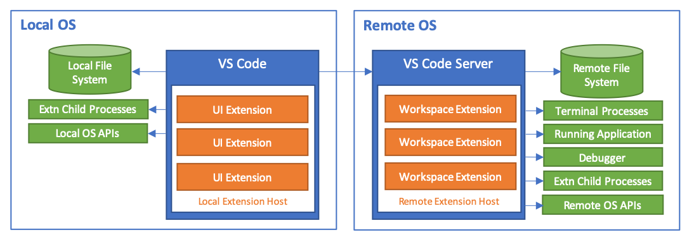
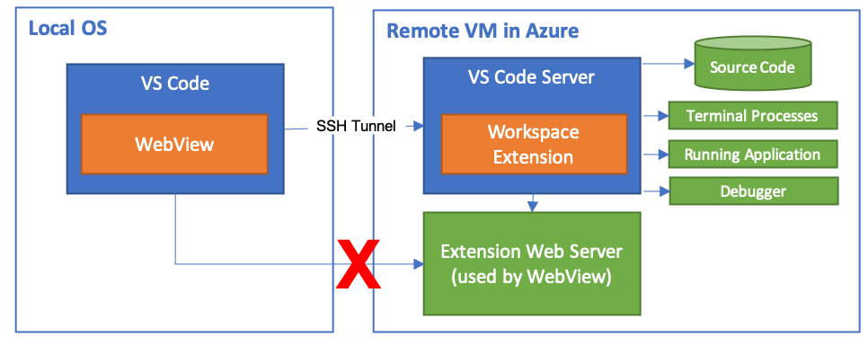
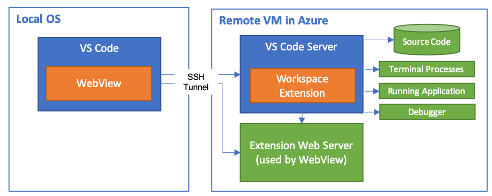

# 支持远程开发和 GitHub Codespaces

**[Visual Studio Code 远程开发](/docs/remote/remote-overview)** 允许你透明地与其他机器（虚拟或物理）上的源代码和运行时环境进行交互。**[GitHub Codespaces](https://github.com/features/codespaces)** 是一项托管云环境服务，扩展了这些能力，可从 VS Code 和基于浏览器的编辑器访问。

为了确保性能，远程开发和 GitHub Codespaces 都会透明地在远程运行某些 VS Code 扩展。然而，这可能对扩展的工作方式产生微妙的影响。虽然许多扩展无需修改即可正常工作，但你可能需要进行一些更改以确保你的扩展在所有环境中都能正常运行，不过这些更改通常很小。

本文概述了扩展作者在支持远程开发和 Codespaces 时需要了解的内容，包括扩展[架构](#架构和扩展类型)、如何在远程工作区或 Codespaces 中[调试扩展](#调试扩展)，以及[扩展无法正常工作时的建议](#常见问题)。

## 架构和扩展类型

为了让远程开发或 Codespaces 的使用对用户尽可能透明，VS Code 区分了两种类型的扩展：

- **UI 扩展**：这些扩展贡献于 VS Code 用户界面，始终在用户的本地机器上运行。UI 扩展无法直接访问远程工作区中的文件，也无法运行安装在该工作区或机器上的脚本/工具。UI 扩展的例子包括：主题、代码片段、语言语法和快捷键映射。

- **工作区扩展**：这些扩展运行在工作区所在的同一台机器上。在本地工作区中，工作区扩展运行在本地机器上。在远程工作区或使用 Codespaces 时，工作区扩展运行在远程机器/环境中。工作区扩展可以访问工作区中的文件，以提供丰富的多文件语言服务、调试器支持，或对工作区中的多个文件执行复杂操作（直接操作或通过调用脚本/工具）。虽然工作区扩展不以修改 UI 为重点，但它们也可以贡献资源管理器、视图和其他 UI 元素。

当用户安装扩展时，VS Code 会根据其类型自动将其安装到正确的位置。如果扩展可以以任一类型运行，VS Code 会尝试选择当前情况下的最优方案；UI 扩展将在 VS Code 的[本地 Extension Host](/vscode/extension/advanced-topics/extension-host) 中运行，而工作区扩展将在一个位于小型 [**VS Code Server**](/docs/remote/vscode-server) 内的**远程 Extension Host** 中运行（如果存在于远程工作区），否则如果存在于本地，则将在 VS Code 的本地 Extension Host 中运行。为确保最新的 VS Code 客户端功能可用，服务器版本需要与 VS Code 客户端版本完全匹配。因此，当你在容器、远程 SSH 主机、Codespaces 或 Windows Subsystem for Linux (WSL) 中打开文件夹时，远程开发或 GitHub Codespaces 扩展会自动安装（或更新）该服务器。（VS Code 也会自动管理服务器的启动和停止，因此用户感知不到它的存在。）



VS Code API 被设计为在从 UI 扩展或工作区扩展调用时，能自动在正确的机器（本地或远程）上运行。然而，如果你的扩展使用了 VS Code 未提供的 API——例如使用 Node API 或运行 shell 脚本——在远程运行时可能无法正常工作。我们建议你测试扩展的所有功能在本地和远程工作区中都能正常工作。

## 调试扩展

虽然你可以[在远程环境中安装扩展的开发版本](#安装扩展的开发版本)进行测试，但如果遇到问题，你很可能希望直接在远程环境中调试扩展。本节将介绍如何在 [GitHub Codespaces](#使用-github-codespaces-调试)、[本地容器](#在自定义开发容器中调试)、[SSH 主机](#通过-ssh-调试)或 [WSL](#通过-wsl-调试) 中编辑、启动和调试你的扩展。

通常，测试的最佳起点是使用限制端口访问的远程环境（例如 Codespaces、容器或具有严格防火墙的远程 SSH 主机），因为能在这些环境中正常工作的扩展通常也能在限制较少的环境（如 WSL）中正常工作。

### 使用 GitHub Codespaces 调试

在 [GitHub Codespaces](https://docs.github.com/github/developing-online-with-codespaces) 预览版中调试扩展可能是一个很好的起点，因为你既可以使用 VS Code，也可以使用基于浏览器的 Codespaces 编辑器进行测试和故障排除。如果愿意，你也可以使用[自定义开发容器](#在自定义开发容器中调试)。

请按以下步骤操作：

1. 在 GitHub 上导航到包含你扩展的仓库，然后[在 Codespace 中打开它](https://docs.github.com/github/developing-online-with-codespaces/creating-a-codespace)以便在基于浏览器的编辑器中工作。如果你更喜欢的话，也可以[在 VS Code 中打开该 Codespace](https://docs.github.com/github/developing-online-with-codespaces/using-codespaces-in-visual-studio-code)。

2. 虽然 GitHub Codespaces 的默认镜像应该已经包含大多数扩展所需的先决条件，但你可以在新的 VS Code 终端窗口（`kb(workbench.action.terminal.new)`）中安装任何其他所需的依赖（例如使用 `yarn install` 或 `sudo apt-get`）。

3. 最后，按 `kb(workbench.action.debug.start)` 或使用 **运行和调试** 视图在 Codespace 内启动扩展。

    > **注意：** 你将无法在出现的窗口中打开扩展源代码文件夹，但可以打开子文件夹或 Codespace 中的其他位置。

出现的扩展开发宿主窗口将包含你的扩展，该扩展运行在 Codespace 中并已附加调试器。

### 在自定义开发容器中调试

请按以下步骤操作：

1. 要在本地使用开发容器，请[安装并配置 Dev Containers 扩展](/docs/devcontainers/containers#getting-started)，然后使用 **文件 > 打开... / 打开文件夹...** 在 VS Code 中本地打开源代码。如果要使用 Codespaces，请在 GitHub 上导航到包含你扩展的仓库，然后[在 Codespace 中打开它](https://docs.github.com/github/developing-online-with-codespaces/creating-a-codespace)以便在基于浏览器的编辑器中工作。如果你更喜欢的话，也可以[在 VS Code 中打开该 Codespace](https://docs.github.com/github/developing-online-with-codespaces/using-codespaces-in-visual-studio-code)。

2. 从命令面板（`kbstyle(F1)`）中选择 **Dev Containers: 添加开发容器配置文件...** 或 **Codespaces: 添加开发容器配置文件...**，然后选择 **Node.js & TypeScript**（如果你不使用 TypeScript，则选择 Node.js）来添加所需的容器配置文件。

3. **可选：** 此命令运行后，你可以修改 `.devcontainer` 文件夹的内容以包含额外的构建或运行时要求。详情请参阅深入的[创建开发容器](/docs/devcontainers/create-dev-container)文档。

4. 运行 **Dev Containers: 在容器中重新打开** 或 **Codespaces: 添加开发容器配置文件...**，稍等片刻，VS Code 将设置好容器并建立连接。然后你就可以像在本地一样在容器内开发你的源代码了。

5. 在新的 VS Code 终端窗口（`kb(workbench.action.terminal.new)`）中运行 `yarn install` 或 `npm install`，确保安装了 Linux 版本的 Node.js 原生依赖。你也可以安装其他操作系统或运行时依赖，但最好将这些添加到 `.devcontainer/Dockerfile` 中，这样在重建容器时它们仍然可用。

6. 最后，按 `kb(workbench.action.debug.start)` 或使用 **运行和调试** 视图在同一个容器内启动扩展并附加调试器。

    > **注意：** 你将无法在出现的窗口中打开扩展源代码文件夹，但可以打开子文件夹或容器中的其他位置。

出现的扩展开发宿主窗口将包含你的扩展，该扩展运行在你在第 2 步定义的容器中并已附加调试器。

### 通过 SSH 调试

请按以下步骤操作：

1. [安装并配置 Remote - SSH 扩展](/docs/remote/ssh#getting-started)后，在 VS Code 中从命令面板（`kbstyle(F1)`）选择 **Remote-SSH: 连接到主机...** 来连接到主机。

2. 连接后，使用 **文件 > 打开... / 打开文件夹...** 选择包含你扩展源代码的远程文件夹，或从命令面板（`kbstyle(F1)`）选择 **Git: 克隆** 将其克隆并在远程主机上打开。

3. 在新的 VS Code 终端窗口（`kb(workbench.action.terminal.new)`）中安装可能缺少的依赖（例如使用 `yarn install` 或 `apt-get`）。

4. 最后，按 `kb(workbench.action.debug.start)` 或使用 **运行和调试** 视图在远程主机上启动扩展并附加调试器。

    > **注意：** 你将无法在出现的窗口中打开扩展源代码文件夹，但可以打开子文件夹或 SSH 主机上的其他位置。

出现的扩展开发宿主窗口将包含你的扩展，该扩展运行在 SSH 主机上并已附加调试器。

### 通过 WSL 调试

请按以下步骤操作：

1. [安装并配置 WSL 扩展](/docs/remote/wsl)后，在 VS Code 中从命令面板（`kbstyle(F1)`）选择 **WSL: 新窗口**。

2. 在出现的新窗口中，使用 **文件 > 打开... / 打开文件夹...** 选择包含你扩展源代码的远程文件夹，或从命令面板（`kbstyle(F1)`）选择 **Git: 克隆** 将其克隆并在 WSL 中打开。

    > **提示：** 你可以选择 `/mnt/c` 文件夹来访问 Windows 侧已克隆的源代码。

3. 在新的 VS Code 终端窗口（`kb(workbench.action.terminal.new)`）中安装可能缺少的依赖（例如使用 `apt-get`）。你至少需要运行 `yarn install` 或 `npm install` 来确保有 Linux 版本的原生 Node.js 依赖可用。

4. 最后，按 `kb(workbench.action.debug.start)` 或使用 **运行和调试** 视图启动扩展并附加调试器，就像在本地操作一样。

    > **注意：** 你将无法在出现的窗口中打开扩展源代码文件夹，但可以打开子文件夹或 WSL 中的其他位置。

出现的扩展开发宿主窗口将包含你的扩展，该扩展运行在 WSL 中并已附加调试器。

## 安装扩展的开发版本

无论何时 VS Code 自动在 SSH 主机、容器或 WSL 中安装扩展，或通过 GitHub Codespaces 安装扩展时，都会使用 Marketplace 版本（而不是已在本地机器上安装的版本）。

虽然在大多数情况下这是合理的，但你可能希望使用（或分享）未发布的扩展版本进行测试，而无需设置调试环境。要安装未发布的扩展版本，你可以将扩展打包为 `VSIX`，然后手动将其安装到已连接到远程运行环境的 VS Code 窗口中。

请按以下步骤操作：

1. 如果这是一个已发布的扩展，你可能需要在 `settings.json` 中添加 `"extensions.autoUpdate": false` 以防止其自动更新到最新的 Marketplace 版本。
2. 接下来，使用 `vsce package` 将你的扩展打包为 VSIX。
3. 连接到 [Codespace](https://docs.github.com/github/developing-online-with-codespaces)、[Dev Containers](/docs/devcontainers/containers)、[SSH 主机](/docs/remote/ssh)或 [WSL 环境](/docs/remote/wsl)。
4. 使用扩展视图 **更多操作**（`...`）菜单中的 **从 VSIX 安装...** 命令将扩展安装到此特定窗口中（而非本地窗口）。
5. 在提示时重新加载。

> **提示：** 安装后，你可以使用 **开发者：显示正在运行的扩展** 命令来查看 VS Code 是在本地还是远程运行该扩展。

## 处理远程扩展的依赖关系

扩展可以依赖其他扩展来获取 API。例如：

- 扩展可以从其 `activate` 函数中导出 API。
- 此 API 将可供在同一 Extension Host 中运行的所有扩展使用。
- 消费方扩展在其 `package.json` 中使用 `extensionDependencies` 属性声明对提供方扩展的依赖。

当所有扩展都在本地运行并共享同一 Extension Host 时，扩展依赖关系可以正常工作。

在远程场景中，远程运行的扩展可能对本地运行的扩展存在依赖关系。例如，本地扩展暴露了一个对远程扩展功能至关重要的命令。在这种情况下，我们建议远程扩展将本地扩展声明为 `extensionDependency`，但问题在于这两个扩展运行在不同的 Extension Host 上，这意味着提供方的 API 对消费方不可用。因此，要求提供方扩展在其 `package.json` 中使用 `"api": "none"` 来完全放弃导出任何 API 的能力。扩展之间仍然可以通过 VS Code 命令（异步方式）进行通信。

这可能看起来是对提供方扩展过于严格的限制，但使用 `"api": "none"` 的扩展只是放弃了从其 `activate` 方法返回 API 的能力。在其他 Extension Host 上执行的消费方扩展仍然可以依赖它们，并且会被正常激活。

## 常见问题

VS Code 的 API 被设计为自动在正确的位置运行，无论你的扩展实际位于何处。尽管如此，有一些 API 可以帮助你避免意外行为。

### 错误的执行位置

如果你的扩展未按预期运行，可能是因为它在错误的位置执行。最常见的情况是扩展在远程运行而你期望它只在本地运行。你可以从命令面板（`kbstyle(F1)`）使用 **开发者：显示正在运行的扩展** 命令来查看扩展的运行位置。

如果 **开发者：显示正在运行的扩展** 命令显示某个 UI 扩展被错误地当作工作区扩展处理，或者反之，请尝试在扩展的 [package.json](/vscode/extension/get-started/extension-anatomy#extension-manifest) 中设置 `extensionKind` 属性，如[扩展类型部分](/vscode/extension/advanced-topics/extension-host#首选扩展位置)所述。

你可以通过 `remote.extensionKind` [设置](/docs/configure/settings)快速**测试**更改扩展类型的效果。此设置是扩展 ID 到扩展类型的映射。例如，如果你想强制将 [Azure Databases](https://marketplace.visualstudio.com/items?itemName=ms-azuretools.vscode-cosmosdb) 扩展设为 UI 扩展（而非其默认的工作区类型），并将 [Remote - SSH: 编辑配置文件](https://marketplace.visualstudio.com/items?itemName=ms-vscode-remote.remote-ssh-edit) 扩展设为工作区扩展（而非其默认的 UI 类型），你可以这样设置：

```json
{
  "remote.extensionKind": {
      "ms-azuretools.vscode-cosmosdb": ["ui"],
      "ms-vscode-remote.remote-ssh-edit": ["workspace"]
  }
}
```

使用 `remote.extensionKind` 可以让你快速测试已发布版本的扩展，而无需修改其 `package.json` 并重新构建。

### 持久化扩展数据或状态

在某些情况下，你的扩展可能需要持久化一些不适合存放在 `settings.json` 或独立的工作区配置文件（例如 `.eslintrc`）中的状态信息。为解决此问题，VS Code 在激活时传递给扩展的 `vscode.ExtensionContext` 对象上提供了一组实用的存储属性。如果你的扩展已经使用了这些属性，那么无论在哪里运行都应继续正常工作。

然而，如果你的扩展依赖于当前 VS Code 的路径约定（例如 `~/.vscode`）或某些操作系统文件夹（例如 Linux 上的 `~/.config/Code`）来持久化数据，你可能会遇到问题。幸运的是，更新扩展以避免这些问题应该很简单。

如果你需要持久化简单的键值对，可以分别使用 `vscode.ExtensionContext.workspaceState` 或 `vscode.ExtensionContext.globalState` 来存储工作区特定或全局的状态信息。如果你的数据比键值对更复杂，`globalStorageUri` 和 `storageUri` 属性提供了"安全"的 URI，你可以用来在文件中读写全局的或工作区特定的信息。

使用这些 API：

```TypeScript
import * as vscode from 'vscode';

export function activate(context: vscode.ExtensionContext) {
    context.subscriptions.push(
        vscode.commands.registerCommand('myAmazingExtension.persistWorkspaceData', async () => {
            if (!context.storageUri) {
                return;
            }

            // 如果扩展的工作区存储文件夹不存在，则创建它
            try {
                // 当文件夹不存在时，会抛出错误
                await vscode.workspace.fs.stat(context.storageUri);
            } catch {
                // 创建扩展的工作区存储文件夹
                await vscode.workspace.fs.createDirectory(context.storageUri)
            }

            const workspaceData = vscode.Uri.joinPath(context.storageUri, 'workspace-data.json');
            const writeData = new TextEncoder().encode(JSON.stringify({ now: Date.now() }));
            vscode.workspace.fs.writeFile(workspaceData, writeData);
        }
    ));

    context.subscriptions.push(
        vscode.commands.registerCommand('myAmazingExtension.persistGlobalData', async () => {

        if (!context.globalStorageUri) {
            return;
        }

        // 如果扩展的全局（跨工作区）文件夹不存在，则创建它
        try {
            // 当文件夹不存在时，会抛出错误
            await vscode.workspace.fs.stat(context.globalStorageUri);
        } catch {
            await vscode.workspace.fs.createDirectory(context.globalStorageUri)
        }

        const workspaceData = vscode.Uri.joinPath(context.globalStorageUri, 'global-data.json');
        const writeData = new TextEncoder().encode(JSON.stringify({ now: Date.now() }));
        vscode.workspace.fs.writeFile(workspaceData, writeData);
    ));
}
```

### 在不同机器间同步用户全局状态

如果你的扩展需要在不同机器间保留某些用户状态，请使用 `vscode.ExtensionContext.globalState.setKeysForSync` 将状态提供给[设置同步](/docs/configure/settings-sync)。这有助于避免在多台机器上向用户重复显示相同的欢迎页面或更新页面。

在[扩展能力](/vscode/extension/extension-capabilities/common-capabilities#data-storage)主题中有一个使用 `setKeysforSync` 的示例。

### 持久化机密信息

如果你的扩展需要持久化密码或其他机密信息，你可能需要使用 Visual Studio Code 的 [SecretStorage API](https://code.visualstudio.com/api/references/vscode-api#SecretStorage)，它提供了一种以加密为基础在文件系统上安全存储文本的方式。例如，在桌面端，我们使用 Electron 的 [safeStorage API](https://www.electronjs.org/docs/latest/api/safe-storage) 在将机密信息存储到文件系统之前对其进行加密。该 API 始终将机密信息存储在客户端侧，但无论你的扩展在哪里运行，都可以使用此 API 并获取相同的机密值。

>**注意**：此 API 是持久化密码和机密信息的推荐方式。你**不应该**使用 `vscode.ExtensionContext.workspaceState` 或 `vscode.ExtensionContext.globalState` 存储机密信息，因为这些 API 以明文方式存储数据。

以下是一个示例：

```typescript
import * as vscode from 'vscode';

export function activate(context: vscode.ExtensionContext) {
    // ...
    const myApiKey = context.secrets.get('apiKey');
    // ...
    context.secrets.delete('apiKey');
    // ...
    context.secrets.store('apiKey', myApiKey);
}
```

### 使用剪贴板

过去，扩展作者使用 `clipboardy` 等 Node.js 模块来与剪贴板交互。遗憾的是，如果你在工作区扩展中使用这些模块，它们将使用远程剪贴板而非用户本地的剪贴板。VS Code 剪贴板 API 解决了这个问题。无论调用它的扩展类型如何，它始终在本地运行。

要在扩展中使用 VS Code 剪贴板 API：

```typescript
import * as vscode from 'vscode';

export function activate(context: vscode.ExtensionContext) {
    context.subscriptions.push(vscode.commands.registerCommand('myAmazingExtension.clipboardIt', async () => {
        // 从剪贴板读取
        const text = await vscode.env.clipboard.readText();

        // 写入剪贴板
        await vscode.env.clipboard.writeText(`看起来你正在复制"${text}"。需要帮助吗？`);
    }));
}
```

### 在本地浏览器或应用中打开内容

通过生成进程或使用 `opn` 等模块来启动浏览器或其他应用程序以打开特定 URI，在本地场景下可能效果很好，但工作区扩展运行在远程，这可能导致应用程序在错误的一侧启动。VS Code 远程开发**部分**填充了 `opn` Node 模块以允许现有扩展正常工作。你可以使用 URI 调用该模块，VS Code 会使该 URI 的默认应用程序出现在客户端侧。然而，这不是一个完整的实现，不支持选项参数，也不返回 `child_process` 对象。

与其依赖第三方 Node 模块，我们建议扩展使用 `vscode.env.openExternal` 方法在本地操作系统上启动给定 URI 的默认注册应用程序。更好的是，`vscode.env.openExternal` **会自动进行 localhost 端口转发！** 你可以使用它指向远程机器或 Codespace 上的本地 Web 服务器，即使该端口在外部被阻止也能提供服务。

> **注意：** 目前 Codespaces 基于浏览器的编辑器中的转发机制仅支持 **http 和 https 请求**。但是，当你从 VS Code 连接到 Codespace 时，可以与任何 TCP 连接进行交互。

要使用 `vscode.env.openExternal` API：

```typescript
import * as vscode from 'vscode';

export async function activate(context: vscode.ExtensionContext) {
    context.subscriptions.push(vscode.commands.registerCommand('myAmazingExtension.openExternal', () => {

        // 示例 1 - 在默认浏览器中打开 VS Code 主页。
        vscode.env.openExternal(vscode.Uri.parse('https://code.visualstudio.com'));

        // 示例 2 - 打开一个自动转发的 localhost HTTP 服务器。
        vscode.env.openExternal(vscode.Uri.parse('http://localhost:3000'));

        // 示例 3 - 打开默认的邮件应用程序。
        vscode.env.openExternal(vscode.Uri.parse('mailto:<在此填写你的邮箱>'));
    }));
}
```

### 转发 localhost

虽然 [`vscode.env.openExternal` 中的 localhost 转发机制很有用](#在本地浏览器或应用中打开内容)，但在某些情况下你可能希望进行转发但不实际启动新的浏览器窗口或应用程序。这时 `vscode.env.asExternalUri` API 就派上用场了。

> **注意：** 目前 Codespaces 基于浏览器的编辑器中的转发机制仅支持 **http 和 https 请求**。但是，当你从 VS Code 连接到 Codespace 时，可以与任何 TCP 连接进行交互。

要使用 `vscode.env.asExternalUri` API：

```typescript
import * as vscode from 'vscode';
import { getExpressServerPort } from './server';

export async function activate(context: vscode.ExtensionContext) {

    const dynamicServerPort = await getWebServerPort();

    context.subscriptions.push(vscode.commands.registerCommand('myAmazingExtension.forwardLocalhost', async () =>

        // 使端口在本地可用并获取完整的 URI
        const fullUri = await vscode.env.asExternalUri(
            vscode.Uri.parse(`http://localhost:${dynamicServerPort}`));

        // ... 使用 fullUri 做些什么 ...

    }));
}
```

需要注意的是，API 返回的 URI **可能根本不引用 localhost**，因此你应该完整使用它。这在 Codespaces 基于浏览器的编辑器中尤为重要，因为那里无法使用 localhost。

### 回调和 URI 处理程序

`vscode.window.registerUriHandler` API 允许你的扩展注册一个自定义 URI，当该 URI 在浏览器中打开时，会触发扩展中的回调函数。注册 URI 处理程序的常见用例是实现使用 [OAuth 2.0](https://oauth.net/2/) 身份验证提供程序（例如 Azure AD）的服务登录。不过，它也可用于任何你希望外部应用程序或浏览器向你的扩展发送信息的场景。

VS Code 中的远程开发和 Codespaces 扩展会透明地将 URI 传递给你的扩展，无论它实际运行在哪里（本地还是远程）。然而，`vscode://` URI 在 Codespaces 基于浏览器的编辑器中不起作用，因为在这种编辑器中打开这些 URI 会尝试将它们传递给本地 VS Code 客户端而非基于浏览器的编辑器。幸运的是，这可以通过 `vscode.env.asExternalUri` API 轻松解决。

让我们结合 `vscode.window.registerUriHandler` 和 `vscode.env.asExternalUri` 来编写一个 OAuth 身份验证回调的示例：

```typescript
import * as vscode from 'vscode';

// 这是 package.json 中的 ${publisher}.${name}
const extensionId = 'my.amazing-extension';

export async function activate(context: vscode.ExtensionContext) {

    // 为身份验证回调注册 URI 处理程序
    vscode.window.registerUriHandler({
        handleUri(uri: vscode.Uri): vscode.ProviderResult<void> {

            // 在此处添加身份验证完成后的处理代码
            if (uri.path === '/auth-complete') {
                vscode.window.showInformationMessage('登录成功！');
            }

        }
    });

    // 注册登录命令
    context.subscriptions.push(vscode.commands.registerCommand(`${extensionId}.signin`, async () => {

        // 获取处理程序的外部可访问回调 URI，供身份验证提供程序使用
        const callbackUri = await vscode.env.asExternalUri(vscode.Uri.parse(`${vscode.env.uriScheme}://${extensionId}/auth-complete`));

        // 在此处添加与身份验证提供程序集成的代码 - 这里我们模拟一下
        vscode.env.clipboard.writeText(callbackUri.toString());
        await vscode.window.showInformationMessage('请将剪贴板中复制的 URI 在浏览器窗口中打开以完成授权。');
    }));
}
```

在 VS Code 中运行此示例时，它会设置一个 `vscode://` 或 `vscode-insiders://` URI，可用作身份验证提供程序的回调。在 Codespaces 基于浏览器的编辑器中运行时，它会设置一个 `https://*.github.dev` URI，无需任何代码更改或特殊条件。

虽然 OAuth 超出了本文档的范围，但请注意，如果你将此示例适配到真实的身份验证提供程序，可能需要在提供程序前构建一个代理服务。这是因为并非所有提供程序都允许 `vscode://` 回调 URI，也并非所有提供程序都允许通过 HTTPS 使用通配符主机名作为回调。我们还建议尽可能使用 [OAuth 2.0 Authorization Code with PKCE 流程](https://oauth.net/2/pkce/)（例如 Azure AD 支持 PKCE），以提高回调的安全性。

### 在远程运行或 Codespaces 浏览器编辑器中调整行为

在某些情况下，你的工作区扩展可能需要在远程运行时调整行为。在其他情况下，你可能希望在 Codespaces 基于浏览器的编辑器中运行时调整其行为。VS Code 提供了三个 API 来检测这些情况：`vscode.env.uiKind`、`extension.extensionKind` 和 `vscode.env.remoteName`。

接下来，你可以按如下方式使用这三个 API：

```typescript
import * as vscode from 'vscode';

export async function activate(context: vscode.ExtensionContext) {

    // extensionKind 在本地运行时返回 ExtensionKind.UI，因此可以用来检测远程运行
    const extension = vscode.extensions.getExtension('your.extensionId');
    if (extension.extensionKind === vscode.ExtensionKind.Workspace) {
        vscode.window.showInformationMessage('我正在远程运行！');
    }

    // Codespaces 基于浏览器的编辑器将为 uiKind 返回 UIKind.Web
    if (vscode.env.uiKind === vscode.UIKind.Web) {
        vscode.window.showInformationMessage('我正在 Codespaces 浏览器编辑器中运行！');
    }

    // 如果使用的是本地工作区，VS Code 将为 remoteName 返回 undefined
    if (typeof(vscode.env.remoteName) === 'undefined') {
        vscode.window.showInformationMessage('当前未连接到远程工作区。');
    }

}
```

### 使用命令在扩展之间通信

某些扩展在激活时返回 API，供其他扩展使用（通过 `vscode.extension.getExtension(extensionName).exports`）。虽然当所有相关扩展都在同一侧（全部是 UI 扩展或全部是工作区扩展）时这可以正常工作，但在 UI 扩展和工作区扩展之间则无法工作。

幸运的是，VS Code 会自动将执行的命令路由到正确的扩展，无论其位置如何。你可以自由调用任何命令（包括其他扩展提供的命令），而无需担心影响。

如果你有一组需要相互交互的扩展，使用私有命令暴露功能可以帮助你避免意外影响。但是，你作为参数传入的任何对象在传输前都会被"序列化"（`JSON.stringify`），因此对象不能包含循环引用，并且在另一端将变成"普通的 JavaScript 对象"。

例如：

```typescript
import * as vscode from 'vscode';

export async function activate(context: vscode.ExtensionContext) {
    // 注册私有 echo 命令
    const echoCommand = vscode.commands.registerCommand('_private.command.called.echo',
        (value: string) => {
            return value;
        }
    );
    context.subscriptions.push(echoCommand);
}
```

有关使用命令的详情，请参阅[命令 API 指南](/vscode/extension/extension-guides/command)。

## 使用 Webview API

与剪贴板 API 类似，[Webview API](/vscode/extension/extension-guides/webview) 始终在用户的本地机器或浏览器中运行，即使从工作区扩展使用也是如此。这意味着许多基于 Webview 的扩展应该可以直接工作，即使在远程工作区或 Codespaces 中使用也是如此。但是，有一些注意事项需要了解，以确保你的 Webview 扩展在远程运行时能正常工作。

### 始终使用 asWebviewUri

你应该使用 `asWebviewUri` API 来管理扩展资源。使用此 API 而非硬编码 `vscode-resource://` URI 是确保 Codespaces 基于浏览器的编辑器能与你的扩展配合工作的必要条件。详情请参阅 [Webview API](/vscode/extension/extension-guides/webview) 指南，这里有一个简短的示例。

你可以在内容中按如下方式使用该 API：

```typescript
// 创建 Webview
const panel = vscode.window.createWebviewPanel(
    'catWebview',
    'Cat Webview',
    vscode.ViewColumn.One);

// 获取内容 URI
const catGifUri = panel.webview.asWebviewUri(
    vscode.Uri.joinPath(context.extensionUri, 'media', 'cat.gif'));

// 在你的内容中引用它
panel.webview.html = `<!DOCTYPE html>
<html>
<body>
    
</body>
</html>`;
```

### 使用消息传递 API 实现动态 Webview 内容

VS Code Webview 包含一个[消息传递](/vscode/extension/extension-guides/webview#scripts-and-message-passing) API，允许你动态更新 Webview 内容，而无需使用本地 Web 服务器。即使你的扩展运行了一些本地 Web 服务，你希望通过它们来更新 Webview 内容，也可以从扩展本身进行操作，而不是直接从 HTML 内容中操作。

这是远程开发和 GitHub Codespaces 的一个重要模式，可确保你的 Webview 代码在 VS Code 和 Codespaces 基于浏览器的编辑器中都能正常工作。

**为什么使用消息传递而不是 localhost Web 服务器？**

另一种方式是在 `iframe` 中提供 Web 内容，或让 Webview 内容直接与 localhost 服务器交互。遗憾的是，默认情况下，Webview 中的 `localhost` 会解析到开发者的本地机器。这意味着对于远程运行的工作区扩展，其创建的 Webview 将无法访问扩展启动的本地服务器。即使你使用机器的 IP，你连接的端口在云 VM 或容器中通常也会被默认阻止。即使这在 VS Code 中可行，在 Codespaces 基于浏览器的编辑器中也不行。

以下是使用 Remote - SSH 扩展时的问题示意图，但该问题同样存在于 Dev Containers 和 GitHub Codespaces 中：



如果可能，**你应该避免这样做**，因为这会使你的扩展变得复杂得多。[消息传递](/vscode/extension/extension-guides/webview#scripts-and-message-passing) API 可以实现相同的用户体验，而不会带来这些麻烦。扩展本身运行在远程的 VS Code Server 上，因此可以透明地与扩展启动的任何 Web 服务器交互，并响应从 Webview 传来的任何消息。

### 在 Webview 中使用 localhost的替代方案

如果由于某些原因无法使用[消息传递](/vscode/extension/extension-guides/webview#scripts-and-message-passing) API，有两个选项可以在 VS Code 的远程开发和 GitHub Codespaces 扩展中使用。

每个选项都允许 Webview 内容通过 VS Code 与 VS Code Server 通信所使用的相同通道进行路由。例如，如果我们针对 Remote - SSH 更新上一节中的示意图，效果如下：



### 方案 1 - 使用 asExternalUri

VS Code 1.40 引入了 `vscode.env.asExternalUri` API，允许扩展以编程方式远程转发本地 `http` 和 `https` 请求。当你的扩展在 VS Code 中运行时，你可以使用此 API 从 Webview 转发请求到 `localhost` Web 服务器。

使用该 API 获取 iframe 的完整 URI 并将其添加到 HTML 中。你还需要在 Webview 中启用脚本并向 HTML 内容添加 CSP。

```typescript
// 使用 asExternalUri 获取 Web 服务器的 URI
const dynamicWebServerPort = await getWebServerPort();
const fullWebServerUri = await vscode.env.asExternalUri(
        vscode.Uri.parse(`http://localhost:${dynamicWebServerPort}`)
    );

// 创建 Webview
const panel = vscode.window.createWebviewPanel(
    'asExternalUriWebview',
    'asExternalUri 示例',
    vscode.ViewColumn.One, {
        enableScripts: true
    });

const cspSource = panel.webview.cspSource;
panel.webview.html = `<!DOCTYPE html>
        <head>
            <meta
                http-equiv="Content-Security-Policy"
                content="default-src 'none'; frame-src ${fullWebServerUri} ${cspSource} https:; img-src ${cspSource} https:; script-src ${cspSource}; style-src ${cspSource};"
            />
        </head>
        <body>
        <!-- Web 服务器中的所有内容必须放在 iframe 中 -->
        <iframe src="${fullWebServerUri}">
    </body>
    </html>`;
```

请注意，上面示例中 `iframe` 中提供的任何 HTML 内容**需要使用相对路径**，而不是硬编码 `localhost`。

### 方案 2 - 使用端口映射

如果你**不打算支持 Codespaces 基于浏览器的编辑器**，可以使用 Webview API 中提供的 `portMapping` 选项。（此方法在 VS Code 客户端中使用 Codespaces 时也可行，但在浏览器中不行。）

要使用端口映射，在创建 Webview 时传入 `portMapping` 对象：

```typescript
const LOCAL_STATIC_PORT = 3000;
const dynamicServerPort = await getWebServerPort();

// 创建 Webview 并传入 portMapping
const panel = vscode.window.createWebviewPanel(
    'remoteMappingExample',
    '远程映射示例',
    vscode.ViewColumn.One, {
        portMapping: [
            // 将 Webview 中的 localhost:3000 映射到远程主机上的 Web 服务器端口
            { webviewPort: LOCAL_STATIC_PORT, extensionHostPort: dynamicServerPort }
        ]
    });

// 在 HTML 中引用的任何完整 URI 中使用该端口
panel.webview.html = `<!DOCTYPE html>
    <body>
        <!-- 这将解析到远程机器上的动态服务器端口 -->
        
    </body>
    </html>`;
```

在此示例中，无论是远程还是本地场景，对 `http://localhost:3000` 的任何请求都将自动映射到 Express.js Web 服务器运行的动态端口。

## 使用原生 Node.js 模块

与 VS Code 扩展捆绑（或为其动态获取）的原生模块必须[使用 Electron 的 `electron-rebuild`](https://electronjs.org/docs/tutorial/using-native-node-modules) 进行重新编译。然而，VS Code Server 运行的是标准版（非 Electron）的 Node.js，这可能导致二进制文件在远程使用时出现故障。

要解决此问题：

1. 包含（或动态获取）VS Code 附带的 Node.js "modules" 版本对应的两套二进制文件（Electron 和标准 Node.js）。
2. 检查 `vscode.extensions.getExtension('your.extensionId').extensionKind === vscode.ExtensionKind.Workspace`，根据扩展是在远程还是本地运行来设置正确的二进制文件。
3. 你可能还想同时添加对非 x86_64 目标和 Alpine Linux 的支持，方法是[遵循类似的逻辑](#支持非-x8664-主机或-alpine-linux-容器)。

你可以通过前往 **帮助 > 开发者工具** 并在控制台中输入 `process.versions.modules` 来查找 VS Code 使用的 "modules" 版本。然而，为了确保原生模块在不同 Node.js 环境中无缝工作，你可能需要针对你想要支持的所有 Node.js "modules" 版本和平台（Electron Node.js、官方 Node.js Windows/Darwin/Linux，所有版本）编译原生模块。[node-tree-sitter](https://github.com/tree-sitter/node-tree-sitter/releases/tag/v0.14.0) 模块就是一个做得很好的例子。

## 支持非 x86_64 主机或 Alpine Linux 容器

如果你的扩展完全用 JavaScript/TypeScript 编写，可能不需要做任何事情就能添加对其他处理器架构或基于 `musl` 的 Alpine Linux 的支持。

然而，如果你的扩展在 Debian 9+、Ubuntu 16.04+ 或 RHEL / CentOS 7+ 的远程 SSH 主机、容器或 WSL 上能正常工作，但在支持的非 x86_64 主机（例如 ARMv7l）或 Alpine Linux 容器上失败，则扩展可能包含 x86_64 `glibc` 特定的原生代码或运行时，它们在这些架构/操作系统上会失败。

例如，你的扩展可能只包含 x86_64 编译版本的原生模块或运行时。对于 Alpine Linux，包含的原生代码或运行时可能无法工作，因为 Alpine Linux (`musl`) 和其他发行版 (`glibc`) 之间 `libc` 的实现存在[根本性差异](https://wiki.musl-libc.org/functional-differences-from-glibc.html)。

要解决此问题：

1. 如果你动态获取编译后的代码，可以通过使用 `process.arch` 检测非 x86_64 目标并下载为正确架构编译的版本来添加支持。如果你改为在扩展中包含所有支持架构的二进制文件，可以使用此逻辑来选择正确的版本。

2. 对于 Alpine Linux，可以使用 `await fs.exists('/etc/alpine-release')` 检测操作系统，然后下载或使用适合基于 `musl` 操作系统的正确二进制文件。

3. 如果你不想支持这些平台，可以使用相同的逻辑来提供一个友好的错误消息。

需要注意的是，某些第三方 npm 模块包含可能导致此问题的原生代码。因此，在某些情况下你可能需要与 npm 模块作者合作以添加额外的编译目标。

## 避免使用 Electron 模块

虽然依赖内置的 Electron 或 VS Code 模块（非扩展 API 暴露的）可能很方便，但需要注意的是，VS Code Server 运行的是标准版（非 Electron）的 Node.js。这些模块在远程运行时会缺失。有少数例外情况，VS Code 中有特定代码使它们能够工作。

请使用基础的 Node.js 模块或扩展 VSIX 中的模块来避免这些问题。如果你确实需要使用 Electron 模块，请确保在模块缺失时有回退方案。

下面的示例将在找到时使用 Electron 的 `original-fs` Node 模块，找不到时回退到基础的 Node.js `fs` 模块。

```typescript
function requireWithFallback(electronModule: string, nodeModule: string) {
    try {
        return require(electronModule);
    }
    catch (err) { }
    return require(nodeModule);
}

const fs = requireWithFallback('original-fs', 'fs');
```

尽可能避免出现这种情况。

## 已知问题

有一些扩展问题可以通过为工作区扩展添加额外功能来解决。下表列出了正在考虑中的已知问题：

| 问题 | 描述 |
|---------|-------------|
| **无法从工作区扩展访问已连接的设备** | 访问本地连接设备的扩展在远程运行时将无法连接到这些设备。解决此问题的一种方法是创建一个配套的 UI 扩展，其职责是访问连接的设备并提供远程扩展也能调用的命令。<br>另一种方法是反向隧道，该方案正在 [VS Code 仓库的 issue](https://github.com/microsoft/vscode/issues/100222) 中跟踪。 |

## 问题和反馈

- 参阅[提示和技巧](/docs/remote/troubleshooting)或 [FAQ](/docs/remote/faq)。
- 在 [Stack Overflow](https://stackoverflow.com/questions/tagged/vscode-remote) 上搜索答案。
- [投票支持某个功能或提出新请求](https://aka.ms/vscode-remote/feature-requests)，搜索[已有 issue](https://aka.ms/vscode-remote/issues)，或[报告问题](https://aka.ms/vscode-remote/issues/new)。
- 创建供他人使用的[开发容器模板](https://containers.dev/templates)或[功能（Feature）](https://containers.dev/features)。
- 为[我们的文档](https://github.com/microsoft/vscode-docs)或 [VS Code](https://github.com/microsoft/vscode) 做贡献。
- 详情请参阅我们的[贡献指南](https://aka.ms/vscode-remote/contributing)。
