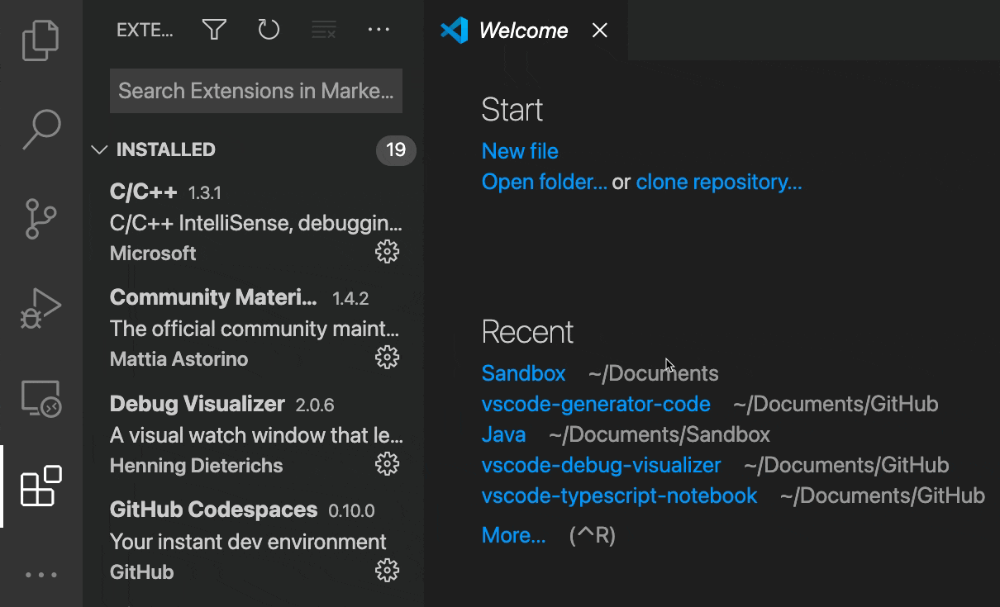

# 使用 Proposed API

在 Visual Studio Code，我们非常重视 Extension API 的兼容性。我们尽最大努力避免破坏性的 API 变更，扩展作者可以期望已发布的扩展能继续正常工作。然而，这也给我们带来了很大的限制：一旦引入某个 API，就无法再轻易地修改它。

Proposed API 为我们解决了这个问题。Proposed API 是一组已在 VS Code 中实现但尚未像稳定 API 那样公开给公众的不稳定 API。它们**可能会发生变化**，**仅在 Insiders 版本中可用**，并且**不应用于已发布的扩展中**。尽管如此，扩展作者可以在本地开发中测试这些新 API，并向 VS Code 团队提供反馈以帮助迭代 API 设计。最终，Proposed API 会逐步进入稳定 API，对所有扩展开放使用。

## 使用 Proposed API

以下是在本地扩展开发中测试 Proposed API 的步骤：

- 使用 VS Code 的 [Insiders](/insiders) 版本。
- 在 `package.json` 中添加 `"enabledApiProposals": ["<proposalName>"]`。
- 将对应的 [vscode.proposed.\<proposalName\>.d.ts](https://github.com/microsoft/vscode/blob/main/src/vscode-dts) 文件复制到项目的源代码目录中。

[@vscode/dts](https://github.com/microsoft/vscode-dts) CLI 工具可以帮你快速下载最新的 `vscode.proposed.<proposalName>.d.ts` 用于扩展开发。它会根据 `package.json` 中列出的 proposal 来下载对应的定义文件。

```bash
> npx @vscode/dts dev
Downloading vscode.proposed.languageStatus.d.ts
To:   /Users/Me/Code/MyExtension/vscode.proposed.languageStatus.d.ts
From: https://raw.githubusercontent.com/microsoft/vscode/main/src/vscode-dts/vscode.proposed.languageStatus.d.ts
Read more about proposed API at: https://code.visualstudio.com/api/advanced-topics/using-proposed-api
```

这里有一个使用 Proposed API 的示例：[proposed-api-sample](https://github.com/microsoft/vscode-extension-samples/tree/main/proposed-api-sample)。

## Proposed API 不兼容问题

在主分支上，`vscode.proposed.<proposalName>.d.ts` 始终与 `vscode.d.ts` 兼容。然而，当你将 `vscode.proposed.<proposal>.d.ts` 添加到使用 `@types/vscode` 的项目中时，最新的 `vscode.proposed.<proposal>.d.ts` 可能与 `@types/vscode` 中的版本不兼容。

你可以通过以下任一方式解决此问题：

- 移除对 `@types/vscode` 的依赖，使用 `npx @vscode/dts main` 从 `microsoft/vscode` 主分支下载 `vscode.d.ts`。
- 使用 `@types/vscode@<version>`，同时使用 `npx @vscode/dts dev <version>` 从 `microsoft/vscode` 的旧分支下载 `vscode.proposed.<proposal>.d.ts`。但请注意，API 可能在最新版 VS Code Insiders 中已经发生了变化。

## 分享使用 Proposed API 的扩展

虽然你不应该在 Marketplace 上发布使用 Proposed API 的扩展，但你仍然可以通过打包和分享的方式来将扩展分发给他人。

要打包扩展，你可以运行 `vsce package` 来创建扩展的 VSIX 文件。然后将此 VSIX 文件分享给他人，让他们在 VS Code 中安装该扩展。

要从 VSIX 文件安装扩展，请进入扩展视图，选择 **...** 省略号 **查看和更多操作** 按钮，然后选择 **从 VSIX 安装**。

下面的短视频演示了选择 **从 VSIX 安装** 菜单项的操作。



对于使用 Proposed API 的扩展，还需要几个额外的步骤才能启用你的扩展。从 VSIX 安装后，你需要在项目文件夹中通过命令行以 `code-insiders . --enable-proposed-api=<YOUR-EXTENSION-ID>` 的方式退出并重新启动 VS Code Insiders。

如果你希望在每次启动 VS Code Insiders 时都能使用基于 Proposed API 的扩展，可以运行 **首选项：配置运行时参数** 命令来编辑 `.vscode-insiders/argv.json` 文件，设置已启用的扩展列表。

```json
{
    ...
    "enable-proposed-api": ["<YOUR-EXTENSION-ID>"]
}
```
