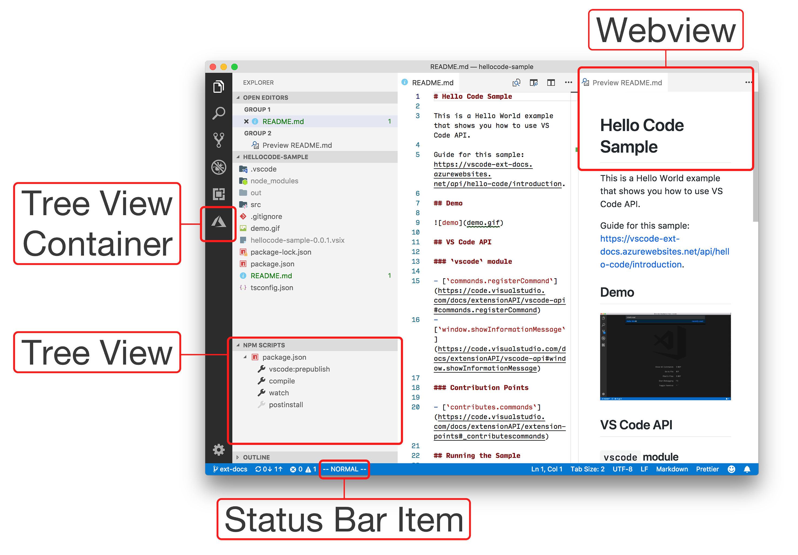

# 扩展工作台

"工作台"是指 Visual Studio Code 的整体 UI，包含以下 UI 组件：

- 标题栏
- 活动栏
- 侧边栏
- 面板
- 编辑器组
- 状态栏

VS Code 提供了多种 API，允许你在工作台中添加自己的组件。例如，在下图中：

- 活动栏：[Azure App Service 扩展](https://marketplace.visualstudio.com/items?itemName=ms-azuretools.vscode-azureappservice)添加了一个[视图容器](#views-container)
- 侧边栏：内置的 [NPM 扩展](https://github.com/microsoft/vscode/tree/main/extensions/npm)在资源管理器视图中添加了一个[树视图](#tree-view)
- 编辑器组：内置的 [Markdown 扩展](https://github.com/microsoft/vscode/tree/main/extensions/markdown-language-features)在编辑器组中其他编辑器旁边添加了一个 [Webview](#webview)
- 状态栏：[VSCodeVim 扩展](https://marketplace.visualstudio.com/items?itemName=vscodevim.vim)在状态栏中添加了一个[状态栏项](#status-bar-item)

## 视图容器

通过 [`contributes.viewsContainers`](/vscode/extension/references/contribution-points#contributes.viewsContainers) 扩展点，你可以添加新的视图容器，它们将显示在五个内置视图容器旁边。在[树视图](/vscode/extension/extension-guides/tree-view)主题中了解更多。

## 树视图

通过 [`contributes.views`](/vscode/extension/references/contribution-points#contributes.views) 扩展点，你可以添加新的视图，它们将显示在任何视图容器中。在[树视图](/vscode/extension/extension-guides/tree-view)主题中了解更多。

## Webview

Webview 是使用 HTML/CSS/JavaScript 构建的高度可定制视图。它们显示在编辑器组区域中的文本编辑器旁边。在 [Webview 指南](/vscode/extension/extension-guides/webview)中了解更多。

## 状态栏项

扩展可以创建自定义的 [`StatusBarItem`](/vscode/extension/references/vscode-api#StatusBarItem)，显示在状态栏中。状态栏项可以显示文本和图标，并在点击事件时运行命令。

- 显示文本和图标
- 点击时运行命令

你可以通过查看[状态栏扩展示例](https://github.com/microsoft/vscode-extension-samples/tree/main/statusbar-sample)了解更多。
