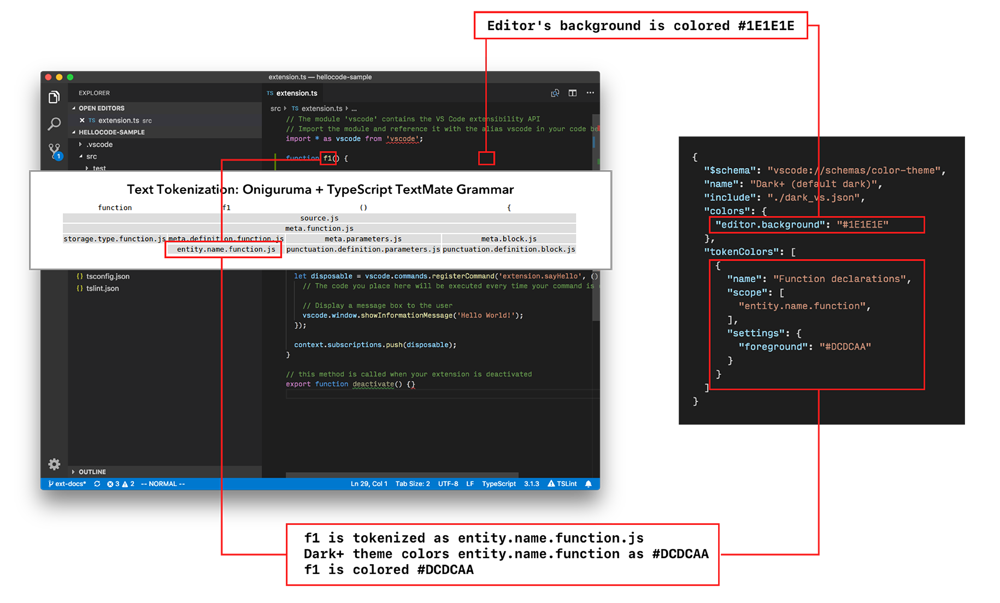
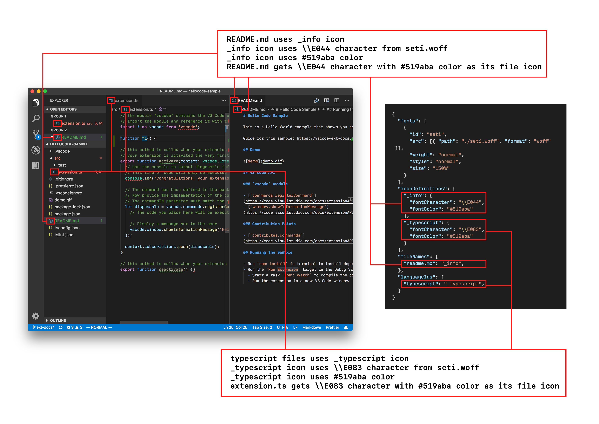

# 主题

在 Visual Studio Code 中，有三种类型的主题：

- **颜色主题**：将 UI 组件标识符和文本词元标识符映射到颜色。颜色主题允许你将喜欢的颜色应用到 VS Code UI 组件和编辑器中的文本。
- **文件图标主题**：将文件类型/文件名映射到图像。文件图标显示在 VS Code UI 的各个位置，例如文件资源管理器、快速打开列表和编辑器标签页。
- **产品图标主题**：在整个 UI 中使用的一组图标，从侧边栏、活动栏、状态栏到编辑器的字形边距。

## 颜色主题

如图所示，颜色主题为 UI 组件以及编辑器中的高亮定义了颜色：

- `colors` 映射控制 UI 组件的颜色。
- `tokenColors` 定义编辑器中高亮的颜色和样式。[语法高亮指南](/vscode/extension/language-extensions/syntax-highlight-guide)中有更多关于该主题的信息。
- `semanticTokenColors` 映射以及 `semanticHighlighting` 设置可以增强编辑器中的高亮效果。[语义高亮指南](/vscode/extension/language-extensions/semantic-highlight-guide)解释了相关的 API。

我们提供了[颜色主题指南](/vscode/extension/extension-guides/color-theme)和[颜色主题示例](https://github.com/microsoft/vscode-extension-samples/tree/main/theme-sample)，展示了如何创建主题。

## 文件图标主题

文件图标主题允许你：

- 创建从唯一文件图标标识符到图像或字体图标的映射。
- 通过文件名或文件语言类型将文件关联到这些唯一的文件图标标识符。

[文件图标主题指南](/vscode/extension/extension-guides/file-icon-theme)讨论了如何创建文件图标主题。

## 产品图标主题

产品图标主题允许你：

重新定义工作台中使用的所有内置图标。例如，筛选操作按钮和视图中的图标、状态栏中的图标、断点图标以及树形视图和编辑器中的折叠图标。

[产品图标主题指南](/vscode/extension/extension-guides/product-icon-theme)讨论了如何创建产品图标主题。
