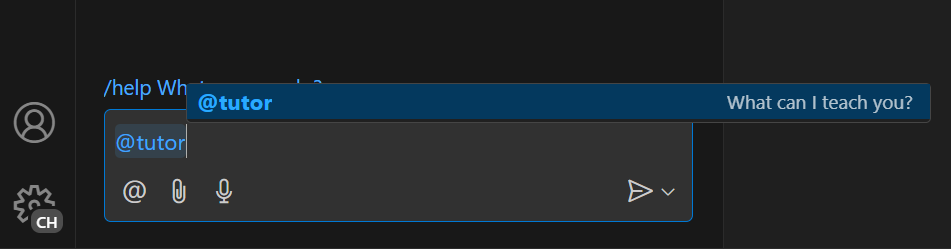
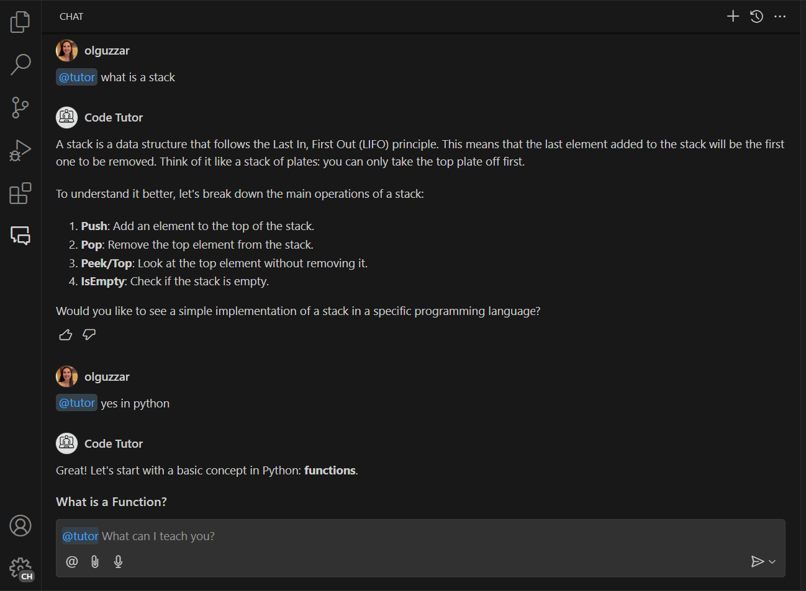
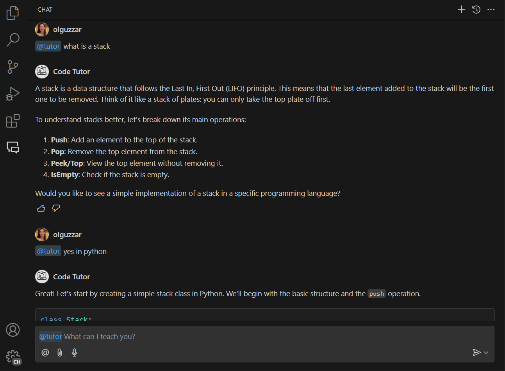
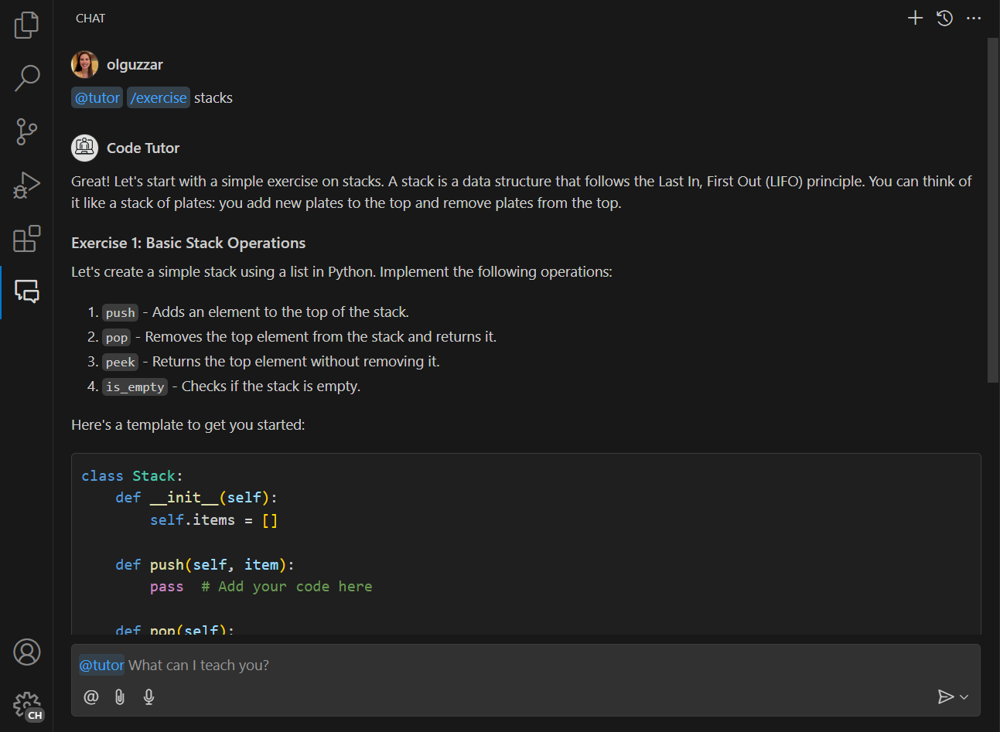

# 教程：使用 Chat API 构建代码教学 Chat Participant

在本教程中，你将学习如何创建一个与 GitHub Copilot Chat 体验集成的 Visual Studio Code 扩展。你将使用 Chat 扩展 API 来贡献一个 Chat Participant。你的 Participant 将是一个代码导师，可以为编程概念提供解释和示例练习。

## 先决条件

完成本教程需要以下工具和账户：

- [Visual Studio Code](https://code.visualstudio.com/download)
- [GitHub Copilot](https://marketplace.visualstudio.com/items?itemName=GitHub.copilot-chat)
- [Node.js](https://nodejs.org/en/download/)

## 第 1 步：设置项目

首先，使用 Yeoman 和 VS Code Extension Generator 生成扩展项目。

```bash
npx --package yo --package generator-code -- yo code
```

选择以下选项完成设置：

```bash
# ? What type of extension do you want to create? New Extension (TypeScript)
# ? What's the name of your extension? Code Tutor

### Press <Enter> to choose default for all options below ###

# ? What's the identifier of your extension? code-tutor
# ? What's the description of your extension? LEAVE BLANK
# ? Initialize a git repository? Yes
# ? Bundle the source code with webpack? No
# ? Which package manager to use? npm

# ? Do you want to open the new folder with Visual Studio Code? Open with `code`
```

扩展项目生成后，你需要编辑两个文件：`extension.ts` 和 `package.json`，你可以在[扩展结构文档](/vscode/extension/get-started/extension-anatomy#extension-file-structure)中了解更多信息。简要概述：

- `extension.ts` 是扩展的主入口点，包含 Chat Participant 的逻辑。
- `package.json` 包含扩展的元数据，例如 Participant 的名称和描述。

删除 `extension.ts` `activate()` 方法中自动生成的代码。这里就是你放置 Chat Participant 逻辑的地方。

## 第 2 步：注册 Chat Participant

在 `package.json` 文件中，用以下内容替换自动生成的 `contributes` 部分：

```json
"contributes":{
    "chatParticipants": [
    {
        "id": "chat-tutorial.code-tutor",
        "fullName": "Code Tutor",
        "name": "tutor",
        "description": "What can I teach you?",
        "isSticky": true
    }
    ]
}
```

此代码注册了一个具有以下属性的 Chat Participant：

- 唯一 ID `chat-tutorial.code-tutor`，将在代码中被引用
- 全名 `Code Tutor`，将显示在 Participant 响应的标题区域
- 名称 `tutor`，将在聊天视图中用于以 `@tutor` 的形式引用该 Chat Participant
- 描述"What can I teach you?"，将作为占位文本显示在聊天输入框中

最后，设置 `isSticky: true` 将使用户在与 Participant 开始交互后，自动在聊天输入框中预填 Participant 名称。

## 第 3 步：精心设计提示

现在 Participant 已注册，你可以开始实现代码导师的逻辑。在 `extension.ts` 文件中，你将为请求定义一个提示。

精心设计一个好的提示是从 Participant 获得最佳响应的关键。请参阅[这篇文章](https://platform.openai.com/docs/guides/prompt-engineering)，获取提示工程方面的技巧。

你的代码导师应该像一个真正的导师一样，引导学生理解概念，而不是直接给出答案。此外，导师应保持专注于主题，避免回答非编程问题。

考虑以下两个提示。哪个更有可能产生指定的行为？

1. > You are a helpful code tutor. Your job is to teach the user with simple descriptions and sample code of the concept.
2. > You are a helpful code tutor. Your job is to teach the user with simple descriptions and sample code of the concept. Respond with a guided overview of the concept in a series of messages. Do not give the user the answer directly, but guide them to find the answer themselves. If the user asks a non-programming question, politely decline to respond.

第二个提示更加具体，为 Participant 提供了明确的响应方向。在 `extension.ts` 文件中添加此提示。

```ts
const BASE_PROMPT = 'You are a helpful code tutor. Your job is to teach the user with simple descriptions and sample code of the concept. Respond with a guided overview of the concept in a series of messages. Do not give the user the answer directly, but guide them to find the answer themselves. If the user asks a non-programming question, politely decline to respond.';
```

## 第 4 步：实现请求处理器

现在提示已选定，你需要实现请求处理器。它将处理用户的聊天请求。你将定义请求处理器、执行处理请求的逻辑，并向用户返回响应。

首先，定义处理器：

```ts
// 定义聊天处理器
const handler: vscode.ChatRequestHandler = async (request: vscode.ChatRequest, context: vscode.ChatContext, stream: vscode.ChatResponseStream, token: vscode.CancellationToken) => {

    return;
}
```

在此处理器的函数体中，初始化提示和一个包含该提示的 `messages` 数组。然后，将用户在聊天框中输入的内容发送进去。你可以通过 `request.prompt` 访问这些内容。

使用 `request.model.sendRequest` 发送请求，它将使用当前选定的模型发送请求。最后，将响应流式传输给用户。

```ts
// 定义聊天处理器
const handler: vscode.ChatRequestHandler = async (request: vscode.ChatRequest, context: vscode.ChatContext, stream: vscode.ChatResponseStream, token: vscode.CancellationToken) => {

    // 初始化提示
    let prompt = BASE_PROMPT;

    // 使用提示初始化消息数组
    const messages = [
        vscode.LanguageModelChatMessage.User(prompt),
    ];

    // 添加用户的消息
    messages.push(vscode.LanguageModelChatMessage.User(request.prompt));

    // 发送请求
    const chatResponse = await request.model.sendRequest(messages, {}, token);

    // 流式传输响应
    for await (const fragment of chatResponse.text) {
        stream.markdown(fragment);
    }

    return;
};
```

## 第 5 步：创建 Chat Participant

处理器实现后，最后一步是使用 Chat 扩展 API 中的 `createChatParticipant` 方法创建 Chat Participant。确保使用与 `package.json` 中相同的 ID。

你还应该通过为 Participant 添加图标来进一步自定义它。这将在与 Participant 交互时显示在聊天视图中。

```ts
// 定义聊天处理器
const handler: vscode.ChatRequestHandler = async (request: vscode.ChatRequest, context: vscode.ChatContext, stream: vscode.ChatResponseStream, token: vscode.CancellationToken) => {

    // 初始化提示
    let prompt = BASE_PROMPT;

    // 使用提示初始化消息数组
    const messages = [
        vscode.LanguageModelChatMessage.User(prompt),
    ];

    // 添加用户的消息
    messages.push(vscode.LanguageModelChatMessage.User(request.prompt));

    // 发送请求
    const chatResponse = await request.model.sendRequest(messages, {}, token);

    // 流式传输响应
    for await (const fragment of chatResponse.text) {
        stream.markdown(fragment);
    }

    return;
};

// 创建 Participant
const tutor = vscode.chat.createChatParticipant("chat-tutorial.code-tutor", handler);

// 为 Participant 添加图标
tutor.iconPath = vscode.Uri.joinPath(context.extensionUri, 'tutor.jpeg');
```

## 第 6 步：运行代码

你现在可以试用你的 Chat Participant 了！
按 `kbstyle(F5)` 运行代码。将打开一个带有你 Chat Participant 的新 VS Code 窗口。

在 Copilot Chat 面板中，你现在可以通过输入 `@tutor` 来调用你的 Participant！



输入你想学习的内容来测试它。你应该会看到一个给出该概念概述的响应！

如果你输入一条相关消息来继续对话，你会注意到 Participant 没有根据你的对话给出后续响应。那是因为我们当前的 Participant 只发送了用户的当前消息，而没有发送 Participant 的消息历史。

在下面的截图中，导师正确地给出了关于栈的初始解释。然而，在后续对话中，它没有理解用户正在继续对话以查看 Python 中栈的实现，因此给出了一个关于 Python 的通用响应。



## 第 7 步：添加消息历史以获取更多上下文

Copilot Chat 最大的价值之一是能够在多轮消息中迭代以获得最佳响应。为此，你需要将 Participant 的消息历史发送到聊天请求中。你可以通过 `context.history` 访问这些历史。

你需要检索该历史并将其添加到 `messages` 数组中。你需要在添加 `request.prompt` 之前完成此操作。

```ts
// 定义聊天处理器
const handler: vscode.ChatRequestHandler = async (request: vscode.ChatRequest, context: vscode.ChatContext, stream: vscode.ChatResponseStream, token: vscode.CancellationToken) => {

    // 初始化提示
    let prompt = BASE_PROMPT;

    // 使用提示初始化消息数组
    const messages = [
        vscode.LanguageModelChatMessage.User(prompt),
    ];

    // 获取所有之前的 Participant 消息
    const previousMessages = context.history.filter(
        (h) => h instanceof vscode.ChatResponseTurn
    );

    // 将之前的消息添加到消息数组
    previousMessages.forEach((m) => {
        let fullMessage = '';
        m.response.forEach((r) => {
            const mdPart = r as vscode.ChatResponseMarkdownPart;
            fullMessage += mdPart.value.value;
        });
        messages.push(vscode.LanguageModelChatMessage.Assistant(fullMessage));
    });

    // 添加用户的消息
    messages.push(vscode.LanguageModelChatMessage.User(request.prompt));

    // 发送请求
    const chatResponse = await request.model.sendRequest(messages, {}, token);

    // 流式传输响应
    for await (const fragment of chatResponse.text) {
        stream.markdown(fragment);
    }

    return;
};
```

现在运行代码时，你可以与你的 Participant 进行包含之前消息完整上下文的对话！在下面的截图中，Participant 正确理解了用户请求查看 Python 中栈的实现。



## 第 8 步：添加命令

基本 Participant 实现后，你可以通过添加命令来扩展它。命令是常见用户意图的简写表示，用 `/` 符号标识。扩展然后可以使用命令来相应地提示语言模型。

添加一个命令来提示你的导师给出某个概念的练习题会很有用。你需要在 `package.json` 文件中注册该命令，并在 `extension.ts` 中实现逻辑。你可以将命令命名为 `exercise`，这样就可以通过输入 `/exercise` 来调用它。

在 `package.json` 中，将 `commands` 属性添加到 `chatParticipants` 属性。在这里，你将指定命令名称和简要描述：

```json
"contributes": {
    "chatParticipants": [
      {
        "id": "chat-tutorial.code-tutor",
        "fullName": "Code Tutor",
        "name": "tutor",
        "description": "What can I teach you?",
        "isSticky": true,
        "commands": [
          {
            "name": "exercise",
            "description": "Provide exercises to practice a concept."
          }
        ]
      }
    ]
  },
```

要实现从导师获取练习题的逻辑，最简单的方法是更改你发送给请求的提示。创建一个新提示 `EXERCISES_PROMPT`，要求 Participant 返回练习题。以下是一个示例：

```ts
const EXERCISES_PROMPT = 'You are a helpful tutor. Your job is to teach the user with fun, simple exercises that they can complete in the editor. Your exercises should start simple and get more complex as the user progresses. Move one concept at a time, and do not move on to the next concept until the user provides the correct answer. Give hints in your exercises to help the user learn. If the user is stuck, you can provide the answer and explain why it is the answer. If the user asks a non-programming question, politely decline to respond.';
```

然后在请求处理器中，你需要添加逻辑来检测用户是否引用了该命令。你可以通过 `request.command` 属性来实现。

如果命令被引用，将提示更新为新创建的 `EXERCISES_PROMPT`

```ts
// 定义聊天处理器
const handler: vscode.ChatRequestHandler = async (request: vscode.ChatRequest, context: vscode.ChatContext, stream: vscode.ChatResponseStream, token: vscode.CancellationToken) => {

    // 初始化提示
    let prompt = BASE_PROMPT;

    if (request.command === 'exercise') {
        prompt = EXERCISES_PROMPT;
    }

    // 使用提示初始化消息数组
    const messages = [
        vscode.LanguageModelChatMessage.User(prompt),
    ];

    // 获取所有之前的 Participant 消息
    const previousMessages = context.history.filter(
        (h) => h instanceof vscode.ChatResponseTurn
    );

    // 将之前的消息添加到消息数组
    previousMessages.forEach((m) => {
        let fullMessage = '';
        m.response.forEach((r) => {
            const mdPart = r as vscode.ChatResponseMarkdownPart;
            fullMessage += mdPart.value.value;
        });
        messages.push(vscode.LanguageModelChatMessage.Assistant(fullMessage));
    });

    // 添加用户的消息
    messages.push(vscode.LanguageModelChatMessage.User(request.prompt));

    // 发送请求
    const chatResponse = await request.model.sendRequest(messages, {}, token);

    // 流式传输响应
    for await (const fragment of chatResponse.text) {
        stream.markdown(fragment);
    }

    return;
};
```

这就是所有需要添加的内容！获取消息历史、发送请求和流式传输请求的其余逻辑保持不变。

现在你可以输入 `/exercise`，这将调出你的 Chat Participant，你可以获得交互式编码练习！



## 下一步

恭喜！你已成功创建了一个能够为编程概念提供解释和示例练习的 Chat Participant。你可以通过微调提示、添加更多斜杠命令或利用 [Language Model API](/vscode/extension/extension-guides/ai/language-model) 等其他 API 来进一步扩展你的 Participant。准备好后，你还可以将扩展发布到 [Visual Studio Code Marketplace](https://marketplace.visualstudio.com/vscode)。

你可以在 [vscode-extensions-sample 仓库](https://github.com/microsoft/vscode-extension-samples/tree/main/chat-tutorial)中找到本教程的完整源代码。

## 相关内容

- [Chat API 扩展指南](/vscode/extension/extension-guides/ai/chat)
- [教程：使用 Language Model API 生成 AI 驱动的代码注解](/vscode/extension/extension-guides/ai/language-model-tutorial)
- [Language Model API 扩展指南](/vscode/extension/extension-guides/ai/language-model)
