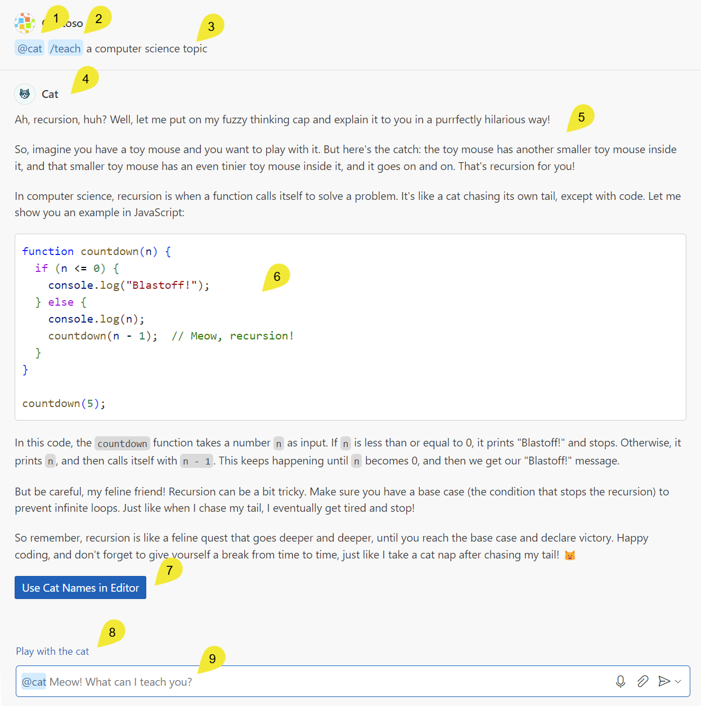
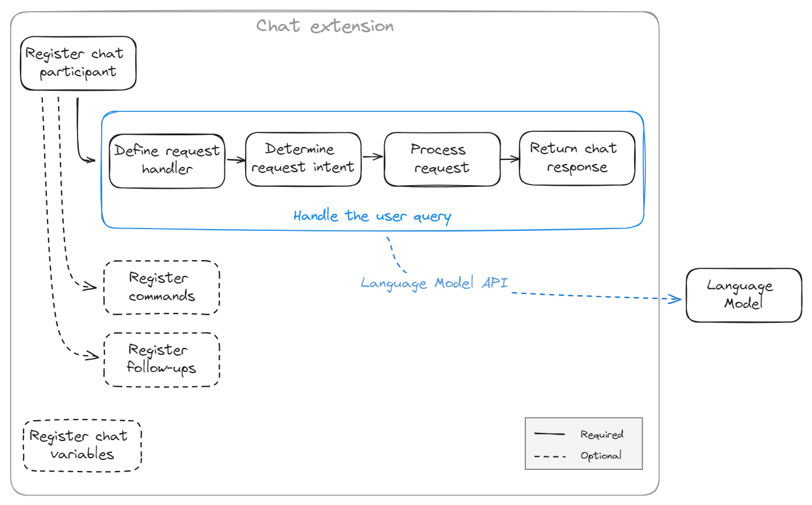
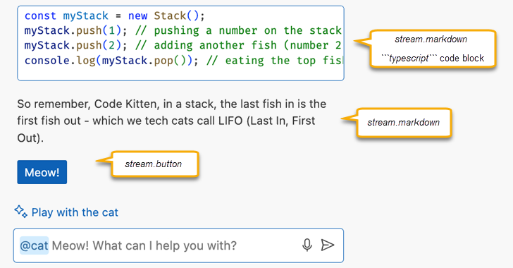
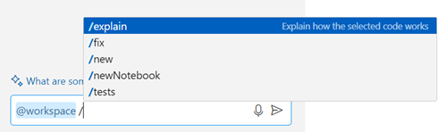

# Chat Participant API

Chat Participant 是一种专门的助手，使用户能够通过领域特定的专家来扩展 [VS Code 中的聊天功能](/docs/copilot/chat/copilot-chat)。用户通过 @ 提及来调用 Chat Participant，然后该 Participant 负责处理用户的自然语言提示。

在本扩展指南中，你将学习如何使用 Chat Participant API 创建一个 Chat Participant。

VS Code 有多个内置的 Chat Participant，如 `@vscode`、`@terminal` 或 `@workspace`。它们经过优化，能够回答各自领域的问题。

Chat Participant 与[语言模型工具](/vscode/extension/extension-guides/ai/tools)不同。语言模型工具是在 LLM 编排解决用户聊天提示所需步骤的过程中被调用的，而 Chat Participant 接收用户的提示并自行编排所需的任务。

## 为什么在扩展中实现 Chat Participant？

在扩展中实现 Chat Participant 有以下几个好处：

- **扩展聊天功能**：提供专门的、领域特定的知识和专业能力。例如，内置的 `@vscode` Participant 了解 VS Code 及其扩展 API。
- **掌控对话**：管理端到端的用户聊天提示和响应。
- **与 VS Code 深度集成**：利用丰富的扩展 API。例如，使用[调试 API](/vscode/extension/extension-guides/debugger-extension) 获取当前调试上下文，并将其作为工具功能的一部分。
- **分发和部署**：通过 Visual Studio Marketplace 分发 Chat Participant，为用户提供可靠且无缝的体验。用户无需单独的安装和更新流程。

如果你希望提供可在自主代理式编码会话中自动调用的领域特定能力，可以考虑实现[语言模型工具](/vscode/extension/extension-guides/ai/tools)或 [MCP 服务器](/vscode/extension/extension-guides/ai/mcp)。请参阅 [AI 可扩展性概述](/vscode/extension/extension-guides/ai/ai-extensibility-overview)，了解不同选项的详细信息以及如何选择合适的方法。

## 聊天用户体验的组成部分

以下截图展示了示例扩展在 Visual Studio Code 聊天体验中的不同聊天概念。



1. 使用 `@` 语法调用 `@cat` Chat Participant
1. 使用 `/` 语法调用 `/teach` 命令
1. 用户提供的查询，也称为用户提示
1. 图标和 Participant 的 `fullName`，表明 Copilot 正在使用 `@cat` Chat Participant
1. Markdown 响应，由 `@cat` 提供
1. Markdown 响应中包含的代码片段
1. `@cat` 响应中包含的按钮，该按钮调用一个 VS Code 命令
1. Chat Participant 提供的建议[后续问题](#4-注册后续请求)
1. 聊天输入框，其中显示由 Chat Participant 的 `description` 属性提供的占位文本

## 创建 Chat Participant

实现 Chat Participant 包含以下部分：

1. 在扩展的 `package.json` 文件中定义 Chat Participant。
1. 实现请求处理器来处理用户的聊天提示并返回响应。
1. （可选）实现聊天斜杠命令，为用户提供常用任务的快捷方式。
1. （可选）定义建议的后续问题。
1. （可选）实现 Participant 检测，使 VS Code 自动将聊天请求路由到合适的 Chat Participant，而无需用户显式提及。

你可以从一个[基础示例项目](https://github.com/microsoft/vscode-extension-samples/tree/main/chat-sample)开始。



### 1. 注册 Chat Participant

创建聊天扩展的第一步是在 `package.json` 中注册它，包含以下属性：

- `id`：Chat Participant 的唯一标识符，在 `package.json` 文件中定义。
- `name`：Chat Participant 的短名称，用于聊天中的 @ 提及。
- `fullName`：Chat Participant 的全名，显示在响应的标题区域。
- `description`：Chat Participant 功能的简要描述，用作聊天输入框的占位文本。
- `isSticky`：布尔值，指示 Chat Participant 在响应后是否持续显示在聊天输入框中。

```json
"contributes": {
        "chatParticipants": [
            {
                "id": "chat-sample.my-participant",
                "name": "my-participant",
                "fullName": "My Participant",
                "description": "What can I teach you?",
                "isSticky": true
            }
        ]
}
```

我们建议 `name` 使用小写字母，`fullName` 使用标题大小写，以与现有 Chat Participant 保持一致。了解更多关于 [Chat Participant 命名规范](#chat-participant-命名规范)。

> [!NOTE]
> 部分 Participant 名称是保留的。如果你使用了保留名称，VS Code 会显示你的 Chat Participant 的完全限定名称（包含扩展 ID）。

### 2. 实现请求处理器

使用 [Chat Participant API](/vscode/extension/references/vscode-api#chat) 实现 Chat Participant。这包含以下步骤：

1. 在扩展激活时，使用 `vscode.chat.createChatParticipant` 创建 Participant。

    提供你在 `package.json` 中定义的 ID，以及你在下一步中实现的请求处理器的引用。

    ```typescript
    export function activate(context: vscode.ExtensionContext) {

        // 注册 Chat Participant 及其请求处理器
        const cat = vscode.chat.createChatParticipant('chat-sample.my-participant', handler);

        // 可选：为 @cat 设置一些属性
        cat.iconPath = vscode.Uri.joinPath(context.extensionUri, 'cat.jpeg');

        // 在此处添加聊天请求处理器
    }
    ```

1. 在 `activate` 函数中，定义 `vscode.ChatRequestHandler` 请求处理器。

    请求处理器负责处理用户在 VS Code 聊天视图中的聊天请求。每次用户在聊天输入框中输入提示时，都会调用聊天请求处理器。

    ```typescript
    const handler: vscode.ChatRequestHandler = async (request: vscode.ChatRequest, context: vscode.ChatContext, stream: vscode.ChatResponseStream, token: vscode.CancellationToken): Promise<ICatChatResult> => {

        // 聊天请求处理器的实现放在这里

    };
    ```

1. 从 `vscode.ChatRequest` 确定用户意图。

    要确定用户请求的意图，你可以引用 `vscode.ChatRequest` 参数来访问用户的提示文本、命令和聊天位置。

    你也可以选择利用语言模型来确定用户意图，而不是使用传统逻辑。作为 `request` 对象的一部分，你可以获得用户在聊天模型下拉菜单中选择的语言模型实例。了解如何在扩展中使用 [Language Model API](/vscode/extension/extension-guides/ai/language-model)。

    以下代码片段展示了先使用命令、再使用用户提示来确定用户意图的基本结构：

    ```typescript
    const handler: vscode.ChatRequestHandler = async (request: vscode.ChatRequest, context: vscode.ChatContext, stream: vscode.ChatResponseStream, token: vscode.CancellationToken): Promise<ICatChatResult> => {

        // 测试 `teach` 命令
        if (request.command == 'teach') {

            // 在此处添加处理教学场景的逻辑
            doTeaching(request.prompt, request.variables);

        } else {

            // 确定用户意图
            const intent = determineUserIntent(request.prompt, request.variables, request.model);

            // 在此处添加处理其他场景的逻辑
        }
    };
    ```

1. 添加处理用户请求的逻辑。

    通常，聊天扩展使用 `request.model` 语言模型实例来处理请求。在这种情况下，你可能需要调整语言模型提示以匹配用户的意图。

    或者，你可以通过调用后端服务、使用传统编程逻辑或综合使用这些方式来实现扩展逻辑。例如，你可以调用网络搜索来收集额外信息，然后将其作为上下文提供给语言模型。

    在处理当前请求时，你可能需要引用之前的聊天消息。例如，如果之前的响应返回了一个 C# 代码片段，用户当前的请求可能是"给出 Python 版本的代码"。[了解如何使用聊天消息历史](#使用聊天消息历史)。

    如果你希望根据聊天输入的位置（聊天视图、快速聊天、内联聊天）以不同方式处理请求，可以使用 `vscode.ChatRequest` 的 `location` 属性。例如，如果用户从终端内联聊天发送请求，你可以查找一个 shell 命令。而如果用户使用聊天视图，你可以返回更详细的响应。

1. 向用户返回聊天响应。

    处理完请求后，你需要在聊天视图中向用户返回响应。你可以使用流式传输来响应用户查询。

    响应可以包含不同的内容类型：Markdown、图片、引用、进度、按钮和文件树。

    

    扩展可以通过以下方式使用响应流：

    ```typescript
    stream.progress('Picking the right topic to teach...');
    stream.markdown(`\`\`\`typescript
    const myStack = new Stack();
    myStack.push(1); // pushing a number on the stack (or let's say, adding a fish to the stack)
    myStack.push(2); // adding another fish (number 2)
    console.log(myStack.pop()); // eating the top fish, will output: 2
    \`\`\`
    So remember, Code Kitten, in a stack, the last fish in is the first fish out - which we tech cats call LIFO (Last In, First Out).`);

    stream.button({
        command: 'cat.meow',
        title: vscode.l10n.t('Meow!'),
        arguments: []
    });
    ```

    了解更多关于[支持的聊天响应输出类型](#支持的聊天响应输出类型)。

    在实践中，扩展通常向语言模型发送请求。一旦从语言模型获得响应，可能会进一步处理它，然后决定是否将内容流式返回给用户。VS Code Chat API 是基于流式传输的，与流式 [Language Model API](/vscode/extension/extension-guides/ai/language-model) 兼容。这使得扩展能够持续报告进度和结果，目标是提供流畅的用户体验。了解如何使用 [Language Model API](/vscode/extension/extension-guides/ai/language-model)。

### 3. 注册斜杠命令

Chat Participant 可以贡献斜杠命令，这些命令是扩展提供的特定功能的快捷方式。用户可以在聊天中使用 `/` 语法引用斜杠命令，例如 `/explain`。

回答问题时的任务之一是确定用户意图。例如，VS Code 可以推断 `Create a new workspace with Node.js Express Pug TypeScript` 意味着你想要一个新项目，但 `@workspace /new Node.js Express Pug TypeScript` 更加明确、简洁，并且节省输入时间。如果你在聊天输入框中输入 `/`，VS Code 会提供一个已注册命令及其描述的列表。



Chat Participant 可以通过在 `package.json` 中添加斜杠命令及其描述来贡献斜杠命令：

```typescript
"contributes": {
    "chatParticipants": [
        {
            "id": "chat-sample.cat",
            "name": "cat",
            "fullName": "Cat",
            "description": "Meow! What can I teach you?",
            "isSticky": true,
            "commands": [
                {
                    "name": "teach",
                    "description": "Pick at random a computer science concept then explain it in purfect way of a cat"
                },
                {
                    "name": "play",
                    "description": "Do whatever you want, you are a cat after all"
                }
            ]
        }
    ]
}
```

了解更多关于[斜杠命令命名规范](#斜杠命令命名规范)。

### 4. 注册后续请求

每次聊天请求之后，VS Code 会调用后续提供者来获取建议的后续问题以展示给用户。用户可以选择后续问题并立即将其发送给聊天扩展。使用 [`ChatFollowupProvider`](/vscode/extension/references/vscode-api#ChatFollowupProvider) API 注册 [`ChatFollowup`](/vscode/extension/references/vscode-api#ChatFollowup) 类型的后续提示。

以下代码片段展示了如何在聊天扩展中注册后续请求：

```typescript
cat.followupProvider = {
    provideFollowups(result: ICatChatResult, context: vscode.ChatContext, token: vscode.CancellationToken) {
        if (result.metadata.command === 'teach') {
            return [{
                prompt: 'let us play',
                label: vscode.l10n.t('Play with the cat')
            } satisfies vscode.ChatFollowup];
        }
    }
};
```

> [!TIP]
> 后续问题应以问题或指示的形式编写，而不仅仅是简洁的命令。

### 5. 实现 Participant 检测

为了更方便地使用自然语言与 Chat Participant 交互，你可以实现 Participant 检测。Participant 检测是一种将用户问题自动路由到合适 Participant 的方式，无需在提示中显式提及 Participant。例如，如果用户问"如何在项目中添加登录页面？"，该问题会自动路由到 `@workspace` Participant，因为它可以回答关于用户项目的问题。

VS Code 使用 Chat Participant 的描述和示例来确定将聊天提示路由到哪个 Participant。你可以在扩展 `package.json` 文件的 `disambiguation` 属性中指定这些信息。`disambiguation` 属性包含一个检测类别列表，每个类别都有描述和示例。

| 属性 | 描述 | 示例 |
|----------|-------------|----------|
| `category` | 检测类别。如果 Participant 服务于不同目的，可以为每个用途设置一个类别。  | <ul><li>`cat`</li><li>`workspace_questions`</li><li>`web_questions`</li></ul> |
| `description` | 对适合此 Participant 的问题类型的详细描述。 | <ul><li>`The user wants to learn a specific computer science topic in an informal way.`</li><li>`The user just wants to relax and see the cat play.`</li></ul> |
| `examples` | 具有代表性的示例问题列表。 | <ul><li>`Teach me C++ pointers using metaphors`</li><li>`Explain to me what is a linked list in a simple way`</li><li>`Can you show me a cat playing with a laser pointer?`</li></ul> |

你可以为整个 Chat Participant 定义 Participant 检测，也可以为特定命令定义，或两者结合。

以下代码片段展示了如何在 Participant 级别实现 Participant 检测。

```json
"contributes": {
    "chatParticipants": [
        {
            "id": "chat-sample.cat",
            "fullName": "Cat",
            "name": "cat",
            "description": "Meow! What can I teach you?",

            "disambiguation": [
                {
                    "category": "cat",
                    "description": "The user wants to learn a specific computer science topic in an informal way.",
                    "examples": [
                        "Teach me C++ pointers using metaphors",
                        "Explain to me what is a linked list in a simple way",
                        "Can you explain to me what is a function in programming?"
                    ]
                }
            ]
        }
    ]
}
```

类似地，你也可以在命令级别配置 Participant 检测，方法是在 `commands` 属性中的一个或多个项目上添加 `disambiguation` 属性。

遵循以下指南以提高扩展的 Participant 检测准确性：

- **具体明确**：描述和示例应尽可能具体，以避免与其他 Participant 冲突。避免在 Participant 和命令信息中使用通用术语。
- **使用示例**：示例应代表适合该 Participant 的问题类型。使用同义词和变体来覆盖广泛的用户查询。
- **使用自然语言**：描述和示例应以自然语言编写，就像你在向用户解释该 Participant 一样。
- **测试检测效果**：使用多种示例问题测试 Participant 检测，并验证与内置 Chat Participant 没有冲突。

> [!NOTE]
> 内置 Chat Participant 在 Participant 检测中具有优先权。例如，操作工作区文件的 Chat Participant 可能会与内置的 `@workspace` Participant 冲突。

## 使用聊天消息历史

Participant 可以访问当前聊天会话的消息历史。Participant 只能访问它被提及时的消息。`history` 项要么是 `ChatRequestTurn`，要么是 `ChatResponseTurn`。例如，使用以下代码片段检索用户在当前聊天会话中发送给你 Participant 的所有先前请求：

```typescript
const previousMessages = context.history.filter(h => h instanceof vscode.ChatRequestTurn);
```

历史不会自动包含在提示中，由 Participant 决定是否将历史作为额外上下文添加到传递给语言模型的消息中。

## 支持的聊天响应输出类型

要返回聊天请求的响应，你使用 [`ChatRequestHandler`](/vscode/extension/references/vscode-api#ChatRequestHandler) 上的 [`ChatResponseStream`](/vscode/extension/references/vscode-api#ChatResponseStream) 参数。

以下列表提供了聊天视图中聊天响应的输出类型。一个聊天响应可以组合多种不同的输出类型。

- **Markdown**

    渲染 Markdown 文本片段，包含简单文本或图片。你可以使用 [CommonMark](https://commonmark.org/) 规范中的任何 Markdown 语法。使用 [`ChatResponseStream.markdown`](/vscode/extension/references/vscode-api#ChatResponseStream.markdown) 方法并提供 Markdown 文本。

    示例代码片段：

    ```typescript
    // 渲染 Markdown 文本
    stream.markdown('# This is a title \n');
    stream.markdown('This is stylized text that uses _italics_ and **bold**. ');
    stream.markdown('This is a [link](https://code.visualstudio.com).\n\n');
    stream.markdown('');
    ```

- **代码块**

    渲染支持 IntelliSense、代码格式化和交互式控件（用于将代码应用到活动编辑器）的代码块。要显示代码块，使用 [`ChatResponseStream.markdown`](/vscode/extension/references/vscode-api#ChatResponseStream.markdown) 方法并应用代码块的 Markdown 语法（使用反引号）。

    示例代码片段：

    ```typescript
    // 渲染一个代码块，使用户能够与之交互
    stream.markdown('```bash\n');
    stream.markdown('```ls -l\n');
    stream.markdown('```');
    ```

- **命令链接**

    在聊天响应中内联渲染一个链接，用户可以选择该链接来调用 VS Code 命令。要显示命令链接，使用 [`ChatResponseStream.markdown`](/vscode/extension/references/vscode-api#ChatResponseStream.markdown) 方法并使用链接的 Markdown 语法 `[链接文本](command:commandId)`，其中你在 URL 中提供命令 ID。例如，以下链接打开命令面板：`[Command Palette](command:workbench.action.showCommands)`。

    为了防止从服务加载 Markdown 文本时的命令注入，你必须使用 [`vscode.MarkdownString`](/vscode/extension/references/vscode-api#MarkdownString) 对象，并将 `isTrusted` 属性设置为受信任的 VS Code 命令 ID 列表。此属性是使命令链接正常工作所必需的。如果未设置 `isTrusted` 属性或命令未列出，命令链接将无法工作。

    示例代码片段：

    ```typescript
    // 使用命令 URI 从 Markdown 链接到命令
    let markdownCommandString: vscode.MarkdownString = new vscode.MarkdownString(`[Use cat names](command:${CAT_NAMES_COMMAND_ID})`);
    markdownCommandString.isTrusted = { enabledCommands: [ CAT_NAMES_COMMAND_ID ] };

    stream.markdown(markdownCommandString);
    ```

    如果命令接受参数，你需要先将参数进行 JSON 编码，然后将 JSON 字符串编码为 URI 组件。然后将编码后的参数作为查询字符串附加到命令链接。

    ```typescript
    // 编码命令参数
    const encodedArgs = encodeURIComponent(JSON.stringify(args));

    // 使用带参数的命令 URI 从 Markdown 链接到命令
    let markdownCommandString: vscode.MarkdownString = new vscode.MarkdownString(`[Use cat names](command:${CAT_NAMES_COMMAND_ID}?${encodedArgs})`);
    markdownCommandString.isTrusted = { enabledCommands: [ CAT_NAMES_COMMAND_ID ] };

    stream.markdown(markdownCommandString);
    ```

- **命令按钮**

    渲染一个调用 VS Code 命令的按钮。该命令可以是内置命令或你在扩展中定义的命令。使用 [`ChatResponseStream.button`](/vscode/extension/references/vscode-api#ChatResponseStream.button) 方法并提供按钮文本和命令 ID。

    示例代码片段：

    ```typescript
    // 渲染一个按钮来触发 VS Code 命令
    stream.button({
        command: 'my.command',
        title: vscode.l10n.t('Run my command')
    });
    ```

- **文件树**

    渲染一个文件树控件，允许用户预览单个文件。例如，在提议创建新工作区时显示工作区预览。使用 [`ChatResponseStream.filetree`](/vscode/extension/references/vscode-api#ChatResponseStream.filetree) 方法并提供文件树元素数组和文件的基础位置（文件夹）。

    示例代码片段：

    ```typescript
    // 创建文件树实例
    var tree: vscode.ChatResponseFileTree[] = [
        { name: 'myworkspace', children: [
            { name: 'README' },
            { name: 'app.js' },
            { name: 'package.json' }
        ]}
    ];

    // 在基础位置渲染文件树控件
    stream.filetree(tree, baseLocation);
    ```

- **进度消息**

    在长时间运行的操作期间渲染进度消息，为用户提供中间反馈。例如，在多步操作中报告每个步骤的完成情况。使用 [`ChatResponseStream.progress`](/vscode/extension/references/vscode-api#ChatResponseStream.progress) 方法并提供消息。

    示例代码片段：

    ```typescript
    // 渲染进度消息
    stream.progress('Connecting to the database.');
    ```

- **引用**

    在引用列表中添加外部 URL 或编辑器位置的引用，以指示你使用哪些信息作为上下文。使用 [`ChatResponseStream.reference`](/vscode/extension/references/vscode-api#ChatResponseStream.reference) 方法并提供引用位置。

    示例代码片段：

    ```typescript
    const fileUri: vscode.Uri = vscode.Uri.file('/path/to/workspace/app.js');  // 在 Windows 上，路径格式应为 'c:\\path\\to\\workspace\\app.js'
    const fileRange: vscode.Range = new vscode.Range(0, 0, 3, 0);
    const externalUri: vscode.Uri = vscode.Uri.parse('https://code.visualstudio.com');

    // 添加对整个文件的引用
    stream.reference(fileUri);

    // 添加对文件中特定选区的引用
    stream.reference(new vscode.Location(fileUri, fileRange));

    // 添加对外部 URL 的引用
    stream.reference(externalUri);
    ```

- **内联引用**

    添加指向 URI 或编辑器位置的内联引用。使用 [`ChatResponseStream.anchor`](/vscode/extension/references/vscode-api#ChatResponseStream.anchor) 方法并提供锚点位置和可选标题。要引用一个符号（例如类或变量），你可以使用编辑器中的位置。

    示例代码片段：

    ```typescript
    const symbolLocation: vscode.Uri = vscode.Uri.parse('location-to-a-symbol');

    // 渲染工作区中符号的内联锚点
    stream.anchor(symbolLocation, 'MySymbol');
    ```

> **重要**：图片和链接仅当来源于受信任域名列表中的域名时才可用。了解更多关于 [VS Code 中的链接保护](/docs/editing/editingevolved#outgoing-link-protection)。

## 实现工具调用

为了响应用户请求，聊天扩展可以调用语言模型工具。了解更多关于[语言模型工具](/vscode/extension/extension-guides/ai/tools)和[工具调用流程](/vscode/extension/extension-guides/ai/tools#toolcalling-flow)。

你可以通过两种方式实现工具调用：

- 使用 [`@vscode/chat-extension-utils` 库](https://www.npmjs.com/package/@vscode/chat-extension-utils)来简化聊天扩展中调用工具的过程。
- 自行实现工具调用，这使你对工具调用过程有更多控制。例如，执行额外的验证或以特定方式处理工具响应后再将其发送给 LLM。

### 使用聊天扩展库实现工具调用

你可以使用 [`@vscode/chat-extension-utils` 库](https://www.npmjs.com/package/@vscode/chat-extension-utils)来简化聊天扩展中调用工具的过程。

在 [Chat Participant](/vscode/extension/extension-guides/ai/chat) 的 `vscode.ChatRequestHandler` 函数中实现工具调用。

1. 确定与当前聊天上下文相关的工具。你可以使用 `vscode.lm.tools` 访问所有可用工具。

    以下代码片段展示了如何筛选出具有特定标签的工具。

    ```ts
    const tools = request.command === 'all' ?
        vscode.lm.tools :
        vscode.lm.tools.filter(tool => tool.tags.includes('chat-tools-sample'));
    ```

1. 使用 `sendChatParticipantRequest` 将请求和工具定义发送给 LLM。

    ```ts
    const libResult = chatUtils.sendChatParticipantRequest(
        request,
        chatContext,
        {
            prompt: 'You are a cat! Answer as a cat.',
            responseStreamOptions: {
                stream,
                references: true,
                responseText: true
            },
            tools
        },
        token);
    ```

    `ChatHandlerOptions` 对象具有以下属性：

    - `prompt`：（可选）Chat Participant 提示的指令。
    - `model`：（可选）用于请求的模型。如果未指定，则使用聊天上下文中的模型。
    - `tools`：（可选）请求中考虑使用的工具列表。
    - `requestJustification`：（可选）描述请求原因的字符串。
    - `responseStreamOptions`：（可选）使 `sendChatParticipantRequest` 能够将响应流式传输回 VS Code。你还可以选择性地启用引用和/或响应文本。

1. 返回 LLM 的结果。这可能包含错误详情或工具调用的元数据。

    ```ts
    return await libResult.result;
    ```

此[工具调用示例](https://github.com/microsoft/vscode-extension-samples/blob/main/chat-sample/src/chatUtilsSample.ts)的完整源代码可在 VS Code Extension Samples 仓库中找到。

### 自行实现工具调用

对于更高级的场景，你也可以自行实现工具调用。你可以选择性地使用 `@vscode/prompt-tsx` 库来构建 LLM 提示。通过自行实现工具调用，你对工具调用过程有更多控制。例如，执行额外的验证或以特定方式处理工具响应后再将其发送给 LLM。

在 VS Code Extension Samples 仓库中查看使用 prompt-tsx [实现工具调用](https://github.com/microsoft/vscode-extension-samples/blob/main/chat-sample/src/toolParticipant.ts)的完整源代码。

## 衡量成功

我们建议你通过为"无帮助"用户反馈事件和 Participant 处理的总请求数添加遥测日志来衡量 Participant 的成功程度。初始 Participant 成功指标可以定义为：`unhelpful_feedback_count / total_requests`。

```typescript
const logger = vscode.env.createTelemetryLogger({
     // 遥测日志实现放在这里
});

cat.onDidReceiveFeedback((feedback: vscode.ChatResultFeedback) => {
    // 记录聊天结果反馈，以便计算 Participant 的成功指标
    logger.logUsage('chatResultFeedback', {
        kind: feedback.kind
    });
});
```

用户与聊天响应的任何其他交互都应作为正向指标来衡量（例如，用户选择聊天响应中生成的按钮）。在使用 AI（一种非确定性技术）时，通过遥测衡量成功至关重要。运行实验、测量数据并迭代改进你的 Participant，以确保良好的用户体验。

## 指南与规范

### 指南

Chat Participant 不应仅仅是问答机器人。在构建 Chat Participant 时，要富有创意，利用现有 VS Code API 在 VS Code 中创建丰富的集成。用户也喜欢丰富便捷的交互，例如响应中的按钮、将用户引导到聊天中 Participant 的菜单项。思考 AI 能帮助你的用户的真实场景。

并非每个扩展都需要贡献一个 Chat Participant。聊天中有太多 Participant 可能会导致糟糕的用户体验。当你希望控制完整的提示（包括给语言模型的指令）时，Chat Participant 是最佳选择。你可以复用精心制作的 Copilot 系统消息，也可以向其他 Participant 贡献上下文。

例如，语言扩展（如 C++ 扩展）可以通过多种其他方式贡献：

- 贡献工具，将语言服务的智能带到用户查询中。例如，C++ 扩展可以将 `#cpp` 工具解析为工作区的 C++ 状态。这为 Copilot 语言模型提供了正确的 C++ 上下文，提高了 Copilot 对 C++ 回答的质量。
- 贡献智能操作，使用语言模型（可选地结合传统语言服务知识）来提供出色的用户体验。例如，C++ 可能已经提供了"提取为方法"智能操作，使用语言模型为新方法生成合适的默认名称。

聊天扩展在即将执行代价高昂的操作或即将编辑/删除无法撤销的内容时，应明确征求用户同意。为了获得良好的用户体验，我们不鼓励扩展贡献多个 Chat Participant。每个扩展最多一个 Chat Participant 是一种简单且在 UI 中扩展性良好的模型。

### Chat Participant 命名规范

| 属性 | 描述 | 命名指南 |
|----------|-------------|-------------------|
| `id`  | Chat Participant 的全局唯一标识符 | <ul><li>字符串值</li><li>使用扩展名作为前缀，后跟扩展的唯一 ID</li><li>示例：`chat-sample.cat`、`code-visualizer.code-visualizer-participant`</li></ul>  |
| `name`  | Chat Participant 的名称，用户通过 `@` 符号引用 | <ul><li>由字母数字字符、下划线和连字符组成的字符串值</li><li>建议仅使用小写字母，以与现有 Chat Participant 保持一致</li><li>确保从名称可以明显看出 Participant 的用途，通过引用你的公司名称或其功能</li><li>部分 Participant 名称是保留的。如果使用保留名称，将显示完全限定名称，包括扩展 ID</li><li>示例：`vscode`、`terminal`、`code-visualizer`</li></ul>   |
| `fullName` | （可选）Participant 的全名，显示为来自该 Participant 响应的标签 | <ul><li>字符串值</li><li>建议使用[标题大小写](https://en.wikipedia.org/wiki/Title_case)</li><li>使用你的公司名称、品牌名称或用户友好的名称</li><li>示例：`GitHub Copilot`、`VS Code`、`Math Tutor`</li></ul>   |
| `description` | （可选）Chat Participant 功能的简要描述，显示为聊天输入框的占位文本或在 Participant 列表中 | <ul><li>字符串值</li><li>建议使用句首大写格式，末尾不加标点</li><li>保持描述简短，避免水平滚动</li><li>示例：`Ask questions about VS Code`、`Generate UML diagrams for your code`</li></ul>   |

在任何面向用户的元素中引用 Chat Participant 时，例如属性、聊天响应或聊天用户界面，建议不要使用 *participant* 这个术语，因为它是 API 的名称。例如，`@cat` 扩展可以叫做"Cat extension for GitHub Copilot"。

### 斜杠命令命名规范

| 属性 | 描述 | 命名指南 |
|----------|-------------|-------------------|
| `name`  | 斜杠命令的名称，用户通过 `/` 符号引用 | <ul><li>字符串值</li><li>建议使用[小驼峰命名法](https://en.wikipedia.org/wiki/Camel_case)以与现有斜杠命令保持一致</li><li>确保从名称可以明显看出命令的用途</li><li>示例：`fix`、`explain`、`runCommand`</li></ul>   |
| `description` | （可选）斜杠命令功能的简要描述，显示为聊天输入框的占位文本或在 Participant 和命令列表中 | <ul><li>字符串值</li><li>建议使用句首大写格式，末尾不加标点</li><li>保持描述简短，避免水平滚动</li><li>示例：`Search for and execute a command in VS Code`、`Generate unit tests for the selected code`</li></ul>   |

## 发布你的扩展

创建 AI 扩展后，你可以将扩展发布到 Visual Studio Marketplace：

- 在发布到 VS Marketplace 之前，我们建议你阅读 [Microsoft AI 工具和实践指南](https://www.microsoft.com/en-us/ai/tools-practices)。这些指南提供了负责任地开发和使用 AI 技术的最佳实践。
- 通过发布到 VS Marketplace，你的扩展需遵守 [GitHub Copilot 可扩展性可接受的开发和使用政策](https://docs.github.com/en/early-access/copilot/github-copilot-extensibility-platform-partnership-plugin-acceptable-development-and-use-policy)。
- 按照[发布扩展](https://code.visualstudio.com/api/working-with-extensions/publishing-extension)中的说明上传到 Marketplace。
- 如果你的扩展已经贡献了聊天以外的功能，我们建议你不要在[扩展清单](/vscode/extension/references/extension-manifest)中引入对 GitHub Copilot 的扩展依赖。这确保不使用 GitHub Copilot 的扩展用户可以在不安装 GitHub Copilot 的情况下使用非聊天功能。

## 通过 GitHub Apps 扩展 GitHub Copilot

或者，也可以通过创建 GitHub App 来扩展 GitHub Copilot，该 App 在聊天视图中贡献一个 Chat Participant。GitHub App 由服务支撑，可在所有 GitHub Copilot 界面中工作，如 github.com、Visual Studio 或 VS Code。另一方面，GitHub Apps 无法完全访问 VS Code API。要了解更多关于通过 GitHub App 扩展 GitHub Copilot 的信息，请参阅 [GitHub 文档](https://docs.github.com/en/copilot/building-copilot-extensions/about-building-copilot-extensions)。

## 使用语言模型

Chat Participant 可以以多种方式使用语言模型。一些 Participant 仅使用语言模型来获取对自定义提示的回答，例如[示例 Chat Participant](https://github.com/microsoft/vscode-extension-samples/tree/main/chat-sample)。其他 Participant 更加高级，表现得像自主代理一样，在语言模型的帮助下调用多个工具。这种高级 Participant 的一个例子是内置的 `@workspace`，它了解你的工作区并可以回答关于工作区的问题。在内部，`@workspace` 由多个工具驱动：GitHub 的知识图谱、结合语义搜索、本地代码索引和 VS Code 的语言服务。

## 相关内容

- [Chat Participant API 参考](/vscode/extension/references/vscode-api#chat)
- [在扩展中使用 Language Model API](/vscode/extension/extension-guides/ai/language-model)
- [贡献语言模型工具](/vscode/extension/extension-guides/ai/tools)
