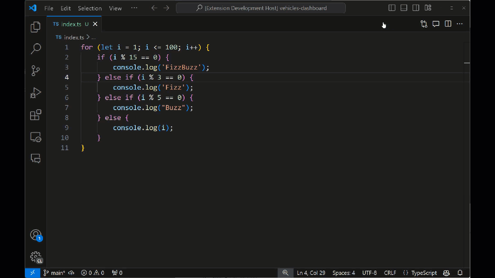
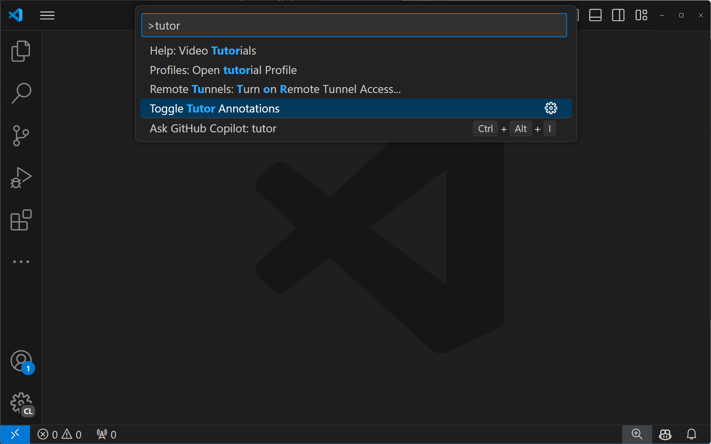
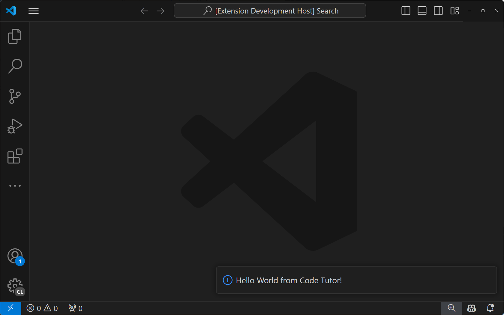
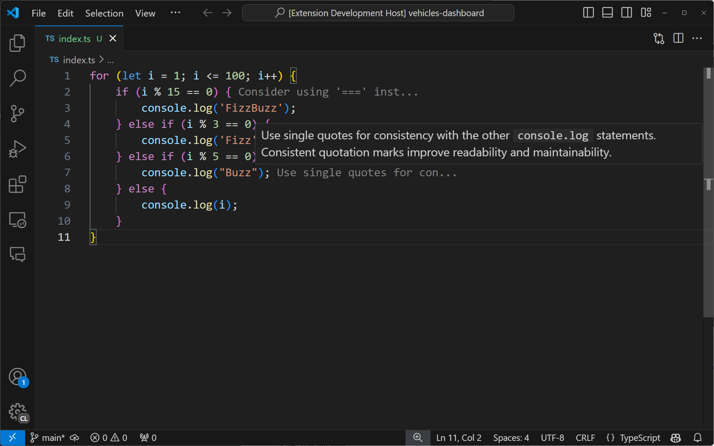

# 教程：使用 Language Model API 生成 AI 驱动的代码注解

在本教程中，你将学习如何创建一个 VS Code 扩展来构建 AI 驱动的代码导师。你将使用 Language Model (LM) API 生成改进代码的建议，并利用 VS Code 扩展 API 将其作为内联注解无缝集成到编辑器中，用户可以悬停查看更多信息。完成本教程后，你将了解如何在 VS Code 中实现自定义 AI 功能。



## 先决条件

完成本教程需要以下工具和账户：

- [Visual Studio Code](https://code.visualstudio.com/download)
- [GitHub Copilot](https://marketplace.visualstudio.com/items?itemName=GitHub.copilot-chat)
- [Node.js](https://nodejs.org/en/download/)

## 搭建扩展项目

首先，使用 Yeoman 和 VS Code Extension Generator 搭建一个准备好开发的 TypeScript 或 JavaScript 项目。

```bash
npx --package yo --package generator-code -- yo code
```

选择以下选项完成新扩展向导...

```bash
# ? What type of extension do you want to create? New Extension (TypeScript)
# ? What's the name of your extension? Code Tutor

### Press <Enter> to choose default for all options below ###

# ? What's the identifier of your extension? code-tutor
# ? What's the description of your extension? LEAVE BLANK
# ? Initialize a git repository? Yes
# ? Bundle the source code with webpack? No
# ? Which package manager to use? npm

# ? Do you want to open the new folder with Visual Studio Code? Open with `code`
```

## 修改 package.json 文件以包含正确的命令

搭建的项目在 `package.json` 文件中包含一个单独的"helloWorld"命令。此命令是安装扩展后在命令面板中显示的内容。

```json
"contributes": {
  "commands": [
      {
      "command": "code-tutor.helloWorld",
      "title": "Hello World"
      }
  ]
}
```

由于我们正在构建一个将为代码行添加注解的 Code Tutor 扩展，我们需要一个命令来允许用户切换这些注解的显示和隐藏。更新 `command` 和 `title` 属性：

```json
"contributes": {
  "commands": [
      {
      "command": "code-tutor.annotate",
      "title": "Toggle Tutor Annotations"
      }
  ]
}
```

虽然 `package.json` 定义了扩展的命令和 UI 元素，但 `src/extension.ts` 文件是你放置这些命令应执行的代码的地方。

打开 `src/extension.ts` 文件，更改 `registerCommand` 方法以匹配 `package.json` 文件中的 `command` 属性。

```ts
const disposable = vscode.commands.registerCommand('code-tutor.annotate', () => {
```

按 `kbstyle(F5)` 运行扩展。这将打开一个安装了该扩展的新 VS Code 实例。按 `kb(workbench.action.showCommands)` 打开命令面板，搜索"tutor"。你应该会看到"Tutor Annotations"命令。



如果你选择"Tutor Annotations"命令，你将看到一条"Hello World"通知消息。



## 实现"annotate"命令

要让 Code Tutor 注解正常工作，我们需要向它发送一些代码并要求它提供注解。我们将分三步完成：

1. 从用户当前打开的标签页获取带行号的代码。
2. 将该代码与自定义提示一起发送给 Language Model API，指示模型如何提供注解。
3. 解析注解并在编辑器中显示它们。

### 第 1 步：获取带行号的代码

要从当前标签页获取代码，我们需要获取用户打开的标签页的引用。我们可以通过将 `registerCommand` 方法修改为 `registerTextEditorCommand` 来实现。这两种命令的区别在于，后者为我们提供了用户打开的标签页的引用，即 `TextEditor`。

```ts
const disposable = vscode.commands.registerTextEditorCommand('code-tutor.annotate', async (textEditor: vscode.TextEditor) => {
```

现在我们可以使用 `textEditor` 引用来获取"可见编辑器空间"中的所有代码。这是屏幕上可以看到的代码 — 不包括在可见编辑器空间上方或下方的代码。

在 `extension.ts` 文件底部 `export function deactivate() { }` 行的正上方添加以下方法。

```ts
function getVisibleCodeWithLineNumbers(textEditor: vscode.TextEditor) {
  // 获取第一行和最后一行可见行的位置
  let currentLine = textEditor.visibleRanges[0].start.line;
  const endLine = textEditor.visibleRanges[0].end.line;

  let code = '';

  // 从当前位置的行获取文本。
  // 行号从 0 开始，所以加 1 使其从 1 开始。
  while (currentLine < endLine) {
    code += `${currentLine + 1}: ${textEditor.document.lineAt(currentLine).text} \n`;
    // 移动到下一行位置
    currentLine++;
  }
  return code;
}
```

此代码使用 TextEditor 的 `visibleRanges` 属性获取编辑器中当前可见行的位置。然后从第一行位置开始，移动到最后一行位置，将每行代码及其行号添加到字符串中。最后，返回包含所有可见代码和行号的字符串。

现在我们可以从 `code-tutor.annotate` 命令中调用此方法。修改命令的实现，使其如下所示：

```ts
const disposable = vscode.commands.registerTextEditorCommand('code-tutor.annotate', async (textEditor: vscode.TextEditor) => {

  // 从当前编辑器获取带行号的代码
  const codeWithLineNumbers = getVisibleCodeWithLineNumbers(textEditor);

});
```

### 第 2 步：将代码和提示发送给语言模型 API

下一步是调用 GitHub Copilot 语言模型，将用户的代码与创建注解的指令一起发送给它。

为此，我们首先需要指定要使用的聊天模型。我们在这里选择 4o，因为它对于我们正在构建的这种交互来说是一个快速且能力强的模型。

```ts
const disposable = vscode.commands.registerTextEditorCommand('code-tutor.annotate', async (textEditor: vscode.TextEditor) => {

  // 从当前编辑器获取带行号的代码
  const codeWithLineNumbers = getVisibleCodeWithLineNumbers(textEditor);

  // 选择 4o 聊天模型
  let [model] = await vscode.lm.selectChatModels({
    vendor: 'copilot',
    family: 'gpt-4o',
  });
});
```

我们需要指令——或者说是"提示"——来告诉模型创建注解以及我们希望响应的格式。在文件顶部紧接导入语句下方添加以下代码。

```ts
const ANNOTATION_PROMPT = `You are a code tutor who helps students learn how to write better code. Your job is to evaluate a block of code that the user gives you and then annotate any lines that could be improved with a brief suggestion and the reason why you are making that suggestion. Only make suggestions when you feel the severity is enough that it will impact the readability and maintainability of the code. Be friendly with your suggestions and remember that these are students so they need gentle guidance. Format each suggestion as a single JSON object. It is not necessary to wrap your response in triple backticks. Here is an example of what your response should look like:

{ "line": 1, "suggestion": "I think you should use a for loop instead of a while loop. A for loop is more concise and easier to read." }{ "line": 12, "suggestion": "I think you should use a for loop instead of a while loop. A for loop is more concise and easier to read." }
`;
```

这是一个特殊的提示，指示语言模型如何生成注解。它还包含模型应如何格式化其响应的示例。这些示例（也称为"多样本"）使我们能够定义响应的格式，以便我们可以解析它并将其显示为注解。

我们通过数组将消息传递给模型。这个数组可以包含任意多条消息。在我们的例子中，它包含提示后跟带行号的用户代码。

```ts
const disposable = vscode.commands.registerTextEditorCommand('code-tutor.annotate', async (textEditor: vscode.TextEditor) => {

  // 从当前编辑器获取带行号的代码
  const codeWithLineNumbers = getVisibleCodeWithLineNumbers(textEditor);

  // 选择 4o 聊天模型
  let [model] = await vscode.lm.selectChatModels({
    vendor: 'copilot',
    family: 'gpt-4o',
  });

  // 初始化聊天消息
  const messages = [
    vscode.LanguageModelChatMessage.User(ANNOTATION_PROMPT),
    vscode.LanguageModelChatMessage.User(codeWithLineNumbers),
  ];
});
```

要向模型发送消息，我们需要首先确保所选模型可用。这处理了扩展未就绪或用户未登录 GitHub Copilot 的情况。然后我们将消息发送给模型。

```ts
const disposable = vscode.commands.registerTextEditorCommand('code-tutor.annotate', async (textEditor: vscode.TextEditor) => {

  // 从当前编辑器获取带行号的代码
  const codeWithLineNumbers = getVisibleCodeWithLineNumbers(textEditor);

  // 选择 4o 聊天模型
  let [model] = await vscode.lm.selectChatModels({
    vendor: 'copilot',
    family: 'gpt-4o',
  });

  // 初始化聊天消息
  const messages = [
    vscode.LanguageModelChatMessage.User(ANNOTATION_PROMPT),
    vscode.LanguageModelChatMessage.User(codeWithLineNumbers),
  ];

  // 确保模型可用
  if (model) {

    // 将消息数组发送给模型并获取响应
    let chatResponse = await model.sendRequest(messages, {}, new vscode.CancellationTokenSource().token);

    // 处理聊天响应
    await parseChatResponse(chatResponse, textEditor);
  }
});
```

聊天响应以片段形式传入。这些片段通常包含单个单词，但有时只包含标点符号。为了在响应流式传输时显示注解，我们希望等到有完整的注解后再显示它。由于我们已经指示模型以特定方式返回其响应，我们知道当看到结束的 `}` 时就有一个完整的注解。然后我们可以解析注解并在编辑器中显示它。

在 `extension.ts` 文件中，在 `getVisibleCodeWithLineNumbers` 方法上方添加缺失的 `parseChatResponse` 函数。

```ts
async function parseChatResponse(chatResponse: vscode.LanguageModelChatResponse, textEditor: vscode.TextEditor) {
 let accumulatedResponse = "";

 for await (const fragment of chatResponse.text) {
  accumulatedResponse += fragment;

  // 如果片段包含 }，我们可以尝试解析整行
  if (fragment.includes("}")) {
   try {
    const annotation = JSON.parse(accumulatedResponse);
    applyDecoration(textEditor, annotation.line, annotation.suggestion);
    // 为下一行重置累加器
    accumulatedResponse = "";
   }
   catch (e) {
    // 什么都不做
   }
  }
 }
}
```

我们还需要最后一个方法来实际显示注解。VS Code 将这些称为"装饰"。在 `extension.ts` 文件中，在 `parseChatResponse` 方法上方添加以下方法。

```ts
function applyDecoration(editor: vscode.TextEditor, line: number, suggestion: string) {

 const decorationType = vscode.window.createTextEditorDecorationType({
  after: {
   contentText: ` ${suggestion.substring(0, 25) + "..."}`,
   color: "grey",
  },
 });

 // 获取指定行号的行末位置
 const lineLength = editor.document.lineAt(line - 1).text.length;
 const range = new vscode.Range(
  new vscode.Position(line - 1, lineLength),
  new vscode.Position(line - 1, lineLength),
 );

 const decoration = { range: range, hoverMessage: suggestion };

 vscode.window.activeTextEditor?.setDecorations(decorationType, [
  decoration,
 ]);
}
```

此方法接收从模型解析出的注解，并使用它来创建装饰。首先创建一个 `TextEditorDecorationType`，指定装饰的外观。在这种情况下，我们只是添加一个灰色的注解并将其截断为 25 个字符。当用户悬停在消息上时，我们将显示完整的消息。

然后我们设置装饰应出现的位置。我们需要它出现在注解中指定的行号处，并在行末。

最后，我们在活动文本编辑器上设置装饰，这就是使注解出现在编辑器中的原因。

如果扩展仍在运行，请从调试栏中选择绿色箭头重新启动它。如果你关闭了调试会话，按 `kbstyle(F5)` 运行扩展。在打开的新 VS Code 窗口实例中打开一个代码文件。当你从命令面板选择"Toggle Tutor Annotations"时，你应该会看到代码注解出现在编辑器中。



## 在编辑器标题栏添加按钮

你可以使命令从命令面板以外的位置调用。在我们的例子中，我们可以在当前标签页顶部添加一个按钮，允许用户轻松切换注解的显示和隐藏。

为此，按如下方式修改 `package.json` 的"contributes"部分：

```json
"contributes": {
  "commands": [
    {
      "command": "code-tutor.annotate",
      "title": "Toggle Tutor Annotations",
      "icon": "$(comment)"
    }
  ],
  "menus": {
    "editor/title": [
      {
        "command": "code-tutor.annotate",
        "group": "navigation"
      }
    ]
  }
}
```

这会使编辑器标题栏的导航区域（右侧）出现一个按钮。"icon"来自[产品图标参考](https://code.visualstudio.com/api/references/icons-in-labels)。

用绿色箭头重新启动你的扩展，或者如果扩展尚未运行则按 `kbstyle(F5)`。你现在应该会看到一个注释图标，它将触发"Toggle Tutor Annotations"命令。


## 下一步

在本教程中，你学习了如何创建一个使用 Language Model API 将 AI 集成到编辑器中的 VS Code 扩展。你使用了 VS Code 扩展 API 从当前标签页获取代码，将其与自定义提示一起发送给模型，然后使用装饰器在编辑器中解析和显示模型结果。

接下来，你可以扩展你的 Code Tutor 扩展，使其[包含一个 Chat Participant](/vscode/extension/extension-guides/ai/chat-tutorial)，这将允许用户通过 GitHub Copilot 聊天界面直接与你的扩展交互。你还可以[探索 VS Code 中完整的 API 范围](/vscode/extension/references/vscode-api)，探索在编辑器中构建自定义 AI 体验的新方式。

你可以在 [vscode-extensions-sample 仓库](https://github.com/microsoft/vscode-extension-samples/tree/main/lm-api-tutorial)中找到本教程的完整源代码。

## 相关内容

- [Language Model API 扩展指南](/vscode/extension/extension-guides/ai/language-model)
- [教程：使用 Chat API 创建代码导师 Chat Participant](/vscode/extension/extension-guides/ai/chat-tutorial)
- [VS Code Chat API 参考](/vscode/extension/extension-guides/ai/chat)
