# MCP 开发者指南

Model Context Protocol (MCP) 是一种开放标准，使 AI 模型能够通过统一接口与外部工具和服务进行交互。Visual Studio Code 实现了完整的 MCP 规范，使你能够创建 MCP 服务器，提供工具、提示和资源，以扩展 VS Code 中 AI 代理的功能。

MCP 服务器提供了 VS Code 中三种可用工具类型之一，与内置工具和扩展贡献的工具并列。了解更多关于[工具类型](/docs/copilot/agents/agent-tools.md#types-of-tools)的信息。

本指南涵盖了构建与 VS Code 及其他 MCP 客户端无缝协作的 MCP 服务器所需的全部知识。

> [!TIP]
> 如需了解作为终端用户使用 MCP 服务器的信息，请参阅[在 VS Code 中使用 MCP 服务器](/docs/copilot/customization/mcp-servers.md)。

## 为什么使用 MCP 服务器？

实现 MCP 服务器以通过语言模型工具扩展 VS Code 中的聊天功能，具有以下优势：

- **扩展代理模式**：提供专门的、领域特定的工具，作为响应用户提示的一部分被自动调用。例如，启用数据库脚手架和查询功能，以动态方式为 LLM 提供相关上下文。
- **灵活的部署选项**：支持本地和远程场景。
- **复用性**：你的 MCP 服务器可在不同工具和平台间复用。

在以下场景中，你可能会考虑使用 [Language Model API](/vscode/extension/extension-guides/ai/tools) 来实现语言模型工具：

- 你希望利用扩展 API 与 VS Code 进行深度集成。
- 你希望通过 Visual Studio Marketplace 分发你的工具和更新。

## VS Code 支持的 MCP 功能

VS Code 支持以下 MCP 功能：

* [传输方式](https://modelcontextprotocol.io/specification/2025-06-18/basic/transports)：
    * 本地标准输入/输出（`stdio`）
    * 可流式 HTTP（`http`）
    * 服务器发送事件（`sse`）— 旧版支持。

* [特性](https://modelcontextprotocol.io/specification/2025-06-18#features)：
    * 工具：使用额外工具扩展[代理模式](/docs/copilot/chat/chat-agent-mode)
    * 提示：在聊天中添加可复用提示作为斜杠命令
    * 资源：提供数据和内容，用户可将其添加为聊天上下文，或直接在 VS Code 中与之交互
    * 请求输入：向用户请求输入
    * 采样：使用用户配置的模型和订阅发起语言模型请求
    * 身份验证：使用 OAuth 授权访问 MCP 服务器
    * 服务器指令
    * 根目录：提供用户工作区根文件夹的信息
    * [MCP Apps](https://modelcontextprotocol.github.io/ext-apps/api/)：从工具返回交互式 UI 组件

### 工具

#### 工具定义

VS Code 在代理模式下支持 MCP 工具，工具会根据任务需要被调用。用户可以通过工具选择器启用和配置工具。工具描述会与工具名称一起显示在工具选择器中，以及在运行工具前请求确认的对话框中显示。

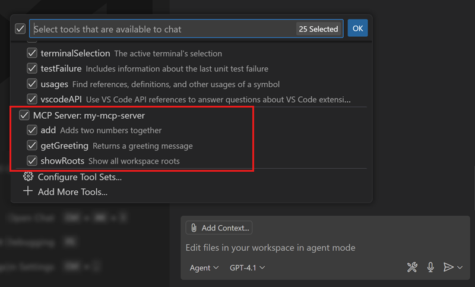

用户可以在工具确认对话框中编辑模型生成的输入参数。对于所有未标记 `readOnlyHint` 注解的工具，都会显示确认对话框。

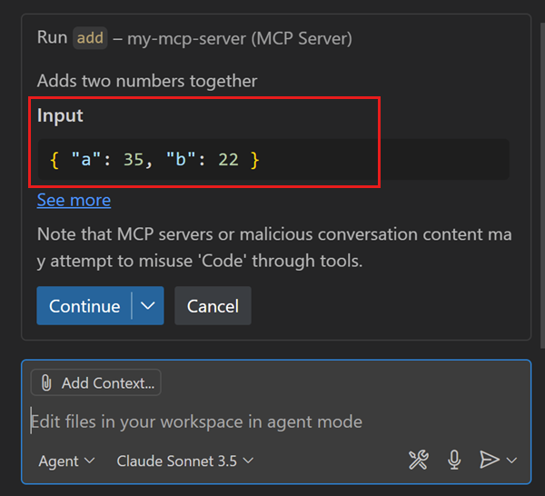

#### 动态工具发现

VS Code 还支持[动态工具发现](https://modelcontextprotocol.io/docs/concepts/tools#tool-discovery-and-updates)，允许服务器在运行时注册工具。例如，服务器可以根据工作区中检测到的框架或语言提供不同的工具，或者根据用户的聊天提示动态调整。

#### 工具注解

如需提供关于工具行为的额外元数据，你可以使用[工具注解](https://modelcontextprotocol.io/docs/concepts/tools#tool-annotations)：

- `title`：工具的人类可读标题，在工具被调用时显示在聊天视图中
- `readOnlyHint`：可选提示，指示工具是否为只读。VS Code 不会为只读工具请求确认。

### 资源

资源使你能够以结构化方式向用户提供数据和内容。用户可以在 VS Code 中直接访问资源，或将其用作聊天提示中的上下文。例如，MCP 服务器可以生成截图并将其作为资源提供，或者提供日志文件的访问，并实时更新。

定义 MCP 资源时，资源名称会显示在 MCP 资源快速选择中。可以通过 **MCP: Browse Resources** 命令打开资源，或通过 **Add Context** 然后选择 **MCP Resource** 将资源附加到聊天请求。资源可以包含文本或二进制内容。

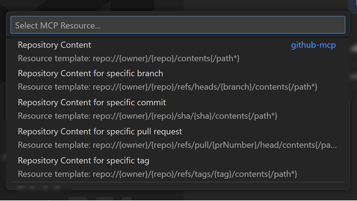

VS Code 支持资源更新，使用户能够在编辑器中实时查看资源内容的变化。

#### 资源模板

VS Code 还支持[资源模板](https://modelcontextprotocol.io/docs/concepts/resources#resource-templates)，允许用户在引用资源时提供输入参数。例如，数据库查询工具可以要求输入数据库表名。

通过模板访问资源时，用户会在快速选择中被提示输入所需参数。你可以提供补全建议来为参数推荐值。

### 提示

提示是可复用的聊天提示模板，用户可以通过斜杠命令（`mcp.servername.promptname`）在聊天中调用。提示非常适合引导用户了解你的服务器，通过突出展示各种工具或提供适应用户本地上下文和服务的内置复杂工作流。

如果你定义了[补全](https://modelcontextprotocol.io/specification/2025-06-18/server/utilities/completion)来为提示输入参数建议值，VS Code 会显示一个对话框来收集用户的输入。

```typescript
server.prompt(
    "teamGreeting", "Generate a greeting for team members",
    {
        name: completable(z.string(), (value) => {
            return ["Alice", "Bob", "Charlie"].filter(n => n.startsWith(value));
        })
    },
    async ({ name }) => ({
        messages: [{
            role: "assistant",
            content: { type: "text", text: `Hello ${name}, welcome to the team!` }
        }]
    })
);
```

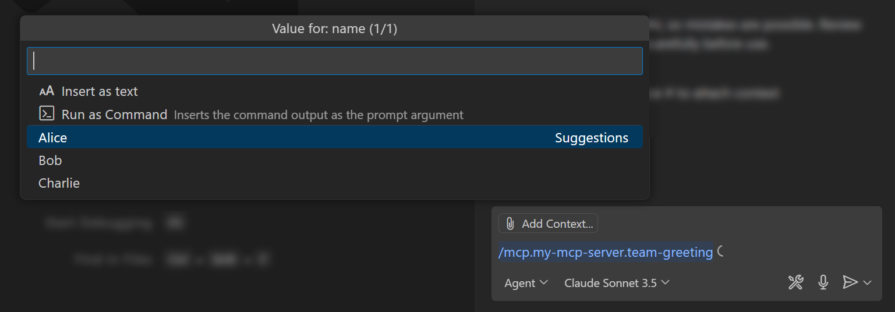

> [!NOTE]
> 用户可以在提示对话框中输入终端命令，并将命令输出作为提示的输入。

当你在提示响应中包含资源类型时，VS Code 会将该资源作为上下文附加到聊天提示。

### 授权

VS Code 支持需要身份验证的 MCP 服务器，允许用户与代表其账户操作的 MCP 服务器进行交互。

[授权规范](https://modelcontextprotocol.io/specification/2025-06-18/basic/authorization)将 MCP 服务器作为资源服务器与授权服务器清晰分离，允许开发者将身份验证委托给现有身份提供商（IdP），而无需从头构建自己的 OAuth 实现。

VS Code 内置了对 GitHub 和 Microsoft Entra 的身份验证支持。如果你的 MCP 服务器实现了最新规范并使用 GitHub 或 Microsoft Entra 作为授权服务器，用户可以通过 **Accounts 菜单** > **Manage Trusted MCP Servers** 操作来管理哪些 MCP 服务器可以访问其账户。

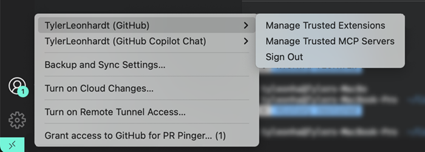

VS Code 支持使用 OAuth 2.1 标准进行授权，并支持使用 2.0 标准对接 GitHub 和 Microsoft Entra 以外的 IdP。VS Code 首先发起[动态客户端注册（DCR）](https://modelcontextprotocol.io/specification/2025-06-18/basic/authorization#dynamic-client-registration)握手，如果 IdP 不支持 DCR，则回退到客户端凭据流程。这为各种 IdP 提供了更大的灵活性，使其可以为每个 MCP 服务器创建静态客户端 ID 或特定的客户端 ID-密钥对。

用户随后也可以通过 **Accounts 菜单** 查看其身份验证状态。要移除动态客户端注册，用户可以在命令面板中使用 **Authentication: Remove Dynamic Authentication Providers** 命令。

以下是一份检查清单，用于确保你的 MCP 服务器与 VS Code 的 OAuth 流程正常工作：

1. MCP 服务器定义了 [MCP 授权规范](https://modelcontextprotocol.io/specification/2025-06-18/basic/authorization)。
2. IdP 必须支持 DCR 或客户端凭据
3. 重定向 URL 列表必须包含以下 URL：`http://127.0.0.1:33418` 和 `https://vscode.dev/redirect`

当 MCP 服务器不支持 DCR 时，用户将经历回退的客户端凭据流程：

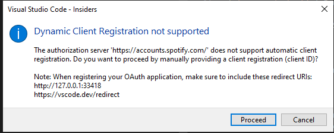

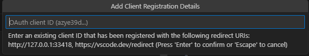

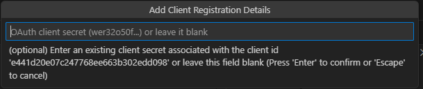

> [!NOTE]
> VS Code 仍然支持作为授权服务器的 MCP 服务器，但建议新服务器使用最新规范。

### 采样

VS Code 为 MCP 服务器提供[采样](https://modelcontextprotocol.io/docs/concepts/sampling)访问。这允许你的 MCP 服务器使用用户配置的模型和订阅发起语言模型请求。例如，使用采样来汇总大型数据集、在发送到客户端之前提取信息，或在工具中实现代理式决策逻辑。

MCP 服务器首次执行采样请求时，会提示用户授权该服务器访问其模型。

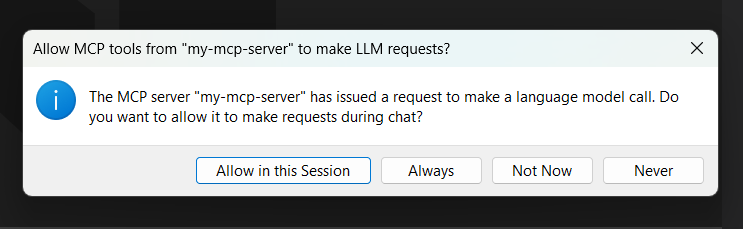

在使用特定模型进行采样请求时，请注意用户可以通过命令面板中的 **MCP: List Servers** > **Configure Model Access** 命令限制 MCP 服务器可使用的模型。当你在 MCP 服务器中指定 `modelPreferences` 来提供关于采样应使用哪些模型的提示时，VS Code 会从允许的模型中进行选择。

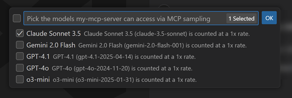

用户可以通过命令面板中的 **MCP: List Servers** > **Show Sampling Requests** 命令查看 MCP 服务器发出的采样请求。

### 工作区根目录

VS Code 向 MCP 服务器提供用户的工作区根文件夹信息。

### MCP Apps

MCP Apps 使工具能够返回交互式 UI 组件，这些组件在聊天中以内联方式渲染，而非仅显示文本输出。这适用于拖拽列表排序、可视化、表单和多步工作流等场景。

#### 架构

MCP Apps 使用 Tool + UI Resource 模式：

1. 定义一个工具，返回指向 UI 资源的 `_meta.ui.resourceUri`
1. 使用 `ui://` URI 方案和 MIME 类型 `text/html;profile=mcp-app` 创建 UI 资源
1. HTML 资源在沙箱 iframe 中运行，使用 MCP Apps SDK 与 VS Code 通信

#### SDK

使用 [`@modelcontextprotocol/ext-apps`](https://github.com/modelcontextprotocol/ext-apps) 包来构建 MCP Apps。SDK 提供：

- **`App` 类**：与宿主通信的主要接口
    - `connect()`：建立与 VS Code 的连接
    - `callServerTool(name, args)`：调用原始 MCP 服务器上的工具
    - `sendMessage(content)`：向聊天输入框发送消息
    - `updateModelContext(context)`：为后续对话轮次提供上下文
    - `openLink(url)`：请求在浏览器中打开 URL
    - `sendLog(level, message)`：发送调试日志（不会添加到对话中）

- **通知处理器**：设置这些以接收来自 VS Code 的事件
    - `ontoolinput`：接收完整的工具参数
    - `ontoolinputpartial`：接收流式部分参数
    - `ontoolresult`：接收工具执行结果
    - `ontoolcancelled`：处理工具取消
    - `onhostcontextchanged`：响应主题或语言环境变化
    - `onteardown`：卸载前的清理

#### VS Code 行为和限制

| 功能 | VS Code 支持 |
| ------- | --------------- |
| 显示模式 | 仅 `inline`（不支持 `fullscreen` 或 `pip`） |
| 发送消息 | 填充聊天输入框；不会自动发送 |
| 上下文更新 | 显示为附件 |
| 剪贴板写入 | 支持 |
| 摄像头、麦克风、地理位置 | 不支持 |

#### 安全

MCP Apps 在具有内容安全策略（CSP）强制执行的沙箱 iframe 中运行。定义 UI 资源时，声明你的应用需要访问的域名：

- `connectDomains`：用于 fetch/XHR 请求的域名
- `resourceDomains`：用于图片、字体和其他资源的域名
- `frameDomains`：可以嵌入 iframe 的域名

#### 了解更多

- [MCP Apps 规范](https://modelcontextprotocol.github.io/ext-apps/api/)
- [MCP Apps SDK 和示例](https://github.com/modelcontextprotocol/ext-apps)
- [MCP Apps 公告博文](https://code.visualstudio.com/blogs/2026/01/26/mcp-apps-support)

### 图标

VS Code 支持在 MCP 服务器、资源和工具上提供 `icons`。MCP 图标有一个 `src` 属性，是一个指向图片的 URI：

- 使用 HTTP 或 SSE 传输的 MCP 服务器可以从托管 MCP 服务器的同一域名提供图片。例如，配置在 `https://example.com/mcp` 的服务器可以从 `example.com` 提供图片。
- 使用 stdio 传输的 MCP 服务器可以使用 `file:///` URI 从文件系统提供图片。
- 任何 MCP 服务器都可以使用以 `data:` 开头的数据 URI 嵌入图片。

## 将 MCP 服务器添加到 VS Code

用户可以通过多种方式在 VS Code 中添加 MCP 服务器：

- 从网页直接安装：在你的网站上使用特殊的 MCP 安装 URL（`vscode:mcp/install`）。
- 工作区配置：在工作区的 `.vscode/mcp.json` 文件中指定服务器配置。
- 全局配置：在用户[配置文件](/docs/configure/profiles)中全局定义服务器。
- 自动发现：VS Code 可以从 Claude Desktop 等其他工具发现服务器。
- 扩展：VS Code 扩展可以通过编程方式注册 MCP 服务器。
- 命令行：使用 `--add-mcp` VS Code 命令行选项从命令行安装 MCP 服务器。

了解更多关于[将 MCP 服务器添加到 VS Code](/docs/copilot/customization/mcp-servers#add-an-mcp-server) 的不同方式。

## 管理 MCP 服务器

你可以从 VS Code 的扩展视图（`kb(workbench.view.extensions)`）管理已安装的 MCP 服务器列表。

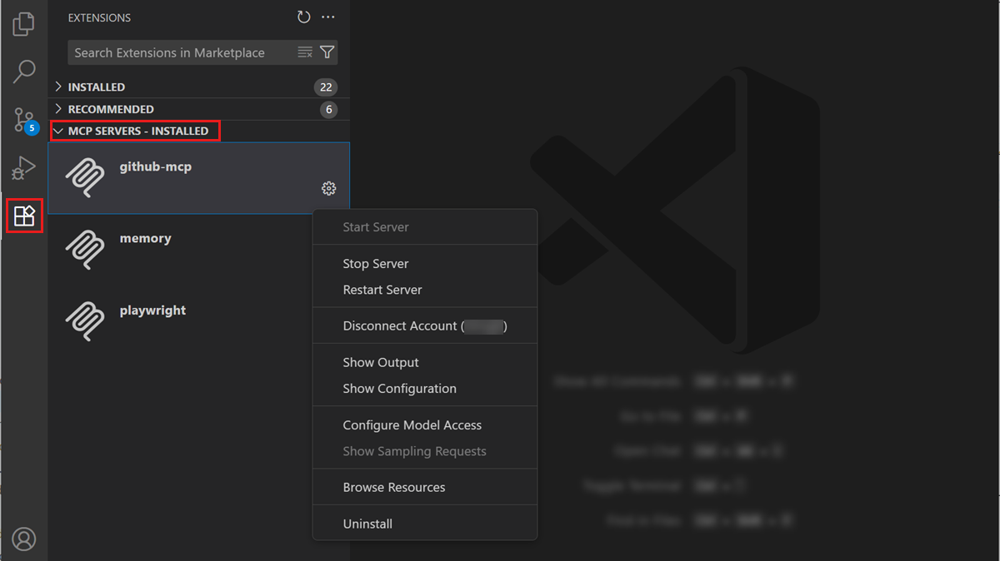

右键点击 MCP 服务器或选择齿轮图标，可以对服务器执行不同的管理操作。或者，从命令面板运行 **MCP: List Servers** 命令查看已配置的 MCP 服务器列表。然后你可以选择一个服务器并对其执行操作。

> [!TIP]
> 当你打开 `.vscode/mcp.json` 文件时，VS Code 会在编辑器中显示命令，可以直接在编辑器中启动、停止或重启服务器。
>
> 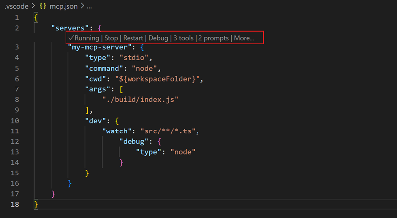

## 创建 MCP 安装 URL

VS Code 提供了一个 URL 处理程序用于从链接安装 MCP 服务器：`vscode:mcp/install?{json-configuration}`（Insiders 版本：`vscode-insiders:mcp/install?{json-configuration}`）。

以 `{\"name\":\"server-name\",\"command\":...}` 形式提供 JSON 服务器配置，然后对其进行 JSON 序列化和 URL 编码。例如，使用以下逻辑创建安装 URL：

```typescript
// Insiders 版本请使用 `vscode-insiders` 代替 `code`
const link = `vscode:mcp/install?${encodeURIComponent(JSON.stringify(obj))}`;
```

此链接可以在浏览器中使用，或在命令行中打开，例如在 Linux 上通过 `xdg-open $LINK`。

## 在扩展中注册 MCP 服务器

要在扩展中注册 MCP 服务器，你需要执行以下步骤：

1. 在扩展的 `package.json` 文件中定义 MCP 服务器定义提供者。
1. 使用 [`vscode.lm.registerMcpServerDefinitionProvider`](/vscode/extension/references/vscode-api#lm.registerMcpServerDefinitionProvider) API 在扩展代码中实现 MCP 服务器定义提供者。

你可以通过一个基础的[如何在 VS Code 扩展中注册 MCP 服务器的示例](https://github.com/microsoft/vscode-extension-samples/blob/main/mcp-extension-sample)开始。

### 1. 在 `package.json` 中进行静态配置

想要注册 MCP 服务器的扩展必须在 `package.json` 中通过 `id` 贡献 `contributes.mcpServerDefinitionProviders` 扩展点。此 `id` 应与实现中使用的 `id` 一致。

```json
{
    ...
    "contributes": {
        "mcpServerDefinitionProviders": [
            {
                "id": "exampleProvider",
                "label": "Example MCP Server Provider"
            }
        ]
    }
    ...
}
```

### 2. 实现提供者

要在扩展中注册 MCP 服务器，请使用 [`vscode.lm.registerMcpServerDefinitionProvider`](/vscode/extension/references/vscode-api#lm.registerMcpServerDefinitionProvider) API 为服务器提供 [MCP 配置](/docs/copilot/reference/mcp-configuration.md)。该 API 接受一个 `providerId` 字符串和一个 `McpServerDefinitionProvider` 对象。

`McpServerDefinitionProvider` 对象有三个属性：

- `onDidChangeMcpServerDefinitions`：当 MCP 服务器配置发生变化时触发的事件。
- `provideMcpServerDefinitions`：返回 MCP 服务器配置数组（`vscode.McpServerDefinition[]`）的函数。
- `resolveMcpServerDefinition`：编辑器在需要启动 MCP 服务器时调用的函数。使用此函数执行可能需要用户交互的额外操作，例如身份验证。

`McpServerDefinition` 对象可以是以下类型之一：

- `vscode.McpStdioServerDefinition`：表示通过运行本地进程并操作其 stdin 和 stdout 流来提供的 MCP 服务器。
- `vscode.McpHttpServerDefinition`：表示使用可流式 HTTP 传输的 MCP 服务器。

<details>
<summary>MCP 服务器定义提供者示例</summary>

以下示例演示了如何在扩展中注册 MCP 服务器，并在启动服务器时提示用户输入 API 密钥。

```ts
import * as vscode from 'vscode';

export function activate(context: vscode.ExtensionContext) {
    const didChangeEmitter = new vscode.EventEmitter<void>();

    context.subscriptions.push(vscode.lm.registerMcpServerDefinitionProvider('exampleProvider', {
        onDidChangeMcpServerDefinitions: didChangeEmitter.event,
        provideMcpServerDefinitions: async () => {
            let servers: vscode.McpServerDefinition[] = [];

            // stdio 服务器定义示例
            servers.push(new vscode.McpStdioServerDefinition(
            {
                label: 'myServer',
                command: 'node',
                args: ['server.js'],
                cwd: vscode.Uri.file('/path/to/server'),
                env: {
                    API_KEY: ''
                },
                version: '1.0.0'
            });

            // HTTP 服务器定义示例
            servers.push(new vscode.McpHttpServerDefinition(
            {
                label: 'myRemoteServer',
                uri: 'http://localhost:3000',
                headers: {
                    'API_VERSION': '1.0.0'
                },
                version: '1.0.0'
            }));

            return servers;
        },
        resolveMcpServerDefinition: async (server: vscode.McpServerDefinition) => {

            if (server.label === 'myServer') {
                // 从用户获取 API 密钥，例如使用 vscode.window.showInputBox
                // 使用 API 密钥更新服务器定义
            }

            // 返回 undefined 表示不应启动服务器，或抛出错误
            // 如果有待处理的工具调用，编辑器将取消它并向语言模型返回错误消息
            return server;
        }
    }));
}
```

</details>

## 排查和调试 MCP 服务器

### VS Code 中的 MCP 开发模式

开发 MCP 服务器时，你可以通过在 MCP 服务器配置中添加 `dev` 键来启用 MCP 服务器的_开发模式_。这是一个包含两个属性的对象：

* `watch`：用于监视文件变更的文件 glob 模式，文件变更将触发 MCP 服务器重启。
* `debug`：使你能够为 MCP 服务器设置调试器。目前，VS Code 支持调试 Node.js 和 Python MCP 服务器。

    <details>
    <summary>Node.js MCP 服务器</summary>

    要调试 Node.js MCP 服务器，请将 `debug.type` 属性设置为 `node`。

    ```json
    {
        "servers": {
            "my-mcp-server": {
                "type": "stdio",
                "command": "node",
                "cwd": "${workspaceFolder}",
                "args": [ "./build/index.js" ],
                "dev": {
                    "watch": "src/**/*.ts",
                    "debug": { "type": "node" }
                }
            }
        }
    }
    ```

    </details>

    <details>
    <summary>Python MCP 服务器</summary>

    要调试 Python MCP 服务器，请将 `debug.type` 属性设置为 `debugpy`，如果 `debugpy` 模块未安装在默认 Python 环境中，可选地设置 `debug.debugpyPath` 属性为 `debugpy` 模块的路径。

    ```json
    {
        "servers": {
            "my-python-mcp-server": {
                "type": "stdio",
                "command": "python",
                "cwd": "${workspaceFolder}",
                "args": [ "./server.py" ],
                "dev": {
                    "watch": "**/*.py",
                    "debug": {
                        "type": "debugpy",
                        "debugpyPath": "/path/to/debugpy"
                    }
                }
            }
        }
    }
    ```

    </details>

### MCP 输出日志

当 VS Code 遇到 MCP 服务器的问题时，会在聊天视图中显示错误指示器。

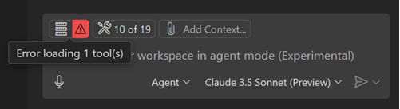

在聊天视图中选择错误通知，然后选择 **Show Output** 选项查看服务器日志。或者，从命令面板运行 **MCP: List Servers**，选择服务器，然后选择 **Show Output**。

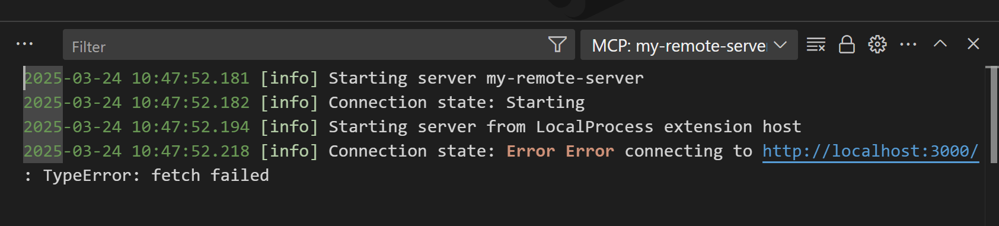

## 最佳实践

- **命名规范**以确保名称唯一且具描述性
- **实现正确的错误处理和验证**，提供描述性错误消息
- **使用进度报告**告知用户长时间运行的操作
- **保持工具操作聚焦和原子化**以避免复杂交互
- **清晰地记录你的工具**，提供有助于用户理解何时使用工具的描述
- **优雅地处理缺失的输入参数**，提供默认值或清晰的错误消息
- **为资源设置 MIME 类型**以确保在 VS Code 中正确处理不同内容类型
- **使用资源模板**允许用户在访问资源时提供输入参数
- **缓存资源内容**以提高性能并减少不必要的网络请求
- **为采样请求设置合理的 token 限制**以避免过度资源消耗
- **在使用之前验证采样响应**

### 命名规范

以下命名规范建议适用于 MCP 服务器及其组件：

| 组件 | 命名规范指南 |
|-----------|----------------------------|
| 工具名称 | <ul><li>在 MCP 服务器内唯一</li><li>描述操作及其目标</li><li>使用蛇形命名法，结构为 `{动词}_{名词}`</li><li>示例：`generate_report`、`fetch_data`、`analyze_code`</li></ul> |
| 工具输入参数 | <ul><li>描述参数的用途</li><li>多词参数使用 camelCase</li><li>示例：`path`、`queryString`、`userId`</li></ul> |
| 资源名称 | <ul><li>在 MCP 服务器内唯一</li><li>描述资源的内容</li><li>使用标题大小写</li><li>示例：`Application Logs`、`Database Table`、`GitHub Repository`</li></ul> |
| 资源模板参数 | <ul><li>描述参数的用途</li><li>多词参数使用 camelCase</li><li>示例：`name`、`repo`、`fileType`</li></ul> |
| 提示名称 | <ul><li>在 MCP 服务器内唯一</li><li>描述提示的预期用途</li><li>多词参数使用 camelCase</li><li>示例：`generateApiRoute`、`performSecurityReview`、`analyzeCodeQuality`</li></ul> |
| 提示输入参数 | <ul><li>描述参数的用途</li><li>多词参数使用 camelCase</li><li>示例：`filePath`、`queryString`、`userId`</li></ul> |

## 开始创建 MCP 服务器

VS Code 提供了开发你自己的 MCP 服务器所需的所有工具。虽然 MCP 服务器可以用任何能处理 `stdout` 的语言编写，但 MCP 的官方 SDK 是一个很好的起点：

- [TypeScript SDK](https://github.com/modelcontextprotocol/typescript-sdk)
- [Python SDK](https://github.com/modelcontextprotocol/python-sdk)
- [Java SDK](https://github.com/modelcontextprotocol/java-sdk)
- [Kotlin SDK](https://github.com/modelcontextprotocol/kotlin-sdk)
- [C# SDK](https://github.com/modelcontextprotocol/csharp-sdk)

你可能还会发现 [MCP for Beginners 课程](https://github.com/microsoft/mcp-for-beginners)对开始构建你的第一个 MCP 服务器很有帮助。

## 相关内容

- [贡献语言模型工具](/vscode/extension/extension-guides/ai/tools)
- [在代理模式中使用 MCP 工具](/docs/copilot/customization/mcp-servers.md)
- [VS Code 精选 MCP 服务器列表](https://code.visualstudio.com/mcp)
- [Model Context Protocol 文档](https://modelcontextprotocol.io/)
