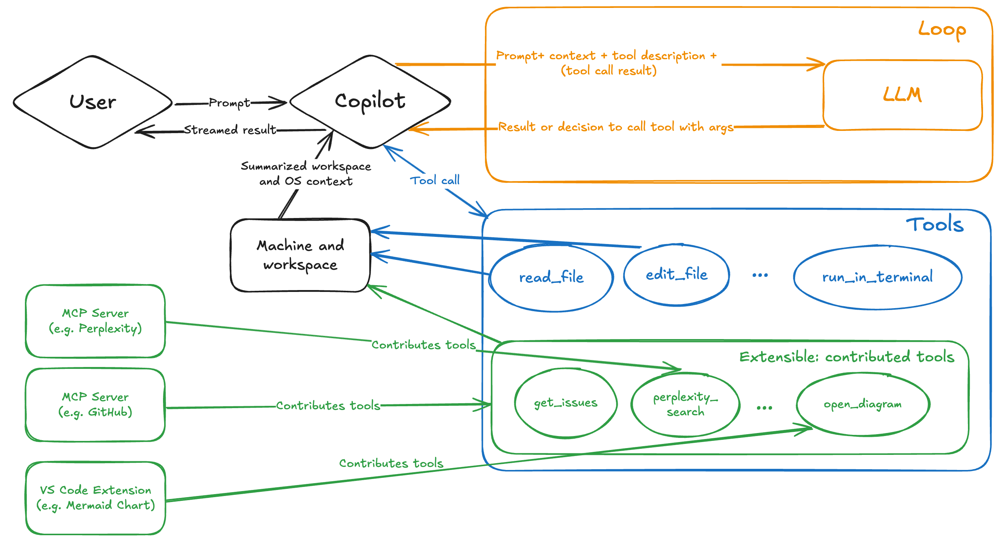

# Language Model Tool API

Language Model Tool 使你能够使用领域特定的功能来扩展大型语言模型（LLM）在聊天中的能力。为了处理用户的聊天提示，VS Code 中的[代理](/docs/copilot/chat/copilot-chat.md)可以自动调用这些工具，以执行对话中的专业任务。

通过在 VS Code 扩展中贡献 Language Model Tool，你可以在扩展代理编码工作流的同时，与编辑器深度集成。扩展工具是 VS Code 中三种可用工具类型之一，另外两种是[内置工具和 MCP 工具](/docs/copilot/agents/agent-tools.md#types-of-tools)。

在本扩展指南中，你将学习如何使用 Language Model Tools API 创建语言模型工具，以及如何在聊天扩展中实现工具调用。

你还可以通过贡献 [MCP 服务器](/vscode/extension/extension-guides/ai/mcp)来使用专业工具扩展聊天体验。有关不同选项及如何选择合适方法的详细信息，请参阅 [AI 可扩展性概述](/vscode/extension/extension-guides/ai/ai-extensibility-overview)。

> [!TIP]
> 有关作为终端用户使用工具的信息，请参阅[在聊天中使用工具](/docs/copilot/agents/agent-tools.md)。

## LLM 中的工具调用是什么？

语言模型工具是一个可以作为语言模型请求的一部分被调用的函数。例如，你可能有一个从数据库检索信息、执行某些计算或调用在线 API 的函数。当你在 VS Code 扩展中贡献一个工具时，Agent 模式可以根据对话的上下文调用该工具。

LLM 本身并不会实际执行工具，而是生成用于调用你工具的参数。因此，清晰地描述工具的用途、功能和输入参数非常重要，这样工具才能在正确的上下文中被调用。

下图展示了 VS Code Agent 模式中的工具调用流程。有关具体步骤的详细信息，请参阅[工具调用流程](#tool-calling-flow)。



在 OpenAI 文档中了解更多关于[函数调用](https://platform.openai.com/docs/guides/function-calling)的信息。

## 为什么在扩展中实现 Language Model Tool？

在扩展中实现 Language Model Tool 有以下几个好处：

- **扩展 Agent 模式**：提供专业的、领域特定的工具，作为响应用户提示的一部分自动调用。例如，启用数据库脚手架和查询，以动态地向 LLM 提供相关上下文。
- **与 VS Code 深度集成**：使用丰富的扩展 API。例如，使用[调试 API](/vscode/extension/extension-guides/debugger-extension) 获取当前调试上下文，并将其作为工具功能的一部分。
- **分发和部署**：通过 Visual Studio Marketplace 分发工具，为用户提供可靠且无缝的体验。用户无需为你的工具进行单独的安装和更新过程。

在以下场景中，你可能会考虑使用 [MCP 服务器](/vscode/extension/extension-guides/ai/mcp)来实现语言模型工具：

- 你已经有一个 MCP 服务器实现，并且也想在 VS Code 中使用它。
- 你想跨不同开发环境和平台复用同一工具。
- 你的工具作为服务远程托管。
- 你不需要访问 VS Code API。

了解更多关于[不同工具类型之间的差异](/docs/copilot/agents/agent-tools.md#types-of-tools)。

## 创建 Language Model Tool

实现 Language Model Tool 包含两个主要部分：

1. 在扩展的 `package.json` 文件中定义工具的配置。
1. 使用 [Language Model API 参考](/vscode/extension/references/vscode-api#lm)在扩展代码中实现工具。

你可以从一个[基础示例项目](https://github.com/microsoft/vscode-extension-samples/tree/main/chat-sample)开始。

### 1. 在 `package.json` 中进行静态配置

在扩展中定义 Language Model Tool 的第一步是在扩展的 `package.json` 文件中进行定义。此配置包括工具名称、描述、输入模式和其他元数据：

1. 在扩展的 `package.json` 文件的 `contributes.languageModelTools` 部分为你的工具添加一个条目。

1. 为工具指定一个唯一名称：

    | 属性 | 描述 |
    | -------- | ----------- |
    | `name` | 工具的唯一名称，用于在扩展实现代码中引用该工具。名称格式应为 `{动词}_{名词}`。请参阅[命名指南](#guidelines-and-conventions)。 |
    | `displayName` | 工具的用户友好名称，用于在 UI 中显示。 |

1. 如果该工具可以与[代理](/docs/copilot/agents/overview.md#built-in-agents)一起使用，或者可以通过 `#` 在聊天提示中引用，请添加以下属性：

    用户可以在 Chat 视图中启用或禁用该工具，这与 [Model Context Protocol (MCP) 工具](/docs/copilot/customization/mcp-servers.md)的操作方式类似。

    | 属性 | 描述 |
    | -------- | ----------- |
    | `canBeReferencedInPrompt` | 如果该工具可以与[代理](/docs/copilot/agents/overview.md#built-in-agents)一起使用或在聊天中引用，则设置为 `true`。 |
    | `toolReferenceName` | 用户在聊天提示中通过 `#` 引用工具时使用的名称。 |
    | `icon` | 在 UI 中为工具显示的图标。 |
    | `userDescription` | 工具的用户友好描述，用于在 UI 中显示。 |

1. 在 `modelDescription` 中添加详细描述。LLM 会使用此信息来确定你的工具应该在什么上下文中使用。

    - 工具具体做什么？
    - 它返回什么类型的信息？
    - 它应该在何时使用，何时不应该使用？
    - 描述工具的重要限制或约束。

1. 如果工具接受输入参数，请添加描述工具输入参数的 `inputSchema` 属性。

    此 JSON 模式描述了一个对象，包含工具作为输入接受的属性，以及它们是否为必需的。文件路径应为绝对路径。

    描述每个参数的作用以及它与工具功能的关系。

1. 添加 `when` 子句以控制工具何时可用。

    `languageModelTools` 贡献点允许你通过使用 [when 子句](/vscode/extension/references/when-clause-contexts)来限制工具何时可用于 Agent 模式或在提示中引用。例如，获取调试调用栈信息的工具应该只在用户调试时才可用。

    ```json
    "contributes": {
        "languageModelTools": [
            {
                "name": "chat-tools-sample_tabCount",
                ...
                "when": "debugState == 'running'"
            }
        ]
    }
    ```

<details>
<summary>工具定义示例</summary>

以下示例展示了如何定义一个计算标签组中活动标签页数量的工具。

```json
"contributes": {
    "languageModelTools": [
        {
            "name": "chat-tools-sample_tabCount",
            "tags": [
                "editors",
                "chat-tools-sample"
            ],
            "toolReferenceName": "tabCount",
            "displayName": "Tab Count",
            "modelDescription": "The number of active tabs in a tab group in VS Code.",
            "userDescription": "Count the number of active tabs in a tab group.",
            "canBeReferencedInPrompt": true,
            "icon": "$(files)",
            "inputSchema": {
                "type": "object",
                "properties": {
                    "tabGroup": {
                        "type": "number",
                        "description": "The index of the tab group to check. This is optional- if not specified, the active tab group will be checked.",
                        "default": 0
                    }
                }
            }
        }
    ]
}
```

</details>

### 2. 工具实现

使用 [Language Model API](/vscode/extension/references/vscode-api#lm) 实现 Language Model Tool。这包含以下步骤：

1. 在扩展激活时，使用 [`vscode.lm.registerTool`](/vscode/extension/references/vscode-api#lm.registerTool) 注册工具。

    提供你在 `package.json` 的 `name` 属性中指定的工具名称。

    如果你希望工具仅在扩展内部使用（不对外暴露），请跳过工具注册步骤。

    ```ts
    export function registerChatTools(context: vscode.ExtensionContext) {
        context.subscriptions.push(vscode.lm.registerTool('chat-tools-sample_tabCount', new TabCountTool()));
    }
    ```

1. 创建一个实现 [`vscode.LanguageModelTool<>`](/vscode/extension/references/vscode-api#LanguageModelTool&lt;T&gt;) 接口的类。

1. 在 `prepareInvocation` 方法中添加工具确认消息。

    对于来自扩展的工具，总会显示一个通用的确认对话框，但工具可以自定义确认消息。为用户提供足够的上下文来理解工具正在做什么。消息可以是包含代码块的 `MarkdownString`。

    以下示例展示了如何为标签计数工具提供确认消息。

    ```ts
    async prepareInvocation(
        options: vscode.LanguageModelToolInvocationPrepareOptions<ITabCountParameters>,
        _token: vscode.CancellationToken
    ) {
        const confirmationMessages = {
            title: 'Count the number of open tabs',
            message: new vscode.MarkdownString(
                `Count the number of open tabs?` +
                (options.input.tabGroup !== undefined
                    ? ` in tab group ${options.input.tabGroup}`
                    : '')
            ),
        };

        return {
            invocationMessage: 'Counting the number of tabs',
            confirmationMessages,
        };
    }
    ```

    如果 `prepareInvocation` 返回 `undefined`，将显示通用确认消息。请注意，用户也可以选择对某个工具"始终允许"。

1. 定义一个描述工具输入参数的接口。

    该接口用于 `vscode.LanguageModelTool` 类的 `invoke` 方法中。输入参数会根据你在 `package.json` 的 `inputSchema` 中定义的 JSON 模式进行验证。

    以下示例展示了标签计数工具的接口。

    ```ts
    export interface ITabCountParameters {
        tabGroup?: number;
    }
    ```

1. 实现 `invoke` 方法。当处理聊天提示时调用 Language Model Tool，此方法会被调用。

    `invoke` 方法通过 `options` 参数接收工具输入参数。这些参数会根据 `package.json` 的 `inputSchema` 中定义的 JSON 模式进行验证。

    当发生错误时，抛出一个对 LLM 有意义的错误消息。可以选择提供关于 LLM 接下来应该做什么的指令，例如使用不同参数重试或执行不同的操作。

    以下示例展示了标签计数工具的实现。工具的结果是一个 `vscode.LanguageModelToolResult` 类型的实例。

    ```ts
    async invoke(
        options: vscode.LanguageModelToolInvocationOptions<ITabCountParameters>,
        _token: vscode.CancellationToken
    ) {
        const params = options.input;
        if (typeof params.tabGroup === 'number') {
            const group = vscode.window.tabGroups.all[Math.max(params.tabGroup - 1, 0)];
            const nth =
                params.tabGroup === 1
                    ? '1st'
                    : params.tabGroup === 2
                        ? '2nd'
                        : params.tabGroup === 3
                            ? '3rd'
                            : `${params.tabGroup}th`;
            return new vscode.LanguageModelToolResult([new vscode.LanguageModelTextPart(`There are ${group.tabs.length} tabs open in the ${nth} tab group.`)]);
        } else {
            const group = vscode.window.tabGroups.activeTabGroup;
            return new vscode.LanguageModelToolResult([new vscode.LanguageModelTextPart(`There are ${group.tabs.length} tabs open.`)]);
        }
    }
    ```

在 VS Code 扩展示例仓库中查看实现 [Language Model Tool](https://github.com/microsoft/vscode-extension-samples/blob/main/chat-sample/src/tools.ts) 的完整源代码。

## 工具调用流程

当用户发送聊天提示时，会经历以下步骤：

1. Copilot 根据用户的配置确定可用工具列表。

    工具列表由内置工具、扩展注册的工具和来自 [MCP 服务器](/docs/copilot/customization/mcp-servers.md)的工具组成。你可以通过扩展或 MCP 服务器向 Agent 模式贡献工具（图中绿色部分）。

1. Copilot 将请求发送给 LLM，并提供提示、聊天上下文以及可供考虑的工具定义列表。

    LLM 生成响应，其中可能包含一个或多个调用工具的请求。

1. 如有需要，Copilot 使用 LLM 提供的参数值调用建议的工具。

    一个工具的响应可能会导致更多的工具调用请求。

1. 如果存在错误或后续工具请求，Copilot 会迭代工具调用流程，直到所有工具请求都被处理。

1. Copilot 将最终响应返回给用户，其中可能包含来自多个工具的响应。

## 指南与约定

- **命名**：为工具和参数编写清晰且具有描述性的名称。

    - **工具名称**：应当唯一，并清晰描述其意图。工具名称的格式应为 `{动词}_{名词}`。例如 `get_weather`、`get_azure_deployment` 或 `get_terminal_output`。

    - **参数名称**：应当描述参数的用途。参数名称的格式应为 `{名词}`。例如 `destination_location`、`ticker` 或 `file_name`。

- **描述**：为工具和参数编写详细的描述。

    - 描述工具的功能以及何时应该和不应该使用它。例如，"此工具检索给定位置的天气信息。"
    - 描述每个参数的作用以及它与工具功能的关系。例如，"`destination_location` 参数指定要检索天气信息的位置。它应该是一个有效的地点名称或坐标。"
    - 描述工具的重要限制或约束。例如，"此工具仅检索美国地区的天气数据。其他地区可能不适用。"

- **用户确认**：为工具调用提供确认消息。对于来自扩展的工具，总会显示一个通用的确认对话框，但工具可以自定义确认消息。为用户提供足够的上下文来理解工具正在做什么。

- **错误处理**：当发生错误时，抛出一个对 LLM 有意义的错误消息。可以选择提供关于 LLM 接下来应该做什么的指令，例如使用不同参数重试或执行不同的操作。

在 [OpenAI 文档](https://platform.openai.com/docs/guides/function-calling?api-mode=chat#best-practices-for-defining-functions)和 [Anthropic 文档](https://docs.anthropic.com/en/docs/build-with-claude/tool-use/overview)中获取更多创建工具的最佳实践。

## 相关内容

- [Language Model API 参考](/vscode/extension/references/vscode-api#lm)
- [在 VS Code 扩展中注册 MCP 服务器](/vscode/extension/extension-guides/ai/mcp)
- [在 Agent 模式中使用 MCP 工具](/docs/copilot/customization/mcp-servers.md)
