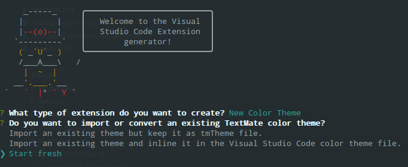
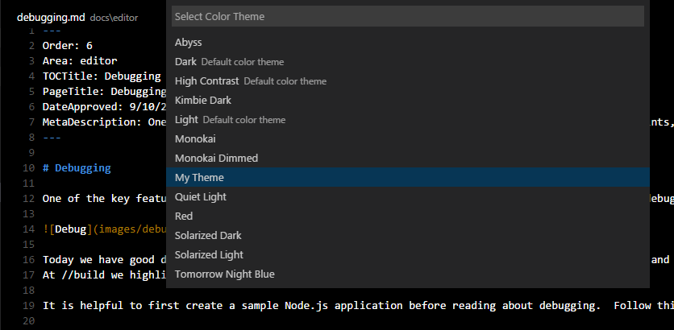

# 颜色主题

Visual Studio Code 用户界面中可见的颜色分为两类：

- 工作台颜色，用于视图和编辑器中，从活动栏到状态栏。所有这些颜色的完整列表可以在[主题颜色参考](/vscode/extension/references/theme-color)中找到。
- 语法颜色和样式，用于编辑器中的源代码。这些颜色的主题机制有所不同，因为语法着色基于 TextMate 语法和 TextMate 主题，以及语义令牌。

本指南将介绍创建主题的不同方式。

## 工作台颜色

创建新工作台颜色主题的最简单方法是从现有颜色主题开始并进行自定义。首先切换到要修改的颜色主题，然后打开[设置](/docs/configure/settings)，修改 `workbench.colorCustomizations` 设置。更改会实时应用到你的 VS Code 实例。

例如，以下配置会更改标题栏的背景颜色：

```json
{
  "workbench.colorCustomizations": {
    "titleBar.activeBackground": "#ff0000"
  }
}
```

所有可主题化颜色的完整列表可以在[颜色参考](/vscode/extension/references/theme-color)中找到。

## 语法颜色

对于语法高亮颜色，有两种方法。你可以引用社区中现有的 TextMate 主题（`.tmTheme` 文件），也可以创建自己的主题规则。最简单的方法是从现有主题开始进行自定义，类似于上面工作台颜色部分的做法。

首先切换到要自定义的颜色主题，然后使用 `editor.tokenColorCustomizations` [设置](/docs/configure/settings)。更改会实时应用到你的 VS Code 实例，无需刷新或重新加载。

例如，以下配置会更改编辑器中注释的颜色：

```json
{
  "editor.tokenColorCustomizations": {
    "comments": "#FF0000"
  }
}
```

该设置支持一个简单模型，提供一组常用令牌类型，如"comments"、"strings"和"numbers"。如果你需要着色更多内容，则需要直接使用 TextMate 主题规则，详细说明请参见[语法高亮指南](/vscode/extension/language-extensions/syntax-highlight-guide)。

## 语义颜色

语义高亮在 VS Code 1.43 版本中可用于 TypeScript 和 JavaScript。我们预计其他语言很快也会采用。

语义高亮基于语言服务提供的符号信息来丰富语法着色，语言服务对项目有更完整的理解。着色变化在语言服务器运行并计算出语义令牌后出现。

每个主题通过主题定义中的特定设置来控制是否启用语义高亮。每个语义令牌的样式由主题的样式规则定义。

用户可以使用 `editor.tokenColorCustomizations` 设置覆盖语义高亮功能和着色规则：

为特定主题启用语义高亮：

```json
"editor.tokenColorCustomizations": {
    "[Material Theme]": {
        "semanticHighlighting": true
    }
},
```

主题可以定义语义令牌的主题规则，如[语法高亮指南](/vscode/extension/language-extensions/syntax-highlight-guide#semantic-theming)中所述。

## 创建新的颜色主题

在通过 `workbench.colorCustomizations` 和 `editor.tokenColorCustomizations` 调整好主题颜色之后，就可以创建实际的主题了。

1. 从**命令面板**中运行 **Developer: Generate Color Theme from Current Settings** 命令，生成主题文件
2. 使用 VS Code 的 [Yeoman](https://yeoman.io) 扩展生成器生成一个新的主题扩展：

   ```bash
   npm install -g yo generator-code
   yo code
   ```

3. 如果你按上述方式自定义了主题，选择"Start fresh"。

   

4. 将从设置生成的主题文件复制到新扩展中。

你也可以使用现有的 TextMate 主题，方法是告诉扩展生成器导入 TextMate 主题文件（.tmTheme）并将其打包为 VS Code 可用的格式。或者，如果你已经下载了主题，可以将 `tokenColors` 部分替换为指向 `.tmTheme` 文件的链接。

```json
{
  "type": "dark",
  "colors": {
    "editor.background": "#1e1e1e",
    "editor.foreground": "#d4d4d4",
    "editorIndentGuide.background": "#404040",
    "editorRuler.foreground": "#333333",
    "activityBarBadge.background": "#007acc",
    "sideBarTitle.foreground": "#bbbbbb"
  },
  "tokenColors": "./Diner.tmTheme"
}
```

> **提示：** 将颜色定义文件命名为 `-color-theme.json` 后缀，编辑时你将获得悬停提示、代码补全、颜色装饰器和颜色选择器。

> **提示：** [ColorSublime](https://colorsublime.github.io) 上有数百个现有的 TextMate 主题可供选择。选择一个你喜欢的主题，复制下载链接，用于 Yeoman 生成器或你的扩展中。格式类似于 `"https://raw.githubusercontent.com/Colorsublime/Colorsublime-Themes/master/themes/(name).tmTheme"`

## 测试新的颜色主题

要试用新主题，按 F5 启动扩展开发宿主窗口。

在那里，通过 **File** > **Preferences** > **Theme** > **Color Theme** 打开颜色主题选择器，你可以在下拉列表中看到你的主题。使用上下箭头键可以实时预览主题。



对主题文件的更改会在`扩展开发宿主`窗口中实时应用。

## 将主题发布到扩展市场

如果你想与社区分享新主题，可以将其发布到[扩展市场](/docs/configure/extensions/extension-marketplace)。使用 [vsce 发布工具](/vscode/extension/working-with-extensions/publishing-extension)来打包你的主题并发布到 VS Code 市场。

> **提示：** 为方便用户找到你的主题，请在扩展描述中包含"theme"一词，并在 `package.json` 中将 `Category` 设置为 `Themes`。

我们还提供了关于如何让你的扩展在 VS Code 市场上看起来更出色的建议，请参阅[市场展示技巧](/vscode/extension/references/extension-manifest#marketplace-presentation-tips)。

## 添加新的颜色 ID

颜色 ID 也可以通过[color 贡献点](/vscode/extension/references/contribution-points#contributes.colors)由扩展贡献。这些颜色也会在使用 `workbench.colorCustomizations` 设置和颜色主题定义文件中的代码补全时出现。用户可以在[扩展贡献](/docs/configure/extensions/extension-marketplace#_extension-details)选项卡中查看扩展定义了哪些颜色。

## 延伸阅读

- [CSS Tricks - 创建 VS Code 主题](https://css-tricks.com/creating-a-vs-code-theme/)
