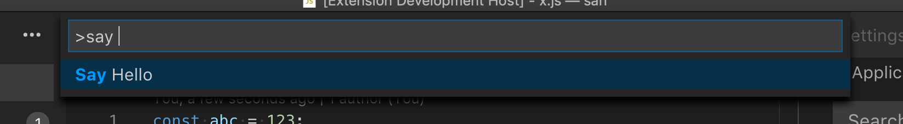

# 命令

命令用于触发 Visual Studio Code 中的操作。如果你曾经[配置过快捷键](/docs/getstarted/keybindings)，那么你已经在使用命令了。扩展也使用命令来向用户暴露功能、绑定到 VS Code UI 中的操作，以及实现内部逻辑。

## 使用命令

VS Code 包含大量[内置命令](/vscode/extension/references/commands)，你可以用它们来与编辑器交互、控制用户界面或执行后台操作。许多扩展也将其核心功能以命令的形式暴露出来，供用户和其他扩展使用。

### 以编程方式执行命令

[`vscode.commands.executeCommand`](/vscode/extension/references/vscode-api#commands.executeCommand) API 可以以编程方式执行命令。这使你能够使用 VS Code 的内置功能，并在此基础上构建扩展，例如 VS Code 内置的 Git 和 Markdown 扩展。

例如，`editor.action.addCommentLine` 命令会注释掉活动文本编辑器中当前选中的行：

```ts
import * as vscode from 'vscode';

function commentLine() {
  vscode.commands.executeCommand('editor.action.addCommentLine');
}
```

某些命令接受参数来控制其行为。命令也可能返回结果。例如，类似 API 的 `vscode.executeDefinitionProvider` 命令会查询文档中给定位置的定义。它接受一个文档 URI 和一个位置作为参数，并返回一个包含定义列表的 Promise：

```ts
import * as vscode from 'vscode';

async function printDefinitionsForActiveEditor() {
  const activeEditor = vscode.window.activeTextEditor;
  if (!activeEditor) {
    return;
  }

  const definitions = await vscode.commands.executeCommand<vscode.Location[]>(
    'vscode.executeDefinitionProvider',
    activeEditor.document.uri,
    activeEditor.selection.active
  );

  for (const definition of definitions) {
    console.log(definition);
  }
}
```

要查找可用的命令：

- [浏览快捷键列表](/docs/getstarted/keybindings)
- [查看 VS Code 内置高级命令 API](/vscode/extension/references/commands)

### 命令 URI

命令 URI 是执行给定命令的链接。它们可以用作悬停提示、补全项详情或 Webview 中的可点击链接。

命令 URI 使用 `command` 方案后跟命令名称。例如，`editor.action.addCommentLine` 命令的命令 URI 是 `command:editor.action.addCommentLine`。下面是一个悬停提供器示例，在活动文本编辑器中当前行的注释里显示一个链接：

```ts
import * as vscode from 'vscode';

export function activate(context: vscode.ExtensionContext) {
  vscode.languages.registerHoverProvider(
    'javascript',
    new class implements vscode.HoverProvider {
      provideHover(
        _document: vscode.TextDocument,
        _position: vscode.Position,
        _token: vscode.CancellationToken
      ): vscode.ProviderResult<vscode.Hover> {
        const commentCommandUri = vscode.Uri.parse(`command:editor.action.addCommentLine`);
        const contents = new vscode.MarkdownString(`[Add comment](${commentCommandUri})`);

        // 要在 Markdown 内容中启用命令 URI，必须设置 `isTrusted` 标志。
        // 创建可信的 Markdown 字符串时，请确保正确清理所有输入内容，
        // 以便只能执行预期的命令 URI
        contents.isTrusted = true;

        return new vscode.Hover(contents);
      }
    }()
  );
}
```

传递给命令的参数列表是一个经过正确 URI 编码的 JSON 数组：下面的示例使用 `git.stage` 命令创建一个暂存当前文件的悬停链接：

```ts
import * as vscode from 'vscode';

export function activate(context: vscode.ExtensionContext) {
  vscode.languages.registerHoverProvider(
    'javascript',
    new class implements vscode.HoverProvider {
      provideHover(
        document: vscode.TextDocument,
        _position: vscode.Position,
        _token: vscode.CancellationToken
      ): vscode.ProviderResult<vscode.Hover> {
        const args = [{ resourceUri: document.uri }];
        const stageCommandUri = vscode.Uri.parse(
          `command:git.stage?${encodeURIComponent(JSON.stringify(args))}`
        );
        const contents = new vscode.MarkdownString(`[Stage file](${stageCommandUri})`);
        contents.isTrusted = true;
        return new vscode.Hover(contents);
      }
    }()
  );
}
```

你可以通过在创建 Webview 时在 `WebviewOptions` 中设置 `enableCommandUris` 来在 [Webview](/vscode/extension/extension-guides/webview) 中启用命令 URI。

## 创建新命令

### 注册命令

[`vscode.commands.registerCommand`](/vscode/extension/references/vscode-api#commands.registerCommand) 将命令 ID 绑定到扩展中的处理函数：

```ts
import * as vscode from 'vscode';

export function activate(context: vscode.ExtensionContext) {
  const command = 'myExtension.sayHello';

  const commandHandler = (name: string = 'world') => {
    console.log(`Hello ${name}!!!`);
  };

  context.subscriptions.push(vscode.commands.registerCommand(command, commandHandler));
}
```

每当 `myExtension.sayHello` 命令被执行时，无论是通过 `executeCommand` 以编程方式执行、从 VS Code UI 执行，还是通过快捷键执行，处理函数都会被调用。

### 创建面向用户的命令

`vscode.commands.registerCommand` 仅将命令 ID 绑定到处理函数。要在命令面板中暴露此命令以便用户发现，你还需要在扩展的 `package.json` 中添加相应的命令 `contribution`：

```json
{
  "contributes": {
    "commands": [
      {
        "command": "myExtension.sayHello",
        "title": "Say Hello"
      }
    ]
  }
}
```

`commands` 贡献告诉 VS Code 你的扩展提供了给定命令，并且应该在该命令被调用时激活，同时还允许你控制命令在 UI 中的显示方式。创建命令时请务必遵循[命令命名约定](#命名约定)。



现在，当用户首次从命令面板或通过快捷键调用 `myExtension.sayHello` 命令时，扩展将被激活，`registerCommand` 会将 `myExtension.sayHello` 绑定到正确的处理函数。

> **注意**：目标 VS Code 版本早于 1.74.0 的扩展必须为所有面向用户的命令显式注册 `onCommand` `activationEvent`，以便扩展激活并执行 `registerCommand`：
> ```json
> {
>   "activationEvents": ["onCommand:myExtension.sayHello"]
> }
> ```


内部命令不需要 `onCommand` 激活事件，但对于以下命令，你必须定义它们：

- 可以通过命令面板调用。
- 可以通过快捷键调用。
- 可以通过 VS Code UI 调用，例如通过编辑器标题栏。
- 旨在作为 API 供其他扩展使用。

### 控制命令在命令面板中的显示时机

默认情况下，所有通过 `package.json` 的 `commands` 部分贡献的面向用户的命令都会显示在命令面板中。然而，许多命令仅在特定条件下才有意义，例如当存在特定语言的文本编辑器时，或当用户设置了特定配置选项时。

[`menus.commandPalette`](/vscode/extension/references/contribution-points#contributes.menus) 贡献点允许你限制命令在命令面板中的显示时机。它接受目标命令的 ID 和一个 [when 子句](/vscode/extension/references/when-clause-contexts)来控制命令何时显示：

```json
{
  "contributes": {
    "menus": {
      "commandPalette": [
        {
          "command": "myExtension.sayHello",
          "when": "editorLangId == markdown"
        }
      ]
    }
  }
}
```

现在 `myExtension.sayHello` 命令只会在用户处于 Markdown 文件中时显示在命令面板中。

### 命令的启用状态

命令支持通过 `enablement` 属性控制启用状态——其值为一个 [when 子句](/vscode/extension/references/when-clause-contexts)。启用状态适用于所有菜单和已注册的快捷键。

> **注意**：`enablement` 和菜单项的 `when` 条件之间存在语义重叠。后者用于防止菜单中出现大量禁用项。例如，一个分析 JavaScript 正则表达式的命令应该在文件是 JavaScript 时**显示**（when），并且仅当光标位于正则表达式上时才**启用**（enablement）。`when` 子句通过不在其他语言文件中显示该命令来避免菜单混乱。强烈建议这样做以避免菜单混乱。

最后，显示命令的菜单（如命令面板或上下文菜单）以不同方式处理启用状态。编辑器和资源管理器的上下文菜单会渲染启用/禁用的菜单项，而命令面板则将它们过滤掉。

### 使用自定义 when 子句上下文

如果你正在编写自己的 VS Code 扩展，需要使用 `when` 子句上下文来启用/禁用命令、菜单或视图，但现有的上下文键都无法满足你的需求，那么你可以添加自己的上下文。

下面的第一个示例将键 `myExtension.showMyCommand` 设置为 true，你可以将其用于命令的启用或 `when` 属性中。第二个示例存储一个值，你可以在 `when` 子句中检查酷炫的已打开事物数量是否大于 2。

```js
vscode.commands.executeCommand('setContext', 'myExtension.showMyCommand', true);

vscode.commands.executeCommand('setContext', 'myExtension.numberOfCoolOpenThings', 2);
```

## 命名约定

创建命令时，应遵循以下命名约定：

- 命令标题
  - 使用标题样式大小写。不要将四个字母及以下的介词（如 on、to、in、of、with 和 for）大写，除非该介词是第一个或最后一个单词。
  - 以动词开头来描述将要执行的操作。
  - 使用名词来描述操作的目标。
  - 避免在标题中使用"command"。
