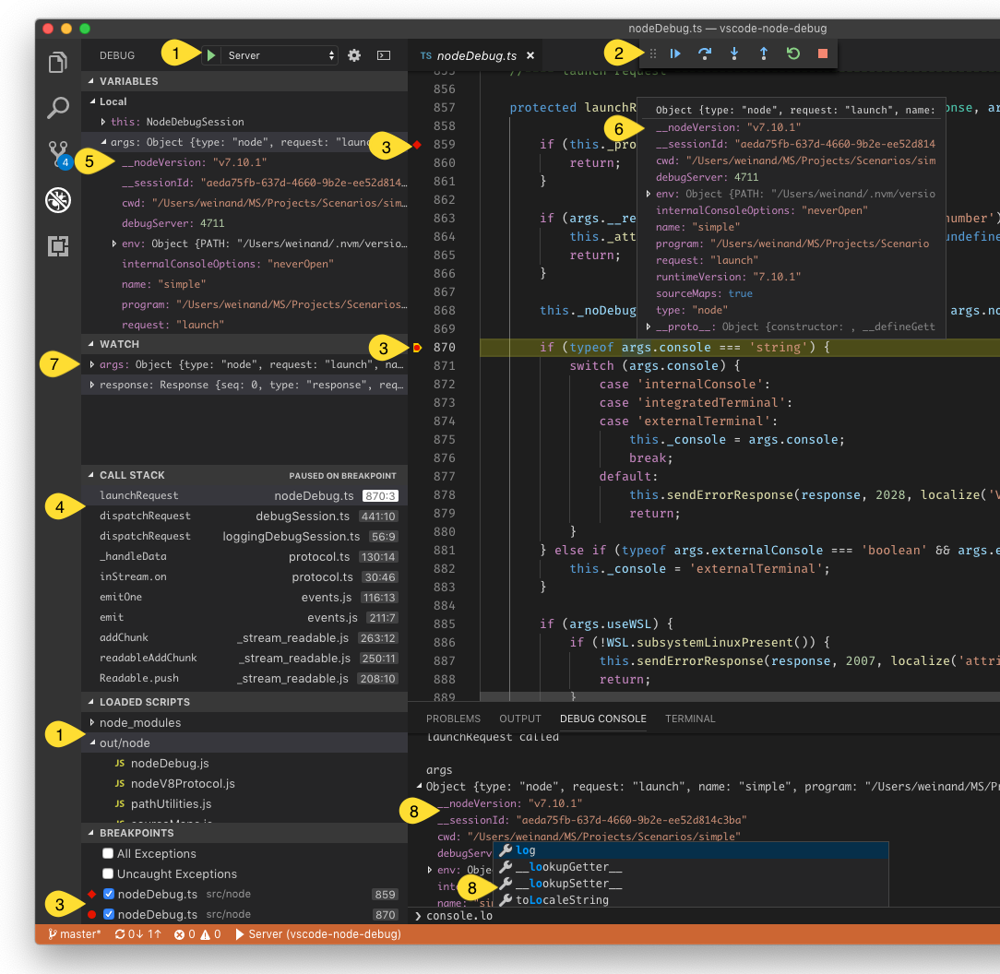
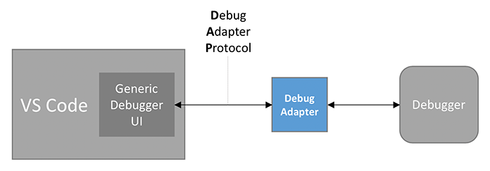
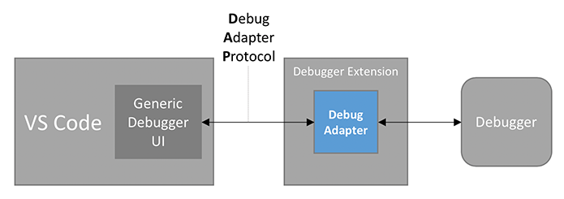
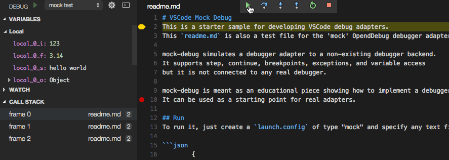
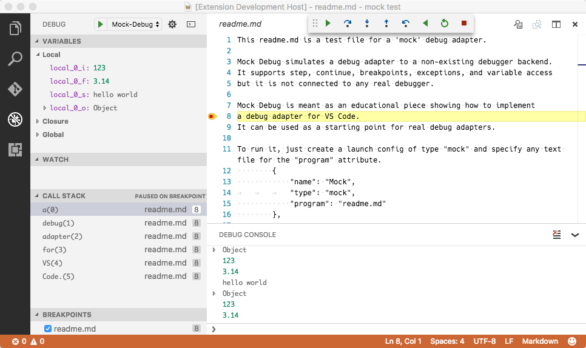
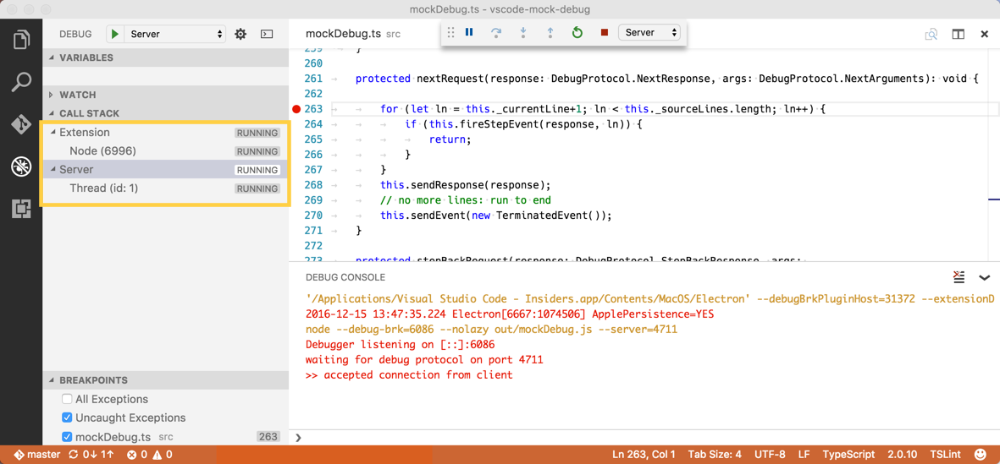
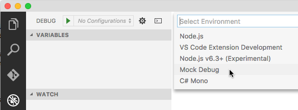

# 调试器扩展

Visual Studio Code 的调试架构允许扩展作者轻松地将现有调试器集成到 VS Code 中，同时为所有调试器提供统一的用户界面。

VS Code 自带一个内置调试器扩展——[Node.js](https://nodejs.org) 调试器扩展，它是 VS Code 支持的众多调试器功能的出色展示：



此截图展示了以下调试功能：

1. 调试配置管理。
2. 启动/停止和单步执行的调试操作。
3. 源代码断点、函数断点、条件断点、内联断点和日志点。
4. 调用栈，包括多线程和多进程支持。
5. 在视图和悬停提示中浏览复杂数据结构。
6. 在悬停提示或源代码中内联显示变量值。
7. 管理监视表达式。
8. 带有自动补全的交互式求值调试控制台。

本文档将帮助你创建一个调试器扩展，使任何调试器都能在 VS Code 中运行。

## VS Code 的调试架构

VS Code 实现了一个通用的（与语言无关的）调试器 UI，基于我们引入的抽象协议来与调试器后端通信。
由于调试器通常不实现此协议，需要某种中间件来将调试器"适配"到该协议。
这个中间件通常是一个与调试器通信的独立进程。



我们称这个中间件为 **Debug Adapter**（简称 **DA**），DA 和 VS Code 之间使用的抽象协议是 **Debug Adapter Protocol**（简称 **DAP**）。
由于 Debug Adapter Protocol 独立于 VS Code，它有自己的[网站](https://microsoft.github.io/debug-adapter-protocol/)，你可以在那里找到[介绍和概述](https://microsoft.github.io/debug-adapter-protocol/overview)、详细的[规范](https://microsoft.github.io/debug-adapter-protocol/specification)，以及[已知实现和支持工具](https://microsoft.github.io/debug-adapter-protocol/implementors/adapters/)列表。
DAP 的历史和动机在这篇[博客文章](https://code.visualstudio.com/blogs/2018/08/07/debug-adapter-protocol-website#_why-the-need-for-decoupling-with-protocols)中有所解释。

由于调试适配器独立于 VS Code，并可在[其他开发工具](https://microsoft.github.io/debug-adapter-protocol/implementors/tools/)中使用，它们与 VS Code 基于扩展和贡献点的扩展性架构并不匹配。

因此，VS Code 提供了一个贡献点 `debuggers`，调试适配器可以在特定的调试类型下（例如 Node.js 调试器的 `node`）被贡献。当用户启动该类型的调试会话时，VS Code 会启动已注册的 DA。

因此，在其最简形式下，调试器扩展只是调试适配器实现的声明式贡献，扩展基本上是调试适配器的打包容器，不包含任何额外代码。



更实际的调试器扩展会向 VS Code 贡献以下声明式项中的许多或全部：

- 调试器支持的语言列表。VS Code 为这些语言启用设置断点的 UI。
- 调试器引入的调试配置属性的 JSON 模式。VS Code 使用此模式在 launch.json 编辑器中验证配置，并提供 IntelliSense。请注意，不支持 JSON 模式中的 `$ref` 和 `definition` 构造。
- VS Code 创建初始 launch.json 时的默认调试配置。
- 用户可以添加到 launch.json 文件的调试配置代码片段。
- 可在调试配置中使用的变量声明。

你可以在 [`contributes.breakpoints`](/vscode/extension/references/contribution-points#contributes.breakpoints) 和 [`contributes.debuggers`](/vscode/extension/references/contribution-points#contributes.debuggers) 参考中找到更多信息。

除了上述纯声明式贡献之外，调试扩展 API 还提供了以下基于代码的功能：

- 为 VS Code 创建的初始 launch.json 动态生成默认调试配置。
- 动态确定要使用的调试适配器。
- 在调试配置传递给调试适配器之前验证或修改它们。
- 与调试适配器通信。
- 向调试控制台发送消息。

在本文档的其余部分，我们将展示如何开发一个调试器扩展。

## Mock Debug 扩展

由于从零开始创建调试适配器对于本教程来说有些繁重，我们将从一个我们创建的简单 DA 开始，它作为教学用的"调试适配器入门套件"。它被称为 _Mock Debug_，因为它不与真正的调试器通信，而是模拟一个调试器。Mock Debug 模拟了调试器的行为，支持单步执行、继续、断点、异常和变量访问，但不连接任何真正的调试器。

在深入了解 mock-debug 的开发设置之前，让我们先从 VS Code Marketplace 安一个[预构建版本](https://marketplace.visualstudio.com/items/andreweinand.mock-debug)并试用：

- 切换到扩展视图，输入 "mock" 搜索 Mock Debug 扩展，
- 点击"安装"并"重新加载"扩展。

试用 Mock Debug：

- 创建一个新的空文件夹 `mock test` 并在 VS Code 中打开它。
- 创建一个文件 `readme.md` 并输入几行任意文本。
- 切换到运行和调试视图（`kb(workbench.view.debug)`），选择 **create a launch.json file** 链接。
- VS Code 会让你选择一个"调试器"来创建默认的启动配置。选择"Mock Debug"。
- 按绿色的**启动**按钮，然后按 `kbstyle(Enter)` 确认建议的文件 `readme.md`。

调试会话启动后，你可以"单步执行" readme 文件、设置和命中断点，以及遇到异常（如果某行中出现单词 `exception`）。



在使用 Mock Debug 作为你自己开发的起点之前，我们建议先卸载预构建版本：

- 切换到扩展视图，点击 Mock Debug 扩展的齿轮图标。
- 运行"卸载"操作，然后"重新加载"窗口。

## Mock Debug 的开发设置

现在让我们获取 Mock Debug 的源码并在 VS Code 中开始开发：

```bash
git clone https://github.com/microsoft/vscode-mock-debug.git
cd vscode-mock-debug
yarn
```

在 VS Code 中打开项目文件夹 `vscode-mock-debug`。

包里有什么？

- `package.json` 是 mock-debug 扩展的清单文件：
  - 它列出了 mock-debug 扩展的贡献。
  - `compile` 和 `watch` 脚本用于将 TypeScript 源代码转译到 `out` 文件夹，并监视后续的源代码修改。
  - 依赖项 `vscode-debugprotocol`、`vscode-debugadapter` 和 `vscode-debugadapter-testsupport` 是简化基于 Node 的调试适配器开发的 NPM 模块。
- `src/mockRuntime.ts` 是一个带有简单调试 API 的 _mock_ 运行时。
- 将运行时"适配"到 Debug Adapter Protocol 的代码位于 `src/mockDebug.ts`。这里你可以找到 DAP 各种请求的处理程序。
- 由于调试器扩展的实现位于调试适配器中，因此完全不需要扩展代码（即在扩展宿主进程中运行的代码）。然而，Mock Debug 有一个小的 `src/extension.ts`，因为它展示了调试器扩展的扩展代码可以做什么。

现在选择 **Extension** 启动配置并按 `F5` 来构建和启动 Mock Debug 扩展。
最初，这会完成 TypeScript 源代码到 `out` 文件夹的完整转译。
完整构建完成后，会启动一个 _监视任务_ 来转译你做的任何更改。

源代码转译完成后，会出现一个标记为"[Extension Development Host]"的新 VS Code 窗口，Mock Debug 扩展现在以调试模式运行。从该窗口打开你的 `mock test` 项目和 `readme.md` 文件，按 `F5` 启动调试会话，然后单步执行：



由于你正在调试模式下运行扩展，你现在可以在 `src/extension.ts` 中设置和命中断点，但正如上文提到的，扩展中没有太多有趣的代码在执行。有趣的代码运行在调试适配器中，它是一个独立的进程。

为了调试调试适配器本身，我们需要以调试模式运行它。最简单的方法是以 _服务器模式_ 运行调试适配器，并配置 VS Code 连接到它。在你的 VS Code vscode-mock-debug 项目中，从下拉菜单中选择启动配置 **Server**，然后按绿色的启动按钮。

由于我们已经有了一个扩展的活动调试会话，VS Code 调试器 UI 现在进入 _多会话_ 模式，这可以在 CALL STACK 视图中看到两个调试会话 **Extension** 和 **Server** 的名称：



现在我们可以同时调试扩展和 DA。
更快的方法是使用 **Extension + Server** 启动配置，它会自动启动两个会话。

另一种更简单的调试扩展和 DA 的方法可以在[下面](#alternative-approach-to-develop-a-debugger-extension)找到。

在 `src/mockDebug.ts` 文件的 `launchRequest(...)` 方法开头设置一个断点，最后一步是配置 mock 调试器连接到 DA 服务器，方法是向你的 mock test 启动配置添加一个 `debugServer` 属性，端口为 `4711`：

```json
{
  "version": "0.2.0",
  "configurations": [
    {
      "type": "mock",
      "request": "launch",
      "name": "mock test",
      "program": "${workspaceFolder}/readme.md",
      "stopOnEntry": true,
      "debugServer": 4711
    }
  ]
}
```

如果你现在启动此调试配置，VS Code 不会将 mock 调试适配器作为独立进程启动，而是直接连接到已运行服务器的本地端口 4711，你应该会命中 `launchRequest` 中的断点。

通过此设置，你现在可以轻松地编辑、转译和调试 Mock Debug。

但真正的工作现在才刚刚开始：你需要将 `src/mockDebug.ts` 和 `src/mockRuntime.ts` 中的调试适配器 mock 实现替换为与"真正"调试器或运行时通信的代码。这涉及理解和实现 Debug Adapter Protocol。更多细节可以在[这里](https://microsoft.github.io/debug-adapter-protocol/overview#How_it_works)找到。

## 调试器扩展的 package.json 结构

除了提供调试适配器的调试器特定实现外，调试器扩展还需要一个 `package.json`，其中包含对各种调试相关贡献点的贡献。

让我们仔细看看 Mock Debug 的 `package.json`。

与每个 VS Code 扩展一样，`package.json` 声明了扩展的基本属性 **name**、**publisher** 和 **version**。使用 **categories** 字段可以使扩展在 VS Code 扩展市场中更容易被找到。

```json
{
  "name": "mock-debug",
  "displayName": "Mock Debug",
  "version": "0.24.0",
  "publisher": "...",
  "description": "Starter extension for developing debug adapters for VS Code.",
  "author": {
    "name": "...",
    "email": "..."
  },
  "engines": {
    "vscode": "^1.17.0",
    "node": "^7.9.0"
  },
  "icon": "images/mock-debug-icon.png",
  "categories": ["Debuggers"],

  "contributes": {
    "breakpoints": [{ "language": "markdown" }],
    "debuggers": [
      {
        "type": "mock",
        "label": "Mock Debug",

        "program": "./out/mockDebug.js",
        "runtime": "node",

        "configurationAttributes": {
          "launch": {
            "required": ["program"],
            "properties": {
              "program": {
                "type": "string",
                "description": "Absolute path to a text file.",
                "default": "${workspaceFolder}/${command:AskForProgramName}"
              },
              "stopOnEntry": {
                "type": "boolean",
                "description": "Automatically stop after launch.",
                "default": true
              }
            }
          }
        },

        "initialConfigurations": [
          {
            "type": "mock",
            "request": "launch",
            "name": "Ask for file name",
            "program": "${workspaceFolder}/${command:AskForProgramName}",
            "stopOnEntry": true
          }
        ],

        "configurationSnippets": [
          {
            "label": "Mock Debug: Launch",
            "description": "A new configuration for launching a mock debug program",
            "body": {
              "type": "mock",
              "request": "launch",
              "name": "${2:Launch Program}",
              "program": "^\"\\${workspaceFolder}/${1:Program}\""
            }
          }
        ],

        "variables": {
          "AskForProgramName": "extension.mock-debug.getProgramName"
        }
      }
    ]
  },

  "activationEvents": ["onDebug", "onCommand:extension.mock-debug.getProgramName"]
}
```

现在来看 **contributes** 部分，其中包含调试扩展特有的贡献。

首先，我们使用 **breakpoints** 贡献点列出启用断点设置的语言。没有这个配置，就无法在 Markdown 文件中设置断点。

接下来是 **debuggers** 部分。这里以调试 **类型** `mock` 引入了一个调试器。用户可以在启动配置中引用此类型。可选属性 **label** 可用于在 UI 中显示时为调试类型提供一个友好的名称。

由于调试扩展使用调试适配器，其代码的相对路径通过 **program** 属性给出。
为了使扩展自包含，应用程序必须位于扩展文件夹内。按照惯例，我们将此应用程序保存在名为 `out` 或 `bin` 的文件夹中，但你可以自由使用其他名称。

由于 VS Code 在不同平台上运行，我们必须确保 DA 程序也支持不同的平台。为此我们有以下选项：

1. 如果程序以平台无关的方式实现，例如作为在所有支持平台上都可用的运行时上运行的程序，你可以通过 **runtime** 属性指定此运行时。目前，VS Code 支持 `node` 和 `mono` 运行时。我们上面的 Mock 调试适配器就使用了这种方法。

1. 如果你的 DA 实现在不同平台上需要不同的可执行文件，可以针对特定平台限定 **program** 属性，如下所示：

   ```json
   "debuggers": [{
       "type": "gdb",
       "windows": {
           "program": "./bin/gdbDebug.exe",
       },
       "osx": {
           "program": "./bin/gdbDebug.sh",
       },
       "linux": {
           "program": "./bin/gdbDebug.sh",
       }
   }]
   ```

1. 两种方法的组合也是可行的。以下示例来自 Mono DA，它作为 mono 应用程序实现，在 macOS 和 Linux 上需要运行时，但在 Windows 上不需要：

   ```json
   "debuggers": [{
       "type": "mono",
       "program": "./bin/monoDebug.exe",
       "osx": {
           "runtime": "mono"
       },
       "linux": {
           "runtime": "mono"
       }
   }]
   ```

**configurationAttributes** 声明了此调试器可用的 `launch.json` 属性的模式。此模式用于验证 `launch.json` 并在编辑启动配置时提供 IntelliSense 和悬停帮助。

**initialConfigurations** 定义了此调试器默认 `launch.json` 的初始内容。当项目没有 `launch.json` 且用户启动调试会话或在运行和调试视图中选择 **create a launch.json file** 链接时使用此信息。在这种情况下，VS Code 让用户选择调试环境，然后创建相应的 `launch.json`：



与其在 `package.json` 中静态定义 `launch.json` 的初始内容，不如通过实现 `DebugConfigurationProvider` 来动态计算初始配置（详见[下面使用 DebugConfigurationProvider 的部分](#using-a-debugconfigurationprovider)）。

**configurationSnippets** 定义了在编辑 `launch.json` 时在 IntelliSense 中显示的启动配置代码片段。按照惯例，在代码片段的 `label` 属性前加上调试环境名称前缀，以便在众多代码片段提案列表中能够清晰地识别。

**variables** 贡献将"变量"绑定到"命令"。这些变量可以在启动配置中使用 **\${command:xyz}** 语法，当调试会话启动时，变量会被绑定命令返回的值替换。

命令的实现位于扩展中，它可以是从没有 UI 的简单表达式，到基于扩展 API 中可用 UI 功能的复杂功能。
Mock Debug 将变量 `AskForProgramName` 绑定到命令 `extension.mock-debug.getProgramName`。该命令在 `src/extension.ts` 中的[实现](https://github.com/microsoft/vscode-mock-debug/blob/606454ff3bd669867a38d9b2dc7b348d324a3f6b/src/extension.ts#L21-L26)使用 `showInputBox` 让用户输入程序名称：

```ts
vscode.commands.registerCommand('extension.mock-debug.getProgramName', config => {
  return vscode.window.showInputBox({
    placeHolder: 'Please enter the name of a markdown file in the workspace folder',
    value: 'readme.md'
  });
});
```

现在该变量可以在启动配置的任何字符串类型值中使用 **\${command:AskForProgramName}**。

## 使用 DebugConfigurationProvider

如果 `package.json` 中调试贡献的静态特性不够用，可以使用 `DebugConfigurationProvider` 来动态控制调试扩展的以下方面：

- 为新创建的 launch.json 动态生成初始调试配置，例如基于工作区中可用的某些上下文信息。
- 在启动配置被用于启动新调试会话之前对其进行_解析_（或修改）。这允许根据工作区中可用的信息填充默认值。存在两个_解析_方法：`resolveDebugConfiguration` 在启动配置中的变量被替换之前调用，`resolveDebugConfigurationWithSubstitutedVariables` 在所有变量被替换之后调用。如果验证逻辑需要在调试配置中插入额外的变量，则必须使用前者。如果验证逻辑需要访问所有调试配置属性的最终值，则必须使用后者。

`src/extension.ts` 中的 `MockConfigurationProvider` 实现了 `resolveDebugConfiguration`，用于检测在没有 launch.json 的情况下启动调试会话但活动编辑器中打开了 Markdown 文件的情况。这是一个典型的场景——用户在编辑器中打开了一个文件，只想调试它而不创建 launch.json。

调试配置提供者通过 `vscode.debug.registerDebugConfigurationProvider` 为特定的调试类型注册，通常在扩展的 `activate` 函数中完成。
为了确保 `DebugConfigurationProvider` 足够早地注册，扩展必须在调试功能被使用时立即激活。这可以通过在 `package.json` 中配置 `onDebug` 事件的扩展激活来实现：

```json
"activationEvents": [
    "onDebug",
    // ...
],
```

这个全匹配的 `onDebug` 事件在任何调试功能被使用时就会触发。只要扩展的启动成本较低（即启动序列不会花费大量时间），这种方式就能正常工作。如果调试扩展的启动成本较高（例如因为启动了语言服务器），`onDebug` 激活事件可能会对其他调试扩展产生负面影响，因为它触发得相当早且不考虑特定的调试类型。

对于启动成本较高的调试扩展，更好的方法是使用更细粒度的激活事件：

- `onDebugInitialConfigurations` 在调用 `DebugConfigurationProvider` 的 `provideDebugConfigurations` 方法之前触发。
- `onDebugResolve:type` 在调用指定类型的 `DebugConfigurationProvider` 的 `resolveDebugConfiguration` 或 `resolveDebugConfigurationWithSubstitutedVariables` 方法之前触发。

**经验法则**：如果调试扩展的激活成本较低，使用 `onDebug`。如果成本较高，根据 `DebugConfigurationProvider` 是否实现了相应的方法 `provideDebugConfigurations` 和/或 `resolveDebugConfiguration`，使用 `onDebugInitialConfigurations` 和/或 `onDebugResolve`。

## 发布你的调试器扩展

创建完调试器扩展后，你可以将其发布到 Marketplace：

- 更新 `package.json` 中的属性以反映调试器扩展的名称和用途。
- 按照[发布扩展](/vscode/extension/working-with-extensions/publishing-extension)中的说明上传到 Marketplace。

## 开发调试器扩展的替代方法

如我们所见，开发调试器扩展通常涉及在两个并行会话中调试扩展和调试适配器。如上所述，VS Code 对此提供了良好的支持，但如果扩展和调试适配器能作为一个程序在同一个调试会话中调试，开发会更加方便。

只要你的调试适配器是用 TypeScript/JavaScript 实现的，这种方法实际上很容易实现。基本思路是直接在扩展内部运行调试适配器，并让 VS Code 连接到它，而不是每个会话启动一个新的外部调试适配器。

为此，VS Code 提供了扩展 API 来控制调试适配器的创建和运行方式。`DebugAdapterDescriptorFactory` 有一个 `createDebugAdapterDescriptor` 方法，当调试会话启动且需要调试适配器时由 VS Code 调用。此方法必须返回一个描述调试适配器运行方式的描述符对象（`DebugAdapterDescriptor`）。

目前 VS Code 支持三种不同的调试适配器运行方式，因此提供三种不同的描述符类型：

- `DebugAdapterExecutable`：此对象将调试适配器描述为一个外部可执行文件，具有路径和可选的参数及运行时。可执行文件必须实现 Debug Adapter Protocol 并通过 stdin/stdout 通信。这是 VS Code 的默认操作模式，如果没有显式注册 `DebugAdapterDescriptorFactory`，VS Code 会自动使用 package.json 中的相应值作为此描述符。
- `DebugAdapterServer`：此对象将调试适配器描述为一个通过特定本地或远程端口通信的服务器。基于 [`vscode-debugadapter`](https://www.npmjs.com/package/vscode-debugadapter) npm 模块的调试适配器实现自动支持此服务器模式。
- `DebugAdapterInlineImplementation`：此对象将调试适配器描述为实现 `vscode.DebugAdapter` 接口的 JavaScript 或 TypeScript 对象。基于 [`vscode-debugadapter`](https://www.npmjs.com/package/vscode-debugadapter) npm 模块 1.38-pre.4 或更高版本的调试适配器实现会自动实现此接口。

Mock Debug 展示了[三种 DebugAdapterDescriptorFactory 的示例](https://github.com/microsoft/vscode-mock-debug/blob/668fa6f5db95dbb76825d4eb670ab0d305050c3b/src/extension.ts#L91-L150)，以及它们如何[为 'mock' 调试类型注册](https://github.com/microsoft/vscode-mock-debug/blob/668fa6f5db95dbb76825d4eb670ab0d305050c3b/src/extension.ts#L50)。要使用的运行模式可以通过[设置全局变量 `runMode`](https://github.com/microsoft/vscode-mock-debug/blob/668fa6f5db95dbb76825d4eb670ab0d305050c3b/src/extension.ts#L16) 为可能的值 `external`、`server` 或 `inline` 之一来选择。

对于开发而言，`inline` 和 `server` 模式特别有用，因为它们允许在单个进程中调试扩展和调试适配器。
