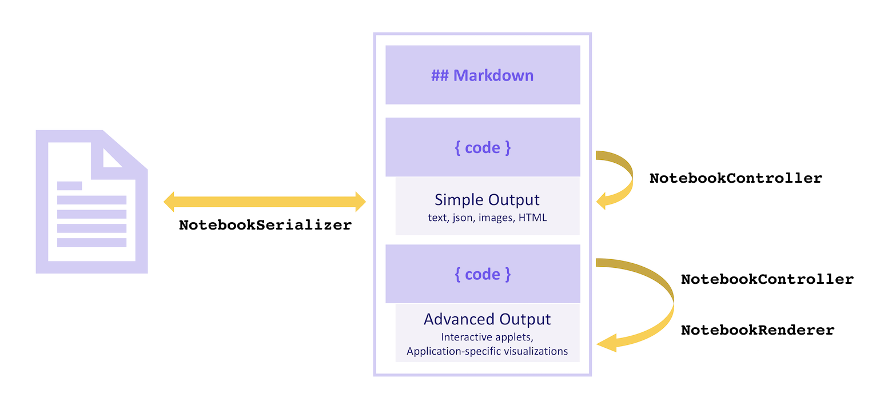
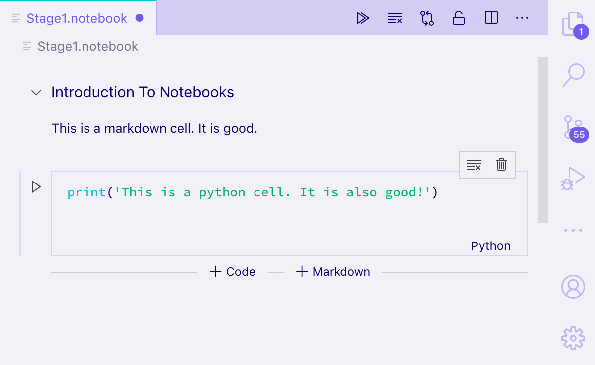
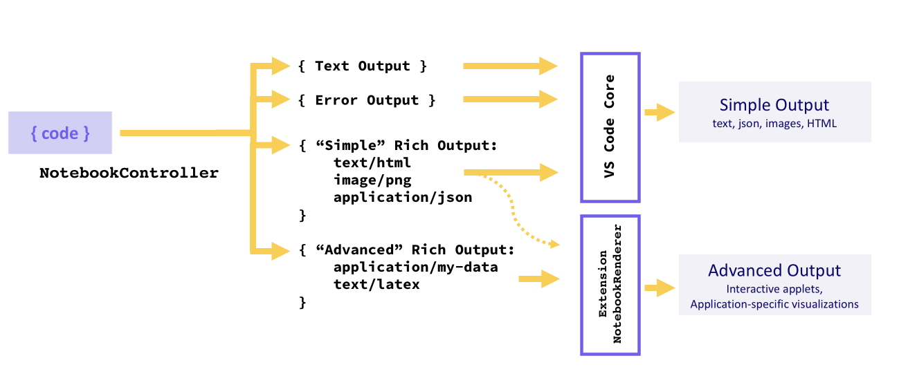
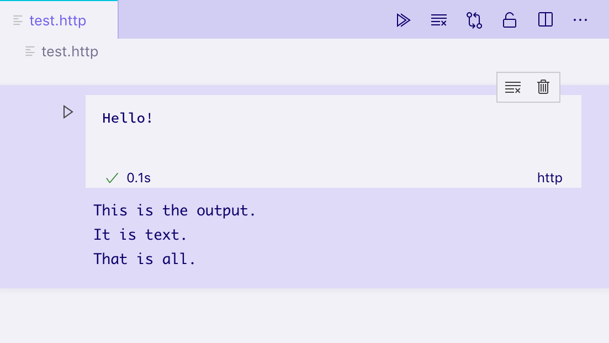
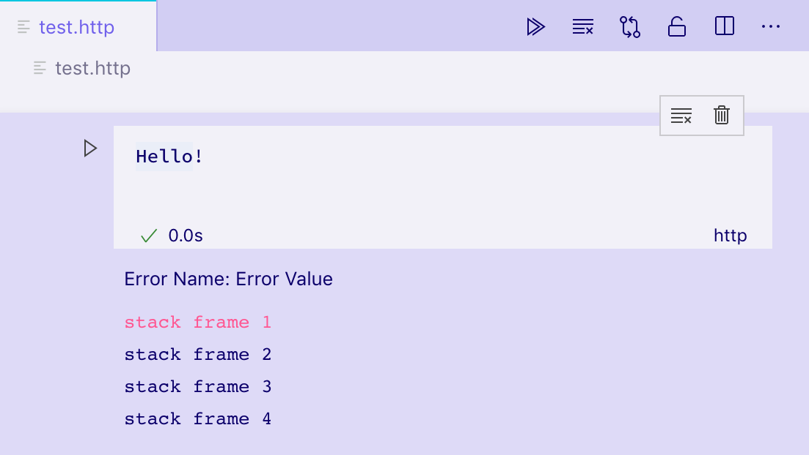
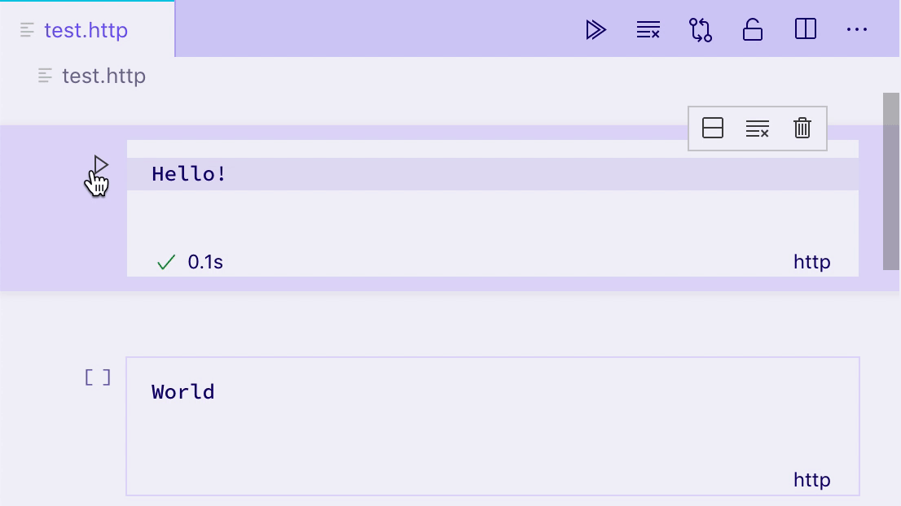
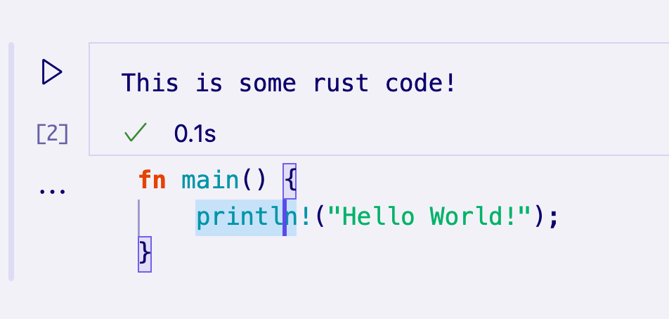
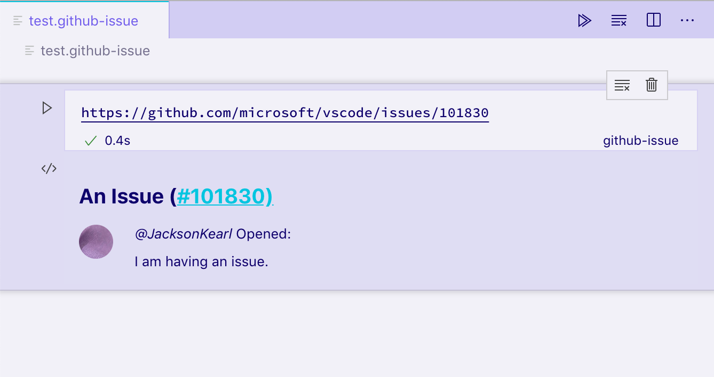
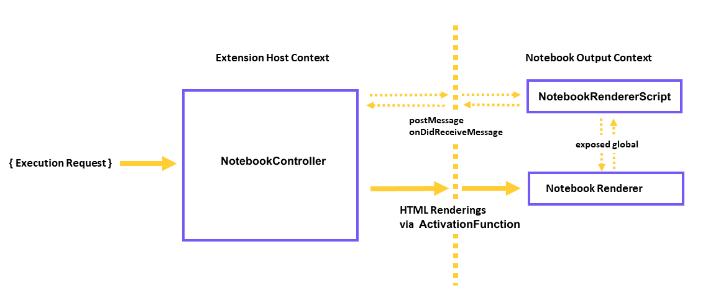

# Notebook API

Notebook API 允许 Visual Studio Code 扩展将文件作为笔记本打开、执行笔记本代码单元格，并以多种丰富且交互式的格式渲染笔记本输出。你可能对 Jupyter Notebook 或 Google Colab 等流行的笔记本界面很熟悉——Notebook API 可以在 Visual Studio Code 中实现类似的体验。

## Notebook 的组成部分

一个笔记本由一系列单元格及其输出组成。笔记本的单元格可以是 **Markdown 单元格**或**代码单元格**，它们在 VS Code 内核中渲染。输出可以有多种格式。一些输出格式（如纯文本、JSON、图片和 HTML）由 VS Code 内核渲染。其他格式（如应用特定的数据或交互式小程序）由扩展渲染。

笔记本中的单元格通过 `NotebookSerializer` 从文件系统读取和写入，它负责从文件系统读取数据并将其转换为单元格的描述，以及将笔记本的修改持久化回文件系统。笔记本的**代码单元格**可以通过 `NotebookController` 执行，它接收单元格内容并从中生成零个或多个各种格式的输出，涵盖从纯文本到格式化文档或交互式小程序。应用特定的输出格式和交互式小程序输出由 `NotebookRenderer` 渲染。

示意图：



## Serializer

[NotebookSerializer API 参考](https://github.com/microsoft/vscode/blob/e1a8566a298dcced016d8e16db95c33c270274b4/src/vs/vscode.d.ts#L11865-L11884)

`NotebookSerializer` 负责接收笔记本的序列化字节并将其反序列化为 `NotebookData`，其中包含 Markdown 和代码单元格的列表。它还负责相反的转换：将 `NotebookData` 转换为序列化字节以供保存。

示例：

* [JSON Notebook Serializer](https://github.com/microsoft/notebook-extension-samples/tree/main/notebook-serializer)：一个简单的示例笔记本，接收 JSON 输入并在自定义 `NotebookRenderer` 中输出格式化的 JSON。
* [Markdown Serializer](https://github.com/microsoft/vscode-markdown-notebook)：以笔记本方式打开和编辑 Markdown 文件。

### 示例

在本例中，我们将构建一个简化的笔记本提供程序扩展，用于查看 [Jupyter Notebook 格式](https://nbformat.readthedocs.io/en/latest/format_description.html)的文件，使用 `.notebook` 扩展名（而非其传统的 `.ipynb` 扩展名）。

笔记本序列化器在 `package.json` 的 `contributes.notebooks` 部分声明如下：

```json
{
    ...
    "contributes": {
        ...
        "notebooks": [
            {
                "type": "my-notebook",
                "displayName": "My Notebook",
                "selector": [
                    {
                        "filenamePattern": "*.notebook"
                    }
                ]
            }
        ]
    }
}
```

然后，在扩展的激活事件中注册笔记本序列化器：

```ts
import { TextDecoder, TextEncoder } from "util";
import * as vscode from 'vscode';

export function activate(context: vscode.ExtensionContext) {
    context.subscriptions.push(
        vscode.workspace.registerNotebookSerializer(
            "my-notebook", new SampleSerializer()
        )
    );
}

interface RawNotebook {
	cells: RawNotebookCell[];
}

interface RawNotebookCell {
    source: string[];
    cell_type: 'code' | 'markdown';
}

class SampleSerializer implements vscode.NotebookSerializer {
    async deserializeNotebook(content: Uint8Array, _token: vscode.CancellationToken): Promise<vscode.NotebookData> {
        var contents = new TextDecoder().decode(content);

        let raw: RawNotebookCell[];
        try {
            raw = (<RawNotebook>JSON.parse(contents)).cells;
        } catch {
            raw = [];
        }

        const cells = raw.map(item => new vscode.NotebookCellData(
			item.cell_type === 'code' ? vscode.NotebookCellKind.Code : vscode.NotebookCellKind.Markup,
            item.source.join('\n'),
			item.cell_type === 'code' ? 'python' : 'markdown'
        ));

        return new vscode.NotebookData(cells);
    }

    async serializeNotebook(data: vscode.NotebookData, _token: vscode.CancellationToken): Promise<Uint8Array> {
        let contents: RawNotebookCell[] = [];

        for (const cell of data.cells) {
            contents.push({
                cell_type: cell.kind === vscode.NotebookCellKind.Code ? 'code' : 'markdown',
                source: cell.value.split(/\r?\n/g)
            });
        }

        return new TextEncoder().encode(JSON.stringify(contents));
    }
}
```

现在尝试运行你的扩展，并打开一个以 `.notebook` 扩展名保存的 Jupyter Notebook 格式文件：



你应该能够打开 Jupyter 格式的笔记本，以纯文本和渲染后的 Markdown 两种方式查看其单元格，以及编辑单元格。但是，输出不会被持久化到磁盘；要保存输出，你还需要从 `NotebookData` 中序列化和反序列化单元格的输出。

要运行单元格，你需要实现一个 `NotebookController`。

## Controller

[NotebookController API 参考](https://github.com/microsoft/vscode/blob/e1a8566a298dcced016d8e16db95c33c270274b4/src/vs/vscode.d.ts#L11941)

`NotebookController` 负责接收一个**代码单元格**并执行代码以产生一些输出（或不产生输出）。

控制器通过在创建控制器时设置 `NotebookController#notebookType` 属性，直接关联到某个笔记本序列化器和笔记本类型。然后，通过将控制器推入扩展订阅列表，在扩展激活时全局注册该控制器。

```ts
export function activate(context: vscode.ExtensionContext) {
    context.subscriptions.push(new Controller());
}

class Controller {
    readonly controllerId = 'my-notebook-controller-id'
    readonly notebookType = 'my-notebook';
    readonly label = 'My Notebook';
    readonly supportedLanguages = ['python'];

    private readonly _controller: vscode.NotebookController;
    private _executionOrder = 0;

    constructor() {
        this._controller = vscode.notebooks.createNotebookController(this.controllerId, this.notebookType, this.label);

        this._controller.supportedLanguages = this.supportedLanguages;
        this._controller.supportsExecutionOrder = true;
        this._controller.executeHandler = this._execute.bind(this);
    }

    private _execute(cells: vscode.NotebookCell[], _notebook: vscode.NotebookDocument, _controller: vscode.NotebookController): void {
        for (let cell of cells) {
            this._doExecution(cell);
        }
    }

    private async _doExecution(cell: vscode.NotebookCell): Promise<void> {
        const execution = this._controller.createNotebookCellExecution(cell);
        execution.executionOrder = ++this._executionOrder;
        execution.start(Date.now()); // Keep track of elapsed time to execute cell.

        /* Do some execution here; not implemented */

        execution.replaceOutput([new vscode.NotebookCellOutput([vscode.NotebookCellOutputItem.text('Dummy output text!')])])
        execution.end(true, Date.now());
    }
}
```

如果你要单独发布一个提供 `NotebookController` 的扩展（与序列化器分离），请在 `package.json` 的 `keywords` 中添加类似 `notebookKernel<ViewTypeUpperCamelCased>` 的条目。例如，如果你为 `github-issues` 笔记本类型发布了一个替代内核，应该在扩展中添加关键字 `notebookKernelGithubIssues`。
这可以提高在 Visual Studio Code 中打开 `<ViewTypeUpperCamelCased>` 类型笔记本时扩展的可发现性。

示例：

* [GitHub Issues Notebook](https://github.com/microsoft/vscode-github-issue-notebooks/blob/93359d842cd01dfaef0a78b620c5a3b4cf5c2e38/src/extension/notebookProvider.ts#L29)：用于执行 GitHub Issues 查询的控制器
* [REST Book](https://github.com/tanhakabir/rest-book/blob/main/src/extension/notebookKernel.ts)：用于运行 REST 查询的控制器。
* [Regexper notebooks](https://github.com/jrieken/vscode-regex-notebook/blob/master/src/extension/extension.ts#L56)：用于可视化正则表达式的控制器。

## 输出类型

输出必须采用以下三种格式之一：文本输出、错误输出或富输出。内核可以在单次单元格执行中提供多个输出，这些输出将以列表形式显示。

像文本输出、错误输出或"简单"变体的富输出（HTML、Markdown、JSON 等）等简单格式由 VS Code 内核渲染，而应用特定的富输出类型由 [NotebookRenderer](#notebook-renderer) 渲染。扩展也可以选择自行渲染"简单"富输出，例如为 Markdown 输出添加 LaTeX 支持。



### 文本输出

文本输出是最简单的输出格式，其工作方式与你熟悉的许多 REPL 类似。它仅包含一个 `text` 字段，在单元格的输出元素中以纯文本渲染：

```ts
vscode.NotebookCellOutputItem.text('This is the output...')
```



### 错误输出

错误输出有助于以一致且易于理解的方式显示运行时错误。它们支持标准的 `Error` 对象。

```ts
try {
    /* Some code */
} catch (error) {
    vscode.NotebookCellOutputItem.error(error)
}
```



### 富输出

富输出是显示单元格输出的最高级形式。它们允许按键名（mimetype）提供输出数据的多种不同表示。例如，如果单元格输出要表示一个 GitHub Issue，内核可能会生成一个富输出，其 `data` 字段包含多个属性：

* 一个包含 Issue 格式化视图的 `text/html` 字段。
* 一个包含机器可读视图的 `text/x-json` 字段。
* 一个 `application/github-issue` 字段，`NotebookRenderer` 可以使用它来创建 Issue 的完全交互式视图。

在这种情况下，`text/html` 和 `text/x-json` 视图将由 VS Code 原生渲染，但如果没有注册到该 mimetype 的 `NotebookRenderer`，`application/github-issue` 视图将显示错误。

```ts
execution.replaceOutput([new vscode.NotebookCellOutput([
                            vscode.NotebookCellOutputItem.text('<b>Hello</b> World', 'text/html'),
                            vscode.NotebookCellOutputItem.json({ hello: 'world' }),
                            vscode.NotebookCellOutputItem.json({ custom-data-for-custom-renderer: 'data' }, 'application/custom'),
                        ])]);
```



默认情况下，VS Code 可以渲染以下 mimetype：

* application/javascript
* text/html
* image/svg+xml
* text/markdown
* image/png
* image/jpeg
* text/plain

VS Code 将以下 mimetype 作为代码在内置编辑器中渲染：

* text/x-json
* text/x-javascript
* text/x-html
* text/x-rust
* ... text/x-LANGUAGE_ID 用于任何其他内置或已安装的语言。

这个笔记本正在使用内置编辑器显示一些 Rust 代码：


要渲染其他 mimetype，必须为该 mimetype 注册一个 `NotebookRenderer`。

## Notebook Renderer

笔记本渲染器负责接收特定 mimetype 的输出数据并提供该数据的渲染视图。由输出单元格共享的渲染器可以在这些单元格之间维护全局状态。渲染视图的复杂度可以从简单的静态 HTML 到动态的完全交互式小程序不等。在本节中，我们将探索渲染表示 GitHub Issue 的输出的各种技术。

你可以使用 Yeoman 生成器的模板快速入门。首先，使用以下命令安装 Yeoman 和 VS Code 生成器：

```bash
npm install -g yo generator-code
```

然后，运行 `yo code` 并选择 `New Notebook Renderer (TypeScript)`。

如果你不使用此模板，只需确保在扩展的 `package.json` 的 `keywords` 中添加 `notebookRenderer`，并在扩展名称或描述中提及其 mimetype，以便用户能够找到你的渲染器。

### 简单的非交互式渲染器

渲染器通过在扩展的 `package.json` 的 `contributes.notebookRenderer` 属性中进行声明来关联到一组 mimetype。此渲染器将处理 `ms-vscode.github-issue-notebook/github-issue` 格式的输入，我们假设某个已安装的控制器能够提供此格式：

```json
{
  "activationEvents": ["...."],
  "contributes": {
    ...
    "notebookRenderer": [
      {
        "id": "github-issue-renderer",
        "displayName": "GitHub Issue Renderer",
        "entrypoint": "./out/renderer.js",
        "mimeTypes": [
          "ms-vscode.github-issue-notebook/github-issue"
        ]
      }
    ]
  }
}
```

输出渲染器始终在独立的 `iframe` 中渲染，与 VS Code 其余 UI 分离，以确保它们不会意外干扰或导致 VS Code 变慢。此声明引用了一个"入口点"脚本，该脚本在任何输出需要渲染之前被加载到笔记本的 `iframe` 中。你的入口点需要是一个单独的文件，你可以自己编写，也可以使用 Webpack、Rollup 或 Parcel 等打包工具来创建。

加载时，你的入口点脚本应从 `vscode-notebook-renderer` 导出 `ActivationFunction`，以便在 VS Code 准备好渲染你的渲染器时渲染 UI。例如，以下代码会将所有 GitHub Issue 数据以 JSON 形式放入单元格输出中：

```js
import type { ActivationFunction } from 'vscode-notebook-renderer';

export const activate: ActivationFunction = (context) => ({
    renderOutputItem(data, element) {
        element.innerText = JSON.stringify(data.json())
    }
})
```

你可以在[此处查看完整的 API 定义](https://github.com/DefinitelyTyped/DefinitelyTyped/blob/master/types/vscode-notebook-renderer/index.d.ts)。如果你使用 TypeScript，可以安装 `@types/vscode-notebook-renderer`，然后在 `tsconfig.json` 的 `types` 数组中添加 `vscode-notebook-renderer`，使这些类型在代码中可用。

要创建更丰富的内容，你可以手动创建 DOM 元素，或使用 Preact 等框架并将其渲染到输出元素中，例如：

```jsx
import type { ActivationFunction } from 'vscode-notebook-renderer';
import { h, render } from 'preact';

const Issue: FunctionComponent<{ issue: GithubIssue }> = ({ issue }) => (
  <div key={issue.number}>
    <h2>
      {issue.title}
      (<a href={`https://github.com/${issue.repo}/issues/${issue.number}`}>#{issue.number}</a>)
    </h2>
    
    <i>@{issue.user.login}</i> Opened: <div style="margin-top: 10px">{issue.body}</div>
  </div>
);

const GithubIssues: FunctionComponent<{ issues: GithubIssue[]; }> = ({ issues }) => (
  <div>{issues.map(issue => <Issue key={issue.number} issue={issue} />)}</div>
);

export const activate: ActivationFunction = (context) => ({
    renderOutputItem(data, element) {
        render(<GithubIssues issues={data.json()} />, element);
    }
});
```

在具有 `ms-vscode.github-issue-notebook/github-issue` 数据字段的输出单元格上运行此渲染器，会得到以下静态 HTML 视图：



如果你有容器之外的元素或其他异步进程，可以使用 `disposeOutputItem` 来清理它们。此事件在输出被清除、单元格被删除以及为现有单元格渲染新输出之前触发。例如：

```js
const intervals = new Map();

export const activate: ActivationFunction = (context) => ({
    renderOutputItem(data, element) {
        render(<GithubIssues issues={data.json()} />, element);

        intervals.set(data.mime, setInterval(() => {
            if(element.querySelector('h2')) {
                element.querySelector('h2')!.style.color = `hsl(${Math.random() * 360}, 100%, 50%)`;
            }
        }, 1000));
    },
    disposeOutputItem(id) {
        clearInterval(intervals.get(id));
        intervals.delete(id);
    }
});
```

请务必注意，笔记本的所有输出都渲染在同一个 iframe 中的不同元素内。如果你使用 `document.querySelector` 等函数，请确保将其范围限定到你感兴趣的特定输出，以避免与其他输出冲突。在此示例中，我们使用 `element.querySelector` 来避免这个问题。

### 交互式笔记本（与控制器通信）

假设我们想在渲染输出中点击按钮后查看 Issue 的评论。假设控制器可以在 `ms-vscode.github-issue-notebook/github-issue-with-comments` mimetype 下提供带评论的 Issue 数据，我们可能会尝试预先获取所有评论并按以下方式实现：

```jsx
const Issue: FunctionComponent<{ issue: GithubIssueWithComments }> = ({ issue }) => {
  const [showComments, setShowComments] = useState(false);

  return (
    <div key={issue.number}>
      <h2>
        {issue.title}
        (<a href={`https://github.com/${issue.repo}/issues/${issue.number}`}>#{issue.number}</a>)
      </h2>
      
      <i>@{issue.user.login}</i> Opened: <div style="margin-top: 10px">{issue.body}</div>
      <button onClick={() => setShowComments(true)}>Show Comments</button>
      {showComments && issue.comments.map(comment => <div>{comment.text}</div>)}
    </div>
  );
};
```

这立刻就暴露出一些问题。首先，我们在点击按钮之前就已经加载了所有 Issue 的完整评论数据。此外，我们仅仅想显示一些额外数据，却需要控制器支持一个全新的 mimetype。

更好的做法是，控制器可以通过包含一个预加载脚本来为渲染器提供额外功能，VS Code 会将此脚本也加载到 iframe 中。此脚本可以访问全局函数 `postKernelMessage` 和 `onDidReceiveKernelMessage`，用于与控制器通信。



例如，你可以修改控制器的 `rendererScripts`，使其引用一个新文件，在该文件中建立回到 Extension Host 的连接，并为渲染器暴露一个全局通信脚本。

在你的控制器中：

```ts
class Controller {
    // ...

    readonly rendererScriptId = 'my-renderer-script';

    constructor() {
        // ...

        this._controller.rendererScripts.push(new vscode.NotebookRendererScript(vscode.Uri.file(/* path to script */), rendererScriptId));
    }
}
```

在你的 `package.json` 中，将你的脚本指定为渲染器的依赖：

```json
{
  "activationEvents": ["...."],
  "contributes": {
    ...
    "notebookRenderer": [
      {
        "id": "github-issue-renderer",
        "displayName": "GitHub Issue Renderer",
        "entrypoint": "./out/renderer.js",
        "mimeTypes": [...],
        "dependencies": [
            "my-renderer-script"
        ]
      }
    ]
  }
}
```

在你的脚本文件中，可以声明与控制器通信的函数：

```js
import "vscode-notebook-renderer/preload";

globalThis.githubIssueCommentProvider = {
  loadComments(issueId: string, callback: (comments: GithubComment[]) => void) {
    postKernelMessage({ command: 'comments', issueId });

    onDidReceiveKernelMessage(event => {
        if (event.data.type === 'comments' && event.data.issueId === issueId) {
            callback(event.data.comments);
        }
    })
  }
};
```

然后你就可以在渲染器中使用它。你需要确保检查控制器的渲染脚本暴露的全局变量是否可用，因为其他开发者可能会在不实现 `githubIssueCommentProvider` 的其他笔记本和控制器中创建 GitHub Issue 输出。在此情况下，我们只在全局变量可用时显示 **Load Comments** 按钮：

```jsx
const canLoadComments = globalThis.githubIssueCommentProvider !== undefined;
const Issue: FunctionComponent<{ issue: GithubIssue }> = ({ issue }) => {
  const [comments, setComments] = useState([]);
  const loadComments = () =>
    globalThis.githubIssueCommentProvider.loadComments(issue.id, setComments);

  return (
    <div key={issue.number}>
      <h2>
        {issue.title}
        (<a href={`https://github.com/${issue.repo}/issues/${issue.number}`}>#{issue.number}</a>)
      </h2>
      
      <i>@{issue.user.login}</i> Opened: <div style="margin-top: 10px">{issue.body}</div>
      {canLoadComments && <button onClick={loadComments}>Load Comments</button>}
      {comments.map(comment => <div>{comment.text}</div>)}
    </div>
  );
};
```

最后，我们需要设置与控制器的通信。当渲染器使用全局 `postKernelMessage` 函数发送消息时，会调用 `NotebookController.onDidReceiveMessage` 方法。要实现此方法，请附加到 `onDidReceiveMessage` 以监听消息：

```ts
class Controller {
    // ...

    constructor() {
        // ...

        this._controller.onDidReceiveMessage(event => {
            if (event.message.command === 'comments') {
                _getCommentsForIssue(event.message.issueId).then(comments => this._controller.postMessage({
                    type: 'comments',
                    issueId: event.message.issueId,
                    comments,
                }), event.editor);
            }
        })
    }
}
```

### 交互式笔记本（与 Extension Host 通信）

假设我们想添加在单独的编辑器中打开输出项的功能。为此，渲染器需要能够向 Extension Host 发送消息，由 Extension Host 启动编辑器。

这在渲染器和控制器是两个独立扩展的场景中非常有用。

在渲染器扩展的 `package.json` 中，将 `requiresMessaging` 的值设为 `optional`，这样你的渲染器无论是否能访问 Extension Host 都能正常工作。

```json
{
  "activationEvents": ["...."],
  "contributes": {
    ...
    "notebookRenderer": [
      {
        "id": "output-editor-renderer",
        "displayName": "Output Editor Renderer",
        "entrypoint": "./out/renderer.js",
        "mimeTypes": [...],
        "requiresMessaging": "optional"
      }
    ]
  }
}
```

`requiresMessaging` 的可选值包括：

* `always`  ：需要消息传递。渲染器仅在属于可以在 Extension Host 中运行的扩展时才会被使用。
* `optional`：当 Extension Host 可用时，消息传递会使渲染器更好用，但这不是安装和运行渲染器的必要条件。
* `never`   ：渲染器不需要消息传递。

推荐使用后两个选项，因为这可以确保渲染器扩展在其他 Extension Host 不一定可用的上下文中的可移植性。

渲染器脚本文件可以按以下方式设置通信：

```js
import { ActivationFunction } from 'vscode-notebook-renderer';

export const activate: ActivationFunction = (context) => ({
  renderOutputItem(data, element) {
    // Render the output using the output `data`
    ....
    // The availability of messaging depends on the value in `requiresMessaging`
    if (!context.postMessage){
      return;
    }

    // Upon some user action in the output (such as clicking a button),
    // send a message to the extension host requesting the launch of the editor.
    document.querySelector('#openEditor').addEventListener('click', () => {
      context.postMessage({
        request: 'showEditor',
        data: '<custom data>'
      })
    });
  }
});
```

然后你可以在 Extension Host 中按以下方式接收该消息：

```ts
const messageChannel = notebooks.createRendererMessaging('output-editor-renderer');
messageChannel.onDidReceiveMessage((e) => {
  if (e.message.request === 'showEditor'){
    // Launch the editor for the output identified by `e.message.data`
  }
});
```

注意：

* 要确保你的扩展在消息送达之前已在 Extension Host 中运行，请在 `activationEvents` 中添加 `onRenderer:<your renderer id>`，并在扩展的 `activate` 函数中设置通信。
* 渲染器扩展发送到 Extension Host 的消息并不保证都能送达。用户可能在渲染器的消息送达之前就关闭了笔记本。


## 支持调试

对于某些控制器（如实现编程语言的控制器），允许调试单元格的执行可能是理想的功能。要添加调试支持，笔记本内核可以实现一个[调试适配器](/vscode/extension/extension-guides/debugger-extension)，可以直接实现[调试适配器协议](https://microsoft.github.io/debug-adapter-protocol/)（DAP），或者将协议委托和转换给现有的笔记本调试器（如 'vscode-simple-jupyter-notebook' 示例中所做的那样）。更简单的方法是使用现有的未修改的调试扩展，并即时转换 DAP 以满足笔记本需求（如 'vscode-nodebook' 中所做的那样）。

示例：

* [vscode-nodebook](https://github.com/microsoft/vscode-nodebook)：Node.js 笔记本，通过 VS Code 内置的 JavaScript 调试器和一些简单的协议转换提供调试支持
* [vscode-simple-jupyter-notebook](https://github.com/microsoft/vscode-simple-jupyter-notebook)：Jupyter 笔记本，通过现有的 Xeus 调试器提供调试支持
