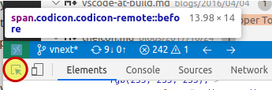

# 产品图标主题

Visual Studio Code 包含一组内置图标，用于视图和编辑器中，但也可以在悬停提示、状态栏甚至扩展中被引用。例如，过滤操作按钮中的图标、视图图标、状态栏图标、断点图标，以及树形视图和编辑器中的折叠图标。

产品图标主题允许扩展重新定义这些图标，从而为 VS Code 提供自定义外观。产品图标主题不涵盖文件图标（由文件图标主题涵盖）和扩展贡献的图标。

VS Code 要求图标定义为图标字体中的字形，并且（目前）将产品图标限制为单一颜色。图标使用的颜色取决于其显示位置，由活动的颜色主题定义。

## 添加新的产品图标主题

要定义自己的产品图标主题，首先创建一个 VS Code 扩展，并在扩展的 `package.json` 中添加 `productIconThemes` 贡献点。

```json
{
  "contributes": {
    "productIconThemes": [
      {
        "id": "aliensAreBack",
        "label": "Aliens Are Back",
        "path": "./producticons/aliens-product-icon-theme.json"
      }
    ]
  }
}
```

`id` 是产品图标主题的标识符。它在设置中使用，因此要保证唯一且可读。`label` 显示在产品图标主题选择器下拉菜单中。`path` 指向扩展中定义图标集的文件。如果你的文件名遵循 `*product-icon-theme.json` 命名方案，在 VS Code 中编辑产品图标主题文件时将获得补全支持和悬停提示。

## 产品图标定义文件

产品图标定义文件是一个 JSON 文件，定义一个或多个图标字体和一组图标定义。

### 字体定义

`fonts` 部分允许你声明任意数量的要使用的字形字体，但必须至少定义一个字体定义。

这些字体之后可以在图标定义中引用。如果图标定义未指定字体 ID，则第一个声明的字体将用作默认字体。

将字体文件复制到扩展中并相应地设置路径。

建议使用 [WOFF](https://developer.mozilla.org/docs/Web/Guide/WOFF) 字体。

- 将 'woff' 设置为格式。
- weight 属性值在[此处](https://developer.mozilla.org/docs/Web/CSS/font-weight#Values)定义。
- style 属性值在[此处](https://developer.mozilla.org/docs/Web/CSS/@font-face/font-style#Values)定义。

```json
{
  "fonts": [
    {
      "id": "alien-font",
      "src": [
        {
          "path": "./alien.woff",
          "format": "woff"
        }
      ],
      "weight": "normal",
      "style": "normal"
    }
  ]
}
```

### 图标定义

VS Code 通过图标 ID 列表来定义图标，视图通过这些 ID 引用图标。产品图标的 `iconDefinitions` 部分将这些 ID 分配给新图标。

每个定义使用 `fontId` 引用在 `fonts` 部分中定义的字体之一。如果省略 `fontId`，则使用字体定义中列出的第一个字体。

```json
{
  "iconDefinitions": {
    "dialog-close": {
      "fontCharacter": "\\43",
      "fontId": "alien-font"
    },
  }
}
```

所有图标标识符的列表可以在[图标参考](/vscode/extension/references/icons-in-labels#icon-listing)中找到。

## 开发和测试

VS Code 为 `package.json` 文件以及产品图标主题文件提供了内置编辑支持。要获得此支持，你的主题文件名需要以 `product-icon-theme.json` 结尾。这将启用所有属性的代码补全（包括已知图标 ID），以及悬停提示和验证。

要试用产品图标主题，在 VS Code 中打开扩展文件夹并按 `kb(workbench.action.debug.start)`。这将在扩展开发宿主窗口中运行扩展。该窗口启用了你的扩展，扩展会自动切换到第一个产品图标主题。

此外，主题文件会被监视变更，图标更新将在主题文件修改时自动应用。在编辑产品图标定义文件时，你会看到保存后的实时更改。

要在产品图标主题之间切换，使用命令 **Preferences: Product Icon Theme**。

要查找 VS Code UI 中某个位置使用的是哪个图标，通过运行 **Help > Toggle Developer Tools** 打开开发者工具，然后：

- 点击开发者工具左上角的检查工具。
- 将鼠标移到要检查的图标上。
- 如果图标的类名是 `codicon.codicon-remote`，则图标 ID 为 `remote`。



## 示例

[Product Color Theme 示例](https://github.com/microsoft/vscode-extension-samples/tree/main/product-icon-theme-sample)可用作实验场。
