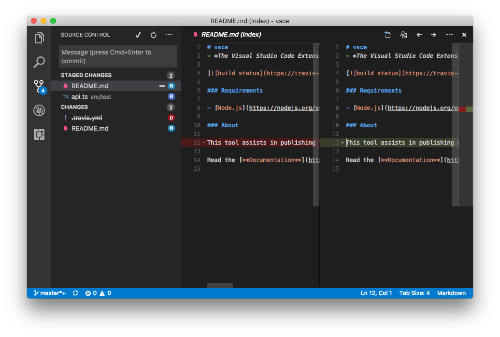
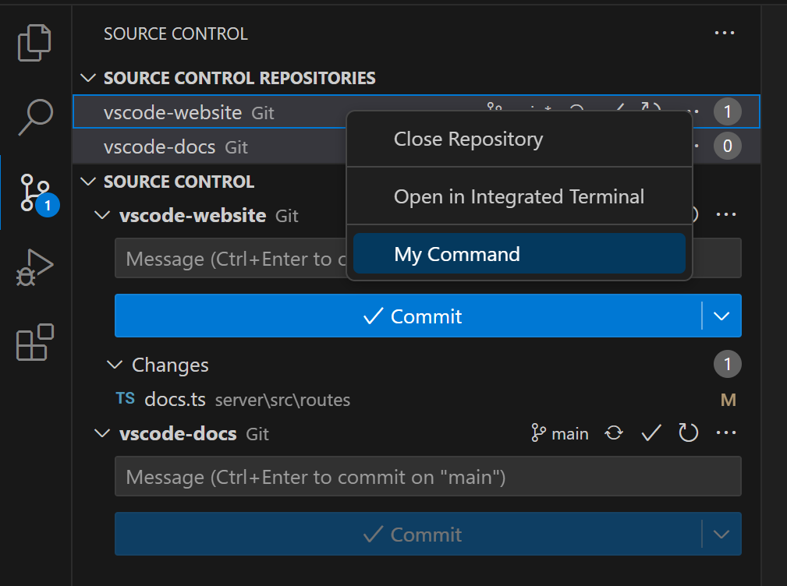
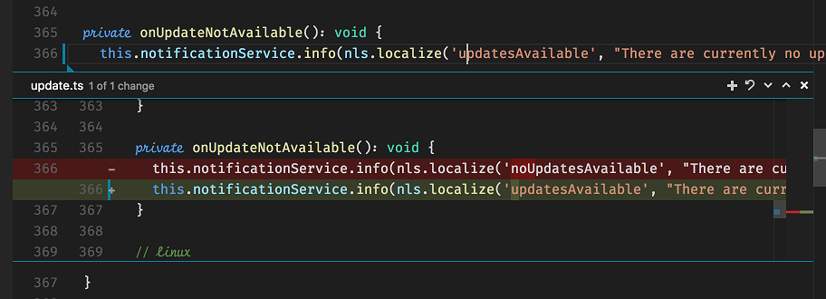

# 源代码管理 API

源代码管理 API 允许扩展作者定义源代码管理（SCM）功能。它提供了一个精简而强大的 API 接口，使许多不同的 SCM 系统能够集成到 Visual Studio Code 中，同时为所有系统提供统一的用户界面。



VS Code 自带一个源代码管理提供者——Git 扩展，它是该 API 的最佳参考实现。如果你想开发自己的 SCM 提供者，Git 扩展是一个[很好的起点](https://github.com/microsoft/vscode/blob/main/extensions/git/src/repository.ts)。Marketplace 上还有其他优秀的示例，例如 [SVN 扩展](https://marketplace.visualstudio.com/items?itemName=johnstoncode.svn-scm)。

本文档将帮助你构建一个扩展，使任何 SCM 系统都能在 VS Code 中运行。

> **注意：** 你随时可以查阅我们文档中的 [`vscode` 命名空间 API 参考](/vscode/extension/references/vscode-api#scm)。

## 源代码管理模型

`SourceControl` 是负责用**资源状态**（`SourceControlResourceState` 实例）填充源代码管理模型的实体。资源状态本身按**分组**（`SourceControlResourceGroup` 实例）进行组织。

你可以通过 `vscode.scm.createSourceControl` 创建一个新的 SourceControl。

为了更好地理解这三个实体之间的关系，我们以 [Git](https://github.com/microsoft/vscode/tree/main/extensions/git) 为例。考虑以下 `git status` 的输出：

```bash
vsce main* → git status
On branch main
Your branch is up-to-date with 'origin/main'.
Changes to be committed:
  (use "git reset HEAD <file>..." to unstage)

        modified:   README.md
        renamed:    src/api.ts -> src/test/api.ts

Changes not staged for commit:
  (use "git add/rm <file>..." to update what will be committed)
  (use "git checkout -- <file>..." to discard changes in working directory)

        deleted:    .travis.yml
        modified:   README.md
```

这个工作区中发生了很多事情。首先，`README.md` 文件被修改、暂存，然后再次被修改。其次，`src/api.ts` 文件被移动到 `src/test/api.ts`，并且该移动已被暂存。最后，`.travis.yml` 文件已被删除。

对于这个工作区，Git 定义了两个资源分组：**工作树**（working tree）和**索引**（index）。每个分组中的每个**文件变更**就是一个**资源状态**：

- **Index** - 资源分组
  - `README.md`，已修改 - 资源状态
  - `src/test/api.ts`，从 `src/api.ts` 重命名 - 资源状态
- **Working Tree** - 资源分组
  - `.travis.yml`，已删除 - 资源状态
  - `README.md`，已修改 - 资源状态

注意同一个文件 `README.md` 如何属于两个不同的资源状态。

以下是 Git 创建此模型的方式：

```ts
function createResourceUri(relativePath: string): vscode.Uri {
  const absolutePath = path.join(vscode.workspace.rootPath, relativePath);
  return vscode.Uri.file(absolutePath);
}

const gitSCM = vscode.scm.createSourceControl('git', 'Git');

const index = gitSCM.createResourceGroup('index', 'Index');
index.resourceStates = [
  { resourceUri: createResourceUri('README.md') },
  { resourceUri: createResourceUri('src/test/api.ts') }
];

const workingTree = gitSCM.createResourceGroup('workingTree', 'Changes');
workingTree.resourceStates = [
  { resourceUri: createResourceUri('.travis.yml') },
  { resourceUri: createResourceUri('README.md') }
];
```

对源代码管理和资源分组所做的更改将传播到源代码管理视图。

## 源代码管理视图

VS Code 能够在源代码管理模型变化时填充源代码管理视图。资源状态可以通过 `SourceControlResourceDecorations` 进行自定义：

```ts
export interface SourceControlResourceState {
  readonly decorations?: SourceControlResourceDecorations;
}
```

上面的示例足以在源代码管理视图中填充一个简单的列表，但用户可能希望对每个资源执行多种交互操作。例如，当用户点击资源状态时会发生什么？资源状态可以选择性地提供一个命令来处理此操作：

```ts
export interface SourceControlResourceState {
  readonly command?: Command;
}
```

### 菜单

有六个源代码管理菜单 ID，你可以在其中放置菜单项，为用户提供更丰富的用户界面。

`scm/title` 菜单位于 SCM 视图标题的右侧。`navigation` 分组中的菜单项将内联显示，而其他所有菜单项将在 `…` 下拉菜单中显示。

以下三个菜单类似：

- `scm/resourceGroup/context` 为 [`SourceControlResourceGroup`](/vscode/extension/references/contribution-points#contributes.menus) 项添加命令。
- `scm/resourceState/context` 为 [`SourceControlResourceState`](/vscode/extension/references/contribution-points#contributes.menus) 项添加命令。
- `scm/resourceFolder/context` 为中间文件夹添加命令——当 [`SourceControlResourceState`](/vscode/extension/references/contribution-points#contributes.menus) 的 resourceUri 路径包含文件夹且用户选择了树视图而非列表视图模式时，会显示这些中间文件夹。

将菜单项放在 `inline` 分组中可使其内联显示。所有其他分组的菜单项将显示在上下文菜单中，通常通过鼠标右键访问。

注意 SCM 视图支持多选，因此命令接收的参数是一个包含一个或多个资源的数组。

例如，Git 支持暂存多个文件，方法是将 `git.stage` 命令添加到 `scm/resourceState/context` 菜单中，并使用如下方法声明：

```ts
stage(...resourceStates: SourceControlResourceState[]): Promise<void>;
```

创建 `SourceControl` 和 `SourceControlResourceGroup` 实例时，需要提供一个 `id` 字符串。这些值将分别填充到 `scmProvider` 和 `scmResourceGroup` 上下文键中。你可以在菜单项的 `when` 子句中使用这些[上下文键](/vscode/extension/references/when-clause-contexts)。以下是 Git 如何为其 `git.stage` 命令显示内联菜单项：

```json
{
  "command": "git.stage",
  "when": "scmProvider == git && scmResourceGroup == merge",
  "group": "inline"
}
```

`scm/repository` 菜单是**源代码管理仓库**视图中每个 `SourceControl` 实例上的菜单。将菜单项放在 `inline` 分组中可使其内联显示。所有其他分组的菜单项将显示在 `...` 菜单中。`inline` 分组根据可用空间渲染，无法容纳的菜单项会自动移入 `...` 菜单。

`scm/sourceControl` 菜单是**源代码管理仓库**视图中每个 `SourceControl` 实例上的上下文菜单：



`scm/change/title` 允许你向 [Quick Diff](/vscode/extension/references/vscode-api#QuickDiffProvider) 内联差异编辑器的标题栏贡献命令，这将在[后面](#quick-diff)详细描述。命令将接收文档的 URI、其中的变更数组以及内联差异编辑器当前聚焦的变更索引作为参数。例如，以下是贡献到此菜单的 Git `stageChange` 命令的声明，它使用 `when` 子句测试 `originalResourceScheme` [上下文键](/vscode/extension/references/when-clause-contexts)是否等于 `git`：

```ts
async stageChange(uri: Uri, changes: LineChange[], index: number): Promise<void>;
```

### SCM 输入框

源代码管理输入框位于每个源代码管理视图的顶部，允许用户输入消息。你可以获取（和设置）此消息以执行操作。例如在 Git 中，它被用作提交框，用户在其中输入提交消息，`git commit` 命令会读取这些消息。

```ts
export interface SourceControlInputBox {
  value: string;
}

export interface SourceControl {
  readonly inputBox: SourceControlInputBox;
}
```

用户可以按 <kbd>Ctrl+Enter</kbd>（macOS 上为 <kbd>Cmd+Enter</kbd>）来接受消息。你可以通过为 `SourceControl` 实例提供 `acceptInputCommand` 来处理此事件。

```ts
export interface SourceControl {
  readonly acceptInputCommand?: Command;
}
```

## Quick Diff

VS Code 还支持显示 **quick diff** 编辑器行槽装饰。点击这些装饰会显示内联差异体验，你可以为其贡献上下文命令：



这些装饰由 VS Code 自行计算。你只需要为 VS Code 提供任意给定文件的原始内容。

```ts
export interface SourceControl {
  quickDiffProvider?: QuickDiffProvider;
}
```

通过 `QuickDiffProvider` 的 `provideOriginalResource` 方法，你的实现可以告诉 VS Code 与作为参数传入的资源 URI 匹配的原始资源的 `Uri`。

将此 API 与 [`workspace` 命名空间中的 `registerTextDocumentContentProvider` 方法](/vscode/extension/references/vscode-api#workspace)结合使用，该方法允许你为任意资源提供内容——只要给定的 [`Uri`](/vscode/extension/references/vscode-api#Uri) 与其注册的自定义 `scheme` 匹配。

## 后续步骤

要了解更多关于 VS Code 扩展性模型的内容，请参阅以下主题：

- [SCM API 参考](/vscode/extension/references/vscode-api#scm) - 阅读完整的 SCM API 文档
- [Git 扩展](https://github.com/microsoft/vscode/tree/main/extensions/git) - 通过阅读 Git 扩展实现来学习
- [Extension API 概述](/vscode/extension/) - 了解完整的 VS Code 扩展性模型
- [Extension 清单文件](/vscode/extension/references/extension-manifest) - VS Code package.json 扩展清单文件参考
- [Contribution Points](/vscode/extension/references/contribution-points) - VS Code 贡献点参考
