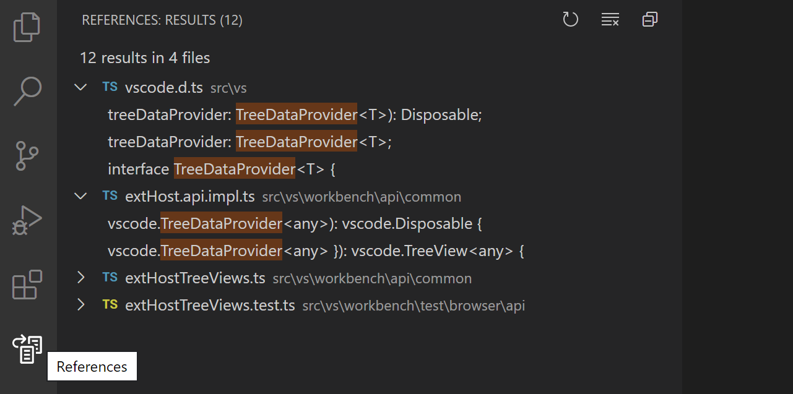
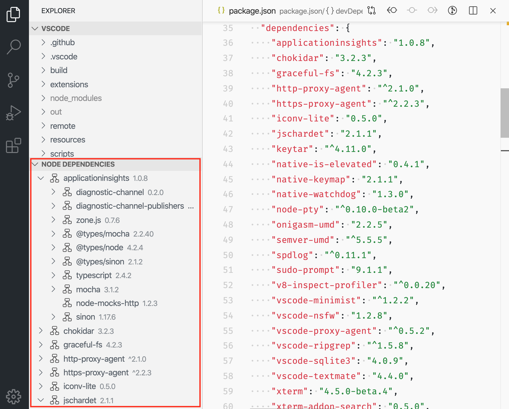
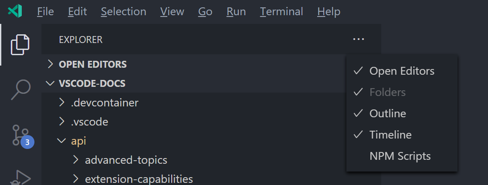
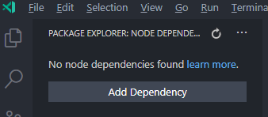

# Tree View API

Tree View API 允许扩展在 Visual Studio Code 的侧边栏中显示内容。这些内容以树形结构组织，并符合 VS Code [内置视图](/docs/getstarted/userinterface#_views)的风格。

例如，内置的引用搜索视图扩展将引用搜索结果显示为单独的视图。



**查找所有引用**的结果显示在 **References: Results** Tree View 中，该视图位于 **References** 视图容器内。

本指南将教你如何编写一个向 Visual Studio Code 贡献 Tree View 和视图容器的扩展。

## Tree View API 基础

为了讲解 Tree View API，我们将构建一个名为 **Node Dependencies** 的示例扩展。该扩展将使用 TreeView 显示当前文件夹中的所有 Node.js 依赖。添加 TreeView 的步骤是：在 `package.json` 中贡献 TreeView、创建 `TreeDataProvider`，以及注册 `TreeDataProvider`。你可以在 [vscode-extension-samples](https://github.com/microsoft/vscode-extension-samples/tree/main/tree-view-sample/README.md) GitHub 仓库的 `tree-view-sample` 中找到此示例扩展的完整源代码。

### package.json 贡献

首先，你需要使用 `package.json` 中的 [contributes.views](/vscode/extension/references/contribution-points#contributes.views) 贡献点告诉 VS Code 你正在贡献一个视图。

以下是我们扩展第一个版本的 `package.json`：

```json
{
    "name": "custom-view-samples",
    "displayName": "Custom view Samples",
    "description": "Samples for VS Code's view API",
    "version": "0.0.1",
    "publisher": "alexr00",
    "engines": {
        "vscode": "^1.74.0"
    },
    "activationEvents": [],
    "main": "./out/extension.js",
    "contributes": {
        "views": {
            "explorer": [
                {
                    "id": "nodeDependencies",
                    "name": "Node Dependencies"
                }
            ]
        }
    },
    "scripts": {
        "vscode:prepublish": "npm run compile",
        "compile": "tsc -p ./",
        "watch": "tsc -watch -p ./"
    },
    "devDependencies": {
        "@types/node": "^10.12.21",
        "@types/vscode": "^1.42.0",
        "typescript": "^3.5.1",
        "tslint": "^5.12.1"
    }
}
```

> **注意**：如果你的扩展目标 VS Code 版本早于 1.74，必须在 `activationEvents` 中显式列出 `onView:nodeDependencies`。

你必须为视图指定标识符和名称，并且可以贡献到以下位置：

- `explorer`：侧边栏中的资源管理器视图
- `debug`：侧边栏中的运行和调试视图
- `scm`：侧边栏中的源代码管理视图
- `test`：侧边栏中的测试资源管理器视图
- [自定义视图容器](#视图容器)

### Tree Data Provider

第二步是向已注册的视图提供数据，以便 VS Code 能在视图中显示数据。为此，你应该首先实现 [TreeDataProvider](/vscode/extension/references/vscode-api#TreeDataProvider)。我们的 `TreeDataProvider` 将提供节点依赖数据，但你也可以创建提供其他类型数据的数据提供器。

此 API 中你需要实现两个必要方法：

- `getChildren(element?: T): ProviderResult<T[]>` - 实现此方法以返回给定 `element` 的子元素，如果没有传入元素则返回根元素。
- `getTreeItem(element: T): TreeItem | Thenable<TreeItem>` - 实现此方法以返回在视图中显示的元素的 UI 表示（[TreeItem](/vscode/extension/references/vscode-api#TreeItem)）。

当用户打开 Tree View 时，`getChildren` 方法将在不传入 `element` 的情况下被调用。从这里开始，你的 `TreeDataProvider` 应该返回顶级树项。在我们的示例中，顶级树项的 `collapsibleState` 为 `TreeItemCollapsibleState.Collapsed`，意味着顶级树项将显示为折叠状态。将 `collapsibleState` 设置为 `TreeItemCollapsibleState.Expanded` 会使树项显示为展开状态。将 `collapsibleState` 保持为默认的 `TreeItemCollapsibleState.None` 表示该树项没有子项。对于 `collapsibleState` 为 `TreeItemCollapsibleState.None` 的树项，不会调用 `getChildren`。

以下是提供节点依赖数据的 `TreeDataProvider` 实现示例：

```ts
import * as vscode from 'vscode';
import * as fs from 'fs';
import * as path from 'path';

export class NodeDependenciesProvider implements vscode.TreeDataProvider<Dependency> {

    constructor(private workspaceRoot: string) {}

    getTreeItem(element: Dependency): vscode.TreeItem {
        return element;
    }

    getChildren(element?: Dependency): Thenable<Dependency[]> {
        if (!this.workspaceRoot) {
            vscode.window.showInformationMessage('No dependency in empty workspace');
            return Promise.resolve([]);
        }

        if (element) {
            return Promise.resolve(this.getDepsInPackageJson(path.join(this.workspaceRoot, 'node_modules', element.label, 'package.json')));
        } else {
            const packageJsonPath = path.join(this.workspaceRoot, 'package.json');
            if (this.pathExists(packageJsonPath)) {
                return Promise.resolve(this.getDepsInPackageJson(packageJsonPath));
            } else {
                vscode.window.showInformationMessage('Workspace has no package.json');
                return Promise.resolve([]);
            }
        }

    }

    /**
     * Given the path to package.json, read all its dependencies and devDependencies.
     */
    private getDepsInPackageJson(packageJsonPath: string): Dependency[] {
        if (this.pathExists(packageJsonPath)) {
            const toDep = (moduleName: string, version: string): Dependency => {
                if (this.pathExists(path.join(this.workspaceRoot, 'node_modules', moduleName))) {
                    return new Dependency(moduleName, version, vscode.TreeItemCollapsibleState.Collapsed);
                } else {
                    return new Dependency(moduleName, version, vscode.TreeItemCollapsibleState.None);
                }
            };

            const packageJson = JSON.parse(fs.readFileSync(packageJsonPath, 'utf-8'));

            const deps = packageJson.dependencies
                ? Object.keys(packageJson.dependencies).map(dep => toDep(dep, packageJson.dependencies[dep]))
                : [];
            const devDeps = packageJson.devDependencies
                ? Object.keys(packageJson.devDependencies).map(dep => toDep(dep, packageJson.devDependencies[dep]))
                : [];
            return deps.concat(devDeps);
        } else {
            return [];
        }
    }

    private pathExists(p: string): boolean {
        try {
            fs.accessSync(p);
        } catch (err) {
            return false;
        }
        return true;
    }
}

class Dependency extends vscode.TreeItem {

    constructor(
        public readonly label: string,
        private version: string,
        public readonly collapsibleState: vscode.TreeItemCollapsibleState,
    ) {
        super(label, collapsibleState);
        this.tooltip = `${this.label}-${this.version}`;
        this.description = this.version;
    }

    iconPath = {
        light: path.join(__filename, '..', '..', 'resources', 'light', 'dependency.svg'),
        dark: path.join(__filename, '..', '..', 'resources', 'dark', 'dependency.svg')
    };

}
```

### 注册 TreeDataProvider

第三步是将上述数据提供器注册到你的视图。

可以通过以下两种方式完成：

- `vscode.window.registerTreeDataProvider` - 通过提供已注册的视图 ID 和上述数据提供器来注册树数据提供器。

    ```typescript
    const rootPath = (vscode.workspace.workspaceFolders && (vscode.workspace.workspaceFolders.length > 0))
		? vscode.workspace.workspaceFolders[0].uri.fsPath : undefined;
    vscode.window.registerTreeDataProvider('nodeDependencies', new NodeDependenciesProvider(rootPath));
    ```

- `vscode.window.createTreeView` - 通过提供已注册的视图 ID 和上述数据提供器来创建 Tree View。这将提供对 [TreeView](/vscode/extension/references/vscode-api#TreeView) 的访问，你可以用它执行其他视图操作。如果你需要 `TreeView` API，请使用 `createTreeView`。

    ```typescript
    vscode.window.createTreeView('nodeDependencies', { treeDataProvider: new NodeDependenciesProvider(rootPath)});
    ```

以下是运行中的扩展：



### 更新 Tree View 内容

我们的节点依赖视图很简单，数据显示后不会更新。然而，在视图中添加刷新按钮并使用 `package.json` 的当前内容更新节点依赖视图会很有用。为此，我们可以使用 `onDidChangeTreeData` 事件。

- `onDidChangeTreeData?: Event<T | undefined | null | void>` - 如果你的树数据可以更改并且想要更新 TreeView，请实现此方法。

在你的 `NodeDependenciesProvider` 中添加以下代码。

```ts
  private _onDidChangeTreeData: vscode.EventEmitter<Dependency | undefined | null | void> = new vscode.EventEmitter<Dependency | undefined | null | void>();
  readonly onDidChangeTreeData: vscode.Event<Dependency | undefined | null | void> = this._onDidChangeTreeData.event;

  refresh(): void {
    this._onDidChangeTreeData.fire();
  }
```

现在我们有了一个刷新方法，但还没有人调用它。我们可以添加一个命令来调用刷新。

在你的 `package.json` 的 `contributes` 部分中添加：

```json
    "commands": [
            {
                "command": "nodeDependencies.refreshEntry",
                "title": "Refresh",
                "icon": {
                    "light": "resources/light/refresh.svg",
                    "dark": "resources/dark/refresh.svg"
                }
            },
    ]
```

并在扩展激活时注册命令：

```ts
import * as vscode from 'vscode';
import { NodeDependenciesProvider } from './nodeDependencies';

export function activate(context: vscode.ExtensionContext) {
    const rootPath = (vscode.workspace.workspaceFolders && (vscode.workspace.workspaceFolders.length > 0))
		? vscode.workspace.workspaceFolders[0].uri.fsPath : undefined;
    const nodeDependenciesProvider = new NodeDependenciesProvider(rootPath);
    vscode.window.registerTreeDataProvider('nodeDependencies', nodeDependenciesProvider);
    vscode.commands.registerCommand('nodeDependencies.refreshEntry', () => nodeDependenciesProvider.refresh());
}
```

现在我们有了一个可以刷新节点依赖视图的命令，但在视图上放一个按钮会更好。我们已经为命令添加了 `icon`，所以将其添加到视图时将显示该图标。

在你的 `package.json` 的 `contributes` 部分中添加：

```json
"menus": {
    "view/title": [
        {
            "command": "nodeDependencies.refreshEntry",
            "when": "view == nodeDependencies",
            "group": "navigation"
        },
    ]
}
```

## 激活

你的扩展应仅在用户需要其功能时才被激活，这一点很重要。在这种情况下，你应该考虑仅在用户开始使用视图时激活扩展。当你的扩展声明了视图贡献时，VS Code 会自动为你完成此操作。当用户打开视图时，VS Code 会发出 [onView:${viewId}](/vscode/extension/references/activation-events#onView) 激活事件（对于上面的示例是 `onView:nodeDependencies`）。

> **注意**：对于早于 1.74.0 的 VS Code 版本，你必须在 `package.json` 中显式注册此激活事件，VS Code 才能在此视图上激活你的扩展：
>```json
>"activationEvents": [
>        "onView:nodeDependencies",
>],
>```

## 视图容器

视图容器包含一组视图，显示在活动栏或面板中，与内置的视图容器并排。内置视图容器的示例包括源代码管理和资源管理器。


要贡献视图容器，你应该首先使用 `package.json` 中的 [contributes.viewsContainers](/vscode/extension/references/contribution-points#contributes.viewsContainers) 贡献点注册它。

你必须指定以下必填字段：

- `id` - 你正在创建的新视图容器的 ID。
- `title` - 将显示在视图容器顶部的名称。
- `icon` - 在活动栏中为视图容器显示的图片。

```json
"contributes": {
  "viewsContainers": {
    "activitybar": [
      {
        "id": "package-explorer",
        "title": "Package Explorer",
        "icon": "media/dep.svg"
      }
    ]
  }
}
```

或者，你可以通过将其放在 `panel` 节点下来将此视图贡献到面板中。

```json
"contributes": {
  "viewsContainers": {
    "panel": [
      {
        "id": "package-explorer",
        "title": "Package Explorer",
        "icon": "media/dep.svg"
      }
    ]
  }
}
```

## 向视图容器贡献视图

创建视图容器后，你可以使用 `package.json` 中的 [contributes.views](/vscode/extension/references/contribution-points#contributes.views) 贡献点。

```json
"contributes": {
  "views": {
    "package-explorer": [
      {
        "id": "nodeDependencies",
        "name": "Node Dependencies",
        "icon": "media/dep.svg",
        "contextualTitle": "Package Explorer"
      }
    ]
  }
}
```

视图还可以具有可选的 `visibility` 属性，可设置为 `visible`、`collapsed` 或 `hidden`。此属性仅在首次打开包含此视图的工作区时被 VS Code 遵循。之后，可见性将设置为用户选择的值。如果你的视图容器包含多个视图，或者你的视图并非对所有扩展用户都有用，请考虑将视图设置为 `collapsed` 或 `hidden`。`hidden` 视图将出现在视图容器的"视图"菜单中：



## 视图操作

操作可以作为内联图标显示在单个树项上、树项上下文菜单中，以及视图顶部的视图标题中。操作是命令，你通过在 `package.json` 中添加贡献来使其显示在这些位置。

要贡献到这三个位置，你可以在 package.json 中使用以下菜单贡献点：

- `view/title` - 在视图标题中显示操作的位置。主操作或内联操作使用 `"group": "navigation"`，其余为辅助操作，在 `...` 菜单中。
- `view/item/context` - 为树项显示操作的位置。内联操作使用 `"group": "inline"`，其余为辅助操作，在 `...` 菜单中。

你可以使用 [when 子句](/vscode/extension/references/when-clause-contexts)来控制这些操作的可见性。


示例：

```json
"contributes": {
  "commands": [
    {
      "command": "nodeDependencies.refreshEntry",
      "title": "Refresh",
      "icon": {
        "light": "resources/light/refresh.svg",
        "dark": "resources/dark/refresh.svg"
      }
    },
    {
      "command": "nodeDependencies.addEntry",
      "title": "Add"
    },
    {
      "command": "nodeDependencies.editEntry",
      "title": "Edit",
      "icon": {
        "light": "resources/light/edit.svg",
        "dark": "resources/dark/edit.svg"
      }
    },
    {
      "command": "nodeDependencies.deleteEntry",
      "title": "Delete"
    }
  ],
  "menus": {
    "view/title": [
      {
        "command": "nodeDependencies.refreshEntry",
        "when": "view == nodeDependencies",
        "group": "navigation"
      },
      {
        "command": "nodeDependencies.addEntry",
        "when": "view == nodeDependencies"
      }
    ],
    "view/item/context": [
      {
        "command": "nodeDependencies.editEntry",
        "when": "view == nodeDependencies && viewItem == dependency",
        "group": "inline"
      },
      {
        "command": "nodeDependencies.deleteEntry",
        "when": "view == nodeDependencies && viewItem == dependency"
      }
    ]
  }
}
```

默认情况下，操作按字母顺序排列。要指定不同的顺序，在组名后添加 `@` 和所需的顺序号。例如，`navigation@3` 将使操作显示在 `navigation` 组的第 3 个位置。

你可以通过创建不同的组来进一步分隔 `...` 菜单中的项。这些组名是任意的，并按组名字母顺序排列。

**注意：** 如果你想为特定树项显示操作，可以通过使用 `TreeItem.contextValue` 定义树项的上下文来实现，你可以在 `when` 表达式中为键 `viewItem` 指定上下文值。

示例：

```json
"contributes": {
  "menus": {
    "view/item/context": [
      {
        "command": "nodeDependencies.deleteEntry",
        "when": "view == nodeDependencies && viewItem == dependency"
      }
    ]
  }
}
```

## 欢迎内容

如果你的视图可能为空，或者你想向其他扩展的空视图添加欢迎内容，你可以贡献 `viewsWelcome` 内容。空视图是指没有 `TreeView.message` 且树为空的视图。

```json
"contributes": {
  "viewsWelcome": [
    {
      "view": "nodeDependencies",
      "contents": "No node dependencies found [learn more](https://www.npmjs.com/).\n[Add Dependency](command:nodeDependencies.addEntry)"
    }
  ]
}
```



欢迎内容中支持链接。按照约定，单独一行的链接会渲染为按钮。每个欢迎内容还可以包含 `when` 子句。更多示例请参见[内置 Git 扩展](https://github.com/microsoft/vscode/tree/main/extensions/git)。

## TreeDataProvider

扩展开发者应以编程方式注册 [TreeDataProvider](/vscode/extension/references/vscode-api#TreeDataProvider) 来填充视图中的数据。

```typescript
vscode.window.registerTreeDataProvider('nodeDependencies', new DepNodeProvider());
```

请参阅 `tree-view-sample` 中的 [nodeDependencies.ts](https://github.com/microsoft/vscode-extension-samples/tree/main/tree-view-sample/src/nodeDependencies.ts) 了解实现。

## TreeView

如果你想以编程方式对视图执行一些 UI 操作，可以使用 `window.createTreeView` 代替 `window.registerTreeDataProvider`。这将提供对视图的访问，你可以用它执行视图操作。

```typescript
vscode.window.createTreeView('ftpExplorer', {
  treeDataProvider: new FtpTreeDataProvider()
});
```

请参阅 `tree-view-sample` 中的 [ftpExplorer.ts](https://github.com/microsoft/vscode-extension-samples/tree/main/tree-view-sample/src/ftpExplorer.ts) 了解实现。
