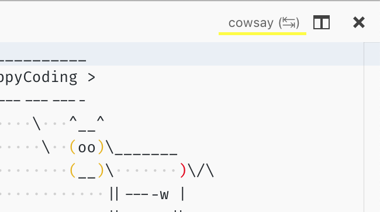

# 虚拟文档

文本文档内容提供程序 API 允许你从任意来源在 Visual Studio Code 中创建只读文档。你可以在以下地址找到包含源代码的示例扩展：[https://github.com/microsoft/vscode-extension-samples/blob/main/virtual-document-sample/README.md](https://github.com/microsoft/vscode-extension-samples/blob/main/virtual-document-sample/README.md)。

## TextDocumentContentProvider

此 API 通过声明一个 URI 方案来工作，你的提供程序随后为该方案返回文本内容。注册提供程序时必须指定方案，并且之后不能更改。同一个提供程序可以用于多个方案，也可以为单个方案注册多个提供程序。

```ts
vscode.workspace.registerTextDocumentContentProvider(myScheme, myProvider);
```

调用 `registerTextDocumentContentProvider` 会返回一个可释放对象，通过它可以撤销注册。提供程序只需实现 `provideTextDocumentContent` 函数，该函数接收一个 URI 和取消令牌。

```ts
const myProvider = new class implements vscode.TextDocumentContentProvider {
  provideTextDocumentContent(uri: vscode.Uri): string {
    // invoke cowsay, use uri-path as text
    return cowsay.say({ text: uri.path });
  }
};
```

请注意，提供程序不会创建虚拟文档的 URI——它的角色是在给定 URI 后**提供**内容。反过来，内容提供程序被接入到打开文档的逻辑中，因此提供程序总是会被考虑。

此示例使用一个 'cowsay' 命令来构建一个 URI，然后由编辑器显示：

```ts
vscode.commands.registerCommand('cowsay.say', async () => {
  let what = await vscode.window.showInputBox({ placeHolder: 'cow say?' });
  if (what) {
    let uri = vscode.Uri.parse('cowsay:' + what);
    let doc = await vscode.workspace.openTextDocument(uri); // calls back into the provider
    await vscode.window.showTextDocument(doc, { preview: false });
  }
});
```

该命令提示用户输入，创建一个 `cowsay` 方案的 URI，为该 URI 打开文档，最后为该文档打开编辑器。在步骤 3（打开文档）中，提供程序被要求为该 URI 提供内容。

至此，我们已经有了一个功能完整的文本文档内容提供程序。接下来的章节将描述如何更新虚拟文档以及如何为虚拟文档注册 UI 命令。

### 更新虚拟文档

根据场景的不同，虚拟文档可能会发生变化。为支持此功能，提供程序可以实现 `onDidChange` 事件。

`vscode.Event` 类型定义了 VS Code 中事件机制的约定。实现事件最简单的方式是使用 `vscode.EventEmitter`，如下所示：

```ts
const myProvider = new class implements vscode.TextDocumentContentProvider {
  // emitter and its event
  onDidChangeEmitter = new vscode.EventEmitter<vscode.Uri>();
  onDidChange = this.onDidChangeEmitter.event;

  //...
};
```

事件发射器有一个 `fire` 方法，可用于在文档发生更改时通知 VS Code。已更改的文档通过其 URI 来标识，作为 `fire` 方法的参数传入。然后，假设文档仍然打开，提供程序将再次被调用以提供更新后的内容。

这就是让 VS Code 监听虚拟文档更改所需的全部内容。要查看使用此功能的更复杂示例，请参阅：[https://github.com/microsoft/vscode-extension-samples/blob/main/contentprovider-sample/README.md](https://github.com/microsoft/vscode-extension-samples/blob/main/contentprovider-sample/README.md)。

### 添加编辑器命令

可以添加仅与关联内容提供程序提供的文档交互的编辑器操作。以下是一个反转牛所说内容的示例命令：

```ts
// register a command that updates the current cowsay
subscriptions.push(
  vscode.commands.registerCommand('cowsay.backwards', async () => {
    if (!vscode.window.activeTextEditor) {
      return; // no editor
    }
    let { document } = vscode.window.activeTextEditor;
    if (document.uri.scheme !== myScheme) {
      return; // not my scheme
    }
    // get path-components, reverse it, and create a new uri
    let say = document.uri.path;
    let newSay = say
      .split('')
      .reverse()
      .join('');
    let newUri = document.uri.with({ path: newSay });
    await vscode.window.showTextDocument(newUri, { preview: false });
  })
);
```

上面的代码片段首先检查我们有一个活动编辑器，并且其文档属于我们的方案。这些检查是必需的，因为命令对所有人都是可用（且可执行）的。然后将 URI 的路径组件反转并从中创建一个新的 URI，最后打开一个编辑器。

要使编辑器命令完整，还需要在 `package.json` 中进行声明式配置。在 `contributes` 部分添加以下配置：

```json
"menus": {
  "editor/title": [
    {
      "command": "cowsay.backwards",
      "group": "navigation",
      "when": "resourceScheme == cowsay"
    }
  ]
}
```

这引用了在 `contributes/commands` 部分定义的 `cowsay.backwards` 命令，并指定它应出现在编辑器标题菜单（右上角工具栏）中。仅此配置意味着该命令会为每个编辑器显示。`when` 子句正是用于此目的——它描述了必须为真才能显示操作的条件。在此示例中，它声明编辑器中文档的方案必须是 `cowsay` 方案。然后对 `commandPalette` 菜单重复此配置——默认情况下它会显示所有命令。



### 事件与可见性

文档提供程序是 VS Code 中的一等公民，其内容出现在常规文本文档中，使用与文件等相同的基础设施。然而，这也意味着"你的"文档无法隐藏，它们会出现在 `onDidOpenTextDocument` 和 `onDidCloseTextDocument` 事件中，是 `vscode.workspace.textDocuments` 的一部分等等。对所有人来说，规则是检查文档的 `scheme`，然后决定是否要对该文档进行操作。

# 文件系统 API

如果你需要更大的灵活性和更强的功能，请查看 [`FileSystemProvider`](/vscode/extension/references/vscode-api#FileSystemProvider) API。它允许实现一个完整的文件系统，包括文件、文件夹、二进制数据、文件删除、创建等功能。

你可以在以下地址找到包含源代码的示例扩展：[https://github.com/microsoft/vscode-extension-samples/tree/main/fsprovider-sample/README.md](https://github.com/microsoft/vscode-extension-samples/tree/main/fsprovider-sample/README.md)。


当 VS Code 打开此类文件系统的文件夹或工作区时，我们称之为虚拟工作区。当虚拟工作区在 VS Code 窗口中打开时，会通过左下角远程指示器中的标签来显示，类似于远程窗口。请参阅[虚拟工作区指南](/vscode/extension/extension-guides/virtual-workspaces)，了解扩展如何支持这种配置。


