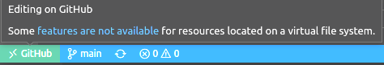
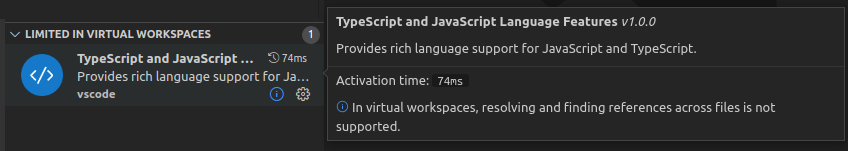

# 虚拟工作区

像 [GitHub Repositories](https://marketplace.visualstudio.com/items?itemName=GitHub.remotehub) 这样的扩展，通过[文件系统提供程序](/vscode/extension/extension-guides/virtual-documents#file-system-api)在 VS Code 中打开一个或多个文件夹。当扩展实现文件系统提供程序时，工作区资源可能不在本地磁盘上，而是**虚拟的**，位于服务器或云端，编辑操作也在那里进行。

这种配置被称为**虚拟工作区**。当虚拟工作区在 VS Code 窗口中打开时，会通过左下角远程指示器中的标签来显示，类似于其他[远程开发](/docs/remote/remote-overview)窗口。



并非所有扩展都能处理虚拟资源，有些扩展可能要求资源在磁盘上。一些扩展使用的工具依赖磁盘访问、需要同步文件访问，或者缺乏必要的文件系统抽象。在这些情况下，当处于虚拟工作区时，VS Code 会向用户指示他们正在受限模式下运行，某些扩展被停用或以有限功能运行。

通常，用户希望尽可能多的扩展能在虚拟工作区中工作，并且在浏览和编辑远程资源时有良好的用户体验。本指南展示了扩展如何针对虚拟工作区进行测试，描述了使它们能在虚拟工作区中工作所需的修改，并介绍了 `virtualWorkspaces` 能力属性。

修改扩展以适配虚拟工作区也是让扩展在 [VS Code for the Web](/docs/setup/vscode-web) 中良好运行的重要一步。VS Code for the Web 完全在浏览器中运行，由于浏览器沙箱的限制，工作区是虚拟的。有关更多详情，请参阅 [Web 扩展](/vscode/extension/extension-guides/web-extensions)指南。

## 我的扩展会受到影响吗？

如果扩展没有可执行代码，而是纯粹的声明式扩展（如主题、快捷键绑定、代码片段或语法扩展），它可以在虚拟工作区中运行，无需修改。

包含代码的扩展（即定义了 `main` 入口点的扩展）需要检查，并可能需要修改。

## 在虚拟工作区中运行你的扩展

安装 [GitHub Repositories](https://marketplace.visualstudio.com/items?itemName=GitHub.remotehub) 扩展，然后从命令面板中运行 **Open GitHub Repository...** 命令。该命令会显示一个快速选择下拉列表，你可以粘贴任何 GitHub URL，或选择搜索特定的仓库或拉取请求。

这会打开一个 VS Code 窗口，所有资源都是虚拟的虚拟工作区。

## 检查扩展代码是否已为虚拟资源做好准备

VS Code API 对虚拟文件系统的支持已经有相当长的时间了。你可以查看[文件系统提供程序 API](/vscode/extension/extension-guides/virtual-documents#file-system-api)。

文件系统提供程序为新的 URI 方案（例如 `vscode-vfs`）注册，该文件系统上的资源将使用该方案的 URI 表示（`vscode-vfs://github/microsoft/vscode/package.json`）

检查你的扩展如何处理从 VS Code API 返回的 URI：

* 永远不要假设 URI 方案是 `file`。`URI.fsPath` 只能在 URI 方案为 `file` 时使用。
* 注意 `fs` Node 模块在文件系统操作中的使用。如果可能，请使用 `vscode.workspace.fs` API，它会委托给相应的文件系统提供程序。
* 检查依赖 `fs` 访问的第三方组件（例如语言服务器或 Node 模块）。
* 如果你从命令中运行可执行文件和任务，请检查这些命令在虚拟工作区窗口中是否有意义，或者是否应该被禁用。

## 标记你的扩展是否可以处理虚拟工作区

`package.json` 中 `capabilities` 下的 `virtualWorkspaces` 属性用于标记扩展是否可以在虚拟工作区中工作。

### 不支持虚拟工作区

以下示例声明扩展不支持虚拟工作区，VS Code 在此配置中不应启用它。

```json
{
  "capabilities": {
    "virtualWorkspaces": {
      "supported": false,
      "description": "Debugging is not possible in virtual workspaces."
    }
  }
}
```

### 部分和完全支持虚拟工作区

当扩展可以在虚拟工作区中工作或部分工作时，应定义 `"virtualWorkspaces": true`。

```json
{
  "capabilities": {
    "virtualWorkspaces": true
  }
}
```

如果扩展可以工作但功能有限，应向用户说明限制：

```json
{
  "capabilities": {
    "virtualWorkspaces": {
      "supported": "limited",
      "description": "In virtual workspaces, resolving and finding references across files is not supported."
    }
  }
}
```

此描述会显示在扩展视图中：



然后，扩展应禁用在虚拟工作区中不支持的功能，如下所述。

### 默认值

`"virtualWorkspaces": true` 是所有尚未填写 `virtualWorkspaces` 能力属性的扩展的默认值。

然而，在测试虚拟工作区的过程中，我们整理了一份我们认为应该在虚拟工作区中被禁用的扩展列表。
该列表可以在 [issue #122836](https://github.com/microsoft/vscode/issues/122836) 中找到。这些扩展的默认值为 `"virtualWorkspaces": false`。

当然，扩展作者更有资格做出这一决定。扩展 `package.json` 中的 `virtualWorkspaces` 能力将覆盖我们的默认值，我们最终将停用我们的列表。

## 打开虚拟工作区时禁用功能

### 禁用命令和视图贡献

命令和视图以及许多其他贡献的可用性可以通过 [when 子句](/vscode/extension/references/when-clause-contexts)中的上下文键来控制。

当所有工作区文件夹都位于虚拟文件系统上时，`virtualWorkspace` 上下文键被设置。以下示例仅在非虚拟工作区时在命令面板中显示 `npm.publish` 命令：

```json
{
    "menus": {
      "commandPalette": [
        {
          "command": "npm.publish",
          "when": "!virtualWorkspace"
        }
      ]
    }
}
```

`resourceScheme` 上下文键设置为文件资源管理器中当前选中元素或编辑器中打开元素的 URI 方案。

在以下示例中，`npm.runSelectedScript` 命令仅当底层资源位于本地磁盘时才显示在编辑器上下文菜单中。

```json
{
    "menus": {
      "editor/context": [
        {
          "command": "npm.runSelectedScript",
          "when": "resourceFilename == 'package.json' && resourceScheme == file"
        }
      ]
    }
}
```

### 通过编程方式检测虚拟工作区

要检查当前工作区是否由非 `file` 方案组成并且是虚拟的，你可以使用以下代码：

```ts
const isVirtualWorkspace = workspace.workspaceFolders && workspace.workspaceFolders.every(f => f.uri.scheme !== 'file');
```

## 语言扩展与虚拟工作区

### 虚拟工作区对语言支持的期望是什么？

要求所有扩展都能完全处理虚拟资源是不现实的。许多扩展使用需要同步文件访问和磁盘上文件的外部工具。因此，仅提供有限功能（如以下列出的**基本**和**单文件**支持）是可以接受的。

A. **基本**语言支持：

* TextMate 分词和着色
* 特定语言的编辑支持：括号对、注释、回车规则、折叠标记
* 代码片段

B. **单文件**语言支持：

* 文档符号（大纲）、折叠、选择范围
* 文档高亮、语义高亮、文档颜色
* 补全、悬停、签名帮助、基于当前文件中的符号和静态语言库的查找引用/声明
* 格式化、链接编辑
* 语法验证和同文件语义验证及代码操作

C. **跨文件、工作区感知**语言支持：

* 跨文件引用
* 工作区符号
* 工作区/项目中所有文件的验证

VS Code 附带的富语言扩展（TypeScript、JSON、CSS、HTML、Markdown）在处理虚拟资源时仅限于单文件语言支持。

### 禁用语言扩展

如果处理单个文件不是一种选择，语言扩展也可以决定在虚拟工作区中禁用该扩展。

如果你的扩展同时提供语法和需要在虚拟工作区中禁用的富语言支持，语法也会被禁用。为避免这种情况，你可以创建一个基本语言扩展（语法、语言配置、代码片段），与富语言支持分开，形成两个扩展。

* 基本语言扩展设置 `"virtualWorkspaces": true`，提供语言 ID、配置、语法和代码片段。
* 富语言扩展设置 `"virtualWorkspaces": false`，包含 `main` 文件。它提供语言支持、命令，并通过 `extensionDependencies` 依赖基本语言扩展。富语言扩展应保留已建立扩展的扩展 ID，以便用户通过安装单个扩展就能继续获得完整功能。

你可以在内置语言扩展中看到这种方法，例如 JSON，它由一个 JSON 扩展和一个 JSON 语言特性扩展组成。

这种分离也有助于在[受限模式](/docs/editor/workspace-trust#restricted-mode)下运行的[不受信任的工作区](/vscode/extension/extension-guides/workspace-trust)。富语言扩展通常需要信任，而基本语言功能可以在任何配置下运行。

### 语言选择器

在为语言特性（例如补全、悬停、代码操作等）注册提供程序时，请确保指定提供程序支持的方案：

```ts
return vscode.languages.registerCompletionItemProvider({ language: 'typescript', scheme: 'file' }, {
  provideCompletionItems(document, position, token) {
    // ...
  }
});
```

### Language Server Protocol (LSP) 对访问虚拟资源的支持情况如何？

正在进行的各项工作将为 LSP 添加文件系统提供程序支持。追踪于 Language Server Protocol [issue #1264](https://github.com/microsoft/language-server-protocol/issues/1264)。
