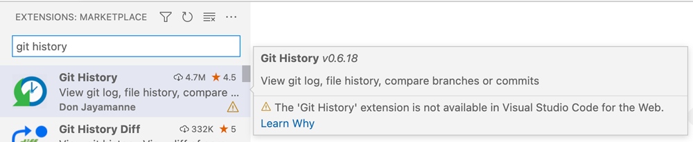

# Web 扩展

Visual Studio Code 可以作为浏览器中的编辑器运行。一个例子是在 GitHub 中浏览仓库或拉取请求时按 `.`（句号键）进入的 `github.dev` 用户界面。当 VS Code 在 Web 中使用时，已安装的扩展在浏览器中的扩展宿主里运行，称为"Web 扩展宿主"。可以在 Web 扩展宿主中运行的扩展称为"Web 扩展"。

Web 扩展与常规扩展具有相同的结构，但由于运行时不同，它们不会运行为 Node.js 运行时编写的相同代码。Web 扩展仍然可以访问完整的 VS Code API，但不再能使用 Node.js API 和模块加载。相反，Web 扩展受浏览器沙箱限制，因此与普通扩展相比有[局限性](#web-extension-main-file)。

Web 扩展运行时也支持 VS Code 桌面版。如果你决定将扩展创建为 Web 扩展，它将在 [VS Code for the Web](/docs/setup/vscode-web)（包括 `vscode.dev` 和 `github.dev`）以及桌面版和 [GitHub Codespaces](/docs/remote/codespaces) 等服务中得到支持。

## Web 扩展结构

Web 扩展的[结构与常规扩展相同](/vscode/extension/get-started/extension-anatomy)。扩展清单（`package.json`）定义了扩展源代码的入口文件，并声明扩展的贡献。

对于 Web 扩展，[主入口文件](#web-extension-main-file)由 `browser` 属性定义，而不是像常规扩展那样由 `main` 属性定义。

`contributes` 属性对 Web 扩展和常规扩展的工作方式相同。

以下示例展示了一个简单 hello world 扩展的 `package.json`，仅在 Web 扩展宿主中运行（它只有一个 `browser` 入口点）：

```json
{
  "name": "helloworld-web-sample",
  "displayName": "helloworld-web-sample",
  "description": "HelloWorld example for VS Code in the browser",
  "version": "0.0.1",
  "publisher": "vscode-samples",
  "repository": "https://github.com/microsoft/vscode-extension-samples/helloworld-web-sample",
  "engines": {
    "vscode": "^1.74.0"
  },
  "categories": ["Other"],
  "activationEvents": [],
  "browser": "./dist/web/extension.js",
  "contributes": {
    "commands": [
      {
        "command": "helloworld-web-sample.helloWorld",
        "title": "Hello World"
      }
    ]
  },
  "scripts": {
    "vscode:prepublish": "npm run package-web",
    "compile-web": "webpack",
    "watch-web": "webpack --watch",
    "package-web": "webpack --mode production --devtool hidden-source-map",
  },
  "devDependencies": {
    "@types/vscode": "^1.59.0",
    "ts-loader": "^9.2.2",
    "webpack": "^5.38.1",
    "webpack-cli": "^4.7.0",
    "@types/webpack-env": "^1.16.0",
    "process": "^0.11.10"
  }
}
```

> **注意**：如果你的扩展目标 VS Code 版本早于 1.74，你必须在 `activationEvents` 中显式列出 `onCommand:helloworld-web-sample.helloWorld`。

只有 `main` 入口点但没有 `browser` 的扩展不是 Web 扩展。它们会被 Web 扩展宿主忽略，并且在扩展视图中不可下载。



仅有声明式贡献（只有 `contributes`，没有 `main` 或 `browser`）的扩展可以是 Web 扩展。它们可以在 [VS Code for the Web](/docs/setup/vscode-web) 中安装和运行，无需扩展作者做任何修改。声明式贡献扩展的例子包括主题、语法和代码片段。

扩展可以同时拥有 `browser` 和 `main` 入口点，以便在浏览器和 Node.js 运行时中运行。[将现有扩展更新为 Web 扩展](#update-existing-extensions-to-web-extensions)部分展示了如何迁移扩展以在两种运行时中工作。

[Web 扩展启用](#web-extension-enablement)部分列出了用于决定扩展是否可以在 Web 扩展宿主中加载的规则。

### Web 扩展主文件

Web 扩展的主文件由 `browser` 属性定义。该脚本在 [Browser WebWorker](https://developer.mozilla.org/docs/Web/API/Web_Workers_API) 环境中的 Web 扩展宿主内运行。它受浏览器 worker 沙箱限制，与在 Node.js 运行时中运行的普通扩展相比有局限性。

* 不支持导入或请求其他模块。`importScripts` 也不可用。因此，代码必须打包为单个文件。
* [VS Code API](/vscode/extension/references/vscode-api) 可以通过 `require('vscode')` 模式加载。这之所以有效是因为有一个 `require` 的垫片，但此垫片不能用于加载额外的扩展文件或额外的 Node 模块。它只对 `require('vscode')` 有效。
* Node.js 全局变量和库（如 `process`、`os`、`setImmediate`、`path`、`util`、`url`）在运行时不可用。但可以通过 webpack 等工具添加。[webpack 配置](#webpack-configuration)部分解释了如何做到这一点。
* 打开的工作区或文件夹位于虚拟文件系统上。访问工作区文件需要通过 VS Code [文件系统](/vscode/extension/references/vscode-api#FileSystem) API，可通过 `vscode.workspace.fs` 访问。
* [扩展上下文](/vscode/extension/references/vscode-api#ExtensionContext)位置（`ExtensionContext.extensionUri`）和存储位置（`ExtensionContext.storageUri`、`globalStorageUri`）也位于虚拟文件系统上，需要通过 `vscode.workspace.fs` 访问。
* 要访问 Web 资源，必须使用 [Fetch](https://developer.mozilla.org/docs/Web/API/Fetch_API) API。被访问的资源需要支持[跨域资源共享](https://developer.mozilla.org/docs/Web/HTTP/CORS)（CORS）。
* 无法创建子进程或运行可执行文件。但可以通过 [Worker](https://developer.mozilla.org/en-US/docs/Web/API/Worker) API 创建 Web Worker。这用于运行语言服务器，如[Web 扩展中的 Language Server Protocol](#language-server-protocol-in-web-extensions)部分所述。
* 与常规扩展一样，扩展的 `activate/deactivate` 函数需要通过 `exports.activate = ...` 模式导出。

## 开发 Web 扩展

幸运的是，TypeScript 和 webpack 等工具可以隐藏许多浏览器运行时的限制，让你以与常规扩展相同的方式编写 Web 扩展。Web 扩展和常规扩展通常可以从相同的源代码生成。

例如，`yo code` [生成器](https://www.npmjs.com/package/generator-code)创建的 `Hello Web Extension` 仅在构建脚本上有所不同。你可以使用提供的启动配置（可通过 **Debug: Select and Start Debugging** 命令访问）像传统 Node.js 扩展一样运行和调试生成的扩展。

## 创建 Web 扩展

要搭建新的 Web 扩展，使用 `yo code` 并选择 **New Web Extension**。确保安装了最新版本的 [generator-code](https://www.npmjs.com/package/generator-code)（>= generator-code@1.6）。要更新生成器和 yo，运行 `npm i -g yo generator-code`。

创建的扩展包含扩展的源代码（一个显示 hello world 通知的命令）、`package.json` 清单文件以及 webpack 或 esbuild 配置文件。

为了简化，我们假设你使用 `webpack` 作为打包工具。在文章末尾，我们也会解释选择 `esbuild` 时有什么不同。

* `src/web/extension.ts` 是扩展的入口源代码文件。它与常规的 hello 扩展相同。
* `package.json` 是扩展清单。
  * 它使用 `browser` 属性指向入口文件。
  * 它提供了脚本：`compile-web`、`watch-web` 和 `package-web`，用于编译、监视和打包。
* `webpack.config.js` 是 webpack 配置文件，用于将扩展源代码编译并打包为单个文件。
* `.vscode/launch.json` 包含在 VS Code 桌面版中以 Web 扩展宿主运行 Web 扩展和测试的启动配置（不再需要设置 `extensions.webWorker`）。
* `.vscode/task.json` 包含启动配置使用的构建任务。它使用 `npm run watch-web` 并依赖于 webpack 特定的 `ts-webpack-watch` 问题匹配器。
* `.vscode/extensions.json` 包含提供问题匹配器的扩展。这些扩展需要安装才能使启动配置正常工作。
* `tsconfig.json` 定义了与 `webworker` 运行时匹配的编译选项。

[helloworld-web-sample](https://github.com/microsoft/vscode-extension-samples/tree/main/helloworld-web-sample) 中的源代码与生成器创建的内容类似。

### webpack 配置

webpack 配置文件由 `yo code` 自动生成。它将扩展的源代码打包为单个 JavaScript 文件，以便在 Web 扩展宿主中加载。

稍后我们将解释如何使用 esbuild 作为打包工具，但现在先从 webpack 开始。

[webpack.config.js](https://github.com/microsoft/vscode-extension-samples/blob/main/helloworld-web-sample/webpack.config.js)

```js
const path = require('path');
const webpack = require('webpack');

/** @typedef {import('webpack').Configuration} WebpackConfig **/
/** @type WebpackConfig */
const webExtensionConfig = {
  mode: 'none', // this leaves the source code as close as possible to the original (when packaging we set this to 'production')
  target: 'webworker', // extensions run in a webworker context
  entry: {
    'extension': './src/web/extension.ts', // source of the web extension main file
    'test/suite/index': './src/web/test/suite/index.ts' // source of the web extension test runner
  },
  output: {
    filename: '[name].js',
    path: path.join(__dirname, './dist/web'),
    libraryTarget: 'commonjs',
    devtoolModuleFilenameTemplate: '../../[resource-path]'
  },
  resolve: {
    mainFields: ['browser', 'module', 'main'], // look for `browser` entry point in imported node modules
    extensions: ['.ts', '.js'], // support ts-files and js-files
    alias: {
      // provides alternate implementation for node module and source files
    },
    fallback: {
      // Webpack 5 no longer polyfills Node.js core modules automatically.
      // see https://webpack.js.org/configuration/resolve/#resolvefallback
      // for the list of Node.js core module polyfills.
      'assert': require.resolve('assert')
    }
  },
  module: {
    rules: [{
      test: /\.ts$/,
      exclude: /node_modules/,
      use: [{
          loader: 'ts-loader'
      }]
    }]
  },
  plugins: [
    new webpack.ProvidePlugin({
      process: 'process/browser', // provide a shim for the global `process` variable
    }),
  ],
  externals: {
    'vscode': 'commonjs vscode', // ignored because it doesn't exist
  },
  performance: {
    hints: false
  },
  devtool: 'nosources-source-map' // create a source map that points to the original source file
};
module.exports = [webExtensionConfig];
```

`webpack.config.js` 的一些重要字段：

* `entry` 字段包含扩展和测试套件的主入口点。
  * 你可能需要调整此路径以正确指向扩展的入口点。
  * 对于现有扩展，你可以先将此路径指向你的 `package.json` 中 `main` 当前使用的文件。
  * 如果你不想打包测试，可以省略测试套件字段。
* `output` 字段指示编译后文件的位置。
  * `[name]` 将被 `entry` 中使用的键替换。因此在生成的配置文件中，它将生成 `dist/web/extension.js` 和 `dist/web/test/suite/index.js`。
* `target` 字段指示编译后的 JavaScript 文件将在哪种类型的环境中运行。对于 Web 扩展，你希望将其设为 `webworker`。
* `resolve` 字段包含为在浏览器中不工作的 Node 库添加别名和回退的能力。
  * 如果你使用像 `path` 这样的库，可以指定如何在 Web 编译上下文中解析 `path`。例如，你可以指向项目中定义 `path` 的文件：`path: path.resolve(__dirname, 'src/my-path-implementation-for-web.js')`。或者你可以使用该库的 Browserify 打包版本 `path-browserify`：`path: require.resolve('path-browserify')`。
  * 请参阅 [webpack resolve.fallback](https://webpack.js.org/configuration/resolve/#resolvefallback) 获取 Node.js 核心模块 polyfill 的列表。
* `plugins` 部分使用 [DefinePlugin plugin](https://webpack.js.org/plugins/define-plugin/) 来 polyfill 全局变量，如 Node.js 的 `process` 全局变量。

## 测试你的 Web 扩展

目前在发布到 Marketplace 之前，有三种方式可以测试 Web 扩展。

* 使用桌面版 VS Code 加上 `--extensionDevelopmentKind=web` 选项，在 VS Code 中运行的 Web 扩展宿主中运行你的 Web 扩展。
* 使用 [@vscode/test-web](https://github.com/microsoft/vscode-test-web) Node 模块打开一个浏览器，其中包含从本地服务器提供的 VS Code for the Web 和你的扩展。
* 将你的扩展[旁加载](#test-your-web-extension-in-vscode.dev)到 [vscode.dev](https://vscode.dev)，在实际环境中查看你的扩展。

### 在桌面版 VS Code 中测试你的 Web 扩展

为了使用现有的 VS Code 扩展开发体验，桌面版 VS Code 支持在常规 Node.js 扩展宿主旁边运行 Web 扩展宿主。

使用 **New Web Extension** 生成器提供的 `pwa-extensionhost` 启动配置：

```json
{
  "version": "0.2.0",
  "configurations": [
    {
      "name": "Run Web Extension in VS Code",
      "type": "pwa-extensionHost",
      "debugWebWorkerHost": true,
      "request": "launch",
      "args": [
        "--extensionDevelopmentPath=${workspaceFolder}",
        "--extensionDevelopmentKind=web"
      ],
      "outFiles": [
        "${workspaceFolder}/dist/web/**/*.js"
      ],
      "preLaunchTask": "npm: watch-web"
    }
  ]
}
```

它使用任务 `npm: watch-web` 通过调用 `npm run watch-web` 来编译扩展。该任务需要在 `tasks.json` 中定义：

```json
{
  "version": "2.0.0",
  "tasks": [
    {
      "type": "npm",
      "script": "watch-web",
      "group": "build",
      "isBackground": true,
      "problemMatcher": [
        "$ts-webpack-watch"
      ]
    }
  ]
}
```

`$ts-webpack-watch` 是一个可以解析 webpack 工具输出的问题匹配器。它由 [TypeScript + Webpack Problem Matchers](https://marketplace.visualstudio.com/items?itemName=eamodio.tsl-problem-matcher) 扩展提供。

在启动的**扩展开发宿主**实例中，Web 扩展将可用并在 Web 扩展宿主中运行。运行 `Hello World` 命令来激活扩展。

打开**正在运行的扩展**视图（命令：**Developer: Show Running Extensions**）查看哪些扩展正在 Web 扩展宿主中运行。

### 使用 @vscode/test-web 在浏览器中测试你的 Web 扩展

[@vscode/test-web](https://github.com/microsoft/vscode-test-web) Node 模块提供了 CLI 和 API 来在浏览器中测试 Web 扩展。

该 Node 模块提供了一个 npm 二进制文件 `vscode-test-web`，可以从命令行打开 VS Code for the Web：

* 它将 VS Code 的 Web 文件下载到 `.vscode-test-web`。
* 在 `localhost:3000` 上启动本地服务器。
* 打开浏览器（Chromium、Firefox 或 Webkit）。

你可以从命令行运行：

```bash
npx @vscode/test-web --extensionDevelopmentPath=$extensionFolderPath $testDataPath
```

或者更好的做法是，将 `@vscode/test-web` 作为开发依赖添加到你的扩展中，并在脚本中调用它：

```json
  "devDependencies": {
    "@vscode/test-web": "*"
  },
  "scripts": {
    "open-in-browser": "vscode-test-web --extensionDevelopmentPath=. ."
  }
```

查看 [@vscode/test-web README](https://www.npmjs.com/package/@vscode/test-web) 获取更多 CLI 选项：

|选项|参数说明|
|-----|-----|
| --browserType | 要启动的浏览器：`chromium`（默认）、`firefox` 或 `webkit` |
| --extensionDevelopmentPath | 指向正在开发的扩展的路径。 |
| --extensionTestsPath | 指向要运行的测试模块的路径。 |
| --permission| 授予打开浏览器的权限：例如 `clipboard-read`、`clipboard-write`。<br>请参阅[完整的选项列表](https://playwright.dev/docs/api/class-browsercontext#browser-context-grant-permissions)。此参数可多次提供。 |
| --folder-uri | 要打开 VS Code 的工作区 URI。当提供 `folderPath` 时忽略此项 |
| --extensionPath | 指向包含要包含的额外扩展的文件夹的路径。<br>此参数可多次提供。 |
| folderPath | 要打开 VS Code 的本地文件夹。<br>文件夹内容将作为虚拟文件系统可用并作为工作区打开。 |

VS Code 的 Web 文件会下载到 `.vscode-test-web` 文件夹中。你应该将此文件夹添加到 `.gitignore` 文件中。

### 在 vscode.dev 中测试你的 Web 扩展

在将扩展发布到 VS Code for the Web 供所有人使用之前，你可以在实际的 [vscode.dev](https://vscode.dev) 环境中验证扩展的行为。

要在 vscode.dev 上查看你的扩展，你首先需要从你的机器上托管它，以便 vscode.dev 下载和运行。

首先，你需要[安装 `mkcert`](https://github.com/FiloSottile/mkcert#installation)。

然后，将 `localhost.pem` 和 `localhost-key.pem` 文件生成到你不会丢失的位置（例如 `$HOME/certs`）：

```
$ mkdir -p $HOME/certs
$ cd $HOME/certs
$ mkcert -install
$ mkcert localhost
```

然后，从你的扩展路径中，通过运行 `npx serve` 启动 HTTP 服务器：

```
$ npx serve --cors -l 5000 --ssl-cert $HOME/certs/localhost.pem --ssl-key $HOME/certs/localhost-key.pem
npx: installed 78 in 2.196s

   ┌────────────────────────────────────────────────────┐
   │                                                    │
   │   Serving!                                         │
   │                                                    │
   │   - Local:            https://localhost:5000       │
   │   - On Your Network:  https://172.19.255.26:5000   │
   │                                                    │
   │   Copied local address to clipboard!               │
   │                                                    │
   └────────────────────────────────────────────────────┘
```

最后，打开 [vscode.dev](https://vscode.dev)，从命令面板（`kb(workbench.action.showCommands)`）运行 **Developer: Install Extension From Location...**，粘贴上面的 URL（示例中为 `https://localhost:5000`），然后选择 **Install**。

**检查日志**

你可以在浏览器的开发者工具控制台中检查日志，查看扩展的任何错误、状态和日志。

你可能会看到 vscode.dev 本身的其他日志。此外，你无法轻松设置断点或查看扩展的源代码。这些限制使得在 vscode.dev 中调试的体验不太理想，因此我们建议在旁加载到 vscode.dev 之前使用前两个选项进行测试。旁加载是在发布扩展之前一个很好的最终检查。

## Web 扩展测试

Web 扩展测试受支持，可以实现类似于常规扩展测试的方式。请参阅[测试扩展](/vscode/extension/working-with-extensions/testing-extension)文章了解扩展测试的基本结构。

[@vscode/test-web](https://github.com/microsoft/vscode-test-web) Node 模块等效于 [@vscode/test-electron](https://github.com/microsoft/vscode-test)（以前称为 `vscode-test`）。它允许你从命令行在 Chromium、Firefox 和 Safari 上运行扩展测试。

该工具执行以下步骤：

1. 从本地 Web 服务器启动 VS Code for the Web 编辑器。
2. 打开指定的浏览器。
3. 运行提供的测试运行器脚本。

你可以在持续构建中运行测试，以确保扩展在所有浏览器上正常工作。

测试运行器脚本在 Web 扩展宿主上运行，具有与 [Web 扩展主文件](#web-extension-main-file)相同的限制：

* 所有文件都打包为单个文件。它应包含测试运行器（例如 Mocha）和所有测试（通常是 `*.test.ts`）。
* 仅支持 `require('vscode')`。

由 `yo code` Web 扩展生成器创建的 [webpack 配置](https://github.com/microsoft/vscode-extension-samples/blob/main/helloworld-web-sample/webpack.config.js)有一个测试部分。它期望测试运行器脚本位于 `./src/web/test/suite/index.ts`。提供的[测试运行器脚本](https://github.com/microsoft/vscode-extension-samples/blob/main/helloworld-web-sample/src/web/test/suite/index.ts)使用 Web 版本的 Mocha，并包含 webpack 特定的语法来导入所有测试文件。

```ts
require('mocha/mocha'); // import the mocha web build

export function run(): Promise<void> {

  return new Promise((c, e) => {
    mocha.setup({
      ui: 'tdd',
      reporter: undefined
    });

    // bundles all files in the current directory matching `*.test`
    const importAll = (r: __WebpackModuleApi.RequireContext) => r.keys().forEach(r);
    importAll(require.context('.', true, /\.test$/));

    try {
      // Run the mocha test
      mocha.run(failures => {
        if (failures > 0) {
          e(new Error(`${failures} tests failed.`));
        } else {
          c();
        }
      });
    } catch (err) {
      console.error(err);
      e(err);
    }
  });
}
```

要从命令行运行 Web 测试，请在 `package.json` 中添加以下内容并使用 `npm test` 运行。

```json
  "devDependencies": {
    "@vscode/test-web": "*"
  },
  "scripts": {
    "test": "vscode-test-web --extensionDevelopmentPath=. --extensionTestsPath=dist/web/test/suite/index.js"
  }
```

要打开包含测试数据的文件夹的 VS Code，将本地文件夹路径（`folderPath`）作为最后一个参数传入。

要在 VS Code（Insiders）桌面版中运行（和调试）扩展测试，使用 `Extension Tests in VS Code` 启动配置：

```json
{
  "version": "0.2.0",
  "configurations": [
    {
      "name": "Extension Tests in VS Code",
      "type": "extensionHost",
      "debugWebWorkerHost": true,
      "request": "launch",
      "args": [
        "--extensionDevelopmentPath=${workspaceFolder}",
        "--extensionDevelopmentKind=web",
        "--extensionTestsPath=${workspaceFolder}/dist/web/test/suite/index"
      ],
      "outFiles": [
        "${workspaceFolder}/dist/web/**/*.js"
      ],
      "preLaunchTask": "npm: watch-web"
    }
  ]
}
```

## 发布 Web 扩展

Web 扩展与其他扩展一起托管在 [Marketplace](https://marketplace.visualstudio.com/vscode) 上。

确保使用最新版本的 `vsce` 来发布你的扩展。`vsce` 会标记所有属于 Web 扩展的扩展。为此，`vsce` 使用 [Web 扩展启用](#web-extension-enablement)部分中列出的规则。

## 将现有扩展更新为 Web 扩展

### 无代码扩展

没有代码、仅有贡献点（例如主题、代码片段和基本语言扩展）的扩展不需要任何修改。它们可以在 Web 扩展宿主中运行，并且可以从扩展视图中安装。

不需要重新发布，但在发布扩展的新版本时，确保使用最新版本的 `vsce`。

### 迁移有代码的扩展

有源代码的扩展（由 `main` 属性定义）需要提供 [Web 扩展主文件](#web-extension-main-file)并在 `package.json` 中设置 `browser` 属性。

使用以下步骤为浏览器环境重新编译你的扩展代码：

* 按照 [webpack 配置](#webpack-configuration)部分所示添加 webpack 配置文件。如果你已经有用于 Node.js 扩展代码的 webpack 文件，可以为其添加一个新的 Web 部分。以 [vscode-css-formatter](https://github.com/aeschli/vscode-css-formatter/blob/master/webpack.config.js) 为例。
* 按照[测试你的 Web 扩展](#test-your-web-extension)部分所示添加 `launch.json` 和 `tasks.json` 文件。
* 在 webpack 配置文件中，将输入文件设置为现有的 Node.js 主文件，或为 Web 扩展创建新的主文件。
* 在 `package.json` 中，按照 [Web 扩展结构](#web-extension-anatomy)部分所示添加 `browser` 和 `scripts` 属性。
* 运行 `npm run compile-web` 调用 webpack，看看需要做哪些工作才能使你的扩展在 Web 中运行。

为确保尽可能多的源代码可以复用，以下是一些技巧：

* 要 polyfill 一个 Node.js 核心模块（如 `path`），请在 [resolve.fallback](https://webpack.js.org/configuration/resolve/#resolvefallback) 中添加条目。
* 要提供 Node.js 全局变量（如 `process`），请使用 [DefinePlugin plugin](https://webpack.js.org/plugins/define-plugin)。
* 使用在浏览器和 Node 运行时中都能工作的 Node 模块。Node 模块可以通过同时定义 `browser` 和 `main` 入口点来做到这一点。Webpack 会自动使用与目标匹配的那个。[request-light](https://github.com/microsoft/node-request-light) 和 [@vscode/l10n](https://github.com/microsoft/vscode-l10n) 就是这样的 Node 模块示例。
* 要为 Node 模块或源文件提供替代实现，请使用 [resolve.alias](https://webpack.js.org/configuration/resolve/#resolvealias)。
* 将你的代码分为浏览器部分、Node.js 部分和公共部分。在公共部分中，仅使用在浏览器和 Node.js 运行时中都能工作的代码。为在 Node.js 和浏览器中有不同实现的功能创建抽象。
* 注意 `path`、`URI.file`、`context.extensionPath`、`rootPath`、`uri.fsPath` 的使用。这些在虚拟工作区（非文件系统）中将无法工作，因为 VS Code for the Web 中就是这样使用的。请改用带 `URI.parse`、`context.extensionUri` 的 URI。[vscode-uri](https://www.npmjs.com/package/vscode-uri) Node 模块提供了 `joinPath`、`dirName`、`baseName`、`extName`、`resolvePath`。
* 注意 `fs` 的使用。改用 vscode 的 `workspace.fs`。

当你的扩展在 Web 中运行时，提供较少的功能是可以接受的。使用 [when 子句上下文](/vscode/extension/references/when-clause-contexts)来控制在 Web 上的虚拟工作区中运行时哪些命令、视图和任务是可用或隐藏的。

* 使用 `virtualWorkspace` 上下文变量来确定当前工作区是否为非文件系统工作区。
* 使用 `resourceScheme` 检查当前资源是否为 `file` 资源。
* 使用 `shellExecutionSupported` 检查是否存在平台 Shell。
* 实现替代的命令处理器，显示对话框来解释为什么命令不适用。

Web Worker 可以用作派生进程的替代方案。我们已经更新了多个语言服务器以作为 Web 扩展运行，包括内置的 [JSON](https://github.com/microsoft/vscode/tree/main/extensions/json-language-features)、[CSS](https://github.com/microsoft/vscode/tree/main/extensions/css-language-features) 和 [HTML](https://github.com/microsoft/vscode/tree/main/extensions/html-language-features) 语言服务器。下面的 [Language Server Protocol](#language-server-protocol-in-web-extensions) 部分提供了更多详情。

浏览器运行时环境仅支持 JavaScript 和 [WebAssembly](https://webassembly.org/) 的执行。用其他编程语言编写的库需要交叉编译，例如有工具可以将 [C/C++](https://developer.mozilla.org/en-US/docs/WebAssembly/C_to_wasm) 和 [Rust](https://developer.mozilla.org/en-US/docs/WebAssembly/Rust_to_wasm) 编译为 WebAssembly。例如，[vscode-anycode](https://github.com/microsoft/vscode-anycode) 扩展使用了 [tree-sitter](https://www.npmjs.com/package/tree-sitter)，它是编译为 WebAssembly 的 C/C++ 代码。

### Web 扩展中的 Language Server Protocol

[vscode-languageserver-node](https://github.com/Microsoft/vscode-languageserver-node) 是 [Language Server Protocol](https://microsoft.github.io/language-server-protocol)（LSP）的一个实现，被用作 [JSON](https://github.com/microsoft/vscode/tree/main/extensions/json-language-features)、[CSS](https://github.com/microsoft/vscode/tree/main/extensions/css-language-features) 和 [HTML](https://github.com/microsoft/vscode/tree/main/extensions/html-language-features) 等语言服务器实现的基础。

自 3.16.0 起，客户端和服务器现在也提供了浏览器实现。服务器可以在 Web Worker 中运行，连接基于 Web Worker 的 `postMessage` 协议。

浏览器的客户端可以在 'vscode-languageclient/browser' 找到：

```typescript
import { LanguageClient } from `vscode-languageclient/browser`
```

服务器在 `vscode-languageserver/browser`。

[lsp-web-extension-sample](https://github.com/microsoft/vscode-extension-samples/tree/main/lsp-web-extension-sample) 展示了其工作方式。

## Web 扩展启用

VS Code 在以下条件下自动将扩展视为 Web 扩展：

* 扩展清单（`package.json`）有 `browser` 入口点。
* 扩展清单没有 `main` 入口点，且没有以下贡献点：`localizations`、`debuggers`、`terminal`、`typescriptServerPlugins`。

如果扩展想要提供也能在 Web 扩展宿主中工作的调试器或终端，需要定义一个 `browser` 入口点。


## 使用 ESBuild

如果你想使用 esbuild 而不是 webpack，请执行以下操作：

添加一个 `esbuild.js` 构建脚本：
```js
const esbuild = require('esbuild');
const glob = require('glob');
const path = require('path');
const polyfill = require('@esbuild-plugins/node-globals-polyfill');

const production = process.argv.includes('--production');
const watch = process.argv.includes('--watch');

async function main() {
	const ctx = await esbuild.context({
		entryPoints: [
			'src/web/extension.ts',
			'src/web/test/suite/extensionTests.ts'
		],
		bundle: true,
		format: 'cjs',
		minify: production,
		sourcemap: !production,
		sourcesContent: false,
		platform: 'browser',
		outdir: 'dist/web',
		external: ['vscode'],
		logLevel: 'warning',
		// Node.js global to browser globalThis
		define: {
			global: 'globalThis',
		},

		plugins: [
			polyfill.NodeGlobalsPolyfillPlugin({
				process: true,
				buffer: true,
			}),
			testBundlePlugin,
			esbuildProblemMatcherPlugin, /* add to the end of plugins array */
		],
	});
	if (watch) {
		await ctx.watch();
	} else {
		await ctx.rebuild();
		await ctx.dispose();
	}
}

/**
 * For web extension, all tests, including the test runner, need to be bundled into
 * a single module that has a exported `run` function .
 * This plugin bundles implements a virtual file extensionTests.ts that bundles all these together.
 * @type {import('esbuild').Plugin}
 */
const testBundlePlugin = {
	name: 'testBundlePlugin',
	setup(build) {
		build.onResolve({ filter: /[\/\\]extensionTests\.ts$/ }, args => {
			if (args.kind === 'entry-point') {
				return { path: path.resolve(args.path) };
			}
		});
		build.onLoad({ filter: /[\/\\]extensionTests\.ts$/ }, async args => {
			const testsRoot = path.join(__dirname, 'src/web/test/suite');
			const files = await glob.glob('*.test.{ts,tsx}', { cwd: testsRoot, posix: true });
			return {
				contents:
					`export { run } from './mochaTestRunner.ts';` +
					files.map(f => `import('./${f}');`).join(''),
				watchDirs: files.map(f => path.dirname(path.resolve(testsRoot, f))),
				watchFiles: files.map(f => path.resolve(testsRoot, f))
			};
		});
	}
};

/**
 * This plugin hooks into the build process to print errors in a format that the problem matcher in
 * Visual Studio Code can understand.
 * @type {import('esbuild').Plugin}
 */
const esbuildProblemMatcherPlugin = {
	name: 'esbuild-problem-matcher',

	setup(build) {
		build.onStart(() => {
			console.log('[watch] build started');
		});
		build.onEnd((result) => {
			result.errors.forEach(({ text, location }) => {
				console.error(`✘ [ERROR] ${text}`);
        if (location == null) return;
				console.error(`    ${location.file}:${location.line}:${location.column}:`);
			});
			console.log('[watch] build finished');
		});
	},
};

main().catch(e => {
	console.error(e);
	process.exit(1);
});
```

构建脚本执行以下操作：
- 它使用 esbuild 创建一个构建上下文。该上下文配置为：
  - 将 `src/web/extension.ts` 中的代码打包为单个文件 `dist/web/extension.js`。
  - 将所有测试（包括测试运行器 mocha）打包为单个文件 `dist/web/test/suite/extensionTests.js`。
  - 如果传递了 `--production` 标志，则压缩代码。
  - 除非传递了 `--production` 标志，否则生成 source map。
  - 从打包中排除 'vscode' 模块（因为它由 VS Code 运行时提供）。
  - 为 `process` 和 `buffer` 创建 polyfill。
  - 使用 esbuildProblemMatcherPlugin 插件报告阻止打包器完成的错误。此插件以 `esbuild` 问题匹配器能检测到的格式输出错误，该问题匹配器也需要作为扩展安装。
  - 使用 testBundlePlugin 实现一个引用所有测试文件和 mocha 测试运行器 `mochaTestRunner.js` 的测试主文件（`extensionTests.js`）。
- 如果传递了 `--watch` 标志，它会监视源文件的更改，并在检测到更改时重新构建打包。

esbuild 可以直接处理 TypeScript 文件。但 esbuild 只是简单地去除所有类型声明，而不进行任何类型检查。
只有语法错误会被报告并可能导致 esbuild 失败。

因此，我们单独运行 TypeScript 编译器（`tsc`）来检查类型，但不输出任何代码（使用 `--noEmit` 标志）。

`package.json` 中的 `scripts` 部分现在如下所示：
```json
  "scripts": {
    "vscode:prepublish": "npm run package-web",
    "compile-web": "npm run check-types && node esbuild.js",
    "watch-web": "npm-run-all -p watch-web:*",
    "watch-web:esbuild": "node esbuild.js --watch",
    "watch-web:tsc": "tsc --noEmit --watch --project tsconfig.json",
    "package-web": "npm run check-types && node esbuild.js --production",
    "check-types": "tsc --noEmit",
    "pretest": "npm run compile-web",
    "test": "vscode-test-web --browserType=chromium --extensionDevelopmentPath=. --extensionTestsPath=dist/web/test/suite/extensionTests.js",
    "run-in-browser": "vscode-test-web --browserType=chromium --extensionDevelopmentPath=. ."
  }
```

`npm-run-all` 是一个并行运行名称匹配给定前缀的脚本的 Node 模块。对我们来说，它运行 `watch-web:esbuild` 和 `watch-web:tsc` 脚本。你需要将 `npm-run-all` 添加到 `package.json` 的 `devDependencies` 部分中。

以下 `tasks.json` 文件为每个监视任务提供独立的终端：
```json
{
	"version": "2.0.0",
	"tasks": [
		{
			"label": "watch-web",
			"dependsOn": [
				"npm: watch-web:tsc",
				"npm: watch-web:esbuild"
			],
			"presentation": {
				"reveal": "never"
			},
			"group": {
				"kind": "build",
				"isDefault": true
			},
			"runOptions": {
				"runOn": "folderOpen"
			}
		},
		{
			"type": "npm",
			"script": "watch-web:esbuild",
			"group": "build",
			"problemMatcher": "$esbuild-watch",
			"isBackground": true,
			"label": "npm: watch-web:esbuild",
			"presentation": {
				"group": "watch",
				"reveal": "never"
			}
		},
		{
			"type": "npm",
			"script": "watch-web:tsc",
			"group": "build",
			"problemMatcher": "$tsc-watch",
			"isBackground": true,
			"label": "npm: watch-web:tsc",
			"presentation": {
				"group": "watch",
				"reveal": "never"
			}
		},
		{
			"label": "compile",
			"type": "npm",
			"script": "compile-web",
			"problemMatcher": [
				"$tsc",
				"$esbuild"
			]
		}
	]
}
```

这是 esbuild 构建脚本中引用的 `mochaTestRunner.js`：
```ts
// Imports mocha for the browser, defining the `mocha` global.
import 'mocha/mocha';

mocha.setup({
	ui: 'tdd',
	reporter: undefined
});

export function run(): Promise<void> {

	return new Promise((c, e) => {
		try {
			// Run the mocha test
			mocha.run(failures => {
				if (failures > 0) {
					e(new Error(`${failures} tests failed.`));
				} else {
					c();
				}
			});
		} catch (err) {
			console.error(err);
			e(err);
		}
	});
}
```

## 示例

* [helloworld-web-sample](https://github.com/microsoft/vscode-extension-samples/tree/main/helloworld-web-sample)
* [lsp-web-extension-sample](https://github.com/microsoft/vscode-extension-samples/tree/main/lsp-web-extension-sample)
