# Webview API

Webview API 允许扩展在 Visual Studio Code 中创建完全可自定义的视图。例如，内置的 Markdown 扩展使用 Webview 来渲染 Markdown 预览。Webview 还可用于构建超越 VS Code 原生 API 支持范围的复杂用户界面。

你可以将 Webview 想象成 VS Code 中由你的扩展控制的 `iframe`。Webview 可以在此框架中渲染几乎任何 HTML 内容，并通过消息传递与扩展进行通信。这种自由度使 Webview 异常强大，开启了全新的扩展可能性。

Webview 在多个 VS Code API 中被使用：

- 通过 `createWebviewPanel` 创建的 Webview 面板。在这种情况下，Webview 面板在 VS Code 中显示为独立的编辑器。这使它们适用于显示自定义 UI 和自定义可视化内容。
- 作为[自定义编辑器](/vscode/extension/extension-guides/custom-editors)的视图。自定义编辑器允许扩展为编辑工作区中的任何文件提供自定义 UI。自定义编辑器 API 还允许你的扩展挂钩到编辑器事件（如撤销和重做）以及文件事件（如保存）。
- 在侧边栏或面板区域渲染的 [Webview 视图](/vscode/extension/references/vscode-api#WebviewView)。有关更多详细信息，请参阅 [Webview 视图示例扩展](https://github.com/microsoft/vscode-extension-samples/tree/main/webview-view-sample)。

本页重点介绍基本的 Webview 面板 API，但此处涵盖的几乎所有内容也适用于自定义编辑器和 Webview 视图中使用的 Webview。即使你对这些 API 更感兴趣，我们也建议先阅读本页以熟悉 Webview 基础知识。

## 链接

- [Webview 示例](https://github.com/microsoft/vscode-extension-samples/blob/main/webview-sample/README.md)
- [自定义编辑器文档](/vscode/extension/extension-guides/custom-editors)
- [Webview 视图示例](https://github.com/microsoft/vscode-extension-samples/tree/main/webview-view-sample)

### VS Code API 用法

- [`window.createWebviewPanel`](/vscode/extension/references/vscode-api#window.createWebviewPanel)
- [`window.registerWebviewPanelSerializer`](/vscode/extension/references/vscode-api#window.registerWebviewPanelSerializer)

## 我应该使用 Webview 吗？

Webview 相当强大，但也应谨慎使用，仅在 VS Code 原生 API 不足以满足需求时才使用。Webview 资源消耗较大，且在与普通扩展隔离的上下文中运行。设计不佳的 Webview 也容易在 VS Code 中显得格格不入。

在使用 Webview 之前，请考虑以下问题：

- 这个功能真的需要在 VS Code 内部实现吗？是否更适合作为独立的应用程序或网站？

- Webview 是实现你的功能的唯一方式吗？是否可以使用常规的 VS Code API？

- 你的 Webview 是否能提供足够的用户价值来证明其高昂的资源消耗是值得的？

请记住：仅仅因为你可以用 Webview 做某事，并不意味着你应该这样做。但是，如果你确信需要使用 Webview，那么本文档将为你提供帮助。让我们开始吧。

## Webview API 基础

为了讲解 Webview API，我们将构建一个名为 **Cat Coding** 的简单扩展。该扩展将使用 Webview 显示一只正在编写代码（大概是使用 VS Code）的猫的 GIF 动图。在学习 API 的过程中，我们将继续为扩展添加功能，包括一个跟踪我们的猫写了多少行源代码的计数器，以及当猫引入 Bug 时通知用户的通知。

以下是 **Cat Coding** 扩展第一个版本的 `package.json`。你可以在[此处](https://github.com/microsoft/vscode-extension-samples/blob/main/webview-sample/README.md)找到示例应用的完整代码。我们扩展的第一个版本[贡献了一个命令](/vscode/extension/references/contribution-points#contributes.commands)，名为 `catCoding.start`。当用户调用此命令时，我们将显示一个包含我们的猫的简单 Webview。用户可以从**命令面板**中以 **Cat Coding: Start new cat coding session** 的方式调用此命令，甚至可以为其创建快捷键。

```json
{
  "name": "cat-coding",
  "description": "Cat Coding",
  "version": "0.0.1",
  "publisher": "bierner",
  "engines": {
    "vscode": "^1.74.0"
  },
  "activationEvents": [],
  "main": "./out/extension.js",
  "contributes": {
    "commands": [
      {
        "command": "catCoding.start",
        "title": "Start new cat coding session",
        "category": "Cat Coding"
      }
    ]
  },
  "scripts": {
    "vscode:prepublish": "tsc -p ./",
    "compile": "tsc -watch -p ./",
    "postinstall": "node ./node_modules/vscode/bin/install"
  },
  "dependencies": {
    "vscode": "*"
  },
  "devDependencies": {
    "@types/node": "^9.4.6",
    "typescript": "^2.8.3"
  }
}
```

> **注意**：如果你的扩展目标 VS Code 版本早于 1.74，必须在 `activationEvents` 中显式列出 `onCommand:catCoding.start`。

现在让我们实现 `catCoding.start` 命令。在扩展的主文件中，我们注册 `catCoding.start` 命令并用它来显示一个基本的 Webview：

```ts
import * as vscode from 'vscode';

export function activate(context: vscode.ExtensionContext) {
  context.subscriptions.push(
    vscode.commands.registerCommand('catCoding.start', () => {
      // Create and show a new webview
      const panel = vscode.window.createWebviewPanel(
        'catCoding', // Identifies the type of the webview. Used internally
        'Cat Coding', // Title of the panel displayed to the user
        vscode.ViewColumn.One, // Editor column to show the new webview panel in.
        {} // Webview options. More on these later.
      );
    })
  );
}
```

`vscode.window.createWebviewPanel` 函数在编辑器中创建并显示一个 Webview。以下是你尝试在当前状态下运行 `catCoding.start` 命令时看到的效果：

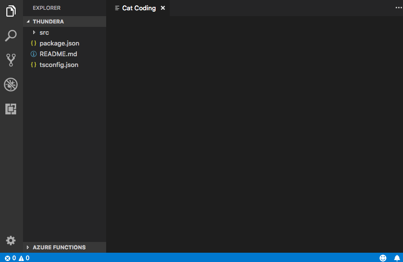

我们的命令打开了一个标题正确但没有任何内容的新 Webview 面板！要将我们的猫添加到新面板中，我们还需要使用 `webview.html` 设置 Webview 的 HTML 内容：

```ts
import * as vscode from 'vscode';

export function activate(context: vscode.ExtensionContext) {
  context.subscriptions.push(
    vscode.commands.registerCommand('catCoding.start', () => {
      // Create and show panel
      const panel = vscode.window.createWebviewPanel(
        'catCoding',
        'Cat Coding',
        vscode.ViewColumn.One,
        {}
      );

      // And set its HTML content
      panel.webview.html = getWebviewContent();
    })
  );
}

function getWebviewContent() {
  return `<!DOCTYPE html>
<html lang="en">
<head>
    <meta charset="UTF-8">
    <meta name="viewport" content="width=device-width, initial-scale=1.0">
    <title>Cat Coding</title>
</head>
<body>
    
</body>
</html>`;
}
```

如果你再次运行该命令，现在 Webview 看起来是这样的：

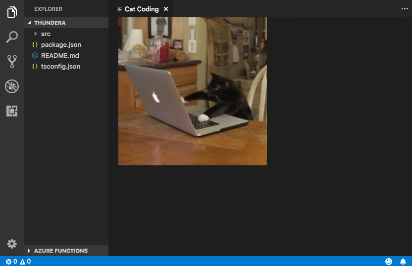

有进展了！

`webview.html` 应该始终是一个完整的 HTML 文档。HTML 片段或格式错误的 HTML 可能会导致意外行为。

### 更新 Webview 内容

`webview.html` 还可以在 Webview 创建后更新其内容。让我们利用这一点，通过引入猫咪轮换来使 **Cat Coding** 更加动态：

```ts
import * as vscode from 'vscode';

const cats = {
  'Coding Cat': 'https://media.giphy.com/media/JIX9t2j0ZTN9S/giphy.gif',
  'Compiling Cat': 'https://media.giphy.com/media/mlvseq9yvZhba/giphy.gif'
};

export function activate(context: vscode.ExtensionContext) {
  context.subscriptions.push(
    vscode.commands.registerCommand('catCoding.start', () => {
      const panel = vscode.window.createWebviewPanel(
        'catCoding',
        'Cat Coding',
        vscode.ViewColumn.One,
        {}
      );

      let iteration = 0;
      const updateWebview = () => {
        const cat = iteration++ % 2 ? 'Compiling Cat' : 'Coding Cat';
        panel.title = cat;
        panel.webview.html = getWebviewContent(cat);
      };

      // Set initial content
      updateWebview();

      // And schedule updates to the content every second
      setInterval(updateWebview, 1000);
    })
  );
}

function getWebviewContent(cat: keyof typeof cats) {
  return `<!DOCTYPE html>
<html lang="en">
<head>
    <meta charset="UTF-8">
    <meta name="viewport" content="width=device-width, initial-scale=1.0">
    <title>Cat Coding</title>
</head>
<body>
    
</body>
</html>`;
}
```

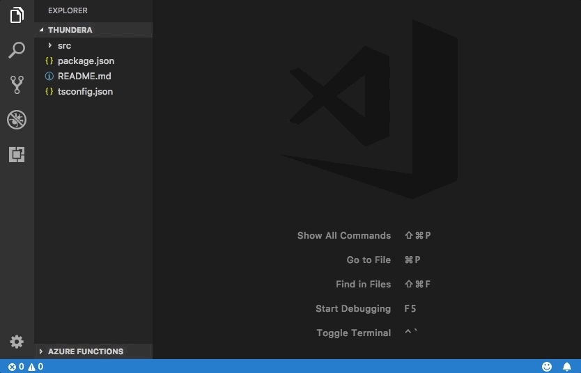

设置 `webview.html` 会替换整个 Webview 内容，类似于重新加载 iframe。这一点很重要，一旦你开始在 Webview 中使用脚本就要记住，因为设置 `webview.html` 也会重置脚本的状态。

上面的示例还使用了 `webview.title` 来更改编辑器中显示的文档标题。设置标题不会导致 Webview 重新加载。

### 生命周期

Webview 面板由创建它们的扩展所拥有。扩展必须持有从 `createWebviewPanel` 返回的 Webview 引用。如果你的扩展丢失了这个引用，它就无法再次访问该 Webview，即使该 Webview 会继续在 VS Code 中显示。

与文本编辑器一样，用户也可以随时关闭 Webview 面板。当 Webview 面板被用户关闭时，Webview 本身会被销毁。尝试使用已销毁的 Webview 会抛出异常。这意味着上面使用 `setInterval` 的示例实际上有一个重要的 Bug：如果用户关闭了面板，`setInterval` 将继续触发，试图更新 `panel.webview.html`，这当然会抛出异常。猫讨厌异常。让我们修复这个问题！

`onDidDispose` 事件在 Webview 被销毁时触发。我们可以使用此事件来取消后续更新并清理 Webview 的资源：

```ts
import * as vscode from 'vscode';

const cats = {
  'Coding Cat': 'https://media.giphy.com/media/JIX9t2j0ZTN9S/giphy.gif',
  'Compiling Cat': 'https://media.giphy.com/media/mlvseq9yvZhba/giphy.gif'
};

export function activate(context: vscode.ExtensionContext) {
  context.subscriptions.push(
    vscode.commands.registerCommand('catCoding.start', () => {
      const panel = vscode.window.createWebviewPanel(
        'catCoding',
        'Cat Coding',
        vscode.ViewColumn.One,
        {}
      );

      let iteration = 0;
      const updateWebview = () => {
        const cat = iteration++ % 2 ? 'Compiling Cat' : 'Coding Cat';
        panel.title = cat;
        panel.webview.html = getWebviewContent(cat);
      };

      updateWebview();
      const interval = setInterval(updateWebview, 1000);

      panel.onDidDispose(
        () => {
          // When the panel is closed, cancel any future updates to the webview content
          clearInterval(interval);
        },
        null,
        context.subscriptions
      );
    })
  );
}
```

扩展也可以通过调用 `dispose()` 以编程方式关闭 Webview。例如，如果我们想将猫的工作时间限制为五秒：

```ts
export function activate(context: vscode.ExtensionContext) {
  context.subscriptions.push(
    vscode.commands.registerCommand('catCoding.start', () => {
      const panel = vscode.window.createWebviewPanel(
        'catCoding',
        'Cat Coding',
        vscode.ViewColumn.One,
        {}
      );

      panel.webview.html = getWebviewContent('Coding Cat');

      // After 5sec, programmatically close the webview panel
      const timeout = setTimeout(() => panel.dispose(), 5000);

      panel.onDidDispose(
        () => {
          // Handle user closing panel before the 5sec have passed
          clearTimeout(timeout);
        },
        null,
        context.subscriptions
      );
    })
  );
}
```

### 可见性与移动

当 Webview 面板被移到后台标签页时，它会变为隐藏状态。但它并没有被销毁。当面板再次被带到前台时，VS Code 会自动从 `webview.html` 恢复 Webview 的内容：

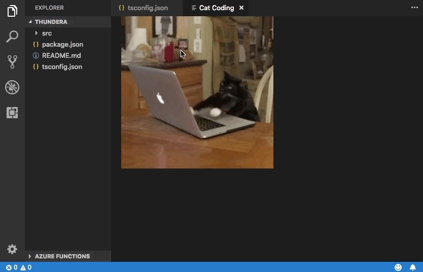

`.visible` 属性告诉你 Webview 面板当前是否可见。

扩展可以通过调用 `reveal()` 以编程方式将 Webview 面板带到前台。此方法接受一个可选的目标视图列来显示面板。一个 Webview 面板一次只能在一个编辑器列中显示。调用 `reveal()` 或将 Webview 面板拖动到新的编辑器列会将 Webview 移动到该新列。

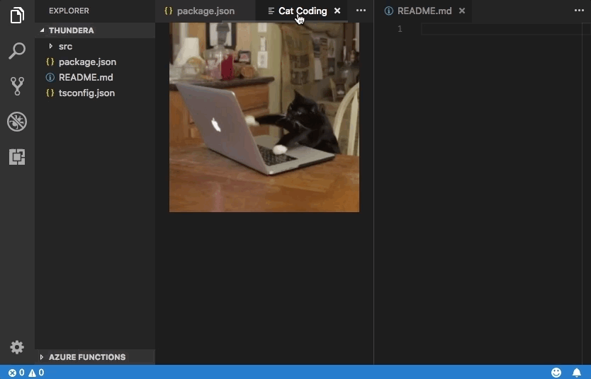

让我们更新扩展以同时只允许存在一个 Webview。如果面板在后台，`catCoding.start` 命令会将其带到前台：

```ts
export function activate(context: vscode.ExtensionContext) {
  // Track the current panel with a webview
  let currentPanel: vscode.WebviewPanel | undefined = undefined;

  context.subscriptions.push(
    vscode.commands.registerCommand('catCoding.start', () => {
      const columnToShowIn = vscode.window.activeTextEditor
        ? vscode.window.activeTextEditor.viewColumn
        : undefined;

      if (currentPanel) {
        // If we already have a panel, show it in the target column
        currentPanel.reveal(columnToShowIn);
      } else {
        // Otherwise, create a new panel
        currentPanel = vscode.window.createWebviewPanel(
          'catCoding',
          'Cat Coding',
          columnToShowIn || vscode.ViewColumn.One,
          {}
        );
        currentPanel.webview.html = getWebviewContent('Coding Cat');

        // Reset when the current panel is closed
        currentPanel.onDidDispose(
          () => {
            currentPanel = undefined;
          },
          null,
          context.subscriptions
        );
      }
    })
  );
}
```

以下是新扩展运行的效果：

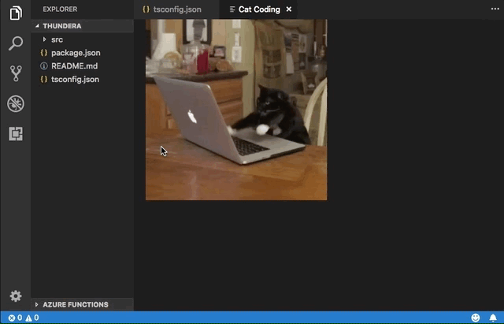

每当 Webview 的可见性发生变化，或 Webview 被移动到新列时，`onDidChangeViewState` 事件会被触发。我们的扩展可以使用此事件根据 Webview 显示的列来切换猫咪：

```ts
const cats = {
  'Coding Cat': 'https://media.giphy.com/media/JIX9t2j0ZTN9S/giphy.gif',
  'Compiling Cat': 'https://media.giphy.com/media/mlvseq9yvZhba/giphy.gif',
  'Testing Cat': 'https://media.giphy.com/media/3oriO0OEd9QIDdllqo/giphy.gif'
};

export function activate(context: vscode.ExtensionContext) {
  context.subscriptions.push(
    vscode.commands.registerCommand('catCoding.start', () => {
      const panel = vscode.window.createWebviewPanel(
        'catCoding',
        'Cat Coding',
        vscode.ViewColumn.One,
        {}
      );
      panel.webview.html = getWebviewContent('Coding Cat');

      // Update contents based on view state changes
      panel.onDidChangeViewState(
        e => {
          const panel = e.webviewPanel;
          switch (panel.viewColumn) {
            case vscode.ViewColumn.One:
              updateWebviewForCat(panel, 'Coding Cat');
              return;

            case vscode.ViewColumn.Two:
              updateWebviewForCat(panel, 'Compiling Cat');
              return;

            case vscode.ViewColumn.Three:
              updateWebviewForCat(panel, 'Testing Cat');
              return;
          }
        },
        null,
        context.subscriptions
      );
    })
  );
}

function updateWebviewForCat(panel: vscode.WebviewPanel, catName: keyof typeof cats) {
  panel.title = catName;
  panel.webview.html = getWebviewContent(catName);
}
```

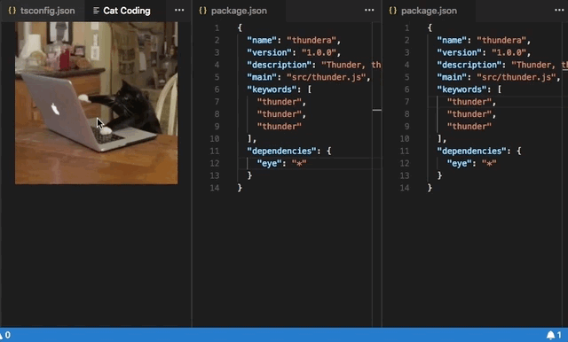

### 检查和调试 Webview

**Developer: Toggle Developer Tools** 命令会打开一个[开发者工具](https://developer.chrome.com/docs/devtools/)窗口，你可以用它来调试和检查 Webview。

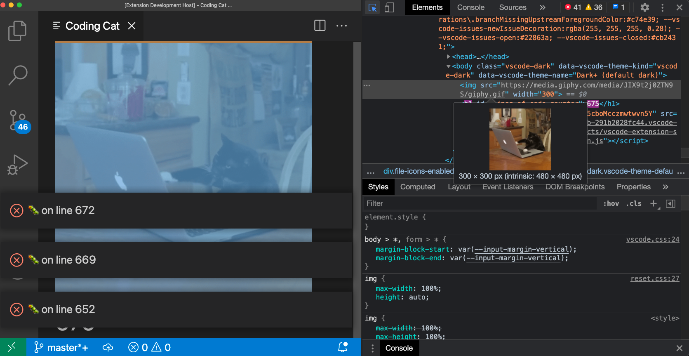

请注意，如果你使用的是早于 1.56 的 VS Code 版本，或者你尝试调试设置了 `enableFindWidget` 的 Webview，则必须改用 **Developer: Open Webview Developer Tools** 命令。此命令为每个 Webview 打开一个专用的开发者工具页面，而不是使用由所有 Webview 和编辑器本身共享的开发者工具页面。

从开发者工具中，你可以使用开发者工具窗口左上角的检查工具开始检查 Webview 的内容：

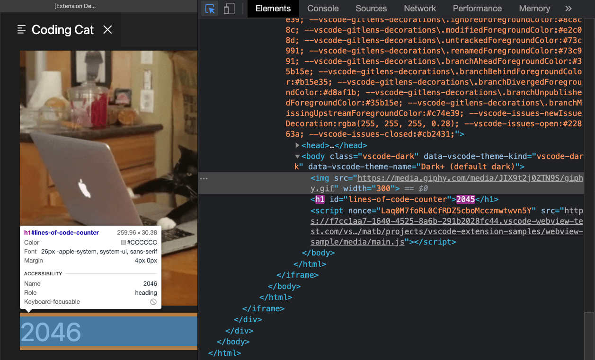

你还可以在开发者工具控制台中查看 Webview 的所有错误和日志：

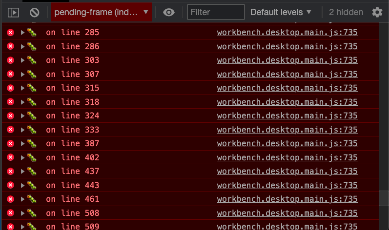

要在 Webview 的上下文中评估表达式，请确保从开发者工具控制台面板左上角的下拉菜单中选择 **active frame** 环境：

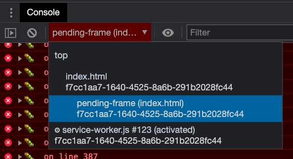

**active frame** 环境是 Webview 脚本自身执行的地方。

此外，**Developer: Reload Webview** 命令会重新加载所有活动的 Webview。如果你需要重置 Webview 的状态，或者磁盘上的某些 Webview 内容已更改而你希望加载新内容，这会很有帮助。

## 加载本地内容

Webview 运行在无法直接访问本地资源的隔离上下文中。这是出于安全考虑。这意味着为了从扩展加载图片、样式表和其他资源，或从用户当前的工作区加载任何内容，你必须使用 `Webview.asWebviewUri` 函数将本地 `file:` URI 转换为 VS Code 可用于加载一部分本地资源的特殊 URI。

假设我们想开始将猫的 GIF 打包到扩展中，而不是从 Giphy 拉取。为此，我们首先创建磁盘上文件的 URI，然后通过 `asWebviewUri` 函数传递这些 URI：

```ts
import * as vscode from 'vscode';

export function activate(context: vscode.ExtensionContext) {
  context.subscriptions.push(
    vscode.commands.registerCommand('catCoding.start', () => {
      const panel = vscode.window.createWebviewPanel(
        'catCoding',
        'Cat Coding',
        vscode.ViewColumn.One,
        {}
      );

      // Get path to resource on disk
      const onDiskPath = vscode.Uri.joinPath(context.extensionUri, 'media', 'cat.gif');

      // And get the special URI to use with the webview
      const catGifSrc = panel.webview.asWebviewUri(onDiskPath);

      panel.webview.html = getWebviewContent(catGifSrc);
    })
  );
}

function getWebviewContent(catGifSrc: vscode.Uri) {
  return `<!DOCTYPE html>
<html lang="en">
<head>
    <meta charset="UTF-8">
    <meta name="viewport" content="width=device-width, initial-scale=1.0">
    <title>Cat Coding</title>
</head>
<body>
    
</body>
</html>`;
}
```

如果我们调试这段代码，会看到 `catGifSrc` 的实际值类似于：

```
vscode-resource:/Users/toonces/projects/vscode-cat-coding/media/cat.gif
```

VS Code 能识别这个特殊 URI，并会使用它从磁盘加载我们的 GIF！

默认情况下，Webview 只能访问以下位置的资源：

- 扩展的安装目录内。
- 用户当前活动的工作区内。

使用 `WebviewOptions.localResourceRoots` 来允许访问额外的本地资源。

你也可以始终使用 data URI 将资源直接嵌入 Webview 中。

### 控制本地资源的访问

Webview 可以通过 `localResourceRoots` 选项控制从用户机器上加载哪些资源。`localResourceRoots` 定义了一组根 URI，可以从中加载本地内容。

我们可以使用 `localResourceRoots` 将 **Cat Coding** Webview 限制为仅加载扩展中 `media` 目录的资源：

```ts
import * as vscode from 'vscode';

export function activate(context: vscode.ExtensionContext) {
  context.subscriptions.push(
    vscode.commands.registerCommand('catCoding.start', () => {
      const panel = vscode.window.createWebviewPanel(
        'catCoding',
        'Cat Coding',
        vscode.ViewColumn.One,
        {
          // Only allow the webview to access resources in our extension's media directory
          localResourceRoots: [vscode.Uri.joinPath(context.extensionUri, 'media')]
        }
      );

      const onDiskPath = vscode.Uri.joinPath(context.extensionUri, 'media', 'cat.gif');
      const catGifSrc = panel.webview.asWebviewUri(onDiskPath);

      panel.webview.html = getWebviewContent(catGifSrc);
    })
  );
}
```

要禁止所有本地资源，只需将 `localResourceRoots` 设置为 `[]`。

通常，Webview 在加载本地资源时应尽可能严格。但请记住，`localResourceRoots` 本身并不提供完整的安全保护。请确保你的 Webview 也遵循[安全最佳实践](#安全性)，并添加[内容安全策略](#内容安全策略)以进一步限制可加载的内容。

### 为 Webview 内容设置主题

Webview 可以使用 CSS 根据 VS Code 的当前主题更改其外观。VS Code 将主题分为三类，并向 `body` 元素添加特殊类来指示当前主题：

- `vscode-light` - 浅色主题。
- `vscode-dark` - 深色主题。
- `vscode-high-contrast` - 高对比度主题。

以下 CSS 根据用户当前主题更改 Webview 的文本颜色：

```css
body.vscode-light {
  color: black;
}

body.vscode-dark {
  color: white;
}

body.vscode-high-contrast {
  color: red;
}
```

开发 Webview 应用时，请确保它适用于三种类型的主题。并始终在高对比度模式下测试你的 Webview，以确保视觉障碍人士可以使用。

Webview 还可以使用 [CSS 变量](https://developer.mozilla.org/docs/Web/CSS/Using_CSS_variables)访问 VS Code 主题颜色。这些变量名以 `vscode` 为前缀，并将 `.` 替换为 `-`。例如 `editor.foreground` 变为 `var(--vscode-editor-foreground)`：

```css
code {
  color: var(--vscode-editor-foreground);
}
```

请查阅[主题颜色参考](/vscode/extension/references/theme-color)了解可用的主题变量。有一个[扩展](https://marketplace.visualstudio.com/items?itemName=connor4312.css-theme-completions)可为这些变量提供 IntelliSense 建议。

还定义了以下与字体相关的变量：

- `--vscode-editor-font-family` - 编辑器字体系列（来自 `editor.fontFamily` 设置）。
- `--vscode-editor-font-weight` - 编辑器字体粗细（来自 `editor.fontWeight` 设置）。
- `--vscode-editor-font-size` - 编辑器字体大小（来自 `editor.fontSize` 设置）。

最后，在需要为单个主题编写 CSS 的特殊情况下，Webview 的 body 元素有一个名为 `vscode-theme-id` 的 data 属性，存储当前活动主题的 ID。这使你可以为 Webview 编写特定主题的 CSS：

```css
body[data-vscode-theme-id="One Dark Pro"] {
    background: hotpink;
}
```

### 支持的媒体格式

Webview 支持音频和视频，但并非所有媒体编解码器或媒体文件容器类型都受支持。

以下音频格式可用于 Webview：

- Wav
- Mp3
- Ogg
- Flac

以下视频格式可用于 Webview：

- H.264
- VP8

对于视频文件，请确保视频和音频轨道的媒体格式都受支持。例如，许多 `.mp4` 文件使用 `H.264` 作为视频和 `AAC` 作为音频。VS Code 能够播放 `mp4` 的视频部分，但由于不支持 `AAC` 音频，所以不会有声音。你需要改用 `mp3` 作为音频轨道。

### 上下文菜单

高级 Webview 可以自定义用户在 Webview 中右键单击时显示的上下文菜单。这通过[贡献点](/vscode/extension/references/contribution-points)实现，方式与 VS Code 的普通上下文菜单类似，因此自定义菜单能自然融入编辑器的其余部分。Webview 还可以为不同部分显示不同的自定义上下文菜单。

要向 Webview 添加新的上下文菜单项，首先在 `menus` 下的 `webview/context` 部分添加新条目。每个贡献包含一个 `command`（这也是菜单项标题的来源）和一个 `when` 子句。[when 子句](/vscode/extension/references/when-clause-contexts)应包含 `webviewId == 'YOUR_WEBVIEW_VIEW_TYPE'` 以确保上下文菜单仅应用于你的扩展的 Webview：

```json
"contributes": {
  "menus": {
    "webview/context": [
      {
        "command": "catCoding.yarn",
        "when": "webviewId == 'catCoding'"
      },
      {
        "command": "catCoding.insertLion",
        "when": "webviewId == 'catCoding' && webviewSection == 'editor'"
      }
    ]
  },
  "commands": [
    {
      "command": "catCoding.yarn",
      "title": "Yarn 🧶",
      "category": "Cat Coding"
    },
    {
      "command": "catCoding.insertLion",
      "title": "Insert 🦁",
      "category": "Cat Coding"
    },
    ...
  ]
}
```

在 Webview 内部，你还可以使用 `data-vscode-context` [data 属性](https://developer.mozilla.org/docs/Learn/HTML/Howto/Use_data_attributes)（或在 JavaScript 中使用 `dataset.vscodeContext`）为 HTML 的特定区域设置上下文。`data-vscode-context` 的值是一个 JSON 对象，指定用户右键单击该元素时要设置的上下文。最终上下文由从文档根到被点击元素的路径决定。

以此 HTML 为例：

```html
<div class="main" data-vscode-context='{"webviewSection": "main", "mouseCount": 4}'>
  <h1>Cat Coding</h1>

  <textarea data-vscode-context='{"webviewSection": "editor", "preventDefaultContextMenuItems": true}'></textarea>
</div>
```

如果用户右键单击 `textarea`，将设置以下上下文：

* `webviewSection == 'editor'` - 这覆盖了父元素的 `webviewSection`。
* `mouseCount == 4` - 这继承自父元素。
* `preventDefaultContextMenuItems == true` - 这是一个特殊上下文，用于隐藏 VS Code 通常添加到 Webview 上下文菜单中的复制和粘贴条目。

如果用户在 `<textarea>` 内右键单击，他们将看到：

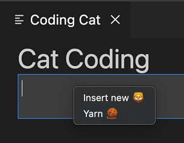

有时在左键/主键点击时显示菜单会很有用。例如，在拆分按钮上显示菜单。你可以通过在 `onClick` 事件中分发 `contextmenu` 事件来实现：

```html
<button data-vscode-context='{"preventDefaultContextMenuItems": true }' onClick='((e) => {
        e.preventDefault();
        e.target.dispatchEvent(new MouseEvent("contextmenu", { bubbles: true, clientX: e.clientX, clientY: e.clientY }));
        e.stopPropagation();
    })(event)'>Create</button>
```

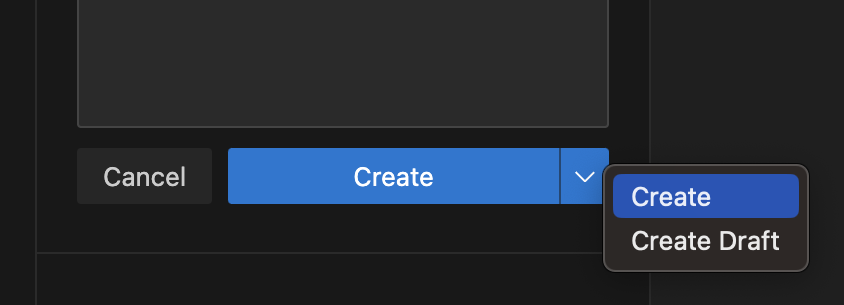


## 脚本与消息传递

Webview 就像 iframe 一样，也可以运行脚本。Webview 中默认禁用 JavaScript，但可以通过传入 `enableScripts: true` 选项轻松启用。

让我们使用脚本添加一个计数器来跟踪我们的猫写的源代码行数。运行基本脚本很简单，但请注意此示例仅用于演示目的。在实践中，你的 Webview 应始终使用[内容安全策略](#内容安全策略)禁用内联脚本：

```ts
import * as path from 'path';
import * as vscode from 'vscode';

export function activate(context: vscode.ExtensionContext) {
  context.subscriptions.push(
    vscode.commands.registerCommand('catCoding.start', () => {
      const panel = vscode.window.createWebviewPanel(
        'catCoding',
        'Cat Coding',
        vscode.ViewColumn.One,
        {
          // Enable scripts in the webview
          enableScripts: true
        }
      );

      panel.webview.html = getWebviewContent();
    })
  );
}

function getWebviewContent() {
  return `<!DOCTYPE html>
<html lang="en">
<head>
    <meta charset="UTF-8">
    <meta name="viewport" content="width=device-width, initial-scale=1.0">
    <title>Cat Coding</title>
</head>
<body>
    
    <h1 id="lines-of-code-counter">0</h1>

    <script>
        const counter = document.getElementById('lines-of-code-counter');

        let count = 0;
        setInterval(() => {
            counter.textContent = count++;
        }, 100);
    </script>
</body>
</html>`;
}
```

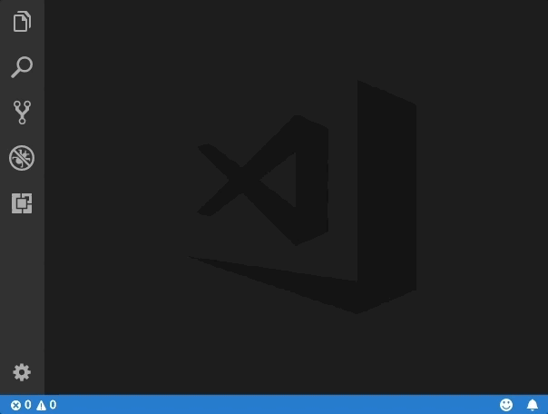

哇！这只猫可真高产。

Webview 脚本几乎可以做普通网页上脚本能做的任何事情。但请记住，Webview 存在于自己的上下文中，因此 Webview 中的脚本无法访问 VS Code API。这就是消息传递发挥作用的地方！

### 从扩展向 Webview 传递消息

扩展可以使用 `webview.postMessage()` 向其 Webview 发送数据。此方法将任何可 JSON 序列化的数据发送到 Webview。消息在 Webview 中通过标准的 `message` 事件接收。

为了演示这一点，让我们向 **Cat Coding** 添加一个新命令，指示当前正在编码的猫重构代码（从而减少总行数）。新的 `catCoding.doRefactor` 命令使用 `postMessage` 将指令发送到当前 Webview，并在 Webview 内部使用 `window.addEventListener('message', event => { ... })` 处理消息：

```ts
export function activate(context: vscode.ExtensionContext) {
  // Only allow a single Cat Coder
  let currentPanel: vscode.WebviewPanel | undefined = undefined;

  context.subscriptions.push(
    vscode.commands.registerCommand('catCoding.start', () => {
      if (currentPanel) {
        currentPanel.reveal(vscode.ViewColumn.One);
      } else {
        currentPanel = vscode.window.createWebviewPanel(
          'catCoding',
          'Cat Coding',
          vscode.ViewColumn.One,
          {
            enableScripts: true
          }
        );
        currentPanel.webview.html = getWebviewContent();
        currentPanel.onDidDispose(
          () => {
            currentPanel = undefined;
          },
          undefined,
          context.subscriptions
        );
      }
    })
  );

  // Our new command
  context.subscriptions.push(
    vscode.commands.registerCommand('catCoding.doRefactor', () => {
      if (!currentPanel) {
        return;
      }

      // Send a message to our webview.
      // You can send any JSON serializable data.
      currentPanel.webview.postMessage({ command: 'refactor' });
    })
  );
}

function getWebviewContent() {
  return `<!DOCTYPE html>
<html lang="en">
<head>
    <meta charset="UTF-8">
    <meta name="viewport" content="width=device-width, initial-scale=1.0">
    <title>Cat Coding</title>
</head>
<body>
    
    <h1 id="lines-of-code-counter">0</h1>

    <script>
        const counter = document.getElementById('lines-of-code-counter');

        let count = 0;
        setInterval(() => {
            counter.textContent = count++;
        }, 100);

        // Handle the message inside the webview
        window.addEventListener('message', event => {

            const message = event.data; // The JSON data our extension sent

            switch (message.command) {
                case 'refactor':
                    count = Math.ceil(count * 0.5);
                    counter.textContent = count;
                    break;
            }
        });
    </script>
</body>
</html>`;
}
```

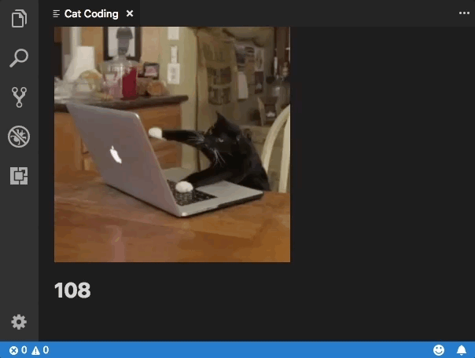

### 从 Webview 向扩展传递消息

Webview 也可以将消息传递回其扩展。这是通过 Webview 内部特殊 VS Code API 对象上的 `postMessage` 函数实现的。要访问 VS Code API 对象，请在 Webview 内部调用 `acquireVsCodeApi`。此函数每个会话只能调用一次。你必须保留此方法返回的 VS Code API 实例，并将其传递给需要使用它的任何其他函数。

我们可以在 **Cat Coding** Webview 中使用 VS Code API 和 `postMessage`，在猫的代码中引入 Bug 时向扩展发出警报：

```js
export function activate(context: vscode.ExtensionContext) {
  context.subscriptions.push(
    vscode.commands.registerCommand('catCoding.start', () => {
      const panel = vscode.window.createWebviewPanel(
        'catCoding',
        'Cat Coding',
        vscode.ViewColumn.One,
        {
          enableScripts: true
        }
      );

      panel.webview.html = getWebviewContent();

      // Handle messages from the webview
      panel.webview.onDidReceiveMessage(
        message => {
          switch (message.command) {
            case 'alert':
              vscode.window.showErrorMessage(message.text);
              return;
          }
        },
        undefined,
        context.subscriptions
      );
    })
  );
}

function getWebviewContent() {
  return `<!DOCTYPE html>
<html lang="en">
<head>
    <meta charset="UTF-8">
    <meta name="viewport" content="width=device-width, initial-scale=1.0">
    <title>Cat Coding</title>
</head>
<body>
    
    <h1 id="lines-of-code-counter">0</h1>

    <script>
        (function() {
            const vscode = acquireVsCodeApi();
            const counter = document.getElementById('lines-of-code-counter');

            let count = 0;
            setInterval(() => {
                counter.textContent = count++;

                // Alert the extension when our cat introduces a bug
                if (Math.random() < 0.001 * count) {
                    vscode.postMessage({
                        command: 'alert',
                        text: '🐛  on line ' + count
                    })
                }
            }, 100);
        }())
    </script>
</body>
</html>`;
}
```

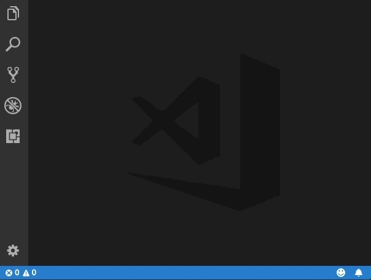

出于安全原因，你必须将 VS Code API 对象保持为私有，并确保它永远不会泄露到全局作用域。

### 使用 Web Workers

Webview 内部支持 [Web Workers](https://developer.mozilla.org/docs/Web/API/Web_Workers_API/Using_web_workers)，但有几个重要的限制需要注意。

首先，Worker 只能使用 `data:` 或 `blob:` URI 加载。你不能直接从扩展文件夹加载 Worker。

如果你确实需要从扩展中的 JavaScript 文件加载 Worker 代码，请尝试使用 `fetch`：

```js
const workerSource = 'absolute/path/to/worker.js';

fetch(workerSource)
  .then(result => result.blob())
  .then(blob => {
    const blobUrl = URL.createObjectURL(blob)
    new Worker(blobUrl);
  });
```

Worker 脚本也不支持使用 `importScripts` 或 `import(...)` 导入源代码。如果你的 Worker 需要动态加载代码，请尝试使用打包工具（如 [webpack](https://webpack.js.org)）将 Worker 脚本打包为单个文件。

使用 `webpack` 时，你可以使用 `LimitChunkCountPlugin` 强制将编译后的 Worker JavaScript 打包为单个文件：

```js
const path = require('path');
const webpack = require('webpack');

module.exports = {
  target: 'webworker',
  entry: './worker/src/index.js',
  output: {
    filename: 'worker.js',
    path: path.resolve(__dirname, 'media'),
  },
  plugins: [
    new webpack.optimize.LimitChunkCountPlugin({
      maxChunks: 1,
    }),
  ],
};
```

## 安全性

与任何网页一样，创建 Webview 时必须遵循一些基本的安全最佳实践。

### 限制能力

Webview 应仅具备其所需的最小能力集。例如，如果你的 Webview 不需要运行脚本，就不要设置 `enableScripts: true`。如果你的 Webview 不需要从用户的工作区加载资源，请将 `localResourceRoots` 设置为 `[vscode.Uri.file(extensionContext.extensionPath)]` 甚至 `[]` 以禁止访问所有本地资源。

### 内容安全策略

[内容安全策略](https://developers.google.com/web/fundamentals/security/csp/)进一步限制了 Webview 中可加载和执行的内容。例如，内容安全策略可以确保只有允许列表中的脚本可以在 Webview 中运行，甚至可以告诉 Webview 仅通过 `https` 加载图片。

要添加内容安全策略，在 Webview 的 `<head>` 顶部放置一个 `<meta http-equiv="Content-Security-Policy">` 指令

```ts
function getWebviewContent() {
  return `<!DOCTYPE html>
<html lang="en">
<head>
    <meta charset="UTF-8">

    <meta http-equiv="Content-Security-Policy" content="default-src 'none';">

    <meta name="viewport" content="width=device-width, initial-scale=1.0">

    <title>Cat Coding</title>
</head>
<body>
    ...
</body>
</html>`;
}
```

策略 `default-src 'none';` 禁止所有内容。然后我们可以重新启用扩展运行所需的最少量内容。以下是允许加载本地脚本和样式表，并通过 `https` 加载图片的内容安全策略：

```html
<meta
  http-equiv="Content-Security-Policy"
  content="default-src 'none'; img-src ${webview.cspSource} https:; script-src ${webview.cspSource}; style-src ${webview.cspSource};"
/>
```

`${webview.cspSource}` 值是来自 Webview 对象本身的值的占位符。有关如何使用此值的完整示例，请参阅 [Webview 示例](https://github.com/microsoft/vscode-extension-samples/blob/main/webview-sample)。

此内容安全策略还会隐式禁用内联脚本和样式。最佳实践是将所有内联样式和脚本提取到外部文件中，这样可以在不放宽内容安全策略的情况下正确加载它们。

### 仅通过 https 加载内容

如果你的 Webview 允许加载外部资源，强烈建议仅允许通过 `https` 加载这些资源，而不是通过 http。上面的示例内容安全策略已经通过仅允许通过 `https:` 加载图片来实现这一点。

### 清理所有用户输入

就像普通网页一样，在为 Webview 构建 HTML 时，你必须清理所有用户输入。未能正确清理输入可能导致内容注入，这可能会使你的用户面临安全风险。

必须清理的示例值：

- 文件内容。
- 文件和文件夹路径。
- 用户和工作区设置。

考虑使用辅助库来构建 HTML 字符串，或至少确保用户工作区中的所有内容都经过正确清理。

永远不要仅依赖清理来保证安全。请确保遵循其他安全最佳实践，例如使用[内容安全策略](#内容安全策略)来最大程度地减少潜在内容注入的影响。

## 持久化

在标准的 Webview [生命周期](#生命周期)中，Webview 由 `createWebviewPanel` 创建，在用户关闭它们或调用 `.dispose()` 时被销毁。然而，Webview 的内容在 Webview 变为可见时创建，在 Webview 被移到后台时销毁。当 Webview 被移到后台标签页时，Webview 内的任何状态都会丢失。

解决此问题的最佳方法是使 Webview 无状态。使用[消息传递](#从-webview-向扩展传递消息)来保存 Webview 的状态，然后在 Webview 再次变为可见时恢复状态。

### getState 和 setState

Webview 内运行的脚本可以使用 `getState` 和 `setState` 方法来保存和恢复可 JSON 序列化的状态对象。即使 Webview 面板隐藏导致 Webview 内容本身被销毁后，此状态仍然会持久化。状态在 Webview 面板被销毁时才会被销毁。

```js
// Inside a webview script
const vscode = acquireVsCodeApi();

const counter = document.getElementById('lines-of-code-counter');

// Check if we have an old state to restore from
const previousState = vscode.getState();
let count = previousState ? previousState.count : 0;
counter.textContent = count;

setInterval(() => {
  counter.textContent = count++;
  // Update the saved state
  vscode.setState({ count });
}, 100);
```

`getState` 和 `setState` 是持久化状态的首选方式，因为它们的性能开销比 `retainContextWhenHidden` 低得多。

### 序列化

通过实现 `WebviewPanelSerializer`，你的 Webview 可以在 VS Code 重启时自动恢复。序列化建立在 `getState` 和 `setState` 之上，只有在你的扩展为 Webview 注册了 `WebviewPanelSerializer` 时才启用。

为了让我们的编程猫在 VS Code 重启后仍然存在，首先在扩展的 `package.json` 中添加 `onWebviewPanel` 激活事件：

```json
"activationEvents": [
    ...,
    "onWebviewPanel:catCoding"
]
```

此激活事件确保每当 VS Code 需要恢复 viewType 为 `catCoding` 的 Webview 时，我们的扩展都会被激活。

然后，在扩展的 `activate` 方法中，调用 `registerWebviewPanelSerializer` 注册一个新的 `WebviewPanelSerializer`。`WebviewPanelSerializer` 负责从其持久化状态恢复 Webview 的内容。此状态是 Webview 内容使用 `setState` 设置的 JSON 数据。

```ts
export function activate(context: vscode.ExtensionContext) {
  // Normal setup...

  // And make sure we register a serializer for our webview type
  vscode.window.registerWebviewPanelSerializer('catCoding', new CatCodingSerializer());
}

class CatCodingSerializer implements vscode.WebviewPanelSerializer {
  async deserializeWebviewPanel(webviewPanel: vscode.WebviewPanel, state: any) {
    // `state` is the state persisted using `setState` inside the webview
    console.log(`Got state: ${state}`);

    // Restore the content of our webview.
    //
    // Make sure we hold on to the `webviewPanel` passed in here and
    // also restore any event listeners we need on it.
    webviewPanel.webview.html = getWebviewContent();
  }
}
```

现在，如果你在打开了猫编程面板的情况下重启 VS Code，面板将在相同的编辑器位置自动恢复。

### retainContextWhenHidden

对于具有非常复杂的 UI 或状态的 Webview，如果无法快速保存和恢复，你可以改用 `retainContextWhenHidden` 选项。此选项使 Webview 在隐藏状态下仍保留其内容，即使 Webview 本身不再在前台。

虽然 **Cat Coding** 很难说有复杂的状态，但让我们尝试启用 `retainContextWhenHidden` 来看看该选项如何改变 Webview 的行为：

```ts
import * as vscode from 'vscode';

export function activate(context: vscode.ExtensionContext) {
  context.subscriptions.push(
    vscode.commands.registerCommand('catCoding.start', () => {
      const panel = vscode.window.createWebviewPanel(
        'catCoding',
        'Cat Coding',
        vscode.ViewColumn.One,
        {
          enableScripts: true,
          retainContextWhenHidden: true
        }
      );
      panel.webview.html = getWebviewContent();
    })
  );
}

function getWebviewContent() {
  return `<!DOCTYPE html>
<html lang="en">
<head>
    <meta charset="UTF-8">
    <meta name="viewport" content="width=device-width, initial-scale=1.0">
    <title>Cat Coding</title>
</head>
<body>
    
    <h1 id="lines-of-code-counter">0</h1>

    <script>
        const counter = document.getElementById('lines-of-code-counter');

        let count = 0;
        setInterval(() => {
            counter.textContent = count++;
        }, 100);
    </script>
</body>
</html>`;
}
```

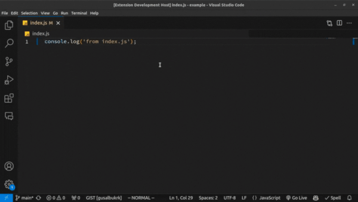

注意现在当 Webview 被隐藏然后恢复时，计数器不会重置。不需要额外代码！使用 `retainContextWhenHidden` 时，Webview 的行为类似于 Web 浏览器中的后台标签页。脚本和其他动态内容即使在标签页不活动或不可见时也会继续运行。当启用 `retainContextWhenHidden` 时，你还可以向隐藏的 Webview 发送消息。

虽然 `retainContextWhenHidden` 可能很有吸引力，但请记住它有很高的内存开销，应仅在其他持久化技术不适用时才使用。

## 无障碍访问

当用户使用屏幕阅读器操作 VS Code 时，`vscode-using-screen-reader` 类会被添加到 Webview 的主体中。此外，当用户表达希望减少窗口中动画的偏好时，`vscode-reduce-motion` 类会被添加到文档的主体元素中。通过观察这些类并相应地调整渲染，你的 Webview 内容可以更好地反映用户的偏好。

## 下一步

如果你想了解更多关于 VS Code 可扩展性的内容，可以尝试以下主题：

- [Extension API](/vscode/extension/) - 了解完整的 VS Code Extension API。
- [扩展能力](/vscode/extension/extension-capabilities/overview) - 了解扩展 VS Code 的其他方式。
