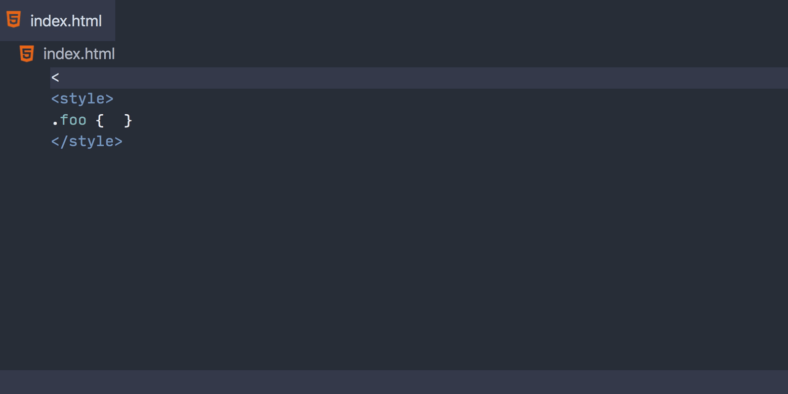

# 嵌入式编程语言

Visual Studio Code 为编程语言提供丰富的语言功能。正如你在
[Language Server 扩展指南](/vscode/extension/language-extensions/language-server-extension-guide)中所读到的，你可以编写 Language Server 来支持任何编程语言。然而，为嵌入式语言启用此类支持需要更多的努力。

如今，嵌入式语言越来越多，例如：

- HTML 中的 JavaScript 和 CSS
- JavaScript 中的 JSX
- 模板语言中的插值，例如 Vue、Handlebars 和 Razor
- PHP 中的 HTML

本指南重点介绍为嵌入式语言实现语言功能。如果你对为嵌入式语言提供语法高亮感兴趣，可以在[语法高亮指南](/vscode/extension/language-extensions/syntax-highlight-guide#embedded-languages)中找到相关信息。

本指南包含两个示例，说明了构建此类 Language Server 的两种方法：**语言服务**和**请求转发**。我们将回顾这两个示例，并总结每种方法的优缺点。

两个示例的源代码可在以下地址找到：

- [使用语言服务的嵌入式语言 Language Server](https://github.com/microsoft/vscode-extension-samples/tree/main/lsp-embedded-language-service)
- [使用请求转发的嵌入式语言 Language Server](https://github.com/microsoft/vscode-extension-samples/tree/main/lsp-embedded-request-forwarding)

以下是我们将要构建的嵌入式语言服务器：



两个示例都贡献了一种新语言 `html1`，用于演示目的。你可以创建一个 `.html1` 文件并测试以下功能：

- HTML 标签的补全
- `<style>` 标签中 CSS 的补全
- CSS 的诊断（仅在语言服务示例中）

## 语言服务

**语言服务**是一个为单一语言实现[编程式语言功能](/vscode/extension/language-extensions/programmatic-language-features)的库。**Language Server** 可以嵌入语言服务来处理嵌入式语言。

以下是 VS Code HTML 支持的概览：

- 内置的 [html 扩展](https://github.com/microsoft/vscode/tree/main/extensions/html)仅为 HTML 提供语法高亮和语言配置。
- 内置的 [html-language-features 扩展](https://github.com/microsoft/vscode/tree/main/extensions/html-language-features)包含一个 HTML Language Server，为 HTML 提供编程式语言功能。
- HTML Language Server 使用 [vscode-html-languageservice](https://github.com/microsoft/vscode-html-languageservice) 来支持 HTML。
- CSS Language Server 使用 [vscode-css-languageservice](https://github.com/microsoft/vscode-css-languageservice) 来支持 HTML 中的 CSS。

HTML Language Server 分析 HTML 文档，将其拆分为语言区域，并使用相应的语言服务来处理 Language Server 请求。

例如：

- 对于 `<|` 处的自动补全请求，HTML Language Server 使用 HTML 语言服务提供 HTML 补全。
- 对于 `<style>.foo { | }</style>` 处的自动补全请求，HTML Language Server 使用 CSS 语言服务提供 CSS 补全。

让我们看看 [lsp-embedded-language-service](https://github.com/microsoft/vscode-extension-samples/tree/main/lsp-embedded-language-service) 示例，这是一个简化版的 HTML Language Server，实现了 HTML 和 CSS 的自动补全以及 CSS 的诊断错误。

### 语言服务示例

>**注意**：本示例假定你已经了解[编程式语言功能主题](/vscode/extension/language-extensions/programmatic-language-features)和 [Language Server 扩展指南](/vscode/extension/language-extensions/language-server-extension-guide)。代码基于 [lsp-sample](https://github.com/microsoft/vscode-extension-samples/tree/main/lsp-sample) 构建。

源代码可在 [microsoft/vscode-extension-samples](https://github.com/microsoft/vscode-extension-samples/tree/main/lsp-embedded-language-service) 获取。

与 [lsp-sample](https://github.com/microsoft/vscode-extension-samples/tree/main/lsp-sample) 相比，Client 端代码是相同的。

如上所述，Server 将文档拆分为不同的语言区域来处理嵌入式内容。

以下是一个简单的示例：

```html
<div></div>
<style>.foo { }</style>
```

在这种情况下，Server 检测到 `<style>` 标签，并将 `.foo { }` 标记为 CSS 区域。

给定特定位置的自动补全请求，Server 使用以下逻辑计算响应：

- 如果位置落在某个区域内
  - 使用该区域语言的虚拟文档处理，同时将所有其他区域替换为空白
- 如果位置不在任何区域内
  - 使用 HTML 的虚拟文档处理，同时将所有区域替换为空白

例如，当在以下位置进行自动补全时：

```html
<div></div>
<style>.foo { | }</style>
```

Server 确定该位置在区域内部，并计算一个虚拟 CSS 文档，内容如下（█ 代表空格）：

```css
███████████
███████.foo { | }████████
```

然后 Server 使用 `vscode-css-languageservice` 分析此文档并计算补全项列表。由于内容现在不包含 HTML，CSS 语言服务可以正常处理它。通过将所有非 CSS 内容替换为空白，我们无需手动偏移位置。

处理补全请求的 Server 代码：

```ts
connection.onCompletion(async (textDocumentPosition, token) => {
  const document = documents.get(textDocumentPosition.textDocument.uri);
  if (!document) {
    return null;
  }

  const mode = languageModes.getModeAtPosition(document, textDocumentPosition.position);
  if (!mode || !mode.doComplete) {
    return CompletionList.create();
  }
  const doComplete = mode.doComplete!;

  return doComplete(document, textDocumentPosition.position);
});
```

负责处理落入 CSS 区域的所有 Language Server 请求的 CSS 模式：

```ts
export function getCSSMode(
  cssLanguageService: CSSLanguageService,
  documentRegions: LanguageModelCache<HTMLDocumentRegions>
): LanguageMode {
  return {
    getId() { return 'css' },
    doComplete(document: TextDocument, position: Position) {
      // Get virtual CSS document, with all non-CSS code replaced with whitespace
      const embedded = documentRegions.get(document).getEmbeddedDocument('css')
      // Compute a response with vscode-css-languageservice
      const stylesheet = cssLanguageService.parseStylesheet(embedded)
      return cssLanguageService.doComplete(embedded, position, stylesheet)
    }
  }
}
```

这是处理嵌入式语言的一种简单而有效的方法。然而，这种方法有一些缺点：

- 你必须持续更新 Language Server 所依赖的语言服务。
- 包含与 Language Server 使用不同语言编写的语言服务可能会很困难。例如，用 PHP 编写的 PHP Language Server 会发现包含用 TypeScript 编写的 `vscode-css-languageservice` 很麻烦。

接下来我们将介绍**请求转发**，它可以解决上述问题。

## 请求转发

简而言之，请求转发的工作方式与语言服务类似。请求转发方法也接收 Language Server 请求，计算虚拟内容，并计算响应。

主要区别在于：

- 语言服务方法使用库来计算 Language Server 响应，而请求转发将请求发送回 VS Code，使用已激活且为嵌入式语言注册了补全提供者的扩展。

再次看这个简单示例：

```html
<div></div>
<style>.foo { | }</style>
```

自动补全的工作方式如下：

- Language Client 使用 `workspace.registerTextDocumentContentProvider` 为 `embedded-content` 文档注册虚拟文本文档提供者。
- Language Client 拦截 `<FILE_URI>` 的补全请求。
- Language Client 确定请求位置落在 CSS 区域内。
- Language Client 构造一个新的 URI，例如 `embedded-content://css/<FILE_URI>.css`。
- Language Client 然后调用 `commands.executeCommand('vscode.executeCompletionItemProvider', ...)`
  - VS Code 的 CSS Language Server 响应此提供者请求。
  - 虚拟文本文档提供者为 CSS Language Server 提供虚拟内容，其中所有非 CSS 代码被替换为空白。
  - Language Client 从 VS Code 接收响应并将其作为响应发送。

通过这种方法，即使我们的代码不包含任何理解 CSS 的库，我们也能计算 CSS 自动补全。当 VS Code 更新其 CSS Language Server 时，我们可以获得最新的 CSS 语言支持而无需更新代码。

现在让我们回顾示例代码。

### 请求转发示例

>**注意**：本示例假定你已经了解[编程式语言功能主题](/vscode/extension/language-extensions/programmatic-language-features)和 [Language Server 扩展指南](/vscode/extension/language-extensions/language-server-extension-guide)。代码基于 [lsp-sample](https://github.com/microsoft/vscode-extension-samples/tree/main/lsp-sample) 构建。

源代码可在 [microsoft/vscode-extension-samples](https://github.com/microsoft/vscode-extension-samples/tree/main/lsp-embedded-request-forwarding) 获取。

维护文档 URI 与其虚拟文档之间的映射，并为相应请求提供它们：

```ts
const virtualDocumentContents = new Map<string, string>()

workspace.registerTextDocumentContentProvider('embedded-content', {
  provideTextDocumentContent: uri => {
    // Remove leading `/` and ending `.css` to get original URI
    const originalUri = uri.path.slice(1).slice(0, -4);
    const decodedUri = decodeURIComponent(originalUri);
    return virtualDocumentContents.get(decodedUri);
  }
})
```

通过使用 Language Client 的 `middleware` 选项，我们拦截自动补全请求：

```ts
let clientOptions: LanguageClientOptions = {
  documentSelector: [{ scheme: 'file', language: 'html' }],
  middleware: {
    provideCompletionItem: async (document, position, context, token, next) => {
      // If not in `<style>`, do not perform request forwarding
      if (!isInsideStyleRegion(htmlLanguageService, document.getText(), document.offsetAt(position))) {
        return await next(document, position, context, token);
      }

      const originalUri = document.uri.toString(true);
      virtualDocumentContents.set(originalUri, getCSSVirtualContent(htmlLanguageService, document.getText()));

      const vdocUriString = `embedded-content://css/${encodeURIComponent(
        originalUri
      )}.css`;
      const vdocUri = Uri.parse(vdocUriString);
      return await commands.executeCommand<CompletionList>(
        'vscode.executeCompletionItemProvider',
        vdocUri,
        position,
        context.triggerCharacter
      );
    }
  }
}
```

## 潜在问题

在实现嵌入式 Language Server 时，我们遇到了许多问题。虽然我们还没有完美的解决方案，但我们想提前提醒你，因为你很可能也会遇到这些问题。

### 语言功能实现困难

通常，跨语言区域边界的语言功能更难实现。例如，自动补全或悬停内容比较容易实现，因为你可以检测嵌入式内容的语言并基于嵌入式内容计算响应。然而，格式化或重命名等语言功能可能需要特殊处理。在格式化的情况下，你需要处理单个文档中多个区域的缩进和格式化器设置。对于重命名，使其在不同文档的不同区域之间工作可能具有挑战性。

### 语言服务可能是有状态的且难以嵌入

VS Code 的 HTML 支持提供 HTML、CSS 和 JavaScript 语言功能。虽然 HTML 和 CSS 语言服务是无状态的，但驱动 JavaScript 语言功能的 TypeScript 服务器是有状态的。我们只在 HTML 文档中提供基本的 JavaScript 支持，因为很难将项目的状态告知 TypeScript。例如，如果你包含一个指向 CDN 上托管的 `lodash` 库的 `<script>` 标签，你将不会在 `<script>` 标签内获得 `_.` 补全。

### 编码和解码

文档的主语言可能与其嵌入式语言有不同的编码或转义规则。例如，根据 [HTML 规范](https://www.w3.org/TR/html401/appendix/notes.html#h-B.3.2)，以下 HTML 文档是无效的：

```html
<SCRIPT type="text/javascript">
  document.write ("<EM>This won't work</EM>")
</SCRIPT>
```

在这种情况下，如果嵌入式 JavaScript 的 Language Server 返回包含 `</` 的结果，应将其转义为 `<\/`。

## 结论

两种方法各有优缺点。

语言服务：

- \+ 完全控制 Language Server 和用户体验。
- \+ 不依赖其他 Language Server。所有代码在一个仓库中。
- \+ Language Server 可以在所有[兼容 LSP 的代码编辑器](https://microsoft.github.io/language-server-protocol/implementors/tools/)中复用。
- \- 嵌入用其他语言编写的语言服务可能很困难。
- \- 需要持续维护以获取语言服务依赖项的新功能。

请求转发：

- \+ 避免嵌入与 Language Server 使用不同语言编写的语言服务的问题（例如，在 Razor Language Server 中嵌入 C# 编译器以支持 C#）。
- \+ 无需维护即可从其他语言服务获取上游新功能。
- \- 不适用于诊断错误。VS Code API 不支持可以"拉取"（请求）诊断的诊断提供者。
- \- 由于缺乏控制，难以与其他 Language Server 共享状态。
- \- 跨语言功能可能难以实现（例如，当 `<div class="foo">` 存在时为 `.foo` 提供 CSS 补全）。

总体而言，我们建议通过嵌入语言服务来构建 Language Server，因为这种方法使你对用户体验有更多控制，并且服务器可以复用于任何兼容 LSP 的编辑器。但是，如果你有一个简单的用例，其中嵌入式内容可以在没有上下文或 Language Server 状态的情况下轻松处理，或者打包 Node.js 库对你来说是一个问题，那么你可以考虑请求转发方法。
