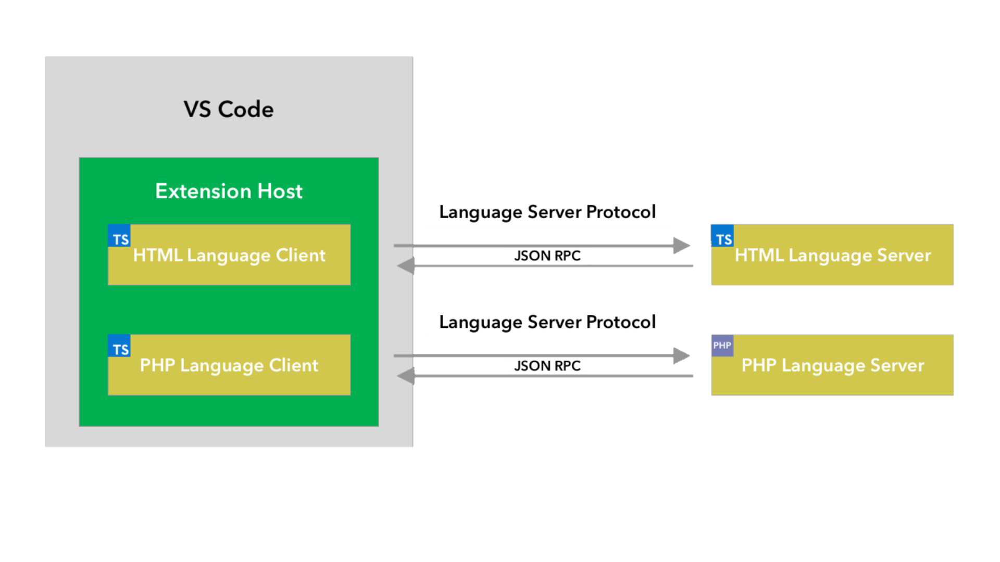
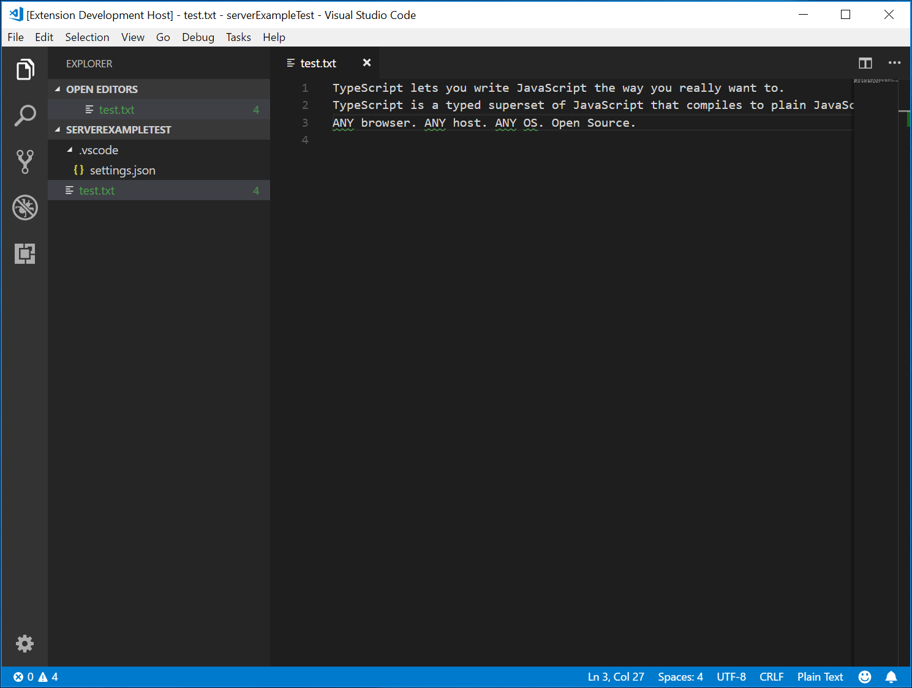
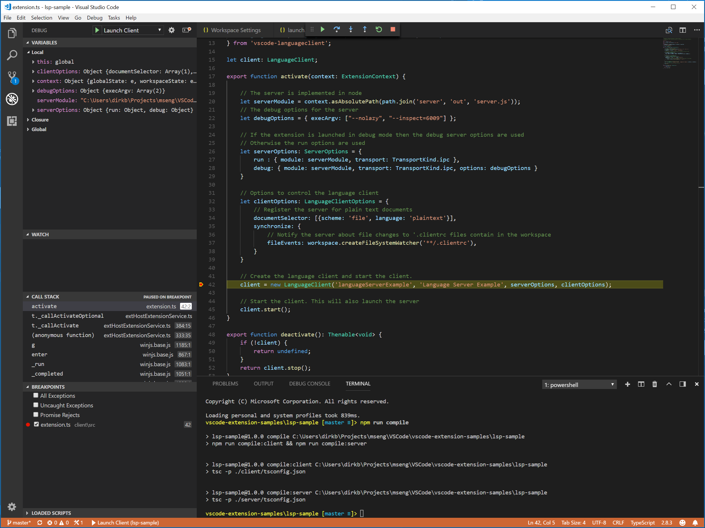
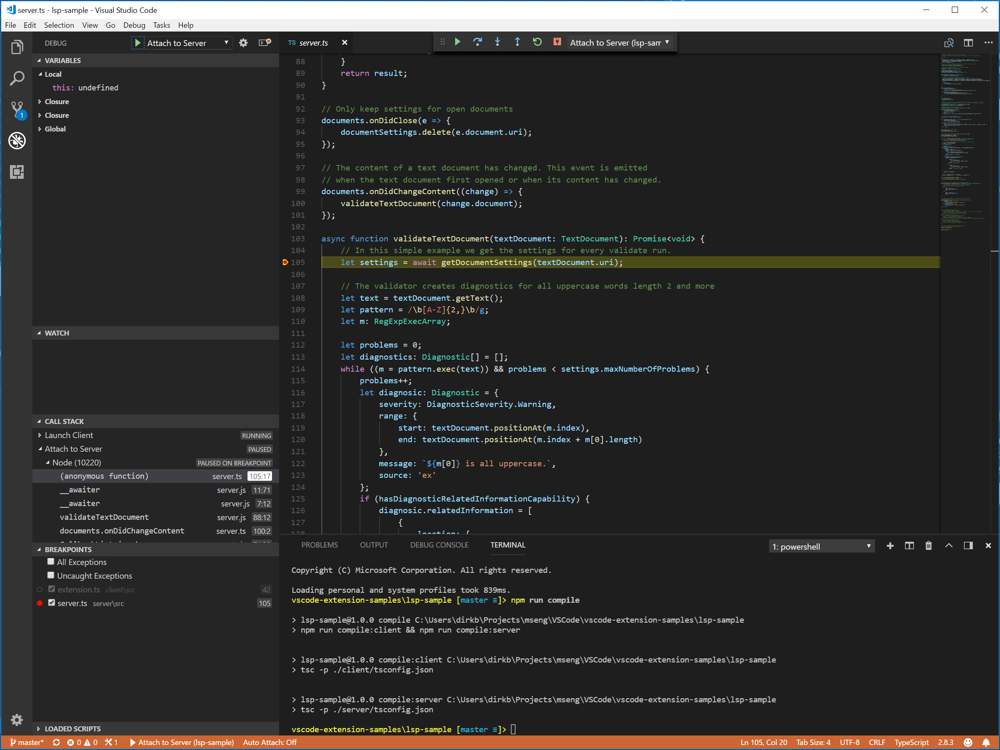
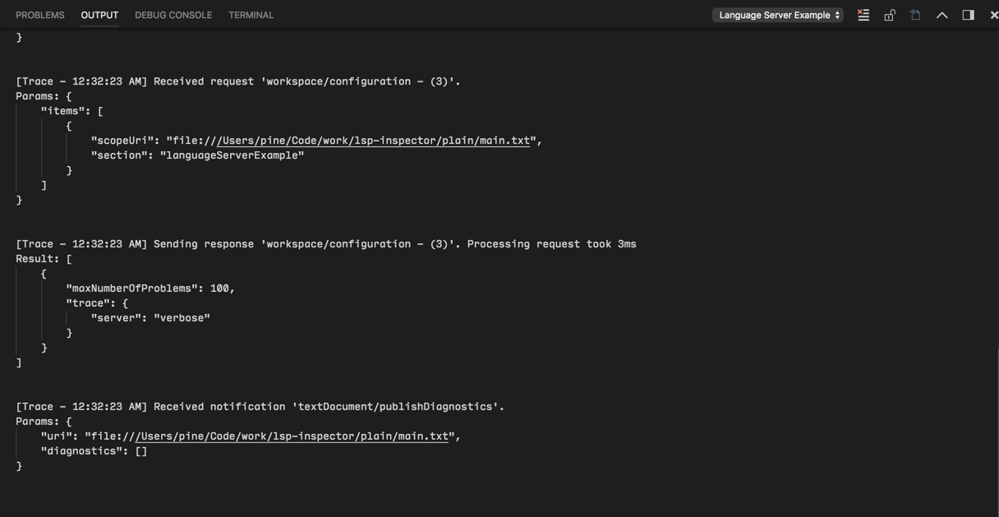
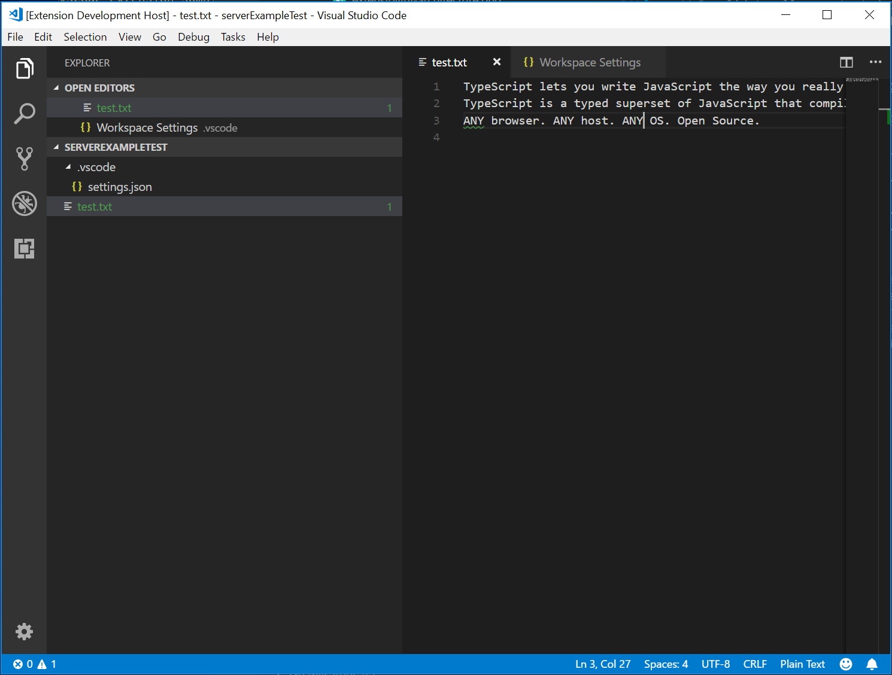
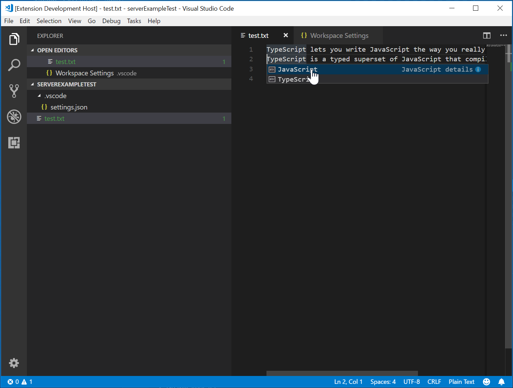

# Language Server 扩展指南

正如你在[编程式语言功能](/vscode/extension/language-extensions/programmatic-language-features)主题中所见，可以直接使用 `languages.*` API 来实现语言功能。而 Language Server 扩展提供了一种替代方式来实现此类语言支持。

本主题：

- 解释了 Language Server 扩展的优势。
- 引导你使用 [`Microsoft/vscode-languageserver-node`](https://github.com/microsoft/vscode-languageserver-node) 库构建 Language Server。你也可以直接跳转到 [lsp-sample](https://github.com/microsoft/vscode-extension-samples/tree/main/lsp-sample) 中的代码。

## 为什么需要 Language Server？

Language Server 是一种特殊的 Visual Studio Code 扩展，为许多编程语言提供编辑体验。通过 Language Server，你可以实现自动补全、错误检查（诊断）、跳转到定义以及 VS Code 支持的许多其他[语言功能](/vscode/extension/language-extensions/programmatic-language-features)。

然而，在 VS Code 中实现语言功能支持时，我们发现了三个常见问题：

首先，Language Server 通常以其原生编程语言实现，这在将其与具有 Node.js 运行时的 VS Code 集成时带来了挑战。

此外，语言功能可能会消耗大量资源。例如，为了正确验证文件，Language Server 需要解析大量文件、为它们构建抽象语法树并执行静态程序分析。这些操作可能导致显著的 CPU 和内存使用，我们需要确保 VS Code 的性能不受影响。

最后，将多种语言工具与多种代码编辑器集成可能需要大量工作。从语言工具的角度来看，它们需要适应具有不同 API 的代码编辑器。从代码编辑器的角度来看，它们无法期望语言工具提供统一的 API。这使得在 `N` 个代码编辑器中实现 `M` 种语言支持的工作量变为 `M * N`。

为了解决这些问题，Microsoft 制定了 [Language Server Protocol](https://microsoft.github.io/language-server-protocol)，标准化了语言工具和代码编辑器之间的通信。这样，Language Server 可以用任何语言实现，并在自己的进程中运行以避免性能开销，因为它们通过 Language Server Protocol 与代码编辑器通信。此外，任何兼容 LSP 的语言工具都可以与多个兼容 LSP 的代码编辑器集成，任何兼容 LSP 的代码编辑器都可以轻松接入多个兼容 LSP 的语言工具。LSP 对语言工具提供者和代码编辑器供应商来说是双赢！


在本指南中，我们将：

- 解释如何使用提供的 [Node SDK](https://github.com/microsoft/vscode-languageserver-node) 在 VS Code 中构建 Language Server 扩展。
- 解释如何运行、调试、记录日志和测试 Language Server 扩展。
- 为你提供一些关于 Language Server 的高级主题链接。

## 实现 Language Server

### 概述

在 VS Code 中，一个 Language Server 由两部分组成：

- Language Client：一个用 JavaScript / TypeScript 编写的常规 VS Code 扩展。此扩展可以访问所有 [VS Code Namespace API](/vscode/extension/references/vscode-api)。
- Language Server：在独立进程中运行的语言分析工具。

如上简要说明，在独立进程中运行 Language Server 有两个好处：

- 分析工具可以用任何语言实现，只要它能按照 Language Server Protocol 与 Language Client 通信即可。
- 由于语言分析工具通常对 CPU 和内存使用量较大，在独立进程中运行可以避免性能开销。

下图展示了 VS Code 运行两个 Language Server 扩展的情况。HTML Language Client 和 PHP Language Client 是用 TypeScript 编写的常规 VS Code 扩展。它们各自实例化相应的 Language Server 并通过 LSP 与之通信。虽然 PHP Language Server 是用 PHP 编写的，但它仍然可以通过 LSP 与 PHP Language Client 通信。



本指南将教你如何使用我们的 [Node SDK](https://github.com/microsoft/vscode-languageserver-node) 构建 Language Client / Server。以下文档假定你熟悉 VS Code [Extension API](/vscode/extension/)。

### LSP 示例 - 一个用于纯文本文件的简单 Language Server

让我们构建一个简单的 Language Server 扩展，为纯文本文件实现自动补全和诊断。我们还将涵盖 Client / Server 之间的配置同步。

如果你更想直接查看代码：

- **[lsp-sample](https://github.com/microsoft/vscode-extension-samples/tree/main/lsp-sample)**：本指南的详细注释源代码。
- **[lsp-multi-server-sample](https://github.com/microsoft/vscode-extension-samples/tree/main/lsp-multi-server-sample)**：**lsp-sample** 的详细注释高级版本，每个工作区文件夹启动不同的服务器实例以支持 VS Code 的[多根工作区](/docs/editor/multi-root-workspaces)功能。

克隆 [Microsoft/vscode-extension-samples](https://github.com/microsoft/vscode-extension-samples) 仓库并打开示例：

```bash
> git clone https://github.com/microsoft/vscode-extension-samples.git
> cd vscode-extension-samples/lsp-sample
> npm install
> npm run compile
> code .
```

上述命令安装所有依赖并打开包含客户端和服务器代码的 **lsp-sample** 工作区。以下是 **lsp-sample** 结构的概览：

```
.
├── client // Language Client
│   ├── src
│   │   ├── test // End to End tests for Language Client / Server
│   │   └── extension.ts // Language Client entry point
├── package.json // The extension manifest
└── server // Language Server
    └── src
        └── server.ts // Language Server entry point
```

### 解析 "Language Client"

让我们先看看 `/package.json`，它描述了 Language Client 的功能。有两个值得关注的部分：

首先是 [`configuration`](/vscode/extension/references/contribution-points#contributes.configuration) 部分：

```json
"configuration": {
    "type": "object",
    "title": "Example configuration",
    "properties": {
        "languageServerExample.maxNumberOfProblems": {
            "scope": "resource",
            "type": "number",
            "default": 100,
            "description": "Controls the maximum number of problems produced by the server."
        }
    }
}
```

此部分向 VS Code 贡献 `configuration` 设置。示例将解释这些设置如何在启动时以及每次设置更改时发送到 Language Server。

> **注意**：如果你的扩展兼容 1.74.0 之前的 VS Code 版本，你必须在 `/package.json` 的 [`activationEvents`](/vscode/extension/references/activation-events) 字段中声明 `onLanguage:plaintext`，以告诉 VS Code 在打开纯文本文件（例如扩展名为 `.txt` 的文件）时立即激活扩展：
> ```json
> "activationEvents": []
> ```

实际的 Language Client 源代码和相应的 `package.json` 在 `/client` 文件夹中。`/client/package.json` 文件中有趣的部分是它通过 `engines` 字段引用了 `vscode` 扩展宿主 API，并添加了对 `vscode-languageclient` 库的依赖：

```json
"engines": {
    "vscode": "^1.52.0"
},
"dependencies": {
    "vscode-languageclient": "^7.0.0"
}
```

如前所述，Client 作为常规 VS Code 扩展实现，可以访问所有 VS Code 命名空间 API。

以下是相应的 extension.ts 文件的内容，它是 **lsp-sample** 扩展的入口：

```typescript
import * as path from 'path';
import { workspace, ExtensionContext } from 'vscode';

import {
  LanguageClient,
  LanguageClientOptions,
  ServerOptions,
  TransportKind
} from 'vscode-languageclient/node';

let client: LanguageClient | undefined;

export async function activate(context: ExtensionContext) {
  // The server is implemented in node
  let serverModule = context.asAbsolutePath(path.join('server', 'out', 'server.js'));
  // The debug options for the server
  // --inspect=6009: runs the server in Node's Inspector mode so VS Code can attach to the server for debugging
  let debugOptions = { execArgv: ['--nolazy', '--inspect=6009'] };

  // If the extension is launched in debug mode then the debug server options are used
  // Otherwise the run options are used
  let serverOptions: ServerOptions = {
    run: { module: serverModule, transport: TransportKind.ipc },
    debug: {
      module: serverModule,
      transport: TransportKind.ipc,
      options: debugOptions
    }
  };

  // Options to control the language client
  let clientOptions: LanguageClientOptions = {
    // Register the server for plain text documents
    documentSelector: [{ scheme: 'file', language: 'plaintext' }],
    synchronize: {
      // Notify the server about file changes to '.clientrc files contained in the workspace
      fileEvents: workspace.createFileSystemWatcher('**/.clientrc')
    }
  };

  // Create the language client and start the client.
  client = new LanguageClient(
    'languageServerExample',
    'Language Server Example',
    serverOptions,
    clientOptions
  );

  // Start the client. This will also launch the server
  await client.start();
}

export async function deactivate() {
  await client?.dispose();
  client = undefined
}
```

### 解析 "Language Server"

> **注意：** 从 GitHub 仓库克隆的 "Server" 实现已经是最终的演练版本。要跟着演练操作，你可以创建一个新的 `server.ts` 或修改克隆版本的内容。

在示例中，Server 也用 TypeScript 实现并使用 Node.js 执行。由于 VS Code 已经附带了 Node.js 运行时，除非你对运行时有特殊要求，否则无需提供自己的运行时。

Language Server 的源代码在 `/server`。Server 的 `package.json` 文件中有趣的部分是：

```json
"dependencies": {
    "vscode-languageserver": "^7.0.0",
    "vscode-languageserver-textdocument": "^1.0.1"
}
```

这引入了 `vscode-languageserver` 库。

以下是一个使用提供的文本文档管理器的服务器实现，该管理器通过始终从 VS Code 向服务器发送增量增量来同步文本文档。

```typescript
import {
  createConnection,
  TextDocuments,
  Diagnostic,
  DiagnosticSeverity,
  ProposedFeatures,
  InitializeParams,
  DidChangeConfigurationNotification,
  CompletionItem,
  CompletionItemKind,
  TextDocumentPositionParams,
  TextDocumentSyncKind,
  InitializeResult
} from 'vscode-languageserver/node';

import {
  TextDocument
} from 'vscode-languageserver-textdocument';

// Create a connection for the server, using Node's IPC as a transport.
// Also include all preview / proposed LSP features.
let connection = createConnection(ProposedFeatures.all);

// Create a simple text document manager.
let documents: TextDocuments<TextDocument> = new TextDocuments(TextDocument);

let hasConfigurationCapability: boolean = false;
let hasWorkspaceFolderCapability: boolean = false;
let hasDiagnosticRelatedInformationCapability: boolean = false;

connection.onInitialize((params: InitializeParams) => {
  let capabilities = params.capabilities;

  // Does the client support the `workspace/configuration` request?
  // If not, we fall back using global settings.
  hasConfigurationCapability = !!(
    capabilities.workspace && !!capabilities.workspace.configuration
  );
  hasWorkspaceFolderCapability = !!(
    capabilities.workspace && !!capabilities.workspace.workspaceFolders
  );
  hasDiagnosticRelatedInformationCapability = !!(
    capabilities.textDocument &&
    capabilities.textDocument.publishDiagnostics &&
    capabilities.textDocument.publishDiagnostics.relatedInformation
  );

  const result: InitializeResult = {
    capabilities: {
      textDocumentSync: TextDocumentSyncKind.Incremental,
      // Tell the client that this server supports code completion.
      completionProvider: {
        resolveProvider: true
      }
    }
  };
  if (hasWorkspaceFolderCapability) {
    result.capabilities.workspace = {
      workspaceFolders: {
        supported: true
      }
    };
  }
  return result;
});

connection.onInitialized(() => {
  if (hasConfigurationCapability) {
    // Register for all configuration changes.
    connection.client.register(DidChangeConfigurationNotification.type, undefined);
  }
  if (hasWorkspaceFolderCapability) {
    connection.workspace.onDidChangeWorkspaceFolders(_event => {
      connection.console.log('Workspace folder change event received.');
    });
  }
});

// The example settings
interface ExampleSettings {
  maxNumberOfProblems: number;
}

// The global settings, used when the `workspace/configuration` request is not supported by the client.
// Please note that this is not the case when using this server with the client provided in this example
// but could happen with other clients.
const defaultSettings: ExampleSettings = { maxNumberOfProblems: 1000 };
let globalSettings: ExampleSettings = defaultSettings;

// Cache the settings of all open documents
let documentSettings: Map<string, Thenable<ExampleSettings>> = new Map();

connection.onDidChangeConfiguration(change => {
  if (hasConfigurationCapability) {
    // Reset all cached document settings
    documentSettings.clear();
  } else {
    globalSettings = <ExampleSettings>(
      (change.settings.languageServerExample || defaultSettings)
    );
  }

  // Revalidate all open text documents
  documents.all().forEach(validateTextDocument);
});

function getDocumentSettings(resource: string): Thenable<ExampleSettings> {
  if (!hasConfigurationCapability) {
    return Promise.resolve(globalSettings);
  }
  let result = documentSettings.get(resource);
  if (!result) {
    result = connection.workspace.getConfiguration({
      scopeUri: resource,
      section: 'languageServerExample'
    });
    documentSettings.set(resource, result);
  }
  return result;
}

// Only keep settings for open documents
documents.onDidClose(e => {
  documentSettings.delete(e.document.uri);
});

// The content of a text document has changed. This event is emitted
// when the text document first opened or when its content has changed.
documents.onDidChangeContent(change => {
  validateTextDocument(change.document);
});

async function validateTextDocument(textDocument: TextDocument): Promise<void> {
  // In this simple example we get the settings for every validate run.
  let settings = await getDocumentSettings(textDocument.uri);

  // The validator creates diagnostics for all uppercase words length 2 and more
  let text = textDocument.getText();
  let pattern = /\b[A-Z]{2,}\b/g;
  let m: RegExpExecArray | null;

  let problems = 0;
  let diagnostics: Diagnostic[] = [];
  while ((m = pattern.exec(text)) && problems < settings.maxNumberOfProblems) {
    problems++;
    let diagnostic: Diagnostic = {
      severity: DiagnosticSeverity.Warning,
      range: {
        start: textDocument.positionAt(m.index),
        end: textDocument.positionAt(m.index + m[0].length)
      },
      message: `${m[0]} is all uppercase.`,
      source: 'ex'
    };
    if (hasDiagnosticRelatedInformationCapability) {
      diagnostic.relatedInformation = [
        {
          location: {
            uri: textDocument.uri,
            range: Object.assign({}, diagnostic.range)
          },
          message: 'Spelling matters'
        },
        {
          location: {
            uri: textDocument.uri,
            range: Object.assign({}, diagnostic.range)
          },
          message: 'Particularly for names'
        }
      ];
    }
    diagnostics.push(diagnostic);
  }

  // Send the computed diagnostics to VS Code.
  connection.sendDiagnostics({ uri: textDocument.uri, diagnostics });
}

connection.onDidChangeWatchedFiles(_change => {
  // Monitored files have change in VS Code
  connection.console.log('We received a file change event');
});

// This handler provides the initial list of the completion items.
connection.onCompletion(
  (_textDocumentPosition: TextDocumentPositionParams): CompletionItem[] => {
    // The pass parameter contains the position of the text document in
    // which code complete got requested. For the example we ignore this
    // info and always provide the same completion items.
    return [
      {
        label: 'TypeScript',
        kind: CompletionItemKind.Text,
        data: 1
      },
      {
        label: 'JavaScript',
        kind: CompletionItemKind.Text,
        data: 2
      }
    ];
  }
);

// This handler resolves additional information for the item selected in
// the completion list.
connection.onCompletionResolve(
  (item: CompletionItem): CompletionItem => {
    if (item.data === 1) {
      item.detail = 'TypeScript details';
      item.documentation = 'TypeScript documentation';
    } else if (item.data === 2) {
      item.detail = 'JavaScript details';
      item.documentation = 'JavaScript documentation';
    }
    return item;
  }
);

// Make the text document manager listen on the connection
// for open, change and close text document events
documents.listen(connection);

// Listen on the connection
connection.listen();
```

### 添加简单验证

要向服务器添加文档验证，我们向文本文档管理器添加一个监听器，每当文本文档内容更改时就会被调用。然后由服务器决定何时是验证文档的最佳时机。在示例实现中，服务器验证纯文本文档并标记所有使用全大写的单词。相应的代码片段如下：

```typescript
// The content of a text document has changed. This event is emitted
// when the text document first opened or when its content has changed.
documents.onDidChangeContent(async(change) => {
  let textDocument = change.document;
  // In this simple example we get the settings for every validate run.
  let settings = await getDocumentSettings(textDocument.uri);

  // The validator creates diagnostics for all uppercase words length 2 and more
  let text = textDocument.getText();
  let pattern = /\b[A-Z]{2,}\b/g;
  let m: RegExpExecArray | null;

  let problems = 0;
  let diagnostics: Diagnostic[] = [];
  while ((m = pattern.exec(text)) && problems < settings.maxNumberOfProblems) {
    problems++;
    let diagnostic: Diagnostic = {
      severity: DiagnosticSeverity.Warning,
      range: {
        start: textDocument.positionAt(m.index),
        end: textDocument.positionAt(m.index + m[0].length)
      },
      message: `${m[0]} is all uppercase.`,
      source: 'ex'
    };
    if (hasDiagnosticRelatedInformationCapability) {
      diagnostic.relatedInformation = [
        {
          location: {
            uri: textDocument.uri,
            range: Object.assign({}, diagnostic.range)
          },
          message: 'Spelling matters'
        },
        {
          location: {
            uri: textDocument.uri,
            range: Object.assign({}, diagnostic.range)
          },
          message: 'Particularly for names'
        }
      ];
    }
    diagnostics.push(diagnostic);
  }

  // Send the computed diagnostics to VS Code.
  connection.sendDiagnostics({ uri: textDocument.uri, diagnostics });
});
```

### 诊断技巧和提示

- 如果起始和结束位置相同，VS Code 会在该位置的单词下画波浪线。
- 如果你想画波浪线到行尾，则将结束位置的字符设置为 Number.MAX_VALUE。

要运行 Language Server，请执行以下步骤：

- 按 `kb(workbench.action.tasks.build)` 启动构建任务。该任务会编译 Client 和 Server。
- 打开**运行**视图，选择 **Launch Client** 启动配置，然后按**开始调试**按钮启动一个额外的 **Extension Development Host** VS Code 实例来执行扩展代码。
- 在根文件夹中创建 `test.txt` 文件并粘贴以下内容：

```
TypeScript lets you write JavaScript the way you really want to.
TypeScript is a typed superset of JavaScript that compiles to plain JavaScript.
ANY browser. ANY host. ANY OS. Open Source.
```

**Extension Development Host** 实例将如下所示：



### 调试 Client 和 Server

调试 Client 代码与调试常规扩展一样简单。在 Client 代码中设置断点，然后按 `kb(workbench.action.debug.start)` 调试扩展。



由于 Server 是由运行在扩展（Client）中的 `LanguageClient` 启动的，我们需要将调试器附加到运行中的 Server。为此，切换到**运行和调试**视图，选择 **Attach to Server** 启动配置，然后按 `kb(workbench.action.debug.start)`。这会将调试器附加到 Server。



### Language Server 的日志支持

如果你使用 `vscode-languageclient` 实现 Client，你可以指定一个 `[langId].trace.server` 设置，指示 Client 将 Language Client / Server 之间的通信记录到 Language Client 的 `name` 频道中。

对于 **lsp-sample**，你可以设置：`"languageServerExample.trace.server": "verbose"`。然后前往 "Language Server Example" 频道。你应该能看到日志：



### 在 Server 中使用配置设置

在编写扩展的 Client 部分时，我们已经定义了一个设置来控制报告问题的最大数量。我们还在 Server 端编写了代码来从 Client 读取这些设置：

```typescript
function getDocumentSettings(resource: string): Thenable<ExampleSettings> {
  if (!hasConfigurationCapability) {
    return Promise.resolve(globalSettings);
  }
  let result = documentSettings.get(resource);
  if (!result) {
    result = connection.workspace.getConfiguration({
      scopeUri: resource,
      section: 'languageServerExample'
    });
    documentSettings.set(resource, result);
  }
  return result;
}
```

现在我们需要做的是在 Server 端监听配置更改，如果设置发生变化，重新验证打开的文本文档。为了能够复用文档更改事件处理的验证逻辑，我们将代码提取到 `validateTextDocument` 函数中，并修改代码以遵循 `maxNumberOfProblems` 变量：

```typescript
async function validateTextDocument(textDocument: TextDocument): Promise<void> {
  // In this simple example we get the settings for every validate run.
  let settings = await getDocumentSettings(textDocument.uri);

  // The validator creates diagnostics for all uppercase words length 2 and more
  let text = textDocument.getText();
  let pattern = /\b[A-Z]{2,}\b/g;
  let m: RegExpExecArray | null;

  let problems = 0;
  let diagnostics: Diagnostic[] = [];
  while ((m = pattern.exec(text)) && problems < settings.maxNumberOfProblems) {
    problems++;
    let diagnostic: Diagnostic = {
      severity: DiagnosticSeverity.Warning,
      range: {
        start: textDocument.positionAt(m.index),
        end: textDocument.positionAt(m.index + m[0].length)
      },
      message: `${m[0]} is all uppercase.`,
      source: 'ex'
    };
    if (hasDiagnosticRelatedInformationCapability) {
      diagnostic.relatedInformation = [
        {
          location: {
            uri: textDocument.uri,
            range: Object.assign({}, diagnostic.range)
          },
          message: 'Spelling matters'
        },
        {
          location: {
            uri: textDocument.uri,
            range: Object.assign({}, diagnostic.range)
          },
          message: 'Particularly for names'
        }
      ];
    }
    diagnostics.push(diagnostic);
  }

  // Send the computed diagnostics to VS Code.
  connection.sendDiagnostics({ uri: textDocument.uri, diagnostics });
}
```

通过向连接添加配置更改的通知处理程序来处理配置更改。相应的代码如下：

```typescript
connection.onDidChangeConfiguration(change => {
  if (hasConfigurationCapability) {
    // Reset all cached document settings
    documentSettings.clear();
  } else {
    globalSettings = <ExampleSettings>(
      (change.settings.languageServerExample || defaultSettings)
    );
  }

  // Revalidate all open text documents
  documents.all().forEach(validateTextDocument);
});
```

再次启动 Client 并将设置更改为最多报告 1 个问题，将产生以下验证结果：



### 添加额外的语言功能

Language Server 通常实现的第一个有趣功能是文档验证。从这个意义上说，即使是 linter 也可以算作 Language Server，而在 VS Code 中，linter 通常被实现为 Language Server（参见 [eslint](https://github.com/microsoft/vscode-eslint) 和 [jshint](https://github.com/microsoft/vscode-jshint) 示例）。但 Language Server 能做的远不止于此。它们可以提供代码补全、查找所有引用或转到定义。下面的示例代码为 Server 添加了代码补全功能，它建议两个词 'TypeScript' 和 'JavaScript'。

```typescript
// This handler provides the initial list of the completion items.
connection.onCompletion(
  (_textDocumentPosition: TextDocumentPositionParams): CompletionItem[] => {
    // The pass parameter contains the position of the text document in
    // which code complete got requested. For the example we ignore this
    // info and always provide the same completion items.
    return [
      {
        label: 'TypeScript',
        kind: CompletionItemKind.Text,
        data: 1
      },
      {
        label: 'JavaScript',
        kind: CompletionItemKind.Text,
        data: 2
      }
    ];
  }
);

// This handler resolves additional information for the item selected in
// the completion list.
connection.onCompletionResolve(
  (item: CompletionItem): CompletionItem => {
    if (item.data === 1) {
      item.detail = 'TypeScript details';
      item.documentation = 'TypeScript documentation';
    } else if (item.data === 2) {
      item.detail = 'JavaScript details';
      item.documentation = 'JavaScript documentation';
    }
    return item;
  }
);
```

`data` 字段用于在 resolve 处理程序中唯一标识一个补全项。data 属性对协议是透明的。由于底层消息传递协议基于 JSON，data 字段只能包含可序列化为 JSON 和从 JSON 反序列化的数据。

剩下的就是告诉 VS Code 该 Server 支持代码补全请求。为此，在初始化处理程序中标记相应的功能：

```typescript
connection.onInitialize((params): InitializeResult => {
    ...
    return {
        capabilities: {
            ...
            // Tell the client that the server supports code completion
            completionProvider: {
                resolveProvider: true
            }
        }
    };
});
```

下面的截图展示了在纯文本文件上运行的完整代码：



### 测试 Language Server

要创建高质量的 Language Server，我们需要构建良好的测试套件来覆盖其功能。测试 Language Server 有两种常见方式：

- 单元测试：如果你希望通过模拟所有发送到 Language Server 的信息来测试特定功能，这很有用。VS Code 的 [HTML](https://github.com/microsoft/vscode-html-languageservice) / [CSS](https://github.com/microsoft/vscode-css-languageservice) / [JSON](https://github.com/microsoft/vscode-json-languageservice) Language Server 采用这种方式进行测试。LSP npm 模块也采用这种方式。请参阅[这里](https://github.com/microsoft/vscode-languageserver-node/blob/main/protocol/src/node/test/connection.test.ts)查看使用 npm 协议模块编写的一些单元测试。
- 端到端测试：这与 [VS Code 扩展测试](/vscode/extension/working-with-extensions/testing-extension)类似。这种方式的好处是通过实例化一个带有工作区的 VS Code 实例、打开文件、激活 Language Client / Server 并运行 [VS Code 命令](/vscode/extension/references/commands)来执行测试。如果你有难以或无法模拟的文件、设置或依赖项（如 `node_modules`），这种方式更优。流行的 [Python](https://github.com/microsoft/vscode-python) 扩展采用这种方式进行测试。

你可以在任何你喜欢的测试框架中进行单元测试。这里我们介绍如何为 Language Server 扩展进行端到端测试。

打开 `.vscode/launch.json`，你可以找到一个 `E2E` 测试目标：

```json
{
  "name": "Language Server E2E Test",
  "type": "extensionHost",
  "request": "launch",
  "runtimeExecutable": "${execPath}",
  "args": [
    "--extensionDevelopmentPath=${workspaceRoot}",
    "--extensionTestsPath=${workspaceRoot}/client/out/test/index",
    "${workspaceRoot}/client/testFixture"
  ],
  "outFiles": ["${workspaceRoot}/client/out/test/**/*.js"]
}
```

如果你运行此调试目标，它将启动一个以 `client/testFixture` 作为活动工作区的 VS Code 实例。VS Code 将继续执行 `client/src/test` 中的所有测试。作为调试技巧，你可以在 `client/src/test` 中的 TypeScript 文件中设置断点，它们会被命中。

让我们看看 `completion.test.ts` 文件：

```ts
import * as vscode from 'vscode';
import * as assert from 'assert';
import { getDocUri, activate } from './helper';

suite('Should do completion', () => {
  const docUri = getDocUri('completion.txt');

  test('Completes JS/TS in txt file', async () => {
    await testCompletion(docUri, new vscode.Position(0, 0), {
      items: [
        { label: 'JavaScript', kind: vscode.CompletionItemKind.Text },
        { label: 'TypeScript', kind: vscode.CompletionItemKind.Text }
      ]
    });
  });
});

async function testCompletion(
  docUri: vscode.Uri,
  position: vscode.Position,
  expectedCompletionList: vscode.CompletionList
) {
  await activate(docUri);

  // Executing the command `vscode.executeCompletionItemProvider` to simulate triggering completion
  const actualCompletionList = (await vscode.commands.executeCommand(
    'vscode.executeCompletionItemProvider',
    docUri,
    position
  )) as vscode.CompletionList;

  assert.ok(actualCompletionList.items.length >= 2);
  expectedCompletionList.items.forEach((expectedItem, i) => {
    const actualItem = actualCompletionList.items[i];
    assert.equal(actualItem.label, expectedItem.label);
    assert.equal(actualItem.kind, expectedItem.kind);
  });
}
```

在此测试中，我们：

- 激活扩展。
- 使用 URI 和位置运行命令 `vscode.executeCompletionItemProvider` 来模拟触发补全。
- 将返回的补全项与我们期望的补全项进行断言。

让我们更深入地了解 `activate(docURI)` 函数。它定义在 `client/src/test/helper.ts` 中：

```ts
import * as vscode from 'vscode';
import * as path from 'path';

export let doc: vscode.TextDocument;
export let editor: vscode.TextEditor;
export let documentEol: string;
export let platformEol: string;

/**
 * Activates the vscode.lsp-sample extension
 */
export async function activate(docUri: vscode.Uri) {
  // The extensionId is `publisher.name` from package.json
  const ext = vscode.extensions.getExtension('vscode-samples.lsp-sample')!;
  await ext.activate();
  try {
    doc = await vscode.workspace.openTextDocument(docUri);
    editor = await vscode.window.showTextDocument(doc);
    await sleep(2000); // Wait for server activation
  } catch (e) {
    console.error(e);
  }
}

async function sleep(ms: number) {
  return new Promise(resolve => setTimeout(resolve, ms));
}
```

在激活部分，我们：

- 使用 `package.json` 中定义的 `{publisher.name}.{extensionId}` 获取扩展。
- 打开指定文档，并在活动文本编辑器中显示它。
- 等待 2 秒，确保 Language Server 已实例化。

准备工作完成后，我们可以运行与每个语言功能对应的 [VS Code 命令](/vscode/extension/references/commands)，并对返回的结果进行断言。

还有一个测试覆盖了我们刚刚实现的诊断功能。请查看 `client/src/test/diagnostics.test.ts`。

## 高级主题

到目前为止，本指南涵盖了：

- Language Server 和 Language Server Protocol 的简要概述。
- VS Code 中 Language Server 扩展的架构。
- **lsp-sample** 扩展，以及如何开发/调试/检查/测试它。

还有一些我们无法在本指南中涵盖的高级主题。我们将提供这些资源的链接以供进一步学习 Language Server 开发。

### 额外的 Language Server 功能

除了代码补全之外，Language Server 目前还支持以下语言功能：

- _文档高亮_：高亮文本文档中所有"相同"的符号。
- _悬停_：为文本文档中选定的符号提供悬停信息。
- _签名帮助_：为文本文档中选定的符号提供签名帮助。
- _转到定义_：为文本文档中选定的符号提供转到定义支持。
- _转到类型定义_：为文本文档中选定的符号提供转到类型/接口定义支持。
- _转到实现_：为文本文档中选定的符号提供转到实现定义支持。
- _查找引用_：查找文本文档中选定符号在项目范围内的所有引用。
- _列出文档符号_：列出文本文档中定义的所有符号。
- _列出工作区符号_：列出项目范围内的所有符号。
- _Code Action_：为给定的文本文档和范围计算要运行的命令（通常是美化/重构）。
- _CodeLens_：为给定的文本文档计算 CodeLens 统计信息。
- _文档格式化_：包括整个文档的格式化、文档范围格式化和输入时格式化。
- _重命名_：项目范围内的符号重命名。
- _文档链接_：计算和解析文档中的链接。
- _文档颜色_：计算和解析文档中的颜色，以在编辑器中提供颜色选择器。

[编程式语言功能](/vscode/extension/language-extensions/programmatic-language-features)主题描述了上述每个语言功能，并提供了如何通过 Language Server Protocol 或直接从扩展中使用扩展性 API 来实现它们的指导。

### 增量文本文档同步

示例使用 `vscode-languageserver` 模块提供的简单文本文档管理器在 VS Code 和 Language Server 之间同步文档。

这有两个缺点：

- 由于文本文档的全部内容被反复发送到 Server，传输了大量数据。
- 如果使用现有的语言库，这些库通常支持增量文档更新以避免不必要的解析和抽象语法树创建。

因此协议也支持增量文档同步。

要使用增量文档同步，Server 需要安装三个通知处理程序：

- _onDidOpenTextDocument_：当文本文档在 VS Code 中被打开时调用。
- _onDidChangeTextDocument_：当文本文档的内容在 VS Code 中发生更改时调用。
- _onDidCloseTextDocument_：当文本文档在 VS Code 中被关闭时调用。

以下代码片段演示了如何在连接上挂载这些通知处理程序以及如何在初始化时返回正确的功能：

```typescript
connection.onInitialize((params): InitializeResult => {
    ...
    return {
        capabilities: {
            // Enable incremental document sync
            textDocumentSync: TextDocumentSyncKind.Incremental,
            ...
        }
    };
});

connection.onDidOpenTextDocument((params) => {
    // A text document was opened in VS Code.
    // params.uri uniquely identifies the document. For documents stored on disk, this is a file URI.
    // params.text the initial full content of the document.
});

connection.onDidChangeTextDocument((params) => {
    // The content of a text document has change in VS Code.
    // params.uri uniquely identifies the document.
    // params.contentChanges describe the content changes to the document.
});

connection.onDidCloseTextDocument((params) => {
    // A text document was closed in VS Code.
    // params.uri uniquely identifies the document.
});

/*
Make the text document manager listen on the connection
for open, change and close text document events.

Comment out this line to allow `connection.onDidOpenTextDocument`,
`connection.onDidChangeTextDocument`, and `connection.onDidCloseTextDocument` to handle the events
*/
// documents.listen(connection);
```

### 直接使用 VS Code API 实现语言功能

虽然 Language Server 有很多好处，但它们并不是扩展 VS Code 编辑功能的唯一选择。当你想为某种文档添加一些简单的语言功能时，可以考虑使用 `vscode.languages.register[LANGUAGE_FEATURE]Provider` 作为替代方案。

这里有一个 [`completions-sample`](https://github.com/microsoft/vscode-extension-samples/tree/main/completions-sample)，使用 `vscode.languages.registerCompletionItemProvider` 为纯文本文件添加一些代码片段作为补全。

更多演示 VS Code API 用法的示例可以在 [https://github.com/microsoft/vscode-extension-samples](https://github.com/microsoft/vscode-extension-samples) 找到。

### Language Server 的容错解析器

大多数时候，编辑器中的代码是不完整且存在语法错误的，但开发者仍然期望自动补全和其他语言功能能正常工作。因此，容错解析器对 Language Server 来说是必要的：解析器从部分完整的代码生成有意义的 AST，Language Server 基于 AST 提供语言功能。

当我们在 VS Code 中改进 PHP 支持时，我们发现官方 PHP 解析器不是容错的，无法直接在 Language Server 中复用。因此，我们开发了 [Microsoft/tolerant-php-parser](https://github.com/microsoft/tolerant-php-parser)，并留下了详细的[笔记](https://github.com/microsoft/tolerant-php-parser/blob/master/docs/HowItWorks.md)，可能对需要实现容错解析器的 Language Server 作者有所帮助。

## 常见问题

### 当我尝试附加到 Server 时，我得到 "cannot connect to runtime process (timeout after 5000 ms)"？

如果在你尝试附加调试器时 Server 未运行，你会看到此超时错误。Client 启动 Language Server，因此请确保你已启动 Client 以便有一个运行中的 Server。如果 Client 的断点干扰了 Server 的启动，你可能还需要禁用 Client 的断点。

### 我已经阅读了本指南和 [LSP 规范](https://microsoft.github.io/language-server-protocol/)，但仍有未解决的问题。我可以在哪里获得帮助？

请在 [https://github.com/microsoft/language-server-protocol](https://github.com/microsoft/language-server-protocol) 提交 issue。
