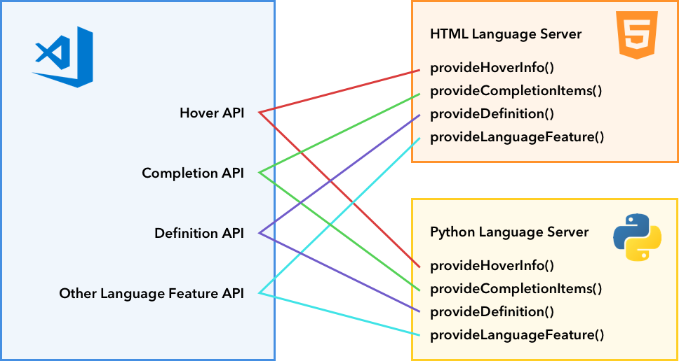
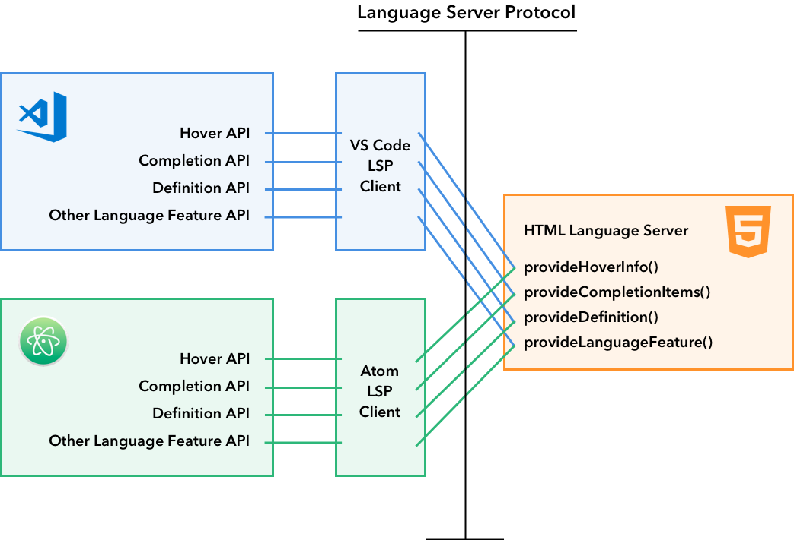

# 语言扩展概述

Visual Studio Code 通过语言扩展为不同的编程语言提供智能编辑功能。VS Code 并不在核心编辑器中提供内置语言支持，而是提供一组 API 来实现丰富的语言功能。

例如，[HTML](https://github.com/microsoft/vscode/tree/main/extensions/html) 扩展使用这些 API 为 HTML 文件提供语法高亮。同样，当你在 IntelliSense 中输入 `console.` 后看到 `log` 出现时，这正是 [Typescript Language Features](https://github.com/microsoft/vscode/tree/main/extensions/typescript-language-features) 扩展在发挥作用。

VS Code 将其中一些扩展打包在编辑器中，让你从一开始就能获得丰富的语言支持。

语言功能大致可以分为两类：

## 声明式语言功能

声明式语言功能通过配置文件来定义。例如 VS Code 内置的 [html](https://github.com/microsoft/vscode/tree/main/extensions/html)、[css](https://github.com/microsoft/vscode/tree/main/extensions/css) 和 [typescript-basic](https://github.com/microsoft/vscode/tree/main/extensions/typescript-basics) 扩展，它们提供了以下声明式语言功能的子集：

- 语法高亮
- 代码片段补全
- 括号匹配
- 括号自动闭合
- 括号自动环绕
- 注释切换
- 自动缩进
- 折叠（基于标记）

我们提供了三个指南来帮助编写提供声明式语言功能的语言扩展。

- [语法高亮指南](/vscode/extension/language-extensions/syntax-highlight-guide)：VS Code 使用 TextMate 语法进行语法高亮。本指南将带你编写一个简单的 TextMate 语法并将其转换为 VS Code 扩展。
- [代码片段补全指南](/vscode/extension/language-extensions/snippet-guide)：本指南介绍如何将一组代码片段打包为扩展。
- [语言配置指南](/vscode/extension/language-extensions/language-configuration-guide)：VS Code 允许扩展为任何编程语言定义**语言配置**。该文件控制基本的编辑功能，如注释切换、括号匹配/环绕和区域折叠（传统方式）。

## 编程式语言功能

编程式语言功能包括自动补全、错误检查和跳转到定义等。这些功能通常由 Language Server 驱动，它是一个分析你的项目以提供动态功能的程序。

一个例子是 VS Code 内置的 [`typescript-language-features`](https://github.com/microsoft/vscode/tree/main/extensions/typescript-language-features) 扩展。它利用 [TypeScript Language Service](https://github.com/microsoft/TypeScript/wiki/Using-the-Language-Service-API) 提供以下编程式语言功能：

- 悬停信息 ([`vscode.languages.registerHoverProvider`](/vscode/extension/references/vscode-api#languages.registerHoverProvider))
- 自动补全 ([`vscode.languages.registerCompletionItemProvider`](/vscode/extension/references/vscode-api#languages.registerCompletionItemProvider))
- 跳转到定义 ([`vscode.languages.registerDefinitionProvider`](/vscode/extension/references/vscode-api#languages.registerDefinitionProvider))
- 错误检查
- 格式化
- 重构
- 折叠

这里列出了完整的[编程式语言功能](/vscode/extension/language-extensions/programmatic-language-features)清单。

## Language Server Protocol

通过标准化 Language Server（静态代码分析工具）与 Language Client（通常是源代码编辑器）之间的通信，[Language Server Protocol](https://microsoft.github.io/language-server-protocol/) 使扩展作者只需编写一个代码分析程序，即可在多个编辑器中复用。

在[编程式语言功能](/vscode/extension/language-extensions/programmatic-language-features)列表中，你可以找到所有 VS Code 语言功能及其与 [Language Server Protocol 规范](https://microsoft.github.io/language-server-protocol/specification)的映射关系。

我们提供了一份深入指南，详细说明如何在 VS Code 中实现 Language Server 扩展：

- [Language Server 扩展指南](/vscode/extension/language-extensions/language-server-extension-guide)

## 特殊情况

### 多根工作区支持

当用户打开[多根工作区](/docs/editor/multi-root-workspaces)时，你可能需要相应地调整 Language Server 扩展。本主题讨论了支持多根工作区的多种方法。

### 嵌入式语言

嵌入式语言在 Web 开发中很常见。例如 HTML 中的 CSS/JavaScript，以及 JavaScript/TypeScript 中的 GraphQL。[嵌入式语言](/vscode/extension/language-extensions/embedded-languages)主题讨论了如何让语言功能支持嵌入式语言。
