# 编程式语言功能

编程式语言功能是由 [`vscode.languages.*`](/vscode/extension/references/vscode-api#languages) API 驱动的一组智能编辑功能。在 Visual Studio Code 中有两种常见的方式提供动态语言功能。以[悬停](#show-hovers)为例：

```ts
vscode.languages.registerHoverProvider('javascript', {
  provideHover(document, position, token) {
    return {
      contents: ['Hover Content']
    };
  }
});
```

如上所示，[`vscode.languages.registerHoverProvider`](/vscode/extension/references/vscode-api#languages.registerHoverProvider) API 提供了一种简便的方式来为 JavaScript 文件提供悬停内容。此扩展被激活后，每当你将鼠标悬停在某些 JavaScript 代码上时，VS Code 会查询所有 JavaScript 的 [`HoverProvider`](/vscode/extension/references/vscode-api#HoverProvider) 并在悬停小部件中显示结果。[语言功能列表](#language-features-listing)和下面的动画 GIF 可以帮助你快速定位扩展需要使用哪个 VS Code API / LSP 方法。

另一种方法是实现一个使用 [Language Server Protocol](https://microsoft.github.io/language-server-protocol/) 通信的 Language Server。其工作方式如下：

- 扩展提供 JavaScript 的 Language Client 和 Language Server。
- Language Client 与其他 VS Code 扩展一样，运行在 Node.js Extension Host 上下文中。当它被激活时，会在另一个进程中启动 Language Server，并通过 [Language Server Protocol](https://microsoft.github.io/language-server-protocol/) 与之通信。
- 你在 VS Code 中将鼠标悬停在 JavaScript 代码上
- VS Code 将悬停事件通知 Language Client
- Language Client 向 Language Server 查询悬停结果并将其发送回 VS Code
- VS Code 在悬停小部件中显示悬停结果

这个过程看起来更复杂，但它提供了两大好处：

- Language Server 可以用任何语言编写
- Language Server 可以被复用以为多个编辑器提供智能编辑功能

如需更深入的指南，请参阅 [Language Server 扩展指南](/vscode/extension/language-extensions/language-server-extension-guide)。

---

## 语言功能列表

此列表为每个语言功能包含以下内容：

- 语言功能在 VS Code 中的演示
- 相关的 VS Code API
- 相关的 LSP 方法

| VS Code API                                                                                                                       | LSP method                                                                                                                                                                                                                               |
| --------------------------------------------------------------------------------------------------------------------------------- | ---------------------------------------------------------------------------------------------------------------------------------------------------------------------------------------------------------------------------------------- |
| [`createDiagnosticCollection`](/vscode/extension/references/vscode-api#languages.createDiagnosticCollection)                                   | [PublishDiagnostics](https://microsoft.github.io/language-server-protocol/specification#textDocument_publishDiagnostics)                                                                                                                 |
| [`registerCompletionItemProvider`](/vscode/extension/references/vscode-api#languages.registerCompletionItemProvider)                           | [Completion](https://microsoft.github.io/language-server-protocol/specification#textDocument_completion) & [Completion Resolve](https://microsoft.github.io/language-server-protocol/specification#completionItem_resolve)               |
[`registerInlineCompletionItemProvider`](/vscode/extension/references/vscode-api#languages.registerInlineCompletionItemProvider)               |  |
| [`registerHoverProvider`](/vscode/extension/references/vscode-api#languages.registerHoverProvider)                                             | [Hover](https://microsoft.github.io/language-server-protocol/specification#textDocument_hover)                                                                                                                                           |
| [`registerSignatureHelpProvider`](/vscode/extension/references/vscode-api#languages.registerSignatureHelpProvider)                             | [SignatureHelp](https://microsoft.github.io/language-server-protocol/specification#textDocument_signatureHelp)                                                                                                                           |
| [`registerDefinitionProvider`](/vscode/extension/references/vscode-api#languages.registerDefinitionProvider)                                   | [Definition](https://microsoft.github.io/language-server-protocol/specification#textDocument_definition)                                                                                                                                 |
| [`registerTypeDefinitionProvider`](/vscode/extension/references/vscode-api#languages.registerTypeDefinitionProvider)                           | [TypeDefinition](https://microsoft.github.io/language-server-protocol/specification#textDocument_typeDefinition)                                                                                                                         |
| [`registerImplementationProvider`](/vscode/extension/references/vscode-api#languages.registerImplementationProvider)                           | [Implementation](https://microsoft.github.io/language-server-protocol/specification#textDocument_implementation)                                                                                                                         |
| [`registerReferenceProvider`](/vscode/extension/references/vscode-api#languages.registerReferenceProvider)                                     | [References](https://microsoft.github.io/language-server-protocol/specification#textDocument_references)                                                                                                                                 |
| [`registerDocumentHighlightProvider`](/vscode/extension/references/vscode-api#languages.registerDocumentHighlightProvider)                     | [DocumentHighlight](https://microsoft.github.io/language-server-protocol/specification#textDocument_documentHighlight)                                                                                                                   |
| [`registerDocumentSymbolProvider`](/vscode/extension/references/vscode-api#languages.registerDocumentSymbolProvider)                           | [DocumentSymbol](https://microsoft.github.io/language-server-protocol/specification#textDocument_documentSymbol)                                                                                                                         |
| [`registerCodeActionsProvider`](/vscode/extension/references/vscode-api#languages.registerCodeActionsProvider)                                 | [CodeAction](https://microsoft.github.io/language-server-protocol/specification#textDocument_codeAction)                                                                                                                                 |
| [`registerCodeLensProvider`](/vscode/extension/references/vscode-api#languages.registerCodeLensProvider)                                       | [CodeLens](https://microsoft.github.io/language-server-protocol/specification#textDocument_codeLens) & [CodeLens Resolve](https://microsoft.github.io/language-server-protocol/specification#codeLens_resolve)                           |
| [`registerDocumentLinkProvider`](/vscode/extension/references/vscode-api#languages.registerDocumentLinkProvider)                               | [DocumentLink](https://microsoft.github.io/language-server-protocol/specification#textDocument_documentLink) & [DocumentLink Resolve](https://microsoft.github.io/language-server-protocol/specification#documentLink_resolve)                   |
| [`registerColorProvider`](/vscode/extension/references/vscode-api#languages.registerColorProvider)                                     | [DocumentColor](https://microsoft.github.io/language-server-protocol/specification#textDocument_documentColor) & [Color Presentation](https://microsoft.github.io/language-server-protocol/specification#textDocument_colorPresentation) |
| [`registerDocumentFormattingEditProvider`](/vscode/extension/references/vscode-api#languages.registerDocumentFormattingEditProvider)           | [Formatting](https://microsoft.github.io/language-server-protocol/specification#textDocument_formatting)                                                                                                                                 |
| [`registerDocumentRangeFormattingEditProvider`](/vscode/extension/references/vscode-api#languages.registerDocumentRangeFormattingEditProvider) | [RangeFormatting](https://microsoft.github.io/language-server-protocol/specification#textDocument_rangeFormatting)                                                                                                                       |
| [`registerOnTypeFormattingEditProvider`](/vscode/extension/references/vscode-api#languages.registerOnTypeFormattingEditProvider)               | [OnTypeFormatting](https://microsoft.github.io/language-server-protocol/specification#textDocument_onTypeFormatting)                                                                                                                     |
| [`registerRenameProvider`](/vscode/extension/references/vscode-api#languages.registerRenameProvider)                                           | [Rename](https://microsoft.github.io/language-server-protocol/specification#textDocument_rename) & [Prepare Rename](https://microsoft.github.io/language-server-protocol/specification#textDocument_prepareRename)                       |
| [`registerFoldingRangeProvider`](/vscode/extension/references/vscode-api#languages.registerFoldingRangeProvider)                               | [FoldingRange](https://microsoft.github.io/language-server-protocol/specification#textDocument_foldingRange)                                                                                                                             |

## 提供诊断

诊断是一种指示代码问题的方式。

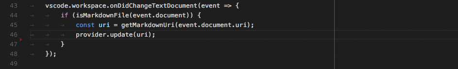

#### Language Server Protocol

你的 Language Server 向 Language Client 发送 `textDocument/publishDiagnostics` 消息。该消息携带一个资源 URI 的诊断项数组。

**注意**：Client 不会向 Server 请求诊断。Server 将诊断信息推送给 Client。

#### 直接实现

```typescript
let diagnosticCollection: vscode.DiagnosticCollection;

export function activate(ctx: vscode.ExtensionContext): void {
  ...
  ctx.subscriptions.push(getDisposable());
  diagnosticCollection = vscode.languages.createDiagnosticCollection('go');
  ctx.subscriptions.push(diagnosticCollection);
  ...
}

function onChange() {
  let uri = document.uri;
  check(uri.fsPath, goConfig).then(errors => {
    diagnosticCollection.clear();
    let diagnosticMap: Map<string, vscode.Diagnostic[]> = new Map();
    errors.forEach(error => {
      let canonicalFile = vscode.Uri.file(error.file).toString();
      let range = new vscode.Range(error.line-1, error.startColumn, error.line-1, error.endColumn);
      let diagnostics = diagnosticMap.get(canonicalFile);
      if (!diagnostics) { diagnostics = []; }
      diagnostics.push(new vscode.Diagnostic(range, error.msg, error.severity));
      diagnosticMap.set(canonicalFile, diagnostics);
    });
    diagnosticMap.forEach((diags, file) => {
      diagnosticCollection.set(vscode.Uri.parse(file), diags);
    });
  })
}
```

> **基本**
>
> 为打开的编辑器报告诊断。至少需要在每次保存时执行。更好的做法是基于编辑器未保存的内容来计算诊断。

> **高级**
>
> 不仅为打开的编辑器报告诊断，还为打开文件夹中的所有资源报告诊断，无论它们是否曾在编辑器中被打开过。

## 显示代码补全建议

代码补全为用户提供上下文相关的建议。

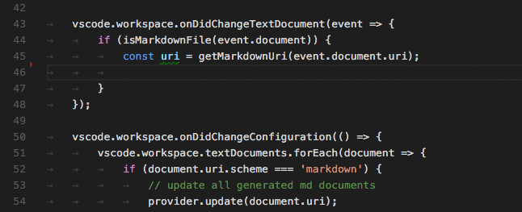

#### Language Server Protocol

在 `initialize` 方法的响应中，你的 Language Server 需要声明它提供补全功能，以及是否支持 `completionItem\resolve` 方法来为计算出的补全项提供额外信息。

```json
{
    ...
    "capabilities" : {
        "completionProvider" : {
            "resolveProvider": "true",
            "triggerCharacters": [ '.' ]
        }
        ...
    }
}
```

#### 直接实现

```typescript
class GoCompletionItemProvider implements vscode.CompletionItemProvider {
    public provideCompletionItems(
        document: vscode.TextDocument, position: vscode.Position, token: vscode.CancellationToken):
        Thenable<vscode.CompletionItem[]> {
    ...
    }
}

export function activate(ctx: vscode.ExtensionContext): void {
    ...
    ctx.subscriptions.push(getDisposable());
    ctx.subscriptions.push(
        vscode.languages.registerCompletionItemProvider(
            GO_MODE, new GoCompletionItemProvider(), '.', '\"'));
    ...
}
```

> **基本**
>
> 不支持 resolve 提供者。

> **高级**
>
> 支持 resolve 提供者，为用户选择的补全建议计算额外信息。此信息会与所选项目一起显示。

## 显示行内补全

行内补全直接在编辑器中呈现多 token 建议（_幽灵文本_）。

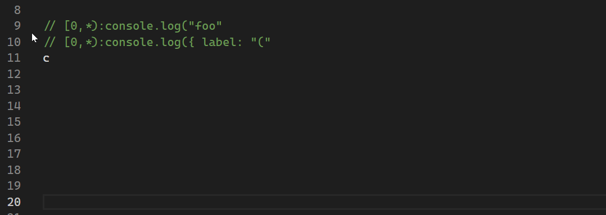

#### 直接实现

```ts
vscode.languages.registerInlineCompletionItemProvider({ language: 'javascript' }, {
    provideInlineCompletionItems(document, position, context, token) {
        const result: vscode.InlineCompletionList = {
            items: [],
            commands: [],
        };

        ...

        return result;
    }
});
```

你可以在[行内补全示例扩展](https://github.com/microsoft/vscode-extension-samples/blob/main/inline-completions)中探索完整示例。

> **基本**
>
> 仅基于当前行内容为特定语言返回已知模式列表的行内补全。

> **高级**
>
> 基于整个文档或工作区中的内容和更复杂的模式返回行内补全。

## 显示悬停

悬停显示鼠标光标下方符号/对象的信息。通常是符号的类型和描述。

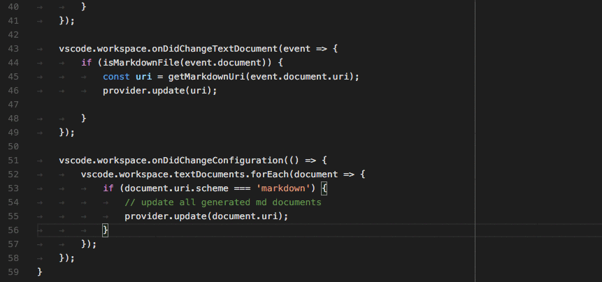

#### Language Server Protocol

在 `initialize` 方法的响应中，你的 Language Server 需要声明它提供悬停功能。

```json
{
    ...
    "capabilities" : {
        "hoverProvider" : "true",
        ...
    }
}
```

此外，你的 Language Server 需要响应 `textDocument/hover` 请求。

#### 直接实现

```typescript
class GoHoverProvider implements HoverProvider {
    public provideHover(
        document: TextDocument, position: Position, token: CancellationToken):
        Thenable<Hover> {
    ...
    }
}

export function activate(ctx: vscode.ExtensionContext): void {
    ...
    ctx.subscriptions.push(
        vscode.languages.registerHoverProvider(
            GO_MODE, new GoHoverProvider()));
    ...
}
```

> **基本**
>
> 显示类型信息，并在可用时包含文档。

> **高级**
>
> 以与代码着色相同的风格为方法签名着色。

## 函数和方法签名帮助

当用户输入函数或方法时，显示正在调用的函数/方法的相关信息。

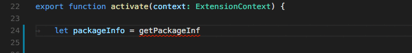

#### Language Server Protocol

在 `initialize` 方法的响应中，你的 Language Server 需要声明它提供签名帮助。

```json
{
    ...
    "capabilities" : {
        "signatureHelpProvider" : {
            "triggerCharacters": [ '(' ]
        }
        ...
    }
}
```

此外，你的 Language Server 需要响应 `textDocument/signatureHelp` 请求。

#### 直接实现

```typescript
class GoSignatureHelpProvider implements SignatureHelpProvider {
    public provideSignatureHelp(
        document: TextDocument, position: Position, token: CancellationToken):
        Promise<SignatureHelp> {
    ...
    }
}

export function activate(ctx: vscode.ExtensionContext): void {
    ...
    ctx.subscriptions.push(
        vscode.languages.registerSignatureHelpProvider(
            GO_MODE, new GoSignatureHelpProvider(), '(', ','));
    ...
}
```

> **基本**
>
> 确保签名帮助包含函数或方法参数的文档。

> **高级**
>
> 无额外要求。

## 显示符号的定义

允许用户在使用变量/函数/方法的地方直接查看其定义。

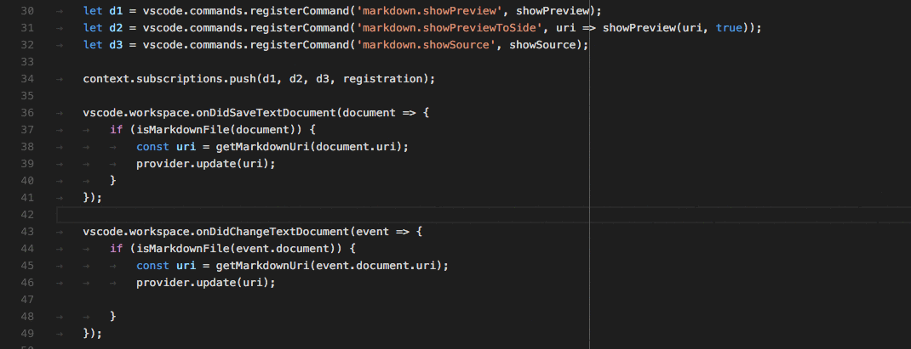

#### Language Server Protocol

在 `initialize` 方法的响应中，你的 Language Server 需要声明它提供转到定义位置功能。

```json
{
    ...
    "capabilities" : {
        "definitionProvider" : "true"
        ...
    }
}
```

此外，你的 Language Server 需要响应 `textDocument/definition` 请求。

#### 直接实现

```typescript
class GoDefinitionProvider implements vscode.DefinitionProvider {
    public provideDefinition(
        document: vscode.TextDocument, position: vscode.Position, token: vscode.CancellationToken):
        Thenable<vscode.Location> {
    ...
    }
}

export function activate(ctx: vscode.ExtensionContext): void {
    ...
    ctx.subscriptions.push(
        vscode.languages.registerDefinitionProvider(
            GO_MODE, new GoDefinitionProvider()));
    ...
}
```

> **基本**
>
> 如果符号存在歧义，可以显示多个定义。

> **高级**
>
> 无额外要求。

## 查找符号的所有引用

允许用户查看某个变量/函数/方法/符号在所有源代码位置的使用情况。

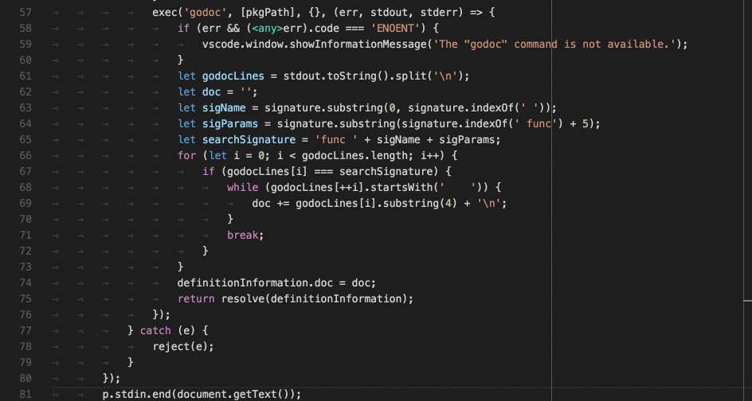

#### Language Server Protocol

在 `initialize` 方法的响应中，你的 Language Server 需要声明它提供符号引用位置功能。

```json
{
    ...
    "capabilities" : {
        "referencesProvider" : "true"
        ...
    }
}
```

此外，你的 Language Server 需要响应 `textDocument/references` 请求。

#### 直接实现

```typescript
class GoReferenceProvider implements vscode.ReferenceProvider {
    public provideReferences(
        document: vscode.TextDocument, position: vscode.Position,
        options: { includeDeclaration: boolean }, token: vscode.CancellationToken):
        Thenable<vscode.Location[]> {
    ...
    }
}

export function activate(ctx: vscode.ExtensionContext): void {
    ...
    ctx.subscriptions.push(
        vscode.languages.registerReferenceProvider(
            GO_MODE, new GoReferenceProvider()));
    ...
}
```

> **基本**
>
> 返回所有引用的位置（资源 URI 和范围）。

> **高级**
>
> 无额外要求。

## 高亮文档中符号的所有出现

允许用户在打开的编辑器中查看符号的所有出现。

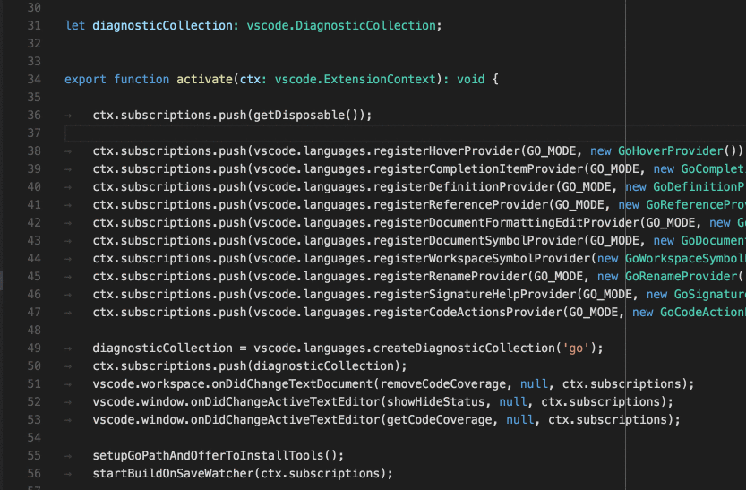

#### Language Server Protocol

在 `initialize` 方法的响应中，你的 Language Server 需要声明它提供符号文档位置功能。

```json
{
    ...
    "capabilities" : {
        "documentHighlightProvider" : "true"
        ...
    }
}
```

此外，你的 Language Server 需要响应 `textDocument/documentHighlight` 请求。

#### 直接实现

```typescript
class GoDocumentHighlightProvider implements vscode.DocumentHighlightProvider {
    public provideDocumentHighlights(
        document: vscode.TextDocument, position: vscode.Position, token: vscode.CancellationToken):
        vscode.DocumentHighlight[] | Thenable<vscode.DocumentHighlight[]>;
    ...
    }
}

export function activate(ctx: vscode.ExtensionContext): void {
    ...
    ctx.subscriptions.push(
        vscode.languages.registerDocumentHighlightProvider(
            GO_MODE, new GoDocumentHighlightProvider()));
    ...
}
```

> **基本**
>
> 返回编辑器文档中找到引用的范围。

> **高级**
>
> 无额外要求。

## 显示文档中的所有符号定义

允许用户快速导航到打开的编辑器中的任何符号定义。

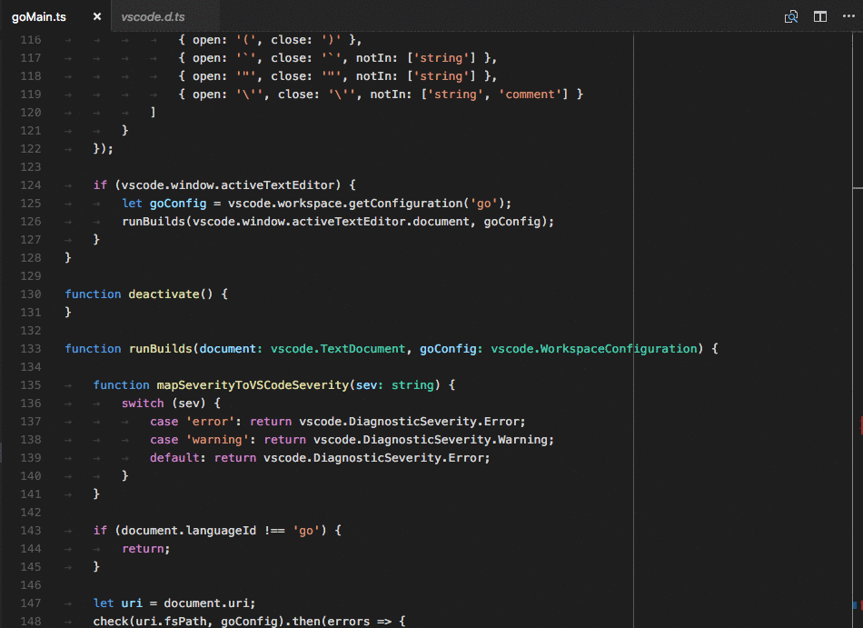

#### Language Server Protocol

在 `initialize` 方法的响应中，你的 Language Server 需要声明它提供符号文档位置功能。

```json
{
    ...
    "capabilities" : {
        "documentSymbolProvider" : "true"
        ...
    }
}
```

此外，你的 Language Server 需要响应 `textDocument/documentSymbol` 请求。

#### 直接实现

```typescript
class GoDocumentSymbolProvider implements vscode.DocumentSymbolProvider {
    public provideDocumentSymbols(
        document: vscode.TextDocument, token: vscode.CancellationToken):
        Thenable<vscode.SymbolInformation[]> {
    ...
    }
}

export function activate(ctx: vscode.ExtensionContext): void {
    ...
    ctx.subscriptions.push(
        vscode.languages.registerDocumentSymbolProvider(
            GO_MODE, new GoDocumentSymbolProvider()));
    ...
}
```

> **基本**
>
> 返回文档中的所有符号。定义符号的种类，如变量、函数、类、方法等。

> **高级**
>
> 无额外要求。

## 显示文件夹中的所有符号定义

允许用户快速导航到 VS Code 中打开的文件夹（工作区）中任何位置的符号定义。


#### Language Server Protocol

在 `initialize` 方法的响应中，你的 Language Server 需要声明它提供全局符号位置功能。

```json
{
    ...
    "capabilities" : {
        "workspaceSymbolProvider" : "true"
        ...
    }
}
```

此外，你的 Language Server 需要响应 `workspace/symbol` 请求。

#### 直接实现

```typescript
class GoWorkspaceSymbolProvider implements vscode.WorkspaceSymbolProvider {
    public provideWorkspaceSymbols(
        query: string, token: vscode.CancellationToken):
        Thenable<vscode.SymbolInformation[]> {
    ...
    }
}

export function activate(ctx: vscode.ExtensionContext): void {
    ...
    ctx.subscriptions.push(
        vscode.languages.registerWorkspaceSymbolProvider(
            new GoWorkspaceSymbolProvider()));
    ...
}
```

> **基本**
>
> 返回打开文件夹中源代码定义的所有符号。定义符号的种类，如变量、函数、类、方法等。

> **高级**
>
> 无额外要求。

## 错误或警告的可能操作

在错误或警告旁边为用户提供可能的纠正操作。如果操作可用，错误或警告旁边会出现一个灯泡图标。当用户点击灯泡时，会显示可用 Code Action 的列表。

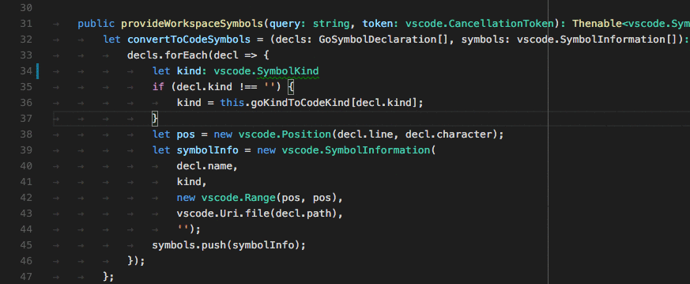

#### Language Server Protocol

在 `initialize` 方法的响应中，你的 Language Server 需要声明它提供 Code Action。

```json
{
    ...
    "capabilities" : {
        "codeActionProvider" : "true"
        ...
    }
}
```

此外，你的 Language Server 需要响应 `textDocument/codeAction` 请求。

#### 直接实现

```typescript
class GoCodeActionProvider implements vscode.CodeActionProvider<vscode.CodeAction> {
    public provideCodeActions(
        document: vscode.TextDocument, range: vscode.Range | vscode.Selection,
        context: vscode.CodeActionContext, token: vscode.CancellationToken):
        Thenable<vscode.CodeAction[]> {
    ...
    }
}

export function activate(ctx: vscode.ExtensionContext): void {
    ...
    ctx.subscriptions.push(
        vscode.languages.registerCodeActionsProvider(
            GO_MODE, new GoCodeActionProvider()));
    ...
}
```

> **基本**
>
> 提供用于纠正错误/警告的 Code Action。

> **高级**
>
> 此外，提供源代码操作，如重构。例如，**提取方法**。

## CodeLens - 在源代码中显示可操作的上下文信息

为用户提供可操作的、上下文相关的信息，这些信息穿插显示在源代码中。

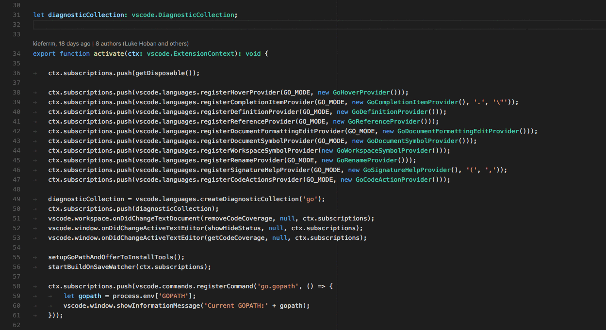

#### Language Server Protocol

在 `initialize` 方法的响应中，你的 Language Server 需要声明它提供 CodeLens 结果，以及是否支持 `codeLens\resolve` 方法来将 CodeLens 绑定到其命令。

```json
{
    ...
    "capabilities" : {
        "codeLensProvider" : {
            "resolveProvider": "true"
        }
        ...
    }
}
```

此外，你的 Language Server 需要响应 `textDocument/codeLens` 请求。

#### 直接实现

```typescript
class GoCodeLensProvider implements vscode.CodeLensProvider {
    public provideCodeLenses(document: TextDocument, token: CancellationToken):
        CodeLens[] | Thenable<CodeLens[]> {
    ...
    }

    public resolveCodeLens?(codeLens: CodeLens, token: CancellationToken):
         CodeLens | Thenable<CodeLens> {
    ...
    }
}

export function activate(ctx: vscode.ExtensionContext): void {
    ...
    ctx.subscriptions.push(
        vscode.languages.registerCodeLensProvider(
            GO_MODE, new GoCodeLensProvider()));
    ...
}
```

> **基本**
>
> 定义文档可用的 CodeLens 结果。

> **高级**
>
> 通过响应 `codeLens/resolve` 将 CodeLens 结果绑定到命令。

## 显示颜色装饰器

允许用户预览和修改文档中的颜色。

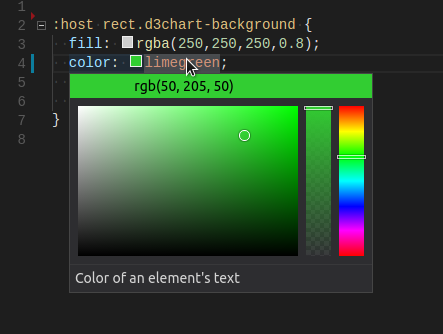

#### Language Server Protocol

在 `initialize` 方法的响应中，你的 Language Server 需要声明它提供颜色信息。

```json
{
    ...
    "capabilities" : {
        "colorProvider" : "true"
        ...
    }
}
```

此外，你的 Language Server 需要响应 `textDocument/documentColor` 和 `textDocument/colorPresentation` 请求。

#### 直接实现

```typescript
class GoColorProvider implements vscode.DocumentColorProvider {
    public provideDocumentColors(
        document: vscode.TextDocument, token: vscode.CancellationToken):
        Thenable<vscode.ColorInformation[]> {
    ...
    }
    public provideColorPresentations(
        color: Color, context: { document: TextDocument, range: Range }, token: vscode.CancellationToken):
        Thenable<vscode.ColorPresentation[]> {
    ...
    }
}

export function activate(ctx: vscode.ExtensionContext): void {
    ...
    ctx.subscriptions.push(
        vscode.languages.registerColorProvider(
            GO_MODE, new GoColorProvider()));
    ...
}
```

> **基本**
>
> 返回文档中的所有颜色引用。为支持的颜色格式提供颜色表示（例如 rgb(...)、hsl(...)）。

> **高级**
>
> 无额外要求。

## 格式化编辑器中的源代码

为用户提供格式化整个文档的支持。

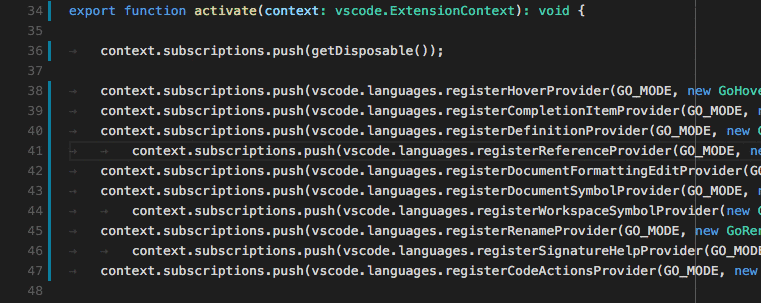

#### Language Server Protocol

在 `initialize` 方法的响应中，你的 Language Server 需要声明它提供文档格式化功能。

```json
{
    ...
    "capabilities" : {
        "documentFormattingProvider" : "true"
        ...
    }
}
```

此外，你的 Language Server 需要响应 `textDocument/formatting` 请求。

#### 直接实现

```typescript
class GoDocumentFormatter implements vscode.DocumentFormattingEditProvider {
    provideDocumentFormattingEdits(
        document: vscode.TextDocument, options: vscode.FormattingOptions, token: vscode.CancellationToken)
        : vscode.ProviderResult<vscode.TextEdit[]> {
    ...
    }
}

export function activate(ctx: vscode.ExtensionContext): void {
    ...
    ctx.subscriptions.push(
        vscode.languages.registerDocumentFormattingEditProvider(
            GO_MODE, new GoDocumentFormatter()));
    ...
}
```

> **基本**
>
> 不提供格式化支持。

> **高级**
>
> 你应该始终返回尽可能小的文本编辑，以确保源代码被格式化。这对于确保诊断结果等标记被正确调整且不会丢失至关重要。

## 格式化编辑器中选定的行

为用户提供格式化文档中选定行范围的支持。

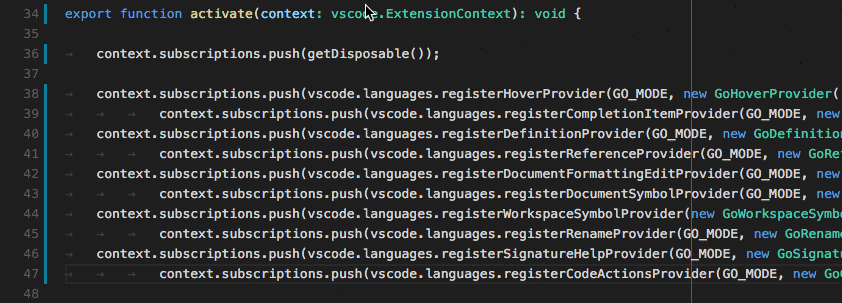

#### Language Server Protocol

在 `initialize` 方法的响应中，你的 Language Server 需要声明它提供行范围的格式化支持。

```json
{
    ...
    "capabilities" : {
        "documentRangeFormattingProvider" : "true"
        ...
    }
}
```

此外，你的 Language Server 需要响应 `textDocument/rangeFormatting` 请求。

#### 直接实现

```typescript
class GoDocumentRangeFormatter implements vscode.DocumentRangeFormattingEditProvider{
    public provideDocumentRangeFormattingEdits(
        document: vscode.TextDocument, range: vscode.Range,
        options: vscode.FormattingOptions, token: vscode.CancellationToken):
        vscode.ProviderResult<vscode.TextEdit[]> {
    ...
    }
}

export function activate(ctx: vscode.ExtensionContext): void {
    ...
    ctx.subscriptions.push(
        vscode.languages.registerDocumentRangeFormattingEditProvider(
            GO_MODE, new GoDocumentRangeFormatter()));
    ...
}
```

> **基本**
>
> 不提供格式化支持。

> **高级**
>
> 你应该始终返回尽可能小的文本编辑，以确保源代码被格式化。这对于确保诊断结果等标记被正确调整且不会丢失至关重要。

## 用户输入时增量格式化代码

为用户提供在输入时格式化文本的支持。

**注意**：用户[设置](/docs/configure/settings) `editor.formatOnType` 控制用户输入时是否格式化源代码。

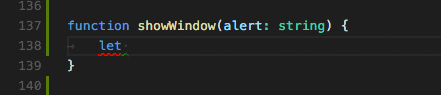

#### Language Server Protocol

在 `initialize` 方法的响应中，你的 Language Server 需要声明它提供输入时格式化功能。它还需要告知客户端在哪些字符上触发格式化。`moreTriggerCharacters` 是可选的。

```json
{
    ...
    "capabilities" : {
        "documentOnTypeFormattingProvider" : {
            "firstTriggerCharacter": "}",
            "moreTriggerCharacter": [";", ","]
        }
        ...
    }
}
```

此外，你的 Language Server 需要响应 `textDocument/onTypeFormatting` 请求。

#### 直接实现

```typescript
class GoOnTypingFormatter implements vscode.OnTypeFormattingEditProvider{
    public provideOnTypeFormattingEdits(
        document: vscode.TextDocument, position: vscode.Position,
        ch: string, options: vscode.FormattingOptions, token: vscode.CancellationToken):
        vscode.ProviderResult<vscode.TextEdit[]> {
    ...
    }
}

export function activate(ctx: vscode.ExtensionContext): void {
    ...
    ctx.subscriptions.push(
        vscode.languages.registerOnTypeFormattingEditProvider(
            GO_MODE, new GoOnTypingFormatter()));
    ...
}
```

> **基本**
>
> 不提供格式化支持。

> **高级**
>
> 你应该始终返回尽可能小的文本编辑，以确保源代码被格式化。这对于确保诊断结果等标记被正确调整且不会丢失至关重要。

## 重命名符号

允许用户重命名符号并更新对该符号的所有引用。

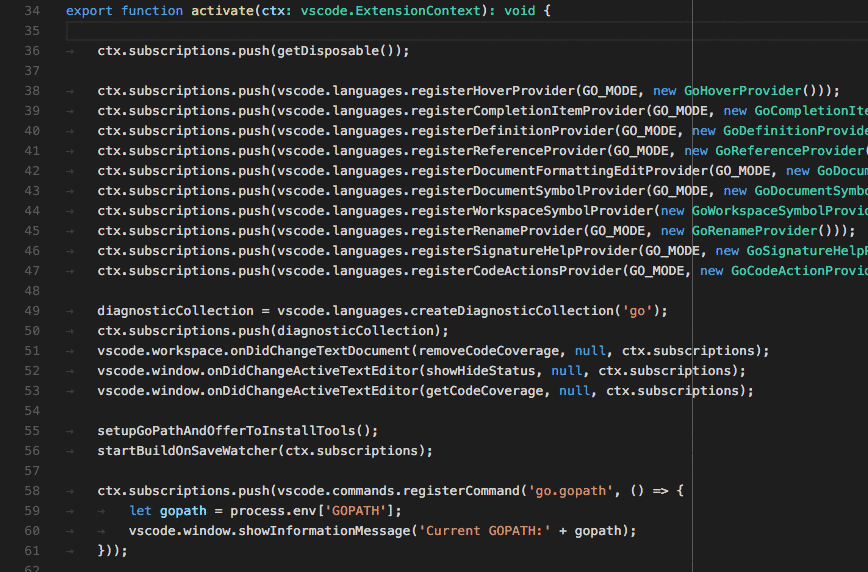

#### Language Server Protocol

在 `initialize` 方法的响应中，你的 Language Server 需要声明它提供重命名功能。

```json
{
    ...
    "capabilities" : {
        "renameProvider" : "true"
        ...
    }
}
```

此外，你的 Language Server 需要响应 `textDocument/rename` 请求。

#### 直接实现

```typescript
class GoRenameProvider implements vscode.RenameProvider {
    public provideRenameEdits(
        document: vscode.TextDocument, position: vscode.Position,
        newName: string, token: vscode.CancellationToken):
        Thenable<vscode.WorkspaceEdit> {
    ...
    }
}

export function activate(ctx: vscode.ExtensionContext): void {
    ...
    ctx.subscriptions.push(
        vscode.languages.registerRenameProvider(
            GO_MODE, new GoRenameProvider()));
    ...
}
```

> **基本**
>
> 不提供重命名支持。

> **高级**
>
> 返回需要执行的所有工作区编辑列表，例如包含该符号引用的所有文件中的所有编辑。
