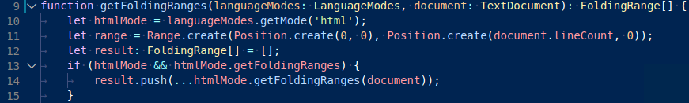
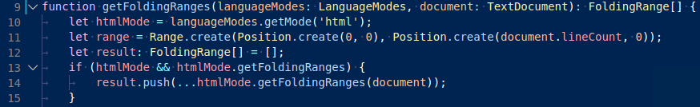

# 语义高亮指南

语义高亮是对[语法高亮指南](/vscode/extension/language-extensions/syntax-highlight-guide)中描述的语法高亮的补充。Visual Studio Code 使用 TextMate 语法作为主要的分词引擎。TextMate 语法以单个文件作为输入，根据正则表达式表达的词法规则将其拆分。

语义分词允许 Language Server 基于 Language Server 对项目上下文中符号解析的知识提供额外的 token 信息。主题可以选择使用语义 token 来改善和细化语法的语法高亮。编辑器将语义 token 的高亮应用在语法高亮之上。

以下是语义高亮可以添加的效果示例：

没有语义高亮时：



有语义高亮时：



注意基于语言服务符号理解而产生的颜色差异：

- 第 10 行：`languageModes` 被着色为参数
- 第 11 行：`Range` 和 `Position` 被着色为类，`document` 被着色为参数
- 第 13 行：`getFoldingRanges` 被着色为函数

## 语义 token 提供者

要实现语义高亮，语言扩展可以按文档语言和/或文件名注册 `semantic token provider`。编辑器会在需要语义 token 时向提供者发出请求。

```ts
const tokenTypes = ['class', 'interface', 'enum', 'function', 'variable'];
const tokenModifiers = ['declaration', 'documentation'];
const legend = new vscode.SemanticTokensLegend(tokenTypes, tokenModifiers);

const provider: vscode.DocumentSemanticTokensProvider = {
  provideDocumentSemanticTokens(document: vscode.TextDocument): vscode.ProviderResult<vscode.SemanticTokens> {
    // analyze the document and return semantic tokens

    const tokensBuilder = new vscode.SemanticTokensBuilder(legend);
    // on line 1, characters 1-5 are a class declaration
    tokensBuilder.push(
      new vscode.Range(new vscode.Position(1, 1), new vscode.Position(1, 5)),
      'class',
      ['declaration'],
    );
    return tokensBuilder.build();
  }
};

const selector = { language: 'java', scheme: 'file' }; // register for all Java documents from the local file system

vscode.languages.registerDocumentSemanticTokensProvider(selector, provider, legend);
```

语义 token 提供者 API 提供两种形式以适应 Language Server 的不同能力：

- `DocumentSemanticTokensProvider` - 始终以完整文档作为输入。

  - `provideDocumentSemanticTokens` - 提供文档的所有 token。
  - `provideDocumentSemanticTokensEdits`- 以相对于前一次响应的增量形式提供文档的所有 token。

- `DocumentRangeSemanticTokensProvider` - 仅作用于某个范围。

  - `provideDocumentRangeSemanticTokens` - 提供文档某个范围内的所有 token。

提供者返回的每个 token 都带有一个分类，由 token 类型、任意数量的 token 修饰符和 token 语言组成。

如上例所示，提供者在 `SemanticTokensLegend` 中声明它将使用的类型和修饰符。这使得 `provide` API 可以将 token 类型和修饰符作为图例的索引返回。

## 语义 token 分类

语义 token 提供者的输出由 token 组成。每个 token 有一个范围和一个 token 分类，描述该 token 代表的语法元素类型。如果 token 属于嵌入式语言，分类还可以选择指定一种语言。

为了描述语法元素的类型，使用了语义 token 类型和修饰符。这些信息类似于[语法高亮指南](/vscode/extension/language-extensions/syntax-highlight-guide)中描述的 TextMate 作用域，但我们希望提供一个专用且更清晰的分类系统。

VS Code 提供了一组标准语义 token 类型和修饰符供所有语义 token 提供者使用。同时，语义 token 提供者可以自由定义新的类型和修饰符，并创建标准类型的子类型。

### 标准 token 类型和修饰符

标准类型和修饰符涵盖了许多语言中使用的通用概念。虽然每种语言可能对某些类型和修饰符使用不同的术语，但遵循标准分类，主题作者就可以定义跨语言通用的主题化规则。

以下是 VS Code 预定义的标准语义 token 类型和语义 token 修饰符：

标准 token 类型：

| ID      | 描述                   |
| ----------------------------- | -------------------------------- |
| `namespace`| 用于声明或引用命名空间、模块或包的标识符。 |
| `class`| 用于声明或引用类类型的标识符。 |
| `enum`| 用于声明或引用枚举类型的标识符。 |
| `interface`| 用于声明或引用接口类型的标识符。 |
| `struct`| 用于声明或引用结构体类型的标识符。 |
| `typeParameter`| 用于声明或引用类型参数的标识符。 |
| `type`| 用于声明或引用上述未涵盖的类型的标识符。 |
| `parameter` | 用于声明或引用函数或方法参数的标识符。 |
| `variable` | 用于声明或引用局部或全局变量的标识符。 |
| `property` | 用于声明或引用成员属性、成员字段或成员变量的标识符。 |
| `enumMember` | 用于声明或引用枚举属性、常量或成员的标识符。 |
| `decorator` | 用于声明或引用装饰器和注解的标识符。 |
| `event`| 用于声明事件属性的标识符。 |
| `function`| 用于声明函数的标识符。 |
| `method`| 用于声明成员函数或方法的标识符。 |
| `macro`| 用于声明宏的标识符。 |
| `label`| 用于声明标签的标识符。 |
| `comment`| 表示注释的 token。 |
| `string`| 表示字符串字面量的 token。 |
| `keyword`| 表示语言关键字的 token。 |
| `number`| 表示数字字面量的 token。 |
| `regexp`| 表示正则表达式字面量的 token。 |
| `operator`| 表示运算符的 token。 |

标准 token 修饰符：

| ID      | 描述                   |
| ----------------------------- | -------------------------------- |
| `declaration`| 用于符号的声明。  |
| `definition`| 用于符号的定义，例如头文件中的定义。  |
| `readonly`| 用于只读变量和成员字段（常量）。  |
| `static`| 用于类成员（静态成员）。 |
| `deprecated`| 用于不应再使用的符号。  |
| `abstract`| 用于抽象的类型和成员函数。  |
| `async`| 用于标记为 async 的函数。  |
| `modification`| 用于变量被赋值的引用。  |
| `documentation`| 用于文档中符号的出现。  |
| `defaultLibrary`| 用于标准库中的符号。  |

除了标准类型和修饰符，VS Code 还定义了类型和修饰符到类似 TextMate 作用域的映射。这在[语义 Token 作用域映射](#semantic-token-scope-map)部分中说明。

### 自定义 token 类型和修饰符

如有必要，扩展可以通过扩展的 `package.json` 中的 `semanticTokenTypes` 和 `semanticTokenModifiers` 贡献点来声明新类型和修饰符，或创建现有类型的子类型：

```json
{
  "contributes": {
    "semanticTokenTypes": [{
      "id": "templateType",
      "superType": "type",
      "description": "A template type."
    }],
    "semanticTokenModifiers": [{
      "id": "native",
      "description": "Annotates a symbol that is implemented natively"
    }]
  }
}
```

在上面的示例中，扩展声明了新类型 `templateType` 和新修饰符 `native`。通过将 `type` 指定为父类型，`type` 的主题样式规则也将应用于 `templateType`：

```json
{
  "name": "Red Theme",
  "semanticTokenColors": {
    "type": "#ff0011"
  }
}
```

上面显示的 `semanticTokenColors` 值 `"#ff0011"` 同时适用于 `type` 及其所有子类型，包括 `templateType`。

除了自定义 token 类型，扩展还可以定义它们如何映射到 TextMate 作用域。这在[自定义映射](#custom-textmate-scope-mappings)部分中说明。请注意，自定义映射规则不会自动从父类型继承。子类型需要重新定义映射，最好映射到更具体的作用域。

## 语义高亮的启用

是否计算和高亮语义 token 由 `editor.semanticHighlighting.enabled` 设置决定。它可以取值 `true`、`false` 和 `configuredByTheme`。

- `true` 和 `false` 为所有主题开启或关闭语义高亮。
- `configuredByTheme` 是默认值，让每个主题控制是否启用语义高亮。VS Code 附带的所有主题（例如默认的 "Dark+"）默认启用语义高亮。

依赖语义 token 的语言扩展可以在其 `package.json` 中覆盖其语言的默认设置：

```json
{
  "configurationDefaults": {
    "[languageId]": {
      "editor.semanticHighlighting.enabled": true
    }
  }
}
```

## Theming（主题化）

主题化是为 token 分配颜色和样式的过程。主题化规则在颜色主题文件（JSON 格式）中指定。用户也可以在用户设置中自定义主题化规则。

### 颜色主题中的语义着色

为了支持基于语义 token 的高亮，颜色主题文件格式中新增了两个属性。

`semanticHighlighting` 属性定义主题是否准备好使用语义 token 进行高亮。默认为 false，但我们鼓励所有主题启用它。当设置 `editor.semanticHighlighting.enabled` 为 `configuredByTheme` 时使用此属性。

`semanticTokenColors` 属性允许主题定义新的着色规则，与语义 token 提供者发出的语义 token 类型和修饰符进行匹配。

```jsonc
{
  "name": "Red Theme",
  "tokenColors": [
    {
      "scope": "comment",
      "settings": {
        "foreground": "#dd0000",
        "fontStyle": "italic"
      }
    }
  ],
  "semanticHighlighting": true,
  "semanticTokenColors": {
    "variable.readonly:java": "#ff0011"
  }
}
```

`variable.readonly:java` 称为选择器，其格式为 `(*|tokenType)(.tokenModifier)*(:tokenLanguage)?`。

该值描述了规则匹配时的样式。它可以是一个表示前景色的字符串，也可以是一个对象，格式为 `{ foreground: string, bold: boolean, italic: boolean, underline: boolean }` 或 `{ foreground: string, fontStyle: string }`，与 `tokenColors` 中 TextMate 主题规则使用的格式相同。

前景色需要遵循[颜色格式](/vscode/extension/references/theme-color#color-formats)中描述的格式。不支持透明度。

以下是其他选择器和样式的示例：

- `"*.declaration": { "bold": true } // 所有声明均为粗体`
- `"class:java": { "foreground": "#0f0", "italic": true } // Java 中的类`

如果没有规则匹配或主题没有 `semanticTokenColors` 部分（但 `semanticHighlighting` 已启用），VS Code 使用[语义 Token 作用域映射](#semantic-token-scope-map)来为给定的语义 token 评估 TextMate 作用域。然后该作用域会与主题的 `tokenColors` 中的 TextMate 主题化规则进行匹配。

## 语义 token 作用域映射

为了使语义高亮在未定义特定语义规则的主题中也能工作，并作为自定义 token 类型和修饰符的回退方案，VS Code 维护了一个从语义 token 选择器到 TextMate 作用域的映射。

如果主题启用了语义高亮，但不包含给定语义 token 的规则，则使用这些 TextMate 作用域来查找 TextMate 主题化规则。

### 预定义 TextMate 作用域映射

下表列出了当前的预定义映射。

| 语义 Token 选择器       | 回退 TextMate 作用域                   |
| ----------------------------- | -------------------------------- |
| `namespace`|`entity.name.namespace`|
| `type`|`entity.name.type`|
| `type.defaultLibrary`|`support.type`|
| `struct`|`storage.type.struct`|
| `class`|`entity.name.type.class`|
| `class.defaultLibrary`|`support.class`|
| `interface`|`entity.name.type.interface`|
| `enum`|`entity.name.type.enum`|
| `function`|`entity.name.function`|
| `function.defaultLibrary`|`support.function`|
| `method`|`entity.name.function.member`|
| `macro`|`entity.name.function.preprocessor`|
| `variable`|`variable.other.readwrite` , `entity.name.variable`|
| `variable.readonly`|`variable.other.constant`|
| `variable.readonly.defaultLibrary`|`support.constant`|
| `parameter`|`variable.parameter`|
| `property`|`variable.other.property`|
| `property.readonly`|`variable.other.constant.property`|
| `enumMember`|`variable.other.enummember`|
| `event`|`variable.other.event`|

### 自定义 TextMate 作用域映射

扩展可以通过其 `package.json` 中的 `semanticTokenScopes` 贡献点来扩展此映射。

扩展进行此操作有两种用例：

- 定义自定义 token 类型和 token 修饰符的扩展在主题未为添加的语义 token 类型或修饰符定义主题化规则时提供 TextMate 作用域作为回退：

  ```json
  {
    "contributes": {
      "semanticTokenScopes": [
        {
          "scopes": {
            "templateType": [ "entity.name.type.template" ]
          }
        }
      ]
    }
  }
  ```

- TextMate 语法的提供者可以描述特定语言的作用域。这有助于包含特定语言主题化规则的主题。

  ```json
  {
    "contributes": {
      "semanticTokenScopes": [
        {
          "language": "typescript",
          "scopes": {
            "property.readonly": ["variable.other.constant.property.ts"],
          }
        }
      ]
    }
  }
  ```

## 试试看

我们有一个[语义 Token 示例](https://github.com/microsoft/vscode-extension-samples/tree/main/semantic-tokens-sample)，演示了如何创建语义 token 提供者。

[scope inspector](/vscode/extension/language-extensions/syntax-highlight-guide#scope-inspector) 工具允许你探索源文件中存在哪些语义 token 以及它们匹配了哪些主题规则。若要查看语义 token，请在 TypeScript 文件上使用内置主题（例如 Dark+）。
