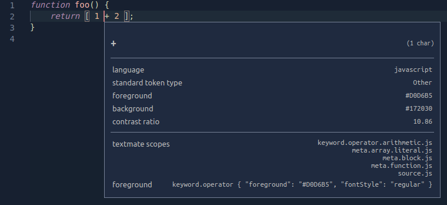
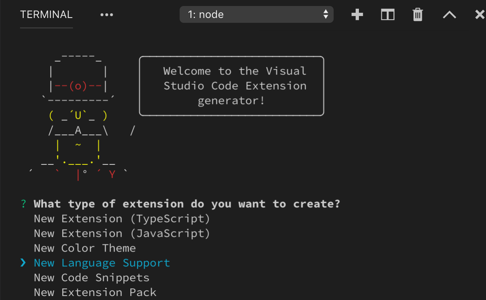
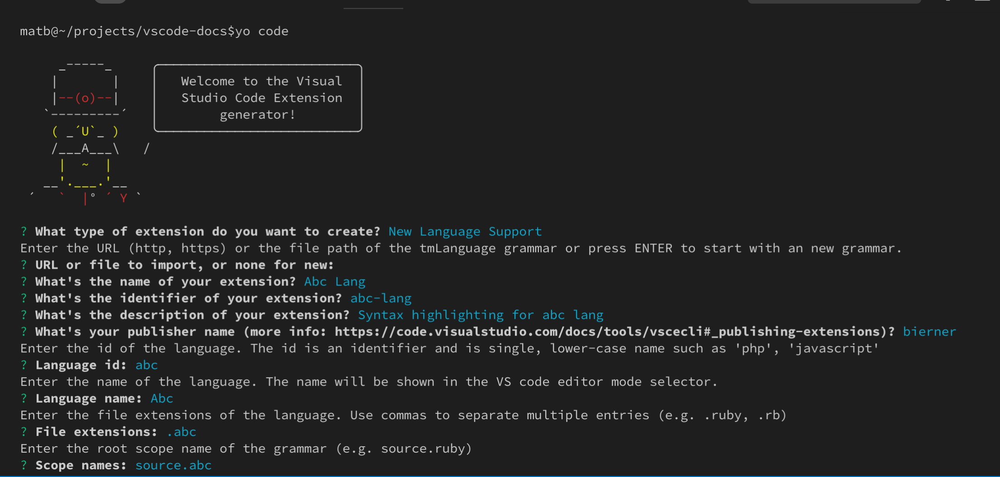
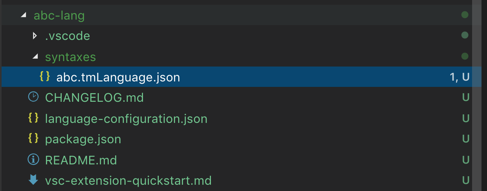
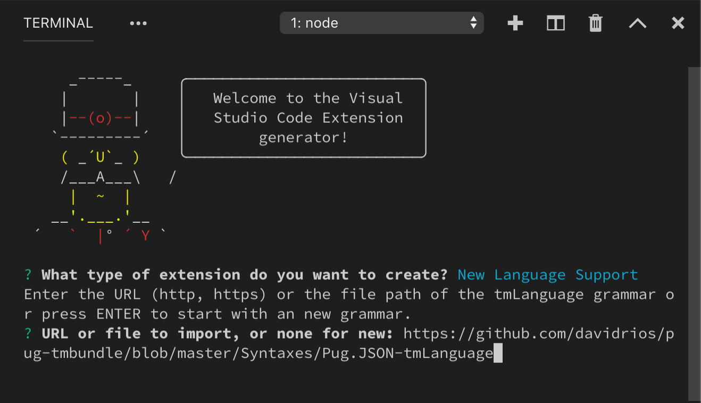
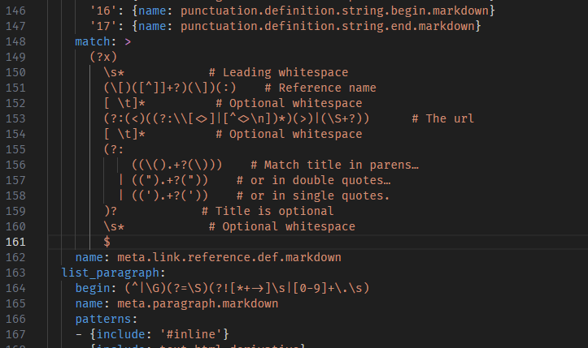
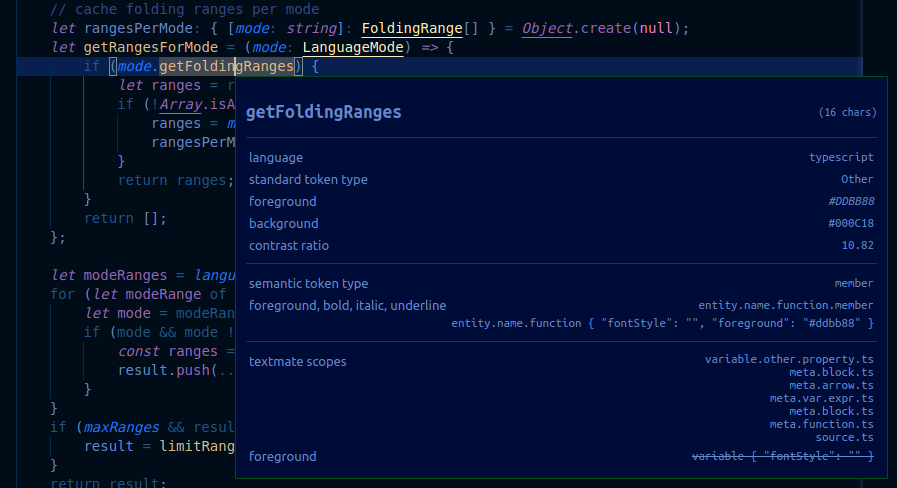

# 语法高亮指南

语法高亮决定了源代码在 Visual Studio Code 编辑器中显示的颜色和样式。它负责将 JavaScript 中的 `if` 或 `for` 等关键字以不同于字符串、注释和变量名的颜色进行着色。

语法高亮包含两个组成部分：

- [分词](#tokenization)：将文本拆分为 token 列表
- [主题化](#theming)：使用主题或用户设置将 token 映射到特定的颜色和样式

在深入了解细节之前，建议先使用 [scope inspector](#scope-inspector) 工具来探索源文件中存在哪些 token 以及它们匹配了哪些主题规则。若要同时查看语义 token 和语法 token，请在 TypeScript 文件上使用内置主题（例如 Dark+）。

## Tokenization（分词）

文本的分词是指将文本拆分为多个片段，并为每个片段分类一个 token 类型。

VS Code 的分词引擎由 [TextMate 语法][tm-grammars] 驱动。TextMate 语法是一组结构化的正则表达式集合，以 plist（XML）或 JSON 文件编写。VS Code 扩展可以通过 `grammars` 贡献点来提供语法。

TextMate 分词引擎与渲染器在同一进程中运行，token 会在用户输入时实时更新。Token 不仅用于语法高亮，还用于将源代码分类为注释、字符串、正则表达式等区域。

从 1.43 版本开始，VS Code 还允许扩展通过 [Semantic Token Provider](/vscode/extension/references/vscode-api#DocumentSemanticTokensProvider) 提供分词功能。语义提供者通常由 Language Server 实现，它们对源文件有更深入的理解，能够在项目上下文中解析符号。例如，常量变量名可以在整个项目中使用常量高亮来渲染，而不仅仅是在声明处。

基于语义 token 的高亮是对基于 TextMate 的语法高亮的补充。语义高亮建立在语法高亮之上。由于 Language Server 需要时间来加载和分析项目，语义 token 高亮可能会有短暂延迟后才会出现。

本文重点介绍基于 TextMate 的分词。语义分词和主题化在[语义高亮指南](semantic-highlight-guide)中说明。

### TextMate 语法

VS Code 使用 [TextMate 语法][tm-grammars] 作为语法分词引擎。TextMate 语法最初为 TextMate 编辑器发明，由于开源社区创建和维护了大量语言包，它们已被许多其他编辑器和 IDE 采用。

TextMate 语法依赖于 [Oniguruma 正则表达式](https://macromates.com/manual/en/regular_expressions)，通常以 plist 或 JSON 格式编写。你可以在[这里](https://www.apeth.com/nonblog/stories/textmatebundle.html)找到关于 TextMate 语法的良好介绍，也可以查看现有的 TextMate 语法来了解更多工作原理。

### TextMate token 和作用域

Token 是属于同一程序元素的一个或多个字符。例如，`+` 和 `*` 等运算符，`myVar` 等变量名，或 `"my string"` 等字符串都是 token。

每个 token 关联一个作用域，该作用域定义了 token 的上下文。作用域是以点分隔的标识符列表，用于指定当前 token 的上下文。例如，JavaScript 中的 `+` 运算符具有 `keyword.operator.arithmetic.js` 作用域。

主题将作用域映射到颜色和样式以提供语法高亮。TextMate 提供了[常见作用域列表][tm-grammars]，许多主题都以这些作用域为目标。为了使你的语法获得尽可能广泛的支持，尽量基于现有作用域构建，而不是定义新的作用域。

作用域可以嵌套，因此每个 token 还关联一个父作用域列表。下面的示例使用 [scope inspector](#scope-inspector) 显示了一个简单 JavaScript 函数中 `+` 运算符的作用域层次结构。最具体的作用域列在顶部，更一般的父作用域列在下方：



父作用域信息也用于主题化。当主题针对某个作用域时，所有具有该父作用域的 token 都会被着色，除非主题还为它们各自的作用域提供了更具体的着色规则。

### 配置括号匹配作用域

某些语言包含的 token 虽然在视觉上类似括号，但不应参与括号匹配。

有两个属性可用于配置括号匹配行为：

- `balancedBracketScopes`：定义哪些作用域参与括号匹配。默认包含所有作用域。
- `unbalancedBracketScopes`：定义应从括号匹配中排除的作用域。

```json
{
  "unbalancedBracketScopes": [
    "meta.scope.case-pattern.shell"
  ]
}
```

### 贡献基本语法

VS Code 支持 JSON 格式的 TextMate 语法。它们通过 `grammars` [贡献点](/vscode/extension/references/contribution-points)进行贡献。

每个语法贡献指定：语法适用的语言标识符、语法 token 的顶层作用域名称，以及语法文件的相对路径。下面的示例展示了一个虚构的 `abc` 语言的语法贡献：

```json
{
  "contributes": {
    "languages": [
      {
        "id": "abc",
        "extensions": [".abc"]
      }
    ],
    "grammars": [
      {
        "language": "abc",
        "scopeName": "source.abc",
        "path": "./syntaxes/abc.tmGrammar.json"
      }
    ]
  }
}
```

语法文件本身由一个顶层规则组成。这通常分为一个 `patterns` 部分（列出程序的顶层元素）和一个 `repository`（定义各个元素）。语法中的其他规则可以使用 `{ "include": "#id" }` 来引用 `repository` 中的元素。

示例 `abc` 语法将字母 `a`、`b` 和 `c` 标记为关键字，将括号嵌套标记为表达式。

```json
{
  "scopeName": "source.abc",
  "patterns": [{ "include": "#expression" }],
  "repository": {
    "expression": {
      "patterns": [{ "include": "#letter" }, { "include": "#paren-expression" }]
    },
    "letter": {
      "match": "a|b|c",
      "name": "keyword.letter"
    },
    "paren-expression": {
      "begin": "\\(",
      "end": "\\)",
      "beginCaptures": {
        "0": { "name": "punctuation.paren.open" }
      },
      "endCaptures": {
        "0": { "name": "punctuation.paren.close" }
      },
      "name": "expression.group",
      "patterns": [{ "include": "#expression" }]
    }
  }
}
```

语法引擎会尝试依次将 `expression` 规则应用于文档中的所有文本。对于如下简单程序：

```
a
(
    b
)
x
(
    (
        c
        xyz
    )
)
(
a
```

示例语法产生以下作用域（从左到右列出，从最具体到最不具体的作用域）：

```
a               keyword.letter, source.abc
(               punctuation.paren.open, expression.group, source.abc
    b           keyword.letter, expression.group, source.abc
)               punctuation.paren.close, expression.group, source.abc
x               source.abc
(               punctuation.paren.open, expression.group, source.abc
    (           punctuation.paren.open, expression.group, expression.group, source.abc
        c       keyword.letter, expression.group, expression.group, source.abc
        xyz     expression.group, expression.group, source.abc
    )           punctuation.paren.close, expression.group, expression.group, source.abc
)               punctuation.paren.close, expression.group, source.abc
(               punctuation.paren.open, expression.group, source.abc
a               keyword.letter, expression.group, source.abc
```

注意，未被任何规则匹配的文本（如字符串 `xyz`）会包含在当前作用域中。文件末尾的最后一个括号属于 `expression.group`，即使 `end` 规则没有匹配到，因为在找到 `end` 规则之前已经到达了文件末尾。

### 嵌入式语言

如果你的语法在父语言中包含嵌入式语言（例如 HTML 中的 CSS 样式块），可以使用 `embeddedLanguages` 贡献点来告诉 VS Code 将嵌入式语言视为与父语言不同的语言。这确保括号匹配、注释和其他基本语言功能在嵌入式语言中能正常工作。

`embeddedLanguages` 贡献点将嵌入式语言中的作用域映射到顶层语言作用域。在下面的示例中，`meta.embedded.block.javascript` 作用域中的所有 token 将被视为 JavaScript 内容：

```json
{
  "contributes": {
    "grammars": [
      {
        "path": "./syntaxes/abc.tmLanguage.json",
        "scopeName": "source.abc",
        "embeddedLanguages": {
          "meta.embedded.block.javascript": "javascript"
        }
      }
    ]
  }
}
```

现在，如果你尝试在标记为 `meta.embedded.block.javascript` 的 token 集合中注释代码或触发代码片段，将会得到正确的 `//` JavaScript 风格注释和正确的 JavaScript 代码片段。

### 开发新的语法扩展

要快速创建新的语法扩展，可以使用 [VS Code 的 Yeoman 模板](/vscode/extension/get-started/your-first-extension)运行 `yo code` 并选择 `New Language` 选项：



Yeoman 会引导你回答一些基本问题来搭建新扩展。创建新语法时的重要问题有：

- `Language id` - 你的语言的唯一标识符。
- `Language name` - 你的语言的可读名称。
- `Scope names` - 你的语法的根 TextMate 作用域名称。



生成器假定你要为一种新语言定义新语法。如果你要为现有语言创建语法，只需填入目标语言的信息，并确保删除生成的 `package.json` 中的 `languages` 贡献点。

回答所有问题后，Yeoman 将创建具有以下结构的新扩展：



请记住，如果你要为 VS Code 已知的语言贡献语法，务必删除生成的 `package.json` 中的 `languages` 贡献点。

#### 转换现有 TextMate 语法

`yo code` 还可以帮助将现有 TextMate 语法转换为 VS Code 扩展。同样，先运行 `yo code` 并选择 `Language extension`。当询问现有语法文件时，提供 `.tmLanguage` 或 `.json` TextMate 语法文件的完整路径：



#### 使用 YAML 编写语法

随着语法变得越来越复杂，以 JSON 格式理解和维护它可能会变得困难。如果你发现自己在编写复杂的正则表达式或需要添加注释来解释语法的某些方面，请考虑使用 YAML 来定义语法。

YAML 语法与 JSON 语法具有完全相同的结构，但允许你使用 YAML 更简洁的语法，以及多行字符串和注释等功能。



VS Code 只能加载 JSON 语法，因此基于 YAML 的语法必须转换为 JSON。[`js-yaml` 包](https://www.npmjs.com/package/js-yaml)和命令行工具使这一操作非常简单。

```bash
# Install js-yaml as a development only dependency in your extension
$ npm install js-yaml --save-dev

# Use the command-line tool to convert the yaml grammar to json
$ npx js-yaml syntaxes/abc.tmLanguage.yaml > syntaxes/abc.tmLanguage.json
```

### 注入语法

注入语法允许你扩展现有语法。注入语法是一个常规的 TextMate 语法，被注入到现有语法中的特定作用域。注入语法的应用示例：

- 高亮注释中的 `TODO` 等关键字。
- 向现有语法添加更具体的作用域信息。
- 为 Markdown 围栏代码块添加新语言的高亮。

#### 创建基本注入语法

注入语法通过 `package.json` 贡献，与常规语法相同。但是，注入语法不指定 `language`，而是使用 `injectTo` 指定要注入语法的目标语言作用域列表。

在此示例中，我们将创建一个简单的注入语法，将 JavaScript 注释中的 `TODO` 高亮为关键字。为了在 JavaScript 文件中应用我们的注入语法，我们在 `injectTo` 中使用 `source.js` 目标语言作用域：

```json
{
  "contributes": {
    "grammars": [
      {
        "path": "./syntaxes/injection.json",
        "scopeName": "todo-comment.injection",
        "injectTo": ["source.js"]
      }
    ]
  }
}
```

语法本身是一个标准的 TextMate 语法，除了顶层的 `injectionSelector` 条目。`injectionSelector` 是一个作用域选择器，指定注入语法应该应用于哪些作用域。对于我们的示例，我们希望高亮所有 `//` 注释中的 `TODO`。使用 [scope inspector](#scope-inspector)，我们发现 JavaScript 的双斜杠注释具有 `comment.line.double-slash` 作用域，因此我们的注入选择器为 `L:comment.line.double-slash`：

```json
{
  "scopeName": "todo-comment.injection",
  "injectionSelector": "L:comment.line.double-slash",
  "patterns": [
    {
      "include": "#todo-keyword"
    }
  ],
  "repository": {
    "todo-keyword": {
      "match": "TODO",
      "name": "keyword.todo"
    }
  }
}
```

注入选择器中的 `L:` 表示注入被添加到现有语法规则的左侧。这基本上意味着我们注入的语法规则将在任何现有语法规则之前被应用。

#### 嵌入式语言

注入语法也可以向其父语法贡献嵌入式语言。与常规语法一样，注入语法可以使用 `embeddedLanguages` 将嵌入式语言的作用域映射到顶层语言作用域。

例如，一个在 JavaScript 字符串中高亮 SQL 查询的扩展可以使用 `embeddedLanguages` 来确保标记为 `meta.embedded.inline.sql` 的字符串内的所有 token 对于基本语言功能（如括号匹配和代码片段选择）被视为 SQL。

```json
{
  "contributes": {
    "grammars": [
      {
        "path": "./syntaxes/injection.json",
        "scopeName": "sql-string.injection",
        "injectTo": ["source.js"],
        "embeddedLanguages": {
          "meta.embedded.inline.sql": "sql"
        }
      }
    ]
  }
}
```

#### Token 类型和嵌入式语言

注入语法的嵌入式语言还有一个额外的复杂性：默认情况下，VS Code 将字符串中的所有 token 视为字符串内容，将注释中的所有 token 视为注释内容。由于括号匹配和自动闭合对等功能在字符串和注释内是被禁用的，如果嵌入式语言出现在字符串或注释中，这些功能在嵌入式语言中也会被禁用。

要覆盖此行为，可以使用 `meta.embedded.*` 作用域来重置 VS Code 对 token 的字符串或注释内容标记。建议始终将嵌入式语言包裹在 `meta.embedded.*` 作用域中，以确保 VS Code 正确处理嵌入式语言。

如果你无法在语法中添加 `meta.embedded.*` 作用域，也可以使用语法贡献点中的 `tokenTypes` 将特定作用域映射到内容模式。下面的 `tokenTypes` 配置确保 `my.sql.template.string` 作用域中的所有内容被视为源代码：

```json
{
  "contributes": {
    "grammars": [
      {
        "path": "./syntaxes/injection.json",
        "scopeName": "sql-string.injection",
        "injectTo": ["source.js"],
        "embeddedLanguages": {
          "my.sql.template.string": "sql"
        },
        "tokenTypes": {
          "my.sql.template.string": "other"
        }
      }
    ]
  }
}
```

## Theming（主题化）

主题化是为 token 分配颜色和样式的过程。主题化规则在颜色主题中指定，但用户可以在用户设置中自定义主题化规则。

TextMate 主题规则在 `tokenColors` 中定义，其语法与常规 TextMate 主题相同。每条规则定义一个 TextMate 作用域选择器和相应的颜色与样式。

在评估 token 的颜色和样式时，当前 token 的作用域会与规则的选择器进行匹配，以为每个样式属性（前景色、粗体、斜体、下划线）找到最具体的规则。

[颜色主题指南](/vscode/extension/extension-guides/color-theme#syntax-colors)描述了如何创建颜色主题。语义 token 的主题化在[语义高亮指南](semantic-highlight-guide#theming)中说明。

## Scope inspector（作用域检查器）

VS Code 内置的作用域检查器工具有助于调试语法和语义 token。它显示文件当前位置的 token 作用域和语义 token，以及关于哪些主题规则应用于该 token 的元数据。

通过命令面板使用 `Developer: Inspect Editor Tokens and Scopes` 命令触发作用域检查器，或为其[创建快捷键绑定](/docs/getstarted/keybindings)：

```json
{
  "key": "cmd+alt+shift+i",
  "command": "editor.action.inspectTMScopes"
}
```



作用域检查器显示以下信息：

1. 当前 token。
1. 关于 token 的元数据及其计算外观的信息。如果你正在处理嵌入式语言，这里重要的条目是 `language` 和 `token type`。
1. 当当前语言有语义 token 提供者且当前主题支持语义高亮时，会显示语义 token 部分。它显示当前语义 token 类型和修饰符，以及匹配该语义 token 类型和修饰符的主题规则。
1. TextMate 部分显示当前 TextMate token 的作用域列表，最具体的作用域在顶部。它还显示匹配这些作用域的最具体的主题规则。这里只显示负责 token 当前样式的主题规则，不显示被覆盖的规则。如果存在语义 token，则仅当主题规则与匹配语义 token 的规则不同时才显示。

[tm-grammars]: https://macromates.com/manual/en/language_grammars
