# Contribution Points

**Contribution Points** 是一组 JSON 声明，定义在 `package.json` [Extension Manifest](/vscode/extension/references/extension-manifest) 的 `contributes` 字段中。你的扩展通过注册 **Contribution Points** 来扩展 Visual Studio Code 的各项功能。以下是所有可用的 **Contribution Points** 列表：

- [`authentication`](/vscode/extension/references/contribution-points#contributes.authentication)
- [`breakpoints`](/vscode/extension/references/contribution-points#contributes.breakpoints)
- [`chatInstructions`](/vscode/extension/references/contribution-points#contributes.chatInstructions)
- [`chatPromptFiles`](/vscode/extension/references/contribution-points#contributes.chatPromptFiles)
- [`chatSkills`](/vscode/extension/references/contribution-points#contributes.chatSkills)
- [`colors`](/vscode/extension/references/contribution-points#contributes.colors)
- [`commands`](/vscode/extension/references/contribution-points#contributes.commands)
- [`configuration`](/vscode/extension/references/contribution-points#contributes.configuration)
- [`configurationDefaults`](/vscode/extension/references/contribution-points#contributes.configurationDefaults)
- [`customEditors`](/vscode/extension/references/contribution-points#contributes.customEditors)
- [`debuggers`](/vscode/extension/references/contribution-points#contributes.debuggers)
- [`grammars`](/vscode/extension/references/contribution-points#contributes.grammars)
- [`icons`](/vscode/extension/references/contribution-points#contributes.icons)
- [`iconThemes`](/vscode/extension/references/contribution-points#contributes.iconThemes)
- [`jsonValidation`](/vscode/extension/references/contribution-points#contributes.jsonValidation)
- [`keybindings`](/vscode/extension/references/contribution-points#contributes.keybindings)
- [`languages`](/vscode/extension/references/contribution-points#contributes.languages)
- [`menus`](/vscode/extension/references/contribution-points#contributes.menus)
- [`problemMatchers`](/vscode/extension/references/contribution-points#contributes.problemMatchers)
- [`problemPatterns`](/vscode/extension/references/contribution-points#contributes.problemPatterns)
- [`productIconThemes`](/vscode/extension/references/contribution-points#contributes.productIconThemes)
- [`resourceLabelFormatters`](/vscode/extension/references/contribution-points#contributes.resourceLabelFormatters)
- [`semanticTokenModifiers`](/vscode/extension/references/contribution-points#contributes.semanticTokenModifiers)
- [`semanticTokenScopes`](/vscode/extension/references/contribution-points#contributes.semanticTokenScopes)
- [`semanticTokenTypes`](/vscode/extension/references/contribution-points#contributes.semanticTokenTypes)
- [`snippets`](/vscode/extension/references/contribution-points#contributes.snippets)
- [`submenus`](/vscode/extension/references/contribution-points#contributes.submenus)
- [`taskDefinitions`](/vscode/extension/references/contribution-points#contributes.taskDefinitions)
- [`terminal`](/vscode/extension/references/contribution-points#contributes.terminal)
- [`themes`](/vscode/extension/references/contribution-points#contributes.themes)
- [`typescriptServerPlugins`](/vscode/extension/references/contribution-points#contributes.typescriptServerPlugins)
- [`views`](/vscode/extension/references/contribution-points#contributes.views)
- [`viewsContainers`](/vscode/extension/references/contribution-points#contributes.viewsContainers)
- [`viewsWelcome`](/vscode/extension/references/contribution-points#contributes.viewsWelcome)
- [`walkthroughs`](/vscode/extension/references/contribution-points#contributes.walkthroughs)

## contributes.authentication

声明一个身份验证提供程序。这会为你的提供程序设置激活事件，并将其显示在扩展的功能列表中。

```json
{
  "contributes": {
    "authentication": [
      {
        "label": "Azure DevOps",
        "id": "azuredevops"
      }
    ]
  }
}
```

## contributes.breakpoints

通常，调试器扩展还会包含一个 `contributes.breakpoints` 条目，用于列出允许设置断点的语言文件类型。

```json
{
  "contributes": {
    "breakpoints": [
      {
        "language": "javascript"
      },
      {
        "language": "javascriptreact"
      }
    ]
  }
}
```

## contributes.chatInstructions

为 Copilot Chat 声明[指令文件](/docs/copilot/customization/custom-instructions.md)。指令文件提供了自定义准则，会自动包含在聊天请求中，用于引导 Copilot 的行为。使用此贡献点可以将可复用的指令与你的扩展打包在一起，例如编码规范、特定框架的指南或特定领域的规则。

当用户的聊天请求与指令的使用场景相关时，Copilot 会自动应用已声明的指令，无需手动附加。

每个条目需要一个指向 Markdown 文件的 `path`，路径相对于扩展根目录。你可以选择性地指定一个 `when` 子句来控制指令何时启用。请在 Markdown 文件本身中指定 `name` 和 `description` 元数据，而不是在贡献点中指定。

```json
{
  "contributes": {
    "chatInstructions": [
      {
        "path": "./prompts/textMateGuidelines.instructions.md"
      }
    ]
  }
}
```

你可以使用可选的 `when` 子句，根据上下文条件性地启用指令：

```json
{
  "contributes": {
    "chatInstructions": [
      {
        "path": "./prompts/textMateGuidelines.instructions.md",
        "when": "resourceExtname == .tmLanguage"
      }
    ]
  }
}
```

### chatInstructions 属性

| 属性 | 类型 | 必填 | 说明 |
| -------- | ---- | -------- | ----------- |
| `path` | `string` | 是 | 相对于扩展根目录的 Markdown 文件路径。该路径必须解析到扩展内部的位置。 |
| `when` | `string` | 否 | 一个 [when 子句](/vscode/extension/references/when-clause-contexts)条件，必须为 true 时此条目才会启用。 |

参见 [`chatPromptFiles`](/vscode/extension/references/contribution-points#contributes.chatPromptFiles) 贡献点，用于声明可复用的提示文件。

## contributes.chatPromptFiles

为 Copilot Chat 声明[提示文件](/docs/copilot/customization/custom-instructions.md)。提示文件是可复用的聊天提示，用户可以在聊天中作为斜杠命令调用。使用此贡献点可以将现成的提示与你的扩展打包在一起。

每个条目需要一个指向 Markdown 文件的 `path`，路径相对于扩展根目录。你可以选择性地指定一个 `when` 子句来条件性地启用该提示。请在 Markdown 文件本身中指定 `name` 和 `description` 元数据，而不是在贡献点中指定。

```json
{
  "contributes": {
    "chatPromptFiles": [
      {
        "path": "./prompts/reviewAndCreateIssue.prompt.md"
      }
    ]
  }
}
```

### chatPromptFiles 属性

| 属性 | 类型 | 必填 | 说明 |
| -------- | ---- | -------- | ----------- |
| `path` | `string` | 是 | 相对于扩展根目录的 Markdown 文件路径。该路径必须解析到扩展内部的位置。 |
| `when` | `string` | 否 | 一个 [when 子句](/vscode/extension/references/when-clause-contexts)条件，必须为 true 时此条目才会启用。 |

参见 [`chatInstructions`](/vscode/extension/references/contribution-points#contributes.chatInstructions) 贡献点，用于声明可复用的指令文件。

## contributes.chatSkills

为 Copilot Chat 声明 [Agent Skills](/docs/copilot/customization/agent-skills.md)。Agent Skills 是包含指令、脚本和资源的文件夹，Copilot 可以在相关场景下加载它们以执行专门的任务。使用此贡献点可以将可复用的技能与你的扩展打包在一起。

每个条目需要一个指向 `SKILL.md` 文件的 `path`，路径相对于扩展根目录。`SKILL.md` 文件必须遵循 [Agent Skills 规范](https://agentskills.io/specification)，且其 `name` 字段必须与父目录名称一致。你可以选择性地指定一个 `when` 子句来条件性地启用该技能。

```json
{
  "contributes": {
    "chatSkills": [
      {
        "path": "./skills/my-skill/SKILL.md"
      }
    ]
  }
}
```

### chatSkills 属性

| 属性 | 类型 | 必填 | 说明 |
| -------- | ---- | -------- | ----------- |
| `path` | `string` | 是 | 相对于扩展根目录的 `SKILL.md` 文件路径。该路径必须解析到扩展内部的位置，且父目录名称必须与 `SKILL.md` 中的 `name` 字段一致。 |
| `when` | `string` | 否 | 一个 [when 子句](/vscode/extension/references/when-clause-contexts)条件，必须为 true 时此条目才会启用。 |

参见[从扩展中声明技能](/docs/copilot/customization/agent-skills.md#contribute-skills-from-extensions)，了解所需的技能结构和 `SKILL.md` 格式。

## contributes.colors

声明新的可主题化颜色。这些颜色可以被扩展用于编辑器装饰器和状态栏。一旦定义，用户可以在 `workspace.colorCustomization` 设置中自定义颜色，用户主题也可以设置颜色值。

```json
{
  "contributes": {
    "colors": [
      {
        "id": "superstatus.error",
        "description": "Color for error message in the status bar.",
        "defaults": {
          "dark": "errorForeground",
          "light": "errorForeground",
          "highContrast": "#010203",
          "highContrastLight": "#feedc3",
        }
      }
    ]
  }
}
```

颜色默认值可以分别针对浅色、深色和高对比度主题进行定义，可以引用已有颜色，也可以使用[颜色十六进制值](/vscode/extension/references/theme-color#color-formats)。

扩展可以通过 `ThemeColor` API 使用新增和已有的主题颜色：

```ts
const errorColor = new vscode.ThemeColor("superstatus.error");
```

## contributes.commands

声明命令的 UI，包括标题以及（可选的）图标、类别和启用状态。启用状态通过 [when 子句](/vscode/extension/references/when-clause-contexts)表示。默认情况下，命令会显示在**命令面板**（`kb(workbench.action.showCommands)`）中，但也可以显示在其他[菜单](/vscode/extension/references/contribution-points#contributes.menus)中。

已声明命令的展示方式取决于所在菜单。例如，**命令面板**会在命令前加上 `category` 前缀，以便于分组。但**命令面板**不会显示图标，也不会显示已禁用的命令。而编辑器上下文菜单则会显示已禁用的项目，但不会显示类别标签。

> **注意：** 当命令被调用时（通过快捷键、**命令面板**、其他菜单或编程方式），VS Code 会触发激活事件 `onCommand:${command}`。

> **注意：** 当使用[产品图标](/vscode/extension/references/icons-in-labels#icon-listing)中的图标时，设置 `light` 和 `dark` 会导致图标无法显示。
> 正确的语法是 `"icon": "$(book)"`

### 命令示例

```json
{
  "contributes": {
    "commands": [
      {
        "command": "extension.sayHello",
        "title": "Hello World",
        "category": "Hello",
        "icon": {
          "light": "path/to/light/icon.svg",
          "dark": "path/to/dark/icon.svg"
        }
      }
    ]
  }
}
```

参阅[命令扩展指南](https://code.visualstudio.com/api/extension-guides/command)，了解更多关于在 VS Code 扩展中使用命令的信息。

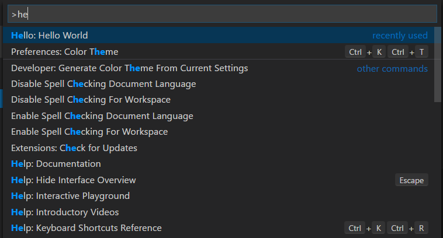

### 命令图标规范

- `尺寸：` 图标应为 16x16 像素，包含 1 像素内边距（图像本身为 14x14），居中显示。
- `颜色：` 图标应使用单一颜色。
- `格式：` 建议使用 SVG 格式的图标，但也接受其他图片格式。

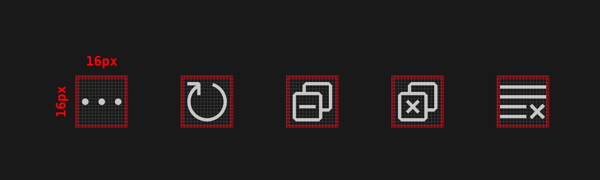

## contributes.configuration

声明将向用户暴露的设置。用户可以在设置编辑器中或通过直接编辑 settings.json 文件来配置这些选项。

此部分可以是单个对象（表示单个设置类别），也可以是对象数组（表示多个设置类别）。如果有多个设置类别，设置编辑器会在该扩展的目录中显示一个子菜单，并使用 title 键值作为子菜单条目的名称。

### 配置示例

```json
{
  "contributes": {
    "configuration": {
      "title": "Settings Editor Test Extension",
      "type": "object",
      "properties": {
        "settingsEditorTestExtension.booleanExample": {
          "type": "boolean",
          "default": true,
          "description": "Boolean Example"
        },
        "settingsEditorTestExtension.stringExample": {
          "type": "string",
          "default": "Hello World",
          "description": "String Example"
        }
      }
    }
  }
}
```

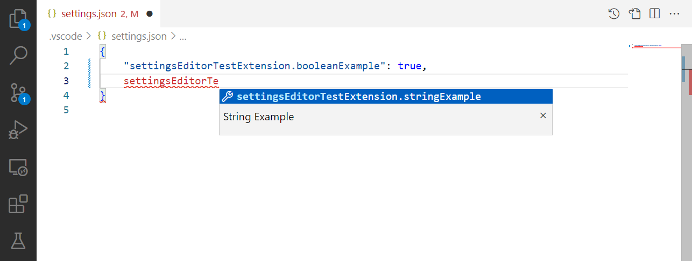

你可以在扩展中使用 `vscode.workspace.getConfiguration('myExtension')` 来读取这些值。

### 配置 schema

你的配置条目既用于在 JSON 编辑器中编辑设置时提供智能提示，也用于定义它们在设置 UI 中的显示方式。

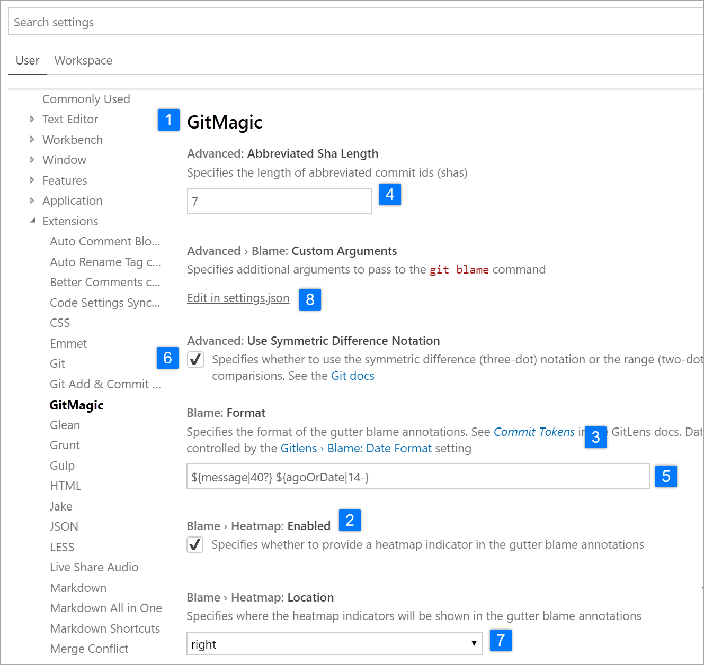

#### title

某个类别的 `title` 1️⃣️ 是该类别使用的标题。

```json
{
  "configuration": {
    "title": "GitMagic"
  }
}
```

对于具有多个设置类别的扩展，如果某个类别的标题与扩展的显示名称相同，设置 UI 会将该类别视为"默认类别"，忽略该类别的 `order` 字段，并将其设置放在扩展主标题下方。

对于 `title` 和 `displayName` 字段，"Extension"、"Configuration" 和 "Settings" 等词语是多余的。

- ✔ `"title": "GitMagic"`
- ❌ `"title": "GitMagic Extension"`
- ❌ `"title": "GitMagic Configuration"`
- ❌ `"title": "GitMagic Extension Configuration Settings"`

#### properties

`configuration` 对象中的 `properties` 2️⃣ 会形成一个字典，其中键是设置 ID，值提供该设置的更多信息。虽然一个扩展可以包含多个设置类别，但扩展中的每个设置仍必须有自己唯一的 ID。一个设置 ID 不能是另一个设置 ID 的完整前缀。

没有显式 `order` 字段的属性将在设置 UI 中按字典序排列（**不是**它们在 manifest 中列出的顺序）。

### 设置标题

在设置 UI 中，会使用多个字段来构建每个设置的显示标题。键中的大写字母用于表示单词的分隔。

#### 单一类别和默认类别配置的显示标题

如果配置只有一个设置类别，或者该类别的标题与扩展的显示名称相同，那么对于该类别中的设置，设置 UI 会使用设置 ID 和扩展的 `name` 字段来确定显示标题。

例如，对于设置 ID `gitMagic.blame.dateFormat` 和扩展名称 `authorName.gitMagic`，由于设置 ID 的前缀与扩展名称的后缀匹配，设置 ID 中的 `gitMagic` 部分会在显示标题中被移除："Blame: **Date Format**"。

#### 多类别配置的显示标题

如果配置有多个设置类别，且该类别的标题与扩展的显示名称不同，那么对于该类别中的设置，设置 UI 会使用设置 ID 和类别的 `id` 字段来确定显示标题。

例如，对于设置 ID `css.completion.completePropertyWithSemicolon` 和类别 ID `css`，由于设置 ID 的前缀与类别 ID 的后缀匹配，设置 ID 中的 `css` 部分会在设置 UI 中被移除，生成的设置标题为 "Completion: **Complete Property With Semicolon**"。

### 配置属性 schema

配置键使用 [JSON Schema](https://json-schema.org/overview/what-is-jsonschema) 的超集来定义。

#### description / markdownDescription

你的 `description` 3️⃣ 出现在标题之后、输入字段之前，但对于布尔类型，描述会作为复选框的标签。6️⃣

```json
{
  "gitMagic.blame.heatMap.enabled": {
    "description": "Specifies whether to provide a heatmap indicator in the gutter blame annotations"
  }
}
```

如果你使用 `markdownDescription` 而非 `description`，你的设置描述将在设置 UI 中被解析为 Markdown。

```json
{
  "gitMagic.blame.dateFormat": {
    "markdownDescription": "Specifies how to format absolute dates (e.g. using the `${date}` token) in gutter blame annotations. See the [Moment.js docs](https://momentjs.com/docs/#/displaying/format/) for valid formats"
  }
}
```

对于 `markdownDescription`，如需添加换行或多个段落，请使用 `\n\n` 来分隔段落，而非仅使用 `\n`。

#### type

`number` 4️⃣、`string` 5️⃣、`boolean` 6️⃣ 类型的条目可以在设置 UI 中直接编辑。

```json
{
  "gitMagic.views.pageItemLimit": {
    "type": "number",
    "default": 20,
    "markdownDescription": "Specifies the number of items to show in each page when paginating a view list. Use 0 to specify no limit"
  }
}
```

字符串类型设置如果在配置条目上设置了 `"editPresentation": "multilineText"`，则会以多行文本输入框的形式渲染。

对于 `boolean` 类型的条目，`markdownDescription`（如果未指定 `markdownDescription` 则使用 `description`）将作为复选框旁边的标签。

```json
{
  "gitMagic.blame.compact": {
    "type": "boolean",
    "description": "Specifies whether to compact (deduplicate) matching adjacent gutter blame annotations"
  }
}
```

部分 `object` 和 `array` 类型的设置可以在设置 UI 中渲染。`number`、`string` 或 `boolean` 的简单数组会被渲染为可编辑的列表。具有 `string`、`number`、`integer` 和/或 `boolean` 类型属性的对象会被渲染为可编辑的键值网格。对象设置还应将 `additionalProperties` 设置为 `false` 或具有适当 `type` 属性的对象，才能在 UI 中正确渲染。

如果 `object` 或 `array` 类型的设置还可以包含其他类型（如嵌套对象、数组或 null），则该值不会在设置 UI 中渲染，只能通过直接编辑 JSON 来修改。用户会看到一个**在 settings.json 中编辑**的链接，如上方截图所示。8️⃣

#### order

类别和类别中的设置都可以接受一个整数类型的 `order` 属性，用于指定它们相对于其他类别和/或设置的排序顺序。

如果两个类别都有 `order` 属性，则 `order` 值较小的类别排在前面。如果某个类别没有设置 `order` 属性，则它会排在设置了该属性的类别之后。

如果同一类别中的两个设置都有 `order` 属性，则 `order` 值较小的设置排在前面。如果同一类别中的另一个设置没有设置 `order` 属性，则它会排在该类别中设置了该属性的设置之后。

如果两个类别的 `order` 属性值相同，或者同一类别中的两个设置的 `order` 属性值相同，则它们将在设置 UI 中按字典序升序排列。

#### enum / enumDescriptions / markdownEnumDescriptions / enumItemLabels

如果你在 `enum` 7️⃣ 属性下提供一个数组，设置 UI 将渲染一个下拉菜单来展示这些选项。

你还可以提供一个 `enumDescriptions` 属性，它是一个与 `enum` 属性长度相同的字符串数组。`enumDescriptions` 属性会在设置 UI 的下拉菜单底部为每个 `enum` 选项提供对应的描述。\
你也可以使用 `markdownEnumDescriptions` 来代替 `enumDescriptions`，这样描述内容将被解析为 Markdown。`markdownEnumDescriptions` 优先于 `enumDescriptions`。\
要在设置 UI 中自定义下拉选项的显示名称，可以使用 `enumItemLabels`。

示例：

```json
{
  "settingsEditorTestExtension.enumSetting": {
    "type": "string",
    "enum": ["first", "second", "third"],
    "markdownEnumDescriptions": ["The *first* enum", "The *second* enum", "The *third* enum"],
    "enumItemLabels": ["1st", "2nd", "3rd"],
    "default": "first",
    "description": "Example setting with an enum"
  }
}
```

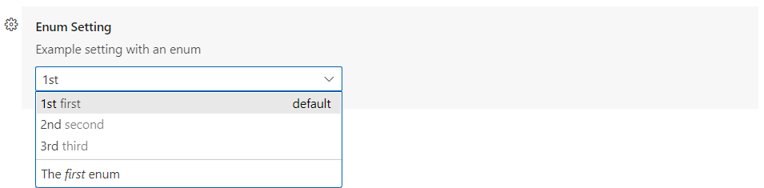

#### deprecationMessage / markdownDeprecationMessage

如果你设置了 `deprecationMessage` 或 `markdownDeprecationMessage`，该设置将会显示带有指定消息的警告下划线。同时，除非用户已配置该设置，否则它将在设置 UI 中被隐藏。如果你设置了 `markdownDeprecationMessage`，其中的 Markdown 不会在设置悬停提示或问题视图中渲染。如果你同时设置了两个属性，`deprecationMessage` 将显示在悬停提示和问题视图中，而 `markdownDeprecationMessage` 将在设置 UI 中以 Markdown 形式渲染。

示例：

```json
{
  "json.colorDecorators.enable": {
    "type": "boolean",
    "description": "Enables or disables color decorators",
    "markdownDeprecationMessage": "**Deprecated**: Please use `#editor.colorDecorators#` instead.",
    "deprecationMessage": "Deprecated: Please use editor.colorDecorators instead."
  }
}
```

#### 其他 JSON Schema 属性

你可以使用任何 JSON Schema 验证属性来描述配置值的其他约束：

- `default` 用于定义属性的默认值
- `minimum` 和 `maximum` 用于限制数值范围
- `maxLength`、`minLength` 用于限制字符串长度
- `pattern` 用于将字符串限制为指定的正则表达式
- `patternErrorMessage` 用于在模式不匹配时提供自定义错误消息
- `format` 用于将字符串限制为常见格式，例如 `date`、`time`、`ipv4`、`email` 和 `uri`
- `maxItems`、`minItems` 用于限制数组长度
- `editPresentation` 用于控制设置编辑器中字符串设置渲染为单行输入框还是多行文本区域

#### 不支持的 JSON Schema 属性

配置部分不支持以下属性：

- `$ref` 和 `definition`：配置模式必须是自包含的，不能对聚合后的设置 JSON 模式文档结构做假设。

有关这些功能及其他特性的更多详情，请参阅 [JSON Schema 参考](https://json-schema.org/overview/what-is-jsonschema)。

#### scope

配置设置可以具有以下作用域之一：

- `application` - 适用于所有 VS Code 实例的设置，只能在用户设置中配置。
- `machine` - 机器特定的设置，只能在用户设置或远程设置中配置。例如，不应在机器间共享的安装路径。这些设置的值不会被同步。
- `machine-overridable` - 机器特定的设置，可以被工作区或文件夹设置覆盖。这些设置的值不会被同步。
- `window` - 窗口（实例）特定的设置，可以在用户、工作区或远程设置中配置。
- `resource` - 资源设置，适用于文件和文件夹，可以在所有设置层级中配置，包括文件夹设置。
- `language-overridable` - 可以在语言级别被覆盖的资源设置。

配置作用域决定了设置何时通过设置编辑器对用户可用以及该设置是否适用。如果未声明 `scope`，默认值为 `window`。

以下是内置 Git 扩展的配置作用域示例：

```json
{
  "contributes": {
    "configuration": {
      "title": "Git",
      "properties": {
        "git.alwaysSignOff": {
          "type": "boolean",
          "scope": "resource",
          "default": false,
          "description": "%config.alwaysSignOff%"
        },
        "git.ignoredRepositories": {
          "type": "array",
          "default": [],
          "scope": "window",
          "description": "%config.ignoredRepositories%"
        },
        "git.autofetch": {
          "type": [
            "boolean",
            "string"
          ],
          "enum": [
            true,
            false,
            "all"
          ],
          "scope": "resource",
          "markdownDescription": "%config.autofetch%",
          "default": false,
          "tags": [
            "usesOnlineServices"
          ]
        }
      }
    }
  }
}
```

可以看到，`git.alwaysSignOff` 具有 `resource` 作用域，可以按用户、工作区或文件夹进行设置，而 `window` 作用域的忽略仓库列表则更全局地适用于 VS Code 窗口或工作区（可能是多根工作区）。

#### ignoreSync

你可以将 `ignoreSync` 设置为 `true`，以防止该设置与用户的设置进行同步。这对于非用户特定的设置非常有用。例如，`remoteTunnelAccess.machineName` 设置不是用户特定的，不应被同步。请注意，如果你已将 `scope` 设置为 `machine` 或 `machine-overridable`，则无论 `ignoreSync` 的值如何，该设置都不会被同步。

```json
{
  "contributes": {
    "configuration": {
      "properties": {
        "remoteTunnelAccess.machineName": {
          "type": "string",
          "default": "",
          "ignoreSync": true
        }
      }
    }
  }
}
```

#### 链接到设置

你可以在 Markdown 类型的属性中使用特殊语法 ``` `#target.setting.id#` ``` 来插入指向另一个设置的链接，该链接将在设置 UI 中渲染为可点击的链接。此语法适用于 `markdownDescription`、`markdownEnumDescriptions` 和 `markdownDeprecationMessage`。示例：

```json
  "files.autoSaveDelay": {
    "markdownDescription": "Controls the delay in ms after which a dirty editor is saved automatically. Only applies when `#files.autoSave#` is set to `afterDelay`.",
    // ...
  }
```

在设置 UI 中，渲染效果如下：

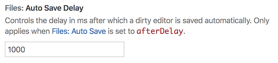

## contributes.configurationDefaults

为其他已注册的配置提供默认值，并覆盖其原有默认值。

以下示例将 `files.autoSave` 设置的默认行为覆盖为在焦点更改时自动保存文件。

```json
"configurationDefaults": {
      "files.autoSave": "onFocusChange"
}
```

你还可以为指定语言提供默认编辑器配置。例如，以下代码片段为 `markdown` 语言提供了默认编辑器配置：

```json
{
  "contributes": {
    "configurationDefaults": {
      "[markdown]": {
        "editor.wordWrap": "on",
        "editor.quickSuggestions": {
                "comments": "off",
                "strings": "off",
                "other": "off"
        }
      }
    }
  }
}
```

## contributes.customEditors

`customEditors` 贡献点用于让你的扩展向 VS Code 声明其所提供的自定义编辑器。例如，VS Code 需要知道你的自定义编辑器适用于哪些文件类型，以及如何在 UI 中标识你的自定义编辑器。

以下是一个基本的 `customEditor` 贡献示例，来自[自定义编辑器扩展示例](https://github.com/microsoft/vscode-extension-samples/tree/main/custom-editor-sample)：

```json
"contributes": {
  "customEditors": [
    {
      "viewType": "catEdit.catScratch",
      "displayName": "Cat Scratch",
      "selector": [
        {
          "filenamePattern": "*.cscratch"
        }
      ],
      "priority": "default"
    }
  ]
}
```

`customEditors` 是一个数组，因此你的扩展可以贡献多个自定义编辑器。

- `viewType` - 自定义编辑器的唯一标识符。

    VS Code 通过此标识将 `package.json` 中的自定义编辑器贡献与代码中的自定义编辑器实现关联起来。此标识在所有扩展中必须唯一，因此不要使用 `"preview"` 这样通用的 `viewType`，而应使用对你的扩展来说唯一的标识，例如 `"viewType": "myAmazingExtension.svgPreview"`。

- `displayName` - 在 VS Code UI 中标识自定义编辑器的名称。

    显示名称会在 VS Code UI 中向用户展示，例如在 **View: Reopen with** 下拉菜单中。

- `selector` - 指定自定义编辑器对哪些文件生效。

    `selector` 是一个包含一个或多个 [glob 模式](/docs/editor/glob-patterns)的数组。这些 glob 模式与文件名进行匹配，以确定是否可以使用自定义编辑器。例如 `*.png` 这样的 `filenamePattern` 将为所有 PNG 文件启用自定义编辑器。

    你还可以创建更具体的模式来匹配文件或目录名，例如 `**/translations/*.json`。

- `priority` - （可选）指定自定义编辑器的使用时机。

    `priority` 控制打开资源时何时使用自定义编辑器。可能的值有：

  - `"default"` - 尝试对每个匹配自定义编辑器 `selector` 的文件使用该自定义编辑器。如果某个文件有多个自定义编辑器，用户需要选择要使用哪一个。
  - `"option"` - 默认不使用自定义编辑器，但允许用户切换到它或将其配置为默认编辑器。

你可以在[自定义编辑器](/vscode/extension/extension-guides/custom-editors)扩展指南中了解更多信息。

## contributes.debuggers

为 VS Code 贡献一个调试器。调试器贡献具有以下属性：

- `type` 是唯一 ID，用于在启动配置中标识此调试器。
- `label` 是此调试器在 UI 中对用户可见的名称。
- `program` 是实现 VS Code 调试协议的调试适配器的路径，用于与真实调试器或运行时通信。
- `runtime` 如果调试适配器的路径不是可执行文件而是需要运行时来启动。
- `configurationAttributes` 是此调试器特有的启动配置参数的模式。请注意，不支持 `$ref` 和 `definition` 等 JSON 模式构造。
- `initialConfigurations` 列出用于填充初始 launch.json 的启动配置。
- `configurationSnippets` 列出在编辑 launch.json 时可通过 IntelliSense 使用的启动配置。
- `variables` 引入替换变量，并将其绑定到调试器扩展实现的命令。
- `languages` 此调试扩展可被视为"默认调试器"的语言。

### 调试器示例

```json
{
  "contributes": {
    "debuggers": [
      {
        "type": "node",
        "label": "Node Debug",

        "program": "./out/node/nodeDebug.js",
        "runtime": "node",

        "languages": ["javascript", "typescript", "javascriptreact", "typescriptreact"],

        "configurationAttributes": {
          "launch": {
            "required": ["program"],
            "properties": {
              "program": {
                "type": "string",
                "description": "The program to debug."
              }
            }
          }
        },

        "initialConfigurations": [
          {
            "type": "node",
            "request": "launch",
            "name": "Launch Program",
            "program": "${workspaceFolder}/app.js"
          }
        ],

        "configurationSnippets": [
          {
            "label": "Node.js: Attach Configuration",
            "description": "A new configuration for attaching to a running node program.",
            "body": {
              "type": "node",
              "request": "attach",
              "name": "${2:Attach to Port}",
              "port": 9229
            }
          }
        ],

        "variables": {
          "PickProcess": "extension.node-debug.pickNodeProcess"
        }
      }
    ]
  }
}
```

有关如何集成 `debugger` 的完整教程，请参阅[调试器扩展](/vscode/extension/extension-guides/debugger-extension)。

## contributes.grammars

为某种语言贡献 TextMate 语法。你必须提供此语法所适用的 `language`、语法的 TextMate `scopeName` 以及文件路径。

> **注意：** 包含语法的文件可以是 JSON 格式（文件名以 .json 结尾）或 XML plist 格式（其他所有文件）。

### 语法示例

```json
{
  "contributes": {
    "grammars": [
      {
        "language": "markdown",
        "scopeName": "text.html.markdown",
        "path": "./syntaxes/markdown.tmLanguage.json",
        "embeddedLanguages": {
          "meta.embedded.block.frontmatter": "yaml"
        }
      }
    ]
  }
}
```

请参阅[语法高亮指南](/vscode/extension/language-extensions/syntax-highlight-guide)，了解如何注册与语言关联的 TextMate 语法以获取语法高亮。

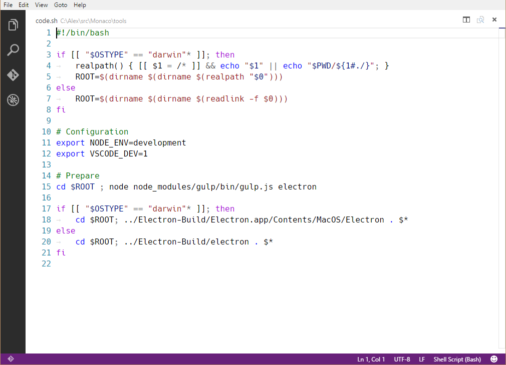

## contributes.icons

通过 ID 贡献新图标，并提供一个默认图标。该图标 ID 随后可被扩展（或任何依赖该扩展的其他扩展）用于任何可以使用 `ThemeIcon` 的地方，如 `new ThemeIcon("iconId")`、[Markdown 字符串](/vscode/extension/references/icons-in-labels#icon-in-labels)（`$(iconId)`）以及某些贡献点中的图标。

```json
{
  "contributes": {
    "icons": {
      "distro-ubuntu": {
        "description": "Ubuntu icon",
        "default": {
          "fontPath": "./distroicons.woff",
          "fontCharacter": "\\E001"
        }
      },
      "distro-fedora": {
        "description": "Ubuntu icon",
        "default": {
          "fontPath": "./distroicons.woff",
          "fontCharacter": "\\E002"
        }
      }
    }
  }
}
```

## contributes.iconThemes

为 VS Code 贡献文件图标主题。文件图标显示在文件名旁边，用于指示文件类型。

你必须指定一个 ID（用于设置中）、一个标签以及文件图标定义文件的路径。

### 文件图标主题示例

```json
{
  "contributes": {
    "iconThemes": [
      {
        "id": "my-cool-file-icons",
        "label": "Cool File Icons",
        "path": "./fileicons/cool-file-icon-theme.json"
      }
    ]
  }
}
```

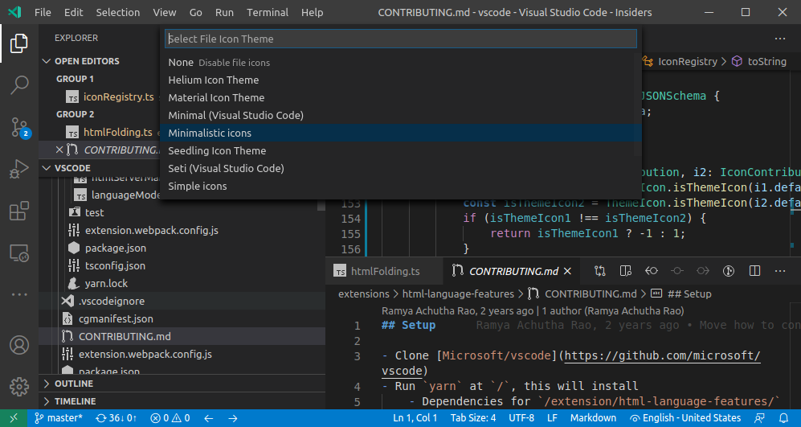

有关如何创建文件图标主题，请参阅[文件图标主题指南](/vscode/extension/extension-guides/file-icon-theme)。

## contributes.jsonValidation

为特定类型的 `json` 文件提供验证模式。`url` 值可以是扩展中包含的模式文件的本地路径，也可以是远程服务器 URL（例如 [json schema store](https://www.schemastore.org/)）。

```json
{
  "contributes": {
    "jsonValidation": [
      {
        "fileMatch": ".jshintrc",
        "url": "https://json.schemastore.org/jshintrc"
      }
    ]
  }
}
```

## contributes.keybindings

提供按键绑定规则，定义当用户按下某个组合键时应调用哪个命令。有关按键绑定的详细说明，请参阅[按键绑定](/docs/getstarted/keybindings)主题。

提供按键绑定后，默认键盘快捷方式中将显示你的规则，并且所有命令的 UI 表示形式都将显示你添加的按键绑定。当然，当用户按下该组合键时，命令将被调用。

> **注意：** 由于 VS Code 可在 Windows、macOS 和 Linux 上运行，而这些平台的修饰键不同，你可以使用 "key" 设置默认的组合键，然后用特定平台的设置覆盖它。

> **注意：** 当命令被调用时（通过按键绑定或命令面板），VS Code 将发出激活事件 `onCommand:${command}`。

### keybinding 示例

定义在 Windows 和 Linux 下使用 `kbstyle(Ctrl+F1)`、在 macOS 下使用 `kbstyle(Cmd+F1)` 来触发 `"extension.sayHello"` 命令：

```json
{
  "contributes": {
    "keybindings": [
      {
        "command": "extension.sayHello",
        "key": "ctrl+f1",
        "mac": "cmd+f1",
        "when": "editorTextFocus"
      }
    ]
  }
}
```

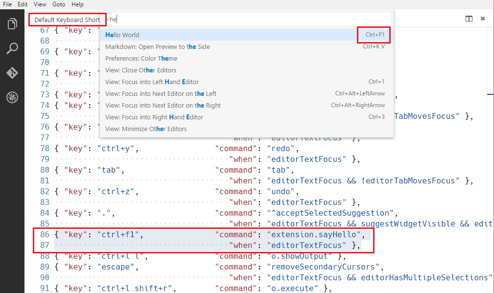

## contributes.languages

提供编程语言的定义。这可以引入一种新语言，或丰富 VS Code 对某种语言的认知。

`contributes.languages` 的主要作用：

- 定义一个 `languageId`，可在 VS Code API 的其他部分复用，例如 `vscode.TextDocument.languageId` 和 `onLanguage` 激活事件。
  - 你可以通过 `aliases` 字段提供一个易读的名称。列表中的第一项将作为易读标签使用。
- 将文件扩展名（`extensions`）、文件名（`filenames`）、文件名 [glob 模式](/docs/editor/glob-patterns)（`filenamePatterns`）、以特定行开头的文件（如 hashbang）（`firstLine`）以及 `mimetypes` 关联到该 `languageId`。
- 为所提供的语言提供一组[声明式语言功能](/vscode/extension/language-extensions/overview#declarative-language-features)。有关可配置的编辑功能，请参阅[语言配置指南](/vscode/extension/language-extensions/language-configuration-guide)。
- 提供一个图标，当文件图标主题中不包含该语言的图标时可使用此图标

### language 示例

```json
{
  "contributes": {
    "languages": [
      {
        "id": "python",
        "extensions": [".py"],
        "aliases": ["Python", "py"],
        "filenames": [],
        "firstLine": "^#!/.*\\bpython[0-9.-]*\\b",
        "configuration": "./language-configuration.json",
        "icon": {
          "light": "./icons/python-light.png",
          "dark": "./icons/python-dark.png"
        }
      }
    ]
  }
}
```

## contributes.menus

为编辑器或资源管理器中的命令提供菜单项。菜单项定义包含选中时应调用的命令，以及菜单项显示的条件。后者通过 `when` 子句定义，使用按键绑定的 [when 子句上下文](/vscode/extension/references/when-clause-contexts)。

`command` 属性指示选择菜单项时要运行的命令。`submenu` 属性指示在此位置渲染哪个子菜单。

声明 `command` 菜单项时，还可以使用 `alt` 属性定义一个备用命令。当打开菜单时按住 `kbstyle(Alt)` 键，将显示并调用该备用命令。在 Windows 和 Linux 上，`kbstyle(Shift)` 也可以触发此行为，这在 `kbstyle(Alt)` 会触发窗口菜单栏的情况下非常有用。

最后，`group` 属性定义菜单项的排序和分组。`navigation` 组是特殊的，它总是排在菜单的顶部/开头。

> **注意**，`when` 子句适用于菜单，而 `enablement` 子句适用于命令。`enablement` 适用于所有菜单甚至按键绑定，而 `when` 仅适用于单个菜单。

目前扩展开发者可以向以下位置提供菜单项：

- `commandPalette` - global Command Palette
- `comments/comment/title` - Comments title menu bar
- `comments/comment/context` - Comments context menu
- `comments/commentThread/title` - Comments thread title menu bar
- `comments/commentThread/context`- Comments thread context menu
- `debug/callstack/context` - Debug Call Stack view context menu
- `debug/callstack/context` group `inline` - Debug Call Stack view inline actions
- `debug/toolBar` - Debug view toolbar
- `debug/variables/context` - Debug Variables view context menu
- `editor/context` - editor context menu
- `editor/lineNumber/context` - editor line number context menu
- `editor/title` - editor title menu bar
- `editor/title/context` - editor title context menu
- `editor/title/run` - Run submenu on the editor title menu bar
- `explorer/context` - Explorer view context menu
- `extension/context` - Extensions view context menu
- `file/newFile`  - New File item in the File menu and Welcome page
- `interactive/toolbar` - Interactive Window toolbar
- `interactive/cell/title` - Interactive Window cell title menu bar
- `notebook/toolbar` - notebook toolbar
- `notebook/cell/title` - notebook cell title menu bar
- `notebook/cell/execute` - notebook cell execution menu
- `scm/title` - [SCM title menu](/vscode/extension/extension-guides/scm-provider#menus)
- `scm/resourceGroup/context` - [SCM resource groups](/vscode/extension/extension-guides/scm-provider#menus) menus
- `scm/resourceFolder/context` - [SCM resource folders](/vscode/extension/extension-guides/scm-provider#menus) menus
- `scm/resourceState/context` - [SCM resources](/vscode/extension/extension-guides/scm-provider#menus) menus
- `scm/change/title` - [SCM change title](/vscode/extension/extension-guides/scm-provider#menus) menus
- `scm/repository` - [SCM repository menu](/vscode/extension/extension-guides/scm-provider#menus)
- `scm/sourceControl`- [SCM source control menu](/vscode/extension/extension-guides/scm-provider#menus)
- `terminal/context` - terminal context menu
- `terminal/title/context` - terminal title context menu
- `testing/item/context` - Test Explorer item context menu
- `testing/item/gutter` - menu for a gutter decoration for a test item
- `timeline/title` - Timeline view title menu bar
- `timeline/item/context` - Timeline view item context menu
- `touchBar` - macOS Touch Bar
- `view/title` - [View title menu](/vscode/extension/references/contribution-points#contributes.views)
- `view/item/context` - [View item context menu](/vscode/extension/references/contribution-points#contributes.views)
- `webview/context` - any [webview](/vscode/extension/extension-guides/webview) context menu
- Any [contributed submenu](/vscode/extension/references/contribution-points#contributes.submenus)

> **注意 1：** 当命令从（上下文）菜单中被调用时，VS Code 会尝试推断当前选中的资源，并将其作为参数传递给命令。例如，资源管理器中的菜单项会传递选中资源的 URI，编辑器中的菜单项会传递文档的 URI。

> **注意 2：** 提供给 `editor/lineNumber/context` 的菜单项命令还会接收行号参数。此外，这些菜单项可以在其 `when` 子句中引用 `editorLineNumber` 上下文键，例如使用 `in` 或 `not in` 运算符与扩展管理的数组值上下文键进行匹配。

除了标题之外，提供的命令还可以指定图标，当调用的菜单项以按钮形式呈现时（例如在标题菜单栏上），VS Code 将显示该图标。

### menu 示例

以下是一个命令菜单项：

```json
{
  "contributes": {
    "menus": {
      "editor/title": [
        {
          "when": "resourceLangId == markdown",
          "command": "markdown.showPreview",
          "alt": "markdown.showPreviewToSide",
          "group": "navigation"
        }
      ]
    }
  }
}
```

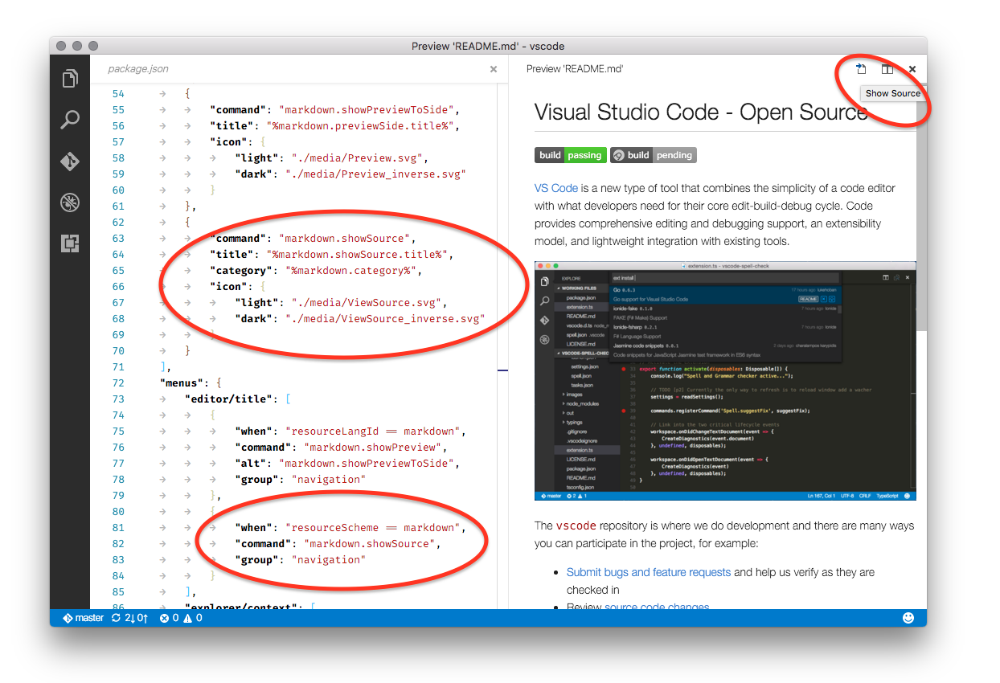

类似地，以下是一个添加到特定视图的命令菜单项。下面的示例向终端这样的任意视图提供菜单项：

```json
{
  "contributes": {
    "menus": {
      "view/title": [
        {
          "command": "terminalApi.sendText",
          "when": "view == terminal",
          "group": "navigation"
        }
      ]
    }
  }
}
```

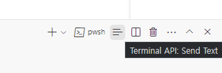

以下是一个子菜单项：

```json
{
  "contributes": {
    "menus": {
      "scm/title": [
        {
          "submenu": "git.commit",
          "group": "2_main@1",
          "when": "scmProvider == git"
        }
      ]
    }
  }
}
```

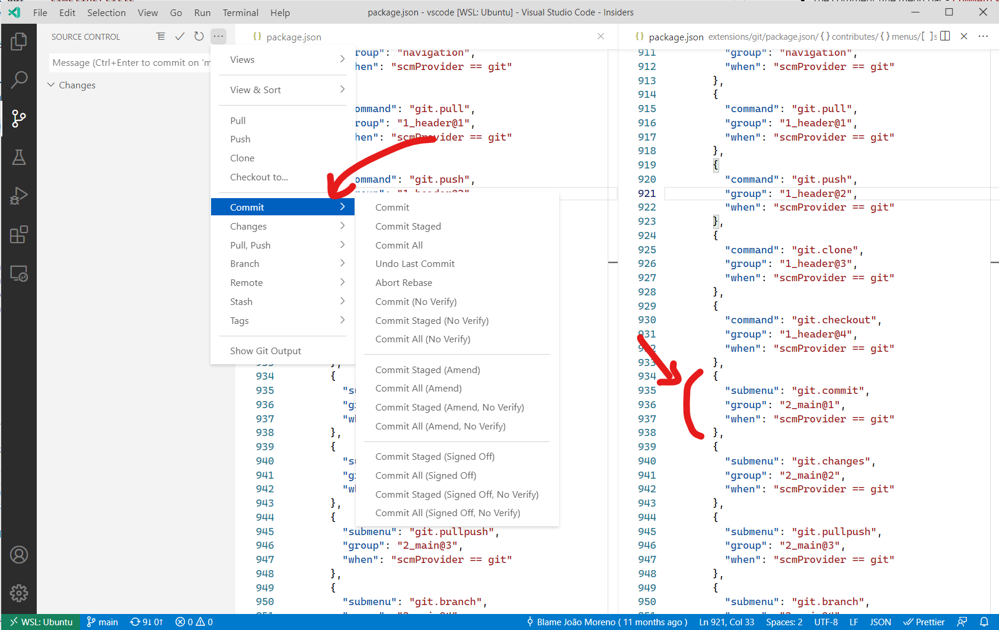

### Command Palette 菜单项的上下文可见性

在 `package.json` 中注册命令时，它们会自动显示在**命令面板**（`kb(workbench.action.showCommands)`）中。为了更精细地控制命令的可见性，可以使用 `commandPalette` 菜单项。它允许你定义 `when` 条件来控制命令是否在**命令面板**中可见。

下面的代码片段使 'Hello World' 命令仅在编辑器中选中内容时才在**命令面板**中可见：

```json
{
  "commands": [
    {
      "command": "extension.sayHello",
      "title": "Hello World"
    }
  ],
  "menus": {
    "commandPalette": [
      {
        "command": "extension.sayHello",
        "when": "editorHasSelection"
      }
    ]
  }
}
```

### 分组排序

菜单项可以按组排序。它们按字典序排列，具有以下默认规则。
你可以向这些组中添加菜单项，也可以在这些组之间、上方或下方添加新的菜单项组。

**编辑器上下文菜单**的默认分组：

- `navigation` - `navigation` 组在所有情况下都排在最前面。
- `1_modification` - 此组紧随其后，包含修改代码的命令。
- `9_cutcopypaste` - 倒数第二个默认组，包含基本编辑命令。
- `z_commands` - 最后一个默认组，包含打开命令面板的入口。

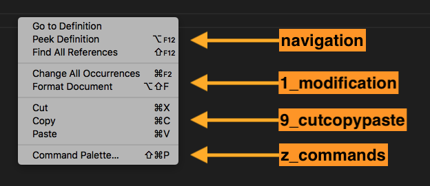

**资源管理器上下文菜单**的默认分组：

- `navigation` - 与 VS Code 中导航相关的命令。此组在所有情况下都排在最前面。
- `2_workspace` - 与工作区操作相关的命令。
- `3_compare` - 与在差异编辑器中比较文件相关的命令。
- `4_search` - 与在搜索视图中搜索相关的命令。
- `5_cutcopypaste` - 与文件的剪切、复制和粘贴相关的命令。
- `6_copypath` - 与复制文件路径相关的命令。
- `7_modification` - 与文件修改相关的命令。

**编辑器标签页上下文菜单**的默认分组：

- `1_close` - 与关闭编辑器相关的命令。
- `3_preview` - 与固定编辑器相关的命令。

**编辑器标题菜单**的默认分组：

- `navigation` - 与导航相关的命令。
- `1_run` - 与运行和调试编辑器相关的命令。
- `1_diff` - 与使用差异编辑器相关的命令。
- `3_open` - 与打开编辑器相关的命令。
- `5_close` - 与关闭编辑器相关的命令。

`navigation` 和 `1_run` 显示在编辑器标题的主区域。其他组显示在次要区域，即 `...` 菜单下。

**终端标签页上下文菜单**的默认分组：

- `1_create` - 与创建终端相关的命令。
- `3_run` - 与在终端中运行/执行操作相关的命令。
- `5_manage` - 与管理终端相关的命令。
- `7_configure` - 与终端配置相关的命令。

**终端上下文菜单**的默认分组：

- `1_create` - 与创建终端相关的命令。
- `3_edit` - 与操作文本、选区或剪贴板相关的命令。
- `5_clear` - 与清除终端相关的命令。
- `7_kill` - 与关闭/终止终端相关的命令。
- `9_config` - 与终端配置相关的命令。

**时间线视图项上下文菜单**的默认分组：

- `inline` - 重要或常用的时间线条目命令。以工具栏形式渲染。
- `1_actions` - 与操作时间线条目相关的命令。
- `5_copy` - 与复制时间线条目信息相关的命令。

**扩展视图上下文菜单**的默认分组：

- `1_copy` - 与复制扩展信息相关的命令。
- `2_configure` - 与配置扩展相关的命令。

### 组内排序

组内的顺序取决于标题或排序属性。菜单项的组内排序通过在组标识符后附加 `@<number>` 来指定，如下所示：

```json
{
  "editor/title": [
    {
      "when": "editorHasSelection",
      "command": "extension.Command",
      "group": "myGroup@1"
    }
  ]
}
```

## contributes.problemMatchers

提供问题匹配器模式。这些配置在输出面板运行器和终端运行器中均可使用。以下是在扩展中为 gcc 编译器提供问题匹配器的示例：

```json
{
  "contributes": {
    "problemMatchers": [
      {
        "name": "gcc",
        "owner": "cpp",
        "fileLocation": ["relative", "${workspaceFolder}"],
        "pattern": {
          "regexp": "^(.*):(\\d+):(\\d+):\\s+(warning|error):\\s+(.*)$",
          "file": 1,
          "line": 2,
          "column": 3,
          "severity": 4,
          "message": 5
        }
      }
    ]
  }
}
```

该问题匹配器现在可以通过名称引用 `$gcc` 在 `tasks.json` 文件中使用。示例如下：

```json
{
  "version": "2.0.0",
  "tasks": [
    {
      "label": "build",
      "command": "gcc",
      "args": ["-Wall", "helloWorld.c", "-o", "helloWorld"],
      "problemMatcher": "$gcc"
    }
  ]
}
```

另请参阅：[定义问题匹配器](/docs/debugtest/tasks#_defining-a-problem-matcher)

## contributes.problemPatterns

提供命名的问题模式，可用于问题匹配器（见上文）。

## contributes.productIconThemes

为 VS Code 提供产品图标主题。产品图标是 VS Code 中使用的所有图标，不包括文件图标和扩展提供的图标。

你必须指定一个 id（用于设置中）、一个标签以及图标定义文件的路径。

### product icon theme 示例

```json
{
  "contributes": {
    "productIconThemes": [
      {
        "id": "elegant",
        "label": "Elegant Icon Theme",
        "path": "./producticons/elegant-product-icon-theme.json"
      }
    ]
  }
}
```

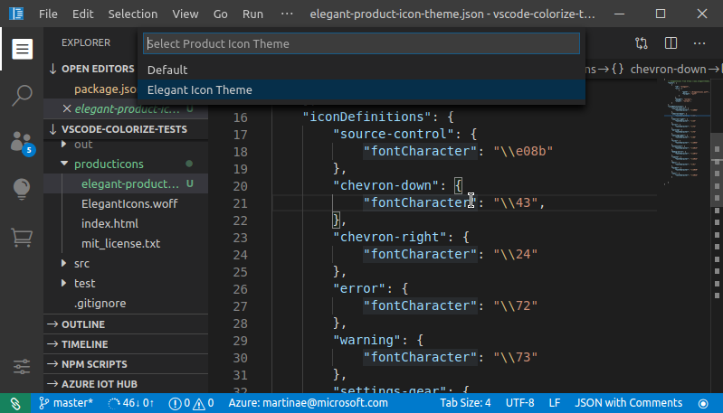

有关如何创建产品图标主题，请参阅[产品图标主题指南](/vscode/extension/extension-guides/product-icon-theme)。

## contributes.resourceLabelFormatters

提供资源标签格式化器，用于指定在工作台中各处显示 URI 的方式。例如，以下展示了扩展如何为方案为 `remotehub` 的 URI 提供格式化器：

```json
{
  "contributes": {
    "resourceLabelFormatters": [
      {
        "scheme": "remotehub",
        "formatting": {
          "label": "${path}",
          "separator": "/",
          "workspaceSuffix": "GitHub"
        }
      }
    ]
  }
}
```

这意味着所有方案为 `remotehub` 的 URI 将仅显示 URI 的 `path` 部分，分隔符为 `/`。具有 `remotehub` URI 的工作区在其标签中会显示 GitHub 后缀。

## contributes.semanticTokenModifiers

提供新的语义 Token 修饰符，可通过主题规则进行高亮。

```json
{
  "contributes": {
    "semanticTokenModifiers": [
      {
        "id": "native",
        "description": "Annotates a symbol that is implemented natively"
      }
    ]
  }
}
```

有关语义高亮的更多信息，请参阅[语义高亮指南](/vscode/extension/language-extensions/semantic-highlight-guide)。

## contributes.semanticTokenScopes

提供语义 Token 类型和修饰符到作用域之间的映射，作为回退方案或用于支持特定语言的主题。

```json
{
  "contributes": {
    "semanticTokenScopes": [
      {
        "language": "typescript",
        "scopes": {
          "property.readonly": ["variable.other.constant.property.ts"]
        }
      }
    ]
  }
}
```

有关语义高亮的更多信息，请参阅[语义高亮指南](/vscode/extension/language-extensions/semantic-highlight-guide)。

## contributes.semanticTokenTypes

提供新的语义 Token 类型，可通过主题规则进行高亮。

```json
{
  "contributes": {
    "semanticTokenTypes": [
      {
        "id": "templateType",
        "superType": "type",
        "description": "A template type."
      }
    ]
  }
}
```

有关语义高亮的更多信息，请参阅[语义高亮指南](/vscode/extension/language-extensions/semantic-highlight-guide)。

## contributes.snippets

为特定语言提供代码片段。`language` 属性是[语言标识符](/docs/languages/identifiers)，`path` 是代码片段文件的相对路径，该文件以 [VS Code 代码片段格式](/docs/editing/userdefinedsnippets#_snippet-syntax)定义代码片段。

以下示例展示了为 Go 语言添加代码片段。

```json
{
  "contributes": {
    "snippets": [
      {
        "language": "go",
        "path": "./snippets/go.json"
      }
    ]
  }
}
```

## contributes.submenus

提供一个子菜单作为占位符，可以在其中添加菜单项。子菜单需要在父菜单中显示一个 `label`。

除了标题之外，命令还可以定义图标，VS Code 会在编辑器标题菜单栏中显示这些图标。

### submenu 示例

```json
{
  "contributes": {
    "submenus": [
      {
        "id": "git.commit",
        "label": "Commit"
      }
    ]
  }
}
```

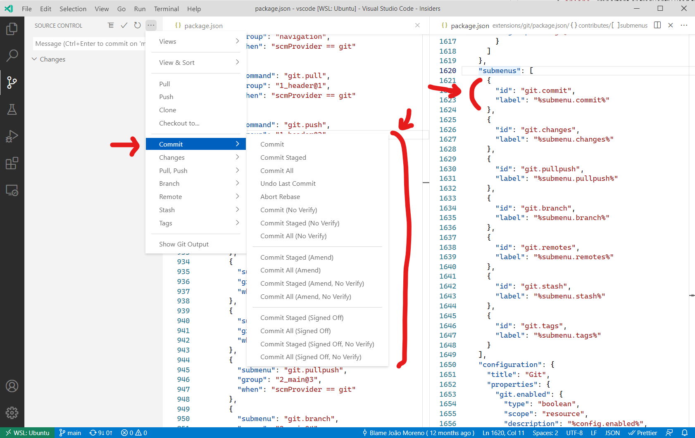

## contributes.taskDefinitions

提供并定义一个对象字面量结构，用于在系统中唯一标识所提供的任务。任务定义至少包含一个 `type` 属性，但通常会定义额外的属性。例如，package.json 文件中脚本任务的任务定义如下：

```json
{
  "taskDefinitions": [
    {
      "type": "npm",
      "required": ["script"],
      "properties": {
        "script": {
          "type": "string",
          "description": "The script to execute"
        },
        "path": {
          "type": "string",
          "description": "The path to the package.json file. If omitted the package.json in the root of the workspace folder is used."
        }
      }
    }
  ]
}
```

任务定义使用 JSON schema 语法来定义 `required` 和 `properties` 属性。`type` 属性定义任务类型。以上述示例为例：

- `"type": "npm"` 将任务定义与 npm 任务关联
- `"required": [ "script" ]` 定义 `script` 属性为必填项。`path` 属性是可选的。
- `"properties" : { ... }` 定义额外属性及其类型。

当扩展实际创建任务时，需要传递一个符合 package.json 文件中任务定义的 `TaskDefinition`。对于 `npm` 示例，在 package.json 文件中为 test 脚本创建任务如下：

```ts
let task = new vscode.Task({ type: 'npm', script: 'test' }, ....);
```

## contributes.terminal

为 VS Code 提供终端配置文件，允许扩展处理配置文件的创建。定义后，在创建终端配置文件时应显示该配置文件

```json
{
  "activationEvents": [
    "onTerminalProfile:my-ext.terminal-profile"
  ],
  "contributes": {
    "terminal": {
      "profiles": [
        {
          "title": "Profile from extension",
          "id": "my-ext.terminal-profile"
        }
      ]
    },
  }
}
```

定义后，该配置文件将出现在终端配置文件选择器中。激活后，通过返回终端选项来处理配置文件的创建：

```ts
vscode.window.registerTerminalProfileProvider('my-ext.terminal-profile', {
  provideTerminalProfile(token: vscode.CancellationToken): vscode.ProviderResult<vscode.TerminalOptions | vscode.ExtensionTerminalOptions> {
    return { name: 'Profile from extension', shellPath: 'bash' };
  }
});
```

## contributes.themes

为 VS Code 提供颜色主题，定义工作台颜色和编辑器中语法 Token 的样式。

你必须指定一个标签、该主题是深色主题还是浅色主题（以便 VS Code 的其余部分与你的主题匹配）以及文件路径（JSON 格式）。

### theme 示例

```json
{
  "contributes": {
    "themes": [
      {
        "label": "Monokai",
        "uiTheme": "vs-dark",
        "path": "./themes/monokai-color-theme.json"
      }
    ]
  }
}
```

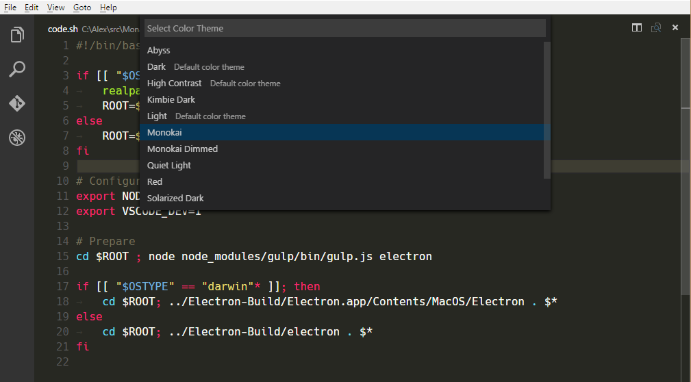

有关如何创建颜色主题，请参阅[颜色主题指南](/vscode/extension/extension-guides/color-theme)。

## contributes.typescriptServerPlugins

提供 [TypeScript 服务器插件](https://github.com/microsoft/TypeScript/wiki/Writing-a-Language-Service-Plugin)，用于增强 VS Code 的 JavaScript 和 TypeScript 支持：

```json
{
  "contributes": {
    "typescriptServerPlugins": [
      {
        "name": "typescript-styled-plugin"
      }
    ]
  }
}
```

上面的示例扩展提供了 [`typescript-styled-plugin`](https://github.com/microsoft/typescript-styled-plugin)，该插件为 JavaScript 和 TypeScript 添加了 styled-component 的智能提示。此插件将从扩展中加载，并且必须作为普通的 NPM `dependency` 安装在扩展中：

```json
{
  "dependencies": {
    "typescript-styled-plugin": "*"
  }
}
```

当用户使用 VS Code 自带的 TypeScript 版本时，TypeScript 服务器插件会为所有 JavaScript 和 TypeScript 文件加载。如果用户使用工作区版本的 TypeScript，则不会激活这些插件，除非插件显式设置 `"enableForWorkspaceTypeScriptVersions": true`。

```json
{
  "contributes": {
    "typescriptServerPlugins": [
      {
        "name": "typescript-styled-plugin",
        "enableForWorkspaceTypeScriptVersions": true
      }
    ]
  }
}
```

### 插件配置

扩展可以通过 VS Code 内置 TypeScript 扩展提供的 API 将配置数据发送到所提供的 TypeScript 插件：

```ts
// In your VS Code extension

export async function activate(context: vscode.ExtensionContext) {
  // Get the TS extension
  const tsExtension = vscode.extensions.getExtension('vscode.typescript-language-features');
  if (!tsExtension) {
    return;
  }

  await tsExtension.activate();

  // Get the API from the TS extension
  if (!tsExtension.exports || !tsExtension.exports.getAPI) {
    return;
  }

  const api = tsExtension.exports.getAPI(0);
  if (!api) {
    return;
  }

  // Configure the 'my-typescript-plugin-id' plugin
  api.configurePlugin('my-typescript-plugin-id', {
    someValue: process.env['SOME_VALUE']
  });
}
```

TypeScript 服务器插件通过 `onConfigurationChanged` 方法接收配置数据：

```ts
// In your TypeScript plugin

import * as ts_module from 'typescript/lib/tsserverlibrary';

export = function init({ typescript }: { typescript: typeof ts_module }) {
  return {
    create(info: ts.server.PluginCreateInfo) {
      // Create new language service
    },
    onConfigurationChanged(config: any) {
      // Receive configuration changes sent from VS Code
    }
  };
};
```

此 API 允许 VS Code 扩展将 VS Code 设置与 TypeScript 服务器插件同步，或动态更改插件的行为。请查看 [TypeScript TSLint 插件](https://github.com/microsoft/vscode-typescript-tslint-plugin/blob/main/src/index.ts)和 [lit-html](https://github.com/mjbvz/vscode-lit-html/blob/master/src/index.ts) 扩展，了解此 API 在实际中的使用方式。

## contributes.views

为 VS Code 提供一个视图。你必须为视图指定标识符和名称。你可以向以下视图容器提供视图：

- `explorer`：活动栏中的资源管理器视图容器
- `scm`：活动栏中的源代码管理 (SCM) 视图容器
- `debug`：活动栏中的运行和调试视图容器
- `test`：活动栏中的测试视图容器
- 扩展提供的[自定义视图容器](#contributes.viewsContainers)。

当用户打开视图时，VS Code 将发出激活事件 `onView:${viewId}`（对于下面的示例为 `onView:nodeDependencies`）。你还可以通过提供 `when` 上下文值来控制视图的可见性。当标题无法显示时（例如当视图被拖到活动栏时），将使用指定的 `icon`。当视图从其默认视图容器移出并需要额外上下文时，将使用 `contextualTitle`。

```json
{
  "contributes": {
    "views": {
      "explorer": [
        {
          "id": "nodeDependencies",
          "name": "Node Dependencies",
          "when": "workspaceHasPackageJSON",
          "icon": "media/dep.svg",
          "contextualTitle": "Package Explorer"
        }
      ]
    }
  }
}
```

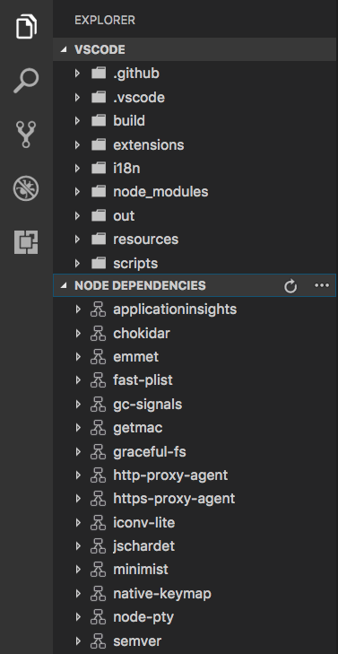

视图的内容可以通过两种方式填充：

- 通过 [TreeView](/vscode/extension/references/vscode-api#TreeView) 使用 `createTreeView` API 提供[数据提供器](/vscode/extension/references/vscode-api#TreeDataProvider)，或通过 `registerTreeDataProvider` API 直接注册[数据提供器](/vscode/extension/references/vscode-api#TreeDataProvider)来填充数据。TreeView 非常适合展示层级数据和列表。请参阅 [tree-view-sample](https://github.com/microsoft/vscode-extension-samples/tree/main/tree-view-sample)。
- 通过 [WebviewView](/vscode/extension/references/vscode-api#WebviewView) 使用 `registerWebviewViewProvider` 注册[提供器](/vscode/extension/references/vscode-api#WebviewViewProvider)。Webview 视图允许在视图中渲染任意 HTML。有关更多详情，请参阅 [webview 视图示例扩展](https://github.com/microsoft/vscode-extension-samples/tree/main/webview-view-sample)。

## contributes.viewsContainers

提供一个视图容器，用于放置[自定义视图](#contributes.views)。你必须为视图容器指定标识符、标题和图标。目前，你可以将它们提供到活动栏（`activitybar`）和面板（`panel`）中。以下示例展示了如何将 `Package Explorer` 视图容器添加到活动栏，以及如何向其中添加视图。

```json
{
  "contributes": {
    "viewsContainers": {
      "activitybar": [
        {
          "id": "package-explorer",
          "title": "Package Explorer",
          "icon": "resources/package-explorer.svg"
        }
      ]
    },
    "views": {
      "package-explorer": [
        {
          "id": "package-dependencies",
          "name": "Dependencies"
        },
        {
          "id": "package-outline",
          "name": "Outline"
        }
      ]
    }
  }
}
```

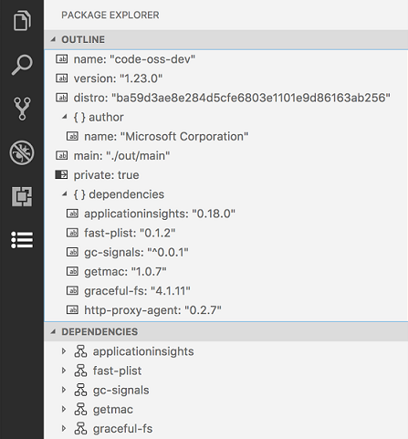

### 图标规范

- `尺寸：` 图标应为 24x24 并居中。
- `颜色：` 图标应使用单一颜色。
- `格式：` 建议使用 SVG 格式的图标，但也接受任何图片文件类型。
- `状态：` 所有图标继承以下状态样式：

  | State   | Opacity |
  | ------- | ------- |
  | Default | 60%     |
  | Hover   | 100%    |
  | Active  | 100%    |

## contributes.viewsWelcome

为[自定义视图](#contributes.views)提供欢迎内容。欢迎内容仅适用于空的树视图。当树没有子节点且没有 `TreeView.message` 时，视图被视为空。按照约定，任何独占一行的命令链接将显示为按钮。你可以通过 `view` 属性指定欢迎内容应用于哪个视图。欢迎内容的可见性可以通过 `when` 上下文值控制。要显示为欢迎内容的文本通过 `contents` 属性设置。

```json
{
  "contributes": {
    "viewsWelcome": [
      {
        "view": "scm",
        "contents": "In order to use git features, you can open a folder containing a git repository or clone from a URL.\n[Open Folder](command:vscode.openFolder)\n[Clone Repository](command:git.clone)\nTo learn more about how to use git and source control in VS Code [read our docs](https://aka.ms/vscode-scm).",
        "when": "config.git.enabled && git.state == initialized && workbenchState == empty"
      }
    ]
  }
}
```

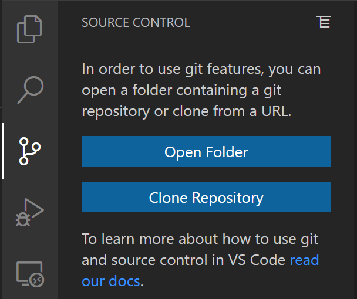

一个视图可以提供多个欢迎内容。在这种情况下，来自 VS Code 核心的内容排在最前面，然后是内置扩展的内容，最后是其他所有扩展的内容。

## contributes.walkthroughs

[示例扩展](https://github.com/microsoft/vscode-extension-samples/tree/main/getting-started-sample)

提供演练指南，显示在入门页面。演练指南会在你的扩展安装后自动打开，为用户提供一种便捷的方式来了解你扩展的功能。

演练指南由标题、描述、id 和一系列步骤组成。此外，可以设置 `when` 条件来根据上下文键隐藏或显示演练指南。例如，用于说明 Linux 平台上安装设置的演练指南可以设置 `when: "isLinux"`，使其仅在 Linux 机器上显示。

演练指南中的每个步骤都有标题、描述、id 和媒体元素（图片或 Markdown 内容），以及一组可选的完成事件（如下面的示例所示）。步骤描述是 Markdown 内容，支持 `**粗体**`、`__下划线__` 和 ``` ``代码`` ``` 渲染，以及链接。与演练指南类似，步骤也可以设置 when 条件来根据上下文键隐藏或显示。

由于 SVG 具有缩放能力并支持 VS Code 的主题颜色，因此推荐使用 SVG 作为图片。使用 [Visual Studio Code Color Mapper](https://www.figma.com/community/plugin/1218260433851630449) Figma 插件可以轻松地在 SVG 中引用主题颜色。

```json
{
  "contributes": {
    "walkthroughs": [
      {
        "id": "sample",
        "title": "Sample",
        "description": "A sample walkthrough",
        "steps": [
          {
            "id": "runcommand",
            "title": "Run Command",
            "description": "This step will run a command and check off once it has been run.\n[Run Command](command:getting-started-sample.runCommand)",
            "media": { "image": "media/image.png", "altText": "Empty image" },
            "completionEvents": ["onCommand:getting-started-sample.runCommand"]
          },
          {
            "id": "changesetting",
            "title": "Change Setting",
            "description": "This step will change a setting and check off when the setting has changed\n[Change Setting](command:getting-started-sample.changeSetting)",
            "media": { "markdown": "media/markdown.md" },
            "completionEvents": ["onSettingChanged:getting-started-sample.sampleSetting"]
          }
        ]
      }
    ]
  }
}
```

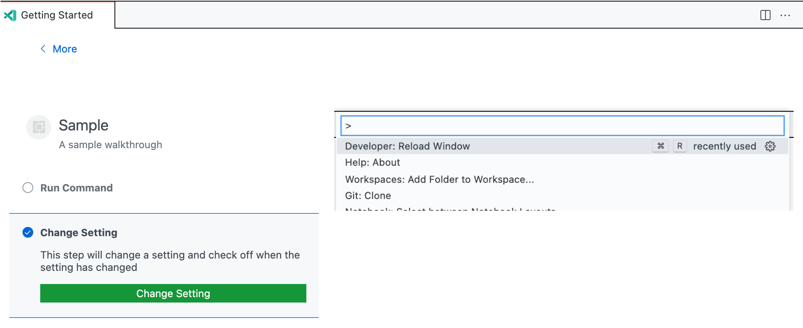

### 完成事件

默认情况下，如果没有提供 `completionEvents` 事件，当步骤的任何按钮被点击时该步骤将被标记为已完成，如果步骤没有按钮，则在打开时标记为已完成。如果需要更精细的控制，可以提供一个 `completionEvents` 列表。

可用的完成事件包括：

- `onCommand:myCommand.id`：当命令被执行时标记步骤完成。
- `onSettingChanged:mySetting.id`：当给定设置被修改后标记步骤完成。
- `onContext:contextKeyExpression`：当上下文键表达式求值为 true 时标记步骤完成。
- `extensionInstalled:myExt.id`：当给定扩展已安装时标记步骤完成。
- `onView:myView.id`：当给定视图变为可见时标记步骤完成。
- `onLink:https://...`：当给定链接通过演练指南打开后标记步骤完成。

一旦步骤被标记为完成，它将保持完成状态，直到用户显式取消勾选该步骤或重置其进度（通过 **入门：重置进度** 命令）。
