# 主题颜色

你可以通过 `workbench.colorCustomizations` 用户[设置](/docs/configure/settings)来自定义当前 Visual Studio Code 的[颜色主题](/docs/getstarted/themes)。

```json
{
  "workbench.colorCustomizations": {
    "activityBar.background": "#00AA00"
  }
}
```

**注意**：如果你想使用现有的颜色主题，请参阅[颜色主题](/docs/getstarted/themes)，了解如何通过 **Preferences: Color Theme** 下拉菜单（`kb(workbench.action.selectTheme)`）设置当前颜色主题。

主题颜色可以在 [webview](/vscode/extension/extension-guides/webview) 中作为 CSS 变量使用，还有一个[扩展](https://marketplace.visualstudio.com/items?itemName=connor4312.css-theme-completions)可以为这些颜色提供 IntelliSense 支持。

## 颜色格式

颜色值可以在 RGB 颜色模型中定义，并带有用于透明度的 alpha 通道。支持以下十六进制格式：`#RGB`、`#RGBA`、`#RRGGBB` 和 `#RRGGBBAA`。其中 R（红）、G（绿）、B（蓝）和 A（透明度）均为十六进制字符（0-9、a-f 或 A-F）。三位格式（`#RGB`）是六位格式（`#RRGGBB`）的简写，四位 RGB 格式（`#RGBA`）是八位格式（`#RRGGBBAA`）的简写。例如，`#e35f` 与 `#ee3355ff` 表示相同的颜色。

如果未定义 alpha 值，默认为 `ff`（不透明，无透明度）。如果 alpha 设为 `00`，则颜色完全透明。

某些颜色不应设为不透明，以免遮盖其他标注信息。请查看各颜色的说明以确认适用情况。

## 对比度颜色

对比度颜色通常仅在高对比度主题中设置。设置后，它们会在整个界面的元素周围添加额外的边框以增强对比度。

- `contrastActiveBorder`：活动元素周围的额外边框，用于与其他元素区分以增强对比度。
- `contrastBorder`：元素周围的额外边框，用于与其他元素区分以增强对比度。

## 基础颜色

- `focusBorder`：聚焦元素的整体边框颜色。仅在该颜色未被组件覆盖时使用。
- `foreground`：整体前景色。仅在该颜色未被组件覆盖时使用。
- `disabledForeground`：禁用元素的整体前景色。仅在该颜色未被组件覆盖时使用。
- `widget.border`：编辑器内小组件（如查找/替换）的边框颜色。
- `widget.shadow`：编辑器内小组件（如查找/替换）的阴影颜色。
- `selection.background`：工作台中文字选中的背景色（适用于输入框或文本区域，不适用于编辑器和终端内的选中内容）。
- `descriptionForeground`：提供附加信息的描述文本的前景色，例如标签的描述。
- `errorForeground`：错误消息的整体前景色（仅在该颜色未被组件覆盖时使用）。
- `icon.foreground`：工作台中图标的默认颜色。
- `sash.hoverBorder`：可拖动分隔条的悬停边框颜色。

## 窗口边框

VS Code 窗口边框的主题颜色。

- `window.activeBorder`：活动（聚焦）窗口的边框颜色。
- `window.inactiveBorder`：非活动（未聚焦）窗口的边框颜色。

窗口边框颜色仅在 macOS 和 Linux（不支持 Windows）上受支持，且仅在启用自定义标题栏时生效（`"window.titleBarStyle": "custom"`）。

## 文本颜色

文本文档（如欢迎页）中的颜色。

- `textBlockQuote.background`：文本中引用块的背景色。
- `textBlockQuote.border`：文本中引用块的边框颜色。
- `textCodeBlock.background`：文本中代码块的背景色。
- `textLink.activeForeground`：文本中链接被点击或鼠标悬停时的前景色。
- `textLink.foreground`：文本中链接的前景色。
- `textPreformat.foreground`：预格式化文本段的前景色。
- `textPreformat.background`：预格式化文本段的背景色。
- `textPreformat.border`：预格式化文本段的边框颜色。
- `textSeparator.foreground`：文本分隔符的颜色。

## 操作颜色

一组用于控制工作台中操作交互行为的颜色。

- `toolbar.hoverBackground`：鼠标悬停在操作上时的工具栏背景色。
- `toolbar.hoverOutline`：鼠标悬停在操作上时的工具栏轮廓颜色。
- `toolbar.activeBackground`：鼠标按住操作时的工具栏背景色。
- `editorActionList.background`：操作列表的背景色。
- `editorActionList.foreground`：操作列表的前景色。
- `editorActionList.focusForeground`：操作列表中聚焦项的前景色。
- `editorActionList.focusBackground`：操作列表中聚焦项的背景色。

## 按钮控件

用于按钮控件的一组颜色，例如新窗口资源管理器中的**打开文件夹**按钮。

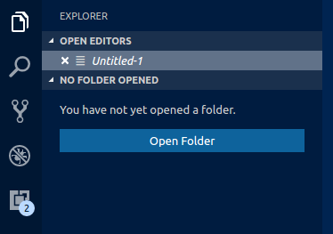

- `button.background`：按钮背景色。
- `button.foreground`：按钮前景色。
- `button.border`：按钮边框颜色。
- `button.separator`：按钮分隔符颜色。
- `button.hoverBackground`：按钮悬停时的背景色。
- `button.secondaryForeground`：次要按钮前景色。
- `button.secondaryBackground`：次要按钮背景色。
- `button.secondaryHoverBackground`：次要按钮悬停时的背景色。
- `button.secondaryBorder`：次要按钮边框颜色。
- `checkbox.background`：复选框控件的背景色。
- `checkbox.foreground`：复选框控件的前景色。
- `checkbox.disabled.background`：禁用复选框的背景色。
- `checkbox.disabled.foreground`：禁用复选框的前景色。
- `checkbox.border`：复选框控件的边框颜色。
- `checkbox.selectBackground`：复选框所在元素被选中时的背景色。
- `checkbox.selectBorder`：复选框所在元素被选中时的边框颜色。
- `radio.activeForeground`：活动单选项的前景色。
- `radio.activeBackground`：活动单选项的背景色。
- `radio.activeBorder`：活动单选项的边框颜色。
- `radio.inactiveForeground`：非活动单选项的前景色。
- `radio.inactiveBackground`：非活动单选项的背景色。
- `radio.inactiveBorder`：非活动单选项的边框颜色。
- `radio.inactiveHoverBackground`：非活动单选项悬停时的背景色。

## 下拉框控件

用于所有下拉框控件的一组颜色，例如集成终端或输出面板中的下拉框。请注意，下拉框控件目前在 macOS 上不被使用。

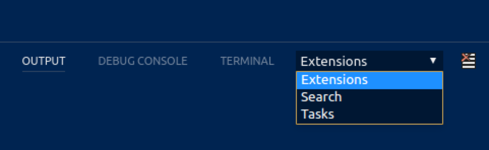

- `dropdown.background`：下拉框背景色。
- `dropdown.listBackground`：下拉列表背景色。
- `dropdown.border`：下拉框边框颜色。
- `dropdown.foreground`：下拉框前景色。

## 输入框控件

搜索视图或查找/替换对话框等输入控件的颜色。

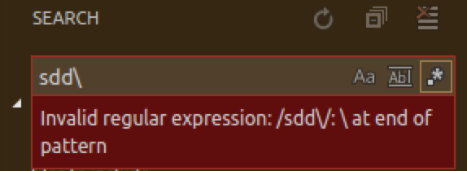

- `input.background`：输入框背景色。
- `input.border`：输入框边框颜色。
- `input.foreground`：输入框前景色。
- `input.placeholderForeground`：输入框占位符文本的前景色。
- `inputOption.activeBackground`：输入字段中已激活选项的背景色。
- `inputOption.activeBorder`：输入字段中已激活选项的边框颜色。
- `inputOption.activeForeground`：输入字段中已激活选项的前景色。
- `inputOption.hoverBackground`：输入字段中选项悬停时的背景色。
- `inputValidation.errorBackground`：错误级别的输入验证背景色。
- `inputValidation.errorForeground`：错误级别的输入验证前景色。
- `inputValidation.errorBorder`：错误级别的输入验证边框颜色。
- `inputValidation.infoBackground`：信息级别的输入验证背景色。
- `inputValidation.infoForeground`：信息级别的输入验证前景色。
- `inputValidation.infoBorder`：信息级别的输入验证边框颜色。
- `inputValidation.warningBackground`：警告级别的输入验证背景色。
- `inputValidation.warningForeground`：警告级别的输入验证前景色。
- `inputValidation.warningBorder`：警告级别的输入验证边框颜色。

## 滚动条控件

- `scrollbar.background`：滚动条轨道背景色。
- `scrollbar.shadow`：滚动条滑块阴影颜色，用于指示视图已滚动。
- `scrollbarSlider.activeBackground`：滚动条滑块被点击时的背景色。
- `scrollbarSlider.background`：滚动条滑块背景色。
- `scrollbarSlider.hoverBackground`：滚动条滑块悬停时的背景色。

## 徽章

徽章是小型信息标签，例如搜索结果计数。

- `badge.foreground`：徽章前景色。
- `badge.background`：徽章背景色。

## 进度条

- `progressBar.background`：长时间运行操作时显示的进度条背景色。

## 列表和树

列表和树（如文件资源管理器）的颜色。活动的列表/树拥有键盘焦点，非活动的则没有。

- `list.activeSelectionBackground`：列表/树活动时选中项的背景色。
- `list.activeSelectionForeground`：列表/树活动时选中项的前景色。
- `list.activeSelectionIconForeground`：列表/树活动时选中项的图标前景色。活动的列表/树拥有键盘焦点，非活动的则没有。
- `list.dropBackground`：使用鼠标拖放移动项目时列表/树的背景色。
- `list.focusBackground`：列表/树活动时聚焦项的背景色。
- `list.focusForeground`：列表/树活动时聚焦项的前景色。活动的列表/树拥有键盘焦点，非活动的则没有。
- `list.focusHighlightForeground`：在列表/树内搜索时，活动聚焦项上匹配高亮的前景色。
- `list.focusOutline`：列表/树活动时聚焦项的轮廓颜色。活动的列表/树拥有键盘焦点，非活动的则没有。
- `list.focusAndSelectionOutline`：列表/树活动且选中时聚焦项的轮廓颜色。活动的列表/树拥有键盘焦点，非活动的则没有。
- `list.highlightForeground`：在列表/树内搜索时匹配高亮的前景色。
- `list.hoverBackground`：鼠标悬停在列表/树项上时的背景色。
- `list.hoverForeground`：鼠标悬停在列表/树项上时的前景色。
- `list.inactiveSelectionBackground`：列表/树非活动时选中项的背景色。
- `list.inactiveSelectionForeground`：列表/树非活动时选中项的前景色。活动的列表/树拥有键盘焦点，非活动的则没有。
- `list.inactiveSelectionIconForeground`：列表/树非活动时选中项的图标前景色。活动的列表/树拥有键盘焦点，非活动的则没有。
- `list.inactiveFocusBackground`：列表非活动时聚焦项的背景色。活动的列表拥有键盘焦点，非活动的则没有。目前仅在列表中支持。
- `list.inactiveFocusOutline`：列表/树非活动时聚焦项的轮廓颜色。活动的列表/树拥有键盘焦点，非活动的则没有。
- `list.invalidItemForeground`：列表/树中无效项的前景色，例如资源管理器中未解析的根目录。
- `list.errorForeground`：包含错误的列表项的前景色。
- `list.warningForeground`：包含警告的列表项的前景色。
- `listFilterWidget.background`：在列表/树内搜索时，输入文本的筛选器背景色。
- `listFilterWidget.outline`：在列表/树内搜索时，输入文本的筛选器轮廓颜色。
- `listFilterWidget.noMatchesOutline`：在列表/树内搜索时，未找到匹配项的筛选器轮廓颜色。
- `listFilterWidget.shadow`：列表和树中类型筛选器控件的阴影颜色。
- `list.filterMatchBackground`：列表和树中筛选匹配项的背景色。
- `list.filterMatchBorder`：列表和树中筛选匹配项的边框颜色。
- `list.deemphasizedForeground`：列表/树中被弱化的项的前景色。
- `list.dropBetweenBackground`：使用鼠标在项目之间拖放时的列表/树边框颜色。
- `tree.indentGuidesStroke`：树控件中缩进参考线的描边颜色。
- `tree.inactiveIndentGuidesStroke`：树控件中非活动缩进参考线的描边颜色。
- `tree.tableColumnsBorder`：树控件中缩进参考线的描边颜色。
- `tree.tableOddRowsBackground`：奇数行表格行的背景色。

## 活动栏

活动栏通常显示在工作台的最左侧或最右侧，用于在侧栏的各视图之间快速切换。

- `activityBar.background`：活动栏背景色。
- `activityBar.dropBorder`：活动栏项目的拖放反馈颜色。活动栏显示在最左侧或最右侧，用于在侧栏视图之间切换。
- `activityBar.foreground`：活动栏前景色（例如用于图标）。
- `activityBar.inactiveForeground`：活动栏项处于非活动状态时的前景色。
- `activityBar.border`：活动栏与侧栏之间的边框颜色。
- `activityBarBadge.background`：活动通知徽章的背景色。
- `activityBarBadge.foreground`：活动通知徽章的前景色。
- `activityBar.activeBorder`：活动栏活动指示器的边框颜色。
- `activityBar.activeBackground`：活动栏活动元素的可选背景色。
- `activityBar.activeFocusBorder`：活动栏中活动项的聚焦边框颜色。
- `activityBarTop.foreground`：活动栏位于顶部时，活动项的前景色。活动栏用于在侧栏视图之间切换。
- `activityBarTop.activeBorder`：活动栏位于顶部时，活动项的聚焦边框颜色。活动栏用于在侧栏视图之间切换。
- `activityBarTop.inactiveForeground`：活动栏位于顶部时，非活动项的前景色。活动栏用于在侧栏视图之间切换。
- `activityBarTop.dropBorder`：活动栏位于顶部时，项目的拖放反馈颜色。活动栏用于在侧栏视图之间切换。
- `activityBarTop.background`：活动栏设置为顶部/底部时的背景色。
- `activityBarTop.activeBackground`：活动栏位于顶部/底部时，活动项的背景色。活动栏用于在侧栏视图之间切换。
- `activityWarningBadge.foreground`：警告活动徽章的前景色。
- `activityWarningBadge.background`：警告活动徽章的背景色。
- `activityErrorBadge.foreground`：错误活动徽章的前景色。
- `activityErrorBadge.background`：错误活动徽章的背景色。

## 配置文件

- `profileBadge.background`：配置文件徽章的背景色。配置文件徽章显示在活动栏的设置齿轮图标上方。
- `profileBadge.foreground`：配置文件徽章的前景色。配置文件徽章显示在活动栏的设置齿轮图标上方。
- `profiles.sashBorder`：配置文件编辑器分割视图分隔条的边框颜色。

## 侧栏

侧栏包含资源管理器和搜索等视图。

- `sideBar.background`：侧栏背景色。
- `sideBar.foreground`：侧栏前景色。侧栏是资源管理器和搜索等视图的容器。
- `sideBar.border`：侧栏与编辑器分隔侧的边框颜色。
- `sideBar.dropBackground`：侧栏各区域的拖放反馈颜色。该颜色应具有透明度，以便侧栏区域仍能透过显示。

- `sideBarTitle.foreground`：侧栏标题的前景色。
- `sideBarSectionHeader.background`：侧栏区域标题的背景色。
- `sideBarSectionHeader.foreground`：侧栏区域标题的前景色。
- `sideBarSectionHeader.border`：侧栏区域标题的边框颜色。
- `sideBarActivityBarTop.border`：顶部/底部活动栏与视图之间的边框颜色。
- `sideBarTitle.background`：侧栏标题的背景色。侧栏是资源管理器和搜索等视图的容器。
- `sideBarTitle.border`：侧栏标题底部的边框颜色，用于将标题与视图分隔。侧栏是资源管理器和搜索等视图的容器。
- `sideBarStickyScroll.background`：侧栏粘性滚动的背景色。
- `sideBarStickyScroll.border`：侧栏粘性滚动的边框颜色。
- `sideBarStickyScroll.shadow`：侧栏粘性滚动的阴影颜色。


## 缩略图

缩略图显示当前文件的缩小版本。

- `minimap.findMatchHighlight`：文件内搜索匹配项的高亮颜色。
- `minimap.selectionHighlight`：编辑器选区的高亮颜色。
- `minimap.errorHighlight`：编辑器中错误的高亮颜色。
- `minimap.warningHighlight`：编辑器中警告的高亮颜色。
- `minimap.background`：缩略图背景色。
- `minimap.selectionOccurrenceHighlight`：缩略图中重复编辑器选区的标记颜色。
- `minimap.foregroundOpacity`：缩略图中前景元素的不透明度。例如，"#000000c0" 将以 75% 的不透明度渲染元素。
- `minimap.infoHighlight`：缩略图中信息的标记颜色。
- `minimap.chatEditHighlight`：缩略图中待编辑区域的颜色。

- `minimapSlider.background`：缩略图滑块背景色。
- `minimapSlider.hoverBackground`：缩略图滑块悬停时的背景色。
- `minimapSlider.activeBackground`：缩略图滑块被点击时的背景色。

- `minimapGutter.addedBackground`：缩略图中新增内容的行号栏颜色。
- `minimapGutter.modifiedBackground`：缩略图中修改内容的行号栏颜色。
- `minimapGutter.deletedBackground`：缩略图中删除内容的行号栏颜色。
- `editorMinimap.inlineChatInserted`：缩略图中内联聊天插入内容的标记颜色。

## 编辑器组和标签页

编辑器组是编辑器的容器。可以有多个编辑器组。标签页是单个编辑器的容器，一个编辑器组中可以打开多个标签页。

- `editorGroup.border`：用于分隔多个编辑器组的颜色。

  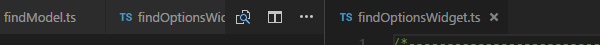

- `editorGroup.dropBackground`：拖动编辑器时的背景色。

  

- `editorGroupHeader.noTabsBackground`：使用单标签模式时编辑器组标题栏的背景色（设置 `"workbench.editor.showTabs": "single"`）。

  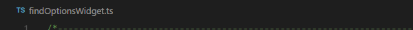

- `editorGroupHeader.tabsBackground`：标签页容器的背景色。

  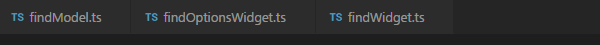

- `editorGroupHeader.tabsBorder`：启用标签页时，编辑器标签控件下方的边框颜色。

  

- `editorGroupHeader.border`：编辑器组标题栏与编辑器之间的边框颜色（如果启用了面包屑，则位于面包屑下方）。
- `editorGroup.emptyBackground`：空编辑器组的背景色。
- `editorGroup.focusedEmptyBorder`：聚焦的空编辑器组的边框颜色。
- `editorGroup.dropIntoPromptForeground`：拖动文件时显示在编辑器上方的文本前景色。该文本提示用户可以按住 Shift 键将文件放入编辑器。
- `editorGroup.dropIntoPromptBackground`：拖动文件时显示在编辑器上方的文本背景色。该文本提示用户可以按住 Shift 键将文件放入编辑器。
- `editorGroup.dropIntoPromptBorder`：拖动文件时显示在编辑器上方的文本边框颜色。该文本提示用户可以按住 Shift 键将文件放入编辑器。

- `tab.activeBackground`：活动组中活动标签页的背景色。
- `tab.unfocusedActiveBackground`：非活动编辑器组中活动标签页的背景色。
- `tab.activeForeground`：活动组中活动标签页的前景色。
- `tab.border`：标签页之间的分隔边框。
- `tab.activeBorder`：活动标签页的底部边框。
- `tab.selectedBorderTop`：已选中标签页的顶部边框。标签页是编辑器区域中编辑器的容器，一个编辑器组中可以打开多个标签页，可以有多个编辑器组。
- `tab.selectedBackground`：已选中标签页的背景色。标签页是编辑器区域中编辑器的容器，一个编辑器组中可以打开多个标签页，可以有多个编辑器组。
- `tab.selectedForeground`：已选中标签页的前景色。标签页是编辑器区域中编辑器的容器，一个编辑器组中可以打开多个标签页，可以有多个编辑器组。
- `tab.dragAndDropBorder`：标签页之间的边框，指示可以在两个标签页之间插入标签页。标签页是编辑器区域中编辑器的容器，一个编辑器组中可以打开多个标签页，可以有多个编辑器组。
- `tab.unfocusedActiveBorder`：非活动编辑器组中活动标签页的底部边框。
- `tab.activeBorderTop`：活动标签页的顶部边框。
- `tab.unfocusedActiveBorderTop`：非活动编辑器组中活动标签页的顶部边框。
- `tab.lastPinnedBorder`：最后一个固定编辑器右侧的边框，用于与未固定的编辑器分隔。
- `tab.inactiveBackground`：非活动标签页的背景色。
- `tab.unfocusedInactiveBackground`：未聚焦组中非活动标签页的背景色。
- `tab.inactiveForeground`：活动组中非活动标签页的前景色。
- `tab.unfocusedActiveForeground`：非活动编辑器组中活动标签页的前景色。
- `tab.unfocusedInactiveForeground`：非活动编辑器组中非活动标签页的前景色。
- `tab.hoverBackground`：标签页悬停时的背景色。
- `tab.unfocusedHoverBackground`：未聚焦组中标签页悬停时的背景色。
- `tab.hoverForeground`：标签页悬停时的前景色。
- `tab.unfocusedHoverForeground`：未聚焦组中标签页悬停时的前景色。
- `tab.hoverBorder`：标签页悬停时的高亮边框。
- `tab.unfocusedHoverBorder`：未聚焦组中标签页悬停时的高亮边框。
- `tab.activeModifiedBorder`：活动组中已修改（脏）活动标签页顶部的边框。
- `tab.inactiveModifiedBorder`：活动组中已修改（脏）非活动标签页顶部的边框。
- `tab.unfocusedActiveModifiedBorder`：未聚焦组中已修改（脏）活动标签页顶部的边框。
- `tab.unfocusedInactiveModifiedBorder`：未聚焦组中已修改（脏）非活动标签页顶部的边框。
- `editorPane.background`：居中编辑器布局时，编辑器窗格左右两侧可见区域的背景色。
- `sideBySideEditor.horizontalBorder`：编辑器组中两个编辑器从上到下并排显示时的分隔颜色。
- `sideBySideEditor.verticalBorder`：编辑器组中两个编辑器从左到右并排显示时的分隔颜色。

## 编辑器颜色

编辑器中最突出的颜色是用于语法高亮的标记颜色，它们基于已安装的语言语法。这些颜色由颜色主题定义，但也可以通过 `editor.tokenColorCustomizations` 设置自定义。有关更新颜色主题和可用标记类型的详细信息，请参阅[自定义颜色主题](/docs/configure/themes#_customize-a-color-theme)。

所有其他编辑器颜色如下：

- `editor.background`：编辑器背景色。
- `editor.foreground`：编辑器默认前景色。
- `editorLineNumber.foreground`：编辑器行号颜色。
- `editorLineNumber.activeForeground`：活动行号的颜色。
- `editorLineNumber.dimmedForeground`：当 editor.renderFinalNewline 设为 dimmed 时，编辑器最后一行的颜色。
- `editorCursor.background`：编辑器光标的背景色。允许自定义块光标覆盖字符时的颜色。
- `editorCursor.foreground`：编辑器光标颜色。
- `editorMultiCursor.primary.foreground`：存在多个光标时主光标的颜色。
- `editorMultiCursor.primary.background`：存在多个光标时主光标的背景色。允许自定义块光标覆盖字符时的颜色。
- `editorMultiCursor.secondary.foreground`：存在多个光标时辅助光标的颜色。
- `editorMultiCursor.secondary.background`：存在多个光标时辅助光标的背景色。允许自定义块光标覆盖字符时的颜色。
- `editor.placeholder.foreground`：编辑器中占位符文本的前景色。
- `editor.compositionBorder`：IME 输入法组合的边框颜色。

选中颜色在选中一个或多个字符时可见。除选中区域外，所有相同内容的区域也会被高亮显示。

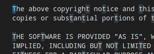

- `editor.selectionBackground`：编辑器选区的颜色。
- `editor.selectionForeground`：用于高对比度的选中文本颜色。
- `editor.inactiveSelectionBackground`：非活动编辑器中选区的颜色。该颜色不得为不透明，以免遮挡底层装饰。
- `editor.selectionHighlightBackground`：与选区内容相同的区域的颜色。该颜色不得为不透明，以免遮挡底层装饰。
- `editor.selectionHighlightBorder`：与选区内容相同的区域的边框颜色。

单词高亮颜色在光标位于符号或单词内时可见。根据文件类型可用的语言支持，所有匹配的引用和声明会被高亮，读写访问会以不同颜色区分。如果文档符号语言支持不可用，则回退到单词高亮。

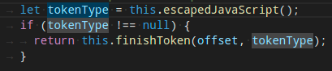

- `editor.wordHighlightBackground`：符号在读取访问时的背景色，例如读取变量时。该颜色不得为不透明，以免遮挡底层装饰。
- `editor.wordHighlightBorder`：符号在读取访问时的边框颜色，例如读取变量时。
- `editor.wordHighlightStrongBackground`：符号在写入访问时的背景色，例如写入变量时。该颜色不得为不透明，以免遮挡底层装饰。
- `editor.wordHighlightStrongBorder`：符号在写入访问时的边框颜色，例如写入变量时。
- `editor.wordHighlightTextBackground`：符号的文本出现位置的背景色。该颜色不得为不透明，以免遮挡底层装饰。
- `editor.wordHighlightTextBorder`：符号的文本出现位置的边框颜色。

查找颜色取决于查找/替换对话框中的当前查找字符串。

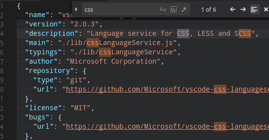

- `editor.findMatchBackground`：当前搜索匹配项的颜色。
- `editor.findMatchForeground`：当前搜索匹配项的文本颜色。
- `editor.findMatchHighlightForeground`：其他搜索匹配项的前景色。
- `editor.findMatchHighlightBackground`：其他搜索匹配项的颜色。该颜色不得为不透明，以免遮挡底层装饰。
- `editor.findRangeHighlightBackground`：限制搜索范围的颜色（在查找控件中启用"在选区内查找"）。该颜色不得为不透明，以免遮挡底层装饰。
- `editor.findMatchBorder`：当前搜索匹配项的边框颜色。
- `editor.findMatchHighlightBorder`：其他搜索匹配项的边框颜色。
- `editor.findRangeHighlightBorder`：限制搜索范围的边框颜色（在查找控件中启用"在选区内查找"）。

搜索颜色用于搜索视图的全局搜索结果。

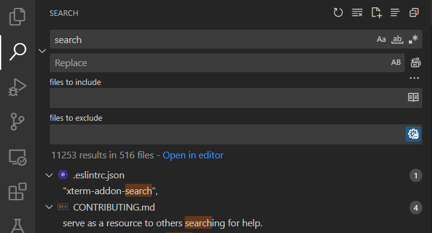

- `search.resultsInfoForeground`：搜索视图中完成消息文本的颜色。例如，此颜色用于显示"`{x} results in {y} files`"的文本。

搜索编辑器颜色用于在搜索编辑器中高亮结果。可以与其他查找匹配项分开配置，以便在同一编辑器中更好地区分不同类型的匹配。

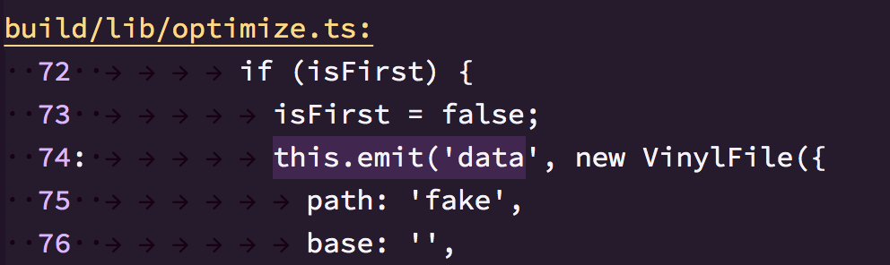

- `searchEditor.findMatchBackground`：搜索编辑器结果的颜色。
- `searchEditor.findMatchBorder`：搜索编辑器结果的边框颜色。
- `searchEditor.textInputBorder`：搜索编辑器文本输入框的边框颜色。

悬停高亮显示在显示悬停信息的符号背后。

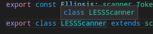

- `editor.hoverHighlightBackground`：显示悬停信息的单词下方的高亮颜色。该颜色不得为不透明，以免遮挡底层装饰。

当前行通常以背景高亮或边框（不同时使用）显示。

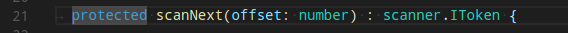

- `editor.lineHighlightBackground`：光标所在行的高亮背景色。
- `editor.inactiveLineHighlightBackground`：编辑器未聚焦时光标所在行的高亮背景色。
- `editor.lineHighlightBorder`：光标所在行边框的背景色。

Unicode 高亮的颜色：

- `editorUnicodeHighlight.border`：用于高亮 Unicode 字符的边框颜色。
- `editorUnicodeHighlight.background`：用于高亮 Unicode 字符的背景色。

链接颜色在点击链接时可见。

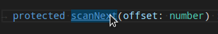

- `editorLink.activeForeground`：活动链接的颜色。

范围高亮在选中搜索结果时可见。

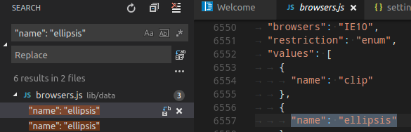

- `editor.rangeHighlightBackground`：高亮范围的背景色，由快速打开、文件内符号和查找功能使用。该颜色不得为不透明，以免遮挡底层装饰。
- `editor.rangeHighlightBorder`：高亮范围边框的背景色。

符号高亮在通过**转到定义**等命令导航到符号时可见。

- `editor.symbolHighlightBackground`：高亮符号的背景色。该颜色不得为不透明，以免遮挡底层装饰。
- `editor.symbolHighlightBorder`：高亮符号边框的背景色。

要查看编辑器中的空白字符，请启用**切换显示空白字符**。

- `editorWhitespace.foreground`：编辑器中空白字符的颜色。

要查看编辑器缩进参考线，请设置 `"editor.guides.indentation": true` 和 `"editor.guides.highlightActiveIndentation": true`。

- `editorIndentGuide.background`：编辑器缩进参考线的颜色。
- `editorIndentGuide.background1`：编辑器缩进参考线的颜色 (1)。
- `editorIndentGuide.background2`：编辑器缩进参考线的颜色 (2)。
- `editorIndentGuide.background3`：编辑器缩进参考线的颜色 (3)。
- `editorIndentGuide.background4`：编辑器缩进参考线的颜色 (4)。
- `editorIndentGuide.background5`：编辑器缩进参考线的颜色 (5)。
- `editorIndentGuide.background6`：编辑器缩进参考线的颜色 (6)。
- `editorIndentGuide.activeBackground`：活动缩进参考线的颜色。
- `editorIndentGuide.activeBackground1`：活动缩进参考线的颜色 (1)。
- `editorIndentGuide.activeBackground2`：活动缩进参考线的颜色 (2)。
- `editorIndentGuide.activeBackground3`：活动缩进参考线的颜色 (3)。
- `editorIndentGuide.activeBackground4`：活动缩进参考线的颜色 (4)。
- `editorIndentGuide.activeBackground5`：活动缩进参考线的颜色 (5)。
- `editorIndentGuide.activeBackground6`：活动缩进参考线的颜色 (6)。

要查看编辑器内联提示，请设置 `"editor.inlineSuggest.enabled": true`。

- `editorInlayHint.background`：内联提示的背景色。
- `editorInlayHint.foreground`：内联提示的前景色。
- `editorInlayHint.typeForeground`：类型内联提示的前景色。
- `editorInlayHint.typeBackground`：类型内联提示的背景色。
- `editorInlayHint.parameterForeground`：参数内联提示的前景色。
- `editorInlayHint.parameterBackground`：参数内联提示的背景色。

要查看编辑器标尺，请通过 `"editor.rulers"` 定义标尺位置。

- `editorRuler.foreground`：编辑器标尺的颜色。

- `editor.linkedEditingBackground`：编辑器处于联动编辑模式时的背景色。

CodeLens：

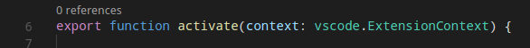

- `editorCodeLens.foreground`：编辑器 CodeLens 的前景色。

灯泡：

- `editorLightBulb.foreground`：灯泡操作图标的颜色。
- `editorLightBulbAutoFix.foreground`：灯泡自动修复操作图标的颜色。
- `editorLightBulbAi.foreground`：灯泡 AI 图标的颜色。

括号匹配：

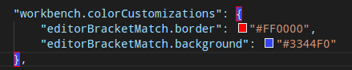

- `editorBracketMatch.background`：匹配括号后面的背景色。
- `editorBracketMatch.border`：匹配括号方框的颜色。
- `editorBracketMatch.foreground`：匹配括号的前景色。

括号对着色：

- `editorBracketHighlight.foreground1`：括号的前景色 (1)。需要启用括号对着色。
- `editorBracketHighlight.foreground2`：括号的前景色 (2)。需要启用括号对着色。
- `editorBracketHighlight.foreground3`：括号的前景色 (3)。需要启用括号对着色。
- `editorBracketHighlight.foreground4`：括号的前景色 (4)。需要启用括号对着色。
- `editorBracketHighlight.foreground5`：括号的前景色 (5)。需要启用括号对着色。
- `editorBracketHighlight.foreground6`：括号的前景色 (6)。需要启用括号对着色。
- `editorBracketHighlight.unexpectedBracket.foreground`：意外括号的前景色。

括号对参考线：

- `editorBracketPairGuide.activeBackground1`：活动括号对参考线的背景色 (1)。需要启用括号对参考线。
- `editorBracketPairGuide.activeBackground2`：活动括号对参考线的背景色 (2)。需要启用括号对参考线。
- `editorBracketPairGuide.activeBackground3`：活动括号对参考线的背景色 (3)。需要启用括号对参考线。
- `editorBracketPairGuide.activeBackground4`：活动括号对参考线的背景色 (4)。需要启用括号对参考线。
- `editorBracketPairGuide.activeBackground5`：活动括号对参考线的背景色 (5)。需要启用括号对参考线。
- `editorBracketPairGuide.activeBackground6`：活动括号对参考线的背景色 (6)。需要启用括号对参考线。

- `editorBracketPairGuide.background1`：非活动括号对参考线的背景色 (1)。需要启用括号对参考线。
- `editorBracketPairGuide.background2`：非活动括号对参考线的背景色 (2)。需要启用括号对参考线。
- `editorBracketPairGuide.background3`：非活动括号对参考线的背景色 (3)。需要启用括号对参考线。
- `editorBracketPairGuide.background4`：非活动括号对参考线的背景色 (4)。需要启用括号对参考线。
- `editorBracketPairGuide.background5`：非活动括号对参考线的背景色 (5)。需要启用括号对参考线。
- `editorBracketPairGuide.background6`：非活动括号对参考线的背景色 (6)。需要启用括号对参考线。

代码折叠：

- `editor.foldBackground`：折叠区域的背景色。该颜色不得为不透明，以免遮挡底层装饰。
- `editor.foldPlaceholderForeground`：折叠区域第一行之后折叠文本的颜色。

概览标尺：

此标尺位于编辑器右侧滚动条下方，提供编辑器中装饰的概览。

- `editorOverviewRuler.background`：编辑器概览标尺的背景色。仅在启用缩略图且放置在编辑器右侧时使用。
- `editorOverviewRuler.border`：概览标尺边框的颜色。
- `editorOverviewRuler.findMatchForeground`：概览标尺中查找匹配项的标记颜色。该颜色不得为不透明，以免遮挡底层装饰。
- `editorOverviewRuler.rangeHighlightForeground`：概览标尺中高亮范围的标记颜色，如快速打开、文件内符号和查找功能所使用。该颜色不得为不透明，以免遮挡底层装饰。
- `editorOverviewRuler.selectionHighlightForeground`：概览标尺中选区高亮的标记颜色。该颜色不得为不透明，以免遮挡底层装饰。
- `editorOverviewRuler.wordHighlightForeground`：概览标尺中符号高亮的标记颜色。该颜色不得为不透明，以免遮挡底层装饰。
- `editorOverviewRuler.wordHighlightStrongForeground`：概览标尺中写入访问符号高亮的标记颜色。该颜色不得为不透明，以免遮挡底层装饰。
- `editorOverviewRuler.wordHighlightTextForeground`：概览标尺中符号文本出现位置的标记颜色。该颜色不得为不透明，以免遮挡底层装饰。
- `editorOverviewRuler.modifiedForeground`：概览标尺中已修改内容的标记颜色。
- `editorOverviewRuler.addedForeground`：概览标尺中已添加内容的标记颜色。
- `editorOverviewRuler.deletedForeground`：概览标尺中已删除内容的标记颜色。
- `editorOverviewRuler.errorForeground`：概览标尺中错误的标记颜色。
- `editorOverviewRuler.warningForeground`：概览标尺中警告的标记颜色。
- `editorOverviewRuler.infoForeground`：概览标尺中信息的标记颜色。
- `editorOverviewRuler.bracketMatchForeground`：概览标尺中匹配括号的标记颜色。
- `editorOverviewRuler.inlineChatInserted`：概览标尺中内联聊天插入内容的标记颜色。
- `editorOverviewRuler.inlineChatRemoved`：概览标尺中内联聊天删除内容的标记颜色。
- `editorOverviewRuler.commentDraftForeground`：编辑器概览标尺中带有草稿评论的评论线程装饰颜色。此颜色应为不透明。

错误和警告：

- `editorError.foreground`：编辑器中错误波浪线的前景色。
- `editorError.border`：编辑器中错误方框的边框颜色。
- `editorError.background`：编辑器中错误文本的背景色。该颜色不得为不透明，以免遮挡底层装饰。
- `editorWarning.foreground`：编辑器中警告波浪线的前景色。
- `editorWarning.border`：编辑器中警告方框的边框颜色。
- `editorWarning.background`：编辑器中警告文本的背景色。该颜色不得为不透明，以免遮挡底层装饰。
- `editorInfo.foreground`：编辑器中信息波浪线的前景色。
- `editorInfo.border`：编辑器中信息方框的边框颜色。
- `editorInfo.background`：编辑器中信息文本的背景色。该颜色不得为不透明，以免遮挡底层装饰。
- `editorHint.foreground`：编辑器中提示的前景色。
- `editorHint.border`：编辑器中提示方框的边框颜色。
- `problemsErrorIcon.foreground`：问题错误图标的颜色。
- `problemsWarningIcon.foreground`：问题警告图标的颜色。
- `problemsInfoIcon.foreground`：问题信息图标的颜色。

未使用的源代码：

- `editorUnnecessaryCode.border`：编辑器中未使用源代码的边框颜色。
- `editorUnnecessaryCode.opacity`：编辑器中未使用源代码的不透明度。例如，`"#000000c0"` 将以 75% 的不透明度渲染代码。对于高对比度主题，请使用 `"editorUnnecessaryCode.border"` 主题颜色来为未使用的代码添加下划线，而不是淡出显示。

行号栏包含字形边距和行号：

- `editorGutter.background`：编辑器行号栏的背景色。行号栏包含字形边距和行号。
- `editorGutter.modifiedBackground`：已修改行的编辑器行号栏背景色。
- `editorGutter.modifiedSecondaryBackground`：已修改行的编辑器行号栏次要背景色。
- `editorGutter.addedBackground`：已添加行的编辑器行号栏背景色。
- `editorGutter.addedSecondaryBackground`：已添加行的编辑器行号栏次要背景色。
- `editorGutter.deletedBackground`：已删除行的编辑器行号栏背景色。
- `editorGutter.deletedSecondaryBackground`：已删除行的编辑器行号栏次要背景色。
- `editorGutter.commentRangeForeground`：编辑器行号栏中评论范围的装饰颜色。
- `editorGutter.commentGlyphForeground`：编辑器行号栏中评论字形的装饰颜色。
- `editorGutter.commentUnresolvedGlyphForeground`：编辑器行号栏中未解决评论线程评论字形的装饰颜色。
- `editorGutter.foldingControlForeground`：编辑器行号栏中折叠控件的颜色。
- `editorGutter.itemGlyphForeground`：编辑器行号栏中项目字形的装饰颜色。
- `editorGutter.itemBackground`：编辑器行号栏中项目背景的装饰颜色。此颜色应为不透明。
- `editorGutter.commentDraftGlyphForeground`：编辑器行号栏中带有草稿评论的评论线程评论字形的装饰颜色。

编辑器评论控件在审查拉取请求时可见：

- `editorCommentsWidget.resolvedBorder`：已解决评论的边框和箭头颜色。
- `editorCommentsWidget.unresolvedBorder`：未解决评论的边框和箭头颜色。
- `editorCommentsWidget.rangeBackground`：评论范围的背景色。
- `editorCommentsWidget.rangeActiveBackground`：当前选中或悬停评论范围的背景色。
- `editorCommentsWidget.replyInputBackground`：评论回复输入框的背景色。

编辑器内联编辑在使用 Copilot 建议下一步修改时可见：

- `inlineEdit.gutterIndicator.primaryBorder`：主内联编辑行号栏指示器的边框颜色。
- `inlineEdit.gutterIndicator.primaryForeground`：主内联编辑行号栏指示器的前景色。
- `inlineEdit.gutterIndicator.primaryBackground`：主内联编辑行号栏指示器的背景色。
- `inlineEdit.gutterIndicator.secondaryBorder`：次内联编辑行号栏指示器的边框颜色。
- `inlineEdit.gutterIndicator.secondaryForeground`：次内联编辑行号栏指示器的前景色。
- `inlineEdit.gutterIndicator.secondaryBackground`：次内联编辑行号栏指示器的背景色。
- `inlineEdit.gutterIndicator.successfulBorder`：成功内联编辑行号栏指示器的边框颜色。
- `inlineEdit.gutterIndicator.successfulForeground`：成功内联编辑行号栏指示器的前景色。
- `inlineEdit.gutterIndicator.successfulBackground`：成功内联编辑行号栏指示器的背景色。
- `inlineEdit.gutterIndicator.background`：内联编辑行号栏指示器的背景色。
- `inlineEdit.originalBackground`：内联编辑中原始文本的背景色。
- `inlineEdit.modifiedBackground`：内联编辑中修改后文本的背景色。
- `inlineEdit.originalChangedLineBackground`：内联编辑中原始文本已更改行的背景色。
- `inlineEdit.originalChangedTextBackground`：内联编辑中原始文本已更改文本的叠加颜色。
- `inlineEdit.modifiedChangedLineBackground`：内联编辑中修改后文本已更改行的背景色。
- `inlineEdit.modifiedChangedTextBackground`：内联编辑中修改后文本已更改文本的叠加颜色。
- `inlineEdit.originalBorder`：内联编辑中原始文本的边框颜色。
- `inlineEdit.modifiedBorder`：内联编辑中修改后文本的边框颜色。
- `inlineEdit.tabWillAcceptModifiedBorder`：当 Tab 键将接受内联编辑控件时，修改后文本的边框颜色。
- `inlineEdit.tabWillAcceptOriginalBorder`：当 Tab 键将接受内联编辑控件时，原始文本的边框颜色。

## Diff 编辑器颜色

对于插入和删除的文本着色，请使用背景色或边框颜色，但不要同时使用两者。

- `diffEditor.insertedTextBackground`：已插入文本的背景色。该颜色不得为不透明，以免遮挡底层装饰。
- `diffEditor.insertedTextBorder`：已插入文本的轮廓颜色。
- `diffEditor.removedTextBackground`：已删除文本的背景色。该颜色不得为不透明，以免遮挡底层装饰。
- `diffEditor.removedTextBorder`：已删除文本的轮廓颜色。
- `diffEditor.border`：两个文本编辑器之间的边框颜色。
- `diffEditor.diagonalFill`：Diff 编辑器对角线填充的颜色。对角线填充用于并排差异视图。
- `diffEditor.insertedLineBackground`：已插入行的背景色。该颜色不得为不透明，以免遮挡底层装饰。
- `diffEditor.removedLineBackground`：已删除行的背景色。该颜色不得为不透明，以免遮挡底层装饰。
- `diffEditorGutter.insertedLineBackground`：已插入行对应的边距区域背景色。
- `diffEditorGutter.removedLineBackground`：已删除行对应的边距区域背景色。
- `diffEditorOverview.insertedForeground`：差异编辑器概览标尺中已插入内容的前景色。
- `diffEditorOverview.removedForeground`：差异编辑器概览标尺中已删除内容的前景色。
- `diffEditor.unchangedRegionBackground`：差异编辑器中未更改块的颜色。
- `diffEditor.unchangedRegionForeground`：差异编辑器中未更改块的前景色。
- `diffEditor.unchangedRegionShadow`：未更改区域部件周围阴影的颜色。
- `diffEditor.unchangedCodeBackground`：差异编辑器中未更改代码的背景色。
- `diffEditor.move.border`：差异编辑器中被移动文本的边框颜色。
- `diffEditor.moveActive.border`：差异编辑器中被移动文本的活动边框颜色。
- `multiDiffEditor.headerBackground`：差异编辑器标题的背景色。
- `multiDiffEditor.background`：多文件差异编辑器的背景色。
- `multiDiffEditor.border`：多文件差异编辑器的边框颜色。

## Chat 颜色

- `chat.requestBorder`：Chat 请求的边框颜色。
- `chat.requestBackground`：Chat 请求的背景色。
- `chat.slashCommandBackground`：Chat 斜杠命令的背景色。
- `chat.slashCommandForeground`：Chat 斜杠命令的前景色。
- `chat.avatarBackground`：Chat 头像的背景色。
- `chat.avatarForeground`：Chat 头像的前景色。
- `chat.editedFileForeground`：Chat 已编辑文件列表中已编辑文件的前景色。
- `chat.linesAddedForeground`：Chat 代码块胶囊中新增行的前景色。
- `chat.linesRemovedForeground`：Chat 代码块胶囊中删除行的前景色。
- `chat.requestCodeBorder`：Chat 请求气泡内代码块的边框颜色。
- `chat.requestBubbleBackground`：Chat 请求气泡的背景色。
- `chat.requestBubbleHoverBackground`：鼠标悬停时 Chat 请求气泡的背景色。
- `chat.checkpointSeparator`：Chat 检查点分隔符颜色。
- `chat.thinkingShimmer`：思考/工作标签的闪烁高亮效果。
- `chatManagement.sashBorder`：Chat 管理编辑器分拆视图分隔条的边框颜色。

## 内联 Chat 颜色

- `inlineChat.background`：交互式编辑器部件的背景色。
- `inlineChat.foreground`：交互式编辑器部件的前景色。
- `inlineChat.border`：交互式编辑器部件的边框颜色。
- `inlineChat.shadow`：交互式编辑器部件的阴影颜色。
- `inlineChatInput.border`：交互式编辑器输入框的边框颜色。
- `inlineChatInput.focusBorder`：交互式编辑器输入框获得焦点时的边框颜色。
- `inlineChatInput.placeholderForeground`：交互式编辑器输入框占位符的前景色。
- `inlineChatInput.background`：交互式编辑器输入框的背景色。
- `inlineChatDiff.inserted`：交互式编辑器输入框中已插入文本的背景色。
- `inlineChatDiff.removed`：交互式编辑器输入框中已删除文本的背景色。

## 面板 Chat 颜色

- `interactive.activeCodeBorder`：编辑器获得焦点时当前交互式代码单元格的边框颜色。
- `interactive.inactiveCodeBorder`：编辑器未获得焦点时当前交互式代码单元格的边框颜色。

## 编辑器部件颜色

编辑器部件显示在编辑器内容的前方。例如查找/替换对话框、建议部件和编辑器悬停提示。

- `editorWidget.foreground`：编辑器部件（如查找/替换）的前景色。
- `editorWidget.background`：编辑器部件（如查找/替换）的背景色。
- `editorWidget.border`：编辑器部件的边框颜色，除非部件不包含边框或自定义了边框颜色。
- `editorWidget.resizeBorder`：编辑器部件调整大小条的边框颜色。仅当部件选择显示调整大小边框且颜色未被部件覆盖时才使用。

- `editorSuggestWidget.background`：建议部件的背景色。
- `editorSuggestWidget.border`：建议部件的边框颜色。
- `editorSuggestWidget.foreground`：建议部件的前景色。
- `editorSuggestWidget.focusHighlightForeground`：建议部件中某项获得焦点时匹配高亮的颜色。
- `editorSuggestWidget.highlightForeground`：建议部件中匹配高亮的颜色。
- `editorSuggestWidget.selectedBackground`：建议部件中选中项的背景色。
- `editorSuggestWidget.selectedForeground`：建议部件中选中项的前景色。
- `editorSuggestWidget.selectedIconForeground`：建议部件中选中项图标的前景色。
- `editorSuggestWidgetStatus.foreground`：建议部件状态的前景色。

- `editorHoverWidget.foreground`：编辑器悬停提示的前景色。
- `editorHoverWidget.background`：编辑器悬停提示的背景色。
- `editorHoverWidget.border`：编辑器悬停提示的边框颜色。
- `editorHoverWidget.highlightForeground`：参数提示中活动项的前景色。
- `editorHoverWidget.statusBarBackground`：编辑器悬停提示状态栏的背景色。

- `editorGhostText.border`：内联补全提供程序和建议预览所显示的幽灵文本的边框颜色。
- `editorGhostText.background`：编辑器中幽灵文本的背景色。
- `editorGhostText.foreground`：内联补全提供程序和建议预览所显示的幽灵文本的前景色。

- `editorStickyScroll.background`：编辑器粘性滚动背景色。
- `editorStickyScroll.border`：编辑器粘性滚动的边框颜色。
- `editorStickyScroll.shadow`：编辑器粘性滚动的阴影颜色。
- `editorStickyScrollGutter.background`：编辑器粘性滚动边距区域的背景色。
- `editorStickyScrollHover.background`：编辑器粘性滚动悬停时的背景色。

调试异常部件是一个速览视图，在调试因异常停止时显示在编辑器中。

- `debugExceptionWidget.background`：异常部件的背景色。
- `debugExceptionWidget.border`：异常部件的边框颜色。

编辑器标记视图在编辑器中导航到错误和警告时显示（**转到下一个错误或警告**命令）。

- `editorMarkerNavigation.background`：编辑器标记导航部件的背景色。
- `editorMarkerNavigationError.background`：编辑器标记导航部件的错误颜色。
- `editorMarkerNavigationWarning.background`：编辑器标记导航部件的警告颜色。
- `editorMarkerNavigationInfo.background`：编辑器标记导航部件的信息颜色。
- `editorMarkerNavigationError.headerBackground`：编辑器标记导航部件错误标题的背景色。
- `editorMarkerNavigationWarning.headerBackground`：编辑器标记导航部件警告标题的背景色。
- `editorMarkerNavigationInfo.headerBackground`：编辑器标记导航部件信息标题的背景色。

## 速览视图颜色

速览视图用于在编辑器内部以内嵌视图的方式显示引用和声明。

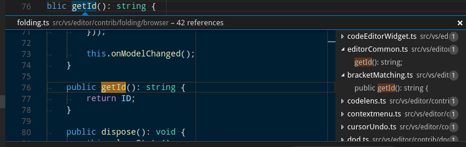

- `peekView.border`：速览视图边框和箭头的颜色。
- `peekViewEditor.background`：速览视图编辑器的背景色。
- `peekViewEditorGutter.background`：速览视图编辑器边距的背景色。
- `peekViewEditor.matchHighlightBackground`：速览视图编辑器中匹配高亮的颜色。
- `peekViewEditor.matchHighlightBorder`：速览视图编辑器中匹配高亮的边框颜色。
- `peekViewResult.background`：速览视图结果列表的背景色。
- `peekViewResult.fileForeground`：速览视图结果列表中文件节点的前景色。
- `peekViewResult.lineForeground`：速览视图结果列表中行节点的前景色。
- `peekViewResult.matchHighlightBackground`：速览视图结果列表中匹配高亮的颜色。
- `peekViewResult.selectionBackground`：速览视图结果列表中选中项的背景色。
- `peekViewResult.selectionForeground`：速览视图结果列表中选中项的前景色。
- `peekViewTitle.background`：速览视图标题区域的背景色。
- `peekViewTitleDescription.foreground`：速览视图标题信息的颜色。
- `peekViewTitleLabel.foreground`：速览视图标题的颜色。
- `peekViewEditorStickyScroll.background`：速览视图编辑器中粘性滚动的背景色。
- `peekViewEditorStickyScrollGutter.background`：速览视图编辑器中粘性滚动边距区域的背景色。

## 合并冲突颜色

当编辑器包含特殊的差异范围时，会显示合并冲突装饰。

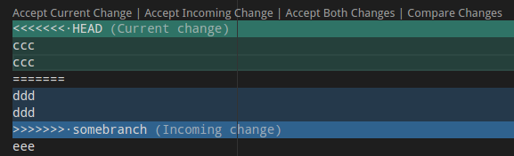

- `merge.currentHeaderBackground`：内联合并冲突中当前标题的背景色。该颜色不得为不透明，以免遮挡底层装饰。
- `merge.currentContentBackground`：内联合并冲突中当前内容的背景色。该颜色不得为不透明，以免遮挡底层装饰。
- `merge.incomingHeaderBackground`：内联合并冲突中传入标题的背景色。该颜色不得为不透明，以免遮挡底层装饰。
- `merge.incomingContentBackground`：内联合并冲突中传入内容的背景色。该颜色不得为不透明，以免遮挡底层装饰。
- `merge.border`：内联合并冲突中标题和分隔线的边框颜色。
- `merge.commonContentBackground`：内联合并冲突中共同祖先内容的背景色。该颜色不得为不透明，以免遮挡底层装饰。
- `merge.commonHeaderBackground`：内联合并冲突中共同祖先标题的背景色。该颜色不得为不透明，以免遮挡底层装饰。
- `editorOverviewRuler.currentContentForeground`：内联合并冲突中当前内容的概览标尺前景色。
- `editorOverviewRuler.incomingContentForeground`：内联合并冲突中传入内容的概览标尺前景色。
- `editorOverviewRuler.commonContentForeground`：内联合并冲突中共同祖先内容的概览标尺前景色。
- `editorOverviewRuler.commentForeground`：编辑器概览标尺中已解决评论的装饰颜色。该颜色应为不透明。
- `editorOverviewRuler.commentUnresolvedForeground`：编辑器概览标尺中未解决评论的装饰颜色。该颜色应为不透明。
- `mergeEditor.change.background`：更改的背景色。
- `mergeEditor.change.word.background`：单词级别更改的背景色。
- `mergeEditor.conflict.unhandledUnfocused.border`：未处理且未聚焦冲突的边框颜色。
- `mergeEditor.conflict.unhandledFocused.border`：未处理但已聚焦冲突的边框颜色。
- `mergeEditor.conflict.handledUnfocused.border`：已处理但未聚焦冲突的边框颜色。
- `mergeEditor.conflict.handledFocused.border`：已处理且已聚焦冲突的边框颜色。
- `mergeEditor.conflict.handled.minimapOverViewRuler`：输入 1 中更改的前景色。
- `mergeEditor.conflict.unhandled.minimapOverViewRuler`：输入 1 中更改的前景色。
- `mergeEditor.conflictingLines.background`："冲突行"文本的背景色。
- `mergeEditor.changeBase.background`：基准版本中更改的背景色。
- `mergeEditor.changeBase.word.background`：基准版本中单词级别更改的背景色。
- `mergeEditor.conflict.input1.background`：输入 1 中装饰的背景色。
- `mergeEditor.conflict.input2.background`：输入 2 中装饰的背景色。

## 面板颜色

面板显示在编辑器区域下方，包含输出视图和集成终端等视图。

- `panel.background`：面板的背景色。
- `panel.border`：面板与编辑器之间的分隔边框颜色。
- `panel.dropBorder`：面板标题的拖放反馈颜色。面板显示在编辑器区域下方，包含输出视图和集成终端等视图。
- `panelTitle.activeBorder`：活动面板标题的边框颜色。
- `panelTitle.activeForeground`：活动面板的标题颜色。
- `panelTitle.inactiveForeground`：非活动面板的标题颜色。
- `panelTitle.border`：面板标题底部的边框颜色，用于分隔标题与视图。面板显示在编辑器区域下方，包含输出视图和集成终端等视图。
- `panelTitleBadge.background`：面板标题徽章的背景色。面板显示在编辑器区域下方，包含输出视图和集成终端等视图。
- `panelTitleBadge.foreground`：面板标题徽章的前景色。面板显示在编辑器区域下方，包含输出视图和集成终端等视图。
- `panelInput.border`：面板中输入框的边框颜色。
- `panelSection.border`：当面板中多个视图水平堆叠时的分区边框颜色。面板显示在编辑器区域下方，包含输出视图和集成终端等视图。
- `panelSection.dropBackground`：面板分区的拖放反馈颜色。该颜色应具有透明度，以便面板分区仍可透出。面板显示在编辑器区域下方，包含输出视图和集成终端等视图。
- `panelSectionHeader.background`：面板分区标题的背景色。面板显示在编辑器区域下方，包含输出视图和集成终端等视图。
- `panelSectionHeader.foreground`：面板分区标题的前景色。面板显示在编辑器区域下方，包含输出视图和集成终端等视图。
- `panelStickyScroll.background`：面板中粘性滚动的背景色。
- `panelStickyScroll.border`：面板中粘性滚动的边框颜色。
- `panelStickyScroll.shadow`：面板中粘性滚动的阴影颜色。
- `panelSectionHeader.border`：当面板中多个视图垂直堆叠时的分区标题边框颜色。面板显示在编辑器区域下方，包含输出视图和集成终端等视图。
- `outputView.background`：输出视图的背景色。
- `outputViewStickyScroll.background`：输出视图粘性滚动的背景色。

## 状态栏颜色

状态栏显示在工作台底部。

- `statusBar.background`：标准状态栏的背景色。
- `statusBar.foreground`：状态栏的前景色。
- `statusBar.border`：状态栏与编辑器之间的分隔边框颜色。
- `statusBar.debuggingBackground`：调试程序时状态栏的背景色。
- `statusBar.debuggingForeground`：调试程序时状态栏的前景色。
- `statusBar.debuggingBorder`：调试程序时状态栏与编辑器之间的分隔边框颜色。
- `statusBar.noFolderForeground`：未打开文件夹时状态栏的前景色。
- `statusBar.noFolderBackground`：未打开文件夹时状态栏的背景色。
- `statusBar.noFolderBorder`：未打开文件夹时状态栏与编辑器之间的分隔边框颜色。
- `statusBarItem.activeBackground`：点击时状态栏项的背景色。
- `statusBarItem.hoverForeground`：鼠标悬停时状态栏项的前景色。状态栏显示在窗口底部。
- `statusBarItem.hoverBackground`：鼠标悬停时状态栏项的背景色。
- `statusBarItem.prominentForeground`：状态栏醒目项的前景色。
- `statusBarItem.prominentBackground`：状态栏醒目项的背景色。
- `statusBarItem.prominentHoverForeground`：鼠标悬停时状态栏醒目项的前景色。醒目项会从其他状态栏条目中突出显示以表示重要性。状态栏显示在窗口底部。
- `statusBarItem.prominentHoverBackground`：鼠标悬停时状态栏醒目项的背景色。
- `statusBarItem.remoteBackground`：状态栏上远程指示器的背景色。
- `statusBarItem.remoteForeground`：状态栏上远程指示器的前景色。
- `statusBarItem.remoteHoverBackground`：鼠标悬停时状态栏上远程指示器的背景色。
- `statusBarItem.remoteHoverForeground`：鼠标悬停时状态栏上远程指示器的前景色。
- `statusBarItem.errorBackground`：状态栏错误项的背景色。错误项会从其他状态栏条目中突出显示以表示错误状态。
- `statusBarItem.errorForeground`：状态栏错误项的前景色。错误项会从其他状态栏条目中突出显示以表示错误状态。
- `statusBarItem.errorHoverBackground`：鼠标悬停时状态栏错误项的背景色。错误项会从其他状态栏条目中突出显示以表示错误状态。状态栏显示在窗口底部。
- `statusBarItem.errorHoverForeground`：鼠标悬停时状态栏错误项的前景色。错误项会从其他状态栏条目中突出显示以表示错误状态。状态栏显示在窗口底部。
- `statusBarItem.warningBackground`：状态栏警告项的背景色。警告项会从其他状态栏条目中突出显示以表示警告状态。状态栏显示在窗口底部。
- `statusBarItem.warningForeground`：状态栏警告项的前景色。警告项会从其他状态栏条目中突出显示以表示警告状态。状态栏显示在窗口底部。
- `statusBarItem.warningHoverBackground`：鼠标悬停时状态栏警告项的背景色。警告项会从其他状态栏条目中突出显示以表示警告状态。状态栏显示在窗口底部。
- `statusBarItem.warningHoverForeground`：鼠标悬停时状态栏警告项的前景色。警告项会从其他状态栏条目中突出显示以表示警告状态。状态栏显示在窗口底部。
- `statusBarItem.compactHoverBackground`：当悬停包含两个悬停提示的状态栏项时的背景色。状态栏显示在窗口底部。
- `statusBarItem.focusBorder`：键盘导航聚焦时状态栏项的边框颜色。状态栏显示在窗口底部。
- `statusBar.focusBorder`：键盘导航聚焦时状态栏的边框颜色。状态栏显示在窗口底部。
- `statusBarItem.offlineBackground`：工作台离线时状态栏项的背景色。
- `statusBarItem.offlineForeground`：工作台离线时状态栏项的前景色。
- `statusBarItem.offlineHoverForeground`：工作台离线时状态栏项的悬停前景色。
- `statusBarItem.offlineHoverBackground`：工作台离线时状态栏项的悬停背景色。

醒目项会从其他状态栏条目中突出显示以表示重要性。例如 **Toggle Tab Key Moves Focus** 命令的更改模式指示器。

## 标题栏颜色

- `titleBar.activeBackground`：窗口活动时标题栏的背景色。
- `titleBar.activeForeground`：窗口活动时标题栏的前景色。
- `titleBar.inactiveBackground`：窗口非活动时标题栏的背景色。
- `titleBar.inactiveForeground`：窗口非活动时标题栏的前景色。
- `titleBar.border`：标题栏的边框颜色。

## 菜单栏颜色

- `menubar.selectionForeground`：菜单栏中选中菜单项的前景色。
- `menubar.selectionBackground`：菜单栏中选中菜单项的背景色。
- `menubar.selectionBorder`：菜单栏中选中菜单项的边框颜色。
- `menu.foreground`：菜单项的前景色。
- `menu.background`：菜单项的背景色。
- `menu.selectionForeground`：菜单中选中菜单项的前景色。
- `menu.selectionBackground`：菜单中选中菜单项的背景色。
- `menu.selectionBorder`：菜单中选中菜单项的边框颜色。
- `menu.separatorBackground`：菜单中分隔线的颜色。
- `menu.border`：菜单的边框颜色。

## 命令中心颜色

- `commandCenter.foreground`：命令中心的前景色。
- `commandCenter.activeForeground`：命令中心的活动前景色。
- `commandCenter.background`：命令中心的背景色。
- `commandCenter.activeBackground`：命令中心的活动背景色。
- `commandCenter.border`：命令中心的边框颜色。
- `commandCenter.inactiveForeground`：窗口非活动时命令中心的前景色。
- `commandCenter.inactiveBorder`：窗口非活动时命令中心的边框颜色。
- `commandCenter.activeBorder`：命令中心的活动边框颜色。
- `commandCenter.debuggingBackground`：调试程序时命令中心的背景色。

## 通知颜色

通知提示从工作台右下角滑出。

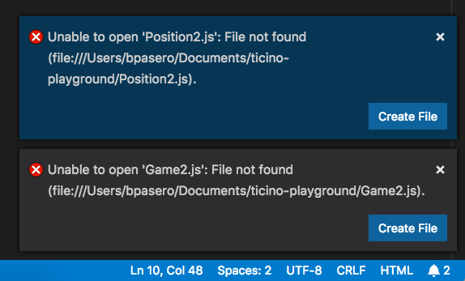

在通知中心打开后，通知会显示在带有标题的列表中：

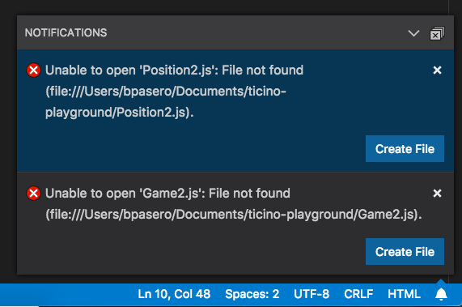

- `notificationCenter.border`：通知中心的边框颜色。
- `notificationCenterHeader.foreground`：通知中心标题的前景色。
- `notificationCenterHeader.background`：通知中心标题的背景色。
- `notificationToast.border`：通知提示的边框颜色。
- `notifications.foreground`：通知的前景色。
- `notifications.background`：通知的背景色。
- `notifications.border`：通知中心中各通知之间的分隔边框颜色。
- `notificationLink.foreground`：通知链接的前景色。
- `notificationsErrorIcon.foreground`：通知错误图标使用的颜色。
- `notificationsWarningIcon.foreground`：通知警告图标使用的颜色。
- `notificationsInfoIcon.foreground`：通知信息图标使用的颜色。

## 横幅颜色

横幅显示在标题栏下方，可见时横跨整个工作台宽度。

- `banner.background`：横幅的背景色。
- `banner.foreground`：横幅的前景色。
- `banner.iconForeground`：横幅文本前图标的颜色。

## 扩展颜色

- `extensionButton.prominentForeground`：扩展视图按钮的前景色（例如 **Install** 按钮）。
- `extensionButton.prominentBackground`：扩展视图按钮的背景色。
- `extensionButton.prominentHoverBackground`：扩展视图按钮的悬停背景色。
- `extensionButton.background`：扩展操作按钮的背景色。
- `extensionButton.foreground`：扩展操作按钮的前景色。
- `extensionButton.hoverBackground`：扩展操作按钮的悬停背景色。
- `extensionButton.separator`：扩展操作按钮的分隔符颜色。
- `extensionButton.border`：扩展操作按钮的边框颜色。
- `extensionBadge.remoteBackground`：扩展视图中远程徽章的背景色。
- `extensionBadge.remoteForeground`：扩展视图中远程徽章的前景色。
- `extensionIcon.starForeground`：扩展评分图标颜色。
- `extensionIcon.verifiedForeground`：扩展已验证发布者图标颜色。
- `extensionIcon.preReleaseForeground`：预发布版扩展图标颜色。
- `extensionIcon.sponsorForeground`：扩展赞助图标颜色。
- `extensionIcon.privateForeground`：私有扩展图标颜色。
- `mcpIcon.starForeground`：MCP 星标图标颜色。

## 快速选择器颜色

- `pickerGroup.border`：快速选择器（快速打开）分组边框的颜色。
- `pickerGroup.foreground`：快速选择器（快速打开）分组标签的颜色。
- `quickInput.background`：快速输入的背景色。快速输入部件是颜色主题选择器等视图的容器。
- `quickInput.foreground`：快速输入的前景色。快速输入部件是颜色主题选择器等视图的容器。
- `quickInputList.focusBackground`：快速选择器中聚焦项的背景色。
- `quickInputList.focusForeground`：快速选择器中聚焦项的前景色。
- `quickInputList.focusIconForeground`：快速选择器中聚焦项图标的前景色。
- `quickInputTitle.background`：快速选择器标题的背景色。快速选择器部件是命令面板等选择器的容器。

## 快捷键标签颜色

当命令关联了快捷键时会显示快捷键标签。可以在命令面板中看到快捷键标签示例：

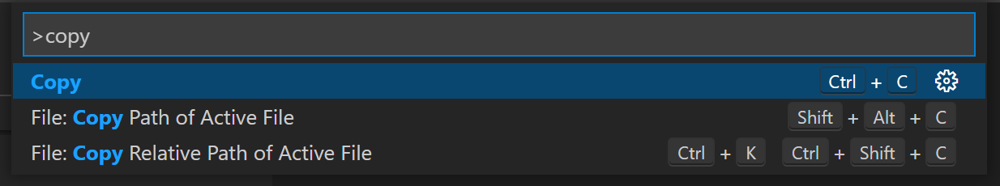

快捷键标签的使用场景包括（但不限于）：

- 命令面板
- 键盘快捷键编辑器
- 键盘快捷键录制弹窗
- 扩展市场页面的"功能贡献"部分

可用的自定义项如下：

- `keybindingLabel.background`：快捷键标签的背景色。快捷键标签用于表示键盘快捷方式。
- `keybindingLabel.foreground`：快捷键标签的前景色。快捷键标签用于表示键盘快捷方式。
- `keybindingLabel.border`：快捷键标签的边框颜色。快捷键标签用于表示键盘快捷方式。
- `keybindingLabel.bottomBorder`：快捷键标签的底部边框颜色。快捷键标签用于表示键盘快捷方式。

## 键盘快捷方式表格颜色

- `keybindingTable.headerBackground`：键盘快捷方式表格标题的背景色。
- `keybindingTable.rowsBackground`：键盘快捷方式表格交替行的背景色。

## 集成终端颜色

- `terminal.background`：集成终端视口的背景色。
- `terminal.border`：终端内分隔窗格的边框颜色。默认为 panel.border。
- `terminal.foreground`：集成终端的默认前景色。
- `terminal.ansiBlack`：终端中的 'Black' ANSI 颜色。
- `terminal.ansiBlue`：终端中的 'Blue' ANSI 颜色。
- `terminal.ansiBrightBlack`：终端中的 'BrightBlack' ANSI 颜色。
- `terminal.ansiBrightBlue`：终端中的 'BrightBlue' ANSI 颜色。
- `terminal.ansiBrightCyan`：终端中的 'BrightCyan' ANSI 颜色。
- `terminal.ansiBrightGreen`：终端中的 'BrightGreen' ANSI 颜色。
- `terminal.ansiBrightMagenta`：终端中的 'BrightMagenta' ANSI 颜色。
- `terminal.ansiBrightRed`：终端中的 'BrightRed' ANSI 颜色。
- `terminal.ansiBrightWhite`：终端中的 'BrightWhite' ANSI 颜色。
- `terminal.ansiBrightYellow`：终端中的 'BrightYellow' ANSI 颜色。
- `terminal.ansiCyan`：终端中的 'Cyan' ANSI 颜色。
- `terminal.ansiGreen`：终端中的 'Green' ANSI 颜色。
- `terminal.ansiMagenta`：终端中的 'Magenta' ANSI 颜色。
- `terminal.ansiRed`：终端中的 'Red' ANSI 颜色。
- `terminal.ansiWhite`：终端中的 'White' ANSI 颜色。
- `terminal.ansiYellow`：终端中的 'Yellow' ANSI 颜色。
- `terminal.selectionBackground`：终端的选区背景色。
- `terminal.selectionForeground`：终端的选区前景色。当此值为 null 时，选区前景色将保持不变并应用最小对比度功能。
- `terminal.inactiveSelectionBackground`：终端未获得焦点时的选区背景色。
- `terminal.findMatchBackground`：终端中当前搜索匹配的颜色。该颜色不得为不透明，以免遮挡底层终端内容。
- `terminal.findMatchBorder`：终端中当前搜索匹配的边框颜色。
- `terminal.findMatchHighlightBackground`：终端中其他搜索匹配的颜色。该颜色不得为不透明，以免遮挡底层终端内容。
- `terminal.findMatchHighlightBorder`：终端中其他搜索匹配的边框颜色。
- `terminal.hoverHighlightBackground`：终端中悬停链接时的高亮颜色。
- `terminalCursor.background`：终端光标的背景色。允许自定义被块状光标覆盖的字符颜色。
- `terminalCursor.foreground`：终端光标的前景色。
- `terminal.dropBackground`：拖拽到终端上方的背景色。该颜色应具有透明度，以便终端内容仍可透出。
- `terminal.tab.activeBorder`：面板中终端标签页侧边的边框。默认为 `tab.activeBorder`。
- `terminalCommandDecoration.defaultBackground`：终端命令装饰的默认背景色。
- `terminalCommandDecoration.successBackground`：成功命令的终端命令装饰背景色。
- `terminalCommandDecoration.errorBackground`：错误命令的终端命令装饰背景色。
- `terminalOverviewRuler.cursorForeground`：概览标尺中光标的颜色。
- `terminalOverviewRuler.findMatchForeground`：终端中搜索匹配在概览标尺上的标记颜色。
- `terminalStickyScroll.background`：终端中粘性滚动覆盖层的背景色。
- `terminalStickyScroll.border`：终端中粘性滚动覆盖层的边框颜色。
- `terminalStickyScrollHover.background`：终端中悬停时粘性滚动覆盖层的背景色。
- `terminal.initialHintForeground`：终端初始提示的前景色。
- `terminalOverviewRuler.border`：概览标尺左侧的边框颜色。
- `terminalCommandGuide.foreground`：悬停时显示在命令及其输出左侧的终端命令引导线的前景色。

- `terminalSymbolIcon.aliasForeground`：别名图标的前景色。这些图标会出现在终端建议部件中。
- `terminalSymbolIcon.branchForeground`：分支图标的前景色。这些图标会出现在终端建议部件中。
- `terminalSymbolIcon.commitForeground`：提交图标的前景色。这些图标会出现在终端建议部件中。
- `terminalSymbolIcon.flagForeground`：标志图标的前景色。这些图标会出现在终端建议部件中。
- `terminalSymbolIcon.optionForeground`：选项图标的前景色。这些图标会出现在终端建议部件中。
- `terminalSymbolIcon.optionValueForeground`：枚举成员图标的前景色。这些图标会出现在终端建议部件中。
- `terminalSymbolIcon.methodForeground`：方法图标的前景色。这些图标会出现在终端建议部件中。
- `terminalSymbolIcon.argumentForeground`：参数图标的前景色。这些图标会出现在终端建议部件中。
- `terminalSymbolIcon.inlineSuggestionForeground`：内联建议图标的前景色。这些图标会出现在终端建议部件中。
- `terminalSymbolIcon.fileForeground`：文件图标的前景色。这些图标会出现在终端建议部件中。
- `terminalSymbolIcon.folderForeground`：文件夹图标的前景色。这些图标会出现在终端建议部件中。
- `terminalSymbolIcon.pullRequestDoneForeground`：已完成拉取请求图标的前景色。这些图标会出现在终端建议部件中。
- `terminalSymbolIcon.pullRequestForeground`：拉取请求图标的前景色。这些图标会出现在终端建议部件中。
- `terminalSymbolIcon.remoteForeground`：远程图标的前景色。这些图标会出现在终端建议部件中。
- `terminalSymbolIcon.stashForeground`：贮藏图标的前景色。这些图标会出现在终端建议部件中。
- `terminalSymbolIcon.symbolText`：纯文本建议的前景色。这些图标会出现在终端建议部件中。
- `terminalSymbolIcon.symbolicLinkFileForeground`：符号链接文件图标的前景色。这些图标会出现在终端建议部件中。
- `terminalSymbolIcon.symbolicLinkFolderForeground`：符号链接文件夹图标的前景色。这些图标会出现在终端建议部件中。
- `terminalSymbolIcon.tagForeground`：标签图标的前景色。这些图标会出现在终端建议部件中。

## 调试颜色

- `debugToolBar.background`：调试工具栏的背景色。
- `debugToolBar.border`：调试工具栏的边框颜色。
- `editor.stackFrameHighlightBackground`：编辑器中顶层堆栈帧高亮的背景色。
- `editor.focusedStackFrameHighlightBackground`：编辑器中聚焦堆栈帧高亮的背景色。
- `editor.inlineValuesForeground`：调试内联值文本的颜色。
- `editor.inlineValuesBackground`：调试内联值背景的颜色。
- `debugView.exceptionLabelForeground`：调试器在异常处中断时调用堆栈视图中标签的前景色。
- `debugView.exceptionLabelBackground`：调试器在异常处中断时调用堆栈视图中标签的背景色。
- `debugView.stateLabelForeground`：调用堆栈视图中显示当前会话或线程状态的标签的前景色。
- `debugView.stateLabelBackground`：调用堆栈视图中显示当前会话或线程状态的标签的背景色。
- `debugView.valueChangedHighlight`：调试视图（如变量视图）中用于高亮值更改的颜色。
- `debugTokenExpression.name`：调试视图（如变量或监视视图）中显示的标记名称的前景色。
- `debugTokenExpression.value`：调试视图中显示的标记值的前景色。
- `debugTokenExpression.string`：调试视图中字符串的前景色。
- `debugTokenExpression.boolean`：调试视图中布尔值的前景色。
- `debugTokenExpression.number`：调试视图中数字的前景色。
- `debugTokenExpression.error`：调试视图中表达式错误的前景色。
- `debugTokenExpression.type`：调试视图（即变量或监视视图）中显示的标记类型的前景色。

## 测试颜色

- `testing.runAction`：编辑器中"运行"图标的颜色。
- `testing.iconErrored`：测试资源管理器中"出错"图标的颜色。
- `testing.iconFailed`：测试资源管理器中"失败"图标的颜色。
- `testing.iconPassed`：测试资源管理器中"通过"图标的颜色。
- `testing.iconQueued`：测试资源管理器中"排队中"图标的颜色。
- `testing.iconUnset`：测试资源管理器中"未设置"图标的颜色。
- `testing.iconSkipped`：测试资源管理器中"已跳过"图标的颜色。
- `testing.iconErrored.retired`：测试资源管理器中"出错"图标的褪色颜色。
- `testing.iconFailed.retired`：测试资源管理器中"失败"图标的褪色颜色。
- `testing.iconPassed.retired`：测试资源管理器中"通过"图标的褪色颜色。
- `testing.iconQueued.retired`：测试资源管理器中"排队中"图标的褪色颜色。
- `testing.iconUnset.retired`：测试资源管理器中"未设置"图标的褪色颜色。
- `testing.iconSkipped.retired`：测试资源管理器中"已跳过"图标的褪色颜色。
- `testing.peekBorder`：速览视图边框和箭头的颜色。
- `testing.peekHeaderBackground`：速览视图标题的背景色。
- `testing.message.error.lineBackground`：编辑器内联显示的错误消息旁边的边距颜色。
- `testing.message.info.decorationForeground`：编辑器内联显示的测试信息消息的文本颜色。
- `testing.message.info.lineBackground`：编辑器内联显示的信息消息旁边的边距颜色。
- `testing.messagePeekBorder`：查看日志消息时速览视图边框和箭头的颜色。
- `testing.messagePeekHeaderBackground`：查看日志消息时速览视图标题的背景色。
- `testing.coveredBackground`：已覆盖文本的背景色。
- `testing.coveredBorder`：已覆盖文本的边框颜色。
- `testing.coveredGutterBackground`：代码已覆盖区域的边距颜色。
- `testing.uncoveredBranchBackground`：未覆盖分支所显示的部件背景色。
- `testing.uncoveredBackground`：未覆盖文本的背景色。
- `testing.uncoveredBorder`：未覆盖文本的边框颜色。
- `testing.uncoveredGutterBackground`：代码未覆盖区域的边距颜色。
- `testing.coverCountBadgeBackground`：表示执行次数的徽章背景色。
- `testing.coverCountBadgeForeground`：表示执行次数的徽章前景色。
- `testing.message.error.badgeBackground`：编辑器内联显示的测试错误消息徽章的背景色。
- `testing.message.error.badgeBorder`：编辑器内联显示的测试错误消息徽章的边框颜色。
- `testing.message.error.badgeForeground`：编辑器内联显示的测试错误消息徽章的文本颜色。

## 欢迎页颜色

- `welcomePage.background`：欢迎页的背景色。
- `welcomePage.progress.background`：欢迎页进度条的背景色。
- `welcomePage.progress.foreground`：欢迎页进度条的前景色。
- `welcomePage.tileBackground`：欢迎页磁贴的背景色。
- `welcomePage.tileHoverBackground`：欢迎页磁贴的悬停背景色。
- `welcomePage.tileBorder`：欢迎页磁贴的边框颜色。

- `walkThrough.embeddedEditorBackground`：交互式演练场中嵌入式编辑器的背景色。
- `walkthrough.stepTitle.foreground`：每个演练步骤标题的前景色。

## Git 颜色

- `gitDecoration.addedResourceForeground`：新增 Git 资源的颜色。用于文件标签和 SCM 视图。
- `gitDecoration.modifiedResourceForeground`：已修改 Git 资源的颜色。用于文件标签和 SCM 视图。
- `gitDecoration.deletedResourceForeground`：已删除 Git 资源的颜色。用于文件标签和 SCM 视图。
- `gitDecoration.renamedResourceForeground`：已重命名或已复制 Git 资源的颜色。用于文件标签和 SCM 视图。
- `gitDecoration.stageModifiedResourceForeground`：已暂存修改的 Git 装饰颜色。用于文件标签和 SCM 视图。
- `gitDecoration.stageDeletedResourceForeground`：已暂存删除的 Git 装饰颜色。用于文件标签和 SCM 视图。
- `gitDecoration.untrackedResourceForeground`：未跟踪 Git 资源的颜色。用于文件标签和 SCM 视图。
- `gitDecoration.ignoredResourceForeground`：已忽略 Git 资源的颜色。用于文件标签和 SCM 视图。
- `gitDecoration.conflictingResourceForeground`：有冲突的 Git 资源的颜色。用于文件标签和 SCM 视图。
- `gitDecoration.submoduleResourceForeground`：子模块资源的颜色。
- `git.blame.editorDecorationForeground`：Blame 编辑器装饰的颜色。

## 源代码管理图颜色

- `scmGraph.historyItemHoverLabelForeground`：历史记录项悬停标签的前景色。
- `scmGraph.foreground1`：源代码管理图前景色 (1)。
- `scmGraph.foreground2`：源代码管理图前景色 (2)。
- `scmGraph.foreground3`：源代码管理图前景色 (3)。
- `scmGraph.foreground4`：源代码管理图前景色 (4)。
- `scmGraph.foreground5`：源代码管理图前景色 (5)。
- `scmGraph.historyItemHoverAdditionsForeground`：历史记录项悬停时新增内容的前景色。
- `scmGraph.historyItemHoverDeletionsForeground`：历史记录项悬停时删除内容的前景色。
- `scmGraph.historyItemRefColor`：历史记录项引用的颜色。
- `scmGraph.historyItemRemoteRefColor`：历史记录项远程引用的颜色。
- `scmGraph.historyItemBaseRefColor`：历史记录项基准引用的颜色。
- `scmGraph.historyItemHoverDefaultLabelForeground`：历史记录项悬停时默认标签的前景色。
- `scmGraph.historyItemHoverDefaultLabelBackground`：历史记录项悬停时默认标签的背景色。

## 设置编辑器颜色

**注意：** 这些颜色适用于 GUI 设置编辑器，可通过 `Preferences: Open Settings (UI)` 命令打开。

- `settings.headerForeground`：节标题或活动标题的前景色。
- `settings.modifiedItemIndicator`：指示已修改设置的线条颜色。
- `settings.dropdownBackground`：下拉框的背景色。
- `settings.dropdownForeground`：下拉框的前景色。
- `settings.dropdownBorder`：下拉框的边框颜色。
- `settings.dropdownListBorder`：下拉列表的边框颜色。
- `settings.checkboxBackground`：复选框的背景色。
- `settings.checkboxForeground`：复选框的前景色。
- `settings.checkboxBorder`：复选框的边框颜色。
- `settings.rowHoverBackground`：设置行悬停时的背景色。
- `settings.textInputBackground`：文本输入框的背景色。
- `settings.textInputForeground`：文本输入框的前景色。
- `settings.textInputBorder`：文本输入框的边框颜色。
- `settings.numberInputBackground`：数字输入框的背景色。
- `settings.numberInputForeground`：数字输入框的前景色。
- `settings.numberInputBorder`：数字输入框的边框颜色。
- `settings.focusedRowBackground`：聚焦设置行的背景色。
- `settings.focusedRowBorder`：行聚焦时顶部和底部边框的颜色。
- `settings.headerBorder`：标题容器边框的颜色。
- `settings.sashBorder`：设置编辑器分拆视图分隔条的边框颜色。
- `settings.settingsHeaderHoverForeground`：节标题或悬停标题的前景色。

## 面包屑颜色

面包屑导航的主题颜色：

- `breadcrumb.foreground`：面包屑项的颜色。
- `breadcrumb.background`：面包屑项的背景色。
- `breadcrumb.focusForeground`：聚焦面包屑项的颜色。
- `breadcrumb.activeSelectionForeground`：选中面包屑项的颜色。
- `breadcrumbPicker.background`：面包屑项选择器的背景色。

## 代码片段颜色

代码片段的主题颜色：

- `editor.snippetTabstopHighlightBackground`：代码片段制表位的高亮背景色。
- `editor.snippetTabstopHighlightBorder`：代码片段制表位的高亮边框颜色。
- `editor.snippetFinalTabstopHighlightBackground`：代码片段最终制表位的高亮背景色。
- `editor.snippetFinalTabstopHighlightBorder`：代码片段最终制表位的高亮边框颜色。

## 符号图标颜色

大纲视图、面包屑导航和建议部件中出现的符号图标的主题颜色：

- `symbolIcon.arrayForeground`：数组符号的前景色。
- `symbolIcon.booleanForeground`：布尔符号的前景色。
- `symbolIcon.classForeground`：类符号的前景色。
- `symbolIcon.colorForeground`：颜色符号的前景色。
- `symbolIcon.constantForeground`：常量符号的前景色。
- `symbolIcon.constructorForeground`：构造函数符号的前景色。
- `symbolIcon.enumeratorForeground`：枚举符号的前景色。
- `symbolIcon.enumeratorMemberForeground`：枚举成员符号的前景色。
- `symbolIcon.eventForeground`：事件符号的前景色。
- `symbolIcon.fieldForeground`：字段符号的前景色。
- `symbolIcon.fileForeground`：文件符号的前景色。
- `symbolIcon.folderForeground`：文件夹符号的前景色。
- `symbolIcon.functionForeground`：函数符号的前景色。
- `symbolIcon.interfaceForeground`：接口符号的前景色。
- `symbolIcon.keyForeground`：键符号的前景色。
- `symbolIcon.keywordForeground`：关键字符号的前景色。
- `symbolIcon.methodForeground`：方法符号的前景色。
- `symbolIcon.moduleForeground`：模块符号的前景色。
- `symbolIcon.namespaceForeground`：命名空间符号的前景色。
- `symbolIcon.nullForeground`：空值符号的前景色。
- `symbolIcon.numberForeground`：数字符号的前景色。
- `symbolIcon.objectForeground`：对象符号的前景色。
- `symbolIcon.operatorForeground`：运算符符号的前景色。
- `symbolIcon.packageForeground`：包符号的前景色。
- `symbolIcon.propertyForeground`：属性符号的前景色。
- `symbolIcon.referenceForeground`：引用符号的前景色。
- `symbolIcon.snippetForeground`：代码片段符号的前景色。
- `symbolIcon.stringForeground`：字符串符号的前景色。
- `symbolIcon.structForeground`：结构体符号的前景色。
- `symbolIcon.textForeground`：文本符号的前景色。
- `symbolIcon.typeParameterForeground`：类型参数符号的前景色。
- `symbolIcon.unitForeground`：单位符号的前景色。
- `symbolIcon.variableForeground`：变量符号的前景色。

## 调试图标颜色

- `debugIcon.breakpointForeground`：断点图标的颜色。
- `debugIcon.breakpointDisabledForeground`：已禁用断点图标的颜色。
- `debugIcon.breakpointUnverifiedForeground`：未验证断点图标的颜色。
- `debugIcon.breakpointCurrentStackframeForeground`：当前断点堆栈帧图标的颜色。
- `debugIcon.breakpointStackframeForeground`：所有断点堆栈帧图标的颜色。
- `debugIcon.startForeground`：调试工具栏中开始调试图标的颜色。
- `debugIcon.pauseForeground`：调试工具栏中暂停图标的颜色。
- `debugIcon.stopForeground`：调试工具栏中停止图标的颜色。
- `debugIcon.disconnectForeground`：调试工具栏中断开连接图标的颜色。
- `debugIcon.restartForeground`：调试工具栏中重启图标的颜色。
- `debugIcon.stepOverForeground`：调试工具栏中单步跳过图标的颜色。
- `debugIcon.stepIntoForeground`：调试工具栏中单步进入图标的颜色。
- `debugIcon.stepOutForeground`：调试工具栏中单步跳出图标的颜色。
- `debugIcon.continueForeground`：调试工具栏中继续图标的颜色。
- `debugIcon.stepBackForeground`：调试工具栏中单步后退图标的颜色。

- `debugConsole.infoForeground`：调试 REPL 控制台中信息消息的前景色。
- `debugConsole.warningForeground`：调试 REPL 控制台中警告消息的前景色。
- `debugConsole.errorForeground`：调试 REPL 控制台中错误消息的前景色。
- `debugConsole.sourceForeground`：调试 REPL 控制台中源文件名的前景色。
- `debugConsoleInputIcon.foreground`：调试控制台输入标记图标的前景色。

## Notebook 颜色

- `notebook.editorBackground`：Notebook 的背景色。
- `notebook.cellBorderColor`：Notebook 单元格的边框颜色。
- `notebook.cellHoverBackground`：鼠标悬停时单元格的背景色。
- `notebook.cellInsertionIndicator`：Notebook 单元格插入指示器的颜色。
- `notebook.cellStatusBarItemHoverBackground`：Notebook 单元格状态栏项的背景色。
- `notebook.cellToolbarSeparator`：单元格底部工具栏中分隔符的颜色。
- `notebook.cellEditorBackground`：Notebook 单元格编辑器的背景色。
- `notebook.focusedCellBackground`：单元格获得焦点时的背景色。
- `notebook.focusedCellBorder`：单元格获得焦点时焦点指示器边框的颜色。
- `notebook.focusedEditorBorder`：Notebook 单元格编辑器的边框颜色。
- `notebook.inactiveFocusedCellBorder`：单元格已聚焦但编辑器主焦点不在其内时，单元格顶部和底部边框的颜色。
- `notebook.inactiveSelectedCellBorder`：选中多个单元格时单元格边框的颜色。
- `notebook.outputContainerBackgroundColor`：Notebook 输出容器的背景色。
- `notebook.outputContainerBorderColor`：Notebook 输出容器的边框颜色。
- `notebook.selectedCellBackground`：单元格被选中时的背景色。
- `notebook.selectedCellBorder`：单元格被选中但未聚焦时顶部和底部边框的颜色。
- `notebook.symbolHighlightBackground`：高亮单元格的背景色。
- `notebookScrollbarSlider.activeBackground`：Notebook 滚动条滑块点击时的背景色。
- `notebookScrollbarSlider.background`：Notebook 滚动条滑块的背景色。
- `notebookScrollbarSlider.hoverBackground`：Notebook 滚动条滑块悬停时的背景色。
- `notebookStatusErrorIcon.foreground`：单元格状态栏中 Notebook 单元格错误图标的颜色。
- `notebookStatusRunningIcon.foreground`：单元格状态栏中 Notebook 单元格运行图标的颜色。
- `notebookStatusSuccessIcon.foreground`：单元格状态栏中 Notebook 单元格成功图标的颜色。
- `notebookEditorOverviewRuler.runningCellForeground`：Notebook 编辑器概览标尺中正在运行的单元格装饰的颜色。

## 图表颜色

- `charts.foreground`：图表中文本的对比色。
- `charts.lines`：图表中线条的颜色。
- `charts.red`：图表中红色元素的颜色。
- `charts.blue`：图表中蓝色元素的颜色。
- `charts.yellow`：图表中黄色元素的颜色。
- `charts.orange`：图表中橙色元素的颜色。
- `charts.green`：图表中绿色元素的颜色。
- `charts.purple`：图表中紫色元素的颜色。
- `chart.line`：图表线条的颜色。
- `chart.axis`：图表坐标轴的颜色。
- `chart.guide`：图表引导线的颜色。

## 端口颜色

- `ports.iconRunningProcessForeground`：具有关联运行进程的端口图标的颜色。

## 评论视图颜色

- `commentsView.resolvedIcon`：已解决评论图标的颜色。
- `commentsView.unresolvedIcon`：未解决评论图标的颜色。

## 操作栏颜色

- `actionBar.toggledBackground`：操作栏中已切换操作项的背景色。

## 简易查找部件颜色

- `simpleFindWidget.sashBorder`：分隔条边框的颜色。

## 仪表盘颜色

- `gauge.background`：仪表盘的背景色。
- `gauge.foreground`：仪表盘的前景色。
- `gauge.border`：仪表盘的边框颜色。
- `gauge.warningBackground`：仪表盘警告的背景色。
- `gauge.warningForeground`：仪表盘警告的前景色。
- `gauge.errorBackground`：仪表盘错误的背景色。
- `gauge.errorForeground`：仪表盘错误的前景色。

## Markdown

- `markdownAlert.note.foreground`：Markdown 中提示警报的前景色。
- `markdownAlert.tip.foreground`：Markdown 中技巧警报的前景色。
- `markdownAlert.important.foreground`：Markdown 中重要警报的前景色。
- `markdownAlert.warning.foreground`：Markdown 中警告警报的前景色。
- `markdownAlert.caution.foreground`：Markdown 中注意警报的前景色。

## Agent 会话颜色
- `agentSessionReadIndicator.foreground`：Agent 会话中已读指示器的前景色。
- `agentSessionSelectedBadge.border`：选中的 Agent 会话项中徽章的边框颜色。
- `agentSessionSelectedUnfocusedBadge.border`：视图未聚焦时选中的 Agent 会话项中徽章的边框颜色。
- `agentStatusIndicator.background`：标题栏中 Agent 状态指示器的背景色。
- `aiCustomizationManagement.sashBorder`：Chat 自定义管理编辑器分拆视图分隔条的边框颜色。

## 扩展颜色

颜色 ID 也可以由扩展通过 [color 贡献点](/vscode/extension/references/contribution-points#contributes.colors) 来提供。这些颜色在使用 `workbench.colorCustomizations` 设置和颜色主题定义文件的代码补全时也会出现。用户可以在[扩展贡献](/docs/configure/extensions/extension-marketplace#extension-details)标签页中查看扩展定义了哪些颜色。
