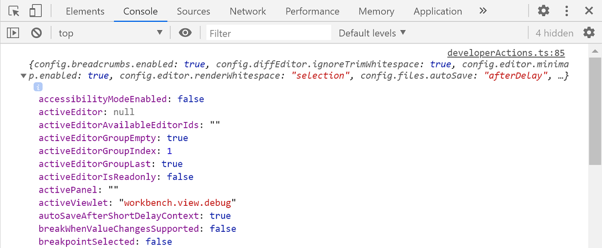

# when 子句上下文

Visual Studio Code 根据 VS Code UI 中可见和活动的元素设置各种上下文键及其特定值。这些上下文可用于选择性地启用或禁用扩展命令和 UI 元素（如菜单和视图）。

例如，VS Code 使用 when 子句来启用或禁用命令按键绑定，你可以在默认按键绑定 JSON 中看到（**首选项：打开默认键盘快捷键 (JSON)**）：

```json
{ "key": "f5",  "command": "workbench.action.debug.start",
                   "when": "debuggersAvailable && !inDebugMode" },
```

上面的内置 **开始调试** 命令绑定了快捷键 `kb(workbench.action.debug.start)`，该快捷键仅在存在可用的调试器（上下文键 `debuggersAvailable` 为 true）且编辑器未处于调试模式（上下文键 `inDebugMode` 为 false）时才启用。

## 条件运算符

when 子句可以由一个上下文键（例如 `inDebugMode`）组成，也可以使用各种运算符来表达更细致的编辑器状态。

### 逻辑运算符

逻辑运算符允许组合简单的上下文键或包含其他逻辑、相等、比较、匹配、`in`/`not in` 运算符或括号表达式的 when 子句表达式。

运算符 | 符号 | 示例
-------- | ------ | -----
非 | `!` | `"!editorReadonly"` 或 <code>"!(editorReadonly \|\| inDebugMode)"</code>
与 | `&&` | `"textInputFocus && !editorReadonly"`
或 | <code>\|\|</code> | `"isLinux`<code> \|\| </code>`isWindows"`

关于逻辑运算符优先级的说明：上表按优先级从高到低排列。示例：

书写形式                             | 解释为
---------------------------------------|-----------------------------------------
`!foo && bar`                          | `(!foo) && bar`
<code>!foo \|\| bar </code>            | `(!foo) \|\| bar`
<code>foo \|\| bar && baz </code>      | <code>foo \|\| (bar && baz)</code>
<code>!foo && bar \|\| baz </code>     | <code>(!foo && bar) \|\| baz</code>
<code>!(foo \|\| bar) && baz </code>   | <code>(保持不变) !(foo \|\| bar) && baz</code>

### 相等运算符

你可以检查上下文键的值是否等于指定值。注意右侧是一个值，不会被解释为上下文键，也就是说不会在上下文中查找。

运算符   | 符号 | 示例
--------   | ------ | -----
等于   | `==`   | `"editorLangId == typescript"` 或 `"editorLangId == 'typescript'"`
不等于 | `!=`   | `"resourceExtname != .js"` 或 `"resourceExtname != '.js'"`

注意：

* 如果右侧值是包含空格的字符串，必须用单引号包裹 - `"resourceFilename == 'My New File.md'"`。
* `===` 与 `==` 行为相同，`!==` 与 `!=` 行为相同

### 比较运算符

你可以将上下文键的值与数字进行比较。注意运算符左右两侧必须用空格分隔 - `foo < 1`，而不是 `foo<1`。

运算符 | 符号 | 示例
-------- | ------ | -----
大于 | `>`, `>=` | `"gitOpenRepositoryCount >= 1"` 但不能是 `"gitOpenRepositoryCount>=1"`
小于 | `<`, `<=` | `"workspaceFolderCount < 2"` 但不能是 `"workspaceFolderCount<2"`

### 匹配运算符

（旧称：键值对匹配运算符）

运算符 | 符号 | 示例
-------- | ------ | -----
匹配 | `=~` | `"resourceScheme =~ /^untitled$\|^file$/"`

when 子句支持匹配运算符（`=~`）。表达式 `key =~ regularExpressionLiteral` 将右侧作为正则表达式字面量与左侧进行匹配。例如，要为所有 Docker 文件添加上下文菜单项，可以使用：

```json
   "when": "resourceFilename =~ /docker/"
```

注意：

* `=~` 运算符右侧遵循 JavaScript 中正则表达式字面量的相同规则（[参考](https://developer.mozilla.org/docs/Web/JavaScript/Guide/Regular_Expressions#creating_a_regular_expression)），但字符需要同时遵循 JSON 字符串和正则表达式的转义规则。例如，匹配子字符串 `file://` 的正则表达式字面量在 JavaScript 中是 `/file:\/\//`，但在 when 子句中需要写成 `/file:\\/\\//`，因为反斜杠在 JSON 字符串中需要转义，而斜杠在正则表达式模式中需要转义。
* 不存在 `!=~` 运算符，但你可以对匹配表达式取反 - `!(foo =~ /baz/)`。

#### 正则表达式标志

可以在正则表达式字面量中使用标志。例如，`resourceFilename =~ /json/i` 或 `myContextKey =~ /baz/si`。

支持的标志：`i`、`s`、`m`、`u`。

被忽略的标志：`g`、`y`。 <!-- let's be more explicit with unsupported flags -->

### 'in' 和 'not in' 条件运算符

when 子句中的 `in` 运算符允许在一个上下文键的值中动态查找另一个上下文键的值。例如，如果你想在包含某种文件类型（或无法静态确定的内容）的文件夹中添加上下文菜单命令，现在可以使用 `in` 运算符来实现。你可以使用 `not in` 运算符来检查相反的条件。

运算符 | 符号 | 示例
-------- | ------ | -----
在...中 | `in` | `"resourceFilename in supportedFolders"`
不在...中 | `not in` | `"resourceFilename not in supportedFolders"`

首先，确定哪些文件夹应支持该命令，并将文件夹名添加到数组中。然后，使用 [`setContext` 命令](#add-a-custom-when-clause-context)将该数组转换为上下文键：

```ts
vscode.commands.executeCommand('setContext', 'ext.supportedFolders', [ 'test', 'foo', 'bar' ]);

// 或者

// 注意在这种情况下（使用对象），值不重要，它基于对象中键的存在性来判断
// 值必须是简单类型
vscode.commands.executeCommand('setContext', 'ext.supportedFolders', { 'test': true, 'foo': 'anything', 'bar': false });
```

然后，在 `package.json` 中可以为 `explorer/context` 菜单添加菜单贡献：

```json
// 注意，这里假设你已经定义了一个名为 ext.doSpecial 的命令
"menus": {
  "explorer/context": [
    {
      "command": "ext.doSpecial",
      "when": "explorerResourceIsFolder && resourceFilename in ext.supportedFolders"
    }
  ]
}
```

在这个示例中，我们获取 `resourceFilename` 的值（在这种情况下是文件夹名），并检查它是否存在于 `ext.supportedFolders` 的值中。如果存在，菜单将被显示。这个强大的运算符应该能支持更丰富的条件和动态贡献，这些贡献支持 `when` 子句，例如菜单、视图等。

<!-- TODO@ulugbekna: it would be good to have a section "Examples of more advanced expressions" that would include some examples using multiple operators -->

## 可用的上下文键

<!-- @ulugbekna: should we just mention this list somewhere at the beginning of the page but move the list itself to the bottom as an appendix ? -->

以下是一些可用的上下文键，它们评估为布尔值 true/false。

此列表并不详尽，你可以通过在键盘快捷键编辑器（**首选项：打开键盘快捷键**）中搜索和筛选，或查看默认按键绑定 JSON 文件（**首选项：打开默认键盘快捷键 (JSON)**）来找到其他 when 子句上下文。你还可以使用[检查上下文键工具](#inspect-context-keys-utility)来识别你感兴趣的上下文键。

上下文名称 | 为 true 的条件
------------ | ------------
**编辑器上下文** |
`editorFocus` | 编辑器获得焦点（文本或小部件）。
`editorTextFocus` | 编辑器中的文本获得焦点（光标正在闪烁）。
`textInputFocus` | 任何编辑器获得焦点（常规编辑器、调试 REPL 等）。
`inputFocus` | 任何文本输入区域获得焦点（编辑器或文本框）。
`editorTabMovesFocus` | `kbstyle(Tab)` 是否会将焦点移出编辑器。
`editorHasSelection` | 编辑器中有选中的文本。
`editorHasMultipleSelections` | 选中了多个文本区域（多个光标）。
`editorReadonly` | 编辑器处于只读模式。
`editorLangId` | 当编辑器关联的[语言 ID](/docs/languages/identifiers) 匹配时为 true。<br>示例：`"editorLangId == typescript"`。
`isInDiffEditor` | 活动编辑器是差异编辑器。
`isInEmbeddedEditor` | 当焦点在嵌入式编辑器内时为 true。
**操作系统上下文** |
`isLinux` | 操作系统为 Linux 时为 true。
`isMac` | 操作系统为 macOS 时为 true。
`isWindows` | 操作系统为 Windows 时为 true。
`isWeb` | 从 Web 访问编辑器时为 true。
**列表上下文** |
`listFocus` | 列表获得焦点。
`listSupportsMultiselect` | 列表支持多选。
`listHasSelectionOrFocus` | 列表有选区或焦点。
`listDoubleSelection` | 列表选中了 2 个元素。
`listMultiSelection` | 列表选中了多个元素。
**模式上下文** |
`inSnippetMode` | 编辑器处于代码片段模式。
`inQuickOpen` | 快速打开下拉框获得焦点。
**资源上下文** |
`resourceScheme` | 当资源 Uri 方案匹配时为 true。<br>示例：`"resourceScheme == file"`
`resourceFilename` | 当资源管理器或编辑器文件名匹配时为 true。<br>示例：`"resourceFilename == gulpfile.js"`
`resourceExtname` | 当资源管理器或编辑器文件扩展名匹配时为 true。<br>示例：`"resourceExtname == .js"`
`resourceDirname` | 当资源管理器或编辑器资源的绝对文件夹路径匹配时为 true。<br>示例：`"resourceDirname == /users/alice/project/src"`
`resourcePath` | 当资源管理器或编辑器资源的绝对路径匹配时为 true。<br>示例：`"resourcePath == /users/alice/project/gulpfile.js"`
`resourceLangId` | 当资源管理器或编辑器标题的[语言 ID](/docs/languages/identifiers) 匹配时为 true。<br>示例：`"resourceLangId == markdown"`
`isFileSystemResource` | 当资源管理器或编辑器文件是可由文件系统提供程序处理的文件系统资源时为 true。
`resourceSet` | 当设置了资源管理器或编辑器文件时为 true。
`resource` | 资源管理器或编辑器文件的完整 Uri。
**资源管理器上下文** |
`explorerViewletVisible` | 资源管理器视图可见时为 true。
`explorerViewletFocus` | 资源管理器视图获得键盘焦点时为 true。
`filesExplorerFocus` | 文件资源管理器部分获得键盘焦点时为 true。
`openEditorsFocus` | 已打开的编辑器部分获得键盘焦点时为 true。
`explorerResourceIsFolder` | 在资源管理器中选中了文件夹时为 true。
**源代码管理上下文** |
`scmProvider` | 当源代码管理提供程序 ID 匹配时为 true。<br>示例：`"scmProvider == git"`。
`scmResourceGroup` | 当源代码管理资源组 ID 匹配时为 true。<br>示例：`"scmResourceGroup == merge"`。
`originalResourceScheme` | 当快速差异编辑器中的原始资源方案匹配时为 true。<br>示例：`"originalResourceScheme == git"`。
**编辑器小部件上下文** |
`findWidgetVisible` | 编辑器查找小部件可见。
`suggestWidgetVisible` | 建议小部件（IntelliSense）可见。
`suggestWidgetMultipleSuggestions` | 显示了多条建议。
`renameInputVisible` | 重命名输入文本框可见。
`referenceSearchVisible` | 速览引用窗口已打开。
`inReferenceSearchEditor` | 速览引用窗口编辑器获得焦点。
`config.editor.stablePeek` | 保持速览编辑器打开（由 `editor.stablePeek` 设置控制）。
`codeActionMenuVisible` | 代码操作菜单可见。
`parameterHintsVisible` | 参数提示可见（由 `editor.parameterHints.enabled` 设置控制）。
`parameterHintsMultipleSignatures` | 显示了多个参数提示。
**调试器上下文** |
`debuggersAvailable` | 有可用的调试器扩展。
`inDebugMode` | 正在运行调试会话。
`debugState` | 活动调试器状态。<br>可能的值为 `inactive`、`initializing`、`stopped`、`running`。
`debugType` | 当调试类型匹配时为 true。<br>示例：`"debugType == 'node'"`。
`inDebugRepl` | 焦点在调试控制台 REPL 中。
**集成终端上下文** |
`terminalFocus` | 集成终端获得焦点。
`terminalIsOpen` | 集成终端已打开。
**任务执行上下文** |
`shellExecutionSupported` | VS Code 可以运行 `ShellExecution` 任务时为 true。
`processExecutionSupported` | VS Code 可以运行 `ProcessExecution` 任务时为 true。
`customExecutionSupported` | VS Code 可以运行 `CustomExecution` 任务时为 true。
**时间线视图上下文** |
`timelineFollowActiveEditor` | 当时间线视图跟随活动编辑器时为 true。
**时间线视图项上下文** |
`timelineItem` | 当时间线项的上下文值匹配时为 true。<br>示例：`"timelineItem =~ /git:file:commit\\b/"`。
**扩展上下文** |
`extension` | 当扩展 ID 匹配时为 true。<br>示例：`"extension == eamodio.gitlens"`。
`extensionStatus` | 当扩展已安装时为 true。<br>示例：`"extensionStatus == installed"`。
`extensionHasConfiguration` | 当扩展有配置时为 true。
**测试上下文** |
`testId` | 当当前测试项 ID 匹配时为 true。
`controllerId` | 当当前测试控制器 ID 匹配时为 true。
`testing.testItemHasUri` | 当当前测试项关联了 URI 时为 true。
**工作区上下文** |
`virtualWorkspace` | 当当前工作区使用虚拟文件系统时为 true。
`isWorkspaceTrusted` | 当当前工作区受信任时为 true。
**全局 UI 上下文** |
`notificationFocus` | 通知获得键盘焦点。
`notificationCenterVisible` | VS Code 右下角的通知中心可见。
`notificationToastsVisible` | VS Code 右下角的通知弹窗可见。
`searchViewletVisible` | 搜索视图已打开。
`sideBarVisible` | 侧边栏已显示。
`sideBarFocus` | 侧边栏获得焦点。
`panelFocus` | 面板获得焦点。
`inZenMode` | 窗口处于禅模式。
`isCenteredLayout` | 编辑器处于居中布局模式。
`workbenchState` | 可以为 `empty`、`folder`（1 个文件夹）或 `workspace`。
`workspaceFolderCount` | 工作区文件夹数量。
`replaceActive` | 搜索视图替换文本框已打开。
`view` | 对于 `view/title` 和 `view/item/context`，显示命令的视图。<br>示例：`"view == myViewsExplorerID"`。
`viewItem` | 对于 `view/item/context`，来自树项的 `contextValue`。<br>示例：`"viewItem == someContextValue"`。
`webviewId` | 对于 `webview/context`，显示命令的 webview ID。<br>示例：`"webviewId == catCoding"`。
`webviewSection` | 对于 `webview/context`，显示命令的 webview 区域。<br>示例：`"webviewSection == 'editor'"`。
`isFullscreen` | 窗口全屏时为 true。
`focusedView` | 当前获得焦点的视图的标识符。
`canNavigateBack` | 可以向后导航时为 true。
`canNavigateForward` | 可以向前导航时为 true。
`canNavigateToLastEditLocation` | 可以导航到上次编辑位置时为 true。
**全局编辑器 UI 上下文** |
`textCompareEditorVisible` | 至少有一个差异（比较）编辑器可见。
`textCompareEditorActive` | 一个差异（比较）编辑器处于活动状态。
`editorIsOpen` | 有一个编辑器打开时为 true。
`groupEditorsCount` | 编辑器组中的编辑器数量。
`activeEditorGroupEmpty` | 活动编辑器组中没有编辑器时为 true。
`activeEditorGroupIndex` | 从 `1` 开始的数字，反映编辑器组在编辑器网格中的位置。<br>索引为 `1` 的组位于左上角。
`activeEditorGroupLast` | 编辑器网格中最后一个编辑器组时为 `true`。
`multipleEditorGroups` | 存在多个编辑器组时为 true。
`activeEditor` | 编辑器组中活动编辑器的标识符。
`activeEditorIsDirty` | 编辑器组中活动编辑器有未保存更改时为 true。
`activeEditorIsNotPreview` | 编辑器组中活动编辑器不在预览模式时为 true。
`activeEditorIsPinned` | 编辑器组中活动编辑器已固定时为 true。
`inSearchEditor` | 焦点在搜索编辑器内时为 true。
`activeWebviewPanelId` | 当前活动的 [webview 面板](/vscode/extension/extension-guides/webview)的 ID。
`activeCustomEditorId` | 当前活动的[自定义编辑器](/vscode/extension/extension-guides/custom-editors)的 ID。
**配置设置上下文** |
`config.editor.minimap.enabled` | 当设置 `editor.minimap.enabled` 为 `true` 时为 true。

>**注意**：你可以在此处使用任何评估为布尔值的用户或工作区设置，只需加上前缀 `"config."`。

## 可见/聚焦视图 when 子句上下文

你可以使用 when 子句来检查特定[视图](/vscode/extension/ux-guidelines/views)是否可见或获得焦点。

上下文名称  | 为 true 的条件
------------- | ----------
`view.${viewId}.visible` | 当特定视图可见时为 true。<br>示例：`"view.workbench.explorer.fileView.visible"`
`focusedView` | 当特定视图获得焦点时为 true。<br>示例：`"focusedView == 'workbench.explorer.fileView'"`

视图标识符：

* `workbench.explorer.fileView` - 文件资源管理器
* `workbench.explorer.openEditorsView` - 已打开的编辑器
* `outline` - 大纲视图
* `timeline` - 时间线视图
* `workbench.scm` - 源代码管理
* `workbench.scm.repositories` - 源代码管理仓库
* `workbench.debug.variablesView` - 变量
* `workbench.debug.watchExpressionsView` - 监视
* `workbench.debug.callStackView` - 调用堆栈
* `workbench.debug.loadedScriptsView` - 已加载的脚本
* `workbench.debug.breakPointsView` - 断点
* `workbench.debug.disassemblyView` - 反汇编
* `workbench.views.extensions.installed` - 已安装的扩展
* `extensions.recommendedList` - 推荐的扩展
* `workbench.panel.markers.view` - 问题
* `workbench.panel.output` - 输出
* `workbench.panel.repl.view` - 调试控制台
* `terminal` - 集成终端
* `workbench.panel.comments` - 注释

## 可见视图容器 when 子句上下文

你可以使用 when 子句来检查特定[视图容器](/vscode/extension/ux-guidelines/views#view-containers)是否可见

上下文名称      | 为 true 的条件
----------------- | ----------
`activeViewlet`   | 当视图容器在侧边栏中可见时为 true。<br>示例：`"activeViewlet == 'workbench.view.explorer'"`
`activePanel`     | 当视图容器在面板中可见时为 true。<br>示例：`"activePanel == 'workbench.panel.output'"`
`activeAuxiliary` | 当视图容器在辅助侧边栏中可见时为 true。<br>示例：`"activeAuxiliary == 'workbench.view.debug'"`

视图容器标识符：

* `workbench.view.explorer` - 文件资源管理器
* `workbench.view.search` - 搜索
* `workbench.view.scm` - 源代码管理
* `workbench.view.debug` - 运行
* `workbench.view.extensions` - 扩展
* `workbench.panel.markers` - 问题
* `workbench.panel.output` - 输出
* `workbench.panel.repl` - 调试控制台
* `terminal` - 集成终端
* `workbench.panel.comments` - 注释

如果你想要一个仅在特定视图容器获得焦点时才启用的 when 子句，可以将 `sideBarFocus` 或 `panelFocus` 或 `auxiliaryBarFocus` 与 `activeViewlet` 或 `activePanel` 或 `activeAuxiliary` 上下文键结合使用。

例如，以下 when 子句仅在文件资源管理器获得焦点时为 true：

```json
"sideBarFocus && activeViewlet == 'workbench.view.explorer'"
```

## 在 when 子句中检查设置

在 when 子句中，你可以通过添加 `config.` 前缀来引用配置（设置）值，例如 `config.editor.tabCompletion` 或 `config.breadcrumbs.enabled`。

## 添加自定义 when 子句上下文

如果你正在开发自己的 VS Code 扩展，需要使用 when 子句上下文来启用/禁用命令、菜单或视图，而现有的上下文键都不满足需求，你可以使用 `setContext` 命令添加自己的上下文键。

下面的第一个示例将 `myExtension.showMyCommand` 键设置为 true，你可以在命令启用或 `when` 属性中使用它。第二个示例存储了一个值，你可以在 when 子句中用来检查酷炫的打开项目数量是否大于 2。

```js
vscode.commands.executeCommand('setContext', 'myExtension.showMyCommand', true);

vscode.commands.executeCommand('setContext', 'myExtension.numberOfCoolOpenThings', 4);
```

## 检查上下文键工具

如果你想查看运行时所有当前活动的上下文键，可以从命令面板（`kb(workbench.action.showCommands)`）运行 **开发者：检查上下文键** 命令。**检查上下文键** 将在 VS Code 开发者工具的 **控制台** 选项卡（**帮助** > **切换开发者工具**）中显示上下文键及其值。

运行 **开发者：检查上下文键** 后，光标会高亮 VS Code UI 中的元素，当你点击某个元素时，当前的上下文键及其状态将作为对象输出到控制台。



活动上下文键列表非常广泛，可能包含你安装的扩展的[自定义上下文键](#add-a-custom-when-clause-context)。

>**注意**：某些上下文键是 VS Code 内部使用的，未来可能会更改。
