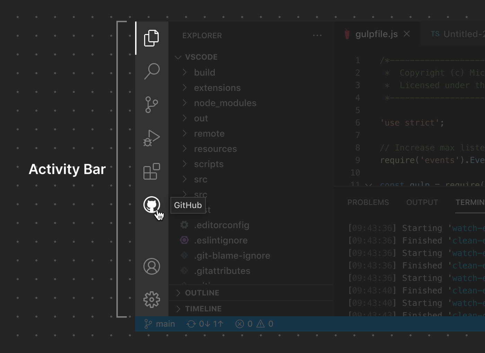

# Activity Bar

Activity Bar 是 VS Code 中的核心导航区域。扩展可以向 Activity Bar 贡献 [View Container](/vscode/extension/ux-guidelines/views#view-containers)，它们以 Activity Bar 项目的形式呈现。用户可以将项目拖动到 Panel 等其他位置来自定义布局。

**✔️ 宜**

- 使用与默认 Activity Bar 项目图标风格匹配的图标
- 为与该项目关联的 [View Container](/vscode/extension/ux-guidelines/views#view-containers) 使用清晰明了的名称

**❌ 忌**

- 复制已有的图标
- 使用 Activity Bar 项目来打开 Webview Panel

## 链接资源

- [View Container 贡献点](/vscode/extension/references/contribution-points#contributes.viewsContainers)
- [View 贡献点](/vscode/extension/references/contribution-points#contributes.views)
