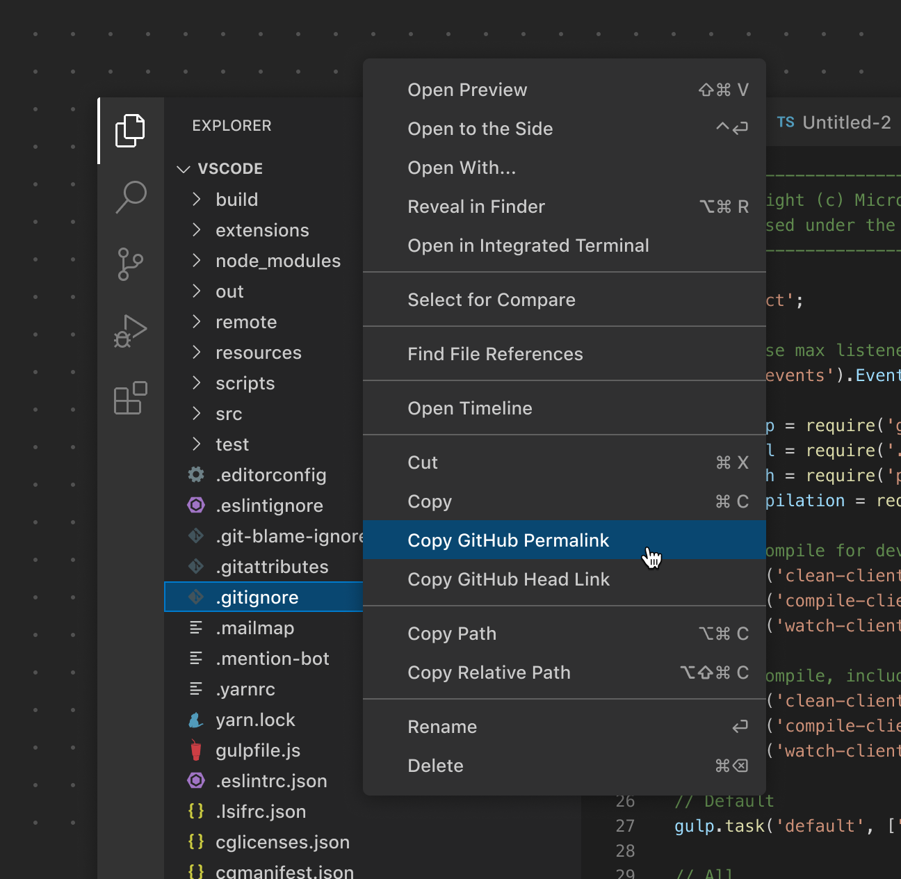

# 上下文菜单

[菜单项](/vscode/extension/references/contribution-points#contributes.menus)出现在视图、操作和右键菜单中。保持菜单分组的一致性非常重要。如果你的扩展有与文件相关的操作，请将它们放在文件资源管理器的上下文菜单中（在合适的情况下）。如果扩展有针对特定文件类型的操作，请仅在这些文件上显示。

**✔️ 建议**

* 在上下文合适时才显示操作
* 将相似的操作归为一组
* 将大量操作放入子菜单中

❌ 不建议

* 对所有文件不加区分地显示操作

*此示例将 **Copy GitHub Permalink** 放置在其他复制命令旁边。此操作仅在来自 GitHub 仓库的文件上显示。*

## 链接

* [上下文菜单 API 参考](/vscode/extension/references/contribution-points#contributes.menus)
