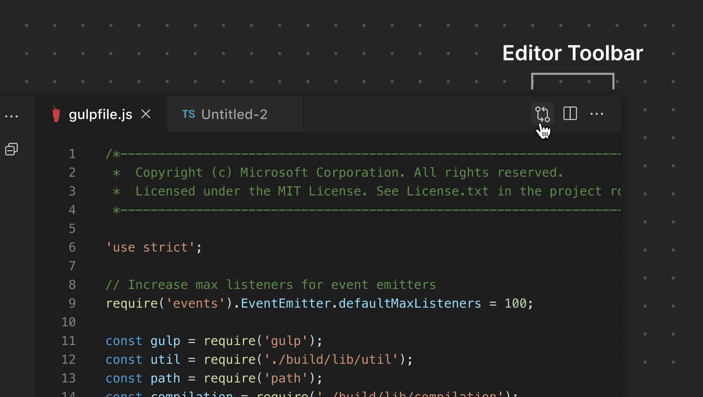

# 编辑器操作

[Editor Action](/vscode/extension/references/contribution-points#contributes.commands) 可以出现在编辑器工具栏中。您可以添加图标作为快捷操作，也可以在溢出菜单（**...**）下添加菜单项。

**✔️ 宜**

* 仅在上下文适当时显示
* 使用图标库中的图标
* 将次要操作放在溢出菜单中

❌ 忌

* 添加多个图标
* 添加自定义颜色
* 使用表情符号

*此示例来自 GitHub Pull Requests and Issues 扩展，打开差异视图，且仅在有文件变更时显示。*

## 链接

* [Custom Editor 扩展指南](/vscode/extension/extension-guides/custom-editors)
* [Custom Editor API 参考](/vscode/extension/references/contribution-points#contributes.customEditors)
* [Custom Editor 扩展示例](https://github.com/microsoft/vscode-extension-samples/tree/main/custom-editor-sample)
* [Webview 扩展指南](/vscode/extension/extension-guides/webview)
* [Webview 扩展示例](https://github.com/microsoft/vscode-extension-samples/blob/main/webview-sample)
