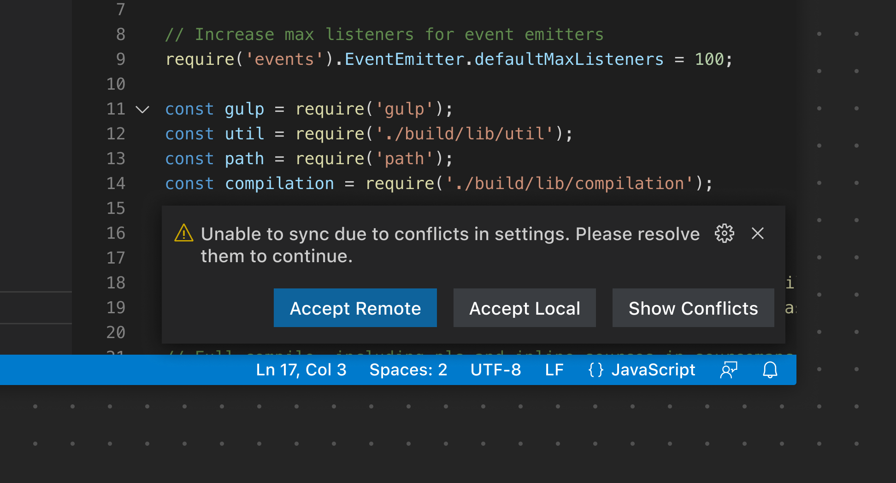
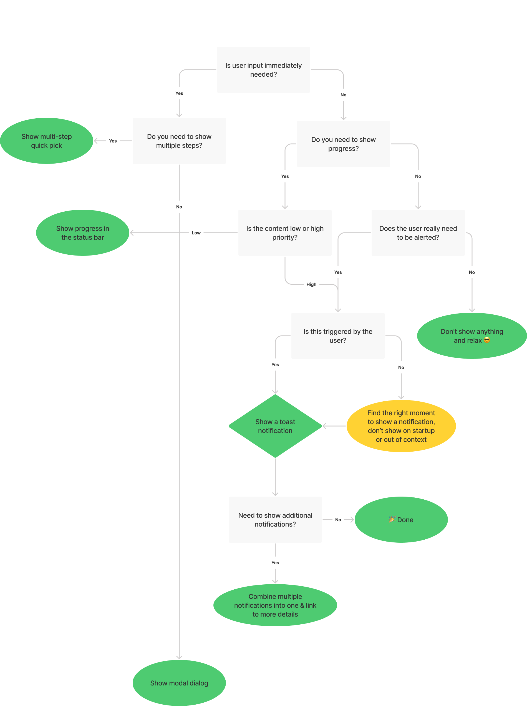
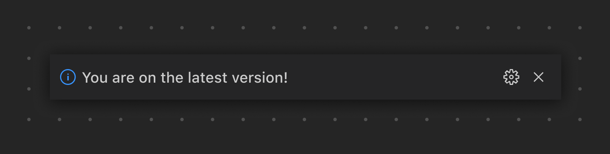
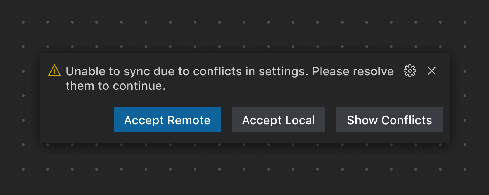
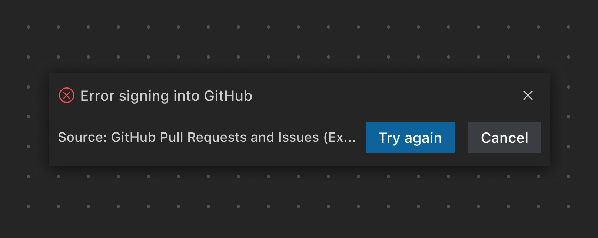
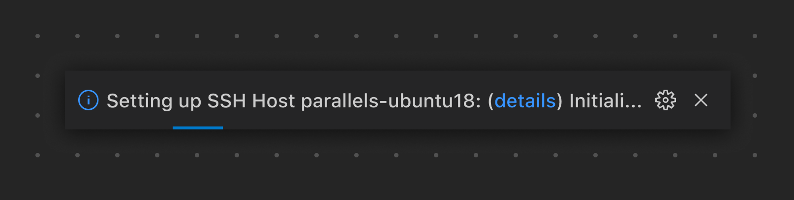
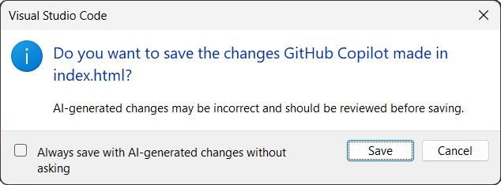

# 通知

[通知](/vscode/extension/extension-capabilities/common-capabilities#display-notifications)会在 VS Code 右下角显示简要信息。

你可以发送三种类型的通知：

* [信息](/vscode/extension/references/vscode-api#window.showInformationMessage)
* [警告](/vscode/extension/references/vscode-api#window.showWarningMessage)
* [错误](/vscode/extension/references/vscode-api#window.showErrorMessage)

请注意控制通知的发送数量，以尊重用户的注意力。为了帮助你判断是否应该显示通知，请参考以下通知决策树：

## 通知示例

*此通知在用户运行 **Update version** 命令后出现。注意，该通知没有任何额外操作，纯粹用于信息提示。*

*此示例突出显示了一个需要用户输入的功能问题，并提供了用于解决问题的操作。*

*此示例显示了一个失败通知，并提供了用于解决问题的操作。*

**✔️ 建议**

* 仅在绝对必要时才发送通知，以尊重用户的注意力
* 为每条通知添加 **不再显示** 选项
* 一次只显示一条通知

**❌ 不建议**

* 发送重复的通知
* 用于推广宣传
* 在首次安装时请求反馈
* 在没有可执行操作时仍显示操作按钮

## 进度通知

当你需要显示一段不确定时长的进度时（例如环境搭建），可以使用进度通知。这种全局进度通知应作为最后的手段，因为进度信息最好在上下文中展示（在视图或编辑器内）。

**✔️ 建议**

* 提供查看更多详情的链接（如日志）
* 随着设置进推进显示当前状态信息（正在初始化、正在构建等）
* 提供取消操作的选项（如适用）
* 为可能超时的场景设置计时器

**❌ 不建议**

* 让通知一直处于进行中状态

*此示例使用进度通知来显示远程连接的设置过程，同时提供了查看输出日志的链接（**details**）。*

## 模态对话框

当你需要对某个操作获取即时的用户输入时，可以选择显示模态对话框。此 UI 元素应谨慎使用，因为模态对话框会阻止用户与对话框之外的界面交互，直到对话框被关闭。

*此对话框在移动 JavaScript/TypeScript 文件后出现，询问是否更新其他文件中的 import 语句。*

**✔️ 建议**

* 仅在需要即时用户交互时才使用模态对话框
* 在适当的情况下，提供避免重复确认的操作（*总是*/*从不* 操作）
* 考虑使用复选框来记住用户的选择

**❌ 不建议**

* 使用模态对话框来确认多个步骤
* 使用模态对话框显示不需要用户操作的消息
* 对于用户未明确发起的操作显示模态对话框

## 链接

* [Hello World 扩展示例](https://github.com/microsoft/vscode-extension-samples/tree/main/helloworld-sample)
* [通知扩展示例](https://github.com/microsoft/vscode-extension-samples/tree/main/notifications-sample)
