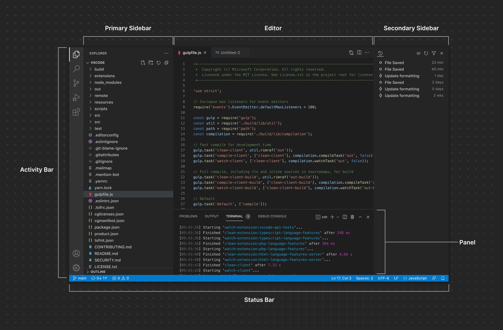
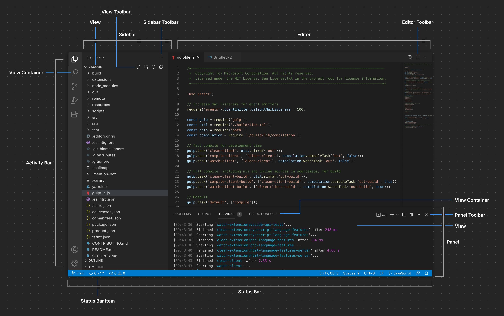
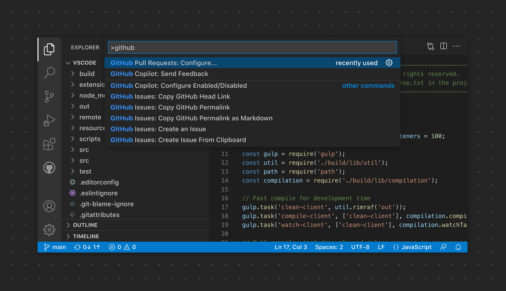
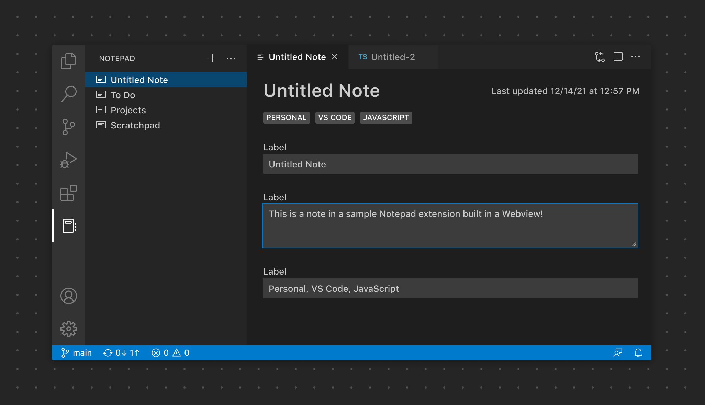

# UX 指南

本指南涵盖了创建与 VS Code 原生界面和模式无缝集成的扩展的最佳实践。在本指南中，您将了解以下内容：

- VS Code 整体 UI 架构和元素概述
- 扩展贡献 UI 的建议和示例
- 相关指南和示例的链接

在深入了解细节之前，先了解 VS Code 各个 UI 架构部分是如何组合在一起的，以及您的扩展可以在何处、以何种方式做出贡献，这一点很重要。

## 容器

VS Code 界面大致可以分为两个主要概念：**容器**和**项目**。一般来说，容器可以被视为 VS Code 界面中渲染一个或多个项目的较大区域：

### Activity Bar

[Activity Bar](/vscode/extension/ux-guidelines/activity-bar) 是 VS Code 中的核心导航区域。扩展可以向 Activity Bar 贡献项目，这些项目作为 [View Container](/vscode/extension/references/contribution-points#contributes.viewsContainers)，在主侧边栏中渲染 [View](/vscode/extension/ux-guidelines/views)。

### 主侧边栏

[主侧边栏](/vscode/extension/ux-guidelines/sidebars#primary-sidebar) 渲染一个或多个 [View](/vscode/extension/ux-guidelines/views)。Activity Bar 和主侧边栏紧密关联。点击一个已贡献的 Activity Bar 项目（即 View Container）会打开主侧边栏，其中会渲染与该 View Container 相关联的一个或多个 View。一个具体的例子是资源管理器。点击资源管理器项目会打开主侧边栏，其中显示文件夹、时间线和大纲 View。

### 次侧边栏

[次侧边栏](/vscode/extension/ux-guidelines/sidebars#secondary-sidebar) 同样可以作为渲染 View Container 和 View 的区域。用户可以将终端或问题等 View 拖动到次侧边栏来自定义布局。

### 编辑器

编辑器区域包含一个或多个编辑器组。扩展可以贡献 [Custom Editor](/vscode/extension/references/contribution-points#contributes.customEditors) 或 [Webview](/vscode/extension/extension-guides/webview) 在编辑器区域中打开。扩展还可以贡献 [Editor Action](/vscode/extension/ux-guidelines/editor-actions)，在编辑器工具栏中暴露额外的图标按钮。

### Panel

[Panel](/vscode/extension/ux-guidelines/panel) 是另一个可以暴露 View Container 的区域。默认情况下，终端、问题和输出等 View 可以在 Panel 中以单标签页的形式查看。用户还可以将 View 拖入分栏布局，就像在编辑器中一样。此外，扩展可以选择将 View Container 专门添加到 Panel，而不是 Activity Bar/主侧边栏。

### Status Bar

[Status Bar](/vscode/extension/ux-guidelines/status-bar) 提供关于工作区和当前活动文件的上下文信息。它渲染两组 [Status Bar Item](/vscode/extension/ux-guidelines/status-bar#status-bar-items)。

## 项目

扩展可以向上述各个容器添加项目。

### View

[View](/vscode/extension/ux-guidelines/views) 可以以 [Tree View](/vscode/extension/ux-guidelines/views#tree-views)、[Welcome View](/vscode/extension/ux-guidelines/views#welcome-views) 或 [Webview View](/vscode/extension/ux-guidelines/webviews#webview-views) 的形式贡献，并且可以拖动到界面的其他区域。

### View 工具栏

扩展可以暴露特定于 View 的[操作](/vscode/extension/ux-guidelines/views#view-actions)，这些操作以按钮形式显示在 View 工具栏上。

### 侧边栏工具栏

作用于整个 View Container 的操作也可以在[侧边栏工具栏](/vscode/extension/ux-guidelines/sidebars#sidebar-toolbars)中暴露。

### 编辑器工具栏

扩展可以直接在编辑器工具栏中贡献限定于编辑器范围的 [Editor Action](/vscode/extension/ux-guidelines/editor-actions)。

### Panel 工具栏

[Panel 工具栏](/vscode/extension/ux-guidelines/panel#panel-toolbar) 可以暴露限定于当前选中 View 的选项。例如，终端 View 暴露了添加新终端、拆分视图布局等操作。切换到问题 View 则会暴露一组不同的操作。

### Status Bar Item

在左侧，[Status Bar Item](/vscode/extension/ux-guidelines/status-bar#status-bar-items) 作用于整个工作区。在右侧，项目作用于当前活动文件。

## 常用 UI 元素

### 命令面板

扩展可以贡献在[命令面板](/vscode/extension/ux-guidelines/command-palette)中出现的命令，以快速执行某项功能。

### Quick Pick

[Quick Pick](/vscode/extension/ux-guidelines/quick-picks) 通过多种不同方式捕获用户输入。它们可以请求单选、多选，甚至自由文本输入。

### 通知

[通知](/vscode/extension/ux-guidelines/notifications) 用于向用户传达信息、警告和错误消息，也可用于指示进度。

### Webview

当使用场景超出 VS Code "原生" API 的能力时，可以使用 [Webview](/vscode/extension/ux-guidelines/webviews) 来显示自定义内容和功能。

### 上下文菜单

与命令面板固定位置不同，[上下文菜单](/vscode/extension/ux-guidelines/context-menus) 让用户能够从特定位置执行操作或进行配置。

### 演练

[演练](/vscode/extension/ux-guidelines/walkthroughs) 提供了一种一致的体验，通过包含丰富内容的多步骤清单引导用户上手扩展。

### 设置

[设置](/vscode/extension/ux-guidelines/settings) 让用户能够配置与扩展相关的选项。

