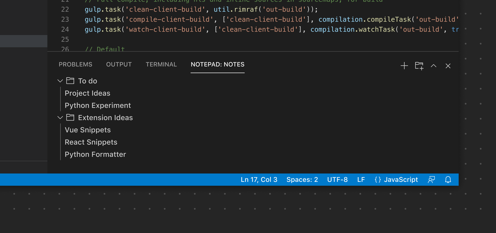
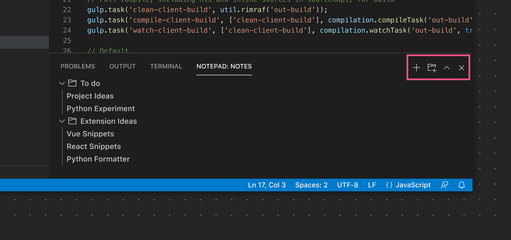
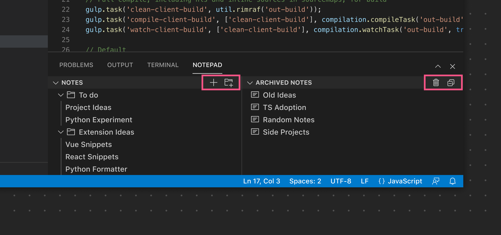

# Panel

Panel 作为另一个主要区域，用于显示 [View Container](/vscode/extension/references/contribution-points#contributes.viewsContainers)。

**✔️ 宜**

- 将受益于更多水平空间的 View 渲染在 Panel 中
- 用于提供辅助功能的 View

**❌ 忌**

- 用于需要始终可见的 View，因为用户经常最小化 Panel
- 渲染在拖动到其他 View Container（如主侧边栏或次侧边栏）时无法正确调整大小/重排的自定义 Webview 内容

## Panel 工具栏

Panel 工具栏可以暴露限定于当前选中 View 范围的选项。例如，终端 View 暴露了 [View Action](/vscode/extension/extension-guides/tree-view#view-actions)，用于添加新终端、拆分视图布局等。切换到问题 View 则会暴露一组不同的操作。与[侧边栏工具栏](/vscode/extension/ux-guidelines/sidebars#sidebar-toolbar)类似，该工具栏仅在只有一个 View 时才会渲染。如果使用了多个 View，每个 View 会渲染各自的工具栏。

**✔️ 宜**

- 如果可用，使用已有的[产品图标](/vscode/extension/references/icons-in-labels#icon-listing)
- 提供清晰、有用的工具提示

**❌ 忌**

- 不要添加过多的图标按钮。如果某个按钮需要更多选项，请考虑使用[上下文菜单](/vscode/extension/references/contribution-points#contributes.menus)。
- 不要复制 Panel 的默认图标（折叠/展开、关闭等）

*在此示例中，Panel 中渲染的单个 View 将其 View Action 渲染在主 Panel 工具栏中。*

*在此示例中，使用了多个 View，因此每个 View 暴露各自特定的 View Action。*

## 链接

- [View Container 贡献点](/vscode/extension/references/contribution-points#contributes.viewsContainers)
- [View 贡献点](/vscode/extension/references/contribution-points#contributes.views)
- [View Action 扩展指南](/vscode/extension/extension-guides/tree-view#view-actions)
