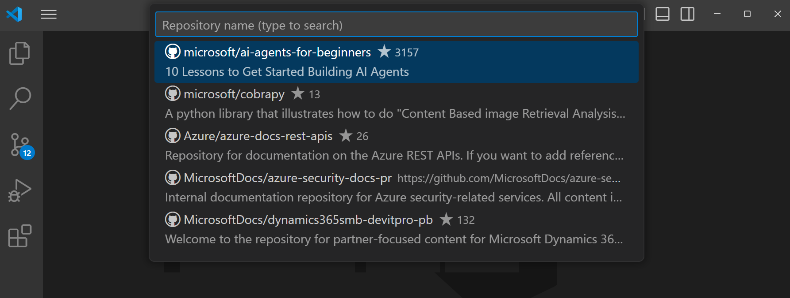
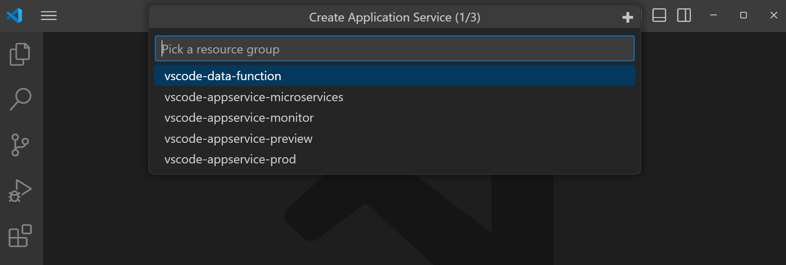
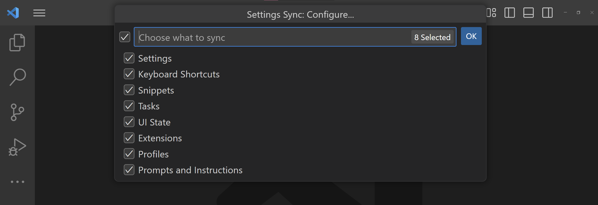
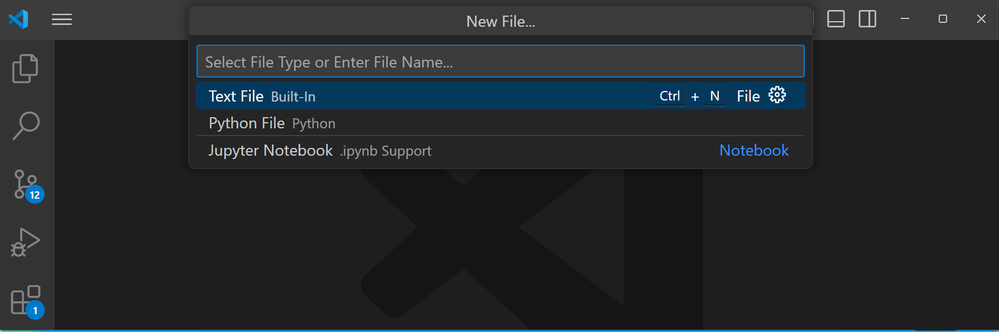
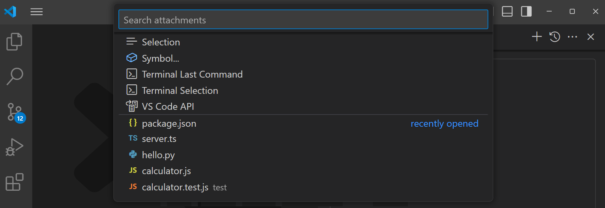

# Quick Pick

[Quick Pick](/vscode/extension/extension-capabilities/common-capabilities#quick-pick) 是一种便捷的方式，用于执行操作并获取用户输入。这在选择配置选项、筛选内容或从列表中选取项目时非常有用。

**✔️ 建议**

* 使用图标来传达清晰的语义
* 使用精心挑选的图标，增强清晰度并帮助区分条目
* 使用描述字段显示当前条目（如适用）
* 使用详情字段提供（简短的）额外上下文信息
* 对一系列基本输入使用多步骤模式
* 从列表中选取时，提供创建新条目的选项（如适用）
* 多步骤 Quick Pick 使用标题
* 无文本输入的 Quick Pick 使用标题
* 需要文本输入的 Quick Pick 使用标题（用占位符显示提示或示例）
* 包含全局按钮（例如刷新图标）的 Quick Pick 使用标题

❌ 不建议

* 重复已有功能
* 当占位符本身已能说明用途时再使用标题
* 使用没有占位符的输入框

## 多步骤

Quick Pick 可以配置为多步骤模式。当你需要在单一流程中捕获相关但又相互独立的多个选择时，可以使用此模式。避免在步骤较多的长流程中使用 Quick Pick——它并不适合充当向导或类似的复杂交互体验。

*注意 Quick Pick 标题中的"1/3"文本，表示当前步骤和流程的总步骤数。*

## 多选

当需要一次性完成多个密切相关的选择时，请使用多选 Quick Pick。

## 标题

Quick Pick 还可以配置为在主输入和选择区域上方显示标题栏。当用户需要更多上下文信息来辅助选择时，请使用标题。避免使用与 Quick Pick 输入占位符中已有标签重复的标题。

## 使用分隔符

Quick Pick 条目可以使用分隔符划分为清晰的分组。分隔符包含分隔线和标签，用于明确标识各分组。当扩展的 Quick Pick 包含多个明显分组的选项时，请使用分隔符。

## 链接

* [Quick Pick API 参考](/vscode/extension/references/vscode-api#QuickPick)
* [Quick Pick Item API 参考](/vscode/extension/references/vscode-api#QuickPickItem)
* [Quick Pick 扩展示例](https://github.com/microsoft/vscode-extension-samples/tree/main/quickinput-sample)
