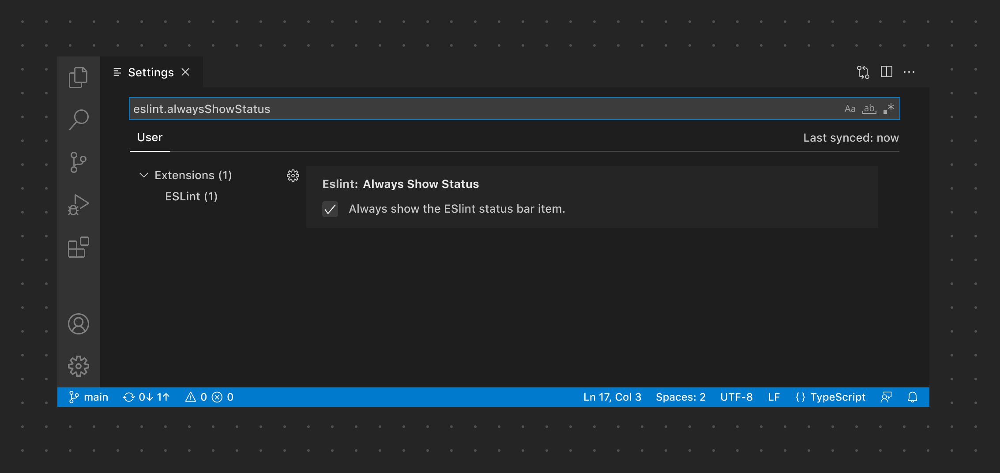

# 设置

[设置](/vscode/extension/references/contribution-points#contributes.configuration)是用户配置扩展的方式。设置可以是输入框、布尔值、下拉框、列表、键值对等。如果你的扩展需要用户配置特定设置，可以通过设置 ID 打开设置界面并定位到你的扩展设置。

**✔️ 建议**

* 为每个设置添加默认值
* 为每个设置添加清晰的描述
* 为复杂的设置链接到相关文档
* 链接到其他相关的设置
* 当需要用户配置特定设置时，链接到设置 ID

❌ 不建议

* 创建自己的设置页面/Webview
* 编写过长的描述

*此示例通过设置 ID 链接到一个特定的设置。*

## 链接

* [Configuration 贡献点](/vscode/extension/references/contribution-points#contributes.configuration)
