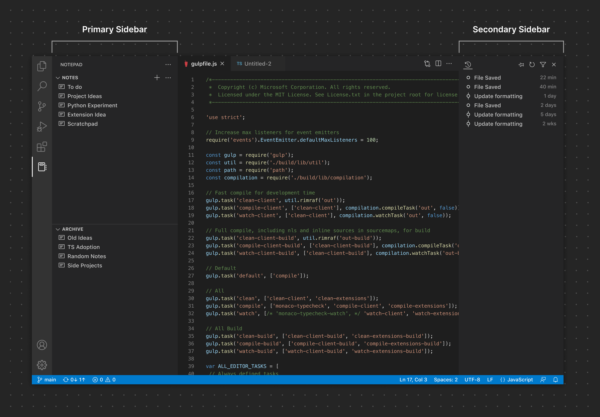
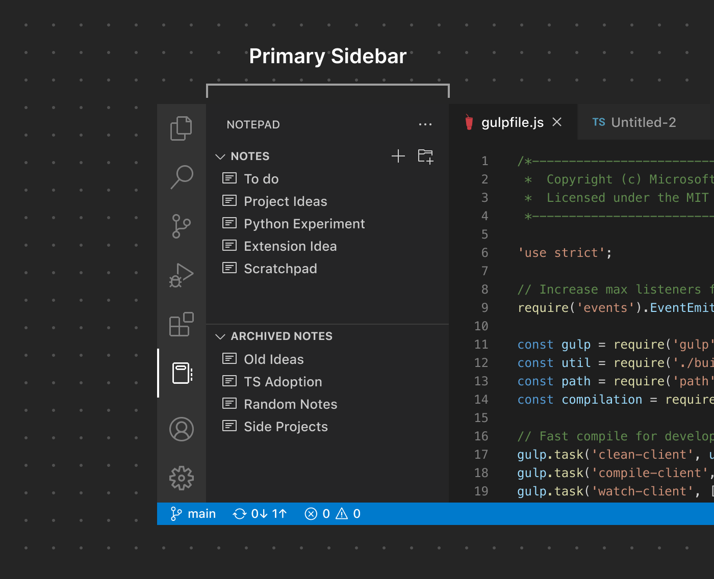
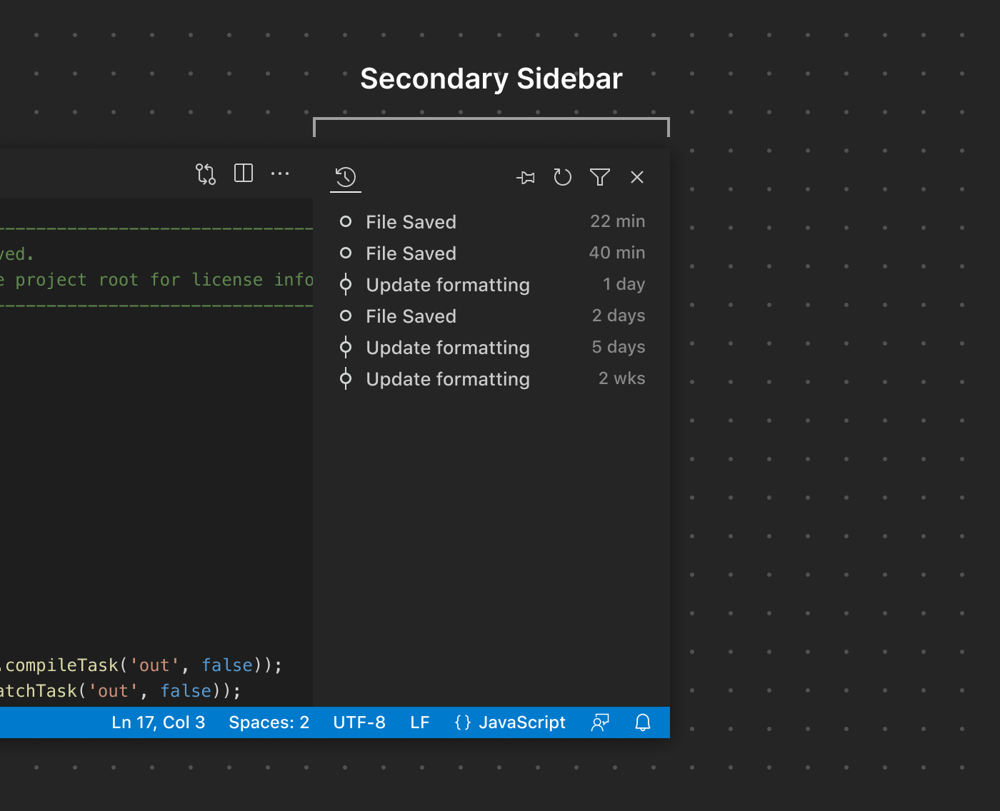
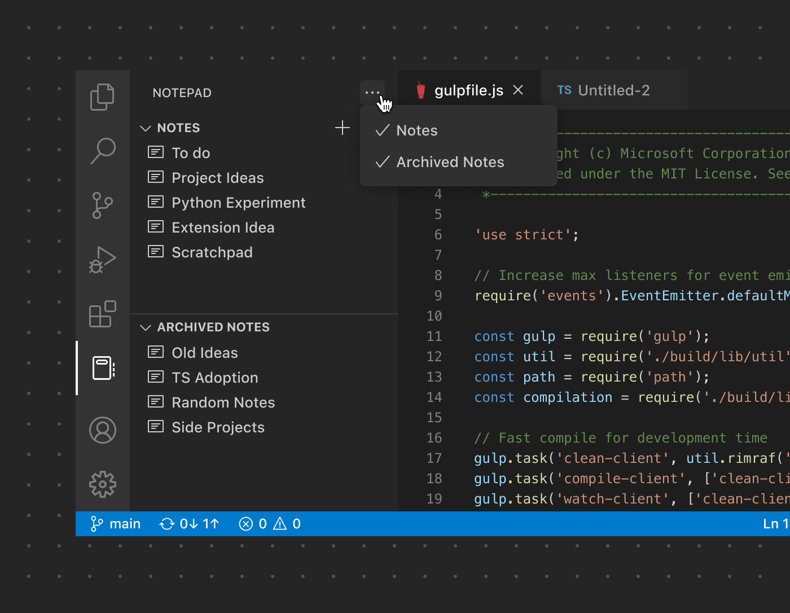
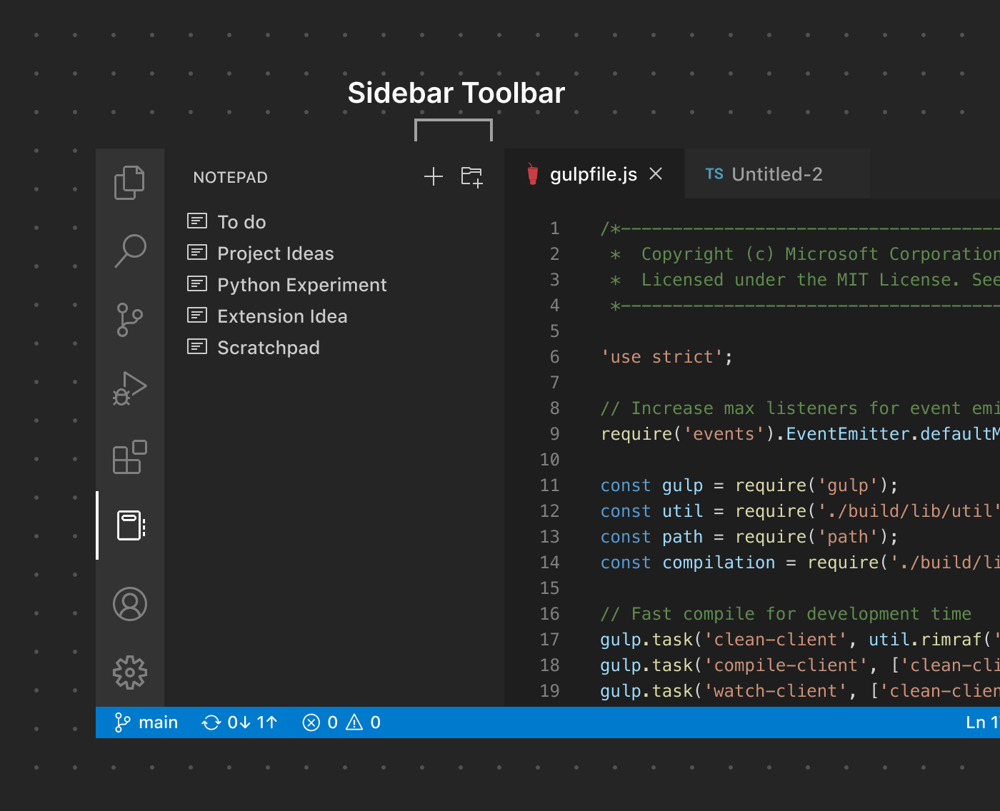

# 侧边栏

主侧边栏和次侧边栏由一个或多个 [View Container](/vscode/extension/ux-guidelines/views#view-containers) 贡献的 [View](/vscode/extension/ux-guidelines/views) 组成。扩展可以向已有的 View Container（例如资源管理器）贡献 View，也可以贡献一个全新的 View Container。

**✔️ 宜**

- 将相关的 View 和内容分组在一起
- 为 View Container 及其 View 使用清晰、描述性的名称

**❌ 忌**

- 使用过多的 View Container。对于大多数扩展来说，一个 View Container（即一个包含该扩展独有 View 的侧边栏）通常就够了。
- 使用过多的 View（3-5 个是大多数屏幕尺寸下合理的上限）
- 将本可以简单用命令实现的内容添加到侧边栏
- 重复已有的功能

## 主侧边栏

许多扩展选择向主侧边栏贡献 View 和/或 View Container，因为主侧边栏能给予内容很高的可见性。在向此处添加内容时需要审慎判断——过多的 UI 贡献会导致界面杂乱，让用户感到困惑。

## 次侧边栏

顾名思义，次侧边栏通常被视为 View 的辅助位置。虽然扩展默认无法直接向其贡献 View，但用户可以从主侧边栏或 Panel 拖动 View 来自定义布局。

## 侧边栏工具栏

默认情况下，侧边栏中包含多个 View 的 View Container 会在侧边栏工具栏中显示一个 `...` 图标按钮，用于显示和隐藏各个 View。它看起来是这样的：

然而，如果只使用一个 View，侧边栏会自动整合 UI，使用侧边栏工具栏来渲染该 View 的所有专属操作。此时 `...` 按钮被替换为与"笔记"View 相关联的两个操作：

与其他工具栏一样，请注意不要添加过多操作，以减少杂乱和混淆。如果可能，请使用已有的产品图标，并搭配描述性的命令名称。

## 链接

- [View Container 贡献点](/vscode/extension/references/contribution-points#contributes.viewsContainers)
- [View 贡献点](/vscode/extension/references/contribution-points#contributes.views)
- [View Action 扩展指南](/vscode/extension/extension-guides/tree-view#view-actions)
- [Welcome View 贡献点](/vscode/extension/references/contribution-points#contributes.viewsWelcome)
- [Tree View 扩展示例](https://github.com/microsoft/vscode-extension-samples/tree/main/tree-view-sample)
- [Webview View 扩展示例](https://github.com/microsoft/vscode-extension-samples/tree/main/webview-view-sample)
- [Welcome View 扩展示例](https://github.com/microsoft/vscode-extension-samples/tree/main/welcome-view-content-sample)
