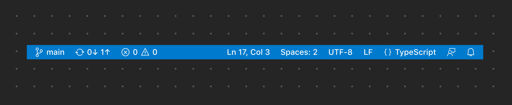
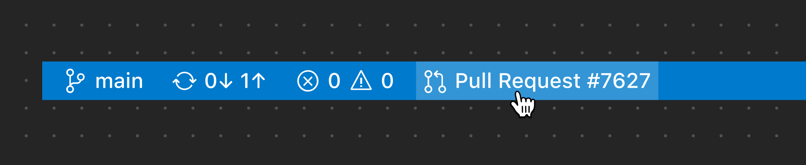
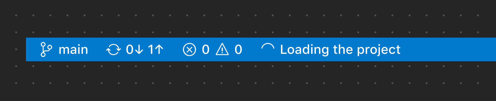
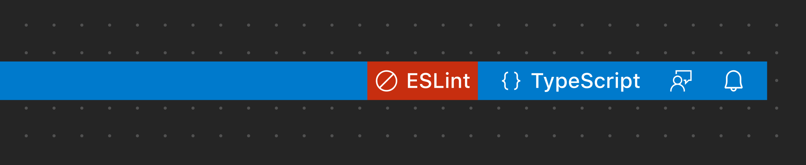
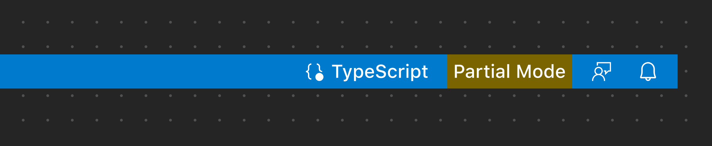

# Status Bar

[Status Bar](/vscode/extension/extension-capabilities/extending-workbench#status-bar-item) 位于 VS Code 工作台底部，显示与工作区相关的信息和操作。项目分为两组：主要组（左侧）和次要组（右侧）。与整个工作区相关的项目（状态、问题/警告、同步）放在左侧，次要或上下文相关的项目（语言、空格设置、反馈）放在右侧。请限制添加的项目数量，因为其他扩展也会在同一区域贡献内容。

**✔️ 宜**

* 使用简短的文本标签
* 仅在必要时使用图标
* 图标仅用于清晰的隐喻
* 将主要（全局）项目放在左侧
* 将次要（上下文相关）项目放在右侧

**❌ 忌**

* 添加自定义颜色
* 添加多个图标（除非必要）
* 添加多个项目（除非必要）

## Status Bar Item

*此示例展示了由 GitHub Pull Requests and Issues 扩展贡献的项目。它与整个工作区相关，因此放置在左侧。*

### 进度 Status Bar Item

当需要显示静默进度（后台正在进行的进度）时，建议显示一个带有加载图标的 Status Bar Item（也可以添加旋转动画）。如果需要提升进度以引起用户注意，建议改用进度通知。

*此示例展示了一个静默的进度 Status Bar Item。*

### 错误和警告 Status Bar Item

如果需要显示一个高度可见的警告或错误项目，可以将 Status Bar Item 配置为使用警告或错误背景色。仅在万不得已且特殊情况下才使用此模式，因为它们在 Status Bar 中非常醒目。

*此示例使用错误 Status Bar Item 来显示文件中的阻断性错误。*

*此示例使用警告 Status Bar Item 来显示文件中的警告。*

## 链接

* [Status Bar Item API 参考](/vscode/extension/references/vscode-api#StatusBarItem)
* [Status Bar 扩展示例](https://github.com/microsoft/vscode-extension-samples/tree/main/statusbar-sample)
