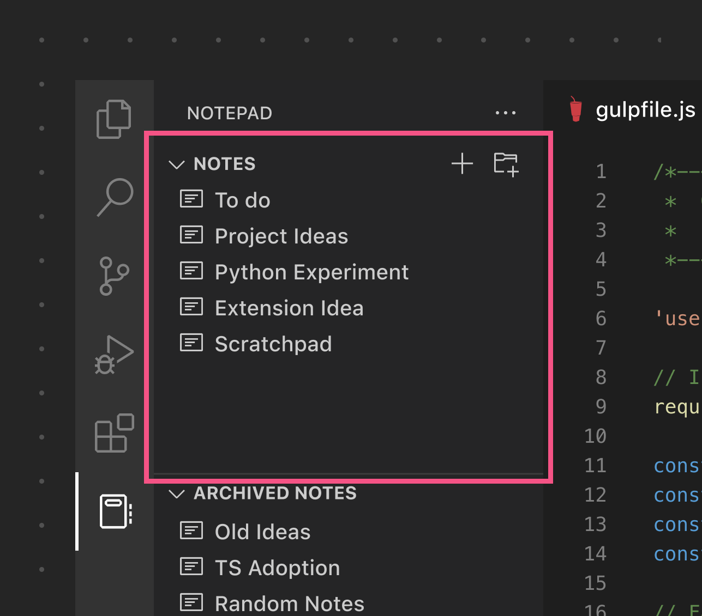
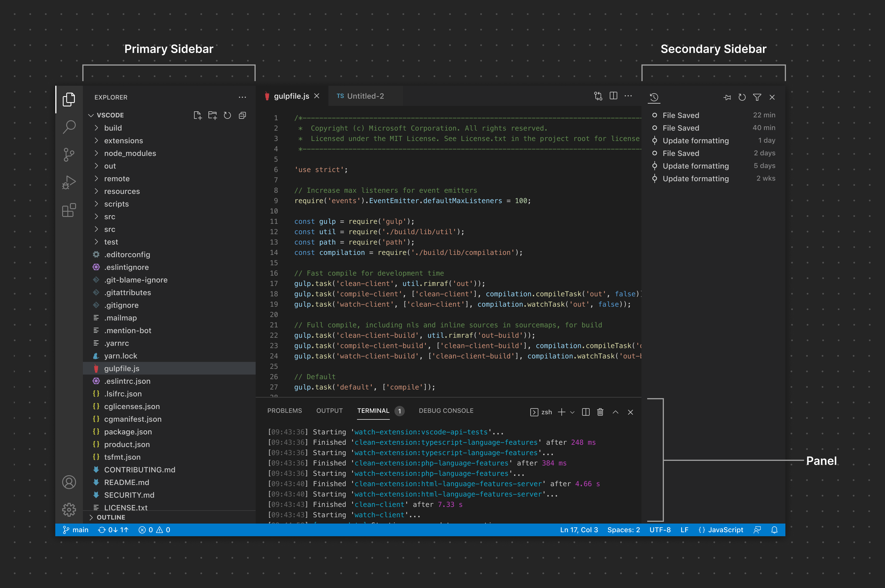
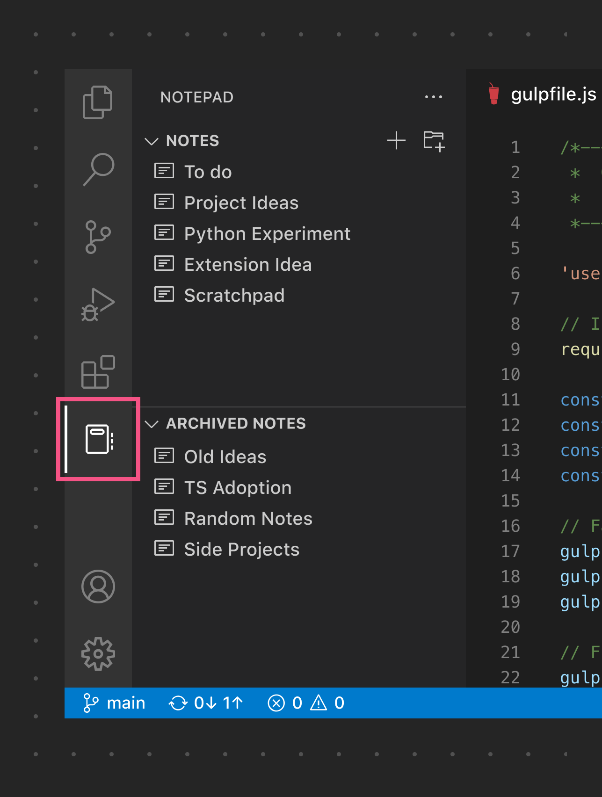
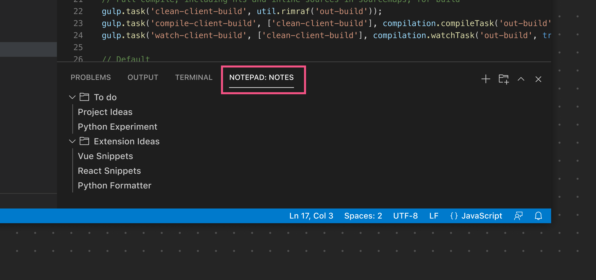
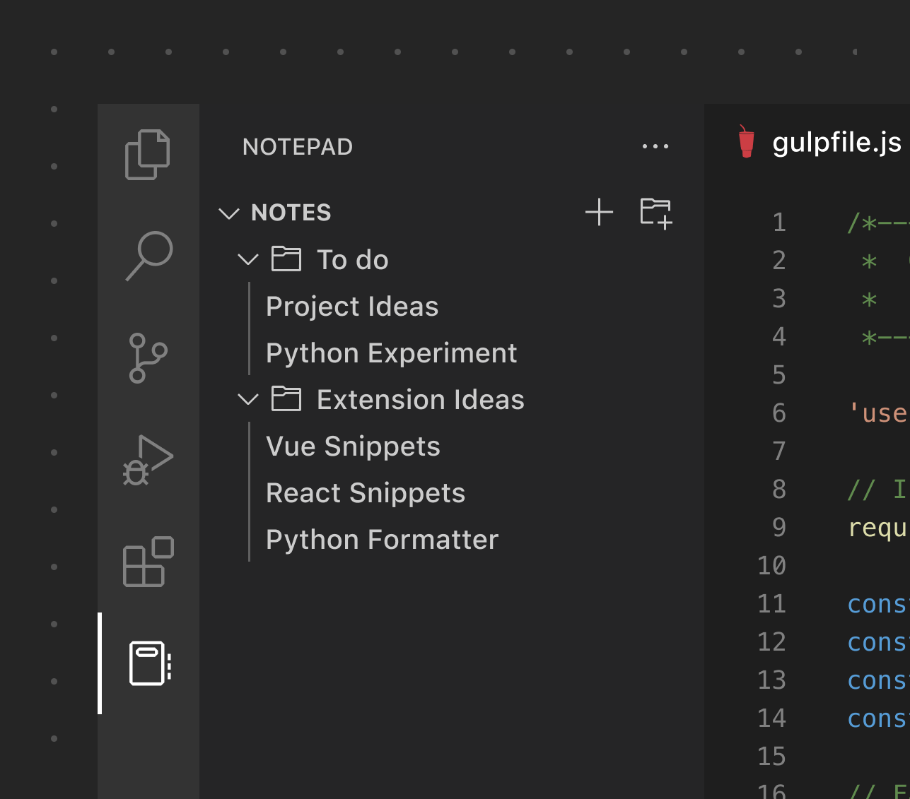
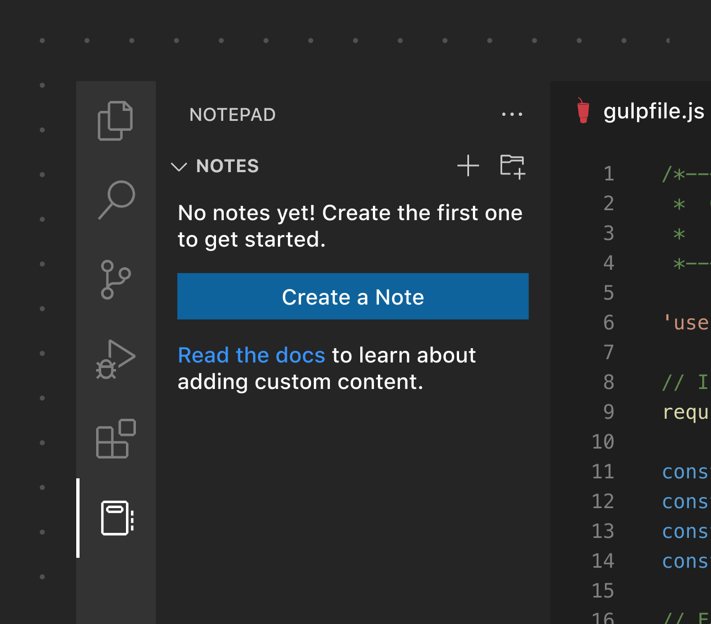
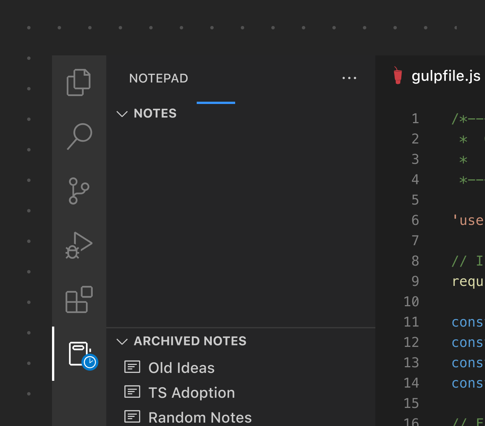
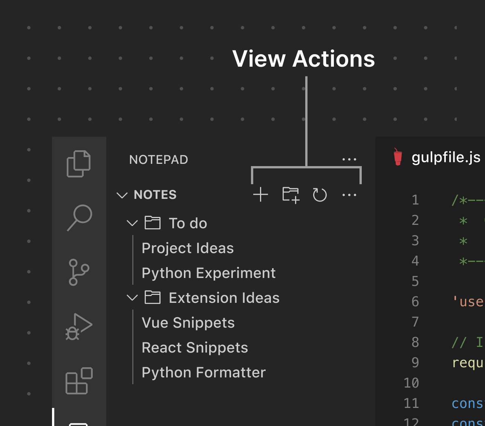

# View

[View](/vscode/extension/references/contribution-points#contributes.views) 是可以出现在侧边栏或 Panel 中的内容容器。View 可以包含 Tree View、Welcome View 或 Webview View，还可以显示 View Action。用户还可以重新排列 View 或将其移动到其他 View Container（例如，从主侧边栏移动到次侧边栏）。请限制创建的 View 数量，因为其他扩展也可能在同一 View Container 中贡献内容。

**✔️ 宜**

* 尽可能使用已有的图标
* 为语言文件使用文件图标
* 使用 Tree View 来展示数据
* 为每个 View 添加图标（以防它被移动到 Activity Bar 或次侧边栏——这两者都使用图标来表示 View）
* 将 View 数量保持在最低限度
- 将名称长度保持在最低限度
- 限制自定义 Webview View 的使用

**❌ 忌**

* 重复已有的功能
* 将树项目用作单一操作项目（例如，点击时触发命令）
* 非必要时不使用自定义 Webview View
* 使用 Activity Bar 项目（View Container）来在编辑器中打开 Webview

*此示例使用 Tree View 来展示一个扁平的 Tree View Item 列表。*

## View 位置

View 可以放置在[已有的 View Container](/vscode/extension/references/contribution-points#contributes.views) 中，例如文件资源管理器、源代码管理（SCM）和调试 View Container。也可以通过 Activity Bar 将 View 添加到自定义的 [View Container](/vscode/extension/ux-guidelines/views#view-containers) 中。此外，View 可以添加到 Panel 中的任何 View Container，也可以拖动到次侧边栏。

## View Container

View Container 顾名思义，就是渲染 View 的"父"容器。扩展可以向 [Activity Bar](/vscode/extension/ux-guidelines/activity-bar)/[主侧边栏](/vscode/extension/ux-guidelines/sidebars) 或 Panel 贡献自定义 View Container。用户可以将整个 View Container 从 Activity Bar 拖动到 Panel（或反向拖动），也可以移动单个 View。

*这是放置在 Activity Bar/主侧边栏中的 View Container 示例*

*这是放置在 Panel 中的 View Container 示例*

## Tree View

Tree View 是一种强大而灵活的内容展示格式。扩展可以添加从简单的扁平列表到深度嵌套树的各种内容。

* 使用描述性标签为项目提供上下文（如适用）
* 使用产品图标来区分不同项目类型（如适用）

**❌ 忌**

* 将 Tree View Item 用作按钮来触发命令
* 除非必要，避免深层嵌套。几个层级的文件夹/项目对于大多数场景是一个好的平衡。
* 为单个项目添加超过三个操作

## Welcome View

当 View 为空时，您可以[添加内容来引导用户](/vscode/extension/references/contribution-points#contributes.viewsWelcome) 了解如何使用您的扩展或快速入门。Welcome View 支持链接和图标。

**✔️ 宜**

* 仅在必要时使用 Welcome View
* 尽可能使用链接而非按钮
* 仅将按钮用于主要操作
* 使用清晰的链接文本来指示链接目标
- 限制内容长度
- 限制 Welcome View 数量
- 限制 View 中按钮数量

**❌ 忌**

* 非必要时使用按钮
* 将 Welcome View 用于推广宣传
* 使用通用的"了解更多"作为链接文本

*此示例展示了扩展的一个主要操作，以及一个指向文档的附加链接。*

## 带进度的 View

您还可以通过引用 View 的 ID 来[在 View 中显示进度](/vscode/extension/references/vscode-api#ProgressLocation)。

## View Action

View 可以在 View 工具栏上暴露 [View Action](/vscode/extension/extension-guides/tree-view#view-actions)。请注意不要添加过多操作，以免造成干扰和混淆。使用内置的产品图标有助于扩展与原生 UI 保持一致。不过，如果需要自定义图标，也可以提供 SVG 图标。

## 链接

* [View Container API 参考](/vscode/extension/references/contribution-points#contributes.viewsContainers)
* [View API 参考](/vscode/extension/references/contribution-points#contributes.views)
* [View Action 扩展指南](/vscode/extension/extension-guides/tree-view#view-actions)
* [Tree View 扩展示例](https://github.com/microsoft/vscode-extension-samples/tree/main/tree-view-sample)
* [Welcome View 扩展示例](https://github.com/microsoft/vscode-extension-samples/tree/main/welcome-view-content-sample)
* [Webview View 扩展示例](https://github.com/microsoft/vscode-extension-samples/tree/main/webview-view-sample)
