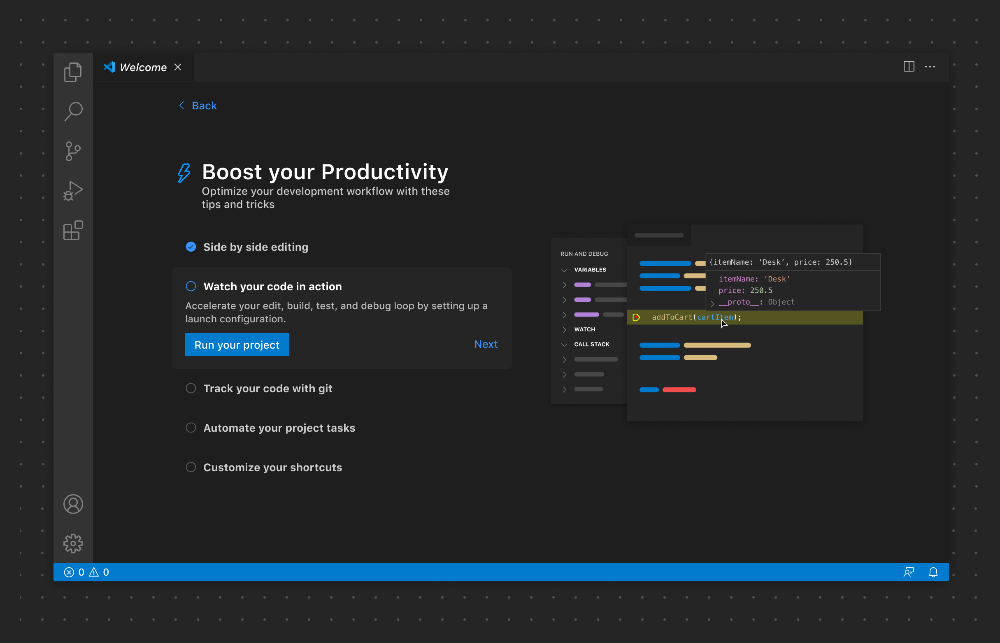

# Walkthrough

Walkthrough 通过包含富内容的多步骤清单，为用户引导扩展上手提供了一致的体验。

**✔️ 建议**

- 使用有帮助的图片为当前 Walkthrough 步骤添加上下文说明。
- 确保图片在不同颜色主题下都能正常显示。尽可能使用带 VS Code [主题颜色](/vscode/extension/references/theme-color)的 SVG。 [Visual Studio Code Color Mapper](https://www.figma.com/community/plugin/1218260433851630449) Figma 插件可以轻松实现 SVG 的主题化。
- 为每个步骤提供操作（例如查看所有命令）。尽可能使用动词。

❌ 不建议

- 在单个 Walkthrough 中添加过多的步骤
- 添加多个 Walkthrough，除非绝对必要

## 链接

- [Walkthrough 贡献点](/vscode/extension/references/contribution-points#contributes.walkthroughs)
- [使用主题颜色 CSS 变量的 SVG 示例](https://github.com/microsoft/vscode/blob/a28eab68734e629c61590fae8c4b231c91f0eaaa/src/vs/workbench/contrib/welcomeGettingStarted/common/media/commandPalette.svg?short_path=52f2d6f#L11)
- [Visual Studio Code Color Mapper](https://www.figma.com/community/plugin/1218260433851630449)
