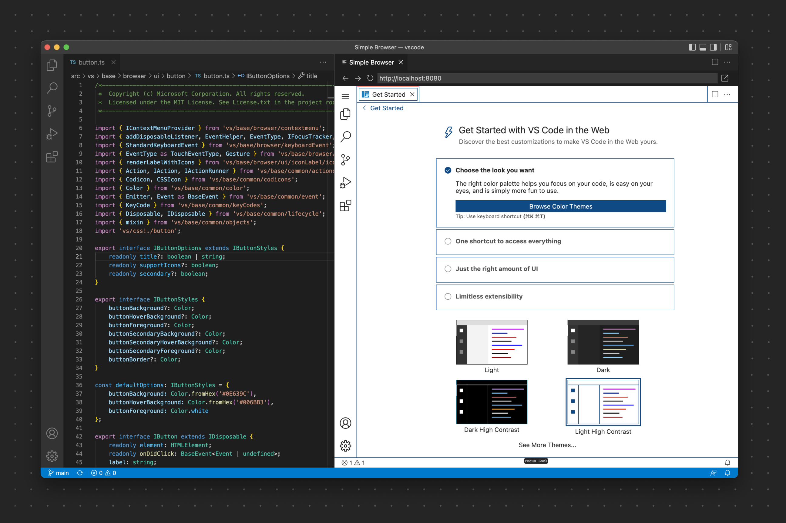
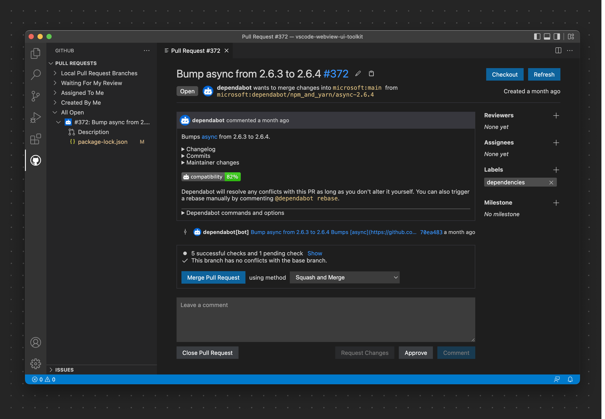
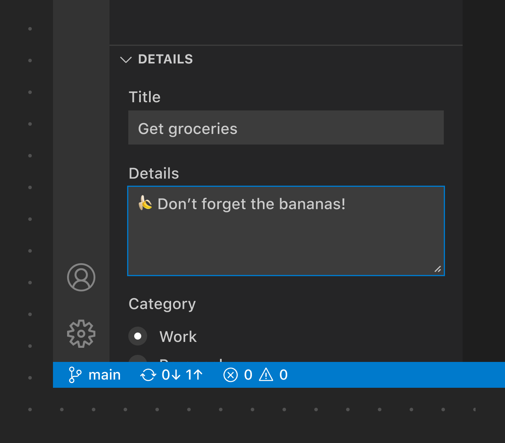

# Webview

如果你需要展示 VS Code API 原生不支持的自定义功能，可以使用 [Webview](/vscode/extension/extension-guides/webview)，它完全可自定义。请注意，Webview 应仅在你确实需要时才使用。

**✔️ 建议**

* 仅在绝对必要时才使用 Webview
* 仅在上下文合适时才激活扩展
* 仅为当前活动窗口打开 Webview
* 确保视图中的所有元素都支持主题化（参见 [webview-view-sample](https://github.com/microsoft/vscode-extension-samples/blob/main/webview-view-sample/media/main.css) 和[颜色令牌](/vscode/extension/references/theme-color)文档）
* 确保你的视图遵循[无障碍指南](/docs/configure/accessibility/accessibility)（颜色对比度、ARIA 标签、键盘导航）
* 在工具栏和视图中使用命令操作

❌ 不建议

* 用于推广（升级、赞助等）
* 用于向导
* 在每个窗口都打开
* 在扩展更新时打开（改为通过通知提醒）
* 添加与编辑器或工作区无关的功能
* 重复已有功能（欢迎页、设置、配置等）

## Webview 示例

**Simple Browser**

此扩展在编辑器侧边打开一个浏览器预览。

*此示例展示了在 VS Code 中开发 VS Code Web 版。Webview 面板被用来渲染一个类似浏览器的窗口。*

**Pull Request**

此扩展在自定义树视图中显示工作区仓库的 Pull Request，并使用 Webview 展示 Pull Request 的详情视图。

## Webview 视图

你还可以将 Webview 放置到任何视图容器（侧边栏或面板）中，这些元素被称为 [Webview 视图](/vscode/extension/references/vscode-api#WebviewView)。Webview 视图同样遵循上述 Webview 指南。

*此 Webview 视图展示了创建 Pull Request 的内容，使用了下拉框、输入框和按钮。*

## 链接

* [Webview 扩展指南](/vscode/extension/extension-guides/webview)
* [Webview 扩展示例](https://github.com/Microsoft/vscode-extension-samples/tree/main/webview-sample)
* [Webview View 扩展示例](https://github.com/microsoft/vscode-extension-samples/tree/main/webview-view-sample)
