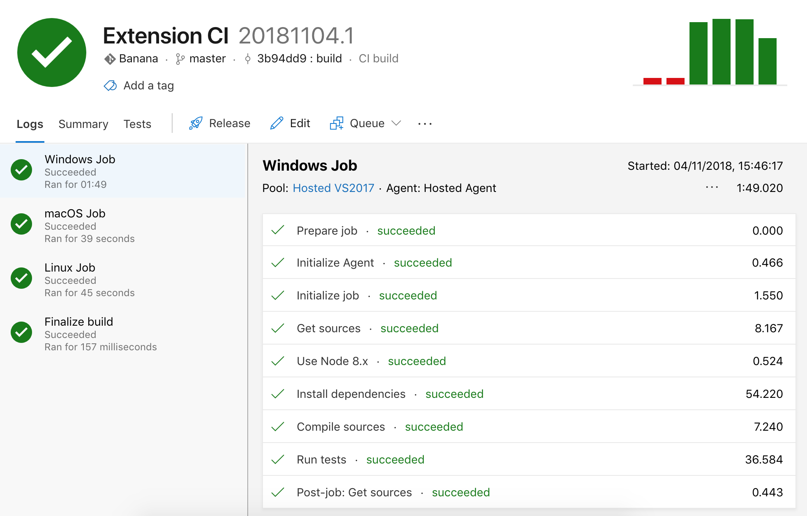

# 持续集成

扩展集成测试可以在 CI 服务上运行。[`@vscode/test-electron`](https://github.com/microsoft/vscode-test) 库可以帮助你在 CI 提供商上设置扩展测试，并包含一个 Azure Pipelines 上的[扩展示例](https://github.com/microsoft/vscode-test/tree/main/sample)配置。你可以查看[构建流水线](https://dev.azure.com/vscode/vscode-test/_build?definitionId=15)，或直接查看 [`azure-pipelines.yml` 文件](https://github.com/microsoft/vscode-test/blob/main/sample/azure-pipelines.yml)。

## 自动发布

你还可以配置 CI 自动发布扩展的新版本。

发布命令与使用 [`vsce`](https://github.com/microsoft/vscode-vsce) 从本地环境发布类似，但你需要以安全的方式提供个人访问令牌（PAT）。通过将 PAT 存储为 `VSCE_PAT` **秘密变量**，`vsce` 就能够使用它。秘密变量永远不会被暴露，因此在 CI 流水线中使用是安全的。

## Azure Pipelines

<a href="https://azure.microsoft.com/services/devops/"></a>

[Azure Pipelines](https://azure.microsoft.com/services/devops/pipelines/) 非常适合运行 VS Code 扩展测试，因为它支持在 Windows、macOS 和 Linux 上运行测试。对于开源项目，你可以获得无限的构建分钟数和 10 个免费并行任务。本节介绍如何设置 Azure Pipelines 来运行你的扩展测试。

首先，在 [Azure DevOps](https://azure.microsoft.com/services/devops/) 上创建一个免费账户，并为你的扩展创建一个 [Azure DevOps 项目](https://azure.microsoft.com/features/devops-projects/)。

然后，将以下 `azure-pipelines.yml` 文件添加到扩展仓库的根目录。除了在无头 Linux CI 机器上运行 VS Code 所需的 `xvfb` 设置脚本之外，这个定义非常直观：

```yaml
trigger:
  branches:
    include:
    - main
  tags:
    include:
    - v*

strategy:
  matrix:
    linux:
      imageName: 'ubuntu-latest'
    mac:
      imageName: 'macos-latest'
    windows:
      imageName: 'windows-latest'

pool:
  vmImage: $(imageName)

steps:

- task: NodeTool@0
  inputs:
    versionSpec: '10.x'
  displayName: 'Install Node.js'

- bash: |
    /usr/bin/Xvfb :99 -screen 0 1024x768x24 > /dev/null 2>&1 &
    echo ">>> Started xvfb"
  displayName: Start xvfb
  condition: and(succeeded(), eq(variables['Agent.OS'], 'Linux'))

- bash: |
    echo ">>> Compile vscode-test"
    yarn && yarn compile
    echo ">>> Compiled vscode-test"
    cd sample
    echo ">>> Run sample integration test"
    yarn && yarn compile && yarn test
  displayName: Run Tests
  env:
    DISPLAY: ':99.0'
```

最后，在你的 DevOps 项目中[创建新的流水线](https://learn.microsoft.com/azure/devops/pipelines/create-first-pipeline)，并指向 `azure-pipelines.yml` 文件。触发构建，大功告成：



你可以启用在推送到分支甚至拉取请求时持续运行构建。参见[构建流水线触发器](https://learn.microsoft.com/azure/devops/pipelines/build/triggers)了解更多。

### Azure Pipelines 自动发布

1. 按照 [Azure DevOps 密钥说明](https://learn.microsoft.com/azure/devops/pipelines/process/variables?tabs=classic%2Cbatch#secret-variables)将 `VSCE_PAT` 设置为秘密变量。
2. 将 `vsce` 安装为 `devDependencies`（`npm install @vscode/vsce --save-dev` 或 `yarn add @vscode/vsce --dev`）。
3. 在 `package.json` 中声明一个 `deploy` 脚本，无需包含 PAT（默认情况下，`vsce` 会使用 `VSCE_PAT` 环境变量作为个人访问令牌）。

```json
"scripts": {
  "deploy": "vsce publish --yarn"
}
```

4. 配置 CI，使构建在创建标签时也会运行：

```yaml
trigger:
  branches:
    include:
    - main
  tags:
    include:
    - refs/tags/v*
```

5. 在 `azure-pipelines.yml` 中添加一个 `publish` 步骤，使用秘密变量调用 `yarn deploy`。

```yaml
- bash: |
    echo ">>> Publish"
    yarn deploy
  displayName: Publish
  condition: and(succeeded(), startsWith(variables['Build.SourceBranch'], 'refs/tags/'), eq(variables['Agent.OS'], 'Linux'))
  env:
    VSCE_PAT: $(VSCE_PAT)
```

[condition](https://learn.microsoft.com/azure/devops/pipelines/process/conditions) 属性告诉 CI 仅在特定情况下运行发布步骤。

在我们的示例中，条件有三个检查：

- `succeeded()` - 仅在测试通过时发布。
- `startsWith(variables['Build.SourceBranch'], 'refs/tags/')` - 仅在标签（发布）构建时发布。
- `eq(variables['Agent.OS'], 'Linux')` - 如果你的构建在多个代理上运行（Windows、Linux 等），则包含此条件。如果不是，请移除该部分。

由于 `VSCE_PAT` 是秘密变量，它不能直接作为环境变量使用。因此，我们需要显式地将环境变量 `VSCE_PAT` 映射到秘密变量。

## GitHub Actions

你也可以配置 GitHub Actions 来运行扩展 CI。在无头 Linux CI 机器上需要 `xvfb` 来运行 VS Code，因此如果当前操作系统是 Linux，则在启用 Xvfb 的环境中运行测试：

```yaml
on:
  push:
    branches:
      - main

jobs:
  build:
    strategy:
      matrix:
        os: [macos-latest, ubuntu-latest, windows-latest]
    runs-on: $\{{ matrix.os }}
    steps:
    - name: Checkout
      uses: actions/checkout@v4
    - name: Install Node.js
      uses: actions/setup-node@v4
      with:
        node-version: 18.x
    - run: npm install
    - run: xvfb-run -a npm test
      if: runner.os == 'Linux'
    - run: npm test
      if: runner.os != 'Linux'
```

### GitHub Actions 自动发布

1. 按照 [GitHub Actions 密钥说明](https://docs.github.com/actions/security-guides/encrypted-secrets#creating-encrypted-secrets-for-a-repository)将 `VSCE_PAT` 设置为加密密钥。
2. 将 `vsce` 安装为 `devDependencies`（`npm install @vscode/vsce --save-dev` 或 `yarn add @vscode/vsce --dev`）。
3. 在 `package.json` 中声明一个 `deploy` 脚本，无需包含 PAT。

```json
"scripts": {
  "deploy": "vsce publish --yarn"
}
```

4. 配置 CI，使构建在创建标签时也会运行：

```yaml
on:
  push:
    branches:
    - main
  release:
    types:
    - created
```

5. 在流水线中添加一个 `publish` 任务，使用秘密变量调用 `npm run deploy`。

```yaml
- name: Publish
  if: success() && startsWith(github.ref, 'refs/tags/') && matrix.os == 'ubuntu-latest'
  run: npm run deploy
  env:
    VSCE_PAT: $\{{ secrets.VSCE_PAT }}
```

[if](https://docs.github.com/actions/using-workflows/workflow-syntax-for-github-actions#jobsjob_idif) 属性告诉 CI 仅在特定情况下运行发布步骤。

在我们的示例中，条件有三个检查：

- `success()` - 仅在测试通过时发布。
- `startsWith(github.ref, 'refs/tags/')` - 仅在标签（发布）构建时发布。
- `matrix.os == 'ubuntu-latest'` - 如果你的构建在多个代理上运行（Windows、Linux 等），则包含此条件。如果不是，请移除该部分。

## GitLab CI

GitLab CI 可用于在无头 Docker 容器中测试和发布扩展。这可以通过拉取预配置的 Docker 镜像，或在流水线期间安装 `xvfb` 和运行 Visual Studio Code 所需的库来实现。

```yaml
image: node:12-buster

before_script:
  - npm install

test:
  script:
    - |
      apt update
      apt install -y libasound2 libgbm1 libgtk-3-0 libnss3 xvfb
      xvfb-run -a npm run test
```

### GitLab CI 自动发布

1. 按照 [GitLab CI 文档](https://docs.gitlab.com/ee/ci/variables/README.html#mask-a-cicd-variable)将 `VSCE_PAT` 设置为掩码变量。
2. 将 `vsce` 安装为 `devDependencies`（`npm install @vscode/vsce --save-dev` 或 `yarn add @vscode/vsce --dev`）。
3. 在 `package.json` 中声明一个 `deploy` 脚本，无需包含 PAT。

```json
"scripts": {
  "deploy": "vsce publish --yarn"
}
```

4. 添加一个 `deploy` 任务，使用掩码变量调用 `npm run deploy`，并且仅在标签时触发。

```yaml
deploy:
  only:
    - tags
  script:
    - npm run deploy
```

## 常见问题

### 持续集成必须使用 Yarn 吗？

以上所有示例都引用了一个假设的使用 [Yarn](https://yarnpkg.com/) 构建的项目，但可以适配为使用 [npm](https://www.npmjs.com/)、[Grunt](https://gruntjs.com/)、[Gulp](https://gulpjs.com/) 或任何其他 JavaScript 构建工具。
