# 发布扩展

当你开发出一个高质量的扩展后，可以将其发布到 [VS Code Extension Marketplace](https://marketplace.visualstudio.com/vscode)，以便其他开发者发现、下载和使用你的扩展。你也可以选择将扩展[打包](#packaging-extensions)为可安装的 VSIX 格式并与其他用户分享。

本文涵盖以下内容：

- 使用 [vsce](#vsce)，VS Code 扩展管理 CLI 工具
- 扩展的[打包](#packaging-extensions)、[发布](#publishing-extensions)和[取消发布](#unpublishing-extensions)
- 发布扩展所需的[注册发布者](#create-a-publisher)

## vsce

[vsce](https://github.com/microsoft/vscode-vsce) 是 "Visual Studio Code Extensions" 的缩写，是一个用于打包、发布和管理 VS Code 扩展的命令行工具。

### 安装

确保你已经安装了 [Node.js](https://nodejs.org/)。然后运行：

```bash
npm install -g @vscode/vsce
```

### 用法

你可以使用 `vsce` 轻松地[打包](#packaging-extensions)和[发布](#publishing-extensions)你的扩展：

```bash
$ cd myExtension
$ vsce package
# 生成 myExtension.vsix
$ vsce publish
# <publisher id>.myExtension 已发布到 VS Code Marketplace
```

`vsce` 还可以搜索、获取元数据和取消发布扩展。要查看所有可用的 `vsce` 命令，请运行 `vsce --help`。

## 发布扩展

---

> [!NOTE]
> 出于安全考虑，`vsce` 不会发布包含用户提供的 SVG 图片的扩展。

发布工具会检查以下约束条件：

- `package.json` 中提供的图标不能是 SVG 格式。
- `package.json` 中提供的徽章不能是 SVG 格式，除非来自[受信任的徽章提供者](/vscode/extension/references/extension-manifest#approved-badges)。
- `README.md` 和 `CHANGELOG.md` 中的图片 URL 必须解析为 `https` URL。
- `README.md` 和 `CHANGELOG.md` 中的图片不能是 SVG 格式，除非来自[受信任的徽章提供者](/vscode/extension/references/extension-manifest#approved-badges)。

---

Visual Studio Code 使用 [Azure DevOps](https://azure.microsoft.com/services/devops/) 作为其 Marketplace 服务。这意味着扩展的身份验证、托管和管理都通过 Azure DevOps 提供。

`vsce` 只能使用[个人访问令牌](https://learn.microsoft.com/azure/devops/organizations/accounts/use-personal-access-tokens-to-authenticate)来发布扩展。你至少需要创建一个令牌才能发布扩展。

### 获取个人访问令牌

你可以通过 Azure DevOps 门户创建个人访问令牌。创建步骤如下：

1. 如果你还没有 Azure DevOps 组织，请按照[创建组织](https://learn.microsoft.com/azure/devops/organizations/accounts/create-organization)文章中的步骤操作。

1. 前往 [Azure DevOps 门户](https://go.microsoft.com/fwlink/?LinkId=307137)，并选择你的组织。

1. 打开个人资料图片旁边的用户设置下拉菜单，选择 **Personal access tokens**：

    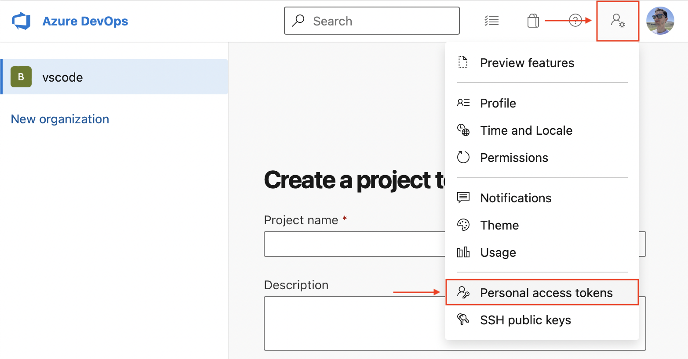

1. 在 **Personal Access Tokens** 页面上，选择 **New Token**：

    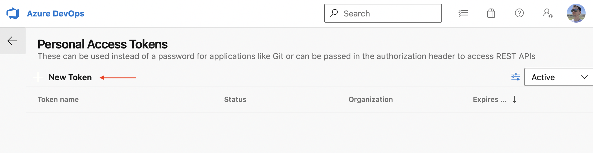

1. 在创建新个人访问令牌的弹窗中，选择以下令牌详情：

    - 名称：你想要的任何令牌名称
    - 组织：**All accessible organizations**
    - 过期时间（可选）：设置令牌的过期日期
    - 范围：**Custom defined**：
      - 点击 **Scopes** 部分下方的 **Show all scopes** 链接
      - 在范围列表中，滚动到 **Marketplace** 并选择 **Manage** 范围

    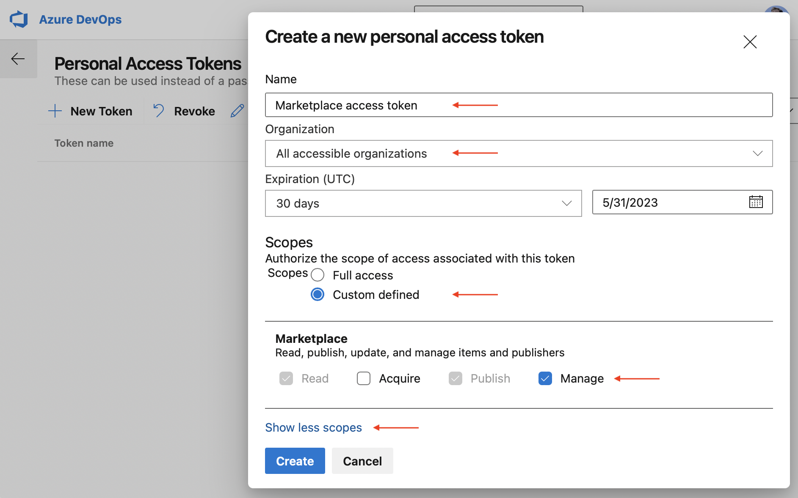

1. 点击 **Create**。

    你将看到新创建的个人访问令牌。请将其**复制**到安全的位置，后续[创建发布者](#create-a-publisher)时需要用到。

### 创建发布者

**发布者**（publisher）是能够将扩展发布到 Visual Studio Code Marketplace 的身份。每个扩展都需要在其 [`package.json` 文件](/vscode/extension/references/extension-manifest)中包含 `publisher` 标识符。

创建发布者的步骤：

1. 前往 [Visual Studio Marketplace 发布者管理页面](https://marketplace.visualstudio.com/manage)。
1. 使用你在上一步中创建[个人访问令牌](#get-a-personal-access-token)时所用的 Microsoft 账户登录。
1. 点击左侧面板中的 **Create publisher**。
1. 在新页面中，指定新发布者的必填参数——标识符和名称（分别是 **ID** 和 **Name** 字段）：

    - **ID**：你在 Marketplace 中的发布者**唯一**标识符，将用于你的扩展 URL。ID 一旦创建便无法更改。
    - **Name**：你的发布者在 Marketplace 中显示的**唯一**名称。可以是你的公司名称或品牌名称。

    以下是 Python 扩展的发布者标识符和名称示例：

    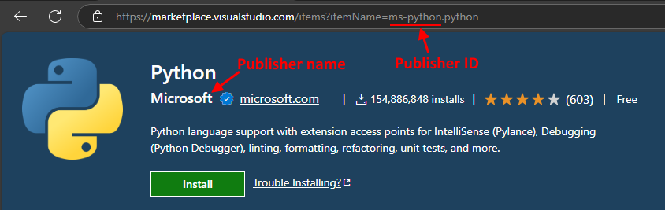

1. 可选地，填写其余字段。
1. 点击 **Create**。
1. 使用 `vsce` 验证新创建的发布者。在终端中运行以下命令，当出现提示时，输入上一步创建的个人访问令牌：

    ```bash
    vsce login <publisher id>

    https://marketplace.visualstudio.com/manage/publishers/
    Personal Access Token for publisher '<publisher id>': ****************************************************

    The Personal Access Token verification succeeded for the publisher '<publisher id>'.
    ```

验证通过后，你就可以发布扩展了。

### 发布扩展

你可以通过两种方式发布扩展：

1. 自动方式，使用 `vsce publish` 命令：

    ```bash
    vsce publish
    ```

    如果你还没有通过上面的 `vsce login` 命令提供个人访问令牌，`vsce` 会提示你输入。

1. 手动方式，使用 `vsce package` 将扩展打包为可安装的 VSIX 格式，然后上传到 [Visual Studio Marketplace 发布者管理页面](https://marketplace.visualstudio.com/manage)：

    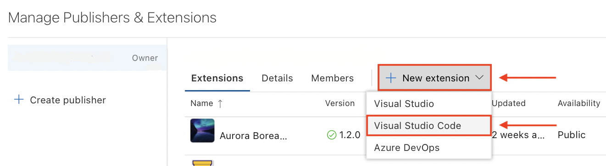

## 查看扩展安装量和评分

[Visual Studio Marketplace 发布者管理页面](https://marketplace.visualstudio.com/manage) 可以让你查看每个扩展的获取趋势、总获取量以及评分和评论。要查看报告，请点击某个扩展或选择 **More Actions > Reports**。

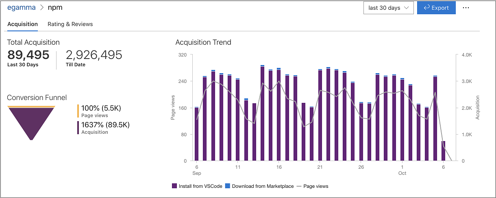

## 自动递增扩展版本

发布扩展时，你可以通过指定兼容 [SemVer](https://semver.org/) 的版本号或版本类型（`major`、`minor` 或 `patch`）来自动递增版本号。例如，要将扩展版本从 1.0.0 更新到 1.1.0，你可以指定：

```bash
vsce publish minor
```

或

```bash
vsce publish 1.1.0
```

这两个命令都会先修改扩展 `package.json` 的 [version](/vscode/extension/references/extension-manifest#fields) 属性，然后以更新后的版本发布。

> [!NOTE]
> 如果你在 git 仓库中运行 `vsce publish`，它还会通过 [npm-version](https://docs.npmjs.com/cli/version#description) 创建一个版本提交和标签。默认的提交消息将是扩展的版本号，但你可以使用 `-m` 标志提供自定义提交消息。（可以在提交消息中使用 `%s` 引用当前版本。）

## 取消发布扩展

你可以通过 [Visual Studio Marketplace 发布者管理页面](https://marketplace.visualstudio.com/manage) 取消发布扩展，点击 **More Actions > Unpublish**：

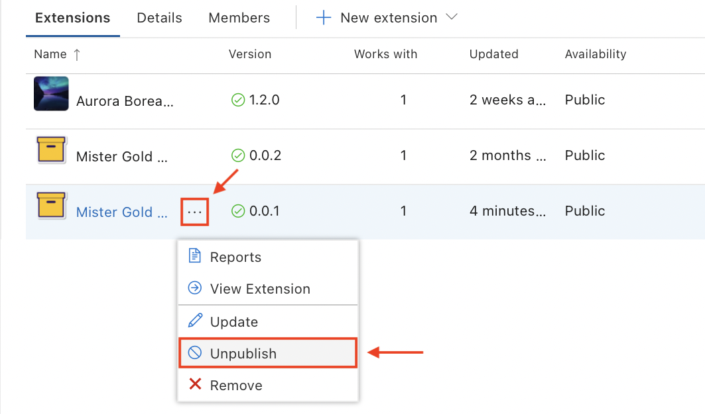

取消发布后，扩展的可用性状态将变为 **Unpublished**，并且不再可以从 Marketplace 和 Visual Studio Code 中下载：

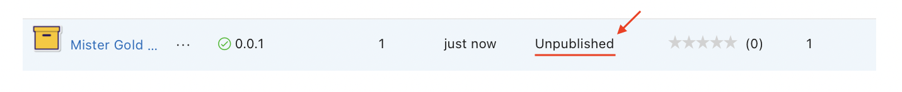

> [!NOTE]
> 当你取消发布扩展时，Marketplace 会保留扩展的统计数据。该扩展仍然可以通过现有 API 被公开发现和访问。

## 删除扩展

你可以通过两种方式删除扩展：

1. 自动方式，使用 [`vsce`](#vsce) 的 `unpublish` 命令：

    ```bash
    vsce unpublish <publisher id>.<extension name>
    ```

1. 手动方式，从 [Visual Studio Marketplace 发布者管理页面](https://marketplace.visualstudio.com/manage) 点击 **More Actions > Remove**：

    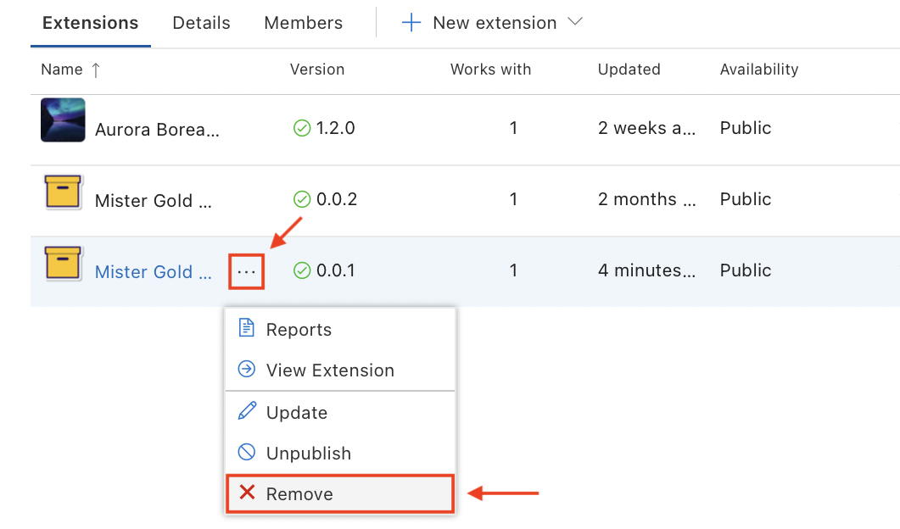

无论哪种方式，系统都会提示你输入扩展名称来确认删除。请注意，删除操作是**不可逆**的。

> [!NOTE]
> 当你删除扩展时，Marketplace 也会删除所有扩展统计数据。你可能更希望取消发布扩展而不是删除它。
> 重要提示！扩展名称是 Visual Studio Code Marketplace 中的唯一标识符。扩展一旦被删除，其扩展名称将被永久保留且无法再次使用，即使是原始发布者也不例外。这有助于保护用户免受冒充，并维护 Marketplace 生态系统的可信度。在删除扩展之前，请确保你不再需要该名称，因为此操作不可逆。

## 弃用扩展

你可以直接弃用扩展，也可以弃用扩展并指定替代扩展或设置。被弃用的扩展在 UI 中将以带有删除线的暗淡文本显示：

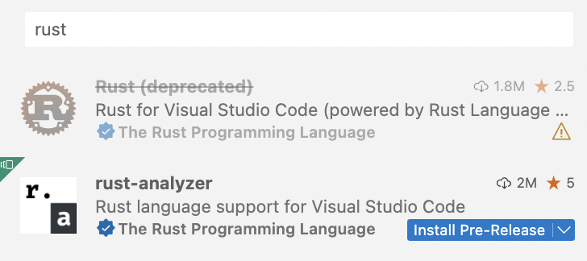

每个被弃用的扩展在其磁贴右下角都有一个黄色警告图标（见上图）。将鼠标悬停在扩展磁贴上时，你可以看到此图标旁边的弃用详情，包括：

- 扩展已被弃用，没有替代方案：

  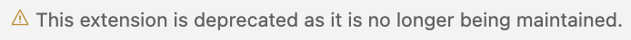

- 扩展已被弃用，推荐使用另一个扩展：

  

- 扩展已被弃用，推荐使用某个设置：

  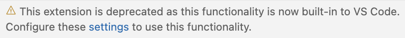

VS Code 不会自动迁移或卸载已安装的已弃用扩展。如果已弃用的扩展有替代扩展或设置，VS Code 会显示一个 **Migrate** 按钮来帮助你快速切换到指定的替代方案：

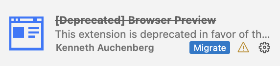

要将你的扩展标记为已弃用，请在 [Deprecated extensions](https://github.com/microsoft/vscode-discussions/discussions/1) 讨论帖中留言。

> [!NOTE]
> 目前，扩展在 Marketplace 中不会显示为已弃用。此功能将在后续提供。

## 打包扩展

如果你想要进行以下操作，可以选择打包扩展：

- 在你的 VS Code 实例上进行测试。
- 不发布到 Marketplace 进行分发。
- 私下与他人分享。

打包意味着创建一个包含你的扩展的 `.vsix` 文件。这个文件随后可以在 VS Code 中安装。一些扩展会将 `.vsix` 文件作为 GitHub Release 的一部分发布。

要打包扩展，在扩展的根文件夹中运行以下命令：

```bash
vsce package
```

此命令会在扩展的根文件夹中创建一个 `.vsix` 文件。例如 `my-extension-0.0.1.vsix`。

对于用户，要在 VS Code 中安装 `.vsix` 文件：

* 从 VS Code 的扩展视图：

  1. 打开扩展视图。
  1. 选择 **Views and More Actions...**
  1. 选择 **Install from VSIX...**

* 从命令行：

  ```bash
  # 如果你使用 VS Code
  code --install-extension my-extension-0.0.1.vsix

  # 如果你使用 VS Code Insiders
  code-insiders --install-extension my-extension-0.0.1.vsix
  ```

## 你的扩展文件夹

要加载扩展，你需要将文件复制到 VS Code 的扩展文件夹 `.vscode/extensions`。根据你的操作系统，此文件夹的位置不同：

- **Windows:** `%USERPROFILE%\.vscode\extensions`
- **macOS:** `~/.vscode/extensions`
- **Linux:** `~/.vscode/extensions`

## Visual Studio Code 兼容性

开发扩展时，你必须指定扩展兼容的 VS Code 版本。为此，请在 `package.json` 中使用 `engines.vscode` 属性：

```json
{
  "engines": {
    "vscode": "^1.8.0"
  }
}
```

- 值为 `1.8.0`（不带脱字符）表示你的扩展仅兼容 VS Code `1.8.0`。
- 值为 `^1.8.0` 表示你的扩展兼容 VS Code `1.8.0` 及更高版本，包括 `1.8.1`、`1.9.0` 等。

你可以使用 `engines.vscode` 属性来确保扩展仅在包含你所依赖的 API 的客户端上安装。此机制同时适用于稳定版和 Insiders 版本。

例如，假设 VS Code 的最新稳定版本是 `1.8.0`。在开发 `1.9.0` 版本期间，引入了新的 API，并通过 `1.9.0-insider` 版本在 Insiders 版中提供。如果你想发布一个使用了此 API 的扩展版本，你应该将版本依赖指定为 `^1.9.0`。这样，你的新扩展版本将仅在 VS Code `>=1.9.0` 上可用（换言之，仅当前 Insiders 版本的用户可以使用）。稳定版用户只有在稳定版达到 `1.9.0` 时才能获得更新。

## 高级用法

### Marketplace 集成

你可以自定义扩展在 Visual Studio Marketplace 中的展示效果。参见 [Go 扩展](https://marketplace.visualstudio.com/items/golang.go) 作为示例。

以下是一些让扩展在 Marketplace 上展示得更好的技巧：

- 在扩展根目录添加 `README.md` 文件，内容将显示在扩展的 Marketplace 页面上。

  > [!NOTE]
  > 如果你的 `package.json` 中有一个指向公共 GitHub 仓库的 `repository` 属性，`vsce` 会自动检测它并相应地调整相对链接，默认使用 `main` 分支。你可以在运行 `vsce package` 或 `vsce publish` 时使用 `--githubBranch` 标志覆盖此设置。你还可以使用 `--baseContentUrl` 和 `--baseImagesUrl` 标志设置链接和图片的基础 URL。

- 在扩展根目录添加 `LICENSE` 文件，包含扩展的许可证信息。
- 在扩展根目录添加 `CHANGELOG.md` 文件，包含扩展的变更历史信息。
- 在扩展根目录添加 `SUPPORT.md` 文件，包含扩展的支持获取方式信息。
- 通过在 `package.json` 中指定 `galleryBanner.color` 属性的十六进制值来设置 Marketplace 页面上的横幅背景色。
- 通过在 `package.json` 中指定 `icon` 属性为扩展中包含的至少 128x128 像素的 PNG 文件的相对路径来设置图标。

更多信息请参见 [Marketplace 展示技巧](/vscode/extension/references/extension-manifest#marketplace-presentation-tips)。

### 验证发布者

你可以通过验证与你品牌或身份关联的[合格域名](#eligible-domains)的所有权来成为**已验证发布者**。一旦你的发布者通过验证，Marketplace 将在你的扩展详情中添加验证徽章。

#### 前提条件
要成为已验证发布者，发布者必须在 VS Marketplace 上拥有一个或多个扩展至少 6 个月，且域名的注册时间也必须至少 6 个月。请等到满足这些条件后再申请验证。

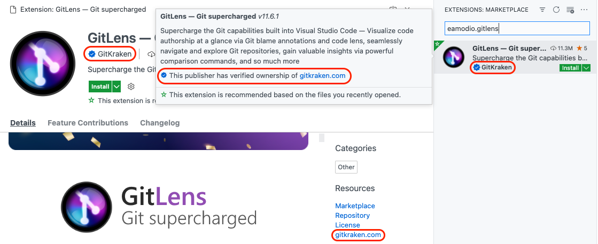

验证发布者的步骤：

1. 前往 [Visual Studio Marketplace 发布者管理页面](https://marketplace.visualstudio.com/manage)。
2. 在左侧面板中，选择或[创建](#create-a-publisher)你想要验证的发布者。
3. 在主面板中，选择 **Details** 选项卡。

   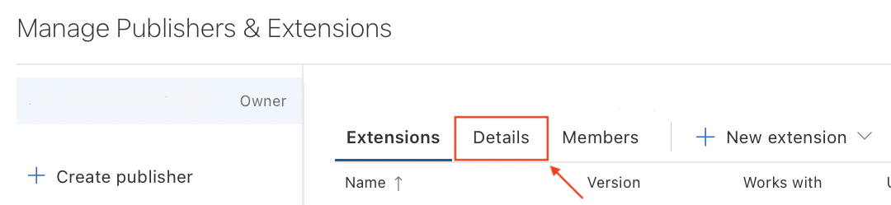

4. 在 **Details 选项卡** 中，在 **Verified domain** 部分下，输入一个[合格域名](#eligible-domains)。

   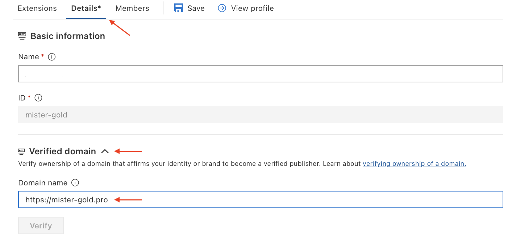

   > **注意**：开始输入后，你会看到 **Details** 选项卡标题旁出现一个星号（*）。与 VS Code 中一样，这表示你有未保存的更改。出于同样的原因，**Verify** 按钮目前处于禁用状态。

5. 选择 **Save**，然后选择 **Verify**。

   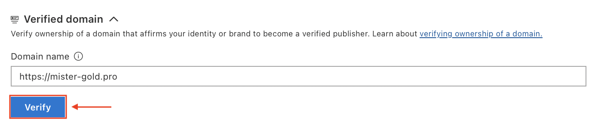

   将会出现一个对话框，提供有关将 TXT 记录添加到域名 DNS 配置的说明。

   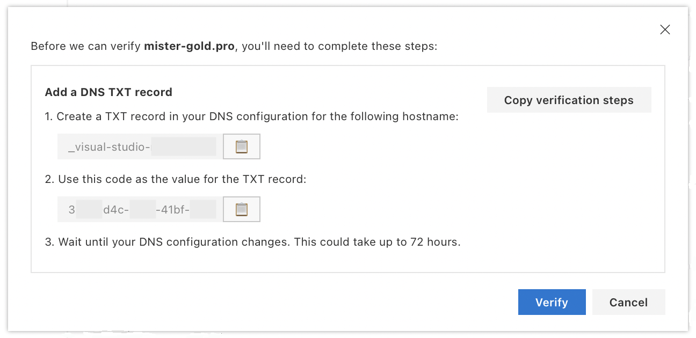

6. 按照说明将 TXT 记录添加到你的域名 DNS 配置中。
7. 在对话框中选择 **Verify** 以验证 TXT 记录是否已成功添加。

   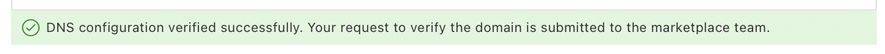

   你的 TXT 记录通过验证后，Marketplace 团队将审核你的请求，并在 5 个工作日内告知你结果。验证内容包括但不限于：域名、网站和扩展的[前提条件](#prerequisites)记录、内容合规性、合法性和积极声誉。

如果验证通过，你将在 Visual Studio Marketplace 发布者管理页面中看到发布者名称旁边显示相应的徽章：

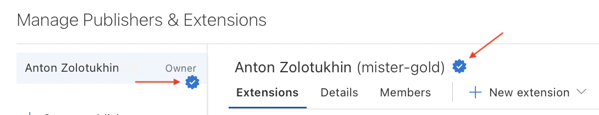

> **注意**：
> - 对发布者显示名称的任何更改都将撤销验证徽章。
> - 任何未来违反[使用条款](https://cdn.vsassets.io/v/M190_20210811.1/_content/Microsoft-Visual-Studio-Marketplace-Terms-of-Use.pdf)或上述验证要求的行为都将撤销验证徽章。

### 合格域名

合格域名需满足以下条件：

- 你必须能够管理 DNS 配置设置并添加 TXT 记录。
- 不能是子域名（{subdomain}.github.io、{subdomain}.contoso.com 等）。
- 必须使用 HTTPS 协议。
- 必须能够对 HEAD 请求响应 HTTP 200 状态码。

### 扩展定价标签

你可以选择在扩展的 Marketplace 页面上显示定价标签，以标明扩展是 `Free`（免费）或 `Free Trial`（免费试用）。

要显示定价标签，请在 `package.json` 中添加 `pricing` 属性。例如：

```json
{
  "pricing": "Free"
}
```

允许的值为：`Free` 和 `Trial`（区分大小写）。当未指定 `pricing` 属性时，默认值为 `Free`。

> [!NOTE]
> 发布扩展时请确保使用 `vsce` 版本 >= `2.10.0`，以使定价标签正常工作。

### 扩展赞助

你可以选择启用赞助功能，让你的用户有机会支持你的工作。

要显示赞助链接，请在 `package.json` 中添加 `sponsor` 属性。例如：

```json
"sponsor": {
  "url": "https://github.com/sponsors/nvaccess"
}
```

> [!NOTE]
> 发布扩展时请确保使用 `vsce` 版本 >= `2.9.1`，以使赞助功能正常工作。

赞助链接将显示在 Marketplace 和 VS Code 中扩展详情页的头部：

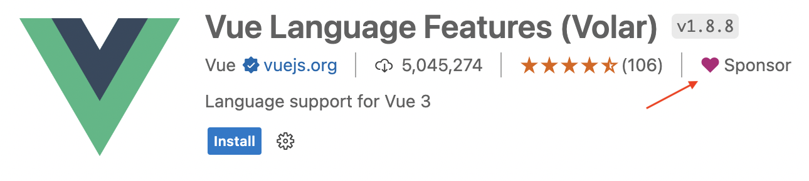

我们希望这能让用户资助他们所依赖的扩展，从而提升扩展的性能、可靠性和稳定性。

### 使用 .vscodeignore

你可以创建一个 `.vscodeignore` 文件来防止某些文件被包含在扩展包中。此文件是每行一个 [glob](https://github.com/isaacs/minimatch) 模式的集合。例如：

```bash
**/*.ts
**/tsconfig.json
!file.ts
```

你应该忽略运行时不需要的所有文件。例如，如果你的扩展是用 TypeScript 编写的，你应该忽略所有 `**/*.ts` 文件，如上例所示。

> [!NOTE]
> `devDependencies` 中列出的开发依赖会被自动忽略，因此你不需要显式添加它们。

### 预发布步骤

你可以在清单文件中添加预发布步骤，该步骤将在每次打包扩展时被调用。例如，你可能希望在此阶段调用 [TypeScript](https://www.typescriptlang.org/) 编译器：

```json
{
  "name": "uuid",
  "version": "0.0.1",
  "publisher": "someone",
  "engines": {
    "vscode": "0.10.x"
  },
  "scripts": {
    "vscode:prepublish": "tsc"
  }
}
```

### 预发布版扩展

用户可以在 VS Code 或 VS Code Insiders 中安装扩展的预发布版本，以便在正式发布前定期获取最新的扩展版本。

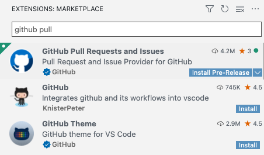

要发布预发布版本，请在 `vsce package` 或 `vsce publish` 命令中传入 `--pre-release` 标志：

```bash
vsce package --pre-release
vsce publish --pre-release
```

我们仅支持 `major.minor.patch` 格式的扩展版本，**不支持** `semver` 预发布标签。预发布版和正式发布版的版本号必须不同。也就是说，如果 `1.2.3` 已作为预发布版上传，则下一个正式发布版必须使用不同的版本号上传，例如 `1.2.4`。完整的 `semver` 支持将在未来提供。

VS Code 会自动将扩展更新到可用的最高版本，因此即使用户选择了预发布版本，如果有一个更高版本号的正式发布版，用户也会被更新到正式发布版。因此，我们建议扩展使用 `major.偶数.patch` 作为发布版本，使用 `major.奇数.patch` 作为预发布版本。例如：`0.2.*` 用于正式发布，`0.3.*` 用于预发布。

如果扩展作者不希望其预发布用户被更新到正式发布版，我们建议始终在发布正式版本之前递增并发布新的预发布版本，以确保预发布版本号始终更高。请注意，虽然预发布用户在正式版本号更高时会被更新到正式版本，但他们仍然有资格自动更新到版本号高于正式版本的后续预发布版本。

预发布版扩展从 VS Code `1.63.0` 版本开始支持，因此所有预发布版扩展都应将其 `package.json` 中的 `engines.vscode` 值设置为 `>= 1.63.0`。

> [!NOTE]
> 已经有独立预发布版扩展的扩展应联系 VS Code 团队，以启用自动卸载过时的独立扩展并安装主扩展预发布版本的功能。

### 平台特定扩展

你可以为 VS Code 运行的每个平台（Windows、Linux、macOS）发布扩展的 VSIX 包。我们称此类扩展为**平台特定扩展**。

从 `1.61.0` 版本开始，VS Code 会查找与当前平台匹配的扩展包。

如果你的扩展包含平台特定的库或依赖项，平台特定扩展就非常有用，因为你可以控制平台包中包含的确切二进制文件。常见的使用场景是使用**原生 Node 模块**。

平台特定扩展作为包含平台特定内容的独立包发布。你可以通过传入 [`--target` 标志](#publishing)来指定目标平台。如果你不传入此标志，该包将作为所有没有平台特定包的平台的回退包。

目前可用的平台有：`win32-x64`、`win32-arm64`、`linux-x64`、`linux-arm64`、`linux-armhf`、`alpine-x64`、`alpine-arm64`、`darwin-x64`、`darwin-arm64` 和 `web`。

如果你希望平台特定扩展也能作为 [Web 扩展](/vscode/extension/extension-guides/web-extensions)在浏览器中运行，发布时**必须**以 `web` 平台为目标。`web` 平台遵循 `package.json` 中的 `browser` 入口点。对于在 `web` 中不支持的扩展功能，我们建议在 `package.json` 中使用 `when` 子句，而不是为 web 平台提供单独的 `package.json` 或移除 VSIX 中在 `web` 中无法工作的部分。

#### 发布

从 `1.99.0` 版本开始，[vsce](https://github.com/microsoft/vscode-vsce) 支持 `--target` 参数，允许你在打包和发布 VSIX 时指定目标平台。

以下是如何为 `win32-x64` 和 `win32-arm64` 平台发布 VSIX 的示例：

```bash
vsce publish --target win32-x64 win32-arm64
```

或者，你也可以在打包时使用 `--target` 标志来创建平台特定的 VSIX。例如，为 `win32-x64` 平台打包 VSIX 然后发布：

```bash
vsce package --target win32-x64
vsce publish --packagePath PATH_TO_WIN32X64_VSIX
```

#### 持续集成

管理多个平台特定的 VSIX 可能会变得繁琐，因此我们建议使用[持续集成](/vscode/extension/working-with-extensions/continuous-integration)（CI）工具来自动化扩展的构建过程。例如，你可以使用 [GitHub Actions](https://github.com/features/actions) 来构建扩展。我们的[平台特定扩展示例](https://github.com/microsoft/vscode-platform-specific-sample)可以作为学习的起点：其[工作流](https://github.com/microsoft/vscode-platform-specific-sample/blob/main/.github/workflows/ci.yml)实现了使用平台特定扩展支持来跨所有受支持的 VS Code 目标分发原生 Node 模块的常见场景。

## 下一步

- [Extension Marketplace](/docs/configure/extensions/extension-marketplace) - 了解更多关于 VS Code 公共 Extension Marketplace 的信息。
- [测试扩展](/vscode/extension/working-with-extensions/testing-extension) - 为你的扩展项目添加测试以确保高质量。
- [打包扩展](/vscode/extension/working-with-extensions/bundling-extension) - 使用 webpack 打包扩展文件以提升加载速度。

## 常见问题

### 尝试发布扩展时出现 "You exceeded the number of allowed tags of 30" 错误？

Visual Studio Marketplace 不允许扩展包在 `package.json` 中包含超过 30 个 `keywords`。请将关键字/标签数量限制在最多 30 个以避免此错误。

### 尝试发布扩展时出现 403 Forbidden（或 401 Unauthorized）错误？

创建 PAT（个人访问令牌）时的一个常见错误是在 **Organizations** 字段下拉菜单中选择了特定组织而不是 **All accessible organizations**。另一个可能的错误是范围不正确——你应该将授权范围设置为 `Marketplace (Manage)` 才能正常发布。

### 无法通过 `vsce` 工具取消发布扩展？

你可能更改了扩展 ID 或发布者 ID。你也可以直接通过 [Visual Studio Marketplace 发布者管理页面](https://marketplace.visualstudio.com/manage) 管理你的扩展，例如更新或[取消发布](#unpublishing-extensions)。

### 为什么 vsce 不保留文件属性？

请注意，在 Windows 上构建和发布扩展时，扩展包中包含的所有文件将缺少 POSIX 文件属性，即可执行位。某些 `node_modules` 依赖项需要这些属性才能正常工作。从 Linux 和 macOS 发布则没有此问题。

### 我可以从持续集成（CI）构建中发布吗？

可以，请参阅[持续集成](/vscode/extension/working-with-extensions/continuous-integration)主题中的[自动发布](/vscode/extension/working-with-extensions/continuous-integration#automated-publishing)部分，了解如何配置 Azure DevOps、GitHub Actions 和 GitLab CI 以自动将你的扩展发布到 Marketplace。

### 尝试发布扩展时出现 "ERROR The extension 'name' already exists in the Marketplace" 错误？

Marketplace 要求每个扩展的[扩展名称](/vscode/extension/references/extension-manifest)必须是唯一的。如果 Marketplace 中已存在同名扩展，你将看到以下错误：

```
ERROR The extension 'name' already exists in the Marketplace.
```

同样的规则也适用于扩展的[显示名称](/vscode/extension/references/extension-manifest)。

### 支持哪些包管理器？

你可以使用 npm 或 yarn v1 来管理扩展的依赖。

### 我需要关于 VS Marketplace 账户的帮助或扩展发布方面的支持？

你可以通过登录 [Manage Publishers & Extensions](https://marketplace.visualstudio.com/manage) 并点击右上角的 "Contact Microsoft" 链接来联系 VS Marketplace 支持团队。
